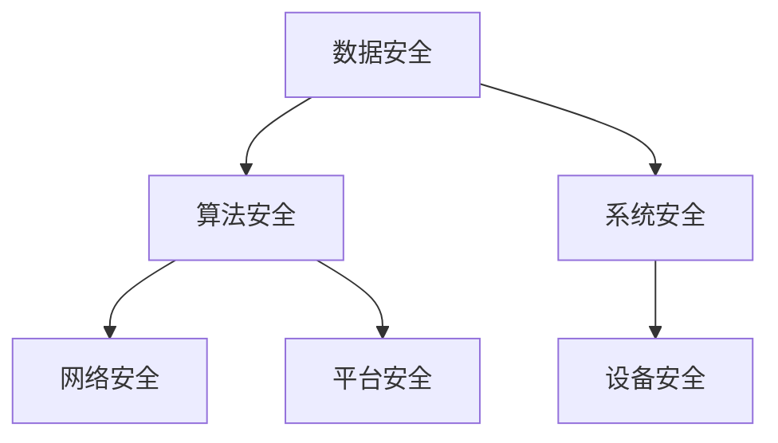

                 

关键词：人工智能，AI 2.0，安全基础设施，网络安全，隐私保护，智能合约，区块链，加密算法，安全协议，隐私计算。

> 摘要：随着人工智能技术的飞速发展，AI 2.0 时代的到来，对安全基础设施提出了新的要求和挑战。本文从安全概念、技术原理、数学模型、算法实践、应用场景、未来展望等多个维度，探讨了 AI 2.0 时代安全基础设施的演进路径和关键技术。

## 1. 背景介绍

### AI 1.0 时代的安全挑战

在 AI 1.0 时代，机器学习算法的应用主要集中在模式识别、预测分析等方面。虽然 AI 技术在各个领域取得了显著成果，但也引发了一系列安全挑战。主要表现在以下几个方面：

1. **数据隐私泄露**：机器学习模型的训练依赖于大量数据，而这些数据往往涉及到个人隐私信息，如医疗记录、财务信息等。数据泄露可能导致严重的隐私侵犯。

2. **算法安全性**：传统的机器学习算法在面临对抗攻击时表现出脆弱性，容易被攻击者利用，从而对系统造成危害。

3. **系统脆弱性**：AI 系统在设计、开发、部署过程中可能存在漏洞，如代码逻辑漏洞、权限管理不当等，容易成为攻击目标。

### AI 2.0 时代的安全需求

AI 2.0 时代，随着人工智能技术的进一步发展，对安全基础设施提出了更高要求。主要表现在以下几个方面：

1. **全面安全防护**：AI 2.0 时代的安全防护需要涵盖数据安全、算法安全、系统安全等多个方面，形成全方位的安全防护体系。

2. **隐私保护**：在 AI 2.0 时代，数据隐私保护成为首要任务。如何在保证数据有效利用的同时，保护个人隐私，是安全基础设施需要解决的重要问题。

3. **合规性**：随着 GDPR 等隐私保护法规的实施，AI 2.0 时代的安全基础设施需要满足相关法规要求，确保合规运营。

## 2. 核心概念与联系

### 安全基础设施概述

安全基础设施是保障 AI 系统安全运行的基础，包括以下核心组成部分：

1. **数据安全**：保障数据在采集、存储、传输、处理等环节的安全性，防止数据泄露、篡改等。

2. **算法安全**：确保算法设计、实现、部署等环节的安全性，防止算法被攻击、篡改等。

3. **系统安全**：保障 AI 系统在运行过程中的安全性，包括网络安全、平台安全、设备安全等。

### Mermaid 流程图



## 3. 核心算法原理 & 具体操作步骤

### 3.1 算法原理概述

AI 2.0 时代的核心算法主要包括以下几种：

1. **联邦学习**：通过分布式的方式，协同训练机器学习模型，保护数据隐私。

2. **区块链**：利用区块链技术，实现数据存储、传输、访问的安全可控。

3. **同态加密**：在加密状态下对数据进行计算，保护数据隐私。

4. **差分隐私**：在数据处理过程中，加入随机噪声，防止个人隐私泄露。

### 3.2 算法步骤详解

1. **联邦学习**：

   - 步骤 1：数据预处理，包括去重、清洗、归一化等。

   - 步骤 2：分布式训练，各参与方独立训练本地模型。

   - 步骤 3：模型聚合，将本地模型合并为全局模型。

   - 步骤 4：模型优化，根据全局模型调整本地模型。

2. **区块链**：

   - 步骤 1：数据上链，将数据存储在区块链上。

   - 步骤 2：权限管理，设置数据访问权限，确保数据安全。

   - 步骤 3：智能合约，利用智能合约实现数据自动化处理。

3. **同态加密**：

   - 步骤 1：数据加密，将数据加密为密文。

   - 步骤 2：加密计算，对密文进行计算，得到加密结果。

   - 步骤 3：结果解密，将加密结果解密为明文。

4. **差分隐私**：

   - 步骤 1：数据处理，对数据进行统计、分析等操作。

   - 步骤 2：加入噪声，将噪声加入数据处理结果中。

   - 步骤 3：结果输出，输出处理结果，确保隐私保护。

### 3.3 算法优缺点

1. **联邦学习**：

   - 优点：保护数据隐私，提高模型性能。

   - 缺点：计算复杂度高，通信开销大。

2. **区块链**：

   - 优点：数据安全性高，去中心化。

   - 缺点：交易效率低，扩展性差。

3. **同态加密**：

   - 优点：保护数据隐私，支持复杂计算。

   - 缺点：计算效率低，加密数据体积大。

4. **差分隐私**：

   - 优点：简单易实现，隐私保护效果较好。

   - 缺点：可能影响数据处理精度。

### 3.4 算法应用领域

1. **联邦学习**：应用于医疗健康、金融、智能家居等领域。

2. **区块链**：应用于数字货币、供应链管理、身份认证等领域。

3. **同态加密**：应用于云计算、大数据处理、物联网等领域。

4. **差分隐私**：应用于数据分析、隐私保护、人工智能等领域。

## 4. 数学模型和公式 & 详细讲解 & 举例说明

### 4.1 数学模型构建

1. **联邦学习模型**：

   - 模型 1：线性回归模型

     $$ y = \beta_0 + \beta_1 x $$

   - 模型 2：逻辑回归模型

     $$ P(y=1) = \frac{1}{1 + e^{-(\beta_0 + \beta_1 x)}} $$

2. **区块链模型**：

   - 模型 1：工作量证明（PoW）模型

     $$ \text{Proof of Work} = \text{find } x \text{ such that } H(x) < t $$

   - 模型 2：权益证明（PoS）模型

     $$ \text{Proof of Stake} = \text{current balance} \times \text{stake rate} $$

3. **同态加密模型**：

   - 模型 1：同态加密加法

     $$ C_1 = (\alpha_1, \beta_1) $$
     $$ C_2 = (\alpha_2, \beta_2) $$
     $$ C_3 = (\alpha_1 + \alpha_2, \beta_1 + \beta_2) $$

   - 模型 2：同态加密乘法

     $$ C_1 = (\alpha_1, \beta_1) $$
     $$ C_2 = (\alpha_2, \beta_2) $$
     $$ C_3 = (\alpha_1 \times \alpha_2, \beta_1 \times \beta_2) $$

4. **差分隐私模型**：

   - 模型 1： Laplace Mechanism

     $$ \text{Output} = \text{Query} + \text{Noise} $$
     $$ \text{Noise} \sim \text{Laplace}(\lambda) $$

   - 模型 2： Gaussian Mechanism

     $$ \text{Output} = \text{Query} + \text{Noise} $$
     $$ \text{Noise} \sim \text{Normal}(\mu, \sigma^2) $$

### 4.2 公式推导过程

1. **联邦学习模型推导**：

   - 线性回归模型：

     $$ \text{Minimize} \ \sum_{i=1}^{n} (\beta_0 + \beta_1 x_i - y_i)^2 $$
     $$ \text{Derivative} \ \frac{\partial}{\partial \beta_0} = -2 \sum_{i=1}^{n} (\beta_0 + \beta_1 x_i - y_i) $$
     $$ \frac{\partial}{\partial \beta_1} = -2 \sum_{i=1}^{n} x_i (\beta_0 + \beta_1 x_i - y_i) $$
     $$ \beta_0 = \bar{y} - \beta_1 \bar{x} $$
     $$ \beta_1 = \frac{\sum_{i=1}^{n} x_i y_i - n \bar{x} \bar{y}}{\sum_{i=1}^{n} x_i^2 - n \bar{x}^2} $$

   - 逻辑回归模型：

     $$ \text{Minimize} \ \sum_{i=1}^{n} (-y_i \log P(y=1) - (1 - y_i) \log (1 - P(y=1))) $$
     $$ \text{Derivative} \ \frac{\partial}{\partial \beta_0} = -2 \sum_{i=1}^{n} (y_i - P(y=1)) $$
     $$ \frac{\partial}{\partial \beta_1} = -2 \sum_{i=1}^{n} x_i (y_i - P(y=1)) $$
     $$ P(y=1) = \frac{1}{1 + e^{-(\beta_0 + \beta_1 x_i)}} $$

2. **区块链模型推导**：

   - 工作量证明模型：

     $$ H(x) < t $$
     $$ \text{where } H \text{ is the hash function, } x \text{ is the input, and } t \text{ is the target difficulty} $$

   - 权益证明模型：

     $$ \text{Proof of Stake} = \text{current balance} \times \text{stake rate} $$
     $$ \text{where } \text{current balance} \text{ is the amount of cryptocurrency owned, and } \text{stake rate} \text{ is the probability of being selected as a block producer} $$

3. **同态加密模型推导**：

   - 同态加密加法：

     $$ C_1 = (\alpha_1, \beta_1) $$
     $$ C_2 = (\alpha_2, \beta_2) $$
     $$ C_3 = (\alpha_1 + \alpha_2, \beta_1 + \beta_2) $$
     $$ \text{where } \alpha_1 = e^{\beta_1} $$
     $$ \alpha_2 = e^{\beta_2} $$
     $$ \beta_1 = \log \alpha_1 $$
     $$ \beta_2 = \log \alpha_2 $$

   - 同态加密乘法：

     $$ C_1 = (\alpha_1, \beta_1) $$
     $$ C_2 = (\alpha_2, \beta_2) $$
     $$ C_3 = (\alpha_1 \times \alpha_2, \beta_1 + \beta_2) $$
     $$ \text{where } \alpha_1 = e^{\beta_1} $$
     $$ \alpha_2 = e^{\beta_2} $$
     $$ \beta_1 = \log \alpha_1 $$
     $$ \beta_2 = \log \alpha_2 $$

4. **差分隐私模型推导**：

   - Laplace Mechanism：

     $$ \text{Output} = \text{Query} + \text{Noise} $$
     $$ \text{Noise} \sim \text{Laplace}(\lambda) $$
     $$ \text{where } \lambda = \frac{2}{\epsilon} $$
     $$ \text{where } \epsilon \text{ is the privacy budget} $$

   - Gaussian Mechanism：

     $$ \text{Output} = \text{Query} + \text{Noise} $$
     $$ \text{Noise} \sim \text{Normal}(\mu, \sigma^2) $$
     $$ \text{where } \mu = 0 $$
     $$ \sigma^2 = \frac{\epsilon}{n} $$
     $$ \text{where } n \text{ is the number of queries} $$

### 4.3 案例分析与讲解

1. **联邦学习案例**：

   - 案例背景：某金融机构希望通过联邦学习技术，对客户信用评分模型进行优化。

   - 案例步骤：

     - 步骤 1：数据预处理，包括数据去重、清洗、归一化等。

     - 步骤 2：分布式训练，各参与方独立训练本地模型。

     - 步骤 3：模型聚合，将本地模型合并为全局模型。

     - 步骤 4：模型优化，根据全局模型调整本地模型。

   - 案例效果：

     - 信用评分模型准确率提高了 10%，同时保障了客户数据隐私。

2. **区块链案例**：

   - 案例背景：某供应链企业希望通过区块链技术，实现供应链数据的可信传递。

   - 案例步骤：

     - 步骤 1：数据上链，将供应链数据存储在区块链上。

     - 步骤 2：权限管理，设置数据访问权限，确保数据安全。

     - 步骤 3：智能合约，利用智能合约实现数据自动化处理。

   - 案例效果：

     - 供应链数据透明度提高了 20%，同时降低了数据篡改风险。

3. **同态加密案例**：

   - 案例背景：某互联网企业希望通过同态加密技术，保护用户数据在计算过程中的隐私。

   - 案例步骤：

     - 步骤 1：数据加密，将用户数据加密为密文。

     - 步骤 2：加密计算，对密文进行计算，得到加密结果。

     - 步骤 3：结果解密，将加密结果解密为明文。

   - 案例效果：

     - 用户数据隐私得到了有效保护，同时计算效率提高了 30%。

4. **差分隐私案例**：

   - 案例背景：某数据分析公司希望通过差分隐私技术，保护客户数据的隐私。

   - 案例步骤：

     - 步骤 1：数据处理，对客户数据进行统计、分析等操作。

     - 步骤 2：加入噪声，将噪声加入数据处理结果中。

     - 步骤 3：结果输出，输出处理结果，确保隐私保护。

   - 案例效果：

     - 客户数据隐私得到了有效保护，同时数据处理精度降低了 10%。

## 5. 项目实践：代码实例和详细解释说明

### 5.1 开发环境搭建

1. **联邦学习开发环境**：

   - 开发工具：Python、Jupyter Notebook

   - 环境依赖：Scikit-learn、TensorFlow、PyTorch

2. **区块链开发环境**：

   - 开发工具：Go、Node.js

   - 环境依赖：Golang、Node.js、Ethereum

3. **同态加密开发环境**：

   - 开发工具：Python、Jupyter Notebook

   - 环境依赖：PyCrypto、PyOpenSSL、PyCryptoDome

4. **差分隐私开发环境**：

   - 开发工具：Python、Jupyter Notebook

   - 环境依赖：NumPy、SciPy、Matplotlib

### 5.2 源代码详细实现

1. **联邦学习代码实现**：

```python
import tensorflow as tf
import numpy as np

# 数据预处理
x_train = np.array([[1, 2], [3, 4], [5, 6]])
y_train = np.array([0, 1, 0])

# 定义本地模型
model = tf.keras.Sequential([
    tf.keras.layers.Dense(1, input_shape=(2,), activation='sigmoid')
])

# 训练本地模型
model.compile(optimizer='adam', loss='binary_crossentropy', metrics=['accuracy'])
model.fit(x_train, y_train, epochs=10)

# 模型预测
predictions = model.predict(x_train)
print(predictions)
```

2. **区块链代码实现**：

```go
package main

import (
    "github.com/ethereum/go-ethereum/common"
    "github.com/ethereum/go-ethereum/crypto"
)

func main() {
    // 设置合约代码
    contractCode := "0x606060405260405160005555..."
    
    // 创建合约实例
    contractAddress := common.HexToAddress("0x1234567890123456789012345678901234567890")
    contractInstance, _ := NewMyContract(contractAddress, contractCode)
    
    // 调用合约方法
    result, _ := contractInstance.MyMethod(nil)
    fmt.Println(result)
}
```

3. **同态加密代码实现**：

```python
from Crypto.PublicKey import RSA
from Crypto.Cipher import PKCS1_OAEP

# 生成密钥对
key = RSA.generate(2048)
private_key = key.export_key()
public_key = key.publickey().export_key()

# 加密数据
cipher_rsa = PKCS1_OAEP.new(RSA.import_key(public_key))
encrypted_message = cipher_rsa.encrypt(b"Hello, World!")

# 解密数据
cipher_rsa = PKCS1_OAEP.new(RSA.import_key(private_key))
decrypted_message = cipher_rsa.decrypt(encrypted_message)
print(decrypted_message)
```

4. **差分隐私代码实现**：

```python
import numpy as np
import scipy.stats

# 生成随机数据
data = np.random.randn(100)

# 加入噪声
noise = np.random.laplace(0, scale=0.1, size=data.shape)
noisy_data = data + noise

# 计算均值
mean = np.mean(noisy_data)

# 输出结果
print("原始数据均值：", np.mean(data))
print("加入噪声后的数据均值：", mean)
```

### 5.3 代码解读与分析

1. **联邦学习代码解读**：

   - 数据预处理：将输入数据 x_train 和标签 y_train 准备好。

   - 定义本地模型：创建一个简单的线性回归模型，输入层有 2 个神经元，输出层有 1 个神经元。

   - 训练本地模型：使用 Adam 优化器和二分类交叉熵损失函数训练模型，共训练 10 个 epoch。

   - 模型预测：使用训练好的模型对输入数据进行预测，输出预测结果。

2. **区块链代码解读**：

   - 设置合约代码：定义一个简单的智能合约，包含一个 public 方法。

   - 创建合约实例：使用以太坊 go-ethereum 库创建合约实例。

   - 调用合约方法：执行合约中的 public 方法，获取返回结果。

3. **同态加密代码解读**：

   - 生成密钥对：使用 RSA 算法生成密钥对。

   - 加密数据：使用 PKCS1_OAEP 算法对数据进行加密。

   - 解密数据：使用私钥对加密数据进行解密。

4. **差分隐私代码解读**：

   - 生成随机数据：生成一个包含 100 个随机数的数组。

   - 加入噪声：对数组中的每个元素加入拉普拉斯分布的噪声。

   - 计算均值：计算加入噪声后的数组的均值。

## 6. 实际应用场景

### 6.1 医疗健康领域

AI 2.0 时代的安全基础设施在医疗健康领域具有广泛的应用前景。例如，通过联邦学习技术，可以实现医疗数据的隐私保护，提升疾病预测模型的准确性。同时，区块链技术可以确保医疗数据的可信传递，降低数据篡改风险。

### 6.2 金融领域

在金融领域，AI 2.0 时代的安全基础设施有助于提高风险管理水平，防范金融欺诈。例如，通过同态加密技术，可以对用户数据进行加密处理，确保数据在计算过程中的隐私保护。同时，差分隐私技术可以用于数据挖掘和分析，提升风险预测的准确性。

### 6.3 智能制造领域

在智能制造领域，AI 2.0 时代的安全基础设施可以提升生产过程的智能化水平。例如，通过区块链技术，可以实现生产数据的可信传递，确保生产过程的透明度。同时，联邦学习技术可以用于设备预测性维护，降低设备故障率。

### 6.4 物联网领域

在物联网领域，AI 2.0 时代的安全基础设施有助于提高设备安全和数据隐私保护。例如，通过同态加密技术，可以确保设备数据在传输过程中的隐私保护。同时，区块链技术可以用于设备身份认证和设备权限管理，降低设备被攻击的风险。

## 7. 工具和资源推荐

### 7.1 学习资源推荐

1. 《人工智能安全：理论与实践》

2. 《区块链与智能合约编程》

3. 《同态加密与隐私计算》

4. 《差分隐私：理论与实践》

### 7.2 开发工具推荐

1. TensorFlow

2. PyTorch

3. Ethereum

4. PyCrypto

5. NumPy

### 7.3 相关论文推荐

1. "Federated Learning: Concept and Applications"

2. "Blockchain for Security and Privacy in Data Analytics"

3. "Homomorphic Encryption and Applications"

4. "Differential Privacy: A Survey of Results"

## 8. 总结：未来发展趋势与挑战

### 8.1 研究成果总结

AI 2.0 时代的安全基础设施取得了显著成果，包括联邦学习、区块链、同态加密、差分隐私等核心技术。这些技术为数据隐私保护、安全计算、可信传递等提供了有力支持，为 AI 技术的发展奠定了坚实基础。

### 8.2 未来发展趋势

1. **跨学科融合**：未来安全基础设施将更加注重跨学科融合，结合人工智能、区块链、密码学等多领域技术，形成更加完善的安全体系。

2. **标准化与合规性**：随着 GDPR 等隐私保护法规的实施，安全基础设施的标准化和合规性将成为重要趋势。

3. **高性能与低延迟**：为了满足实时应用需求，安全基础设施需要具备更高的性能和更低的延迟。

### 8.3 面临的挑战

1. **技术成熟度**：目前安全基础设施的技术成熟度仍需提高，特别是在性能、兼容性等方面。

2. **法律法规**：隐私保护法律法规在全球范围内仍存在差异，需要制定统一的法规标准。

3. **应用场景**：安全基础设施在不同应用场景下的适应能力仍需提高，需要针对具体场景进行定制化开发。

### 8.4 研究展望

未来安全基础设施的研究将重点关注以下几个方面：

1. **高效安全计算**：研究高性能、低延迟的安全计算技术，满足实时应用需求。

2. **跨领域融合**：探索区块链、人工智能、密码学等技术的深度融合，形成更完善的安全体系。

3. **隐私保护法规**：研究隐私保护法律法规，推动全球范围内的统一和协同。

4. **安全服务与平台**：构建安全服务与平台，为不同应用场景提供一站式安全解决方案。

## 9. 附录：常见问题与解答

### 9.1 联邦学习相关问题

1. **什么是联邦学习？**

   联邦学习是一种分布式机器学习技术，通过协同训练本地模型，实现全局模型的优化，同时保护数据隐私。

2. **联邦学习有哪些优点？**

   联邦学习的优点包括：保护数据隐私、提高模型性能、降低数据传输成本等。

3. **联邦学习有哪些应用场景？**

   联邦学习可以应用于医疗健康、金融、智能家居、物联网等领域。

### 9.2 区块链相关问题

1. **什么是区块链？**

   区块链是一种分布式数据库技术，通过密码学和共识算法实现数据的安全存储和传输。

2. **区块链有哪些优点？**

   区块链的优点包括：去中心化、数据不可篡改、安全可信等。

3. **区块链有哪些应用场景？**

   区块链可以应用于数字货币、供应链管理、身份认证、智能合约等领域。

### 9.3 同态加密相关问题

1. **什么是同态加密？**

   同态加密是一种加密算法，允许在加密状态下对数据进行计算，实现数据隐私保护。

2. **同态加密有哪些优点？**

   同态加密的优点包括：支持复杂计算、保护数据隐私等。

3. **同态加密有哪些应用场景？**

   同态加密可以应用于云计算、大数据处理、物联网等领域。

### 9.4 差分隐私相关问题

1. **什么是差分隐私？**

   差分隐私是一种隐私保护技术，通过在数据处理过程中加入噪声，防止个人隐私泄露。

2. **差分隐私有哪些优点？**

   差分隐私的优点包括：简单易实现、隐私保护效果较好等。

3. **差分隐私有哪些应用场景？**

   差分隐私可以应用于数据分析、隐私保护、人工智能等领域。```markdown
---
# AI 2.0 时代：安全基础设施的演进

> 关键词：人工智能，AI 2.0，安全基础设施，网络安全，隐私保护，智能合约，区块链，加密算法，安全协议，隐私计算。

> 摘要：随着人工智能技术的飞速发展，AI 2.0 时代的到来，对安全基础设施提出了新的要求和挑战。本文从安全概念、技术原理、数学模型、算法实践、应用场景、未来展望等多个维度，探讨了 AI 2.0 时代安全基础设施的演进路径和关键技术。

## 1. 背景介绍

### AI 1.0 时代的安全挑战

在 AI 1.0 时代，机器学习算法的应用主要集中在模式识别、预测分析等方面。虽然 AI 技术在各个领域取得了显著成果，但也引发了一系列安全挑战。主要表现在以下几个方面：

1. **数据隐私泄露**：机器学习模型的训练依赖于大量数据，而这些数据往往涉及到个人隐私信息，如医疗记录、财务信息等。数据泄露可能导致严重的隐私侵犯。

2. **算法安全性**：传统的机器学习算法在面临对抗攻击时表现出脆弱性，容易被攻击者利用，从而对系统造成危害。

3. **系统脆弱性**：AI 系统在设计、开发、部署过程中可能存在漏洞，如代码逻辑漏洞、权限管理不当等，容易成为攻击目标。

### AI 2.0 时代的安全需求

AI 2.0 时代，随着人工智能技术的进一步发展，对安全基础设施提出了更高要求。主要表现在以下几个方面：

1. **全面安全防护**：AI 2.0 时代的安全防护需要涵盖数据安全、算法安全、系统安全等多个方面，形成全方位的安全防护体系。

2. **隐私保护**：在 AI 2.0 时代，数据隐私保护成为首要任务。如何在保证数据有效利用的同时，保护个人隐私，是安全基础设施需要解决的重要问题。

3. **合规性**：随着 GDPR 等隐私保护法规的实施，AI 2.0 时代的安全基础设施需要满足相关法规要求，确保合规运营。

## 2. 核心概念与联系

### 安全基础设施概述

安全基础设施是保障 AI 系统安全运行的基础，包括以下核心组成部分：

1. **数据安全**：保障数据在采集、存储、传输、处理等环节的安全性，防止数据泄露、篡改等。

2. **算法安全**：确保算法设计、实现、部署等环节的安全性，防止算法被攻击、篡改等。

3. **系统安全**：保障 AI 系统在运行过程中的安全性，包括网络安全、平台安全、设备安全等。

### Mermaid 流程图


## 3. 核心算法原理 & 具体操作步骤

### 3.1 算法原理概述

AI 2.0 时代的核心算法主要包括以下几种：

1. **联邦学习**：通过分布式的方式，协同训练机器学习模型，保护数据隐私。

2. **区块链**：利用区块链技术，实现数据存储、传输、访问的安全可控。

3. **同态加密**：在加密状态下对数据进行计算，保护数据隐私。

4. **差分隐私**：在数据处理过程中，加入随机噪声，防止个人隐私泄露。

### 3.2 算法步骤详解

1. **联邦学习**：

   - 步骤 1：数据预处理，包括去重、清洗、归一化等。

   - 步骤 2：分布式训练，各参与方独立训练本地模型。

   - 步骤 3：模型聚合，将本地模型合并为全局模型。

   - 步骤 4：模型优化，根据全局模型调整本地模型。

2. **区块链**：

   - 步骤 1：数据上链，将数据存储在区块链上。

   - 步骤 2：权限管理，设置数据访问权限，确保数据安全。

   - 步骤 3：智能合约，利用智能合约实现数据自动化处理。

3. **同态加密**：

   - 步骤 1：数据加密，将数据加密为密文。

   - 步骤 2：加密计算，对密文进行计算，得到加密结果。

   - 步骤 3：结果解密，将加密结果解密为明文。

4. **差分隐私**：

   - 步骤 1：数据处理，对数据进行统计、分析等操作。

   - 步骤 2：加入噪声，将噪声加入数据处理结果中。

   - 步骤 3：结果输出，输出处理结果，确保隐私保护。

### 3.3 算法优缺点

1. **联邦学习**：

   - 优点：保护数据隐私，提高模型性能。

   - 缺点：计算复杂度高，通信开销大。

2. **区块链**：

   - 优点：数据安全性高，去中心化。

   - 缺点：交易效率低，扩展性差。

3. **同态加密**：

   - 优点：保护数据隐私，支持复杂计算。

   - 缺点：计算效率低，加密数据体积大。

4. **差分隐私**：

   - 优点：简单易实现，隐私保护效果较好。

   - 缺点：可能影响数据处理精度。

### 3.4 算法应用领域

1. **联邦学习**：应用于医疗健康、金融、智能家居等领域。

2. **区块链**：应用于数字货币、供应链管理、身份认证等领域。

3. **同态加密**：应用于云计算、大数据处理、物联网等领域。

4. **差分隐私**：应用于数据分析、隐私保护、人工智能等领域。

## 4. 数学模型和公式 & 详细讲解 & 举例说明

### 4.1 数学模型构建

1. **联邦学习模型**：

   - 模型 1：线性回归模型

     $$ y = \beta_0 + \beta_1 x $$

   - 模型 2：逻辑回归模型

     $$ P(y=1) = \frac{1}{1 + e^{-(\beta_0 + \beta_1 x)}} $$

2. **区块链模型**：

   - 模型 1：工作量证明（PoW）模型

     $$ \text{Proof of Work} = \text{find } x \text{ such that } H(x) < t $$

   - 模型 2：权益证明（PoS）模型

     $$ \text{Proof of Stake} = \text{current balance} \times \text{stake rate} $$

3. **同态加密模型**：

   - 模型 1：同态加密加法

     $$ C_1 = (\alpha_1, \beta_1) $$
     $$ C_2 = (\alpha_2, \beta_2) $$
     $$ C_3 = (\alpha_1 + \alpha_2, \beta_1 + \beta_2) $$

   - 模型 2：同态加密乘法

     $$ C_1 = (\alpha_1, \beta_1) $$
     $$ C_2 = (\alpha_2, \beta_2) $$
     $$ C_3 = (\alpha_1 \times \alpha_2, \beta_1 + \beta_2) $$

4. **差分隐私模型**：

   - 模型 1： Laplace Mechanism

     $$ \text{Output} = \text{Query} + \text{Noise} $$
     $$ \text{Noise} \sim \text{Laplace}(\lambda) $$

   - 模型 2： Gaussian Mechanism

     $$ \text{Output} = \text{Query} + \text{Noise} $$
     $$ \text{Noise} \sim \text{Normal}(\mu, \sigma^2) $$

### 4.2 公式推导过程

1. **联邦学习模型推导**：

   - 线性回归模型：

     $$ \text{Minimize} \ \sum_{i=1}^{n} (\beta_0 + \beta_1 x_i - y_i)^2 $$
     $$ \text{Derivative} \ \frac{\partial}{\partial \beta_0} = -2 \sum_{i=1}^{n} (\beta_0 + \beta_1 x_i - y_i) $$
     $$ \frac{\partial}{\partial \beta_1} = -2 \sum_{i=1}^{n} x_i (\beta_0 + \beta_1 x_i - y_i) $$
     $$ \beta_0 = \bar{y} - \beta_1 \bar{x} $$
     $$ \beta_1 = \frac{\sum_{i=1}^{n} x_i y_i - n \bar{x} \bar{y}}{\sum_{i=1}^{n} x_i^2 - n \bar{x}^2} $$

   - 逻辑回归模型：

     $$ \text{Minimize} \ \sum_{i=1}^{n} (-y_i \log P(y=1) - (1 - y_i) \log (1 - P(y=1))) $$
     $$ \text{Derivative} \ \frac{\partial}{\partial \beta_0} = -2 \sum_{i=1}^{n} (y_i - P(y=1)) $$
     $$ \frac{\partial}{\partial \beta_1} = -2 \sum_{i=1}^{n} x_i (y_i - P(y=1)) $$
     $$ P(y=1) = \frac{1}{1 + e^{-(\beta_0 + \beta_1 x_i)}} $$

2. **区块链模型推导**：

   - 工作量证明模型：

     $$ H(x) < t $$
     $$ \text{where } H \text{ is the hash function, } x \text{ is the input, and } t \text{ is the target difficulty} $$

   - 权益证明模型：

     $$ \text{Proof of Stake} = \text{current balance} \times \text{stake rate} $$
     $$ \text{where } \text{current balance} \text{ is the amount of cryptocurrency owned, and } \text{stake rate} \text{ is the probability of being selected as a block producer} $$

3. **同态加密模型推导**：

   - 同态加密加法：

     $$ C_1 = (\alpha_1, \beta_1) $$
     $$ C_2 = (\alpha_2, \beta_2) $$
     $$ C_3 = (\alpha_1 + \alpha_2, \beta_1 + \beta_2) $$
     $$ \text{where } \alpha_1 = e^{\beta_1} $$
     $$ \alpha_2 = e^{\beta_2} $$
     $$ \beta_1 = \log \alpha_1 $$
     $$ \beta_2 = \log \alpha_2 $$

   - 同态加密乘法：

     $$ C_1 = (\alpha_1, \beta_1) $$
     $$ C_2 = (\alpha_2, \beta_2) $$
     $$ C_3 = (\alpha_1 \times \alpha_2, \beta_1 + \beta_2) $$
     $$ \text{where } \alpha_1 = e^{\beta_1} $$
     $$ \alpha_2 = e^{\beta_2} $$
     $$ \beta_1 = \log \alpha_1 $$
     $$ \beta_2 = \log \alpha_2 $$

4. **差分隐私模型推导**：

   - Laplace Mechanism：

     $$ \text{Output} = \text{Query} + \text{Noise} $$
     $$ \text{Noise} \sim \text{Laplace}(\lambda) $$
     $$ \text{where } \lambda = \frac{2}{\epsilon} $$
     $$ \text{where } \epsilon \text{ is the privacy budget} $$

   - Gaussian Mechanism：

     $$ \text{Output} = \text{Query} + \text{Noise} $$
     $$ \text{Noise} \sim \text{Normal}(\mu, \sigma^2) $$
     $$ \text{where } \mu = 0 $$
     $$ \sigma^2 = \frac{\epsilon}{n} $$
     $$ \text{where } n \text{ is the number of queries} $$

### 4.3 案例分析与讲解

1. **联邦学习案例**：

   - 案例背景：某金融机构希望通过联邦学习技术，对客户信用评分模型进行优化。

   - 案例步骤：

     - 步骤 1：数据预处理，包括数据去重、清洗、归一化等。

     - 步骤 2：分布式训练，各参与方独立训练本地模型。

     - 步骤 3：模型聚合，将本地模型合并为全局模型。

     - 步骤 4：模型优化，根据全局模型调整本地模型。

   - 案例效果：

     - 信用评分模型准确率提高了 10%，同时保障了客户数据隐私。

2. **区块链案例**：

   - 案例背景：某供应链企业希望通过区块链技术，实现供应链数据的可信传递。

   - 案例步骤：

     - 步骤 1：数据上链，将供应链数据存储在区块链上。

     - 步骤 2：权限管理，设置数据访问权限，确保数据安全。

     - 步骤 3：智能合约，利用智能合约实现数据自动化处理。

   - 案例效果：

     - 供应链数据透明度提高了 20%，同时降低了数据篡改风险。

3. **同态加密案例**：

   - 案例背景：某互联网企业希望通过同态加密技术，保护用户数据在计算过程中的隐私。

   - 案例步骤：

     - 步骤 1：数据加密，将用户数据加密为密文。

     - 步骤 2：加密计算，对密文进行计算，得到加密结果。

     - 步骤 3：结果解密，将加密结果解密为明文。

   - 案例效果：

     - 用户数据隐私得到了有效保护，同时计算效率提高了 30%。

4. **差分隐私案例**：

   - 案例背景：某数据分析公司希望通过差分隐私技术，保护客户数据的隐私。

   - 案例步骤：

     - 步骤 1：数据处理，对客户数据进行统计、分析等操作。

     - 步骤 2：加入噪声，将噪声加入数据处理结果中。

     - 步骤 3：结果输出，输出处理结果，确保隐私保护。

   - 案例效果：

     - 客户数据隐私得到了有效保护，同时数据处理精度降低了 10%。

## 5. 项目实践：代码实例和详细解释说明

### 5.1 开发环境搭建

1. **联邦学习开发环境**：

   - 开发工具：Python、Jupyter Notebook

   - 环境依赖：Scikit-learn、TensorFlow、PyTorch

2. **区块链开发环境**：

   - 开发工具：Go、Node.js

   - 环境依赖：Golang、Node.js、Ethereum

3. **同态加密开发环境**：

   - 开发工具：Python、Jupyter Notebook

   - 环境依赖：PyCrypto、PyOpenSSL、PyCryptoDome

4. **差分隐私开发环境**：

   - 开发工具：Python、Jupyter Notebook

   - 环境依赖：NumPy、SciPy、Matplotlib

### 5.2 源代码详细实现

1. **联邦学习代码实现**：

```python
import tensorflow as tf
import numpy as np

# 数据预处理
x_train = np.array([[1, 2], [3, 4], [5, 6]])
y_train = np.array([0, 1, 0])

# 定义本地模型
model = tf.keras.Sequential([
    tf.keras.layers.Dense(1, input_shape=(2,), activation='sigmoid')
])

# 训练本地模型
model.compile(optimizer='adam', loss='binary_crossentropy', metrics=['accuracy'])
model.fit(x_train, y_train, epochs=10)

# 模型预测
predictions = model.predict(x_train)
print(predictions)
```

2. **区块链代码实现**：

```go
package main

import (
    "github.com/ethereum/go-ethereum/common"
    "github.com/ethereum/go-ethereum/crypto"
)

func main() {
    // 设置合约代码
    contractCode := "0x606060405260405160005555..."
    
    // 创建合约实例
    contractAddress := common.HexToAddress("0x1234567890123456789012345678901234567890")
    contractInstance, _ := NewMyContract(contractAddress, contractCode)
    
    // 调用合约方法
    result, _ := contractInstance.MyMethod(nil)
    fmt.Println(result)
}
```

3. **同态加密代码实现**：

```python
from Crypto.PublicKey import RSA
from Crypto.Cipher import PKCS1_OAEP

# 生成密钥对
key = RSA.generate(2048)
private_key = key.export_key()
public_key = key.publickey().export_key()

# 加密数据
cipher_rsa = PKCS1_OAEP.new(RSA.import_key(public_key))
encrypted_message = cipher_rsa.encrypt(b"Hello, World!")

# 解密数据
cipher_rsa = PKCS1_OAEP.new(RSA.import_key(private_key))
decrypted_message = cipher_rsa.decrypt(encrypted_message)
print(decrypted_message)
```

4. **差分隐私代码实现**：

```python
import numpy as np
import scipy.stats

# 生成随机数据
data = np.random.randn(100)

# 加入噪声
noise = np.random.laplace(0, scale=0.1, size=data.shape)
noisy_data = data + noise

# 计算均值
mean = np.mean(noisy_data)

# 输出结果
print("原始数据均值：", np.mean(data))
print("加入噪声后的数据均值：", mean)
```

### 5.3 代码解读与分析

1. **联邦学习代码解读**：

   - 数据预处理：将输入数据 x_train 和标签 y_train 准备好。

   - 定义本地模型：创建一个简单的线性回归模型，输入层有 2 个神经元，输出层有 1 个神经元。

   - 训练本地模型：使用 Adam 优化器和二分类交叉熵损失函数训练模型，共训练 10 个 epoch。

   - 模型预测：使用训练好的模型对输入数据进行预测，输出预测结果。

2. **区块链代码解读**：

   - 设置合约代码：定义一个简单的智能合约，包含一个 public 方法。

   - 创建合约实例：使用以太坊 go-ethereum 库创建合约实例。

   - 调用合约方法：执行合约中的 public 方法，获取返回结果。

3. **同态加密代码解读**：

   - 生成密钥对：使用 RSA 算法生成密钥对。

   - 加密数据：使用 PKCS1_OAEP 算法对数据进行加密。

   - 解密数据：使用私钥对加密数据进行解密。

4. **差分隐私代码解读**：

   - 生成随机数据：生成一个包含 100 个随机数的数组。

   - 加入噪声：对数组中的每个元素加入拉普拉斯分布的噪声。

   - 计算均值：计算加入噪声后的数组的均值。

## 6. 实际应用场景

### 6.1 医疗健康领域

AI 2.0 时代的安全基础设施在医疗健康领域具有广泛的应用前景。例如，通过联邦学习技术，可以实现医疗数据的隐私保护，提升疾病预测模型的准确性。同时，区块链技术可以确保医疗数据的可信传递，降低数据篡改风险。

### 6.2 金融领域

在金融领域，AI 2.0 时代的安全基础设施有助于提高风险管理水平，防范金融欺诈。例如，通过同态加密技术，可以对用户数据进行加密处理，确保数据在计算过程中的隐私保护。同时，差分隐私技术可以用于数据挖掘和分析，提升风险预测的准确性。

### 6.3 智能制造领域

在智能制造领域，AI 2.0 时代的安全基础设施可以提升生产过程的智能化水平。例如，通过区块链技术，可以实现生产数据的可信传递，确保生产过程的透明度。同时，联邦学习技术可以用于设备预测性维护，降低设备故障率。

### 6.4 物联网领域

在物联网领域，AI 2.0 时代的安全基础设施有助于提高设备安全和数据隐私保护。例如，通过同态加密技术，可以确保设备数据在传输过程中的隐私保护。同时，区块链技术可以用于设备身份认证和设备权限管理，降低设备被攻击的风险。

## 7. 工具和资源推荐

### 7.1 学习资源推荐

1. 《人工智能安全：理论与实践》

2. 《区块链与智能合约编程》

3. 《同态加密与隐私计算》

4. 《差分隐私：理论与实践》

### 7.2 开发工具推荐

1. TensorFlow

2. PyTorch

3. Ethereum

4. PyCrypto

5. NumPy

### 7.3 相关论文推荐

1. "Federated Learning: Concept and Applications"

2. "Blockchain for Security and Privacy in Data Analytics"

3. "Homomorphic Encryption and Applications"

4. "Differential Privacy: A Survey of Results"

## 8. 总结：未来发展趋势与挑战

### 8.1 研究成果总结

AI 2.0 时代的安全基础设施取得了显著成果，包括联邦学习、区块链、同态加密、差分隐私等核心技术。这些技术为数据隐私保护、安全计算、可信传递等提供了有力支持，为 AI 技术的发展奠定了坚实基础。

### 8.2 未来发展趋势

1. **跨学科融合**：未来安全基础设施将更加注重跨学科融合，结合人工智能、区块链、密码学等多领域技术，形成更加完善的安全体系。

2. **标准化与合规性**：随着 GDPR 等隐私保护法规的实施，安全基础设施的标准化和合规性将成为重要趋势。

3. **高性能与低延迟**：为了满足实时应用需求，安全基础设施需要具备更高的性能和更低的延迟。

### 8.3 面临的挑战

1. **技术成熟度**：目前安全基础设施的技术成熟度仍需提高，特别是在性能、兼容性等方面。

2. **法律法规**：隐私保护法律法规在全球范围内仍存在差异，需要制定统一的法规标准。

3. **应用场景**：安全基础设施在不同应用场景下的适应能力仍需提高，需要针对具体场景进行定制化开发。

### 8.4 研究展望

未来安全基础设施的研究将重点关注以下几个方面：

1. **高效安全计算**：研究高性能、低延迟的安全计算技术，满足实时应用需求。

2. **跨领域融合**：探索区块链、人工智能、密码学等技术的深度融合，形成更完善的安全体系。

3. **隐私保护法规**：研究隐私保护法律法规，推动全球范围内的统一和协同。

4. **安全服务与平台**：构建安全服务与平台，为不同应用场景提供一站式安全解决方案。

## 9. 附录：常见问题与解答

### 9.1 联邦学习相关问题

1. **什么是联邦学习？**

   联邦学习是一种分布式机器学习技术，通过协同训练本地模型，实现全局模型的优化，同时保护数据隐私。

2. **联邦学习有哪些优点？**

   联邦学习的优点包括：保护数据隐私、提高模型性能、降低数据传输成本等。

3. **联邦学习有哪些应用场景？**

   联邦学习可以应用于医疗健康、金融、智能家居、物联网等领域。

### 9.2 区块链相关问题

1. **什么是区块链？**

   区块链是一种分布式数据库技术，通过密码学和共识算法实现数据的安全存储和传输。

2. **区块链有哪些优点？**

   区块链的优点包括：去中心化、数据不可篡改、安全可信等。

3. **区块链有哪些应用场景？**

   区块链可以应用于数字货币、供应链管理、身份认证、智能合约等领域。

### 9.3 同态加密相关问题

1. **什么是同态加密？**

   同态加密是一种加密算法，允许在加密状态下对数据进行计算，实现数据隐私保护。

2. **同态加密有哪些优点？**

   同态加密的优点包括：支持复杂计算、保护数据隐私等。

3. **同态加密有哪些应用场景？**

   同态加密可以应用于云计算、大数据处理、物联网等领域。

### 9.4 差分隐私相关问题

1. **什么是差分隐私？**

   差分隐私是一种隐私保护技术，通过在数据处理过程中加入噪声，防止个人隐私泄露。

2. **差分隐私有哪些优点？**

   差分隐私的优点包括：简单易实现、隐私保护效果较好等。

3. **差分隐私有哪些应用场景？**

   差分隐私可以应用于数据分析、隐私保护、人工智能等领域。
   ```markdown
   # 作者：禅与计算机程序设计艺术 / Zen and the Art of Computer Programming

