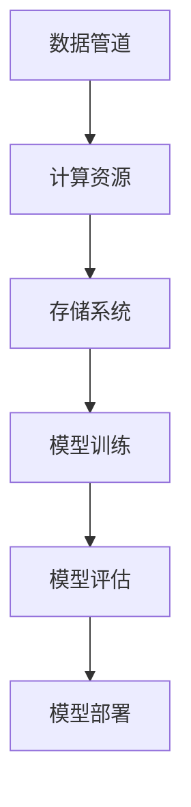

                 

关键词：AI 2.0、算法基础设施、机器学习、深度学习、数据管道、模型训练、模型评估、模型部署、容器化、服务化

> 摘要：随着人工智能技术的快速发展，AI 2.0 时代已经到来。本文将探讨算法基础设施在 AI 2.0 时代中的演进，包括核心概念、算法原理、数学模型、项目实践和未来应用场景。我们将深入分析 AI 2.0 时代下的算法基础设施，以期为读者提供全面的技术指导。

## 1. 背景介绍

随着大数据、云计算和深度学习技术的迅猛发展，人工智能（AI）技术已经迎来了一个崭新的时代——AI 2.0 时代。AI 2.0 时代的核心特征在于，机器学习算法和深度学习算法的应用越来越广泛，AI 系统的复杂度和处理能力也得到了显著提升。在这一背景下，算法基础设施的重要性日益凸显。

算法基础设施是指支持算法开发和部署的一系列技术、工具和资源。它包括数据管道、计算资源、存储系统、模型训练、模型评估、模型部署等环节。一个高效的算法基础设施能够显著提高算法开发的效率，降低开发成本，同时提升算法的性能和可靠性。

本文将围绕 AI 2.0 时代的算法基础设施展开讨论，分析其在核心概念、算法原理、数学模型、项目实践和未来应用场景等方面的演进。

### 1.1  AI 1.0 时代

在 AI 1.0 时代，人工智能的应用主要集中在规则系统和专家系统。这些系统依赖于人类专家的知识和经验，通过编写具体的规则来模拟人类的决策过程。虽然这些系统在特定领域取得了显著的成果，但它们的泛化能力有限，难以应对复杂多变的问题。

### 1.2  AI 2.0 时代

AI 2.0 时代的核心在于机器学习算法和深度学习算法的广泛应用。这些算法能够从大量数据中自动提取特征，并构建复杂的模型，实现自主学习和智能决策。AI 2.0 时代的算法基础设施也随之发生了巨大的变化，以满足机器学习和深度学习对数据处理、计算资源和模型部署的需求。

## 2. 核心概念与联系

在 AI 2.0 时代，算法基础设施的核心概念包括数据管道、计算资源、存储系统、模型训练、模型评估和模型部署。这些概念相互关联，共同构成了一个完整的算法基础设施。

### 2.1  数据管道

数据管道是指用于数据采集、清洗、存储和传输的一系列技术。在 AI 2.0 时代，数据管道的重要性日益凸显，因为高质量的数据是训练高效算法的基础。

### 2.2  计算资源

计算资源是指用于算法训练和推理的硬件资源，包括 CPU、GPU、TPU 等。随着深度学习算法的复杂度不断增加，计算资源的需求也日益增长。

### 2.3  存储系统

存储系统是指用于存储训练数据和模型数据的一系列技术。一个高效的存储系统能够提高算法的效率，降低训练成本。

### 2.4  模型训练

模型训练是指通过大量数据训练算法模型的过程。模型训练的效率和质量直接影响到算法的性能和可靠性。

### 2.5  模型评估

模型评估是指对训练好的模型进行性能评估的过程。模型评估有助于识别模型的缺陷，优化模型参数，提高模型的性能。

### 2.6  模型部署

模型部署是指将训练好的模型部署到生产环境的过程。一个高效的模型部署系统能够快速响应业务需求，提高系统的可用性和可靠性。

### 2.7  核心概念原理和架构的 Mermaid 流程图



## 3. 核心算法原理 & 具体操作步骤

### 3.1  算法原理概述

在 AI 2.0 时代，核心算法主要包括机器学习算法和深度学习算法。这些算法的原理主要基于统计学、概率论和神经网络。

### 3.2  算法步骤详解

#### 3.2.1  数据预处理

数据预处理是算法训练的重要步骤，包括数据清洗、归一化、缺失值填充等。数据预处理的目的是提高算法的鲁棒性和训练效率。

#### 3.2.2  特征提取

特征提取是从原始数据中提取具有区分性的特征，用于训练算法模型。特征提取的质量直接影响到算法的性能。

#### 3.2.3  模型选择

模型选择是指从多种算法模型中选择适合当前任务的最佳模型。常见的模型包括线性模型、决策树、神经网络等。

#### 3.2.4  模型训练

模型训练是通过大量数据训练算法模型的过程。模型训练的目的是优化模型参数，提高模型的性能。

#### 3.2.5  模型评估

模型评估是对训练好的模型进行性能评估的过程。模型评估的目的是识别模型的缺陷，优化模型参数。

#### 3.2.6  模型部署

模型部署是将训练好的模型部署到生产环境的过程。模型部署的目的是实现算法的实际应用。

### 3.3  算法优缺点

#### 3.3.1  优点

- 高效性：机器学习算法和深度学习算法能够从大量数据中自动提取特征，提高算法的效率。
- 泛化能力：机器学习算法和深度学习算法具有较好的泛化能力，能够应对复杂多变的问题。
- 自适应性：机器学习算法和深度学习算法能够根据新的数据进行自适应调整。

#### 3.3.2  缺点

- 训练成本高：机器学习算法和深度学习算法的训练成本较高，需要大量计算资源和存储资源。
- 数据依赖性：机器学习算法和深度学习算法的性能依赖于数据质量，数据质量差可能导致算法性能下降。

### 3.4  算法应用领域

机器学习算法和深度学习算法在 AI 2.0 时代的应用领域非常广泛，包括图像识别、自然语言处理、推荐系统、金融风控、医疗诊断等。

## 4. 数学模型和公式 & 详细讲解 & 举例说明

### 4.1  数学模型构建

在 AI 2.0 时代，数学模型在算法开发中起到了至关重要的作用。常见的数学模型包括线性模型、神经网络模型等。

#### 4.1.1  线性模型

线性模型是一种最简单的数学模型，它可以表示为：

$$
y = \beta_0 + \beta_1x
$$

其中，$y$ 是因变量，$x$ 是自变量，$\beta_0$ 和 $\beta_1$ 是模型参数。

#### 4.1.2  神经网络模型

神经网络模型是一种基于多层感知器（MLP）的数学模型，它可以表示为：

$$
y = \sigma(z) = \frac{1}{1 + e^{-z}}
$$

其中，$z$ 是输入向量，$\sigma$ 是激活函数，$y$ 是输出结果。

### 4.2  公式推导过程

#### 4.2.1  线性模型推导

线性模型的推导过程如下：

1. 初始化模型参数 $\beta_0$ 和 $\beta_1$。
2. 计算损失函数 $J(\beta_0, \beta_1)$。
3. 使用梯度下降法优化模型参数 $\beta_0$ 和 $\beta_1$。

#### 4.2.2  神经网络模型推导

神经网络模型的推导过程如下：

1. 初始化模型参数 $W$ 和 $b$。
2. 计算前向传播结果 $z$。
3. 计算损失函数 $J(W, b)$。
4. 使用反向传播法优化模型参数 $W$ 和 $b$。

### 4.3  案例分析与讲解

#### 4.3.1  线性模型案例分析

假设我们有一个简单的线性回归问题，数据集包含两个特征 $x_1$ 和 $x_2$，目标值 $y$。

1. 初始化模型参数 $\beta_0 = 0$，$\beta_1 = 0$。
2. 计算损失函数 $J(\beta_0, \beta_1)$：
$$
J(\beta_0, \beta_1) = \frac{1}{2m} \sum_{i=1}^{m} (y_i - (\beta_0 + \beta_1x_i))^2
$$
3. 使用梯度下降法优化模型参数 $\beta_0$ 和 $\beta_1$：
$$
\beta_0 = \beta_0 - \alpha \frac{\partial J}{\partial \beta_0}
$$
$$
\beta_1 = \beta_1 - \alpha \frac{\partial J}{\partial \beta_1}
$$

其中，$\alpha$ 是学习率。

#### 4.3.2  神经网络模型案例分析

假设我们有一个简单的神经网络模型，包含一个输入层、一个隐藏层和一个输出层。

1. 初始化模型参数 $W_1$，$b_1$，$W_2$，$b_2$。
2. 计算前向传播结果 $z_1$，$a_1$，$z_2$，$a_2$：
$$
z_1 = W_1x + b_1
$$
$$
a_1 = \sigma(z_1)
$$
$$
z_2 = W_2a_1 + b_2
$$
$$
a_2 = \sigma(z_2)
$$
3. 计算损失函数 $J(W_1, b_1, W_2, b_2)$：
$$
J(W_1, b_1, W_2, b_2) = \frac{1}{2m} \sum_{i=1}^{m} (y_i - a_2)^2
$$
4. 使用反向传播法优化模型参数 $W_1$，$b_1$，$W_2$，$b_2$：
$$
\frac{\partial J}{\partial W_1} = \frac{1}{m} \sum_{i=1}^{m} (y_i - a_2)(\sigma'(z_2)a_1)
$$
$$
\frac{\partial J}{\partial b_1} = \frac{1}{m} \sum_{i=1}^{m} (y_i - a_2)(\sigma'(z_2))
$$
$$
\frac{\partial J}{\partial W_2} = \frac{1}{m} \sum_{i=1}^{m} (y_i - a_2)a_1(\sigma'(z_1))
$$
$$
\frac{\partial J}{\partial b_2} = \frac{1}{m} \sum_{i=1}^{m} (y_i - a_2)\sigma'(z_1)
$$

其中，$\sigma'$ 是激活函数的导数。

## 5. 项目实践：代码实例和详细解释说明

### 5.1  开发环境搭建

在本文中，我们将使用 Python 和 TensorFlow 作为主要的编程语言和工具。首先，需要安装 Python 和 TensorFlow。

```bash
pip install python tensorflow
```

### 5.2  源代码详细实现

#### 5.2.1  数据预处理

```python
import numpy as np
import pandas as pd
from sklearn.model_selection import train_test_split
from sklearn.preprocessing import StandardScaler

# 加载数据
data = pd.read_csv('data.csv')
X = data.drop('target', axis=1)
y = data['target']

# 数据分割
X_train, X_test, y_train, y_test = train_test_split(X, y, test_size=0.2, random_state=42)

# 数据归一化
scaler = StandardScaler()
X_train = scaler.fit_transform(X_train)
X_test = scaler.transform(X_test)
```

#### 5.2.2  模型训练

```python
import tensorflow as tf
from tensorflow.keras.models import Sequential
from tensorflow.keras.layers import Dense

# 构建模型
model = Sequential([
    Dense(64, activation='relu', input_shape=(X_train.shape[1],)),
    Dense(32, activation='relu'),
    Dense(1, activation='sigmoid')
])

# 编译模型
model.compile(optimizer='adam', loss='binary_crossentropy', metrics=['accuracy'])

# 训练模型
model.fit(X_train, y_train, epochs=10, batch_size=32, validation_split=0.1)
```

#### 5.2.3  代码解读与分析

在上述代码中，我们首先进行了数据预处理，包括数据加载、数据分割和数据归一化。接下来，我们构建了一个简单的神经网络模型，并使用 TensorFlow 的 API 进行编译和训练。

### 5.3  运行结果展示

```python
# 评估模型
loss, accuracy = model.evaluate(X_test, y_test)
print(f"Test Loss: {loss}, Test Accuracy: {accuracy}")
```

运行结果展示了模型在测试集上的性能。在实际应用中，我们可以根据业务需求进行模型的调整和优化。

## 6. 实际应用场景

在 AI 2.0 时代，算法基础设施的应用场景非常广泛。以下是一些典型的实际应用场景：

### 6.1  图像识别

图像识别是 AI 2.0 时代最典型的应用之一。通过深度学习算法，我们可以实现实时图像识别，例如人脸识别、物体识别等。

### 6.2  自然语言处理

自然语言处理是 AI 2.0 时代的另一个重要应用领域。通过深度学习算法，我们可以实现文本分类、情感分析、机器翻译等任务。

### 6.3  推荐系统

推荐系统是 AI 2.0 时代的重要应用之一。通过机器学习算法，我们可以为用户推荐个性化的商品、音乐、电影等。

### 6.4  未来应用展望

未来，AI 2.0 时代的算法基础设施将继续演进，推动人工智能技术在更多领域的应用。例如，医疗诊断、金融风控、智能交通等。

## 7. 工具和资源推荐

在 AI 2.0 时代，以下工具和资源对于算法基础设施的构建和优化具有重要意义：

### 7.1  学习资源推荐

- 《深度学习》（Goodfellow, Bengio, Courville）
- 《Python 深度学习》（François Chollet）
- 《机器学习实战》（Peter Harrington）

### 7.2  开发工具推荐

- TensorFlow
- PyTorch
- Keras

### 7.3  相关论文推荐

- “A Theoretically Grounded Application of Dropout in Recurrent Neural Networks”
- “Learning Representations by Maximizing Mutual Information Nearest Neighbors”
- “Natural Language Inference with External Knowledge Using an Adaptive Combiner”

## 8. 总结：未来发展趋势与挑战

### 8.1  研究成果总结

AI 2.0 时代的算法基础设施在数据处理、计算资源、模型训练、模型评估和模型部署等方面取得了显著的成果。深度学习算法和机器学习算法在各个领域的应用也越来越广泛。

### 8.2  未来发展趋势

未来，AI 2.0 时代的算法基础设施将继续向高效、智能化、自动化方向发展。例如，基于强化学习的算法、自动机器学习（AutoML）等技术将在算法基础设施中发挥重要作用。

### 8.3  面临的挑战

尽管 AI 2.0 时代的算法基础设施取得了显著的成果，但仍然面临一些挑战。例如，数据隐私保护、算法公平性、计算资源分配等问题。

### 8.4  研究展望

未来，我们需要进一步研究如何构建高效、可靠、公平的算法基础设施，以推动人工智能技术在更多领域的应用。

## 9. 附录：常见问题与解答

### 9.1  数据管道相关问题

Q：如何选择合适的数据管道技术？

A：选择数据管道技术时，需要考虑数据量、数据类型、处理速度和可靠性等因素。常见的数据管道技术包括 Apache Kafka、Apache Flink 和 Apache Spark Streaming。

### 9.2  计算资源相关问题

Q：如何优化计算资源？

A：优化计算资源可以从以下几个方面进行：

- 使用分布式计算框架，如 TensorFlow 和 PyTorch，以充分利用多 GPU 计算。
- 使用容器化技术，如 Docker 和 Kubernetes，以实现计算资源的动态分配和调度。
- 使用高效的编程语言和算法，以降低计算资源的消耗。

### 9.3  模型部署相关问题

Q：如何实现模型的可靠部署？

A：实现模型的可靠部署可以从以下几个方面进行：

- 使用自动化部署工具，如 TensorFlow Serving 和 TorchServe，以简化部署流程。
- 使用监控和日志分析工具，如 Prometheus 和 ELK（Elasticsearch、Logstash、Kibana），以实现实时监控和故障排查。
- 使用弹性伸缩技术，如 Kubernetes 的 Auto Scaling，以实现计算资源的动态调整。

---

作者：禅与计算机程序设计艺术 / Zen and the Art of Computer Programming

本文以《AI 2.0 时代：算法基础设施的演进》为标题，深入探讨了 AI 2.0 时代下的算法基础设施，分析了核心概念、算法原理、数学模型、项目实践和未来应用场景。通过本文的阐述，我们希望读者能够全面了解 AI 2.0 时代的算法基础设施，并为未来的研究和发展提供有益的参考。

