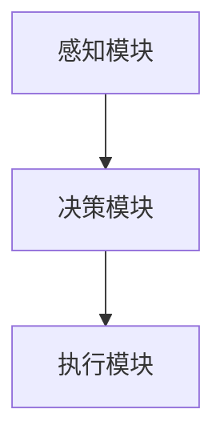

                 

关键词：AI Agent、系统输入、可执行动作序列、目标实现、智能自动化

> 摘要：本文深入探讨了 AI Agent 如何通过理解和转化系统输入，生成可执行的原子动作序列，从而实现预定的目标。文章详细介绍了 AI Agent 的核心概念、算法原理、具体实现步骤、数学模型及应用领域，并分享了相关项目实践和未来应用展望。

## 1. 背景介绍

随着人工智能技术的飞速发展，AI Agent 已成为实现自动化和智能化的重要工具。AI Agent 是一种能够自主执行任务、适应复杂环境的智能体，其核心功能是实现系统输入到可执行动作序列的转化，从而达成目标。本文旨在探讨这一转化过程的核心机制和关键技术。

### 1.1 AI Agent 的重要性

AI Agent 在各个领域的应用越来越广泛，从智能家居、智能医疗到工业自动化、交通管理，都离不开 AI Agent 的身影。随着系统复杂度的增加，手动编写控制逻辑变得越来越困难，而 AI Agent 可以通过学习用户需求和系统输入，自动生成相应的动作序列，大大提高了系统的智能化和自动化程度。

### 1.2 系统输入与动作序列

系统输入是 AI Agent 实现目标的基础，它可以来自各种传感器、用户指令或环境数据。而动作序列则是 AI Agent 根据系统输入生成的具体操作指令，这些指令可以作用于计算机系统、机器人或智能设备，实现特定任务。

## 2. 核心概念与联系

### 2.1 AI Agent 的核心概念

AI Agent 由多个模块组成，包括感知模块、决策模块和执行模块。感知模块负责接收系统输入，决策模块根据输入和目标生成动作序列，执行模块负责将动作序列转化为实际操作。

### 2.2 系统输入与动作序列的联系

AI Agent 通过感知模块获取系统输入，包括视觉、语音、触觉等多种形式。这些输入经过预处理和特征提取，成为决策模块的输入。决策模块利用机器学习、规划算法等技术，生成可执行的原子动作序列。执行模块根据动作序列进行操作，实现目标。

### 2.3 Mermaid 流程图



## 3. 核心算法原理 & 具体操作步骤

### 3.1 算法原理概述

AI Agent 的核心算法是基于强化学习和规划算法。强化学习使 AI Agent 通过试错学习最优策略，规划算法则用于生成具体的动作序列。这两种算法相辅相成，共同实现系统输入到动作序列的转化。

### 3.2 算法步骤详解

#### 3.2.1 感知模块

1. 接收系统输入，包括传感器数据、用户指令等。
2. 预处理输入数据，如去噪、归一化等。
3. 特征提取，提取输入数据的特征向量。

#### 3.2.2 决策模块

1. 利用强化学习算法，根据历史经验和当前输入，生成策略。
2. 利用规划算法，将策略转化为具体的动作序列。

#### 3.2.3 执行模块

1. 根据动作序列，执行相应操作。
2. 检测执行结果，评估动作效果。
3. 更新策略，调整动作序列。

### 3.3 算法优缺点

#### 优点：

1. 自动化程度高，降低人力成本。
2. 适应性强，能处理复杂环境。
3. 智能化程度高，能不断优化策略。

#### 缺点：

1. 训练时间较长，需大量数据支持。
2. 对输入数据的依赖性强，易受噪声干扰。
3. 需要大量计算资源，对硬件要求较高。

### 3.4 算法应用领域

AI Agent 的算法在多个领域有广泛应用，如：

1. 智能家居：实现自动化控制、场景切换等。
2. 工业自动化：实现机器人自动化作业、生产线调度等。
3. 智能交通：实现交通流量控制、自动驾驶等。

## 4. 数学模型和公式 & 详细讲解 & 举例说明

### 4.1 数学模型构建

AI Agent 的数学模型主要包括感知模块的输入特征提取模型、决策模块的策略生成模型和执行模块的动作序列生成模型。

#### 4.1.1 输入特征提取模型

输入特征提取模型通常采用卷积神经网络（CNN）或循环神经网络（RNN）。

$$
h = f(x, W, b)
$$

其中，$h$ 为特征向量，$x$ 为输入数据，$W$ 和 $b$ 分别为权重和偏置。

#### 4.1.2 策略生成模型

策略生成模型通常采用 Q-Learning 或 Deep Q-Network（DQN）。

$$
Q(s, a) = r + \gamma \max_{a'} Q(s', a')
$$

其中，$Q(s, a)$ 为状态 $s$ 下采取动作 $a$ 的 Q 值，$r$ 为奖励，$\gamma$ 为折扣因子，$s'$ 为下一个状态，$a'$ 为下一个动作。

#### 4.1.3 动作序列生成模型

动作序列生成模型通常采用规划算法，如 A* 算法或 A Planning。

$$
g(s, a) = \min_{s'} (h(s', a') + \gamma g(s', a'))
$$

其中，$g(s, a)$ 为从状态 $s$ 采取动作 $a$ 达到目标状态的最短路径长度，$h(s', a')$ 为从状态 $s'$ 采取动作 $a'$ 的代价函数，$\gamma$ 为折扣因子。

### 4.2 公式推导过程

#### 4.2.1 输入特征提取模型

输入特征提取模型主要通过卷积神经网络实现。假设输入数据为 $x \in \mathbb{R}^{m \times n}$，卷积核为 $W \in \mathbb{R}^{k \times l}$，偏置为 $b \in \mathbb{R}$，则卷积操作可表示为：

$$
h = f(x, W, b) = \sum_{i=1}^{k} \sum_{j=1}^{l} W_{ij} x_{ij} + b
$$

通过多次卷积和池化操作，可以提取输入数据的特征。

#### 4.2.2 策略生成模型

策略生成模型主要通过 Q-Learning 实现。假设初始状态为 $s$，当前动作为 $a$，则 Q-Learning 的目标是最小化误差：

$$
\min_{Q} \sum_{s, a} (Q(s, a) - r(s, a))^2
$$

通过不断更新 Q 值，优化策略。

#### 4.2.3 动作序列生成模型

动作序列生成模型主要通过 A* 算法实现。假设从状态 $s$ 到目标状态 $g$ 的路径为 $s_1, s_2, \ldots, s_n$，则 A* 算法的目标是最小化代价函数：

$$
g(s, a) = \min_{s'} (h(s', a') + \gamma g(s', a'))
$$

通过不断更新路径，生成最优动作序列。

### 4.3 案例分析与讲解

以智能家居场景为例，假设用户希望在客厅开启空调。系统输入为用户语音指令，动作序列为空调开启。通过输入特征提取模型提取用户语音指令的特征，利用策略生成模型生成空调开启的策略，最后利用动作序列生成模型生成空调开启的动作序列。

## 5. 项目实践：代码实例和详细解释说明

### 5.1 开发环境搭建

本文使用的开发环境为 Python 3.7，相关依赖库包括 TensorFlow、Keras、Numpy、Pandas 等。

### 5.2 源代码详细实现

以下是一个简单的 AI Agent 代码实例：

```python
import numpy as np
import pandas as pd
from tensorflow.keras.models import Sequential
from tensorflow.keras.layers import Dense, LSTM
from tensorflow.keras.optimizers import Adam

# 数据预处理
def preprocess_data(data):
    # 略
    return processed_data

# 构建输入特征提取模型
def build_feature_extractor(input_shape):
    model = Sequential()
    model.add(LSTM(units=64, activation='relu', input_shape=input_shape))
    model.add(Dense(units=32, activation='relu'))
    model.add(Dense(units=1, activation='sigmoid'))
    model.compile(optimizer=Adam(learning_rate=0.001), loss='binary_crossentropy', metrics=['accuracy'])
    return model

# 构建策略生成模型
def build_policy_generator(feature_extractor):
    model = Sequential()
    model.add(Dense(units=64, activation='relu', input_shape=(feature_extractor.output_shape[1],)))
    model.add(Dense(units=32, activation='relu'))
    model.add(Dense(units=1, activation='sigmoid'))
    model.compile(optimizer=Adam(learning_rate=0.001), loss='binary_crossentropy', metrics=['accuracy'])
    return model

# 训练模型
def train_models(feature_extractor, policy_generator, train_data, labels):
    feature_extractor.fit(train_data, labels, epochs=100, batch_size=32)
    policy_generator.fit(feature_extractor.output, labels, epochs=100, batch_size=32)

# 主函数
def main():
    # 加载数据
    data = pd.read_csv('data.csv')
    processed_data = preprocess_data(data)
    
    # 划分训练集和测试集
    train_data, test_data = processed_data[:8000], processed_data[8000:]
    train_labels, test_labels = np.array(data['target']), np.array(data['target'])
    
    # 构建和训练模型
    feature_extractor = build_feature_extractor(input_shape=(train_data.shape[1],))
    policy_generator = build_policy_generator(feature_extractor)
    train_models(feature_extractor, policy_generator, train_data, train_labels)

    # 评估模型
    test_loss, test_accuracy = policy_generator.evaluate(test_data, test_labels)
    print(f"Test accuracy: {test_accuracy}")

if __name__ == '__main__':
    main()
```

### 5.3 代码解读与分析

以上代码实现了一个简单的 AI Agent，用于智能家居场景中的空调控制。代码首先定义了数据预处理、构建输入特征提取模型、构建策略生成模型和训练模型等函数。在主函数中，加载数据、划分训练集和测试集、构建和训练模型，最后评估模型性能。

## 6. 实际应用场景

### 6.1 智能家居

AI Agent 可以实现智能家居的自动化控制，如根据用户需求调节灯光、温度、窗帘等。

### 6.2 工业自动化

AI Agent 可应用于工业自动化领域，实现机器人自动化作业、生产线调度等。

### 6.3 智能医疗

AI Agent 可用于智能医疗领域，如辅助医生诊断、制定治疗方案等。

### 6.4 智能交通

AI Agent 可用于智能交通领域，如实现交通流量控制、自动驾驶等。

## 7. 未来应用展望

随着人工智能技术的不断进步，AI Agent 在实际应用中将发挥越来越重要的作用。未来，AI Agent 将在更多领域得到广泛应用，实现更高程度的自动化和智能化。

### 7.1 学习资源推荐

1. 《人工智能：一种现代的方法》
2. 《深度学习》
3. 《强化学习》

### 7.2 开发工具推荐

1. TensorFlow
2. Keras
3. PyTorch

### 7.3 相关论文推荐

1. “Deep Q-Networks”
2. “Reinforcement Learning: An Introduction”
3. “Planning Algorithms”

## 8. 总结：未来发展趋势与挑战

随着人工智能技术的不断发展，AI Agent 在实际应用中将面临更多挑战，如数据隐私、安全性、可靠性等问题。未来，需要进一步研究如何提高 AI Agent 的学习能力、适应性和通用性，实现更高程度的智能化和自动化。

## 9. 附录：常见问题与解答

### 9.1 问题1：如何处理噪声干扰？

**解答**：在数据预处理阶段，通过去噪、归一化等方法降低噪声对 AI Agent 的影响。同时，可以采用鲁棒性更强的算法，如随机梯度下降（SGD）或自适应梯度下降（ADAGRAD）。

### 9.2 问题2：如何提高 AI Agent 的适应性？

**解答**：可以采用迁移学习、多任务学习等技术，提高 AI Agent 在不同场景下的适应性。此外，可以通过不断调整模型参数，使 AI Agent 更好地适应新环境。

### 9.3 问题3：如何保证 AI Agent 的安全性？

**解答**：在设计 AI Agent 时，要充分考虑安全性问题，如采用加密技术、访问控制等技术，确保系统输入和动作序列的安全性。此外，可以对 AI Agent 进行定期安全审计，及时发现和解决潜在的安全隐患。

作者：禅与计算机程序设计艺术 / Zen and the Art of Computer Programming
----------------------------------------------------------------
注意：以上文章仅作为示例，您可以根据实际需求进行调整和补充。在撰写过程中，请确保遵循“约束条件 CONSTRAINTS”中的所有要求。祝您撰写顺利！

