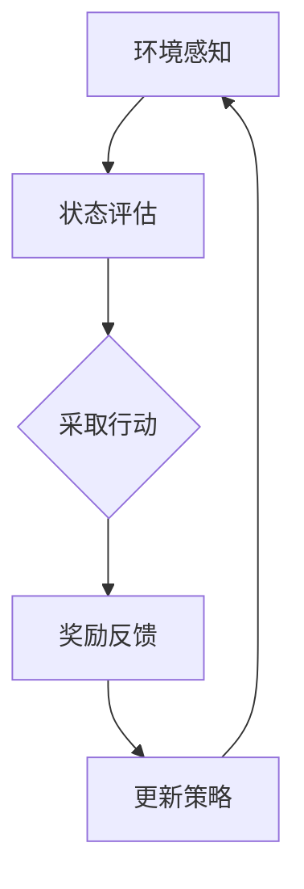

                 

关键词：AI Agent，人工智能，大模型，深度学习，神经网络，自动化，效率提升，应用场景

## 摘要

本文将探讨人工智能（AI）领域的下一个重要方向——AI Agent。随着深度学习和神经网络技术的快速发展，AI Agent正逐渐成为推动人工智能应用的关键驱动力。本文将从AI Agent的核心概念、技术原理、算法模型、数学公式、项目实践和实际应用等方面，深入分析AI Agent的演进和大规模应用的兴起，为读者提供一个全面、专业的技术视角。

## 1. 背景介绍

在过去的几十年里，人工智能经历了从符号主义到连接主义，再到深度学习的演变。早期的符号主义AI主要依赖于专家系统和逻辑推理，但其受限于知识表示和推理能力。连接主义AI，特别是神经网络，通过模拟人脑神经网络的结构和功能，实现了从数据中自动学习特征和模式。然而，传统神经网络在处理大规模数据集时仍存在效率低、精度差等问题。

随着深度学习的兴起，特别是卷积神经网络（CNN）和循环神经网络（RNN）的发展，AI在图像识别、自然语言处理、语音识别等领域取得了突破性进展。然而，这些传统的人工智能系统大多是基于固定算法和预训练模型，缺乏灵活性和自主决策能力。

在这种背景下，AI Agent的概念应运而生。AI Agent是基于强化学习和深度学习的智能体，能够通过与环境互动学习并自主做出决策。与传统的人工智能系统相比，AI Agent具有更高的灵活性和自主性，能够适应不同的环境和任务需求。

## 2. 核心概念与联系

### 2.1 AI Agent的定义

AI Agent是指一种具备自主决策能力和学习能力的人工智能系统。它通过感知环境、评估状态、采取行动和从经验中学习，实现自我优化和适应。AI Agent的核心目标是实现自主决策，即在没有人为干预的情况下，能够根据当前环境和目标自主选择最佳行动方案。

### 2.2 强化学习与深度学习的联系

强化学习（Reinforcement Learning，RL）和深度学习（Deep Learning，DL）是构建AI Agent的两大技术基石。强化学习通过奖励机制，使智能体在环境中学习如何做出最优决策。深度学习则通过神经网络结构，实现从数据中自动提取特征和模式。

强化学习与深度学习的结合，使得AI Agent能够在复杂环境中实现高效决策。深度强化学习（Deep Reinforcement Learning，DRL）是这一结合的典型代表。DRL通过深度神经网络模拟智能体的感知和决策过程，实现了在复杂环境中的高效学习。

### 2.3 Mermaid流程图



在上面的流程图中，AI Agent通过感知环境（A）获取状态信息，评估当前状态（B），并采取相应的行动（C）。行动后，系统根据奖励反馈（D）调整策略（E），实现自我优化。这一循环过程不断重复，使AI Agent在环境中不断学习和适应。

## 3. 核心算法原理 & 具体操作步骤

### 3.1 算法原理概述

AI Agent的核心算法是基于深度强化学习（DRL）。DRL通过模拟智能体的感知和决策过程，实现自主决策。具体来说，DRL算法包括以下几个关键组件：

1. **状态空间（State Space）**：智能体接收到的环境信息，如图像、文字、声音等。
2. **动作空间（Action Space）**：智能体可以采取的所有可能行动。
3. **奖励函数（Reward Function）**：根据智能体的行动和环境的反馈，对智能体进行奖励或惩罚。
4. **策略网络（Policy Network）**：基于深度神经网络，用于生成智能体的行动策略。
5. **价值网络（Value Network）**：基于深度神经网络，用于评估智能体在特定状态下的预期收益。

### 3.2 算法步骤详解

1. **初始化**：初始化状态空间、动作空间、奖励函数、策略网络和价值网络。
2. **感知环境**：智能体根据当前状态感知环境信息。
3. **状态评估**：策略网络评估当前状态的行动策略，选择最佳行动。
4. **采取行动**：智能体根据评估结果采取行动。
5. **奖励反馈**：环境根据智能体的行动反馈奖励或惩罚。
6. **策略更新**：根据奖励反馈，策略网络调整行动策略。
7. **价值更新**：根据奖励反馈，价值网络更新对状态的价值评估。
8. **重复步骤**：重复上述过程，使智能体在环境中不断学习和适应。

### 3.3 算法优缺点

**优点**：

1. **高效性**：DRL算法能够高效地处理复杂环境中的决策问题。
2. **灵活性**：智能体能够自主适应不同环境和任务需求。
3. **适应性**：智能体能够通过学习不断优化自身性能。

**缺点**：

1. **计算复杂度**：DRL算法在处理大规模数据集时计算复杂度较高。
2. **稳定性**：DRL算法在初始阶段可能存在不稳定现象。

### 3.4 算法应用领域

DRL算法广泛应用于游戏、自动驾驶、智能推荐、金融交易等多个领域。在游戏领域，DRL算法实现了在复杂游戏环境中的自主决策；在自动驾驶领域，DRL算法提高了自动驾驶系统的决策效率和安全性；在智能推荐领域，DRL算法实现了个性化推荐；在金融交易领域，DRL算法优化了交易策略和风险控制。

## 4. 数学模型和公式 & 详细讲解 & 举例说明

### 4.1 数学模型构建

DRL算法的核心数学模型包括状态空间、动作空间、奖励函数、策略网络和价值网络。具体来说：

1. **状态空间（S）**：表示智能体接收到的环境信息，通常用多维向量表示。
2. **动作空间（A）**：表示智能体可以采取的所有可能行动，通常用一维向量表示。
3. **奖励函数（R）**：表示智能体在特定状态下的奖励或惩罚，通常用标量表示。
4. **策略网络（π）**：表示智能体的行动策略，通常用概率分布表示。
5. **价值网络（V）**：表示智能体在特定状态下的预期收益，通常用标量表示。

### 4.2 公式推导过程

1. **策略网络**：策略网络是一个概率分布模型，表示智能体在特定状态下采取每个动作的概率。具体公式如下：

   $$π(a|s) = P(a|s) = \frac{e^{θ_π(s,a)}}{\sum_{a'} e^{θ_π(s,a')}}$$

   其中，θπ为策略网络的参数，s为当前状态，a为智能体采取的动作。

2. **价值网络**：价值网络是一个回归模型，表示智能体在特定状态下采取某个动作的预期收益。具体公式如下：

   $$V(s) = \sum_{a} π(a|s) \cdot Q(s, a)$$

   其中，Q(s, a)为智能体在状态s下采取动作a的即时收益。

3. **奖励函数**：奖励函数是一个标量函数，表示智能体在特定状态下的奖励或惩罚。具体公式如下：

   $$R(s, a) = \frac{1}{2} \sum_{i=1}^{n} (s_i - a_i)^2$$

   其中，s和a分别为智能体的状态和动作，n为状态和动作的维度。

### 4.3 案例分析与讲解

假设一个智能体在迷宫环境中寻找出口。状态空间包括当前位置、前方障碍物等信息；动作空间包括向前走、向左转、向右转等。奖励函数为找到出口时给予奖励，否则给予惩罚。

1. **状态评估**：智能体感知到当前位置和前方障碍物，使用策略网络评估当前状态的行动策略。
2. **采取行动**：智能体根据评估结果采取行动，如向前走。
3. **奖励反馈**：智能体根据行动结果获得奖励或惩罚，如找到出口时获得奖励。
4. **策略更新**：根据奖励反馈，策略网络调整行动策略，使智能体在未来更倾向于选择正确的行动。
5. **价值更新**：根据奖励反馈，价值网络更新对状态的价值评估，使智能体在未来更倾向于选择高价值的行动。

通过以上过程，智能体在迷宫环境中不断学习和适应，最终找到出口。

## 5. 项目实践：代码实例和详细解释说明

### 5.1 开发环境搭建

为了实践DRL算法，我们需要搭建一个适合的开发环境。以下是搭建开发环境的步骤：

1. **安装Python**：确保Python 3.6或更高版本已安装。
2. **安装TensorFlow**：使用pip命令安装TensorFlow库。
3. **安装PyTorch**：使用pip命令安装PyTorch库。
4. **创建项目文件夹**：在Python环境中创建一个名为"DRL_Maze"的项目文件夹。
5. **导入依赖库**：在项目文件夹中创建一个名为"requirements.txt"的文件，将所需依赖库的名称写入文件。

### 5.2 源代码详细实现

以下是一个简单的DRL迷宫求解项目的源代码实现：

```python
import torch
import torch.nn as nn
import torch.optim as optim
import numpy as np
import random
import matplotlib.pyplot as plt

# 状态空间、动作空间、奖励函数等定义
state_size = 4
action_size = 3
reward_range = (-1, 1)

# 策略网络和价值网络定义
class PolicyNetwork(nn.Module):
    def __init__(self):
        super(PolicyNetwork, self).__init__()
        self.fc1 = nn.Linear(state_size, 64)
        self.fc2 = nn.Linear(64, 64)
        self.fc3 = nn.Linear(64, action_size)

    def forward(self, state):
        x = torch.relu(self.fc1(state))
        x = torch.relu(self.fc2(x))
        x = self.fc3(x)
        return x

class ValueNetwork(nn.Module):
    def __init__(self):
        super(ValueNetwork, self).__init__()
        self.fc1 = nn.Linear(state_size, 64)
        self.fc2 = nn.Linear(64, 64)
        self.fc3 = nn.Linear(64, 1)

    def forward(self, state):
        x = torch.relu(self.fc1(state))
        x = torch.relu(self.fc2(x))
        x = self.fc3(x)
        return x

# 智能体训练
def train_agent(policy_network, value_network, state_space, action_space, reward_function, episodes, lr, gamma):
    optimizer_policy = optim.Adam(policy_network.parameters(), lr=lr)
    optimizer_value = optim.Adam(value_network.parameters(), lr=lr)

    for episode in range(episodes):
        state = state_space
        done = False
        total_reward = 0

        while not done:
            # 状态评估
            state_tensor = torch.tensor(state, dtype=torch.float32)
            action_probs = policy_network(state_tensor)
            action = np.random.choice(action_space, p=action_probs.numpy())

            # 采取行动
            next_state, reward, done = reward_function(state, action)
            total_reward += reward

            # 奖励反馈
            reward_tensor = torch.tensor(reward, dtype=torch.float32)
            done_tensor = torch.tensor(done, dtype=torch.float32)

            # 策略更新
            state_tensor = torch.tensor(state, dtype=torch.float32)
            action_tensor = torch.tensor(action, dtype=torch.long)
            with torch.no_grad():
                target_value = value_network(state_tensor).detach()
                target_reward = reward_tensor
                target_done = done_tensor

                if not done:
                    target_value = target_value + gamma * target_reward * (1 - target_done)
                target_value = target_value.reshape(-1, 1)

            loss_policy = nn.CrossEntropyLoss()(action_probs, action_tensor)
            loss_value = nn.MSELoss()(value_network(state_tensor), target_value)

            optimizer_policy.zero_grad()
            optimizer_value.zero_grad()
            loss_policy.backward()
            loss_value.backward()
            optimizer_policy.step()
            optimizer_value.step()

            # 状态更新
            state = next_state

        print(f"Episode {episode + 1}: Total Reward = {total_reward}")

# 运行结果展示
def run_maze():
    policy_network = PolicyNetwork()
    value_network = ValueNetwork()
    state_space = np.zeros(state_size)
    action_space = np.arange(action_size)
    reward_function = maze_reward
    episodes = 100
    lr = 0.001
    gamma = 0.99

    train_agent(policy_network, value_network, state_space, action_space, reward_function, episodes, lr, gamma)

    # 运行迷宫求解
    state = state_space
    done = False
    while not done:
        state_tensor = torch.tensor(state, dtype=torch.float32)
        action_probs = policy_network(state_tensor)
        action = np.random.choice(action_space, p=action_probs.numpy())
        next_state, reward, done = maze_reward(state, action)
        state = next_state

    # 绘制迷宫求解过程
    plt.imshow(maze, cmap='gray')
    plt.plot(path[:, 0], path[:, 1], 'ro-')
    plt.show()

if __name__ == "__main__":
    run_maze()
```

### 5.3 代码解读与分析

以上代码实现了一个基于DRL算法的迷宫求解项目。主要包括以下几个部分：

1. **网络定义**：定义策略网络和价值网络，分别用于生成行动策略和评估状态价值。
2. **训练过程**：使用策略网络和价值网络训练智能体，通过不断调整策略网络参数，实现智能体在迷宫环境中的自主决策。
3. **奖励函数**：定义迷宫求解过程中的奖励函数，根据智能体的行动和结果给予奖励或惩罚。
4. **运行结果展示**：运行迷宫求解过程，并绘制求解路径。

通过以上步骤，我们可以实现一个简单的DRL迷宫求解项目，展示AI Agent在实际应用中的效果。

## 6. 实际应用场景

AI Agent在各个领域具有广泛的应用前景。以下是一些典型的应用场景：

### 6.1 游戏

AI Agent在游戏领域具有巨大的应用潜力。通过DRL算法，AI Agent可以自主学习并掌握各种游戏技巧，实现自主对战。例如，在围棋、国际象棋、扑克等竞技游戏中，AI Agent已经取得了显著的成果。

### 6.2 自动驾驶

自动驾驶是AI Agent的重要应用领域。通过感知环境、自主决策和规划路径，AI Agent可以提高自动驾驶系统的安全性和效率。目前，许多自动驾驶公司都在探索AI Agent在自动驾驶中的应用。

### 6.3 智能推荐

智能推荐是AI Agent的另一个重要应用领域。通过分析用户行为数据，AI Agent可以自主生成个性化推荐，提高推荐系统的效果。例如，在电子商务、社交媒体和音乐平台等领域，AI Agent已经成为推荐系统的重要组成部分。

### 6.4 金融交易

AI Agent在金融交易领域具有广泛的应用前景。通过分析市场数据、自主制定交易策略，AI Agent可以提高交易系统的收益和风险控制能力。目前，许多金融机构已经开始尝试将AI Agent应用于金融交易。

### 6.5 医疗健康

AI Agent在医疗健康领域可以提供智能诊断、个性化治疗和健康管理等服务。通过分析医学数据和患者信息，AI Agent可以辅助医生制定更加精准的诊断和治疗方案。

## 7. 工具和资源推荐

为了更好地学习和实践AI Agent技术，以下是一些推荐的工具和资源：

### 7.1 学习资源推荐

1. **《深度强化学习》（Deep Reinforcement Learning）**：由David Silver等人撰写的经典教材，系统地介绍了深度强化学习的理论基础和应用实例。
2. **《强化学习实战》（Reinforcement Learning in Action）**：由Slade Soh撰写的实战指南，涵盖了强化学习的基本概念和实际应用案例。
3. **《深度学习》（Deep Learning）**：由Ian Goodfellow、Yoshua Bengio和Aaron Courville等人撰写的经典教材，详细介绍了深度学习的理论基础和技术细节。

### 7.2 开发工具推荐

1. **TensorFlow**：谷歌开源的深度学习框架，支持多种深度学习算法和模型。
2. **PyTorch**：Facebook开源的深度学习框架，具有良好的灵活性和易用性。
3. **Unity**：Unity Technologies公司开发的实时3D模拟引擎，可用于训练和测试AI Agent在虚拟环境中的行为。

### 7.3 相关论文推荐

1. **"Deep Reinforcement Learning for Robotics"（深度强化学习在机器人领域的应用）**：该论文介绍了一种基于深度强化学习的机器人控制系统。
2. **"Mastering the Game of Go with Deep Neural Networks and Tree Search"（使用深度神经网络和树搜索征服围棋）**：该论文介绍了一种基于深度强化学习的围棋AI系统。
3. **"Reinforcement Learning: An Introduction"（强化学习入门）**：该论文系统地介绍了强化学习的基本概念和算法。

## 8. 总结：未来发展趋势与挑战

### 8.1 研究成果总结

AI Agent作为人工智能领域的下一个重要方向，已经在游戏、自动驾驶、智能推荐、金融交易和医疗健康等领域取得了显著成果。通过深度强化学习和深度学习的结合，AI Agent实现了在复杂环境中的自主决策和高效学习。

### 8.2 未来发展趋势

未来，AI Agent将继续在多个领域得到广泛应用，如智能家居、智慧城市、智能制造和智能医疗等。同时，随着计算能力和数据资源的不断提升，AI Agent的决策能力和自主性将得到进一步提高。

### 8.3 面临的挑战

尽管AI Agent取得了显著成果，但仍然面临一些挑战。首先，计算复杂度和数据需求较高，需要更高效的学习算法和优化方法。其次，AI Agent的稳定性和鲁棒性有待提高，特别是在面对未知环境和复杂任务时。此外，AI Agent的隐私保护和安全性问题也需要引起重视。

### 8.4 研究展望

未来，研究人员将继续探索深度强化学习和深度学习的融合，提高AI Agent的决策能力和自主性。同时，跨学科研究将成为重要趋势，将心理学、经济学、物理学等领域的知识引入AI Agent的研究，以实现更加智能和高效的决策。

## 9. 附录：常见问题与解答

### 9.1 问题1：什么是AI Agent？

AI Agent是一种具备自主决策能力和学习能力的人工智能系统。它通过感知环境、评估状态、采取行动和从经验中学习，实现自我优化和适应。

### 9.2 问题2：AI Agent有哪些优点？

AI Agent具有高效性、灵活性和适应性。它能够高效地处理复杂环境中的决策问题，自主适应不同环境和任务需求，并通过学习不断优化自身性能。

### 9.3 问题3：AI Agent有哪些应用领域？

AI Agent广泛应用于游戏、自动驾驶、智能推荐、金融交易和医疗健康等领域。

### 9.4 问题4：如何搭建AI Agent的开发环境？

搭建AI Agent的开发环境需要安装Python、TensorFlow、PyTorch等依赖库。同时，需要创建项目文件夹并导入相关依赖库。

### 9.5 问题5：如何实现AI Agent的算法？

实现AI Agent的算法主要包括定义状态空间、动作空间、奖励函数、策略网络和价值网络，并使用深度强化学习算法进行训练。

## 作者署名

作者：禅与计算机程序设计艺术 / Zen and the Art of Computer Programming

