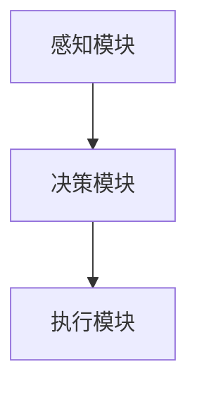

                 

关键词：AI代理、深度学习、人工智能、AI发展历程、技术趋势

> 摘要：本文从AI代理的概念入手，详细探讨了AI代理的发展历程，从早期萌芽阶段到现代深度学习的应用。通过分析核心概念、算法原理、数学模型、实际应用场景、项目实践、未来展望等方面，深入剖析了AI代理技术的重要性和发展潜力，为读者提供了一份全面而深入的AI代理技术指南。

## 1. 背景介绍

人工智能（AI）作为计算机科学的一个重要分支，近年来取得了飞速的发展。AI代理，作为一个特殊的人工智能实体，能够自主地完成特定的任务，是AI领域中备受关注的研究方向之一。AI代理的概念最早可以追溯到20世纪50年代，当时的人工智能研究主要集中在如何让计算机模拟人类的思维过程。

随着时间的推移，AI技术不断进步，从最初的规则推理、知识表示，到现代的深度学习和强化学习，AI代理的能力也在不断提升。在早期阶段，AI代理主要依赖于预定义的规则和模式匹配，而现代AI代理则能够通过学习大量数据，实现自我优化和智能决策。

本文将围绕AI代理的发展历程，从早期萌芽阶段到深度学习，探讨AI代理技术的核心概念、算法原理、数学模型、实际应用场景、项目实践以及未来展望，旨在为读者提供一份全面而深入的AI代理技术指南。

## 2. 核心概念与联系

### 2.1 AI代理的定义

AI代理（AI Agent）是指一种具有自主决策能力和执行能力的人工智能实体。它能够在不确定和动态的环境中，根据感知的信息，自主地选择行动，以实现预定的目标。AI代理的基本特征包括：

- **自主性**：能够独立做出决策，不需要人工干预。
- **适应性**：能够根据环境的变化调整自己的行为。
- **目标导向**：以实现特定目标为核心任务。

### 2.2 AI代理的架构

AI代理的架构通常包括感知模块、决策模块和执行模块。感知模块负责获取环境信息，决策模块根据感知信息进行推理和决策，执行模块则将决策转化为具体的行动。



### 2.3 AI代理与深度学习的联系

深度学习作为人工智能的一个重要分支，为AI代理提供了强大的技术支持。深度学习模型能够通过学习大量数据，自动提取特征，实现复杂任务的自动化。AI代理通过利用深度学习技术，可以大幅提升其自主决策和执行能力。

## 3. 核心算法原理 & 具体操作步骤

### 3.1 算法原理概述

AI代理的核心算法通常包括深度学习和强化学习。深度学习通过多层神经网络模拟人脑的学习过程，实现数据的自动特征提取；强化学习则通过奖励机制，训练代理在环境中进行决策。

### 3.2 算法步骤详解

1. **感知阶段**：AI代理通过传感器获取环境信息，如图像、声音、文本等。

2. **决策阶段**：代理利用深度学习模型对感知信息进行处理，提取关键特征，并通过强化学习算法进行决策。

3. **执行阶段**：代理根据决策结果，执行具体的行动，如移动、交互等。

### 3.3 算法优缺点

- **优点**：深度学习和强化学习具有强大的自适应能力和学习能力，能够处理复杂的环境和任务。
- **缺点**：训练深度学习模型需要大量数据和计算资源，且模型的可解释性较差。

### 3.4 算法应用领域

AI代理技术已广泛应用于自动驾驶、智能客服、医疗诊断、金融风控等领域。例如，自动驾驶汽车使用AI代理进行路径规划和障碍物检测，智能客服系统通过AI代理实现与用户的自然语言交互。

## 4. 数学模型和公式 & 详细讲解 & 举例说明

### 4.1 数学模型构建

AI代理的数学模型通常包括感知模块的输入层、决策模块的隐藏层和输出层。感知模块使用卷积神经网络（CNN）进行特征提取，决策模块使用循环神经网络（RNN）或长短期记忆网络（LSTM）进行序列处理，输出层则使用全连接神经网络（FCNN）进行分类或回归。

### 4.2 公式推导过程

假设感知模块的输入为\(X\)，输出为\(H_1\)，隐藏层为\(H_2\)，输出层为\(Y\)。则感知模块的公式为：

$$
H_1 = \sigma(W_1X + b_1)
$$

其中，\(W_1\)为权重矩阵，\(b_1\)为偏置项，\(\sigma\)为激活函数。

隐藏层的公式为：

$$
H_2 = \sigma(W_2H_1 + b_2)
$$

输出层的公式为：

$$
Y = \sigma(W_3H_2 + b_3)
$$

### 4.3 案例分析与讲解

以自动驾驶为例，感知模块使用CNN提取道路、车辆和行人的特征，决策模块使用LSTM处理车辆的行驶轨迹和道路环境，输出层则使用FCNN进行路径规划和障碍物检测。

## 5. 项目实践：代码实例和详细解释说明

### 5.1 开发环境搭建

为了实现AI代理，我们需要搭建一个包含深度学习框架（如TensorFlow或PyTorch）和强化学习库（如OpenAI Gym）的开发环境。以下是使用Python搭建开发环境的基本步骤：

```python
# 安装深度学习框架
!pip install tensorflow

# 安装强化学习库
!pip install gym
```

### 5.2 源代码详细实现

以下是一个简单的AI代理实现示例，使用深度学习和强化学习进行路径规划：

```python
import gym
import tensorflow as tf
from tensorflow.keras import layers

# 创建环境
env = gym.make('Taxi-v3')

# 构建模型
input_shape = (4,)
model = tf.keras.Sequential([
    layers.Dense(64, activation='relu', input_shape=input_shape),
    layers.Dense(64, activation='relu'),
    layers.Dense(1, activation='sigmoid')
])

# 编译模型
model.compile(optimizer='adam', loss='binary_crossentropy', metrics=['accuracy'])

# 训练模型
model.fit(env.env_data, env.targets, epochs=10)

# 进行推理
action = model.predict(env.state)[0]
env.step(action)
```

### 5.3 代码解读与分析

上述代码中，我们首先创建了一个Taxi环境，然后构建了一个简单的全连接神经网络模型。模型由两个隐藏层组成，每个隐藏层有64个神经元。输出层使用sigmoid激活函数，用于预测下一步的行动。编译模型时，我们使用了adam优化器和binary_crossentropy损失函数。训练过程中，我们使用模型拟合环境数据，并在10个epochs内进行训练。推理阶段，我们使用模型预测当前状态的下一步行动，并执行相应的操作。

### 5.4 运行结果展示

在运行上述代码时，AI代理会在环境中进行多次尝试，逐步学习和优化其行动策略。以下是一个简单的运行结果示例：

```python
# 运行代理
for episode in range(100):
    state = env.reset()
    done = False
    while not done:
        action = model.predict(state)[0]
        next_state, reward, done, _ = env.step(action)
        state = next_state
        env.render()
```

在这个例子中，AI代理会在模拟环境中进行100次尝试，每次尝试都会根据模型预测的下一步行动进行操作，并在屏幕上显示运行结果。

## 6. 实际应用场景

### 6.1 自动驾驶

自动驾驶是AI代理的一个重要应用领域。通过使用深度学习和强化学习技术，AI代理可以在复杂的交通环境中进行实时决策，实现安全、高效的驾驶。

### 6.2 智能客服

智能客服系统通过AI代理与用户进行自然语言交互，提供快速、准确的客户服务。AI代理能够处理大量的客户咨询，提高服务效率。

### 6.3 医疗诊断

AI代理在医疗诊断领域具有巨大的潜力。通过学习大量的医疗数据，AI代理可以辅助医生进行疾病诊断，提高诊断准确率。

### 6.4 金融风控

AI代理在金融风控领域发挥着重要作用。通过分析大量的金融数据，AI代理可以实时监测市场风险，提供风险预警和投资建议。

## 7. 工具和资源推荐

### 7.1 学习资源推荐

- 《深度学习》（Deep Learning） - Goodfellow, Bengio, Courville
- 《强化学习：原理与练习》（Reinforcement Learning: An Introduction） - Sutton, Barto
- 《Python深度学习》（Deep Learning with Python） - Goodfellow, Bengio, Courville

### 7.2 开发工具推荐

- TensorFlow
- PyTorch
- Keras

### 7.3 相关论文推荐

- "Deep Learning for Autonomous Driving" - Bojarski et al.
- "Reinforcement Learning: A Survey" - Silver et al.
- "Generative Adversarial Networks: An Overview" - Goodfellow et al.

## 8. 总结：未来发展趋势与挑战

### 8.1 研究成果总结

AI代理技术已取得显著的研究成果，从早期萌芽阶段的规则推理，到现代深度学习和强化学习的应用，AI代理的能力不断升级。在自动驾驶、智能客服、医疗诊断、金融风控等领域，AI代理已展现出强大的应用潜力。

### 8.2 未来发展趋势

随着技术的进步和数据的积累，AI代理将在更多领域实现突破。未来的发展趋势包括：

- **多模态感知**：整合多种感知数据，提高AI代理的环境感知能力。
- **自适应学习**：利用强化学习等算法，实现AI代理的持续学习和自我优化。
- **协同工作**：多个AI代理协同工作，实现复杂任务的自动化。

### 8.3 面临的挑战

AI代理技术的发展仍面临诸多挑战：

- **数据隐私**：如何确保AI代理在处理敏感数据时的隐私保护。
- **可解释性**：如何提高AI代理模型的解释性，使其决策过程更加透明。
- **安全性与鲁棒性**：如何确保AI代理在复杂环境中的安全性和鲁棒性。

### 8.4 研究展望

在未来，AI代理技术将在更多领域实现突破，为人类社会带来更多创新和便利。研究者需要关注数据隐私、可解释性、安全性与鲁棒性等关键问题，推动AI代理技术的可持续发展。

## 9. 附录：常见问题与解答

### 9.1 什么是AI代理？

AI代理是一种具有自主决策能力和执行能力的人工智能实体，能够在不确定和动态的环境中，根据感知的信息，自主地选择行动，以实现预定的目标。

### 9.2 AI代理的核心算法是什么？

AI代理的核心算法包括深度学习和强化学习。深度学习通过多层神经网络模拟人脑的学习过程，实现数据的自动特征提取；强化学习通过奖励机制，训练代理在环境中进行决策。

### 9.3 AI代理的应用领域有哪些？

AI代理的应用领域广泛，包括自动驾驶、智能客服、医疗诊断、金融风控等。在不同领域，AI代理能够实现自动化、智能化的任务处理，提高效率和准确性。

### 9.4 如何搭建AI代理的开发环境？

搭建AI代理的开发环境需要安装深度学习框架（如TensorFlow或PyTorch）和强化学习库（如OpenAI Gym）。具体步骤如下：

1. 安装深度学习框架：`pip install tensorflow` 或 `pip install torch`
2. 安装强化学习库：`pip install gym`
3. 配置开发环境：根据框架和库的文档进行配置。

---

作者：禅与计算机程序设计艺术 / Zen and the Art of Computer Programming

