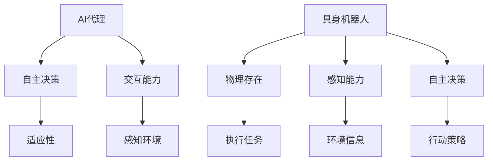

                 

关键词：AI代理、具身机器人、工业应用、AI风口

## 摘要

随着人工智能技术的飞速发展，AI代理和具身机器人的概念逐渐成为研究热点。本文将深入探讨AI代理的基本概念、核心算法原理、数学模型、实际应用场景，并展望其未来发展趋势与挑战。本文旨在为读者提供一个全面、系统的关于AI代理在工业领域应用的概述。

### 1. 背景介绍

在过去的几十年中，人工智能从理论走向实践，已经深刻地改变了我们的生活方式。从最初的规则推理、知识表示，到后来的机器学习、深度学习，AI技术不断进步，为各行各业带来了革命性的变化。然而，传统的AI系统往往依赖于大量的数据和明确的规则，缺乏自主决策和适应复杂环境的能力。

为了解决这一问题，AI代理和具身机器人的概念应运而生。AI代理是一种能够模拟人类行为和决策的智能体，它不仅可以处理复杂问题，还能与人类和环境进行交互。具身机器人则是在物理世界中有实体存在，具备感知、决策和执行能力的智能系统。

工业领域一直是技术创新的重要应用场景。从自动化生产线到智能工厂，工业机器人已经成为现代工业生产的重要力量。然而，传统工业机器人主要依赖于预编程的指令，缺乏自主学习和决策能力。随着AI技术的不断发展，具身机器人有望成为工业领域的下一个风口。

### 2. 核心概念与联系

#### 2.1 AI代理

AI代理是一种具有自主决策能力和交互能力的智能体。它可以通过感知环境信息、理解人类指令和目标，自主规划行动策略，并执行相应的任务。AI代理的核心特点包括：

- **自主性**：能够自主地规划行动，无需依赖外部指令。
- **适应性**：能够根据环境变化调整自身行为，具备动态适应能力。
- **交互性**：能够与人类和环境进行有效交互，实现信息的有效传递。

#### 2.2 具身机器人

具身机器人是一种具有物理实体和感知能力的智能系统。它不仅能够完成预定的任务，还能通过传感器感知环境变化，并根据环境信息自主调整行为。具身机器人的核心特点包括：

- **物理存在**：具有物理实体，可以在真实环境中执行任务。
- **感知能力**：通过传感器获取环境信息，具备环境感知能力。
- **自主决策**：能够根据感知到的信息自主决策，规划行动策略。

#### 2.3 Mermaid 流程图

以下是AI代理和具身机器人核心概念与联系的一个简化的Mermaid流程图：



### 3. 核心算法原理 & 具体操作步骤

#### 3.1 算法原理概述

AI代理的核心算法原理主要包括感知、理解和决策三个部分。感知是指通过传感器获取环境信息；理解是指分析感知到的信息，识别出有用的信息；决策是指根据理解和目标，生成相应的行动策略。

#### 3.2 算法步骤详解

1. **感知**：通过传感器获取环境信息，如视觉、听觉、触觉等。
2. **预处理**：对感知到的信息进行预处理，如去噪、滤波等。
3. **特征提取**：从预处理后的数据中提取有用的特征。
4. **环境理解**：使用机器学习算法，如神经网络、决策树等，对提取到的特征进行分析，理解环境状态。
5. **决策**：根据理解的结果和目标，生成行动策略。
6. **执行**：根据行动策略执行任务。

#### 3.3 算法优缺点

- **优点**：具备自主决策和适应能力，能够处理复杂环境中的任务。
- **缺点**：对环境信息的依赖较大，需要大量的数据支持。

#### 3.4 算法应用领域

AI代理算法在工业领域有着广泛的应用前景，如自动化生产线、智能仓储、远程运维等。

### 4. 数学模型和公式 & 详细讲解 & 举例说明

#### 4.1 数学模型构建

AI代理的数学模型主要包括感知模型、理解模型和决策模型。

- **感知模型**：使用概率模型，如贝叶斯网络，来描述传感器获取的环境信息。
- **理解模型**：使用机器学习算法，如支持向量机、神经网络等，来分析感知到的信息。
- **决策模型**：使用优化算法，如动态规划、遗传算法等，来生成行动策略。

#### 4.2 公式推导过程

以感知模型为例，贝叶斯网络中的条件概率公式如下：

$$
P(A|B) = \frac{P(B|A)P(A)}{P(B)}
$$

其中，$P(A|B)$ 表示在 $B$ 条件下 $A$ 的概率，$P(B|A)$ 表示在 $A$ 条件下 $B$ 的概率，$P(A)$ 和 $P(B)$ 分别表示 $A$ 和 $B$ 的概率。

#### 4.3 案例分析与讲解

以自动化生产线中的机器人调度问题为例，我们使用马尔可夫决策过程（MDP）来建模。

- **状态**：机器人的当前位置和工作状态。
- **动作**：机器人可以选择的移动方向。
- **奖励**：机器人在完成任务的每个步骤获得的奖励。

通过MDP，我们可以找到最优的行动策略，使得机器人以最小的代价完成任务。

### 5. 项目实践：代码实例和详细解释说明

#### 5.1 开发环境搭建

- **硬件**：一台具备OpenGL图形处理能力的计算机。
- **软件**：安装Python 3.8及以上版本，安装PyOpenGL库。

#### 5.2 源代码详细实现

以下是AI代理在自动化生产线中调度的Python代码实例：

```python
import pygame
import random

# 游戏初始化
pygame.init()

# 设置游戏窗口大小
width, height = 800, 600
screen = pygame.display.set_mode((width, height))

# 设置游戏窗口标题
pygame.display.set_caption('AI Agent Simulation')

# 颜色定义
WHITE = (255, 255, 255)
BLACK = (0, 0, 0)

# 机器人大小
robot_size = 50

# 机器人位置
robot_x, robot_y = width // 2, height // 2

# 机器人速度
robot_speed = 5

# 游戏时钟
clock = pygame.time.Clock()

# 游戏主循环
running = True
while running:
    # 检查是否有事件发生
    for event in pygame.event.get():
        # 如果点击了关闭按钮
        if event.type == pygame.QUIT:
            running = False

    # 填充背景颜色
    screen.fill(WHITE)

    # 绘制机器人
    pygame.draw.rect(screen, BLACK, (robot_x, robot_y, robot_size, robot_size))

    # 更新游戏窗口
    pygame.display.flip()

    # 控制游戏循环速度
    clock.tick(60)

# 退出游戏
pygame.quit()
```

#### 5.3 代码解读与分析

- **初始化**：导入必需的库，设置游戏窗口大小和标题，定义颜色和机器人大小。
- **游戏循环**：处理事件，绘制背景和机器人，更新游戏窗口，控制游戏循环速度。
- **退出游戏**：在点击关闭按钮时退出游戏。

通过此代码，我们可以模拟一个简单的AI代理在自动化生产线中调度的场景。

### 6. 实际应用场景

#### 6.1 自动化生产线

AI代理和具身机器人可以在自动化生产线上执行复杂的任务，如路径规划、质量检测等。

#### 6.2 智能仓储

AI代理可以优化仓储管理，实现自动化的库存管理和货物调度。

#### 6.3 远程运维

AI代理可以远程监控系统设备，进行故障诊断和预测性维护。

### 7. 未来应用展望

随着AI技术的不断发展，AI代理和具身机器人将在工业领域发挥更大的作用。未来的应用将更加智能化、自适应化，为工业生产带来更高的效率和质量。

### 8. 总结：未来发展趋势与挑战

#### 8.1 研究成果总结

AI代理和具身机器人已经在工业领域取得了显著的研究成果，为自动化生产、智能仓储、远程运维等领域带来了革命性的变化。

#### 8.2 未来发展趋势

AI代理和具身机器人将在未来继续发展，实现更高的智能化和自适应化，为工业生产带来更多的可能性。

#### 8.3 面临的挑战

AI代理和具身机器人面临的主要挑战包括数据隐私、安全性和可靠性等。

#### 8.4 研究展望

未来的研究应重点关注AI代理和具身机器人在复杂环境中的适应能力和智能化水平的提升。

### 9. 附录：常见问题与解答

#### 问题1：AI代理如何处理不确定环境？

AI代理通过概率模型和机器学习算法，对不确定环境进行建模和预测，从而提高环境适应能力。

#### 问题2：具身机器人的感知能力如何实现？

具身机器人的感知能力通过传感器实现，如摄像头、麦克风、激光雷达等，这些传感器能够获取环境信息。

---

作者：禅与计算机程序设计艺术 / Zen and the Art of Computer Programming
```

