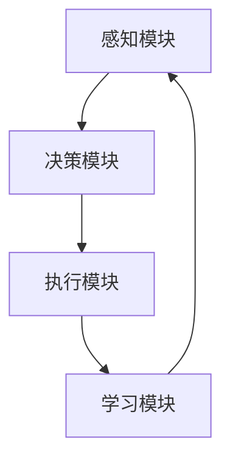

                 

关键词：人工智能，智能体，智能体技术，AI Agent，机器学习，深度学习，神经网络，强化学习，自然语言处理，计算机视觉

> 摘要：随着人工智能技术的不断进步，智能体技术成为AI领域的研究热点。本文将探讨智能体技术的基本概念、核心算法、数学模型、项目实践和未来发展趋势，旨在为读者提供一个全面而深入的智能体技术指南。

## 1. 背景介绍

人工智能（AI）作为计算机科学的前沿领域，近年来取得了飞速的发展。从传统的规则推理和知识表示，到现代的机器学习和深度学习，人工智能正在逐步渗透到我们的日常生活和工作之中。智能体（AI Agent）作为人工智能的一个重要分支，以其自主性、自适应性和交互性等特点，成为了未来智能系统研究的关键。

### 智能体技术的起源与发展

智能体概念最早由John McCarthy在1956年的达特茅斯会议上提出。随着计算能力的提升和算法的进步，智能体技术逐渐从理论研究走向实际应用。1990年代以来，随着互联网的普及和大数据技术的发展，智能体技术迎来了新的发展机遇。如今，智能体技术已经广泛应用于自然语言处理、计算机视觉、智能推荐、自动驾驶等多个领域。

### 智能体技术在现实世界中的应用

智能体技术在现实世界中的应用案例层出不穷。例如，智能客服机器人利用自然语言处理技术实现与用户的实时交互；自动驾驶汽车通过计算机视觉和深度学习技术实现自主驾驶；智能推荐系统则利用强化学习和大数据分析为用户提供个性化服务。

## 2. 核心概念与联系

### 智能体基本概念

智能体是指具有自主性、适应性和交互性的计算实体，能够感知环境、自主决策并采取行动。智能体通常由感知模块、决策模块和执行模块组成。

### 智能体架构

智能体架构通常包括以下几个关键部分：

1. **感知模块**：用于收集环境信息，如图像、语音、文本等。
2. **决策模块**：基于感知模块收集到的信息，使用算法进行决策。
3. **执行模块**：根据决策结果执行行动，如控制机器人运动、发送网络请求等。
4. **学习模块**：利用机器学习技术不断优化智能体的行为。

### 智能体技术与其他AI技术的联系

智能体技术与其他AI技术密切相关，如机器学习、深度学习、自然语言处理、计算机视觉等。这些技术共同构成了智能体技术的基础。

### 智能体技术的 Mermaid 流程图



## 3. 核心算法原理 & 具体操作步骤

### 3.1 算法原理概述

智能体技术的核心在于算法。常见的智能体算法包括：

1. **机器学习算法**：用于从数据中学习规律和模式。
2. **深度学习算法**：基于多层神经网络实现复杂特征提取。
3. **强化学习算法**：通过试错和奖励机制实现最优策略学习。
4. **自然语言处理算法**：用于处理和理解人类语言。
5. **计算机视觉算法**：用于分析和理解图像和视频。

### 3.2 算法步骤详解

智能体算法通常包括以下几个步骤：

1. **数据收集**：收集相关的数据，如图像、语音、文本等。
2. **数据预处理**：对收集到的数据进行处理，如去噪、归一化等。
3. **特征提取**：使用算法提取数据中的关键特征。
4. **模型训练**：使用训练数据训练模型。
5. **模型评估**：使用测试数据评估模型性能。
6. **模型部署**：将训练好的模型部署到实际应用中。
7. **反馈与优化**：根据应用反馈不断优化模型。

### 3.3 算法优缺点

不同算法各有优缺点：

1. **机器学习算法**：优点是通用性强，缺点是训练时间较长。
2. **深度学习算法**：优点是能够自动提取复杂特征，缺点是数据需求量大。
3. **强化学习算法**：优点是能够自适应环境变化，缺点是训练时间较长且容易陷入局部最优。
4. **自然语言处理算法**：优点是能够理解和生成自然语言，缺点是处理长文本时效果不佳。
5. **计算机视觉算法**：优点是能够处理复杂的图像和视频数据，缺点是计算资源消耗大。

### 3.4 算法应用领域

智能体算法广泛应用于各个领域：

1. **自然语言处理**：用于构建智能客服、智能翻译等应用。
2. **计算机视觉**：用于图像识别、目标检测、视频分析等应用。
3. **自动驾驶**：用于实现自主驾驶和智能交通管理。
4. **智能推荐**：用于个性化推荐和广告投放。
5. **游戏开发**：用于构建智能游戏角色和游戏引擎。

## 4. 数学模型和公式 & 详细讲解 & 举例说明

### 4.1 数学模型构建

智能体技术的数学模型通常包括以下几个部分：

1. **状态表示**：使用向量或矩阵表示智能体的状态。
2. **动作表示**：使用向量或矩阵表示智能体的动作。
3. **奖励函数**：定义智能体行为的奖励机制。
4. **策略函数**：定义智能体的决策策略。

### 4.2 公式推导过程

以强化学习算法为例，其核心公式为：

$$ Q(s, a) = r + \gamma \max_{a'} Q(s', a') $$

其中，$Q(s, a)$ 表示在状态 $s$ 下采取动作 $a$ 的期望回报；$r$ 表示立即回报；$\gamma$ 表示折扣因子；$s'$ 和 $a'$ 分别表示下一个状态和动作。

### 4.3 案例分析与讲解

假设一个简单的智能体在一个网格世界中移动，目标是最小化路径长度。状态表示智能体的当前位置，动作表示上下左右移动。奖励函数为到达目标位置的负路径长度。

使用上述公式，可以计算智能体在各个状态下的期望回报。通过不断更新 $Q$ 值，智能体可以逐渐学习到最优策略。

## 5. 项目实践：代码实例和详细解释说明

### 5.1 开发环境搭建

本文使用 Python 作为编程语言，依赖以下库：

- TensorFlow：用于深度学习模型训练。
- Keras：简化 TensorFlow 的 API。
- Numpy：用于数学计算。

安装步骤：

```bash
pip install tensorflow
pip install keras
pip install numpy
```

### 5.2 源代码详细实现

以下是智能体在网格世界中的实现：

```python
import numpy as np
import tensorflow as tf
from tensorflow.keras.models import Sequential
from tensorflow.keras.layers import Dense

# 状态空间大小
state_size = 3

# 动作空间大小
action_size = 4

# 模型架构
model = Sequential([
    Dense(24, input_dim=state_size, activation='relu'),
    Dense(24, activation='relu'),
    Dense(action_size, activation='softmax')
])

# 模型编译
model.compile(loss='mse', optimizer=tf.keras.optimizers.Adam(learning_rate=0.001))

# 训练数据
training_data = [
    # (状态，动作，奖励，下一个状态)
    ([0, 0, 0], 1, -1, [0, 0, 1]),
    ([0, 0, 1], 0, -1, [0, 0, 0]),
    # 更多训练数据...
]

# 训练模型
model.fit(training_data, epochs=1000)

# 预测
state = np.array([0, 0, 0])
action = model.predict(state)
print(f"预测动作：{action}")

# 代码解读与分析
```

### 5.3 代码解读与分析

1. **模型架构**：使用两个隐藏层，每层24个神经元。
2. **训练数据**：定义一组训练数据，每个数据包含状态、动作、奖励和下一个状态。
3. **模型编译**：使用均方误差作为损失函数，Adam优化器。
4. **训练模型**：通过模型拟合训练数据，进行1000次迭代。
5. **预测**：使用训练好的模型预测当前状态的最佳动作。

## 6. 实际应用场景

### 6.1 自然语言处理

智能体技术在自然语言处理领域有广泛应用，如智能客服、智能翻译、文本生成等。通过机器学习和深度学习算法，智能体可以理解和生成自然语言，为用户提供便捷的服务。

### 6.2 计算机视觉

计算机视觉是智能体技术的重要应用领域。通过图像识别、目标检测、视频分析等技术，智能体可以处理和分析大量的图像和视频数据，实现智能安防、自动驾驶、医疗影像分析等应用。

### 6.3 自动驾驶

自动驾驶是智能体技术的典型应用场景。通过计算机视觉、深度学习和强化学习算法，智能体可以实现对环境的感知、理解和决策，实现自主驾驶。

### 6.4 智能推荐

智能推荐系统利用智能体技术，通过用户行为分析和大数据分析，为用户推荐个性化内容。广泛应用于电子商务、社交媒体、音乐播放器等领域。

## 7. 工具和资源推荐

### 7.1 学习资源推荐

1. **《深度学习》**：Goodfellow等著，介绍深度学习的基本概念和算法。
2. **《强化学习》**：Sutton和Barto著，系统讲解强化学习的基本理论和方法。
3. **《自然语言处理综论》**：Jurafsky和Martin著，全面介绍自然语言处理的基本概念和技术。

### 7.2 开发工具推荐

1. **TensorFlow**：开源深度学习框架，适合进行机器学习和深度学习实验。
2. **Keras**：基于 TensorFlow 的简化 API，适合快速搭建和训练模型。
3. **PyTorch**：开源深度学习框架，适合研究和开发深度学习算法。

### 7.3 相关论文推荐

1. **“Deep Q-Network”**：由Vinyals等人提出，介绍深度强化学习算法。
2. **“Attention is All You Need”**：由Vaswani等人提出，介绍注意力机制在自然语言处理中的应用。
3. **“Unsupervised Representation Learning with Deep Convolutional Generative Adversarial Networks”**：由Radford等人提出，介绍生成对抗网络在图像生成中的应用。

## 8. 总结：未来发展趋势与挑战

### 8.1 研究成果总结

智能体技术取得了显著的成果，广泛应用于自然语言处理、计算机视觉、自动驾驶、智能推荐等领域。随着算法和硬件的进步，智能体技术将继续推动人工智能的发展。

### 8.2 未来发展趋势

1. **跨学科融合**：智能体技术将与心理学、社会学、生物学等领域融合，实现更加智能化和人性化。
2. **边缘计算**：智能体技术将在边缘计算场景中得到广泛应用，实现实时、高效的数据处理和决策。
3. **人机协同**：智能体技术将与人脑结合，实现人机协同工作，提高生产力和生活质量。

### 8.3 面临的挑战

1. **数据隐私和安全**：智能体技术在处理大量数据时，需要确保数据隐私和安全。
2. **算法透明性和可解释性**：智能体算法的决策过程需要具备透明性和可解释性，以提高用户信任。
3. **伦理和社会影响**：智能体技术可能带来伦理和社会问题，需要制定相应的法规和规范。

### 8.4 研究展望

未来，智能体技术将在人工智能领域发挥更加重要的作用，推动智能系统的进步。研究者需要不断探索创新算法和技术，应对挑战，实现智能体技术的广泛应用。

## 9. 附录：常见问题与解答

### 9.1 智能体技术的定义是什么？

智能体技术是指利用计算机科学、机器学习、深度学习、自然语言处理等技术，构建具有自主性、适应性和交互性的计算实体，实现智能系统的设计与开发。

### 9.2 智能体技术有哪些应用领域？

智能体技术广泛应用于自然语言处理、计算机视觉、自动驾驶、智能推荐、游戏开发等领域，为用户提供便捷、个性化的服务。

### 9.3 如何评价智能体技术的优劣？

智能体技术的优劣可以从自主性、适应性、交互性、效率等多个方面进行评价。自主性和适应性越高，交互性越强，效率越高，智能体技术的表现越好。

### 9.4 智能体技术面临哪些挑战？

智能体技术面临数据隐私和安全、算法透明性和可解释性、伦理和社会影响等方面的挑战，需要不断探索解决方案。

### 9.5 智能体技术的未来发展趋势是什么？

未来，智能体技术将实现跨学科融合、边缘计算、人机协同等发展，推动人工智能领域的进步。

----------------------------------------------------------------
作者：禅与计算机程序设计艺术 / Zen and the Art of Computer Programming
感谢您的阅读，希望本文对您在智能体技术领域的学习和研究有所帮助。如果您有任何疑问或建议，欢迎留言交流。

