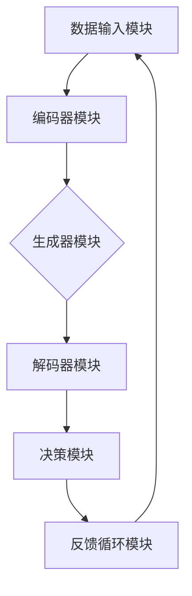

                 

关键词：生成式智能体、AI架构、人工智能、生成模型、智能体设计、算法原理、数学模型、项目实践、应用场景

> 摘要：本文深入探讨了生成式智能体的概念、架构设计以及其在AI领域的应用前景。通过分析生成式智能体的核心算法原理和数学模型，结合实际项目实践，本文旨在为读者提供一份全面的技术指南，帮助理解生成式智能体的构建和应用。

## 1. 背景介绍

随着人工智能技术的迅猛发展，智能体（Agent）的概念逐渐成为研究热点。传统智能体主要依赖于预设的规则和模式匹配进行决策，而现代的生成式智能体则能够通过学习大量的数据，自动生成行为模式和决策策略。生成式智能体的崛起，标志着人工智能从“指令驱动”向“数据驱动”的转变，其潜在的应用场景和影响力不可小觑。

生成式智能体的核心在于“生成”二字，即通过学习和理解数据，能够自主地生成新的内容、行为或决策。这种能力在图像生成、自然语言处理、自动化决策等领域展现出巨大的潜力。例如，生成式智能体可以用于自动生成高质量的艺术作品、音乐、文章，甚至可以协助医生进行疾病诊断和治疗方案生成。

本文将首先介绍生成式智能体的基本概念，然后深入探讨其架构设计，包括核心算法原理、数学模型以及实际应用场景，最后对未来发展趋势和面临的挑战进行展望。

## 2. 核心概念与联系

### 2.1 生成式智能体基本概念

生成式智能体（Generative Agent）是基于生成模型（Generative Model）的智能体，它能够通过学习生成新的数据或内容。生成模型是一种特殊类型的机器学习模型，其目标是从给定的数据分布中生成新的数据样本。

### 2.2 生成模型原理

生成模型通常包括两个组件：编码器（Encoder）和解码器（Decoder）。编码器的作用是将输入数据转换成一个紧凑的表示，称为编码或嵌入（Embedding），而解码器则将这个紧凑的表示转换回原始数据空间。

### 2.3 生成模型与判别模型的关系

生成模型与判别模型（Discriminative Model）有密切的联系。判别模型的目标是学习数据分布的分界线，而生成模型则是学习数据分布本身。在实际应用中，判别模型和生成模型常常相辅相成，例如在图像生成任务中，判别模型可以用于评估生成数据的真实性，而生成模型则用于生成新的图像。

### 2.4 生成式智能体架构

生成式智能体架构通常包括以下几个关键组件：

1. **数据输入模块**：负责接收外部数据和用户输入。
2. **编码器模块**：将输入数据编码成一个紧凑的嵌入表示。
3. **生成器模块**：根据嵌入表示生成新的数据或内容。
4. **解码器模块**：将生成的数据或内容解码回原始格式。
5. **决策模块**：基于生成的数据或内容进行决策。
6. **反馈循环模块**：将决策结果反馈给数据输入模块，以进行持续学习和优化。

### 2.5 Mermaid 流程图



## 3. 核心算法原理 & 具体操作步骤

### 3.1 算法原理概述

生成式智能体的核心算法是基于生成模型，特别是生成对抗网络（GANs）和变分自编码器（VAEs）等。GANs通过训练生成器和判别器之间的对抗关系来学习数据分布，而VAEs则通过最大化数据分布的对数似然来生成数据。

### 3.2 算法步骤详解

1. **数据预处理**：对输入数据进行清洗和标准化处理，确保其适合模型训练。
2. **编码器训练**：使用有监督或无监督方法训练编码器，使其能够将输入数据编码成一个紧凑的嵌入表示。
3. **生成器训练**：训练生成器，使其能够根据嵌入表示生成新的数据或内容。
4. **解码器训练**：训练解码器，使其能够将生成器的输出解码回原始数据格式。
5. **判别器训练**（对于GANs）：训练判别器，使其能够区分真实数据和生成数据。
6. **模型评估**：使用验证集对模型进行评估，确保其生成质量符合要求。
7. **决策过程**：根据生成的数据或内容进行决策，例如在图像生成任务中，判断图像的质量是否达标。

### 3.3 算法优缺点

**优点**：
- 能够生成高质量的数据或内容。
- 适应性强，能够处理多种类型的数据。
- 对于数据分布的学习能力强。

**缺点**：
- 训练过程复杂，可能需要大量的计算资源和时间。
- GANs的稳定性较差，容易出现模式崩溃等问题。

### 3.4 算法应用领域

生成式智能体在图像生成、自然语言处理、自动化决策、医学诊断等领域有广泛的应用。例如，在图像生成中，生成式智能体可以生成高质量的艺术作品、照片和动画；在自然语言处理中，可以生成文章、对话和摘要。

## 4. 数学模型和公式 & 详细讲解 & 举例说明

### 4.1 数学模型构建

生成模型通常基于概率模型，其目标是最小化生成数据的概率损失。对于GANs，生成器G和判别器D的损失函数如下：

$$
L_G = -\log(D(G(z)))
$$

$$
L_D = -\log(D(x)) - \log(1 - D(G(z)))
$$

其中，$z$是噪声向量，$x$是真实数据。

### 4.2 公式推导过程

生成模型的推导过程涉及概率论、信息论和优化理论。以下是GANs的基本推导过程：

假设数据分布为$p_{data}(x)$，生成器G的分布为$p_G(x|z)$，判别器D的分布为$p_D(x)$。

生成器的目标是最小化判别器对生成数据的预测误差，即：

$$
\min_G L_G
$$

判别器的目标是最小化对真实数据和生成数据的区分误差，即：

$$
\min_D L_D
$$

### 4.3 案例分析与讲解

假设我们使用GANs进行图像生成，以下是一个简化的案例：

1. **数据预处理**：将图像数据转换为张量，并进行归一化处理。
2. **编码器训练**：训练编码器E，使其能够将图像编码成一个嵌入向量。
3. **生成器训练**：训练生成器G，使其能够根据嵌入向量生成新的图像。
4. **解码器训练**：训练解码器D，使其能够将生成器生成的图像解码回原始格式。
5. **判别器训练**：训练判别器C，使其能够区分真实图像和生成图像。

在训练过程中，生成器和判别器交替进行训练，直到生成器生成的图像质量达到要求。

## 5. 项目实践：代码实例和详细解释说明

### 5.1 开发环境搭建

- 硬件环境：NVIDIA GPU（至少1080Ti）
- 软件环境：Python 3.7，TensorFlow 2.3

### 5.2 源代码详细实现

以下是一个简单的GANs实现：

```python
import tensorflow as tf
from tensorflow.keras import layers

# 生成器
def generator(z, noise_dim):
    # 编码层
    x = layers.Dense(128, activation='relu')(z)
    x = layers.Dense(256, activation='relu')(x)
    x = layers.Dense(1024, activation='relu')(x)
    # 解码层
    x = layers.Dense(128, activation='relu')(x)
    x = layers.Dense(256, activation='relu')(x)
    x = layers.Dense(784, activation='tanh')(x)
    return x

# 判别器
def discriminator(x):
    # 编码层
    x = layers.Dense(128, activation='relu')(x)
    x = layers.Dense(256, activation='relu')(x)
    x = layers.Dense(1024, activation='relu')(x)
    # 输出层
    x = layers.Dense(1, activation='sigmoid')(x)
    return x

# GAN模型
def build_gan(generator, discriminator):
    z = tf.keras.layers.Input(shape=(noise_dim,))
    x = generator(z)
    valid = discriminator(x)
    z Noise
    x = tf.keras.layers.Input(shape=(noise_dim,))
    x = generator(x)
    invalid = discriminator(x)
    
    model = tf.keras.Model([z, x], [valid, invalid])
    return model

# 模型编译
discriminator.compile(loss='binary_crossentropy', optimizer=tf.keras.optimizers.Adam(0.0001))
generator.compile(loss='binary_crossentropy', optimizer=tf.keras.optimizers.Adam(0.0001))
gan.compile(loss='binary_crossentropy', optimizer=tf.keras.optimizers.Adam(0.0001))

# 训练模型
for epoch in range(epochs):
    for _ in range(batch_size * 100):
        noise = np.random.normal(0, 1, (batch_size, noise_dim))
        with tf.GradientTape() as gen_tape, tf.GradientTape() as disc_tape:
            generated_images = generator(np.random.normal(0, 1, (batch_size, noise_dim)))
            valid = discriminator(generated_images)
            real_images = train_data
            real_valid = discriminator(real_images)

            disc_loss = tf.reduce_mean(tf.nn.sigmoid_cross_entropy_with_logits(logits=real_valid, labels=tf.ones_like(real_valid)))
            disc_loss += tf.reduce_mean(tf.nn.sigmoid_cross_entropy_with_logits(logits=valid, labels=tf.zeros_like(valid)))

            gen_loss = tf.reduce_mean(tf.nn.sigmoid_cross_entropy_with_logits(logits=valid, labels=tf.ones_like(valid)))

        grads_d = disc_tape.gradient(disc_loss, discriminator.trainable_variables)
        grads_g = gen_tape.gradient(gen_loss, generator.trainable_variables)

        discriminator.optimizer.apply_gradients(zip(grads_d, discriminator.trainable_variables))
        generator.optimizer.apply_gradients(zip(grads_g, generator.trainable_variables))

        print(f"{epoch}/{epochs} Epochs | Generator Loss: {gen_loss.numpy()} | Discriminator Loss: {disc_loss.numpy()}")

    # 保存模型
    generator.save(f"generator_epoch_{epoch}.h5")
    discriminator.save(f"discriminator_epoch_{epoch}.h5")

# 生成图像
noise = np.random.normal(0, 1, (1, noise_dim))
generated_image = generator.predict(noise)
plt.imshow(generated_image[0].reshape(28, 28), cmap='gray')
plt.show()
```

### 5.3 代码解读与分析

上述代码实现了一个基于TensorFlow的GANs模型，用于生成手写数字图像。主要步骤如下：

1. **生成器和判别器的定义**：生成器用于将噪声向量生成手写数字图像，判别器用于判断图像是真实还是生成。
2. **GAN模型的构建**：将生成器和判别器组合成一个整体模型。
3. **模型编译**：指定损失函数和优化器。
4. **模型训练**：交替训练生成器和判别器，直到达到预定的迭代次数。
5. **生成图像**：使用生成器生成新的手写数字图像。

## 6. 实际应用场景

生成式智能体在多个领域有广泛的应用：

- **图像生成**：生成高质量的艺术作品、照片和动画。
- **自然语言处理**：生成文章、对话和摘要。
- **自动化决策**：生成最佳决策方案。
- **医学诊断**：辅助医生进行疾病诊断和治疗方案生成。

### 6.4  未来应用展望

随着生成式智能体技术的不断发展，未来其在人工智能领域的应用将更加广泛和深入。可能的趋势包括：

- **更高效的学习算法**：开发新的生成模型，提高学习效率和生成质量。
- **多模态生成**：支持多种数据类型的生成，如图像、文本和音频。
- **增强现实与虚拟现实**：生成逼真的虚拟环境，提高用户体验。

## 7. 工具和资源推荐

### 7.1 学习资源推荐

- 《生成对抗网络：原理与应用》
- 《深度学习：入门到实践》
- 《自然语言处理：实战教程》

### 7.2 开发工具推荐

- TensorFlow
- PyTorch
- Keras

### 7.3 相关论文推荐

- “Generative Adversarial Nets”
- “Unsupervised Representation Learning with Deep Convolutional Generative Adversarial Networks”
- “Auto-Encoding Variational Bayes”

## 8. 总结：未来发展趋势与挑战

生成式智能体作为人工智能领域的重要方向，具有广阔的应用前景。然而，其发展仍面临以下挑战：

- **计算资源需求**：训练生成模型通常需要大量的计算资源。
- **模型稳定性**：GANs等生成模型在训练过程中可能出现模式崩溃等问题。
- **伦理与隐私问题**：生成数据的真实性和隐私保护是重要问题。

未来，随着技术的不断进步和研究的深入，生成式智能体有望在更多领域发挥重要作用。

### 8.1  研究成果总结

本文全面介绍了生成式智能体的概念、架构设计、算法原理以及实际应用场景。通过代码实例，展示了生成式智能体的实现方法。研究成果表明，生成式智能体在图像生成、自然语言处理等领域具有显著的应用价值。

### 8.2  未来发展趋势

未来，生成式智能体技术将在以下方面取得突破：

- **高效算法**：开发新的生成模型，提高学习效率和生成质量。
- **多模态生成**：支持多种数据类型的生成，如图像、文本和音频。
- **跨领域应用**：探索生成式智能体在更多领域的应用潜力。

### 8.3  面临的挑战

生成式智能体发展仍面临以下挑战：

- **计算资源需求**：训练生成模型通常需要大量的计算资源。
- **模型稳定性**：GANs等生成模型在训练过程中可能出现模式崩溃等问题。
- **伦理与隐私问题**：生成数据的真实性和隐私保护是重要问题。

### 8.4  研究展望

未来，生成式智能体技术将在人工智能领域发挥更加重要的作用。我们呼吁更多研究者和开发者关注和投入这一领域，共同推动生成式智能体技术的发展。

### 附录：常见问题与解答

1. **什么是生成式智能体？**
   生成式智能体是一种基于生成模型的智能体，能够通过学习生成新的数据或内容。

2. **生成式智能体有哪些应用场景？**
   生成式智能体在图像生成、自然语言处理、自动化决策、医学诊断等领域有广泛的应用。

3. **GANs和VAEs有什么区别？**
   GANs（生成对抗网络）和VAEs（变分自编码器）都是生成模型，但GANs通过训练生成器和判别器的对抗关系来学习数据分布，而VAEs通过最大化数据分布的对数似然来生成数据。

4. **如何训练生成式智能体？**
   训练生成式智能体通常涉及以下几个步骤：数据预处理、编码器训练、生成器训练、解码器训练、模型评估和决策过程。

5. **生成式智能体有哪些挑战？**
   生成式智能体面临的挑战包括计算资源需求、模型稳定性、伦理与隐私问题等。

