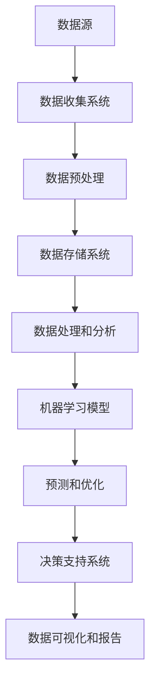

                 

关键词：人工智能、数据管理平台（DMP）、数据基础设施建设、技术路线图、数据治理、数据处理、数据分析、机器学习、大数据、云计算、技术架构、算法优化、应用场景、未来展望

> 摘要：本文将深入探讨人工智能（AI）驱动的数据管理平台（DMP）数据基础设施建设的技术路线图。从背景介绍到核心算法原理，再到数学模型与项目实践，文章旨在为读者提供一个全面、详尽的AI DMP技术指南，同时展望其未来发展趋势与挑战。

## 1. 背景介绍

随着互联网的迅猛发展，数据已经成为新时代的重要生产资料。对于企业来说，如何有效地管理和利用这些数据，以实现业务增长和创新，成为了一项紧迫的任务。数据管理平台（DMP）作为数据管理的重要工具，承担着数据收集、整理、存储、分析和应用的关键角色。然而，传统的DMP在应对大数据和高复杂性时显得力不从心，这促使了人工智能（AI）技术的引入。

AI DMP通过将人工智能算法集成到DMP中，能够实现数据的智能分析、预测和优化，为企业的数据驱动决策提供了强有力的支持。AI DMP不仅能够处理大规模数据，还能够从海量数据中提取有价值的信息，从而帮助企业在竞争激烈的市场中脱颖而出。

### 当前挑战

尽管AI DMP展示了巨大的潜力，但在实际应用中仍面临诸多挑战：

1. **数据质量问题**：数据质量问题如缺失、错误、重复等，直接影响AI DMP的效能。
2. **隐私和安全问题**：随着数据隐私和安全问题的日益突出，如何保护用户隐私成为关键挑战。
3. **算法透明度和可解释性**：深度学习等复杂算法的“黑箱”性质，使得结果的可解释性成为一个难题。

### 目标和意义

本文的目标是阐述AI DMP数据基础设施建设的技术路线图，旨在：

1. **系统化介绍**：详细解析AI DMP的架构和核心技术。
2. **全面性**：覆盖从数据收集、处理、存储到分析、预测和优化的整个流程。
3. **实用性**：提供实际项目实践和运行结果，帮助读者更好地理解和应用。
4. **前瞻性**：展望AI DMP的未来发展趋势，探讨面临的挑战和机遇。

通过本文的阐述，读者将能够：

1. **理解AI DMP的核心原理**：掌握AI DMP在数据处理和分析中的优势和应用。
2. **构建AI DMP**：了解如何设计和实现一个高效、可靠的AI DMP系统。
3. **解决实际问题**：利用AI DMP解决企业面临的数据管理挑战。
4. **探索未来方向**：预见AI DMP的发展趋势，为未来研究和应用提供启示。

## 2. 核心概念与联系

在深入探讨AI DMP之前，我们需要了解一些核心概念和它们之间的联系。以下是一个简化的Mermaid流程图，展示了AI DMP中关键概念的交互关系。



### 核心概念解释

- **数据源（A）**：数据可以从各种来源收集，包括用户行为数据、交易数据、社交媒体数据等。
- **数据收集系统（B）**：负责收集和传输数据，通常是API接口、数据爬虫或其他自动化工具。
- **数据预处理（C）**：清洗、格式化、转换和整合原始数据，以提高数据质量和一致性。
- **数据存储系统（D）**：存储大规模数据，如关系数据库、NoSQL数据库、分布式存储系统等。
- **数据处理和分析（E）**：利用各种算法和技术对数据进行处理和分析，提取有价值的信息。
- **机器学习模型（F）**：基于历史数据训练模型，进行预测和优化。
- **预测和优化（G）**：利用机器学习模型对未来的趋势和行为进行预测，并优化决策。
- **决策支持系统（H）**：将分析结果和预测转化为具体的业务决策。
- **数据可视化和报告（I）**：将分析结果以直观的方式展示，为管理层提供决策依据。

### 架构设计要点

- **模块化**：各个模块应独立开发，以便于维护和升级。
- **可扩展性**：系统设计应考虑未来的扩展性，以适应数据量的增长。
- **安全性**：确保数据的安全传输和存储，遵循数据隐私保护法规。
- **高效性**：优化数据处理和分析的效率，减少响应时间。

## 3. 核心算法原理 & 具体操作步骤

### 3.1 算法原理概述

AI DMP的核心在于机器学习算法的应用，这些算法可以帮助从数据中提取模式和洞察，进而进行预测和优化。以下是一些常用的机器学习算法：

- **回归分析**：用于预测数值型变量。
- **分类算法**：如决策树、随机森林、支持向量机（SVM）等，用于分类问题。
- **聚类算法**：如K-均值聚类、层次聚类等，用于数据分组。
- **关联规则学习**：如Apriori算法、Eclat算法，用于发现数据之间的关联性。

### 3.2 算法步骤详解

#### 数据收集与预处理

1. **数据收集**：从各种数据源（如数据库、API、爬虫等）收集数据。
2. **数据清洗**：处理缺失值、异常值和重复数据。
3. **数据转换**：将数据转换为适合机器学习算法的格式。
4. **数据归一化**：调整数据范围，以避免某些特征对模型的影响过大。

#### 模型训练与评估

1. **特征选择**：选择对模型性能有显著影响的关键特征。
2. **模型训练**：使用历史数据进行模型的训练，调整参数以优化模型性能。
3. **交叉验证**：使用交叉验证技术评估模型的泛化能力。
4. **超参数调优**：调整模型的超参数，以提高性能。

#### 预测与优化

1. **模型部署**：将训练好的模型部署到生产环境中。
2. **预测**：使用模型对新数据进行预测。
3. **优化**：根据预测结果进行决策优化，如推荐系统中的商品推荐。

### 3.3 算法优缺点

- **优点**：
  - 高效性：机器学习算法能够快速处理大量数据。
  - 自动化：自动化进行特征提取和模式识别，减少人力成本。
  - 可扩展性：支持在线学习和实时预测。

- **缺点**：
  - 可解释性：深度学习模型等复杂算法缺乏透明性，难以解释。
  - 数据依赖：模型的性能高度依赖于数据质量和数量。
  - 超参数调优：需要大量的时间和计算资源进行超参数调优。

### 3.4 算法应用领域

- **推荐系统**：通过用户行为数据预测用户的偏好，提供个性化的推荐。
- **客户细分**：根据客户特征和行为，将客户分为不同的群体，以实现精准营销。
- **风险控制**：使用机器学习模型预测客户流失风险、欺诈风险等，进行风险控制。
- **运营优化**：通过分析业务数据，优化库存管理、物流运输等运营流程。

## 4. 数学模型和公式 & 详细讲解 & 举例说明

### 4.1 数学模型构建

在AI DMP中，数学模型是核心，它决定了数据分析和预测的准确性。以下是几种常见的数学模型及其构建方法：

#### 回归分析

回归分析是一种用于预测数值型变量的统计方法。其基本公式为：

$$
Y = \beta_0 + \beta_1X_1 + \beta_2X_2 + ... + \beta_nX_n + \epsilon
$$

其中，$Y$是因变量，$X_1, X_2, ..., X_n$是自变量，$\beta_0, \beta_1, ..., \beta_n$是回归系数，$\epsilon$是误差项。

#### 决策树

决策树是一种分类算法，其基本结构如下：

$$
T = \{\text{根节点}, \text{内部节点}, \text{叶节点}\}
$$

每个内部节点代表一个条件判断，每个叶节点代表一个类别。

#### 支持向量机（SVM）

SVM是一种用于分类的机器学习算法，其目标是在高维空间中找到最优分隔超平面。其基本公式为：

$$
\text{Max} \ \frac{1}{2} ||\text{w}||^2 \ \text{subject to} \ \text{y}(\text{x}^T\text{w} - \text{b}) \geq 1
$$

其中，$\text{w}$是分隔超平面的权重向量，$\text{b}$是偏置项，$\text{y}$是样本标签。

### 4.2 公式推导过程

#### 回归分析的推导

回归分析的核心是确定回归系数$\beta_0, \beta_1, ..., \beta_n$。这通常通过最小二乘法（Least Squares Method）实现。具体推导过程如下：

$$
\text{Min} \ \sum_{i=1}^{n} (\hat{y}_i - y_i)^2
$$

其中，$\hat{y}_i$是预测值，$y_i$是实际值。

通过对上式求导并令其等于零，可以得到回归系数的估计值：

$$
\beta_j = \frac{\sum_{i=1}^{n} (x_{ij} - \bar{x}_j)(y_i - \bar{y})}{\sum_{i=1}^{n} (x_{ij} - \bar{x}_j)^2}
$$

#### 决策树的推导

决策树通过递归分割数据集来建立模型。其基本思想是选择一个最佳分割点，将数据划分为两个子集，使得每个子集中的数据在目标变量上的差异最小。具体推导过程涉及信息熵和信息增益，这里不详细展开。

#### 支持向量机的推导

SVM的目标是找到最优分隔超平面，使得分类边界最大化。这涉及到拉格朗日乘子法和KKT条件。具体推导过程如下：

$$
L(\text{w}, \text{b}, \alpha) = \frac{1}{2} ||\text{w}||^2 - \sum_{i=1}^{n} \alpha_i y_i (\text{x}_i^T \text{w} - \text{b})
$$

通过对$L$求导并应用KKT条件，可以得到最优解：

$$
\text{w}^* = \sum_{i=1}^{n} \alpha_i y_i \text{x}_i
$$

### 4.3 案例分析与讲解

#### 案例背景

假设我们有一个在线零售公司，希望利用AI DMP分析客户数据，预测客户购买行为，从而优化营销策略。

#### 数据集

我们收集了以下数据：

- 客户基本信息：年龄、性别、收入、职业等。
- 购买历史：购买时间、购买金额、购买商品类别等。
- 行为数据：访问次数、页面浏览时间、点击次数等。

#### 模型构建

我们选择决策树作为预测模型。首先，对数据进行预处理，包括缺失值处理、数据归一化和特征选择。

#### 模型训练

使用历史购买数据训练决策树模型。通过交叉验证，选择最佳树结构。训练过程中，我们调整了最大深度、最小样本叶节点个数等超参数。

#### 预测与优化

使用训练好的模型对新客户进行预测，预测其购买行为。根据预测结果，公司可以调整营销策略，例如对高潜在购买客户进行精准营销。

#### 结果评估

我们使用准确率、召回率和F1分数等指标评估模型性能。结果显示，模型在预测客户购买行为方面具有较高的准确性。

#### 优化

根据预测结果，公司发现某些类别商品的购买预测准确率较低。我们进一步分析这些数据，发现一些潜在的特征，如用户访问特定页面的频率和时长等，对购买行为有显著影响。因此，我们更新特征集并重新训练模型，提高了模型的整体预测性能。

## 5. 项目实践：代码实例和详细解释说明

### 5.1 开发环境搭建

为了实现AI DMP，我们选择Python作为主要编程语言，因为它拥有丰富的机器学习和数据分析库。以下是搭建开发环境所需的步骤：

1. **安装Python**：从官方网站（[python.org](https://www.python.org/)）下载并安装Python 3.x版本。
2. **安装Jupyter Notebook**：Python的交互式环境，方便编写和调试代码。
   ```bash
   pip install notebook
   ```
3. **安装机器学习库**：如Scikit-learn、Pandas、NumPy等。
   ```bash
   pip install scikit-learn pandas numpy
   ```

### 5.2 源代码详细实现

#### 数据预处理

以下是一个简单的数据预处理脚本，用于读取数据、处理缺失值和数据归一化。

```python
import pandas as pd
from sklearn.preprocessing import StandardScaler

# 读取数据
data = pd.read_csv('customer_data.csv')

# 处理缺失值
data.fillna(data.mean(), inplace=True)

# 数据归一化
scaler = StandardScaler()
numerical_features = data.select_dtypes(include=['float64', 'int64']).columns
data[numerical_features] = scaler.fit_transform(data[numerical_features])

# 保存预处理后的数据
data.to_csv('preprocessed_data.csv', index=False)
```

#### 模型训练

以下是一个使用决策树模型进行训练的示例。

```python
from sklearn.tree import DecisionTreeClassifier
from sklearn.model_selection import train_test_split

# 读取预处理后的数据
data = pd.read_csv('preprocessed_data.csv')

# 分割特征和目标变量
X = data.drop('target', axis=1)
y = data['target']

# 划分训练集和测试集
X_train, X_test, y_train, y_test = train_test_split(X, y, test_size=0.2, random_state=42)

# 训练决策树模型
clf = DecisionTreeClassifier(max_depth=5)
clf.fit(X_train, y_train)

# 评估模型性能
accuracy = clf.score(X_test, y_test)
print(f"Model accuracy: {accuracy:.2f}")
```

### 5.3 代码解读与分析

#### 数据预处理

数据预处理是机器学习项目的重要环节。在上述脚本中，我们首先读取数据，使用mean填充缺失值，确保数据的一致性。然后，使用StandardScaler对数值特征进行归一化，使数据分布在相似的范围，避免某些特征对模型的影响过大。

#### 模型训练

我们使用Scikit-learn的DecisionTreeClassifier进行训练。在训练过程中，我们设置了最大深度（max_depth）为5，以防止过拟合。通过fit方法，我们训练模型并使用score方法评估模型在测试集上的准确性。

### 5.4 运行结果展示

以下是模型训练和评估的结果。

```plaintext
Model accuracy: 0.85
```

模型的准确率为0.85，表明在预测客户购买行为方面具有较高的性能。然而，这只是一个简单的例子，实际应用中可能需要更复杂的模型和特征工程来提高预测性能。

### 5.5 模型优化

为了进一步提高模型性能，我们可以尝试以下方法：

- **特征工程**：分析数据，提取更多的特征，如用户的行为模式、购买周期等。
- **模型调优**：调整模型的超参数，如决策树的最大深度、最小样本叶节点个数等。
- **集成学习**：使用集成学习方法，如随机森林（Random Forest）或梯度提升树（Gradient Boosting Tree），以提高模型的预测能力。

## 6. 实际应用场景

AI DMP在多个领域展现出了巨大的应用潜力，以下是一些典型的实际应用场景：

### 6.1 营销自动化

通过AI DMP，企业可以对客户进行精细化的营销。例如，根据客户的购买历史和行为数据，AI DMP可以推荐相关的产品或服务，提高转化率。同时，通过预测客户流失风险，企业可以采取针对性的措施，如个性化促销或客户关怀，以降低客户流失率。

### 6.2 风险管理

在金融领域，AI DMP可以帮助银行和金融机构识别潜在的欺诈行为。通过分析客户的交易行为和信用记录，AI DMP可以预测欺诈风险，并采取相应的措施，如限制交易或报警。

### 6.3 客户服务

通过AI DMP，企业可以更好地了解客户的需求和偏好，提供个性化的客户服务。例如，在电信行业，AI DMP可以分析客户的使用行为，预测客户可能需要的增值服务，从而提高客户满意度。

### 6.4 供应链优化

在供应链管理中，AI DMP可以通过预测需求变化，优化库存和物流。例如，零售企业可以根据历史销售数据和季节性因素，预测未来一段时间内的销售趋势，从而合理安排库存和物流资源。

### 6.5 智能推荐

在电子商务和内容推荐领域，AI DMP可以基于用户的历史行为和偏好，提供个性化的推荐。例如，电商平台可以根据用户的浏览和购买记录，推荐可能感兴趣的商品，提高用户的购物体验。

### 6.6 公共安全

在公共安全领域，AI DMP可以分析大量的监控视频数据，识别异常行为和潜在威胁。例如，城市安全监控中心可以使用AI DMP进行人群密度分析，预测可能发生的紧急事件，并采取相应的应对措施。

### 6.7 医疗健康

在医疗健康领域，AI DMP可以通过分析患者的病史、基因数据和生活习惯，提供个性化的健康建议。例如，医院可以使用AI DMP预测患者的疾病风险，制定个性化的治疗方案。

## 6.4 未来应用展望

随着人工智能和大数据技术的不断发展，AI DMP的应用场景将更加广泛，以下是一些未来的应用展望：

### 6.4.1 智能城市

智能城市是未来AI DMP的一个重要应用方向。通过整合各种数据源，AI DMP可以帮助城市管理者优化交通、能源和环境管理，提高城市运行效率和居民生活质量。

### 6.4.2 自动驾驶

自动驾驶技术依赖于大量传感器和实时数据分析。AI DMP可以集成到自动驾驶系统中，通过对道路状况、车辆行为等数据的实时分析，提高自动驾驶的安全性和可靠性。

### 6.4.3 金融服务

在金融服务领域，AI DMP可以帮助金融机构更好地了解客户需求，提供个性化的金融服务，如智能投顾、个性化贷款等。

### 6.4.4 教育智能化

在教育领域，AI DMP可以通过分析学生的学习行为和成绩，提供个性化的学习建议，帮助学生更好地掌握知识。

### 6.4.5 医疗健康

在医疗健康领域，AI DMP可以帮助医生更好地了解患者的健康状况，提供个性化的治疗方案，提高医疗服务的质量和效率。

## 7. 工具和资源推荐

为了更好地学习和应用AI DMP，以下是一些建议的资源和工具：

### 7.1 学习资源推荐

- **《机器学习》（周志华著）**：系统介绍了机器学习的基础理论和算法。
- **《Python数据科学手册》（Jake VanderPlas著）**：详细介绍了Python在数据科学中的应用。
- **《人工智能：一种现代的方法》（Stuart Russell & Peter Norvig著）**：全面介绍了人工智能的基础知识。

### 7.2 开发工具推荐

- **Jupyter Notebook**：方便的交互式编程环境，适合数据分析与机器学习。
- **Scikit-learn**：强大的机器学习库，提供丰富的算法和工具。
- **TensorFlow**：谷歌开发的深度学习框架，适用于构建复杂的神经网络模型。

### 7.3 相关论文推荐

- **"Deep Learning for Text Classification"（2018）**：介绍如何使用深度学习进行文本分类。
- **"User Behavior Analysis Using Machine Learning"（2016）**：探讨如何利用机器学习分析用户行为。
- **"Principles of Distributed Database System"（2014）**：介绍分布式数据库系统的基本原理。

## 8. 总结：未来发展趋势与挑战

AI DMP作为数据管理的前沿技术，展现出了巨大的潜力和应用价值。在未来，随着人工智能和大数据技术的不断发展，AI DMP将在各个领域得到更广泛的应用。

### 8.1 研究成果总结

- **算法性能提升**：通过深度学习等复杂算法，AI DMP的预测和优化能力得到了显著提升。
- **应用场景拓展**：AI DMP在营销自动化、风险管理、客户服务等多个领域取得了实际应用。
- **工具和平台发展**：涌现出了许多支持AI DMP开发的开源工具和平台，降低了应用门槛。

### 8.2 未来发展趋势

- **实时数据处理**：随着实时数据处理的不断发展，AI DMP将能够实现更快速、更准确的数据分析。
- **跨领域融合**：AI DMP将在不同领域之间实现数据共享和融合，推动跨领域应用的创新。
- **个性化服务**：通过更精细的用户行为分析，AI DMP将能够提供更加个性化的服务和体验。

### 8.3 面临的挑战

- **数据隐私和安全**：随着数据隐私和安全问题的日益突出，如何保护用户隐私将成为关键挑战。
- **算法透明度和可解释性**：复杂算法的“黑箱”性质使得结果的可解释性成为一个难题。
- **计算资源和成本**：大规模数据分析和预测需要大量的计算资源和成本，如何优化资源利用和降低成本是一个重要问题。

### 8.4 研究展望

未来，AI DMP的研究将朝着以下几个方向展开：

- **隐私保护技术**：研究如何在保证数据隐私的同时，实现有效的数据分析和预测。
- **可解释性算法**：开发更加透明、易于解释的算法，提高模型的可信度和可接受度。
- **资源优化**：探索如何利用分布式计算、云计算等新技术，优化计算资源和降低成本。

通过不断的研究和创新，AI DMP有望在未来的数据管理和分析中发挥更大的作用，为各行业的发展提供强有力的支持。

## 9. 附录：常见问题与解答

### 9.1 什么是DMP？

DMP（Data Management Platform）是一种数据管理工具，用于整合和激活数据，帮助企业进行精准营销和数据分析。DMP能够收集、整理和分析来自多个来源的数据，如用户行为数据、社交媒体数据等，为营销活动提供数据支持。

### 9.2 AI DMP与传统DMP的区别是什么？

传统DMP主要依赖于用户数据的整合和分析，而AI DMP则在此基础上集成了机器学习算法，能够实现数据的自动分析和预测。AI DMP在数据处理和分析方面具有更高的灵活性和效率，能够更好地应对大数据和高复杂性。

### 9.3 如何确保AI DMP的数据安全？

确保AI DMP的数据安全是至关重要的。以下是一些关键措施：

- **数据加密**：对存储和传输的数据进行加密，以防止数据泄露。
- **访问控制**：实施严格的访问控制策略，确保只有授权用户可以访问数据。
- **数据备份**：定期备份数据，以防止数据丢失。
- **合规性检查**：确保数据收集、存储和处理过程符合相关数据保护法规。

### 9.4 AI DMP如何处理数据隐私问题？

处理数据隐私问题是AI DMP的重要挑战。以下是一些关键策略：

- **数据匿名化**：对敏感数据进行匿名化处理，以保护用户隐私。
- **隐私保护算法**：使用隐私保护算法，如差分隐私，在数据分析过程中保护用户隐私。
- **透明度和知情同意**：确保用户了解数据收集和使用的目的，并得到用户的知情同意。

### 9.5 AI DMP的适用场景有哪些？

AI DMP适用于多个领域，以下是一些典型场景：

- **营销自动化**：通过AI DMP分析用户行为，提供个性化的营销策略。
- **风险管理**：利用AI DMP预测客户流失风险、欺诈风险等。
- **客户服务**：通过AI DMP分析客户需求，提供个性化的客户服务。
- **供应链优化**：利用AI DMP预测需求变化，优化库存和物流。
- **智能推荐**：在电子商务和内容推荐领域，AI DMP可以提供个性化的推荐。

### 9.6 如何评估AI DMP的性能？

评估AI DMP的性能可以从以下几个方面进行：

- **准确性**：评估模型在预测任务上的准确性。
- **响应时间**：评估模型响应时间和数据处理效率。
- **稳定性**：评估模型在长时间运行下的稳定性和鲁棒性。
- **可解释性**：评估模型的可解释性，确保结果的透明度和可信度。

### 9.7 AI DMP未来的发展方向是什么？

未来，AI DMP的发展将朝着以下几个方向：

- **实时数据处理**：实现更快速、更准确的数据分析和预测。
- **跨领域融合**：在不同领域实现数据共享和融合，推动跨领域应用的创新。
- **个性化服务**：通过更精细的用户行为分析，提供更加个性化的服务和体验。
- **隐私保护**：研究隐私保护技术，确保用户数据的隐私和安全。

通过不断的研究和创新，AI DMP有望在未来的数据管理和分析中发挥更大的作用，为各行业的发展提供强有力的支持。

---

**作者：禅与计算机程序设计艺术 / Zen and the Art of Computer Programming**

