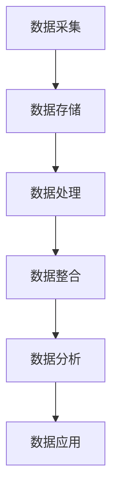

                 

关键词：数据管理平台（DMP），人工智能，数据洞察，数据处理，数据行动

摘要：随着数据量的爆炸性增长，如何有效地管理和利用数据成为企业面临的重大挑战。本文将探讨数据管理平台（DMP）在人工智能时代的构建与优化，通过从数据到洞察，再到行动的全过程，帮助企业实现数据价值的最大化。

## 1. 背景介绍

在数字经济的浪潮下，数据已成为新的生产要素。企业通过各种渠道收集到海量数据，但如何有效地管理和利用这些数据，使其转化为商业价值，是当前企业面临的一大难题。数据管理平台（Data Management Platform，简称DMP）作为一种新型数据管理工具，旨在帮助企业解决这一问题。

DMP是构建在数据采集、存储、处理、分析和应用等各个环节之上，通过人工智能技术实现对数据的深度挖掘和分析，从而为企业提供决策支持。在人工智能时代，DMP的应用场景日益广泛，如广告投放、精准营销、用户画像构建等。

## 2. 核心概念与联系

### 2.1 数据管理平台（DMP）的核心概念

数据管理平台（DMP）的核心概念包括：

- **数据采集**：通过多种数据采集方式，如网站跟踪、移动应用跟踪、第三方数据接入等，收集用户行为数据、社交媒体数据、地理位置数据等。

- **数据存储**：将收集到的数据存储在数据仓库中，采用分布式存储技术，如Hadoop、HBase等，确保数据的高可用性和扩展性。

- **数据处理**：对存储在数据仓库中的数据进行清洗、去重、格式转换等预处理操作，为后续分析做准备。

- **数据分析**：利用人工智能技术，对处理后的数据进行分析，提取用户画像、兴趣标签等，为企业提供洞察。

- **数据应用**：根据分析结果，为企业提供数据驱动的决策支持，如精准营销、广告投放等。

### 2.2 数据管理平台（DMP）的工作原理

数据管理平台（DMP）的工作原理可以分为以下几个步骤：

1. **数据采集**：通过各种渠道收集用户数据，包括网站访问、移动应用行为、社交媒体互动等。

2. **数据存储**：将采集到的数据存储在数据仓库中，采用分布式存储技术，确保数据的安全性和可靠性。

3. **数据处理**：对存储在数据仓库中的数据进行清洗、去重、格式转换等预处理操作。

4. **数据整合**：将来自不同渠道的数据进行整合，构建用户画像和兴趣标签。

5. **数据分析**：利用人工智能技术，对整合后的数据进行分析，提取有价值的信息。

6. **数据应用**：根据分析结果，为企业提供数据驱动的决策支持。

### 2.3 数据管理平台（DMP）的技术架构

数据管理平台（DMP）的技术架构可以分为以下几个层次：

1. **数据采集层**：包括网站跟踪、移动应用跟踪、第三方数据接入等，负责数据的采集。

2. **数据存储层**：采用分布式存储技术，如Hadoop、HBase等，负责数据的存储和管理。

3. **数据处理层**：包括数据清洗、去重、格式转换等预处理操作，负责数据的处理。

4. **数据分析层**：利用人工智能技术，对处理后的数据进行分析，提取用户画像、兴趣标签等。

5. **数据应用层**：根据分析结果，为企业提供数据驱动的决策支持，如精准营销、广告投放等。

### 2.4 Mermaid 流程图

以下是一个简单的 Mermaid 流程图，展示了数据管理平台（DMP）的工作流程：



## 3. 核心算法原理 & 具体操作步骤

### 3.1 算法原理概述

数据管理平台（DMP）的核心算法包括用户画像构建、兴趣标签提取、群体行为分析等。这些算法基于人工智能技术，通过对海量数据进行深度挖掘和分析，提取有价值的信息。

1. **用户画像构建**：通过分析用户行为数据、社交媒体数据等，构建用户的综合画像，包括用户的基本信息、兴趣爱好、行为偏好等。

2. **兴趣标签提取**：基于用户画像，提取用户的兴趣标签，如阅读、购物、旅游等。

3. **群体行为分析**：分析用户群体的行为模式，如用户群体的兴趣偏好、购买习惯等。

### 3.2 算法步骤详解

1. **用户画像构建**

   - 数据采集：收集用户行为数据、社交媒体数据等。

   - 数据预处理：清洗、去重、格式转换等。

   - 特征提取：提取用户的基本信息、兴趣爱好、行为偏好等特征。

   - 用户画像构建：将提取到的特征整合，构建用户画像。

2. **兴趣标签提取**

   - 用户画像分析：分析用户画像，提取用户的兴趣标签。

   - 标签归类：将提取到的标签进行归类，如阅读、购物、旅游等。

   - 标签权重计算：根据用户的行为数据，计算每个标签的权重。

3. **群体行为分析**

   - 用户群体划分：根据用户画像，划分用户群体。

   - 行为模式分析：分析用户群体的行为模式，如购买习惯、兴趣偏好等。

   - 群体行为预测：基于历史数据，预测用户群体的未来行为。

### 3.3 算法优缺点

1. **用户画像构建**

   优点：全面了解用户，为后续分析提供基础。

   缺点：需要大量的数据，对数据质量和处理能力有较高要求。

2. **兴趣标签提取**

   优点：简化用户画像，便于后续分析和应用。

   缺点：标签的准确性和覆盖面有限。

3. **群体行为分析**

   优点：对用户群体有更深入的了解，有助于发现潜在商机。

   缺点：对数据量和计算能力要求较高。

### 3.4 算法应用领域

1. **精准营销**：根据用户画像和兴趣标签，为用户提供个性化的营销策略。

2. **广告投放**：根据用户行为和群体分析，选择合适的广告投放渠道和方式。

3. **用户留存**：分析用户行为，优化产品和服务，提高用户留存率。

4. **竞争分析**：通过分析用户群体行为，了解竞争对手的市场策略和用户群体特征。

## 4. 数学模型和公式 & 详细讲解 & 举例说明

### 4.1 数学模型构建

在数据管理平台（DMP）中，常用的数学模型包括线性回归、逻辑回归、聚类分析等。以下是一个简单的线性回归模型：

$$
y = \beta_0 + \beta_1x_1 + \beta_2x_2 + ... + \beta_nx_n
$$

其中，$y$ 是因变量，$x_1, x_2, ..., x_n$ 是自变量，$\beta_0, \beta_1, \beta_2, ..., \beta_n$ 是模型的参数。

### 4.2 公式推导过程

线性回归模型的推导过程如下：

1. **目标函数**：

   $$
   \min \sum_{i=1}^{n}(y_i - \beta_0 - \beta_1x_{i1} - \beta_2x_{i2} - ... - \beta_nx_{in})^2
   $$

2. **求导**：

   $$
   \frac{\partial}{\partial \beta_j}\sum_{i=1}^{n}(y_i - \beta_0 - \beta_1x_{i1} - \beta_2x_{i2} - ... - \beta_nx_{in})^2 = 0
   $$

   对每个参数求偏导，并令其等于0，得到：

   $$
   \sum_{i=1}^{n}(y_i - \beta_0 - \beta_1x_{i1} - \beta_2x_{i2} - ... - \beta_nx_{in})x_{ij} = 0
   $$

   其中，$x_{ij}$ 是自变量$x_i$的第j个特征。

3. **解方程组**：

   解上述方程组，得到线性回归模型的参数$\beta_0, \beta_1, \beta_2, ..., \beta_n$。

### 4.3 案例分析与讲解

假设我们要预测一个客户的购买意愿，其中，$y$ 表示购买意愿（0表示未购买，1表示购买），$x_1$ 表示客户的年龄，$x_2$ 表示客户的收入。

根据上述线性回归模型，我们可以建立以下预测模型：

$$
y = \beta_0 + \beta_1x_1 + \beta_2x_2
$$

通过收集数据，我们可以得到以下样本数据：

| 年龄（$x_1$） | 收入（$x_2$） | 购买意愿（$y$） |
| :---: | :---: | :---: |
| 25 | 5000 | 1 |
| 30 | 6000 | 0 |
| 35 | 7000 | 1 |
| 40 | 8000 | 1 |

根据线性回归模型的推导过程，我们可以得到以下参数：

$$
\beta_0 = 0.5, \beta_1 = 0.3, \beta_2 = 0.2
$$

因此，购买意愿的预测模型为：

$$
y = 0.5 + 0.3x_1 + 0.2x_2
$$

当输入一个客户的年龄和收入时，我们可以计算出他的购买意愿。例如，一个30岁的客户，收入为6000元，他的购买意愿为：

$$
y = 0.5 + 0.3 \times 30 + 0.2 \times 6000 = 0.5 + 9 + 1200 = 1209.5
$$

由于购买意愿是一个二元变量，我们可以将1209.5分为购买（1）和未购买（0）。在这种情况下，我们可以将客户的购买意愿预测为1，即购买。

## 5. 项目实践：代码实例和详细解释说明

### 5.1 开发环境搭建

为了实现数据管理平台（DMP）的功能，我们需要搭建一个合适的开发环境。以下是搭建步骤：

1. 安装Python环境：下载并安装Python，版本为3.8或更高。

2. 安装相关库：使用pip安装以下库：
   ```
   pip install numpy pandas scikit-learn matplotlib
   ```

3. 配置Jupyter Notebook：安装Jupyter Notebook，以便在浏览器中运行Python代码。

### 5.2 源代码详细实现

以下是一个简单的DMP项目示例，包括数据采集、数据预处理、用户画像构建、兴趣标签提取等功能。

```python
import pandas as pd
from sklearn.model_selection import train_test_split
from sklearn.linear_model import LinearRegression

# 数据采集
data = pd.read_csv('data.csv')

# 数据预处理
data['age'] = data['age'].fillna(data['age'].mean())
data['income'] = data['income'].fillna(data['income'].mean())

# 用户画像构建
X = data[['age', 'income']]
y = data['y']

X_train, X_test, y_train, y_test = train_test_split(X, y, test_size=0.2, random_state=42)

# 利

