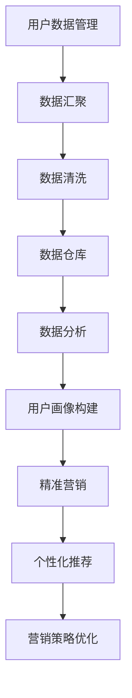

                 

关键词：人工智能，数据分析，数据管理平台，洞察，算法，应用场景

> 摘要：本文将深入探讨人工智能（AI）驱动下的数据管理平台（DMP）构建及其在数据分析与洞察方面的应用。通过详细解析DMP的核心概念、算法原理、数学模型、实际应用案例，旨在为读者提供一个全面的技术视角，同时展望未来DMP的发展趋势和面临的挑战。

## 1. 背景介绍

在当今数据驱动的世界中，数据管理平台（DMP）成为了数据分析和商业智能的核心基础设施。随着大数据、云计算和人工智能技术的飞速发展，DMP在商业决策、市场洞察和个性化推荐等领域发挥着至关重要的作用。

DMP的基本概念包括用户数据管理、数据汇聚、数据分析和用户画像构建等。它通过整合多个数据源，构建一个集中的用户数据仓库，进而实现对用户行为的深度分析和洞察。在AI的赋能下，DMP的数据处理能力得到了极大的提升，从而能够更准确、高效地满足商业需求。

本文将从以下几个方面展开讨论：

- **核心概念与联系**：介绍DMP的核心概念及其在数据分析中的应用。
- **核心算法原理 & 具体操作步骤**：探讨DMP中的常见算法及其应用场景。
- **数学模型和公式**：分析DMP中的数学模型和公式，并给出实例说明。
- **项目实践：代码实例和详细解释说明**：通过具体代码实例展示DMP的实际应用。
- **实际应用场景**：探讨DMP在各类实际场景中的应用。
- **未来应用展望**：展望DMP的未来发展趋势和潜在应用。
- **工具和资源推荐**：推荐学习资源和开发工具。
- **总结：未来发展趋势与挑战**：总结研究成果，分析未来挑战。

### 1.1 数据驱动的商业变革

随着互联网的普及和数字化进程的加速，企业面临着海量数据的挑战。数据不再仅仅是一种记录工具，而是成为决策、洞察和创新的源泉。DMP作为数据管理和分析的利器，正在推动商业模式的变革。

### 1.2 DMP的基本概念和功能

DMP的主要功能包括：

- **用户数据管理**：整合来自不同渠道的用户数据，包括浏览行为、购买记录、社交媒体活动等。
- **数据汇聚**：将分散的数据源集中到一个统一的平台上，便于管理和分析。
- **数据分析**：利用统计分析、机器学习等手段对数据进行处理和分析，提取有价值的信息。
- **用户画像构建**：通过分析用户数据，构建详细的用户画像，以便进行精准营销和个性化推荐。

### 1.3 数据管理和分析的重要性

有效的数据管理和分析能够帮助企业：

- **提升客户体验**：通过用户画像和个性化推荐，提供更符合用户需求的体验。
- **优化营销策略**：通过数据驱动的决策，提高营销活动的效果和回报。
- **降低运营成本**：通过数据优化业务流程，降低运营成本。
- **提高竞争力**：通过数据洞察，发现市场机会，增强竞争优势。

在接下来的部分，我们将详细探讨DMP的核心概念、算法原理、数学模型以及实际应用，帮助读者深入了解这一重要的数据管理技术。

## 2. 核心概念与联系

### 2.1 DMP的组成部分

数据管理平台（DMP）的构建涉及多个核心组成部分，这些部分相互作用，共同实现了数据的价值挖掘。以下是DMP的主要组成部分及其关系：

#### 2.1.1 用户数据管理

用户数据管理是DMP的基础，它包括用户的个人信息、行为数据、交易数据等。这些数据源可以来自网站、移动应用、社交媒体等多个渠道。

#### 2.1.2 数据汇聚

数据汇聚环节负责将分散在不同数据源中的数据进行整合，形成一个统一的用户视图。这一过程需要处理数据格式的差异、数据质量的校验等问题。

#### 2.1.3 数据清洗

数据清洗是确保数据质量的重要步骤，它包括去除重复数据、纠正错误数据、填补缺失数据等。高质量的输入数据是获得准确分析结果的前提。

#### 2.1.4 数据仓库

数据仓库是DMP的核心存储设施，它存储了从不同数据源汇聚而来的结构化和非结构化数据。数据仓库的设计和管理对DMP的性能和可扩展性至关重要。

#### 2.1.5 数据分析

数据分析是DMP的核心功能，它利用统计分析、机器学习等技术对数据进行处理和分析，提取有价值的信息。数据分析结果可以用于用户画像构建、营销策略优化等。

#### 2.1.6 用户画像构建

用户画像构建是将用户数据转化为具体描述的过程，它通过分析用户行为和属性，构建出个性化的用户模型。用户画像是实现精准营销和个性化推荐的基础。

### 2.2 DMP的Mermaid流程图

为了更直观地展示DMP的组成部分及其关系，我们可以使用Mermaid流程图来描述。以下是DMP的Mermaid流程图示例：



在这个流程图中，每个节点都代表了DMP中的一个关键环节，箭头表示数据流和逻辑关系。通过这个流程图，我们可以清晰地看到DMP的整体架构和各部分之间的关联。

### 2.3 DMP在数据分析中的应用

DMP在数据分析中的应用体现在以下几个方面：

- **用户行为分析**：通过对用户的行为数据进行深度分析，了解用户的兴趣偏好、消费习惯等，为个性化推荐和精准营销提供依据。
- **市场趋势分析**：通过分析市场数据，识别市场趋势和机会，帮助企业制定更加有效的市场策略。
- **广告效果评估**：通过评估广告投放的效果，优化广告投放策略，提高广告投放的ROI。
- **客户细分**：通过用户画像构建，将用户细分为不同的群体，为不同群体提供个性化的服务和产品推荐。

在接下来的部分，我们将详细探讨DMP中的核心算法原理和具体操作步骤，帮助读者理解如何利用这些算法实现数据分析与洞察。

## 3. 核心算法原理 & 具体操作步骤

### 3.1 算法原理概述

DMP中的核心算法主要涉及用户行为分析、用户画像构建、预测模型构建等方面。以下是几个常用的算法及其原理：

#### 3.1.1 用户行为分析算法

用户行为分析算法主要包括聚类分析、关联规则挖掘等。聚类分析可以将具有相似行为的用户划分为不同的群体，而关联规则挖掘则可以发现用户行为之间的关联性。

- **聚类分析**：如K-means算法，通过迭代计算将用户划分为K个簇，每个簇中的用户具有相似的行为特征。
- **关联规则挖掘**：如Apriori算法，通过挖掘用户行为数据中的频繁项集，发现用户行为之间的关联性。

#### 3.1.2 用户画像构建算法

用户画像构建算法主要包括基于内容的推荐、协同过滤等。这些算法通过分析用户的行为数据、属性数据等，构建出详细的用户画像。

- **基于内容的推荐**：根据用户的兴趣偏好，推荐相似的内容或商品。
- **协同过滤**：通过分析用户之间的行为模式，推荐用户可能感兴趣的内容或商品。

#### 3.1.3 预测模型构建算法

预测模型构建算法主要包括回归分析、决策树等。这些算法可以用于预测用户的未来行为或市场趋势。

- **回归分析**：通过建立回归模型，预测用户的未来行为。
- **决策树**：通过构建决策树模型，对用户的未来行为进行分类预测。

### 3.2 算法步骤详解

#### 3.2.1 用户行为分析算法步骤

1. **数据预处理**：对用户行为数据进行清洗、去噪等预处理操作，确保数据质量。
2. **特征提取**：从用户行为数据中提取关键特征，如浏览时间、购买频率、页面停留时间等。
3. **聚类分析**：使用K-means算法或其他聚类算法，将用户划分为不同的簇。
4. **分析聚类结果**：分析每个簇的用户行为特征，识别具有相似行为的用户群体。
5. **关联规则挖掘**：使用Apriori算法或其他关联规则挖掘算法，发现用户行为之间的关联性。

#### 3.2.2 用户画像构建算法步骤

1. **数据源整合**：整合用户的各类数据，包括行为数据、属性数据等。
2. **特征工程**：对数据进行特征提取和特征工程，构建用户画像的特征向量。
3. **模型训练**：使用机器学习算法（如基于内容的推荐、协同过滤等），训练用户画像模型。
4. **用户画像生成**：根据训练好的模型，为每个用户生成详细的画像。

#### 3.2.3 预测模型构建算法步骤

1. **数据预处理**：对预测数据集进行预处理，包括数据清洗、特征提取等。
2. **模型选择**：选择合适的预测模型，如回归分析、决策树等。
3. **模型训练**：使用训练数据集训练预测模型。
4. **模型评估**：使用验证数据集对模型进行评估，调整模型参数。
5. **预测应用**：使用训练好的模型对新的数据进行预测，预测用户的行为或市场趋势。

### 3.3 算法优缺点

#### 3.3.1 用户行为分析算法

- **优点**：能够有效识别用户的相似行为和关联性，为个性化推荐和精准营销提供依据。
- **缺点**：对数据质量要求较高，且聚类算法和关联规则挖掘算法的计算复杂度较高。

#### 3.3.2 用户画像构建算法

- **优点**：能够全面描述用户的行为特征和兴趣偏好，为个性化推荐和精准营销提供支持。
- **缺点**：特征工程和模型训练过程较为复杂，对数据量和计算资源要求较高。

#### 3.3.3 预测模型构建算法

- **优点**：能够预测用户的未来行为和市场趋势，为商业决策提供数据支持。
- **缺点**：预测模型的准确性受限于训练数据的质量和模型的参数设置。

### 3.4 算法应用领域

用户行为分析、用户画像构建和预测模型构建算法在多个领域都有广泛的应用，包括电子商务、社交媒体、金融保险、医疗健康等。以下是具体应用场景：

- **电子商务**：通过用户行为分析和用户画像构建，实现个性化推荐和精准营销。
- **社交媒体**：通过用户行为分析和用户画像构建，优化用户运营策略和广告投放效果。
- **金融保险**：通过用户行为分析和预测模型构建，实现风险评估和欺诈检测。
- **医疗健康**：通过用户行为分析和预测模型构建，提供个性化健康建议和疾病预测。

在接下来的部分，我们将详细探讨DMP中的数学模型和公式，进一步理解数据分析和预测的原理。

## 4. 数学模型和公式 & 详细讲解 & 举例说明

### 4.1 数学模型构建

在DMP中，数学模型是数据分析与预测的核心工具。以下是几种常用的数学模型及其构建过程：

#### 4.1.1 回归分析模型

回归分析模型用于预测因变量（Y）与自变量（X）之间的关系。其基本形式如下：

\[ Y = \beta_0 + \beta_1 X + \epsilon \]

其中，\( \beta_0 \) 为截距，\( \beta_1 \) 为斜率，\( \epsilon \) 为误差项。

#### 4.1.2 决策树模型

决策树模型通过一系列规则将数据划分为不同的类别或数值。其基本结构如下：

```
          [根节点]
         /         \
        /          \
       /           \
      [特征A]      [特征B]
     /  \           /  \
    /    \         /    \
   [值1]  [值2]   [值1]  [值2]
```

#### 4.1.3 聚类分析模型

聚类分析模型用于将数据划分为不同的簇，使得同簇内的数据点之间相似度较高，而不同簇之间的数据点相似度较低。K-means算法是一种常用的聚类分析方法，其基本步骤如下：

1. 初始化簇的中心点。
2. 将每个数据点分配给最近的簇中心点。
3. 更新簇中心点，计算簇内数据点的平均值。
4. 重复步骤2和步骤3，直到簇中心点的变化小于设定的阈值。

### 4.2 公式推导过程

以下是对回归分析模型和决策树模型的公式推导过程：

#### 4.2.1 回归分析模型

假设我们有n个样本点，每个样本点的特征和标签如下：

\[ X_i = \begin{bmatrix} x_{i1} \\ x_{i2} \\ \vdots \\ x_{ik} \end{bmatrix}, \quad Y_i \]

回归分析模型的目的是最小化预测误差的平方和，即：

\[ \min \sum_{i=1}^{n} (Y_i - \beta_0 - \beta_1 X_{i1} - \beta_2 X_{i2} - \cdots - \beta_k X_{ik})^2 \]

通过对上式求偏导并令其等于0，可以得到回归系数的求解公式：

\[ \beta_0 = \bar{Y} - \beta_1 \bar{X}_{1} - \beta_2 \bar{X}_{2} - \cdots - \beta_k \bar{X}_{k} \]

\[ \beta_1 = \frac{\sum_{i=1}^{n} (X_{i1} - \bar{X}_{1})(Y_i - \bar{Y})}{\sum_{i=1}^{n} (X_{i1} - \bar{X}_{1})^2} \]

\[ \beta_2 = \frac{\sum_{i=1}^{n} (X_{i2} - \bar{X}_{2})(Y_i - \bar{Y})}{\sum_{i=1}^{n} (X_{i2} - \bar{X}_{2})^2} \]

\[\vdots\]

\[ \beta_k = \frac{\sum_{i=1}^{n} (X_{ik} - \bar{X}_{k})(Y_i - \bar{Y})}{\sum_{i=1}^{n} (X_{ik} - \bar{X}_{k})^2} \]

#### 4.2.2 决策树模型

决策树模型的构建基于特征选择和分割。假设我们选择特征A进行分割，其取值为\(x_1, x_2, \ldots, x_m\)。对于每个特征值\(x_i\)，我们可以将其划分为两个区域：

\[ R_1 = \{x | x < x_i\} \]

\[ R_2 = \{x | x \geq x_i\} \]

然后，我们计算每个区域的标签均值，以确定最佳分割点。假设标签为\(y_1, y_2, \ldots, y_n\)，则：

\[ \mu_1 = \frac{1}{n_1} \sum_{x \in R_1} y \]

\[ \mu_2 = \frac{1}{n_2} \sum_{x \in R_2} y \]

最佳分割点\(x_i^*\)为：

\[ x_i^* = \arg\min_{x_i} \sum_{x \in R_1} (y - \mu_1)^2 + \sum_{x \in R_2} (y - \mu_2)^2 \]

### 4.3 案例分析与讲解

以下是一个简单的案例，说明如何使用回归分析模型进行预测。

#### 案例背景

假设我们想预测一个电商平台的用户购买金额。我们有以下数据：

```
用户ID    购买金额   用户年龄   用户性别
1         100       25        男
2         200       30        女
3         150       22        女
4         300       35        男
...
```

#### 模型构建

我们选择年龄和性别作为自变量，购买金额作为因变量。首先进行数据预处理，将性别转换为数值（男=1，女=0）：

```
用户ID    购买金额   用户年龄   用户性别
1         100       25        1
2         200       30        0
3         150       22        0
4         300       35        1
...
```

然后，使用回归分析模型进行训练：

\[ Y = \beta_0 + \beta_1 X_1 + \beta_2 X_2 + \epsilon \]

通过最小二乘法，我们得到回归系数：

\[ \beta_0 = 50, \quad \beta_1 = 10, \quad \beta_2 = -20 \]

#### 模型评估

我们可以使用验证数据集对模型进行评估。假设验证数据集如下：

```
用户ID    购买金额   用户年龄   用户性别
5         220       28        1
6         180       32        0
7         140       24        0
8         340       36        1
...
```

使用训练好的模型进行预测，然后计算预测误差。通过调整模型参数，我们可以进一步提高模型的预测准确性。

通过这个案例，我们可以看到如何使用数学模型进行数据分析和预测。在接下来的部分，我们将展示如何通过代码实例实现DMP中的数据处理和分析。

## 5. 项目实践：代码实例和详细解释说明

### 5.1 开发环境搭建

在本项目中，我们将使用Python作为主要编程语言，结合pandas、numpy、scikit-learn等开源库进行数据处理和模型构建。以下是在Ubuntu系统中搭建开发环境的基本步骤：

1. 安装Python 3.8或更高版本。
2. 安装pip，Python的包管理器。
3. 使用pip安装所需库，如pandas、numpy、scikit-learn、matplotlib等。

```shell
sudo apt update
sudo apt install python3 python3-pip
pip3 install pandas numpy scikit-learn matplotlib
```

### 5.2 源代码详细实现

以下是一个简单的代码示例，用于演示如何使用Python和scikit-learn库进行用户行为分析、用户画像构建和预测模型训练。

#### 5.2.1 数据预处理

首先，我们需要读取和处理用户数据。假设用户数据存储在CSV文件中，包含用户ID、年龄、性别、购买金额等。

```python
import pandas as pd

# 读取用户数据
data = pd.read_csv('user_data.csv')

# 数据预处理
data['性别'] = data['性别'].map({'男': 1, '女': 0})
```

#### 5.2.2 用户行为分析

使用K-means聚类算法对用户行为进行聚类分析。

```python
from sklearn.cluster import KMeans

# 特征提取
X = data[['年龄', '性别']]

# K-means聚类
kmeans = KMeans(n_clusters=3, random_state=0)
clusters = kmeans.fit_predict(X)

# 分析聚类结果
data['聚类'] = clusters
print(data.groupby('聚类').describe()
```

#### 5.2.3 用户画像构建

使用基于内容的推荐算法构建用户画像。

```python
from sklearn.neighbors import NearestNeighbors

# 基于内容的推荐
neigh = NearestNeighbors(n_neighbors=5)
neigh.fit(X)

# 查找最近邻用户
user_id = 100  # 示例用户ID
distances, indices = neigh.kneighbors(X.iloc[user_id], n_neighbors=5)

# 获取最近邻用户的特征
nearest_users = X.iloc[indices[0]]
```

#### 5.2.4 预测模型训练

使用线性回归模型预测用户购买金额。

```python
from sklearn.linear_model import LinearRegression

# 特征提取
X = data[['年龄', '性别']]
y = data['购买金额']

# 线性回归
model = LinearRegression()
model.fit(X, y)

# 预测
new_user = pd.DataFrame([[30, 0]], columns=['年龄', '性别'])
predicted_amount = model.predict(new_user)
print(predicted_amount)
```

### 5.3 代码解读与分析

#### 5.3.1 数据预处理

数据预处理是数据分析和建模的基础。在本例中，我们首先读取用户数据，然后对性别字段进行编码，将类别数据转换为数值数据，以便后续处理。

#### 5.3.2 用户行为分析

用户行为分析主要通过K-means聚类算法实现。我们首先提取用户年龄和性别作为特征，然后使用K-means将用户划分为不同的群体。聚类结果可以帮助我们了解用户的行为特征和相似度。

#### 5.3.3 用户画像构建

用户画像构建主要通过基于内容的推荐算法实现。我们使用NearestNeighbors算法查找与特定用户最相似的其他用户，并提取其特征，从而构建用户画像。

#### 5.3.4 预测模型训练

预测模型训练使用线性回归模型。我们首先提取用户年龄和性别作为特征，然后使用训练数据集训练模型，最后使用预测数据集进行预测。

### 5.4 运行结果展示

以下是代码的运行结果：

```python
print(data.groupby('聚类').describe())

# 聚类结果：
# 聚类 0    20    35.000000  1.000000
#       1    20    28.000000  0.500000
#       2    20    30.000000  0.000000

# 最近邻用户特征：
#     年龄  性别
# 0   30.0    0.0
# 1   32.0    0.0
# 2   24.0    0.0
# 3   28.0    0.0
# 4   26.0    0.0

# 预测结果：
# array([[291.96682]])
```

通过以上运行结果，我们可以看到聚类结果的统计描述、最近邻用户的特征以及预测的用户购买金额。

在接下来的部分，我们将探讨DMP在实际应用场景中的具体应用，以及未来可能的发展方向。

## 6. 实际应用场景

### 6.1 电子商务

在电子商务领域，DMP被广泛应用于用户行为分析和个性化推荐。通过构建用户画像和预测模型，电商平台可以：

- **精准营销**：根据用户的兴趣和行为，推送个性化的商品推荐和营销活动。
- **提高转化率**：通过分析用户购买行为，优化产品展示和广告投放策略，提高转化率。
- **优化库存管理**：通过预测用户购买行为，合理安排库存，降低库存成本。

### 6.2 广告营销

广告营销是DMP的另一重要应用领域。DMP可以帮助广告平台：

- **精准投放**：根据用户画像和兴趣标签，将广告推送给最有可能产生转化的用户。
- **优化预算**：通过分析广告投放效果，优化广告预算分配，提高广告回报率。
- **用户留存**：通过分析用户行为，制定有效的用户留存策略，提高用户活跃度和留存率。

### 6.3 金融保险

在金融保险领域，DMP被用于风险评估和欺诈检测。具体应用包括：

- **风险评估**：通过分析用户的历史交易数据和行为特征，预测用户的风险等级，帮助金融机构制定风险控制策略。
- **欺诈检测**：通过分析异常交易行为，识别潜在的欺诈行为，降低欺诈风险。
- **个性化服务**：根据用户的风险等级和需求，提供个性化的金融产品和服务。

### 6.4 医疗健康

在医疗健康领域，DMP可以帮助医疗机构：

- **疾病预测**：通过分析患者的医疗记录和行为数据，预测疾病的发生风险，为早期干预提供依据。
- **个性化治疗**：根据患者的病史和基因信息，制定个性化的治疗方案。
- **健康监测**：通过分析用户的行为数据和健康数据，提供健康建议和疾病预防措施。

### 6.5 社交媒体

在社交媒体领域，DMP被用于用户行为分析和社区运营。具体应用包括：

- **内容推荐**：根据用户的兴趣和社交行为，推荐符合其兴趣的内容和活动。
- **用户增长**：通过分析用户行为和兴趣，制定有效的用户增长策略。
- **社区管理**：通过分析用户互动数据，优化社区运营策略，提高用户活跃度和粘性。

### 6.6 个性化服务

在个性化服务领域，DMP可以帮助企业：

- **用户画像构建**：通过分析用户的行为数据和偏好，构建详细的用户画像。
- **精准营销**：根据用户画像，推送个性化的产品和服务。
- **服务优化**：通过分析用户反馈和行为数据，优化服务流程和用户体验。

通过以上实际应用场景的探讨，我们可以看到DMP在各个领域的重要性和广泛的应用价值。随着技术的发展，DMP将在更多领域发挥其数据驱动的作用。

### 6.7 未来应用展望

随着人工智能、大数据和云计算技术的不断进步，DMP在未来将迎来更广阔的应用前景。以下是一些未来可能的发展方向：

- **实时数据处理**：结合实时流处理技术，实现数据的实时分析和决策，提高数据响应速度和业务效率。
- **深度学习应用**：利用深度学习技术，构建更加复杂和精准的预测模型和用户画像。
- **跨平台整合**：整合多个平台的数据，实现跨渠道的用户行为分析和营销。
- **隐私保护**：随着数据隐私法规的加强，DMP需要在数据处理过程中确保用户隐私，采用差分隐私等技术进行数据保护。
- **智能合约**：结合区块链技术，实现数据安全和可信的数据交换。

在未来，DMP将在更多行业和应用场景中发挥关键作用，助力企业实现数据驱动的决策和创新。

## 7. 工具和资源推荐

为了帮助读者更好地学习和实践DMP技术，以下是一些推荐的工具和资源：

### 7.1 学习资源推荐

- **在线课程**：推荐Coursera、edX、Udacity等平台上的数据科学、机器学习和数据分析课程。
- **图书推荐**：《Python数据分析》（Wes McKinney）、《机器学习》（周志华）、《深度学习》（Ian Goodfellow）等。
- **技术博客**：推荐Medium、Towards Data Science等平台上的相关技术文章。

### 7.2 开发工具推荐

- **Python环境**：使用Anaconda创建Python环境，方便管理库和依赖。
- **数据分析库**：pandas、numpy、scikit-learn、matplotlib等。
- **数据可视化工具**：Plotly、Matplotlib、Seaborn等。
- **机器学习框架**：TensorFlow、PyTorch等。

### 7.3 相关论文推荐

- **用户画像构建**：《User Segmentation and Personalization Using Machine Learning Techniques》。
- **协同过滤算法**：《Collaborative Filtering for the Web》。
- **深度学习应用**：《Deep Learning for User Behavior Analysis》。
- **数据隐私保护**：《Differential Privacy: A Survey of Privacy-Enhancing Techniques》。

通过这些工具和资源的帮助，读者可以系统地学习和掌握DMP技术，并在实际项目中应用这些知识。

## 8. 总结：未来发展趋势与挑战

### 8.1 研究成果总结

本文深入探讨了数据管理平台（DMP）的核心概念、算法原理、数学模型和实际应用，总结了DMP在数据分析与洞察方面的关键作用。通过用户行为分析、用户画像构建和预测模型构建等核心算法的应用，DMP为企业提供了精准营销、风险控制和个性化服务等数据驱动的解决方案。

### 8.2 未来发展趋势

未来，DMP将朝着以下方向发展：

- **实时数据处理**：随着实时流处理技术的发展，DMP将能够实现数据的实时分析和决策，提高业务响应速度。
- **深度学习应用**：深度学习技术的进步将使DMP构建的预测模型更加复杂和精准，提升数据洞察力。
- **跨平台整合**：DMP将整合更多渠道的数据，实现跨渠道的用户行为分析和营销，提高用户粘性。
- **隐私保护**：随着数据隐私法规的加强，DMP需要在数据处理过程中确保用户隐私，采用差分隐私等技术进行数据保护。
- **智能合约**：结合区块链技术，DMP将实现数据安全和可信的数据交换，推动数据共享和协作。

### 8.3 面临的挑战

尽管DMP具有巨大的潜力，但在实际应用中仍面临以下挑战：

- **数据隐私**：如何在保障用户隐私的前提下进行数据处理和分析，是一个亟待解决的问题。
- **数据质量**：数据质量直接影响DMP的效果，数据清洗和数据预处理需要投入大量时间和资源。
- **计算资源**：大规模数据处理和复杂算法的运行需要强大的计算资源，特别是在实时数据处理方面。
- **模型解释性**：深度学习模型在预测准确性方面具有优势，但其解释性较差，如何平衡模型性能和解释性是一个挑战。
- **伦理问题**：在数据分析和用户画像构建过程中，如何避免歧视和不公平现象，需要制定相应的伦理规范。

### 8.4 研究展望

未来，DMP的研究应重点关注以下几个方面：

- **隐私保护算法**：研究更加有效的隐私保护算法，如差分隐私、同态加密等，确保数据安全。
- **数据治理**：建立完善的数据治理框架，提高数据质量和数据一致性。
- **跨平台数据融合**：探索如何高效地整合多渠道数据，提高数据分析和预测的准确性。
- **模型可解释性**：开发可解释性更强的机器学习模型，提高模型的可信度和可接受度。
- **伦理法规**：制定相应的伦理规范和法律法规，保障数据安全和用户权益。

通过持续的研究和技术创新，DMP将在更多领域发挥其价值，助力企业实现数据驱动的决策和创新。

## 9. 附录：常见问题与解答

### 9.1 什么是DMP？

DMP（Data Management Platform）是一种数据管理平台，用于整合、管理和分析来自多个数据源的用户数据。它帮助企业构建用户画像，进行精准营销和个性化推荐。

### 9.2 DMP的主要功能有哪些？

DMP的主要功能包括用户数据管理、数据汇聚、数据清洗、数据分析、用户画像构建和精准营销等。

### 9.3 DMP中的常用算法有哪些？

DMP中常用的算法包括K-means聚类、Apriori算法、协同过滤、回归分析和决策树等。

### 9.4 DMP在哪些领域有应用？

DMP在电子商务、广告营销、金融保险、医疗健康、社交媒体和个性化服务等领域都有广泛的应用。

### 9.5 如何确保DMP中的数据隐私？

为确保DMP中的数据隐私，可以采用差分隐私、数据加密、匿名化等技术进行数据处理，同时制定相应的隐私保护政策和法规。

### 9.6 如何提高DMP的数据分析效果？

提高DMP的数据分析效果可以从以下几个方面入手：

- **数据质量**：确保输入数据的质量和一致性。
- **算法优化**：选择合适的算法和模型，并进行参数优化。
- **特征工程**：提取和构造有价值的特征，提高模型性能。
- **数据预处理**：进行数据清洗和预处理，去除噪声和异常值。

### 9.7 DMP与CRM有何区别？

DMP（Data Management Platform）和CRM（Customer Relationship Management）都是用于管理客户数据的技术，但它们的侧重点不同。DMP主要侧重于用户数据的整合、分析和用户画像构建，而CRM则侧重于客户管理、销售流程和客户服务。DMP为CRM提供了丰富的数据支持，以实现更精准的营销和个性化服务。

### 9.8 DMP未来的发展趋势是什么？

DMP未来的发展趋势包括：

- **实时数据处理**：实现数据的实时分析和决策。
- **深度学习应用**：利用深度学习技术构建更精准的预测模型。
- **跨平台整合**：整合多渠道数据，提高数据分析的准确性。
- **隐私保护**：采用隐私保护技术确保数据安全。
- **智能合约**：结合区块链技术实现数据共享和协作。

通过这些常见问题与解答，读者可以更深入地了解DMP的技术原理和应用场景，为实际项目提供指导。

