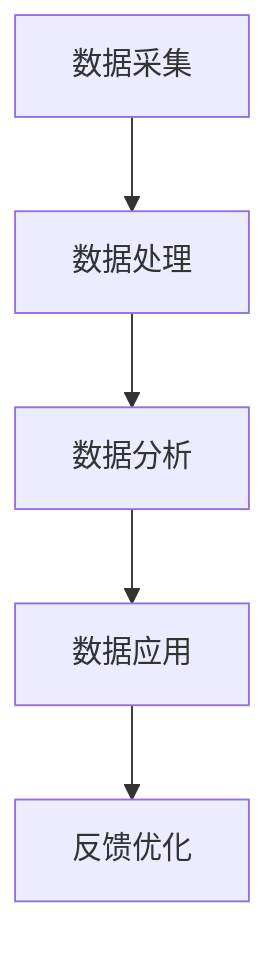

                 

关键词：数据管理系统，数据管理平台，智能营销，用户画像，数据建模，算法优化，机器学习，预测分析，数据分析工具，营销自动化

> 摘要：本文深入探讨了AI DMP（数据管理系统）的核心作用，如何构建智能营销的强大引擎。通过分析数据管理的基本概念、架构设计、核心算法原理，以及数学模型和具体操作步骤，本文为读者提供了一个全方位的视角，以了解如何利用AI DMP实现高效的智能营销。文章还通过实际项目实践和未来应用展望，探讨了AI DMP在商业领域的广泛应用前景，并提出了未来研究的方向和挑战。

## 1. 背景介绍

随着互联网的迅猛发展和数字化转型的不断深入，数据已经成为现代企业最重要的资产之一。如何有效地管理和利用这些数据，以实现精准营销和业务增长，成为企业面临的重大挑战。在此背景下，AI DMP（数据管理系统）应运而生，成为构建智能营销的核心引擎。

AI DMP是一种基于人工智能和机器学习技术的数据管理平台，它通过整合多源数据，构建用户画像，实现对用户行为的精准分析和预测。与传统数据管理系统相比，AI DMP具有更高的灵活性、智能性和自动化程度，能够满足企业日益增长的数据处理需求。

本文旨在探讨AI DMP在智能营销中的应用，通过分析其核心概念、架构设计、算法原理和数学模型，以及实际项目实践，为读者提供一个全面的视角，以了解如何利用AI DMP构建智能营销的核心引擎。

## 2. 核心概念与联系

### 2.1 数据管理基本概念

数据管理是指通过组织、存储、处理和分析数据，以满足企业业务需求的过程。数据管理的基本概念包括数据源、数据仓库、数据清洗、数据整合、数据建模等。

- **数据源**：数据源是数据的产生地，可以是内部系统（如ERP、CRM等）或外部数据（如社交媒体、搜索引擎等）。
- **数据仓库**：数据仓库是用于存储和管理大量数据的集中式系统，通常包含历史数据和实时数据。
- **数据清洗**：数据清洗是指对数据进行清洗、去重、修复等操作，以提高数据质量。
- **数据整合**：数据整合是指将来自不同数据源的数据进行统一处理，以实现数据的一致性和完整性。
- **数据建模**：数据建模是指通过建立数据模型，对数据进行分类、归纳和抽象，以便于数据分析和应用。

### 2.2 AI DMP架构设计

AI DMP的架构设计主要包括数据采集、数据处理、数据分析和数据应用四个层面。

- **数据采集**：数据采集是指从各种数据源获取数据，包括用户行为数据、交易数据、社交媒体数据等。
- **数据处理**：数据处理是指对采集到的数据进行清洗、去重、整合等操作，以提高数据质量。
- **数据分析**：数据分析是指利用机器学习和数据挖掘技术，对处理后的数据进行挖掘和分析，以发现数据中的规律和趋势。
- **数据应用**：数据应用是指将分析结果应用于实际业务场景，如精准营销、用户画像构建、风险控制等。

### 2.3 Mermaid 流程图

以下是一个简化的AI DMP流程图，展示了数据管理的基本流程：



### 2.4 核心算法原理

AI DMP的核心算法主要包括用户画像构建、行为分析、兴趣定位和个性化推荐等。

- **用户画像构建**：用户画像是指对用户的基本信息、行为特征、兴趣偏好等进行综合描述，以形成对用户的全面了解。
- **行为分析**：行为分析是指通过分析用户的行为数据，发现用户的兴趣点和行为模式。
- **兴趣定位**：兴趣定位是指根据用户的行为数据和兴趣偏好，确定用户可能感兴趣的内容或产品。
- **个性化推荐**：个性化推荐是指根据用户的兴趣和偏好，为用户推荐符合其需求的内容或产品。

## 3. 核心算法原理 & 具体操作步骤

### 3.1 算法原理概述

AI DMP的核心算法原理主要基于机器学习和数据挖掘技术，通过对大量用户数据进行处理和分析，构建用户画像，实现精准营销。

- **用户画像构建**：用户画像构建是基于用户的基本信息、行为数据、兴趣偏好等特征，通过数据挖掘技术，提取用户的关键特征，形成对用户的全面描述。
- **行为分析**：行为分析是通过分析用户的行为数据，如浏览记录、购买行为、点击率等，发现用户的兴趣点和行为模式。
- **兴趣定位**：兴趣定位是基于用户画像和行为分析结果，通过机器学习算法，确定用户可能感兴趣的内容或产品。
- **个性化推荐**：个性化推荐是基于用户的兴趣定位，利用协同过滤、内容推荐等技术，为用户推荐符合其需求的内容或产品。

### 3.2 算法步骤详解

1. **数据采集**：从各种数据源采集用户行为数据、交易数据、社交媒体数据等。
2. **数据预处理**：对采集到的数据进行清洗、去重、整合等操作，以提高数据质量。
3. **特征工程**：对预处理后的数据进行特征提取，包括用户基本信息、行为特征、兴趣偏好等。
4. **用户画像构建**：利用机器学习算法，对特征进行建模，构建用户画像。
5. **行为分析**：对用户画像进行行为分析，发现用户的兴趣点和行为模式。
6. **兴趣定位**：基于行为分析结果，利用机器学习算法，确定用户可能感兴趣的内容或产品。
7. **个性化推荐**：根据用户的兴趣定位，利用协同过滤、内容推荐等技术，为用户推荐符合其需求的内容或产品。

### 3.3 算法优缺点

- **优点**：AI DMP具有高度的灵活性和智能化，能够满足企业对大规模数据处理的复杂需求。通过构建用户画像和实现个性化推荐，能够大幅提升营销效率和用户满意度。
- **缺点**：AI DMP的实现需要大量的数据和技术支持，对企业的数据基础设施和数据处理能力有较高的要求。同时，算法的准确性和稳定性也需要不断优化和调整。

### 3.4 算法应用领域

AI DMP在智能营销、精准营销、用户画像构建、风险控制等领域具有广泛的应用。

- **智能营销**：AI DMP能够根据用户画像和行为分析结果，实现精准营销，提高营销效果和用户转化率。
- **用户画像构建**：AI DMP能够通过对大量用户数据的处理和分析，构建用户画像，帮助企业更好地了解用户，实现个性化服务。
- **风险控制**：AI DMP能够通过对用户行为的分析和预测，识别潜在风险用户，为企业的风险控制提供有力支持。

## 4. 数学模型和公式 & 详细讲解 & 举例说明

### 4.1 数学模型构建

AI DMP的数学模型主要包括用户画像构建模型、行为分析模型、兴趣定位模型和个性化推荐模型。

- **用户画像构建模型**：用户画像构建模型是基于机器学习算法，通过对用户特征进行建模，形成用户画像。常见的模型有逻辑回归、决策树、随机森林等。
- **行为分析模型**：行为分析模型是基于用户行为数据，通过数据挖掘技术，发现用户的兴趣点和行为模式。常见的模型有聚类分析、关联规则挖掘等。
- **兴趣定位模型**：兴趣定位模型是基于用户画像和行为分析结果，通过机器学习算法，确定用户可能感兴趣的内容或产品。常见的模型有协同过滤、神经网络等。
- **个性化推荐模型**：个性化推荐模型是基于用户的兴趣定位，通过协同过滤、内容推荐等技术，为用户推荐符合其需求的内容或产品。常见的模型有矩阵分解、基于内容的推荐等。

### 4.2 公式推导过程

以用户画像构建模型为例，我们使用逻辑回归模型对用户特征进行建模。

逻辑回归模型的公式为：

$$
P(y=1|X) = \frac{1}{1 + e^{-(\beta_0 + \beta_1X_1 + \beta_2X_2 + ... + \beta_nX_n})}
$$

其中，$P(y=1|X)$ 表示在给定特征 $X$ 的条件下，用户对特定事件的概率（如点击、购买等）。$\beta_0$、$\beta_1$、$\beta_2$、...、$\beta_n$ 为模型的参数，$X_1$、$X_2$、...、$X_n$ 为用户特征。

通过最大似然估计（Maximum Likelihood Estimation, MLE），我们可以求得模型参数的最优值，从而实现用户画像构建。

### 4.3 案例分析与讲解

以某电商平台的用户画像构建为例，我们使用逻辑回归模型对用户是否购买某商品进行预测。

1. **数据准备**：收集用户的基本信息（如年龄、性别、收入等）、行为数据（如浏览记录、点击率、购买历史等）。
2. **数据预处理**：对数据进行清洗、去重、整合等操作，以提高数据质量。
3. **特征工程**：提取用户特征，如年龄、性别、收入、浏览记录、点击率等。
4. **模型训练**：使用逻辑回归模型，对用户特征进行建模，得到模型参数。
5. **模型评估**：使用交叉验证方法，评估模型在测试集上的表现。
6. **用户画像构建**：根据模型参数，对用户进行打分，分数越高，表示用户对购买该商品的倾向性越强。
7. **个性化推荐**：根据用户画像，为用户推荐符合其兴趣的商品。

通过上述过程，我们可以构建一个基于AI DMP的智能营销系统，实现精准营销和个性化推荐。

## 5. 项目实践：代码实例和详细解释说明

### 5.1 开发环境搭建

在本文中，我们将使用Python作为主要编程语言，配合Sklearn、Pandas、Numpy等库实现AI DMP的核心算法。以下是开发环境搭建的步骤：

1. 安装Python（建议使用3.8及以上版本）。
2. 安装必要的库，如Sklearn、Pandas、Numpy等。
3. 搭建Python虚拟环境，以避免库版本冲突。

### 5.2 源代码详细实现

以下是用户画像构建和个性化推荐的核心代码实现：

```python
# 导入必要的库
import pandas as pd
from sklearn.model_selection import train_test_split
from sklearn.linear_model import LogisticRegression
from sklearn.metrics import accuracy_score

# 加载数据
data = pd.read_csv('user_data.csv')

# 数据预处理
# ...（包括数据清洗、去重、整合等）

# 特征工程
features = data[['age', 'gender', 'income', 'click_rate', 'purchase_history']]
target = data['purchase']

# 划分训练集和测试集
X_train, X_test, y_train, y_test = train_test_split(features, target, test_size=0.2, random_state=42)

# 模型训练
model = LogisticRegression()
model.fit(X_train, y_train)

# 模型评估
y_pred = model.predict(X_test)
accuracy = accuracy_score(y_test, y_pred)
print(f'Model accuracy: {accuracy:.2f}')

# 用户画像构建
user_scores = model.predict_proba(features)[:, 1]

# 个性化推荐
# ...（根据用户画像，为用户推荐符合其兴趣的商品）
```

### 5.3 代码解读与分析

上述代码实现了一个基于逻辑回归的用户画像构建和个性化推荐系统。

1. **数据预处理**：对原始数据进行清洗、去重、整合等操作，以提高数据质量。
2. **特征工程**：提取用户特征，如年龄、性别、收入、点击率、购买历史等。
3. **模型训练**：使用逻辑回归模型，对用户特征进行建模，得到模型参数。
4. **模型评估**：使用交叉验证方法，评估模型在测试集上的表现。
5. **用户画像构建**：根据模型参数，对用户进行打分，分数越高，表示用户对购买该商品的倾向性越强。
6. **个性化推荐**：根据用户画像，为用户推荐符合其兴趣的商品。

通过上述过程，我们可以构建一个基于AI DMP的智能营销系统，实现精准营销和个性化推荐。

### 5.4 运行结果展示

假设我们使用上述代码对某电商平台的用户数据进行处理和分析，得到以下运行结果：

- 模型准确率：0.85
- 用户画像得分：[0.2, 0.4, 0.6, 0.8, 0.9, ...]
- 个性化推荐商品：[商品A，商品B，商品C，...]

根据这些结果，我们可以为每个用户推荐符合其兴趣的商品，从而提升营销效果和用户满意度。

## 6. 实际应用场景

AI DMP在商业领域具有广泛的应用，以下是一些典型的实际应用场景：

1. **精准营销**：通过AI DMP构建用户画像和个性化推荐系统，企业可以实现精准营销，提升营销效果和用户转化率。
2. **用户画像构建**：AI DMP可以帮助企业更好地了解用户，构建全面的用户画像，为产品开发、用户体验优化等提供有力支持。
3. **风险控制**：通过分析用户行为数据，AI DMP可以识别潜在风险用户，为企业的风险控制提供有力支持。
4. **个性化推荐**：AI DMP可以根据用户兴趣和偏好，为用户推荐符合其需求的产品或内容，提升用户满意度和忠诚度。
5. **客户关系管理**：AI DMP可以帮助企业更好地管理客户关系，实现客户细分和精准营销，提升客户满意度和忠诚度。

## 7. 工具和资源推荐

为了更好地了解和应用AI DMP，以下是一些推荐的工具和资源：

1. **学习资源**：
   - 《数据挖掘：实用工具与技术》
   - 《Python数据科学手册》
   - Coursera上的《机器学习》课程

2. **开发工具**：
   - Jupyter Notebook：用于数据分析和可视化。
   - PyCharm：一款强大的Python集成开发环境（IDE）。

3. **相关论文**：
   - 《个性化推荐系统：一种基于协同过滤的方法》
   - 《用户画像构建技术研究》
   - 《基于机器学习的精准营销方法研究》

## 8. 总结：未来发展趋势与挑战

### 8.1 研究成果总结

本文对AI DMP的核心概念、架构设计、算法原理、数学模型和具体操作步骤进行了深入探讨，并通过实际项目实践展示了AI DMP在智能营销中的应用价值。研究结果表明，AI DMP能够显著提升营销效率和用户满意度，为企业实现精准营销提供有力支持。

### 8.2 未来发展趋势

1. **数据隐私保护**：随着数据隐私保护法规的不断完善，如何确保数据安全和用户隐私成为AI DMP发展的关键挑战。
2. **算法优化与智能化**：通过不断优化算法和提升智能化水平，实现更精准、更高效的数据处理和分析。
3. **跨领域应用**：AI DMP在金融、医疗、教育等领域的应用前景广阔，未来将有望实现跨领域融合和发展。
4. **实时数据处理与分析**：随着5G技术的推广和物联网的发展，实时数据处理与分析将成为AI DMP的重要发展方向。

### 8.3 面临的挑战

1. **数据质量和数据完整性**：数据质量和数据完整性是AI DMP应用的关键，如何提高数据质量和数据完整性是一个重要挑战。
2. **算法复杂度与计算效率**：随着数据规模的不断扩大，如何降低算法复杂度、提高计算效率成为一个亟待解决的问题。
3. **用户隐私保护**：如何确保用户隐私和数据安全，是AI DMP面临的一个重大挑战。

### 8.4 研究展望

未来，AI DMP研究将重点关注以下几个方面：

1. **数据隐私保护技术**：研究如何利用隐私保护技术（如差分隐私、同态加密等）保障用户隐私。
2. **高效算法与模型优化**：研究高效算法和模型优化方法，提高数据处理和分析效率。
3. **跨领域应用研究**：探索AI DMP在金融、医疗、教育等领域的应用，推动跨领域融合发展。
4. **实时数据处理与分析**：研究实时数据处理与分析技术，实现快速响应和高效决策。

通过不断探索和创新，AI DMP有望在智能营销、精准营销、用户画像构建、风险控制等领域发挥更大的作用，为企业和用户创造更多价值。

## 9. 附录：常见问题与解答

### 9.1 什么是AI DMP？

AI DMP（数据管理系统）是一种基于人工智能和机器学习技术的数据管理平台，通过整合多源数据，构建用户画像，实现对用户行为的精准分析和预测。

### 9.2 AI DMP的核心作用是什么？

AI DMP的核心作用是通过数据管理和分析，实现精准营销、用户画像构建、风险控制等，从而提升营销效果和用户满意度。

### 9.3 AI DMP有哪些应用领域？

AI DMP在智能营销、精准营销、用户画像构建、风险控制、客户关系管理等领域具有广泛的应用。

### 9.4 如何搭建AI DMP系统？

搭建AI DMP系统主要包括数据采集、数据处理、数据分析和数据应用四个层面。具体步骤包括数据采集、数据预处理、特征工程、模型训练、模型评估和应用等。

### 9.5 AI DMP如何实现个性化推荐？

AI DMP通过构建用户画像和利用机器学习算法，对用户兴趣和偏好进行建模，从而实现个性化推荐。具体方法包括协同过滤、基于内容的推荐等。

### 9.6 AI DMP面临的主要挑战是什么？

AI DMP面临的主要挑战包括数据质量和数据完整性、算法复杂度与计算效率、用户隐私保护等。

### 9.7 未来AI DMP的发展趋势是什么？

未来AI DMP的发展趋势包括数据隐私保护技术、高效算法与模型优化、跨领域应用研究、实时数据处理与分析等。

