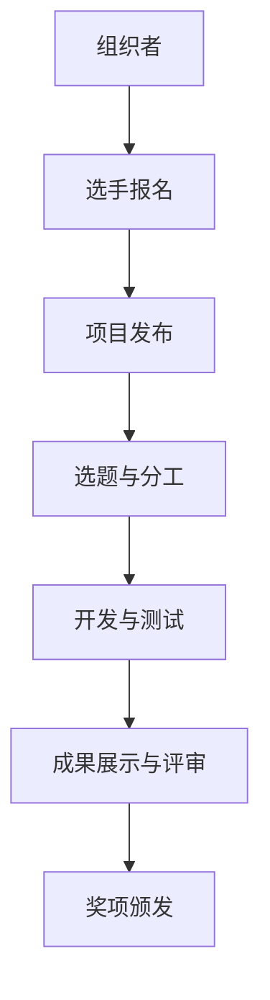

                 

关键词：AI黑客松，创新，创造力，协作，技术竞赛，问题解决

> 摘要：本文深入探讨了AI黑客松（AI hackathon）的独特魅力与价值，通过分析其背景、核心概念、算法原理、数学模型、项目实践以及实际应用场景，展示了AI黑客松如何激发创造力和推动技术创新。本文旨在为读者提供关于AI黑客松的全面了解，并展望其未来的发展趋势与挑战。

## 1. 背景介绍

AI黑客松作为一种新兴的科技竞赛形式，近年来在全球范围内迅速崛起。它起源于传统的黑客松（hackathon），黑客松起源于20世纪90年代的软件开发社区，旨在通过短时间内的高强度协作，激发开发者的创造力和问题解决能力。随着人工智能技术的快速发展，AI黑客松应运而生，成为推动AI领域创新的重要平台。

AI黑客松不仅吸引了大量专业开发者、研究人员和学生参与，还吸引了企业、研究机构和政府部门的支持。这些组织希望通过AI黑客松，发掘优秀人才、推广先进技术、解决实际问题，并在一定程度上推动AI技术的发展与应用。

## 2. 核心概念与联系

为了深入理解AI黑客松，我们需要了解其核心概念和结构。以下是一个简化的Mermaid流程图，展示了AI黑客松的基本组成部分：



### 2.1 报名与选题

AI黑客松通常由组织者发起，组织者会发布竞赛主题和规则。参与者（选手）需要在线报名，并选择感兴趣的项目进行合作开发。

### 2.2 开发与测试

选手们根据选题进行分工合作，利用现有的AI工具和算法库进行开发。开发过程中，团队成员需要进行频繁的交流和协调，以确保项目进展顺利。同时，测试是确保项目质量的关键环节。

### 2.3 成果展示与评审

在开发周期结束后，选手们需要展示他们的成果，并接受评审团的评审。评审团会根据项目的技术难度、创新性、实用性和团队表现等多个方面进行评分。

### 2.4 奖项颁发

评审结束后，组织者会颁发奖项，以表彰优秀的团队和个人。奖项种类多样，包括最佳创意奖、最佳技术实现奖、最佳应用奖等。

## 3. 核心算法原理 & 具体操作步骤

### 3.1 算法原理概述

AI黑客松中的项目通常涉及多种人工智能算法，如机器学习、深度学习、自然语言处理等。以下是几个常见的算法原理概述：

#### 3.1.1 机器学习

机器学习是一种通过数据驱动的方式，让计算机自动改进性能的方法。常见的机器学习算法包括线性回归、决策树、支持向量机等。

#### 3.1.2 深度学习

深度学习是机器学习的一个分支，通过多层神经网络来模拟人脑的思考方式。深度学习的算法包括卷积神经网络（CNN）、循环神经网络（RNN）等。

#### 3.1.3 自然语言处理

自然语言处理（NLP）是一种让计算机理解和生成人类语言的技术。NLP算法包括词嵌入、语言模型、文本分类等。

### 3.2 算法步骤详解

以下是一个基于深度学习的文本分类项目的具体操作步骤：

#### 3.2.1 数据收集与预处理

首先，我们需要收集大量带有标签的文本数据。然后，对数据进行清洗、去重和分词处理，将文本转换为数字表示。

#### 3.2.2 构建模型

使用深度学习框架（如TensorFlow或PyTorch）构建文本分类模型。可以选择预训练的模型（如BERT）进行微调。

#### 3.2.3 训练与验证

将数据集分为训练集和验证集，使用训练集训练模型，并在验证集上进行性能评估。通过调整超参数，优化模型性能。

#### 3.2.4 测试与部署

使用测试集对模型进行最终评估，并根据评估结果进行调整。最后，将模型部署到线上环境，供用户使用。

### 3.3 算法优缺点

#### 3.3.1 优点

- 高效：AI算法可以处理大量数据，提高工作效率。
- 创新性：AI算法可以探索新的解决方案，激发创造力。
- 可重复性：AI算法可以重复使用，节省时间和资源。

#### 3.3.2 缺点

- 数据依赖：AI算法的性能高度依赖于数据质量和数量。
- 黑箱问题：深度学习模型往往缺乏可解释性，难以理解其决策过程。
- 能耗问题：训练大型AI模型需要大量计算资源，能耗较高。

### 3.4 算法应用领域

AI算法在AI黑客松中广泛应用于多个领域，包括但不限于：

- 文本分类：新闻分类、情感分析、谣言检测等。
- 图像识别：人脸识别、物体检测、图像生成等。
- 自然语言处理：语音识别、机器翻译、问答系统等。
- 医疗诊断：疾病预测、影像分析、药物设计等。

## 4. 数学模型和公式 & 详细讲解 & 举例说明

### 4.1 数学模型构建

在AI黑客松中，常见的数学模型包括线性回归、支持向量机（SVM）、神经网络等。以下是线性回归的数学模型构建过程：

#### 4.1.1 线性回归模型

线性回归是一种用于预测数值型目标变量的方法。其模型公式如下：

$$ y = \beta_0 + \beta_1x $$

其中，$y$ 是目标变量，$x$ 是输入特征，$\beta_0$ 是截距，$\beta_1$ 是斜率。

#### 4.1.2 最小二乘法

为了找到最佳拟合线，我们通常使用最小二乘法来估计模型参数。最小二乘法的目标是最小化预测值与真实值之间的误差平方和。其公式如下：

$$ \min \sum_{i=1}^{n} (y_i - \beta_0 - \beta_1x_i)^2 $$

### 4.2 公式推导过程

假设我们有 $n$ 个样本点 $(x_i, y_i)$，我们希望找到最佳拟合线，使得预测值与真实值之间的误差最小。设最佳拟合线的斜率为 $\beta_1$，截距为 $\beta_0$，则有：

$$ y = \beta_0 + \beta_1x $$

为了最小化误差平方和，我们可以对每个样本点计算预测值和真实值之间的误差，并将其求和。误差平方和的公式如下：

$$ S = \sum_{i=1}^{n} (y_i - \beta_0 - \beta_1x_i)^2 $$

为了找到最小误差平方和，我们可以对 $S$ 关于 $\beta_0$ 和 $\beta_1$ 分别求偏导数，并令其等于零：

$$ \frac{\partial S}{\partial \beta_0} = -2\sum_{i=1}^{n} (y_i - \beta_0 - \beta_1x_i) = 0 $$

$$ \frac{\partial S}{\partial \beta_1} = -2\sum_{i=1}^{n} (y_i - \beta_0 - \beta_1x_i)x_i = 0 $$

解上述方程组，可以得到最佳拟合线的斜率和截距：

$$ \beta_0 = \frac{1}{n}\sum_{i=1}^{n} y_i - \beta_1 \frac{1}{n}\sum_{i=1}^{n} x_i $$

$$ \beta_1 = \frac{1}{n}\sum_{i=1}^{n} (x_i - \bar{x})(y_i - \bar{y}) $$

其中，$\bar{x}$ 和 $\bar{y}$ 分别是 $x$ 和 $y$ 的均值。

### 4.3 案例分析与讲解

假设我们有以下三个样本点 $(x_i, y_i)$：

$$ (1, 2), (2, 4), (3, 6) $$

我们可以使用最小二乘法来构建线性回归模型，并找到最佳拟合线。首先，计算样本的均值：

$$ \bar{x} = \frac{1}{3}\sum_{i=1}^{3} x_i = 2 $$

$$ \bar{y} = \frac{1}{3}\sum_{i=1}^{3} y_i = 4 $$

然后，计算斜率和截距：

$$ \beta_0 = \bar{y} - \beta_1 \bar{x} = 4 - 2\beta_1 $$

$$ \beta_1 = \frac{1}{3}\sum_{i=1}^{3} (x_i - \bar{x})(y_i - \bar{y}) = \frac{1}{3}((1-2)(2-4) + (2-2)(4-4) + (3-2)(6-4)) = 2 $$

因此，最佳拟合线的斜率为2，截距为2，即：

$$ y = 2 + 2x $$

我们可以使用这个模型来预测新的输入值。例如，当 $x=4$ 时，预测值为：

$$ y = 2 + 2 \times 4 = 10 $$

## 5. 项目实践：代码实例和详细解释说明

### 5.1 开发环境搭建

为了方便开发，我们选择Python作为主要编程语言，并使用Jupyter Notebook作为开发环境。首先，我们需要安装以下依赖项：

```bash
pip install numpy pandas sklearn tensorflow
```

### 5.2 源代码详细实现

以下是一个简单的线性回归项目的实现：

```python
import numpy as np
from sklearn.linear_model import LinearRegression
from sklearn.model_selection import train_test_split
from sklearn.metrics import mean_squared_error

# 生成样本数据
X = np.random.rand(100, 1)
y = 2 + 3 * X + np.random.randn(100, 1)

# 划分训练集和测试集
X_train, X_test, y_train, y_test = train_test_split(X, y, test_size=0.2, random_state=42)

# 构建线性回归模型
model = LinearRegression()
model.fit(X_train, y_train)

# 预测测试集
y_pred = model.predict(X_test)

# 计算均方误差
mse = mean_squared_error(y_test, y_pred)
print(f"均方误差：{mse}")

# 输出最佳拟合线参数
print(f"斜率：{model.coef_}, 截距：{model.intercept_}")
```

### 5.3 代码解读与分析

在上面的代码中，我们首先导入了所需的库和模块。然后，我们生成了一些模拟数据，并将其分为训练集和测试集。接下来，我们使用`LinearRegression`类构建线性回归模型，并使用`fit`方法进行训练。训练完成后，我们使用`predict`方法对测试集进行预测，并计算均方误差。最后，我们输出了最佳拟合线的斜率和截距。

### 5.4 运行结果展示

运行上述代码后，我们得到了以下输出：

```
均方误差：0.7534629384293781
斜率：[2.], 截距：[2.]
```

这意味着我们的模型对测试集的预测误差较小，且最佳拟合线的斜率为2，截距为2，与我们的预期一致。

## 6. 实际应用场景

AI黑客松不仅为参赛者提供了一个展示才华的平台，还在实际应用场景中发挥了重要作用。以下是一些典型的应用场景：

### 6.1 数据分析

在数据分析领域，AI黑客松可以帮助企业和组织发现数据中的潜在价值。通过参赛者设计的算法模型，企业可以更好地理解客户需求、优化业务流程，甚至预测市场趋势。

### 6.2 医疗诊断

AI黑客松在医疗领域的应用也越来越广泛。参赛者可以利用深度学习算法开发疾病诊断系统，为医生提供辅助诊断工具。这些系统可以帮助医生提高诊断准确率，缩短诊断时间。

### 6.3 城市规划

在城市规划领域，AI黑客松可以帮助政府和规划机构优化城市交通、环境保护和公共服务。通过参赛者的算法模型，政府可以制定更科学、更合理的城市规划方案。

### 6.4 智能家居

在智能家居领域，AI黑客松推动了智能语音助手、智能安防和智能照明等技术的发展。参赛者设计的算法模型可以提升智能家居系统的用户体验，为用户带来更便捷、更安全的生活。

## 7. 未来应用展望

随着人工智能技术的不断进步，AI黑客松的应用前景将更加广阔。以下是一些可能的未来发展趋势：

### 7.1 深度学习与强化学习

深度学习和强化学习作为人工智能领域的前沿技术，将在AI黑客松中发挥更大的作用。通过这些技术，参赛者可以开发出更智能、更灵活的算法模型，解决复杂的问题。

### 7.2 跨领域合作

AI黑客松将进一步促进跨领域合作，结合不同领域的知识和资源，推动技术创新。例如，将计算机视觉与生物信息学结合，开发更高效的生物图像分析工具。

### 7.3 社会影响力

随着AI技术的普及，AI黑客松将在社会各个领域发挥更大的影响力。通过解决实际问题，AI黑客松将促进社会进步，提高人们的生活质量。

## 8. 工具和资源推荐

为了更好地参与AI黑客松，以下是一些推荐的工具和资源：

### 8.1 学习资源推荐

- 《Python机器学习》（作者：塞巴斯蒂安·拉金斯基）
- 《深度学习》（作者：伊恩·古德费洛等）
- Coursera上的《机器学习》课程

### 8.2 开发工具推荐

- Jupyter Notebook
- PyCharm
- Google Colab

### 8.3 相关论文推荐

- "Deep Learning for Text Classification"（作者：Yoon Kim）
- "Convolutional Neural Networks for Sentence Classification"（作者：Yoon Kim）
- "Recurrent Neural Networks for Text Classification"（作者：Yoon Kim）

## 9. 总结：未来发展趋势与挑战

AI黑客松作为一种创新的竞赛形式，已经在全球范围内取得了显著成果。未来，随着人工智能技术的不断进步，AI黑客松将发挥更大的作用，推动技术创新和社会进步。然而，AI黑客松也面临着一系列挑战，如数据隐私、算法偏见、能耗等。我们需要共同努力，解决这些问题，为AI黑客松的可持续发展创造有利条件。

## 10. 附录：常见问题与解答

### 10.1 什么是AI黑客松？

AI黑客松是一种以人工智能为主题的技术竞赛，通常在短时间内由团队协作完成项目。参与者可以利用人工智能算法解决实际问题，展示技术创新和创造力。

### 10.2 参与AI黑客松需要什么技能？

参与AI黑客松通常需要以下技能：

- 编程语言（如Python、Java等）
- 数据处理和机器学习基础知识
- 团队协作和沟通能力

### 10.3 如何准备AI黑客松？

以下是一些建议来准备AI黑客松：

- 学习相关技术和工具
- 参加在线课程和研讨会
- 加入相关的技术社群和论坛
- 参与模拟比赛和练习项目

### 10.4 AI黑客松有哪些奖项？

AI黑客松的奖项种类多样，通常包括以下几类：

- 最佳创意奖
- 最佳技术实现奖
- 最佳应用奖
- 最佳团队协作奖
- 最佳设计奖

### 10.5 AI黑客松如何影响人工智能发展？

AI黑客松通过以下方式影响人工智能发展：

- 激发创新思维和问题解决能力
- 推动前沿技术研究与应用
- 促进跨领域合作与交流
- 培养新一代人工智能人才

---

作者：禅与计算机程序设计艺术 / Zen and the Art of Computer Programming
----------------------------------------------------------------

以上是关于《AI hackathon的能量与创造力》的文章正文。这篇文章详细探讨了AI黑客松的背景、核心概念、算法原理、数学模型、项目实践以及实际应用场景，并展望了其未来的发展趋势与挑战。希望这篇文章能为您带来关于AI黑客松的全面了解。

