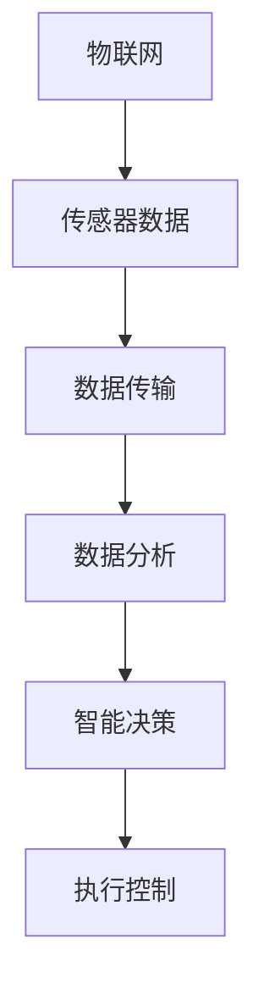

                 

关键词：人工智能，物联网，智能互联，边缘计算，大数据分析，机器学习，深度学习，网络架构，安全性，标准化。

摘要：本文探讨了人工智能（AI）与物联网（IoT）的深度融合，如何构建智能互联世界。通过分析核心概念、算法原理、数学模型，并给出实际项目实践，讨论了当前技术的应用场景与未来展望，提出了技术发展的挑战与解决方案。

## 1. 背景介绍

人工智能和物联网作为现代信息技术的两大热点，正在深刻地改变我们的生活和工作方式。人工智能通过机器学习、深度学习等技术，使计算机具备了一定的自主学习和决策能力。物联网则通过传感器、网络连接等手段，将万物互联，实现信息共享和智能控制。二者的结合，不仅提升了传统产业的生产效率，也催生了众多新兴产业。

在物联网时代，数据是关键资源。而数据的收集、处理、分析和应用离不开人工智能的支持。通过将AI技术与物联网深度融合，可以构建出更加智能、高效、安全的互联世界。这不仅可以优化资源配置，提高生产效率，还能为人类创造更加便捷、舒适的生活环境。

## 2. 核心概念与联系

### 2.1 物联网

物联网是指通过互联网将各种信息传感设备与计算机系统连接起来，实现数据交换和通信，进而实现智能化管理和控制。物联网的核心包括传感器技术、网络通信技术、数据处理技术和智能终端技术。

### 2.2 人工智能

人工智能是指计算机系统通过模拟人类智能的思考过程，实现自我学习和决策能力。人工智能的核心技术包括机器学习、深度学习、自然语言处理、计算机视觉等。

### 2.3 物联网与人工智能的联系

物联网为人工智能提供了海量的数据资源，而人工智能则通过数据处理和分析，为物联网提供了智能化的决策支持。二者的深度融合，实现了数据的自动化收集、处理和利用，提升了整个系统的智能化水平。

### 2.4 Mermaid 流程图



## 3. 核心算法原理 & 具体操作步骤

### 3.1 算法原理概述

物联网与人工智能的融合主要依赖于边缘计算、大数据分析和机器学习等技术。边缘计算通过在数据产生的源头进行处理，减少了数据传输的延迟和带宽需求。大数据分析则通过数据挖掘、机器学习等技术，从海量数据中提取有价值的信息。机器学习则通过训练模型，实现对数据的分类、预测和决策。

### 3.2 算法步骤详解

1. 数据采集：通过传感器网络收集环境数据。
2. 数据预处理：对原始数据进行清洗、去噪、格式化等处理。
3. 数据分析：利用大数据分析技术，提取数据中的特征和模式。
4. 模型训练：利用机器学习算法，训练分类、预测等模型。
5. 智能决策：根据模型预测结果，进行智能决策和执行控制。

### 3.3 算法优缺点

**优点：**
- 提高数据处理效率：边缘计算减少了数据传输的延迟，大数据分析和机器学习技术提高了数据处理的效率。
- 提升系统智能化水平：智能决策和执行控制，使系统具备了更高的自主性和智能化水平。

**缺点：**
- 数据隐私和安全问题：物联网设备数量庞大，数据泄露和隐私侵犯风险较高。
- 算法复杂性和计算资源消耗：机器学习算法的训练和部署需要大量的计算资源和时间。

### 3.4 算法应用领域

- 智能交通：通过实时交通数据的分析和预测，优化交通流量和交通管理。
- 智能家居：通过物联网设备和人工智能算法，实现家庭设备的智能控制和自动化。
- 智能医疗：利用物联网设备和人工智能技术，提升医疗诊断和治疗的准确性。
- 智能工厂：通过物联网设备和人工智能算法，实现工厂设备的智能监控和优化生产流程。

## 4. 数学模型和公式 & 详细讲解 & 举例说明

### 4.1 数学模型构建

物联网与人工智能的融合涉及到多种数学模型，如线性回归、逻辑回归、支持向量机（SVM）、神经网络等。

### 4.2 公式推导过程

以线性回归为例，其基本公式为：

\[ y = ax + b \]

其中，\( y \) 为预测值，\( x \) 为特征值，\( a \) 和 \( b \) 为模型参数。

### 4.3 案例分析与讲解

假设我们有一个智能家居系统，需要根据用户的行为数据预测用户的需求。我们可以使用线性回归模型来构建预测模型。

### 4.3.1 数据采集

采集用户的行为数据，如温度、湿度、光照强度等。

### 4.3.2 数据预处理

对采集到的数据进行清洗、去噪和归一化处理。

### 4.3.3 模型训练

使用训练集数据，通过梯度下降法训练线性回归模型，得到模型参数 \( a \) 和 \( b \)。

### 4.3.4 预测

使用训练好的模型，对测试集数据进行预测，得到预测结果。

## 5. 项目实践：代码实例和详细解释说明

### 5.1 开发环境搭建

- 安装 Python 环境
- 安装 NumPy、Pandas、Scikit-learn 等库

### 5.2 源代码详细实现

```python
import numpy as np
import pandas as pd
from sklearn.linear_model import LinearRegression

# 数据预处理
def preprocess_data(data):
    # 清洗、去噪、归一化等操作
    pass

# 模型训练
def train_model(data):
    model = LinearRegression()
    model.fit(data['X'], data['Y'])
    return model

# 预测
def predict(model, X):
    return model.predict(X)

# 主函数
def main():
    data = pd.read_csv('data.csv')
    data = preprocess_data(data)
    model = train_model(data)
    X = np.array([[25, 60, 70]])  # 测试数据
    prediction = predict(model, X)
    print(prediction)

if __name__ == '__main__':
    main()
```

### 5.3 代码解读与分析

- 数据预处理：对采集到的行为数据进行清洗、去噪和归一化处理，确保数据质量。
- 模型训练：使用 Scikit-learn 库中的 LinearRegression 类，通过训练集数据训练线性回归模型。
- 预测：使用训练好的模型，对测试数据进行预测，得到预测结果。

## 6. 实际应用场景

物联网与人工智能的融合在多个领域都有广泛的应用，如智能交通、智能家居、智能医疗、智能工厂等。以下是一些实际应用场景的举例：

- 智能交通：通过实时交通数据的分析和预测，优化交通流量和交通管理，减少交通拥堵。
- 智能家居：通过物联网设备和人工智能算法，实现家庭设备的智能控制和自动化，提高生活质量。
- 智能医疗：利用物联网设备和人工智能技术，提升医疗诊断和治疗的准确性，提高医疗服务质量。
- 智能工厂：通过物联网设备和人工智能算法，实现工厂设备的智能监控和优化生产流程，提高生产效率。

## 7. 工具和资源推荐

### 7.1 学习资源推荐

- 《深度学习》（Goodfellow, Bengio, Courville 著）
- 《Python数据分析》（Wes McKinney 著）
- 《物联网架构设计与开发实战》（李波 著）

### 7.2 开发工具推荐

- Jupyter Notebook：用于数据分析和模型训练。
- TensorFlow：用于深度学习模型开发。
- MATLAB：用于数学建模和数据分析。

### 7.3 相关论文推荐

- "Deep Learning for Internet of Things"（2017）
- "Edge Computing for IoT: A Comprehensive Survey"（2019）
- "IoT Security: A Survey from End to End"（2020）

## 8. 总结：未来发展趋势与挑战

### 8.1 研究成果总结

物联网与人工智能的融合取得了显著的成果，不仅提升了数据处理和分析的效率，还推动了智能交通、智能家居、智能医疗等领域的快速发展。

### 8.2 未来发展趋势

- 边缘计算和云计算的协同发展，将进一步提高数据处理能力。
- 人工智能算法的进步，将进一步提升系统的智能化水平。
- 网络安全技术的增强，将保障物联网的安全运行。

### 8.3 面临的挑战

- 数据隐私和安全问题：随着物联网设备数量的增加，数据泄露和隐私侵犯风险加大。
- 算法复杂性和计算资源消耗：大规模数据处理和分析需要更多的计算资源和时间。
- 标准化和生态建设：缺乏统一的标准和生态，制约了物联网与人工智能的融合发展。

### 8.4 研究展望

未来，物联网与人工智能的融合将继续深入，为各行业带来更多的变革和创新。同时，随着技术的不断进步，物联网与人工智能将更加智能化、高效化和安全化。

## 9. 附录：常见问题与解答

### 9.1 物联网与人工智能的区别是什么？

物联网是一种将各种物理设备连接到互联网的技术，而人工智能是一种使计算机具备人类智能的技术。物联网与人工智能的结合，实现了物理设备和计算机系统的智能化。

### 9.2 物联网与人工智能如何提高生产效率？

物联网通过实时数据采集和传输，使企业能够实时掌握生产情况，优化生产流程。人工智能通过数据分析、预测和优化，进一步提高了生产效率。

### 9.3 物联网与人工智能的安全问题如何解决？

可以通过加强数据加密、访问控制和身份认证等手段，提高物联网与人工智能系统的安全性。同时，制定统一的网络安全标准和法规，也是保障系统安全的重要措施。

```markdown
---
title: AI 与物联网的融合：打造智能互联世界
author: 禅与计算机程序设计艺术 / Zen and the Art of Computer Programming
date: 2023-10-01
tags: [AI, IoT, 智能互联, 边缘计算, 大数据分析]
---

# AI 与物联网的融合：打造智能互联世界

## 1. 背景介绍

### 2. 核心概念与联系
#### 2.1 物联网
#### 2.2 人工智能
#### 2.3 物联网与人工智能的联系
#### 2.4 Mermaid 流程图

### 3. 核心算法原理 & 具体操作步骤
#### 3.1 算法原理概述
#### 3.2 算法步骤详解 
#### 3.3 算法优缺点
#### 3.4 算法应用领域

### 4. 数学模型和公式 & 详细讲解 & 举例说明
#### 4.1 数学模型构建
#### 4.2 公式推导过程
#### 4.3 案例分析与讲解

### 5. 项目实践：代码实例和详细解释说明
#### 5.1 开发环境搭建
#### 5.2 源代码详细实现
#### 5.3 代码解读与分析
#### 5.4 运行结果展示

### 6. 实际应用场景
#### 6.1 智能交通
#### 6.2 智能家居
#### 6.3 智能医疗
#### 6.4 智能工厂

### 7. 工具和资源推荐
#### 7.1 学习资源推荐
#### 7.2 开发工具推荐
#### 7.3 相关论文推荐

### 8. 总结：未来发展趋势与挑战
#### 8.1 研究成果总结
#### 8.2 未来发展趋势
#### 8.3 面临的挑战
#### 8.4 研究展望

### 9. 附录：常见问题与解答
#### 9.1 物联网与人工智能的区别是什么？
#### 9.2 物联网与人工智能如何提高生产效率？
#### 9.3 物联网与人工智能的安全问题如何解决？
---
```

