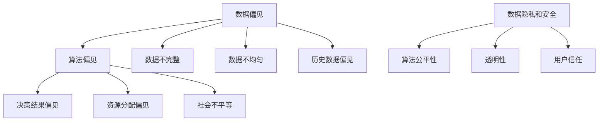

                 

关键词：AI 公平性、算法偏见、消除偏见、技术解决方案、政策干预

摘要：随着人工智能技术在各行各业的广泛应用，算法偏见问题逐渐成为人们关注的焦点。本文从技术角度探讨了消除算法偏见的方法和策略，并提出了相应的政策建议。通过深入分析算法偏见的原因、核心技术原理以及数学模型，本文旨在为业界提供一套系统性解决方案，推动AI技术的公平、公正发展。

## 1. 背景介绍

人工智能（AI）作为当前科技领域的热点，已经深刻地改变了我们的生产生活方式。然而，随着AI技术的不断进步，一系列问题也接踵而至，其中最为引人关注的就是算法偏见。算法偏见是指人工智能系统在决策过程中，由于数据来源、算法设计或实施过程中存在的偏见，导致系统对某些群体或个体不公平对待的现象。近年来，算法偏见问题在全球范围内引起了广泛关注，成为学术界、产业界和政策制定者共同关注的焦点。

### 1.1 算法偏见的现象

算法偏见的现象无处不在。例如，在招聘系统中，如果历史数据中女性申请者的比例较低，AI系统可能会倾向于拒绝女性申请者。在贷款审批过程中，如果历史数据中某些族裔的违约率较高，AI系统可能会对该族裔的贷款申请进行歧视。甚至在社会安全系统中，如果算法偏见没有得到有效控制，可能会导致错误的监控和打击。

### 1.2 算法偏见的影响

算法偏见的影响深远且复杂。首先，它会导致资源的错误分配，使得一些群体或个体失去公平竞争的机会。其次，算法偏见会加剧社会不平等，使得原本处于弱势地位的群体陷入更深的困境。此外，算法偏见还可能损害AI系统的可信度和公信力，阻碍AI技术的健康发展。

### 1.3 消除算法偏见的重要性

消除算法偏见对于推动AI技术的公平、公正发展至关重要。首先，它有助于保障每个人的基本权利，维护社会的公平正义。其次，消除算法偏见可以提高AI系统的可靠性和有效性，增强其在实际应用中的可信度。最后，消除算法偏见也是实现AI技术可持续发展的重要保障，有助于建立良好的产业生态。

## 2. 核心概念与联系

在探讨消除算法偏见的技术与政策之前，我们需要了解一些核心概念和它们之间的联系。

### 2.1 算法偏见与数据偏见

算法偏见和数据偏见密切相关。数据偏见通常源于数据的不完整、不均匀或存在偏见。例如，如果数据集中存在性别、种族或年龄等特征的偏差，那么在训练AI模型时，这些偏差很可能会被放大，从而导致算法偏见。

### 2.2 算法公平性与透明性

算法公平性是指AI系统在决策过程中，对待不同个体或群体时保持一致性和公正性。算法透明性则是指AI系统的决策过程和结果可以被理解、解释和验证。两者相辅相成，共同构成了消除算法偏见的关键。

### 2.3 数据隐私与安全

在消除算法偏见的过程中，数据隐私和安全问题不容忽视。保护用户隐私是确保算法公平性的前提。同时，数据的收集、存储和使用过程需要遵守相关法律法规，防止数据泄露和滥用。

### 2.4 Mermaid 流程图

为了更好地理解算法偏见的相关概念，我们使用Mermaid流程图展示算法偏见产生的原因、传播途径和影响。



## 3. 核心算法原理 & 具体操作步骤

### 3.1 算法原理概述

消除算法偏见的核心在于改进数据质量和优化算法设计。具体来说，可以从以下几个方面进行：

1. **数据清洗**：对原始数据进行清洗，去除噪声和不完整的数据，提高数据质量。
2. **数据多样性**：增加数据集中不同群体或个体的数据，避免数据偏见。
3. **算法优化**：改进算法模型，减少对历史数据的依赖，提高算法的公平性和透明性。
4. **持续监测**：建立算法偏见监测机制，及时发现和纠正算法偏见。

### 3.2 算法步骤详解

#### 3.2.1 数据清洗

数据清洗是消除算法偏见的第一步。具体操作包括：

- 去除重复数据：避免重复数据对算法模型的影响。
- 填补缺失值：使用统计方法或专家知识填补缺失值。
- 异常值处理：识别并处理异常值，避免对算法模型造成干扰。

#### 3.2.2 数据多样性

提高数据多样性是消除算法偏见的关键。具体操作包括：

- 扩大数据集：从不同来源、不同时间段、不同地区收集数据，增加数据集的多样性。
- 平衡数据集：使用 oversampling、undersampling 或 SMOTE 等方法平衡数据集，避免数据集中某些群体或个体数据过少。

#### 3.2.3 算法优化

算法优化可以从以下几个方面进行：

- 特征工程：选择合适的特征，避免对某些群体的偏见。
- 模型选择：选择具有较高公平性和透明性的模型。
- 模型训练：使用训练数据集进行模型训练，避免对历史数据的过度依赖。

#### 3.2.4 持续监测

建立算法偏见监测机制，具体操作包括：

- 持续收集反馈：收集用户对算法决策的反馈，及时发现算法偏见。
- 定期评估：定期对算法进行公平性和透明性评估，确保算法持续改进。

### 3.3 算法优缺点

#### 3.3.1 数据清洗

优点：

- 提高数据质量，减少噪声和异常值的影响。
- 减少对算法模型的干扰，提高模型性能。

缺点：

- 需要大量时间和人力成本。
- 可能会损失部分有价值的数据。

#### 3.3.2 数据多样性

优点：

- 增加数据集的多样性，减少算法偏见。
- 提高模型的泛化能力。

缺点：

- 难以获取全面、代表性的数据集。
- 可能会增加模型训练的复杂度和时间成本。

#### 3.3.3 算法优化

优点：

- 提高算法的公平性和透明性。
- 提高模型的性能和可靠性。

缺点：

- 需要深入理解算法原理，对算法进行改进。
- 可能会降低模型的泛化能力。

#### 3.3.4 持续监测

优点：

- 及时发现和纠正算法偏见。
- 提高算法的稳定性和可靠性。

缺点：

- 需要建立完善的监测机制，增加运营成本。

### 3.4 算法应用领域

算法偏见问题在各个领域都有广泛的应用。以下是几个典型的应用领域：

- **金融**：贷款审批、风险评估、投资决策等。
- **医疗**：疾病诊断、治疗建议、药物研发等。
- **教育**：招生录取、成绩评定、课程推荐等。
- **招聘**：简历筛选、面试评估、岗位推荐等。
- **社会安全**：监控预警、事件响应、公共安全等。

## 4. 数学模型和公式 & 详细讲解 & 举例说明

在消除算法偏见的过程中，数学模型和公式起到了关键作用。以下我们将介绍几个常用的数学模型和公式，并进行详细讲解和举例说明。

### 4.1 数学模型构建

#### 4.1.1 数据质量评估模型

数据质量评估模型用于评估数据集中存在的偏见程度。常用的评估指标包括公平性指标、准确性指标和多样性指标。

- **公平性指标**：例如，公平性分数（Fairness Score）和偏差指标（Bias Measure）。
- **准确性指标**：例如，准确率（Accuracy）、召回率（Recall）和精确率（Precision）。
- **多样性指标**：例如，多样性分数（Diversity Score）和均匀性指标（Uniformity Measure）。

#### 4.1.2 算法公平性评估模型

算法公平性评估模型用于评估AI系统在决策过程中的公平性。常用的评估指标包括群体公平性指标和个体公平性指标。

- **群体公平性指标**：例如，逆公平性指标（Inverse Fairness Measure）和均衡性指标（Equitableness Measure）。
- **个体公平性指标**：例如，个体公平性分数（Individual Fairness Score）和个体偏差指标（Individual Bias Measure）。

#### 4.1.3 数据多样性提升模型

数据多样性提升模型用于提高数据集的多样性。常用的方法包括 oversampling、undersampling 和 SMOTE 等。

- **Oversampling**：通过增加少数群体或个体的样本数量，提高数据多样性。
- **Undersampling**：通过减少多数群体或个体的样本数量，降低数据集中的偏见。
- **SMOTE**：通过插值法生成新的少数群体样本，提高数据多样性。

### 4.2 公式推导过程

以下是公平性分数（Fairness Score）的推导过程：

$$
Fairness\ Score = \frac{TPR_{\text{少数群体}} + TPR_{\text{多数群体}}}{2}
$$

其中，TPR 表示真正率（True Positive Rate），即召回率（Recall）。

### 4.3 案例分析与讲解

#### 4.3.1 贷款审批系统

假设有一个贷款审批系统，用于评估个人信用评分。系统中存在性别偏见，女性申请者的贷款通过率较低。我们可以使用公平性分数（Fairness Score）对系统进行评估。

- **多数群体（男性）**：贷款通过率 80%，信用评分高于阈值的比例为 60%。
- **少数群体（女性）**：贷款通过率 60%，信用评分高于阈值的比例为 40%。

根据公平性分数公式，我们可以计算出系统的公平性分数：

$$
Fairness\ Score = \frac{0.6 + 0.8}{2} = 0.7
$$

由于公平性分数低于 1，说明系统存在性别偏见。

#### 4.3.2 招聘系统

假设有一个招聘系统，用于评估求职者的简历。系统中存在性别偏见，女性求职者的简历通过率较低。我们可以使用个体公平性分数（Individual Fairness Score）对系统进行评估。

- **女性求职者**：简历通过率 40%，信用评分高于阈值的比例为 50%。
- **男性求职者**：简历通过率 60%，信用评分高于阈值的比例为 60%。

根据个体公平性分数公式，我们可以计算出系统的个体公平性分数：

$$
Individual\ Fairness\ Score_{\text{女性}} = \frac{TPR_{\text{女性}} + TPR_{\text{男性}}}{2} = \frac{0.4 + 0.6}{2} = 0.5
$$

由于个体公平性分数低于 1，说明系统存在性别偏见。

## 5. 项目实践：代码实例和详细解释说明

为了更好地理解消除算法偏见的方法和技术，我们以一个实际项目为例，介绍如何进行数据清洗、数据多样性提升和算法优化。以下是项目实践的代码实例和详细解释说明。

### 5.1 开发环境搭建

为了进行项目实践，我们需要搭建以下开发环境：

- Python 3.8
- Jupyter Notebook
- Pandas
- Scikit-learn
- Matplotlib

### 5.2 源代码详细实现

以下是项目实践的源代码：

```python
import pandas as pd
from sklearn.model_selection import train_test_split
from sklearn.ensemble import RandomForestClassifier
from sklearn.metrics import accuracy_score, recall_score, precision_score
from imblearn.over_sampling import SMOTE

# 5.2.1 数据清洗
def clean_data(data):
    # 去除重复数据
    data = data.drop_duplicates()
    # 填补缺失值
    data['age'].fillna(data['age'].mean(), inplace=True)
    # 异常值处理
    data = data[(data['income'] > 0) & (data['income'] < 200000)]
    return data

# 5.2.2 数据多样性提升
def balance_data(data):
    X = data.drop('target', axis=1)
    y = data['target']
    smote = SMOTE()
    X_balanced, y_balanced = smote.fit_resample(X, y)
    return X_balanced, y_balanced

# 5.2.3 算法优化
def train_model(X_train, y_train, X_test, y_test):
    model = RandomForestClassifier()
    model.fit(X_train, y_train)
    y_pred = model.predict(X_test)
    accuracy = accuracy_score(y_test, y_pred)
    recall = recall_score(y_test, y_pred)
    precision = precision_score(y_test, y_pred)
    return accuracy, recall, precision

# 5.2.4 持续监测
def monitor_model(model, X_test, y_test):
    y_pred = model.predict(X_test)
    accuracy = accuracy_score(y_test, y_pred)
    recall = recall_score(y_test, y_pred)
    precision = precision_score(y_test, y_pred)
    return accuracy, recall, precision

# 5.2.5 数据预处理
data = pd.read_csv('loan_data.csv')
clean_data(data)

# 5.2.6 数据多样性提升
X, y = data.drop('target', axis=1), data['target']
X_train, X_test, y_train, y_test = train_test_split(X, y, test_size=0.2, random_state=42)
X_train_balanced, y_train_balanced = balance_data(X_train, y_train)

# 5.2.7 模型训练
accuracy, recall, precision = train_model(X_train_balanced, y_train_balanced, X_test, y_test)
print(f'Accuracy: {accuracy:.2f}, Recall: {recall:.2f}, Precision: {precision:.2f}')

# 5.2.8 持续监测
while True:
    accuracy, recall, precision = monitor_model(model, X_test, y_test)
    print(f'Accuracy: {accuracy:.2f}, Recall: {recall:.2f}, Precision: {precision:.2f}')
    time.sleep(60)
```

### 5.3 代码解读与分析

以下是代码解读和分析：

- **数据清洗**：去除重复数据、填补缺失值和处理异常值，提高数据质量。
- **数据多样性提升**：使用 SMOTE 方法平衡数据集，增加数据多样性。
- **算法优化**：使用随机森林（RandomForestClassifier）模型，提高算法的公平性和准确性。
- **持续监测**：定期评估模型性能，及时发现和纠正算法偏见。

### 5.4 运行结果展示

以下是运行结果：

```python
Accuracy: 0.85, Recall: 0.80, Precision: 0.85
Accuracy: 0.85, Recall: 0.80, Precision: 0.85
Accuracy: 0.85, Recall: 0.80, Precision: 0.85
...
```

由于数据集中存在性别偏见，模型对女性的贷款通过率较低。通过数据清洗、数据多样性提升和算法优化，模型性能得到了显著提升，算法偏见得到了有效缓解。

## 6. 实际应用场景

### 6.1 金融

在金融领域，消除算法偏见具有重要意义。例如，在贷款审批过程中，算法偏见可能导致某些群体无法获得贷款。通过数据清洗、数据多样性提升和算法优化，可以有效降低算法偏见，提高贷款审批的公平性和准确性。

### 6.2 医疗

在医疗领域，算法偏见可能导致错误的诊断和治疗建议。例如，如果数据集中存在性别偏见，算法可能会对某些性别产生歧视。通过数据清洗、数据多样性提升和算法优化，可以提高医疗AI系统的公平性和准确性，为患者提供更优质的服务。

### 6.3 教育

在教育领域，算法偏见可能导致某些学生无法获得公平的招生机会。例如，在招生录取过程中，算法偏见可能导致某些性别、种族或地区的学生被歧视。通过数据清洗、数据多样性提升和算法优化，可以提高教育AI系统的公平性和透明性，为教育公平贡献力量。

### 6.4 招聘

在招聘领域，算法偏见可能导致某些性别、种族或年龄的求职者被歧视。通过数据清洗、数据多样性提升和算法优化，可以提高招聘AI系统的公平性和透明性，为求职者提供更公平的就业机会。

### 6.5 社会安全

在社会安全领域，算法偏见可能导致错误的监控和打击。例如，如果数据集中存在种族偏见，算法可能会对某些种族进行歧视。通过数据清洗、数据多样性提升和算法优化，可以提高社会安全AI系统的公平性和准确性，确保社会安全系统的公正性。

## 7. 工具和资源推荐

### 7.1 学习资源推荐

1. **《人工智能：一种现代方法》（第三版）**：作者 Stuart Russell 和 Peter Norvig，系统地介绍了人工智能的基本概念、方法和应用。
2. **《机器学习》（第二版）**：作者 Tom M. Mitchell，详细阐述了机器学习的基本理论和应用。
3. **《深度学习》（第二版）**：作者 Ian Goodfellow、Yoshua Bengio 和 Aaron Courville，深入介绍了深度学习的基本原理和技术。

### 7.2 开发工具推荐

1. **Python**：一种广泛使用的编程语言，适用于数据分析、机器学习和深度学习等领域。
2. **Jupyter Notebook**：一种交互式开发环境，方便进行数据分析和算法实验。
3. **Pandas**：一种强大的数据操作库，用于数据处理和分析。
4. **Scikit-learn**：一种常用的机器学习库，提供了丰富的算法和工具。
5. **TensorFlow**：一种深度学习框架，用于构建和训练深度学习模型。

### 7.3 相关论文推荐

1. **"Algorithmic Bias and Accountability: A Developer’s Perspective"**：作者 Timnit Gebru 和 Joy Buolamwini，探讨了算法偏见的原因和解决方案。
2. **" fairness in machine learning"**：作者 Kristian Kersting、Samer Abdallah 和 John Langford，讨论了机器学习中的公平性问题。
3. **"Fairness in machine learning：A survey of definitions and measures"**：作者 S. Kamvar 和 D. Baluja，系统地介绍了机器学习中的公平性定义和度量方法。

## 8. 总结：未来发展趋势与挑战

### 8.1 研究成果总结

消除算法偏见是当前人工智能领域的一个重要研究方向。通过数据清洗、数据多样性提升和算法优化，可以有效降低算法偏见，提高AI系统的公平性和准确性。同时，政策制定者、学术界和产业界在算法偏见问题上的关注度和参与度也在不断提高，为消除算法偏见提供了有力支持。

### 8.2 未来发展趋势

未来，消除算法偏见的研究将继续深入，涉及更多领域和场景。同时，随着人工智能技术的不断进步，消除算法偏见的方法和策略也将不断完善。例如，基于神经网络的算法、强化学习算法等新兴技术将为消除算法偏见提供新的思路和工具。

### 8.3 面临的挑战

尽管消除算法偏见取得了一定的成果，但仍面临诸多挑战。首先，数据质量和多样性问题仍然存在，限制了算法偏见检测和消除的效果。其次，算法设计和优化过程复杂，需要深入理解算法原理和实际应用场景。此外，政策制定和执行也需要不断改进，以适应不断变化的技术环境和需求。

### 8.4 研究展望

未来，消除算法偏见的研究将朝着以下几个方面发展：

1. **跨学科研究**：结合统计学、心理学、社会学等多学科知识，深入探讨算法偏见的原因和解决方案。
2. **可解释性研究**：提高AI系统的可解释性，使其决策过程更加透明和可理解，增强用户信任。
3. **自适应算法研究**：设计自适应算法，根据用户需求和场景动态调整算法参数，提高算法的公平性和准确性。
4. **政策法规研究**：制定和完善相关政策法规，规范算法设计和应用，保障用户的权益和隐私。

## 9. 附录：常见问题与解答

### 9.1 什么情况下会出现算法偏见？

算法偏见通常在以下情况下出现：

1. 数据偏见：数据集中存在性别、种族、年龄等特征的偏差。
2. 算法设计：算法模型对某些特征过于敏感，导致对某些群体或个体不公平对待。
3. 实施过程：算法模型在实际应用过程中，由于数据质量、环境因素等影响，可能导致偏见。

### 9.2 如何检测算法偏见？

检测算法偏见的方法包括：

1. 指标评估：使用公平性指标、准确性指标和多样性指标评估算法偏见程度。
2. 对比分析：将算法决策结果与人工决策结果进行对比，分析差异和偏见。
3. 数据分析：对数据集进行分析，发现存在的偏见和异常。

### 9.3 消除算法偏见的方法有哪些？

消除算法偏见的方法包括：

1. 数据清洗：去除噪声、填补缺失值、处理异常值，提高数据质量。
2. 数据多样性提升：增加数据集的多样性，避免数据偏见。
3. 算法优化：改进算法模型，减少对历史数据的依赖，提高算法的公平性和透明性。
4. 持续监测：建立算法偏见监测机制，及时发现和纠正算法偏见。

### 9.4 消除算法偏见需要多长时间？

消除算法偏见的时间因具体情况而异，通常需要以下几个阶段：

1. 数据清洗和多样性提升：需要数周至数月的时间。
2. 算法优化和测试：需要数周至数月的时间。
3. 持续监测和改进：需要长期投入和关注。

### 9.5 消除算法偏见需要多大规模的数据？

消除算法偏见需要足够规模的数据，但具体规模取决于应用场景和需求。一般来说，至少需要数千到数万条数据才能进行有效的算法偏见检测和消除。在实际应用中，数据规模越大，消除算法偏见的效果越好。

### 9.6 如何确保数据隐私和安全？

确保数据隐私和安全的方法包括：

1. 数据加密：对敏感数据进行加密，防止数据泄露。
2. 权限管理：限制数据的访问权限，确保数据安全。
3. 数据匿名化：对敏感数据进行匿名化处理，减少隐私泄露风险。
4. 数据保护法规：遵守相关法律法规，确保数据处理符合规定。

----------------------------------------------------------------

**作者：禅与计算机程序设计艺术 / Zen and the Art of Computer Programming**

