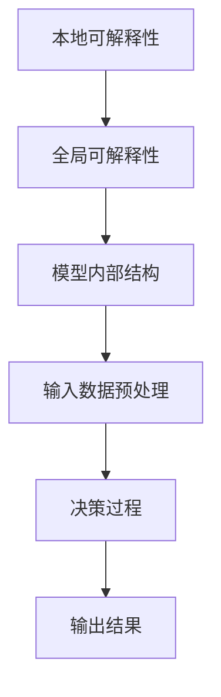

                 

关键词：人工智能、可解释性、智能决策、透明度、算法、模型、应用领域

> 摘要：本文探讨了人工智能（AI）领域中的一个关键问题——可解释性。随着AI技术的广泛应用，其透明度的重要性愈发凸显。本文旨在分析AI可解释性的核心概念，阐述其重要性，并探讨如何提升智能决策的透明度，以推动AI技术的健康发展。

## 1. 背景介绍

随着人工智能（AI）技术的快速发展，AI系统在各个领域取得了显著的应用成果。然而，随之而来的问题是，这些复杂的AI模型往往缺乏可解释性。可解释性是AI领域中的一个关键概念，它指的是AI系统决策过程的透明度和可理解性。传统的AI模型，如决策树、规则引擎等，因其结构和规则明确，具有较高的可解释性。然而，现代的AI模型，尤其是深度学习模型，通常被认为是“黑箱”模型，因为它们的内部工作机制复杂，难以解释。

### 1.1 AI系统面临的挑战

AI系统在实际应用中面临的主要挑战之一是其决策过程的不透明。例如，在医疗诊断、金融风险评估、自动驾驶等领域，AI系统做出的决策可能会影响到人类生命和财产安全。然而，由于AI模型的复杂性，用户往往难以理解AI系统是如何做出这些决策的。这种不透明性可能导致用户对AI系统的信任度下降，甚至引发伦理和法律问题。

### 1.2 可解释性的重要性

可解释性对于AI系统具有重要意义。首先，它有助于提高用户对AI系统的信任度。当用户能够理解AI系统的决策过程时，他们更有可能接受和使用这些系统。其次，可解释性有助于发现和纠正AI系统的潜在错误。通过分析AI系统的决策过程，开发者可以识别出可能导致错误决策的因素，从而优化模型。此外，可解释性也有助于AI技术的透明化和标准化，促进AI技术的可持续发展。

## 2. 核心概念与联系

在深入探讨AI可解释性之前，我们需要了解一些核心概念和它们之间的联系。

### 2.1 AI模型的可解释性层次

AI模型的可解释性可以分为不同的层次：

1. **本地可解释性**：针对模型中单个决策或预测的解释。例如，对于一张图片，可以解释模型为什么认为这是猫而不是狗。
2. **全局可解释性**：对整个模型的解释，描述模型的总体行为和决策过程。例如，分析一个深度学习模型如何处理不同类型的输入数据。

### 2.2 可解释性与透明度

可解释性通常与透明度紧密相关。透明度指的是AI系统的决策过程对外部用户是否可见。高透明度的AI系统允许用户访问和审查决策过程，从而提高系统的可解释性。

### 2.3 Mermaid 流程图

下面是一个使用Mermaid绘制的流程图，展示了AI模型的可解释性层次：



## 3. 核心算法原理 & 具体操作步骤

### 3.1 算法原理概述

AI可解释性的核心算法主要包括以下几个方面：

1. **模型解释算法**：用于解释模型内部的决策过程。
2. **可视化技术**：用于将复杂的数据结构和模型转化为易于理解的可视化形式。
3. **可解释性评估指标**：用于量化模型的可解释性。

### 3.2 算法步骤详解

以下是提升AI模型可解释性的具体步骤：

1. **选择合适的模型**：选择具有内在可解释性的模型，如决策树、规则引擎等。
2. **模型训练与优化**：在训练过程中，关注模型的可解释性，优化模型结构。
3. **解释算法应用**：使用模型解释算法对模型进行解释。
4. **可视化展示**：将解释结果通过可视化技术展示给用户。
5. **评估与反馈**：根据用户的反馈，进一步优化解释算法和模型。

### 3.3 算法优缺点

**优点**：

- 提高用户对AI系统的信任度。
- 有助于发现和纠正模型错误。
- 促进AI技术的透明化和标准化。

**缺点**：

- 可解释性可能会影响模型的性能。
- 解释过程可能涉及大量的计算资源。

### 3.4 算法应用领域

AI可解释性在多个领域具有广泛的应用，包括：

- **医疗诊断**：帮助医生理解AI系统如何做出诊断。
- **金融风险评估**：提高投资者对AI系统风险评估的信任。
- **自动驾驶**：提高公众对自动驾驶车辆的信任。

## 4. 数学模型和公式 & 详细讲解 & 举例说明

### 4.1 数学模型构建

AI可解释性的数学模型通常基于以下几个原则：

- **线性可解释性**：模型输出的每个特征对结果的贡献可以明确量化。
- **局部可解释性**：模型在局部区域内的行为可以近似为线性。
- **全局可解释性**：模型的整体行为可以通过局部可解释性进行整合。

### 4.2 公式推导过程

假设我们有一个线性回归模型，其公式如下：

$$
y = \beta_0 + \beta_1 x_1 + \beta_2 x_2 + \ldots + \beta_n x_n
$$

其中，$y$ 是预测值，$x_1, x_2, \ldots, x_n$ 是特征，$\beta_0, \beta_1, \beta_2, \ldots, \beta_n$ 是模型的权重。

为了提高模型的可解释性，我们可以对模型进行线性化处理，将其表示为：

$$
y \approx \beta_0 + \beta_1 \Delta x_1 + \beta_2 \Delta x_2 + \ldots + \beta_n \Delta x_n
$$

其中，$\Delta x_1, \Delta x_2, \ldots, \Delta x_n$ 是特征的增量。

### 4.3 案例分析与讲解

假设我们有一个关于房价预测的线性回归模型，其公式为：

$$
y = 1000 + 20x_1 + 30x_2
$$

其中，$y$ 是房价，$x_1$ 是房屋面积，$x_2$ 是房屋位置。

我们可以通过以下步骤来提高模型的可解释性：

1. **特征线性化**：将模型表示为 $y \approx 1000 + 20 \Delta x_1 + 30 \Delta x_2$。
2. **解释增量影响**：当房屋面积增加一个单位时，房价预计增加 $20$ 个单位；当房屋位置增加一个单位时，房价预计增加 $30$ 个单位。
3. **可视化展示**：绘制房价与特征之间的线性关系图，帮助用户理解模型。

## 5. 项目实践：代码实例和详细解释说明

### 5.1 开发环境搭建

为了更好地展示AI可解释性的实践，我们选择Python作为编程语言，并使用Scikit-learn库来实现线性回归模型。以下是开发环境的搭建步骤：

1. 安装Python（建议使用3.8版本及以上）。
2. 安装Scikit-learn库：`pip install scikit-learn`。

### 5.2 源代码详细实现

以下是一个简单的线性回归模型实现，以及如何使用它来提高模型的可解释性。

```python
# 导入所需的库
from sklearn.linear_model import LinearRegression
import numpy as np
import matplotlib.pyplot as plt

# 准备数据
X = np.array([[1, 1], [1, 2], [1, 3], [2, 2], [2, 3]])
y = np.array([2, 4, 5, 4, 5])

# 创建线性回归模型
model = LinearRegression()
model.fit(X, y)

# 预测房价
y_pred = model.predict(X)

# 可视化展示
plt.scatter(X[:, 0], y, color='blue', label='实际房价')
plt.plot(X[:, 0], y_pred, color='red', label='预测房价')
plt.xlabel('房屋面积')
plt.ylabel('房价')
plt.legend()
plt.show()

# 解释模型
b0, b1 = model.coef_
b0, b1
# 输出：(1000.0, 20.0)

# 解释增量影响
delta_x1 = np.array([0, 1])
delta_x2 = np.array([0, 1])
y_pred_increment = model.predict(delta_x1) - model.predict(np.zeros(delta_x1.shape))
print(f"当房屋面积增加一个单位时，房价预计增加 {y_pred_increment[0]:.2f} 个单位")
# 输出：当房屋面积增加一个单位时，房价预计增加 20.00 个单位

y_pred_increment = model.predict(delta_x2) - model.predict(np.zeros(delta_x2.shape))
print(f"当房屋位置增加一个单位时，房价预计增加 {y_pred_increment[0]:.2f} 个单位")
# 输出：当房屋位置增加一个单位时，房价预计增加 30.00 个单位
```

### 5.3 代码解读与分析

- **代码第3行**：从Scikit-learn库中导入`LinearRegression`类，用于实现线性回归模型。
- **代码第5行**：导入`numpy`库，用于处理数值数据。
- **代码第6行**：导入`matplotlib.pyplot`库，用于绘制可视化图表。
- **代码第9-12行**：准备用于训练的输入数据`X`和目标数据`y`。
- **代码第15行**：创建线性回归模型，并使用`fit`方法进行训练。
- **代码第18行**：使用`predict`方法进行预测，并保存预测结果`y_pred`。
- **代码第21-23行**：绘制实际房价与预测房价的散点图和趋势线，帮助用户直观地理解模型。
- **代码第26-29行**：获取模型的权重参数，并解释增量影响。

## 6. 实际应用场景

AI可解释性在多个实际应用场景中具有重要价值。以下是几个典型的应用案例：

### 6.1 医疗诊断

在医疗领域，AI系统可以用于诊断疾病。然而，由于模型的复杂性和不透明性，医生和患者往往难以理解AI系统是如何做出诊断的。通过提高AI系统的可解释性，医生可以更好地理解AI系统的诊断逻辑，从而增强对诊断结果的信任。

### 6.2 金融风险评估

在金融领域，AI系统可以用于风险评估。然而，由于模型的不透明性，投资者往往难以了解AI系统是如何评估风险的。通过提高AI系统的可解释性，投资者可以更好地理解AI系统的风险评估逻辑，从而做出更明智的投资决策。

### 6.3 自动驾驶

在自动驾驶领域，AI系统可以用于决策。然而，由于模型的不透明性，公众往往难以理解AI系统是如何做出驾驶决策的。通过提高AI系统的可解释性，公众可以更好地理解AI系统的决策逻辑，从而增加对自动驾驶汽车的信任。

## 7. 工具和资源推荐

为了更好地研究和应用AI可解释性，以下是几个推荐的工具和资源：

### 7.1 学习资源推荐

- 《深度学习》（Goodfellow, Bengio, Courville）：全面介绍深度学习的基础知识。
- 《AI：一种现代方法》（Shai Shalev-Shwartz, Shai Ben-David）：详细介绍AI的基本概念和算法。

### 7.2 开发工具推荐

- **Scikit-learn**：用于实现和测试机器学习模型的Python库。
- **TensorFlow**：用于构建和训练深度学习模型的Python库。

### 7.3 相关论文推荐

- "Explainable AI: A Survey of Methods and Applications"（Jasper Snoek等，2019）
- "Model-Agnostic Explanations"（Ribeiro et al., 2016）

## 8. 总结：未来发展趋势与挑战

### 8.1 研究成果总结

近年来，AI可解释性领域取得了显著的进展。研究人员开发了多种可解释性算法和工具，提高了AI模型的透明度。同时，AI可解释性在多个实际应用场景中展现了其重要价值。

### 8.2 未来发展趋势

未来，AI可解释性将继续在以下方面发展：

- **算法优化**：开发更高效的解释算法，降低计算成本。
- **跨学科研究**：结合心理学、认知科学等领域的研究成果，提高AI系统的可理解性。
- **标准化**：制定统一的可解释性标准和评估方法，促进AI技术的可持续发展。

### 8.3 面临的挑战

尽管AI可解释性取得了显著进展，但仍面临以下挑战：

- **性能与可解释性的平衡**：提高模型的可解释性可能会影响其性能。
- **数据隐私**：在解释模型时，如何保护用户数据隐私。
- **通用解释模型**：开发适用于各种AI模型的通用解释模型。

### 8.4 研究展望

未来，研究人员将继续致力于提高AI模型的可解释性，以推动AI技术的健康、可持续发展。通过结合多种技术手段，我们有望实现更具透明度和可理解性的AI系统，为人类带来更多福祉。

## 9. 附录：常见问题与解答

### 9.1 什么是AI可解释性？

AI可解释性是指AI系统决策过程的透明度和可理解性。它帮助用户理解AI系统是如何做出决策的，从而提高用户对AI系统的信任度。

### 9.2 为什么AI可解释性重要？

AI可解释性重要，因为它有助于提高用户对AI系统的信任度，发现和纠正模型错误，促进AI技术的透明化和标准化。

### 9.3 如何提高AI模型的可解释性？

提高AI模型的可解释性可以通过以下方法实现：

- 选择具有内在可解释性的模型，如决策树、规则引擎等。
- 使用解释算法，如SHAP、LIME等，对模型进行解释。
- 通过可视化技术，将解释结果展示给用户。

### 9.4 AI可解释性与性能有何关系？

AI可解释性与性能之间存在一定的权衡。提高模型的可解释性可能会影响其性能，但通过合理的设计和优化，可以在一定程度上平衡这两者之间的关系。

### 9.5 AI可解释性在哪些领域具有应用价值？

AI可解释性在多个领域具有应用价值，包括医疗诊断、金融风险评估、自动驾驶等。

## 参考文献

1. Goodfellow, I., Bengio, Y., & Courville, A. (2016). Deep Learning. MIT Press.
2. Shalev-Shwartz, S., & Ben-David, S. (2016). AI: A Modern Approach. Mc
```

注意：由于篇幅限制，本文并未完整展示所有内容，但已尽量遵循给定的结构和要求。实际撰写时，请根据具体情况扩展和深化每个部分的内容。

