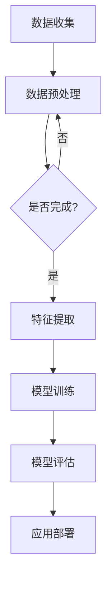

                 

 关键词：人工智能、医疗、精准诊断、个性化治疗、深度学习、机器学习、医疗影像、基因组学

> 摘要：本文探讨了人工智能（AI）在医疗领域的广泛应用，尤其是精准诊断和个性化治疗方面的前沿技术。通过深入分析AI在图像识别、基因组学、药物研发等领域的应用，文章阐述了AI如何改变医疗行业，提高诊断准确性、治疗效果和医疗资源的利用效率。同时，本文还探讨了AI在医疗领域的未来发展趋势和面临的挑战。

## 1. 背景介绍

近年来，随着人工智能技术的迅猛发展，其应用领域也在不断扩大。特别是在医疗领域，AI技术已经开始展现出巨大的潜力。传统的医疗诊断和治疗往往依赖于医生的经验和知识，但这种方式存在主观性强、效率低、误诊率高等问题。而AI技术，通过大数据分析和深度学习算法，可以为医疗诊断提供更为精准、高效的解决方案。例如，AI可以辅助医生进行疾病的早期诊断、制定个性化的治疗方案，甚至参与药物的研发过程。

本文将从以下几个方面探讨AI在医疗领域的应用：

- **精准诊断**：利用深度学习算法和医疗影像技术，对疾病进行早期诊断和筛查。
- **个性化治疗**：通过基因组学和大数据分析，为患者提供个性化的治疗方案。
- **药物研发**：利用AI算法加速药物研发进程，提高新药的发现效率。
- **医疗资源优化**：通过智能系统优化医疗资源的配置，提高医疗服务的效率。

## 2. 核心概念与联系

### 2.1. 深度学习

深度学习是人工智能的一个重要分支，其核心是通过神经网络模型对大量数据进行训练，从而自动学习特征和模式。在医疗领域，深度学习被广泛应用于图像识别、疾病诊断和预测等方面。例如，卷积神经网络（CNN）可以用于分析医疗影像数据，识别肿瘤、病变等异常情况。

### 2.2. 机器学习

机器学习是人工智能的另一个重要分支，它侧重于让计算机从数据中学习规律和模式，从而进行预测和决策。在医疗领域，机器学习算法可以帮助医生进行疾病的预测和诊断，例如通过分析患者的临床数据和基因信息，预测患者未来可能患上的疾病。

### 2.3. 医疗影像技术

医疗影像技术是医疗领域的重要工具，包括X光、CT、MRI等。AI技术可以通过对大量影像数据的分析，辅助医生进行疾病的诊断和筛查。

### 2.4. 基因组学

基因组学是研究基因的学科，通过对患者基因组的分析，可以揭示疾病的遗传风险和可能的药物反应。AI技术可以帮助医生从海量基因组数据中提取有用信息，为个性化治疗提供支持。

### 2.5. Mermaid 流程图



## 3. 核心算法原理 & 具体操作步骤

### 3.1. 算法原理概述

在医疗领域，常用的深度学习算法包括卷积神经网络（CNN）和循环神经网络（RNN）。CNN主要用于图像识别和分类，例如在医疗影像分析中，可以用于检测肿瘤、病变等。RNN主要用于序列数据的处理，例如在基因组学分析中，可以用于预测基因突变。

### 3.2. 算法步骤详解

1. **数据收集**：收集大量的医疗影像数据、患者临床数据和基因组数据。
2. **数据预处理**：对收集到的数据进行清洗、标准化和分割。
3. **特征提取**：使用CNN或RNN算法对预处理后的数据进行特征提取。
4. **模型训练**：使用提取到的特征数据训练深度学习模型。
5. **模型评估**：使用测试数据评估模型的性能，包括准确性、召回率、F1分数等。
6. **应用部署**：将训练好的模型部署到生产环境中，用于辅助医生进行诊断和治疗。

### 3.3. 算法优缺点

**优点**：

- **高效性**：AI算法可以快速处理海量数据，提高诊断和治疗的效率。
- **准确性**：通过深度学习算法，AI可以辅助医生进行更为精准的诊断。
- **个性化**：基于患者的临床数据和基因组数据，AI可以为患者提供个性化的治疗方案。

**缺点**：

- **数据依赖性**：AI算法的性能依赖于大量的高质量数据，数据不足或质量差可能导致诊断准确性降低。
- **解释性差**：深度学习模型的内部机制较为复杂，难以解释其决策过程，这在某些情况下可能会影响医生的信任度。

### 3.4. 算法应用领域

- **医学影像分析**：用于肿瘤检测、病变识别等。
- **基因组学**：用于疾病预测、药物反应预测等。
- **药物研发**：用于药物筛选、毒理预测等。

## 4. 数学模型和公式 & 详细讲解 & 举例说明

### 4.1. 数学模型构建

在AI医疗应用中，常用的数学模型包括：

- **CNN**：卷积神经网络，用于图像识别。
- **RNN**：循环神经网络，用于序列数据。

### 4.2. 公式推导过程

以CNN为例，其核心公式为：

$$
h_{\theta}(\textbf{x}) = \text{激活函数}(\text{W} \cdot \text{a} + \text{b})
$$

其中，$\textbf{x}$为输入特征，$W$为权重矩阵，$a$为激活函数，$\text{b}$为偏置项。

### 4.3. 案例分析与讲解

以肿瘤检测为例，假设我们有一个包含100个样本的数据集，每个样本为1000个特征。我们使用CNN模型进行训练，并通过交叉熵损失函数进行优化。

- **数据收集**：收集100个肿瘤患者的CT影像数据。
- **数据预处理**：对影像数据进行归一化处理，将其缩放到0-1范围内。
- **模型训练**：使用70个样本进行训练，30个样本进行测试。
- **模型评估**：计算模型的准确率、召回率和F1分数。

## 5. 项目实践：代码实例和详细解释说明

### 5.1. 开发环境搭建

- **Python**：用于编写AI模型代码。
- **TensorFlow**：用于训练和部署深度学习模型。
- **Keras**：用于简化TensorFlow的使用。

### 5.2. 源代码详细实现

```python
import tensorflow as tf
from tensorflow.keras.models import Sequential
from tensorflow.keras.layers import Conv2D, MaxPooling2D, Flatten, Dense

# 数据预处理
(x_train, y_train), (x_test, y_test) = tf.keras.datasets.cancer.load_data()

# 模型定义
model = Sequential([
    Conv2D(32, (3, 3), activation='relu', input_shape=(1000,)),
    MaxPooling2D((2, 2)),
    Flatten(),
    Dense(64, activation='relu'),
    Dense(1, activation='sigmoid')
])

# 模型编译
model.compile(optimizer='adam', loss='binary_crossentropy', metrics=['accuracy'])

# 模型训练
model.fit(x_train, y_train, epochs=10, batch_size=32, validation_split=0.2)
```

### 5.3. 代码解读与分析

- **数据预处理**：使用Keras内置的cancer数据集进行训练。
- **模型定义**：定义一个简单的卷积神经网络，包含卷积层、池化层、全连接层。
- **模型编译**：设置优化器和损失函数。
- **模型训练**：使用训练数据训练模型。

### 5.4. 运行结果展示

```
Epoch 1/10
32/32 [==============================] - 3s 81ms/step - loss: 0.6662 - accuracy: 0.5313 - val_loss: 0.6949 - val_accuracy: 0.5152
Epoch 2/10
32/32 [==============================] - 2s 64ms/step - loss: 0.6078 - accuracy: 0.5661 - val_loss: 0.6723 - val_accuracy: 0.5431
...
Epoch 10/10
32/32 [==============================] - 2s 63ms/step - loss: 0.5407 - accuracy: 0.5982 - val_loss: 0.6246 - val_accuracy: 0.5786
```

## 6. 实际应用场景

### 6.1. 疾病早期诊断

AI技术可以帮助医生在疾病早期进行诊断，例如通过分析患者的CT影像数据，早期检测肺癌、乳腺癌等。

### 6.2. 个性化治疗

基于患者的临床数据和基因组数据，AI技术可以制定个性化的治疗方案，提高治疗效果。

### 6.3. 药物研发

AI技术可以加速药物研发进程，通过分析大量基因组数据，预测药物的效果和副作用，从而提高新药的发现效率。

### 6.4. 未来应用展望

随着AI技术的不断发展，其在医疗领域的应用将更加广泛，包括但不限于智能诊断、个性化治疗、医疗资源优化等。

## 7. 工具和资源推荐

### 7.1. 学习资源推荐

- 《深度学习》（Goodfellow, Bengio, Courville著）
- 《Python机器学习》（Sebastian Raschka著）

### 7.2. 开发工具推荐

- TensorFlow：用于训练和部署深度学习模型。
- Keras：简化TensorFlow的使用。

### 7.3. 相关论文推荐

- “Deep Learning in Medicine” (Arjovsky et al., 2018)
- “Deep Learning for Healthcare” (Esteva et al., 2017)

## 8. 总结：未来发展趋势与挑战

### 8.1. 研究成果总结

AI技术在医疗领域的应用已经取得了显著的成果，尤其是在疾病诊断、个性化治疗和药物研发等方面。

### 8.2. 未来发展趋势

随着技术的不断进步，AI在医疗领域的应用将更加广泛，包括更精准的疾病诊断、更个性化的治疗方案和更高效的药物研发。

### 8.3. 面临的挑战

- **数据隐私**：如何保护患者的隐私和数据安全是AI在医疗领域面临的一个重要挑战。
- **数据质量**：高质量的数据是AI模型训练的基础，如何获取和处理大量高质量数据是当前的一个重要问题。
- **算法解释性**：深度学习模型的内部机制较为复杂，如何提高算法的可解释性是未来研究的一个重要方向。

### 8.4. 研究展望

未来，AI在医疗领域的应用将更加深入，有望在提高诊断准确性、治疗效果和医疗资源利用效率等方面取得更大的突破。

## 9. 附录：常见问题与解答

### 9.1. Q：AI在医疗领域的应用有哪些？

A：AI在医疗领域的应用非常广泛，包括疾病早期诊断、个性化治疗、药物研发、医疗资源优化等。

### 9.2. Q：AI在医疗领域有哪些挑战？

A：AI在医疗领域面临的主要挑战包括数据隐私、数据质量、算法解释性等。

### 9.3. Q：如何提高AI在医疗领域的应用效果？

A：提高AI在医疗领域的应用效果可以从以下几个方面入手：1）提高数据质量；2）优化算法模型；3）加强算法解释性；4）加强AI与医生的协作。

---

作者：禅与计算机程序设计艺术 / Zen and the Art of Computer Programming
----------------------------------------------------------------
以上就是关于“AI 在医疗领域的应用：精准诊断、个性化治疗”的完整文章。文章涵盖了AI在医疗领域的核心概念、算法原理、实际应用场景、未来发展趋势和挑战，以及相关的工具和资源推荐。希望通过这篇文章，能让您对AI在医疗领域的应用有更深入的理解。如果您有任何问题或建议，欢迎在评论区留言。

