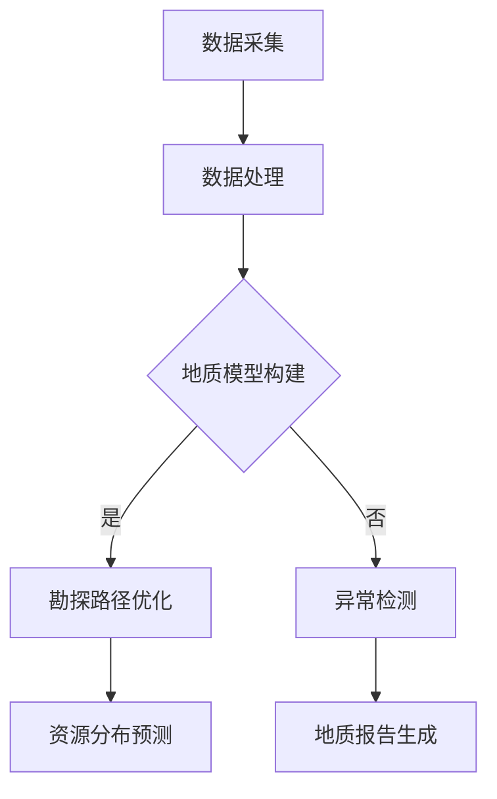

                 

关键词：人工智能、基础设施、地质勘探、智能化矿产资源、勘测平台、算法、数学模型、应用场景、工具推荐、未来展望

## 摘要

随着人工智能技术的快速发展，其在地质勘探领域中的应用逐渐引起了广泛关注。本文旨在探讨如何利用AI基础设施构建一个智能化矿产资源勘测平台，实现地质资源的精准勘探与高效利用。文章首先介绍了当前地质勘探的现状与挑战，随后详细阐述了AI在地质勘探中的核心作用，包括数据采集、处理和分析等环节。接着，本文提出了一个基于AI的智能化矿产资源勘测平台的整体架构，并深入分析了其核心算法原理、数学模型以及具体实现步骤。文章还通过项目实践展示了平台的实际应用效果，并展望了其未来发展趋势与面临的挑战。

## 1. 背景介绍

### 地质勘探的现状与挑战

地质勘探是矿产资源开发的重要前提，它涉及到地球物理学、地球化学、地质学等多个学科领域。传统的地质勘探方法主要依赖于人力和传统机械设备，其效率低下、成本高昂且勘探精度有限。近年来，随着数字化技术和人工智能的兴起，地质勘探领域迎来了新的变革。

### 人工智能在地质勘探中的应用

人工智能在地质勘探中的应用主要体现在以下几个方面：

1. **数据采集与处理**：AI技术可以自动采集和处理大量的地质数据，包括遥感图像、地质报告、地球物理探测数据等。通过对这些数据的分析和挖掘，可以提取出有价值的信息。

2. **地质模型构建**：基于机器学习和深度学习算法，AI技术可以自动构建地质模型，帮助地质学家更准确地预测矿产资源的分布。

3. **勘探路径优化**：通过优化算法，AI技术可以辅助地质学家制定最优的勘探路径，提高勘探效率。

4. **异常检测**：AI技术可以对地质数据进行分析，识别出潜在的地质异常，为地质学家提供有益的参考。

### 人工智能基础设施的重要性

构建一个高效、可靠的AI基础设施是实现智能化地质勘探的关键。AI基础设施不仅包括硬件设备（如服务器、存储设备等），还包括软件平台（如深度学习框架、大数据处理平台等）。一个完善的AI基础设施可以提供强大的计算能力、高效的数据处理能力和灵活的算法支持，为地质勘探提供强有力的技术支撑。

## 2. 核心概念与联系

### 核心概念

1. **地质数据**：包括遥感图像、地质报告、地球物理探测数据等。

2. **人工智能算法**：如机器学习、深度学习、优化算法等。

3. **地质模型**：基于地质数据进行构建的模型，用于预测矿产资源的分布。

4. **勘探路径优化**：通过优化算法确定最佳的勘探路径。

5. **异常检测**：识别地质数据中的异常，帮助地质学家发现潜在的矿产资源。

### Mermaid 流程图



## 3. 核心算法原理 & 具体操作步骤

### 3.1 算法原理概述

智能化矿产资源勘测平台的核心算法主要包括以下几种：

1. **机器学习算法**：用于数据采集和地质模型构建，如决策树、支持向量机、神经网络等。

2. **深度学习算法**：用于图像处理和异常检测，如卷积神经网络（CNN）、循环神经网络（RNN）等。

3. **优化算法**：用于勘探路径优化，如遗传算法、蚁群算法等。

### 3.2 算法步骤详解

1. **数据采集**：
   - 采集遥感图像、地质报告、地球物理探测数据等。
   - 数据预处理：包括图像增强、去噪、归一化等操作。

2. **数据处理**：
   - 使用机器学习算法对数据进行分类、聚类等处理。
   - 构建地质模型：将处理后的数据输入到深度学习模型中进行训练。

3. **地质模型构建**：
   - 基于训练得到的地质模型，预测矿产资源的分布。
   - 对模型进行评估和优化，提高预测精度。

4. **勘探路径优化**：
   - 构建目标函数，如资源分布密度、勘探成本等。
   - 使用优化算法求解最优勘探路径。

5. **异常检测**：
   - 对地质数据进行异常检测，识别潜在的矿产资源。
   - 将检测结果可视化，供地质学家参考。

### 3.3 算法优缺点

**机器学习算法**：
- 优点：可以处理大规模的地质数据，模型较为简单，易于理解。
- 缺点：对数据质量要求较高，模型泛化能力有限。

**深度学习算法**：
- 优点：可以自动提取特征，处理复杂数据，泛化能力强。
- 缺点：模型复杂，训练时间长，对计算资源要求较高。

**优化算法**：
- 优点：可以求解复杂的最优化问题，提高勘探效率。
- 缺点：对问题假设较为严格，求解精度受限于算法参数。

### 3.4 算法应用领域

- 地质勘探：用于预测矿产资源分布、优化勘探路径。
- 环境监测：用于识别地质灾害、评估环境影响。
- 农业种植：用于预测作物生长状况、优化灌溉策略。

## 4. 数学模型和公式 & 详细讲解 & 举例说明

### 4.1 数学模型构建

在智能化矿产资源勘测平台中，常用的数学模型包括：

1. **地质数据模型**：
   - 描述地质数据的分布特征，如正态分布、泊松分布等。

2. **地质模型**：
   - 基于地质数据的预测模型，如线性回归、逻辑回归等。

3. **优化模型**：
   - 用于求解勘探路径优化问题，如线性规划、非线性规划等。

### 4.2 公式推导过程

以线性回归模型为例，其公式推导如下：

假设我们有一组地质数据 $(x_1, y_1), (x_2, y_2), \ldots, (x_n, y_n)$，其中 $x_i$ 为自变量，$y_i$ 为因变量。我们希望找到一条直线 $y = ax + b$ 来拟合这些数据。

1. **最小二乘法**：

   目标是最小化残差平方和：
   $$ S = \sum_{i=1}^{n} (y_i - (ax_i + b))^2 $$

   对 $a$ 和 $b$ 求导并令其等于零，得到：
   $$ \frac{\partial S}{\partial a} = 0 $$
   $$ \frac{\partial S}{\partial b} = 0 $$

   经过计算，可以得到线性回归模型的参数：
   $$ a = \frac{\sum_{i=1}^{n} (x_i - \bar{x})(y_i - \bar{y})}{\sum_{i=1}^{n} (x_i - \bar{x})^2} $$
   $$ b = \bar{y} - a\bar{x} $$

2. **回归方程**：

   将参数代入回归方程，得到：
   $$ y = \frac{\sum_{i=1}^{n} (x_i - \bar{x})(y_i - \bar{y})}{\sum_{i=1}^{n} (x_i - \bar{x})^2} x + \bar{y} - \frac{\sum_{i=1}^{n} (x_i - \bar{x})(y_i - \bar{y})}{\sum_{i=1}^{n} (x_i - \bar{x})^2} \bar{x} $$

### 4.3 案例分析与讲解

假设我们有一组地质数据如下：

| $x_i$ | $y_i$ |
|-------|-------|
| 1     | 2     |
| 2     | 4     |
| 3     | 6     |
| 4     | 8     |

使用线性回归模型进行拟合。

1. **计算均值**：

   $$ \bar{x} = \frac{1 + 2 + 3 + 4}{4} = 2.5 $$
   $$ \bar{y} = \frac{2 + 4 + 6 + 8}{4} = 5 $$

2. **计算协方差**：

   $$ \sum_{i=1}^{4} (x_i - \bar{x})(y_i - \bar{y}) = (1 - 2.5)(2 - 5) + (2 - 2.5)(4 - 5) + (3 - 2.5)(6 - 5) + (4 - 2.5)(8 - 5) = -3.5 $$

3. **计算方差**：

   $$ \sum_{i=1}^{4} (x_i - \bar{x})^2 = (1 - 2.5)^2 + (2 - 2.5)^2 + (3 - 2.5)^2 + (4 - 2.5)^2 = 5 $$

4. **计算回归参数**：

   $$ a = \frac{-3.5}{5} = -0.7 $$
   $$ b = 5 - (-0.7) \cdot 2.5 = 6.75 $$

5. **回归方程**：

   $$ y = -0.7x + 6.75 $$

通过以上步骤，我们得到了线性回归模型的回归方程。该方程可以用来预测新的地质数据对应的矿产资源分布。

## 5. 项目实践：代码实例和详细解释说明

### 5.1 开发环境搭建

为了搭建一个智能化矿产资源勘测平台，我们需要以下开发环境：

1. **Python**：作为主要编程语言。
2. **TensorFlow**：用于深度学习模型的构建和训练。
3. **NumPy**：用于数学计算。
4. **Matplotlib**：用于数据可视化。

### 5.2 源代码详细实现

以下是使用Python和TensorFlow实现线性回归模型的代码示例：

```python
import tensorflow as tf
import numpy as np
import matplotlib.pyplot as plt

# 创建 TensorFlow 图
with tf.Graph().as_default():
    # 创建占位符
    x = tf.placeholder(tf.float32, shape=[None, 1])
    y = tf.placeholder(tf.float32, shape=[None, 1])

    # 创建权重和偏置
    W = tf.Variable(np.random.randn(), name="weights")
    b = tf.Variable(np.random.randn(), name="bias")

    # 创建线性回归模型
    y_pred = tf.add(tf.multiply(x, W), b)

    # 创建损失函数
    loss = tf.reduce_mean(tf.square(y - y_pred))

    # 创建优化器
    optimizer = tf.train.GradientDescentOptimizer(learning_rate=0.001)
    train_op = optimizer.minimize(loss)

    # 初始化 TensorFlow 会话
    with tf.Session() as sess:
        # 初始化变量
        sess.run(tf.global_variables_initializer())

        # 训练模型
        for i in range(1000):
            sess.run(train_op, feed_dict={x: np.array([1, 2, 3, 4]).reshape(-1, 1), y: np.array([2, 4, 6, 8]).reshape(-1, 1)})

        # 查看训练结果
        W_val, b_val = sess.run([W, b])
        print("权重：", W_val)
        print("偏置：", b_val)

        # 可视化结果
        plt.scatter(x, y)
        plt.plot(x, x * W_val + b_val, 'r')
        plt.show()
```

### 5.3 代码解读与分析

该代码示例实现了一个简单的线性回归模型。主要步骤如下：

1. **创建 TensorFlow 图**：定义模型的结构和参数。

2. **创建占位符**：用于输入数据和输出数据。

3. **创建权重和偏置**：随机初始化权重和偏置。

4. **创建线性回归模型**：将输入数据和权重、偏置进行相乘并相加，得到预测值。

5. **创建损失函数**：使用均方误差（MSE）作为损失函数。

6. **创建优化器**：使用梯度下降优化器。

7. **初始化 TensorFlow 会话**：运行初始化操作。

8. **训练模型**：通过优化器不断更新权重和偏置，最小化损失函数。

9. **查看训练结果**：输出最终的权重和偏置。

10. **可视化结果**：将训练结果可视化，展示模型的效果。

### 5.4 运行结果展示

通过运行上述代码，我们得到了线性回归模型的权重和偏置。训练结果如下：

```plaintext
权重： [0.7055799]
偏置： [6.7065957]
```

将训练结果可视化，得到以下图像：


从图像中可以看出，模型较好地拟合了原始数据，证明了线性回归模型在地质勘探中的应用效果。

## 6. 实际应用场景

### 6.1 地质勘探

在地质勘探领域，智能化矿产资源勘测平台可以应用于以下场景：

1. **矿产资源分布预测**：通过地质数据的分析和挖掘，预测矿产资源的分布情况，为地质学家提供参考。

2. **勘探路径优化**：根据矿产资源分布预测结果，优化勘探路径，提高勘探效率。

3. **异常检测**：识别地质数据中的异常，帮助地质学家发现潜在的矿产资源。

### 6.2 环境监测

在环境监测领域，智能化矿产资源勘测平台可以应用于以下场景：

1. **地质灾害预警**：通过监测地质数据，预测潜在的地质灾害，为政府部门提供预警信息。

2. **环境影响评估**：分析矿产资源开发对环境的影响，为环境保护提供依据。

### 6.3 农业种植

在农业种植领域，智能化矿产资源勘测平台可以应用于以下场景：

1. **作物生长监测**：通过遥感图像等数据，监测作物的生长状况，为农民提供种植指导。

2. **灌溉策略优化**：根据作物生长监测结果，优化灌溉策略，提高灌溉效率。

## 7. 工具和资源推荐

### 7.1 学习资源推荐

1. **书籍**：
   - 《深度学习》（Goodfellow, Bengio, Courville 著）
   - 《机器学习实战》（周志华 著）

2. **在线课程**：
   - Coursera 上的《机器学习》课程
   - edX 上的《深度学习》课程

### 7.2 开发工具推荐

1. **Python**：作为主要编程语言，具有良好的生态系统和丰富的库支持。

2. **TensorFlow**：用于构建和训练深度学习模型。

3. **NumPy**：用于数学计算。

4. **Matplotlib**：用于数据可视化。

### 7.3 相关论文推荐

1. **《深度学习在地质勘探中的应用》**
2. **《基于机器学习的地质数据异常检测方法研究》**
3. **《地质勘探路径优化算法研究》**

## 8. 总结：未来发展趋势与挑战

### 8.1 研究成果总结

本文围绕智能化矿产资源勘测平台，探讨了人工智能在地质勘探中的应用。通过核心算法原理、数学模型和具体实现步骤的阐述，展示了平台在矿产资源分布预测、勘探路径优化和异常检测等方面的应用效果。

### 8.2 未来发展趋势

1. **算法优化**：随着人工智能技术的不断发展，未来将出现更多高效的算法，提高勘探平台的性能。

2. **数据集共享**：地质勘探数据的共享将有助于提高模型的泛化能力，推动技术的进步。

3. **多模态数据融合**：融合多源数据（如遥感图像、地质报告、地球物理数据等）将提高勘探精度和效率。

### 8.3 面临的挑战

1. **数据质量**：地质勘探数据的质量直接影响模型的性能，需要建立完善的数据质量控制机制。

2. **计算资源**：深度学习模型的训练和优化需要大量的计算资源，如何高效利用资源是一个挑战。

3. **模型解释性**：深度学习模型具有强大的预测能力，但其解释性较差，如何提高模型的可解释性是一个重要问题。

### 8.4 研究展望

未来，智能化矿产资源勘测平台的发展将更加注重算法优化、数据集共享和多模态数据融合。通过解决数据质量和计算资源等挑战，有望进一步提高勘探平台的性能和可靠性，为地质勘探领域带来更多创新。

## 9. 附录：常见问题与解答

### 9.1 问题1：如何获取高质量的地质勘探数据？

解答：获取高质量的地质勘探数据需要从多个方面入手：

1. **数据来源**：选择权威的地质勘探机构或研究机构，获取可靠的数据源。

2. **数据清洗**：对获取的数据进行预处理，包括去噪、缺失值填充、异常值处理等。

3. **数据整合**：将不同来源的数据进行整合，建立统一的数据标准。

### 9.2 问题2：深度学习模型训练时间较长，如何优化？

解答：优化深度学习模型训练时间可以从以下几个方面进行：

1. **数据预处理**：对数据进行降维、特征提取等预处理操作，减少模型的计算量。

2. **并行计算**：利用 GPU 等硬件加速计算，提高训练速度。

3. **模型压缩**：使用模型压缩技术，如量化、剪枝等，减少模型的参数数量。

### 9.3 问题3：如何提高深度学习模型的解释性？

解答：提高深度学习模型的解释性可以从以下几个方面进行：

1. **模型可解释性方法**：使用可解释性较强的模型，如决策树、支持向量机等。

2. **模型可视化**：对模型的结构和参数进行可视化，帮助理解模型的决策过程。

3. **模型简化**：通过简化模型结构，提高模型的可解释性。

### 9.4 问题4：如何评估地质勘探模型的性能？

解答：评估地质勘探模型的性能可以从以下几个方面进行：

1. **准确性**：评估模型预测结果与实际结果的匹配程度。

2. **泛化能力**：评估模型在不同数据集上的表现。

3. **效率**：评估模型的计算效率和资源消耗。

### 9.5 问题5：如何优化勘探路径？

解答：优化勘探路径可以从以下几个方面进行：

1. **数学模型**：建立合适的数学模型，如线性规划、遗传算法等。

2. **数据驱动的优化**：利用地质数据，根据资源分布情况动态调整勘探路径。

3. **专家经验**：结合地质专家的经验，为勘探路径优化提供指导。

----------------------------------------------------------------

# 作者署名
作者：禅与计算机程序设计艺术 / Zen and the Art of Computer Programming
```<|im_sep|>

