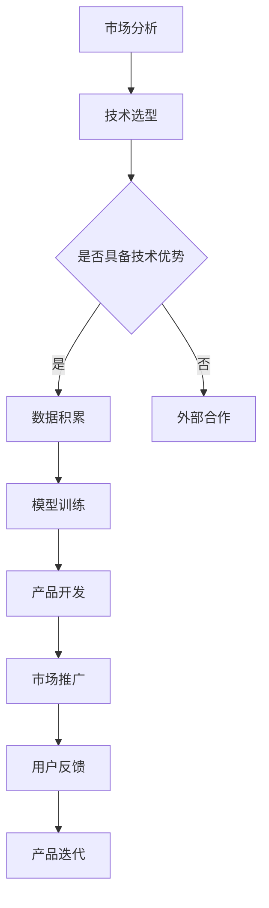

                 

关键词：AI大模型、市场优势、创业策略、技术路线、商业模式、案例研究

> 摘要：本文将深入探讨AI大模型创业过程中的市场优势，分析如何利用技术创新、数据资源、商业模式等手段在竞争激烈的市场中脱颖而出。通过具体的案例分析，为创业者提供实用的创业策略和操作步骤。

## 1. 背景介绍

在过去的几年里，人工智能（AI）技术取得了显著的进展，尤其是在深度学习和大型语言模型方面。这些技术不仅改变了传统行业的面貌，也为创业公司提供了前所未有的机会。随着AI大模型的性能不断提升，如何有效地利用这些技术进行创业，成为了众多创业者关注的热点。

当前市场环境充满挑战和机遇。一方面，互联网巨头和科技巨头在AI领域的投入和垄断加剧了市场的竞争；另一方面，新兴技术的普及为小公司提供了接近用户和市场的能力。在这种情况下，创业者需要找到合适的切入点，利用市场优势，实现快速崛起。

## 2. 核心概念与联系

### 2.1 AI大模型

AI大模型是指通过深度学习算法，利用海量数据进行训练，从而获得高度智能化的模型。这些模型具有强大的表征能力和决策能力，可以应用于自然语言处理、计算机视觉、推荐系统等多个领域。

### 2.2 市场优势

市场优势是指企业在市场竞争中通过某些手段（如技术创新、品牌优势、资源整合等）获得的竞争优势。对于AI大模型创业来说，市场优势主要体现在以下几个方面：

- **技术创新**：通过持续的技术研发，不断提升产品的性能和用户体验。
- **数据资源**：积累和利用海量数据，提升模型的训练效果和应用范围。
- **商业模式**：创新商业模式，找到合适的盈利模式和市场定位。
- **品牌效应**：建立良好的品牌形象，增强用户信任和市场影响力。

### 2.3 Mermaid 流程图



## 3. 核心算法原理 & 具体操作步骤

### 3.1 算法原理概述

AI大模型的核心在于深度学习算法，尤其是基于神经网络的大规模模型训练。深度学习通过多层神经网络对数据进行学习，从而实现特征提取和模型预测。以下是一个简化的深度学习模型训练流程：

1. **数据预处理**：对原始数据进行清洗、标准化等处理，使其适合模型训练。
2. **模型初始化**：初始化神经网络模型，设置网络结构、参数等。
3. **训练过程**：通过迭代优化算法（如梯度下降）更新模型参数，使模型在训练数据上达到较好的拟合效果。
4. **评估与优化**：在验证数据集上评估模型性能，通过调整模型结构和超参数优化模型效果。
5. **部署与测试**：将训练好的模型部署到实际应用中，进行测试和优化。

### 3.2 算法步骤详解

1. **数据收集与处理**：
   - 收集大量相关的数据集，如文本、图像、音频等。
   - 对数据进行预处理，包括去重、归一化、特征提取等。

2. **模型构建**：
   - 选择合适的神经网络架构，如CNN、RNN、Transformer等。
   - 设置模型参数，包括层数、神经元数量、激活函数等。

3. **训练与优化**：
   - 使用训练数据对模型进行训练，通过反向传播算法更新参数。
   - 使用验证数据集进行模型优化，调整超参数，避免过拟合。

4. **模型评估**：
   - 在测试数据集上评估模型性能，使用准确率、召回率、F1值等指标。
   - 对模型进行调优，提高其性能。

5. **部署与运维**：
   - 将训练好的模型部署到服务器或云端，实现实时预测。
   - 监控模型运行状态，进行定期维护和更新。

### 3.3 算法优缺点

**优点**：
- **强大的表征能力**：深度学习模型能够从数据中自动提取特征，适应各种复杂任务。
- **广泛的适用性**：可以应用于图像识别、自然语言处理、推荐系统等多个领域。
- **自动化程度高**：通过大量数据训练，模型能够自动优化，减少人工干预。

**缺点**：
- **计算资源消耗大**：深度学习模型需要大量计算资源和时间进行训练。
- **数据需求高**：需要大量标注数据来训练模型，成本较高。
- **模型解释性差**：深度学习模型往往难以解释其决策过程，增加了风险。

### 3.4 算法应用领域

AI大模型的应用领域非常广泛，包括但不限于以下几个方面：

- **自然语言处理**：文本分类、情感分析、机器翻译等。
- **计算机视觉**：图像识别、目标检测、图像生成等。
- **推荐系统**：个性化推荐、商品推荐等。
- **医疗健康**：疾病预测、药物研发等。
- **金融领域**：风险控制、量化交易等。

## 4. 数学模型和公式 & 详细讲解 & 举例说明

### 4.1 数学模型构建

AI大模型的数学基础主要包括线性代数、微积分和概率论。以下是一个简单的线性回归模型：

$$ y = \beta_0 + \beta_1 \cdot x $$

其中，$y$ 是因变量，$x$ 是自变量，$\beta_0$ 和 $\beta_1$ 是模型参数。

### 4.2 公式推导过程

线性回归模型的推导过程如下：

1. **假设**：假设数据集 $D$ 中存在线性关系，即 $y = \beta_0 + \beta_1 \cdot x$。
2. **最小化损失函数**：定义损失函数 $L(\beta_0, \beta_1) = \sum_{i=1}^{n} (y_i - (\beta_0 + \beta_1 \cdot x_i))^2$，并最小化损失函数。
3. **求导**：对 $\beta_0$ 和 $\beta_1$ 分别求导，并令导数为零，得到：
   $$ \frac{\partial L}{\partial \beta_0} = -2 \sum_{i=1}^{n} (y_i - (\beta_0 + \beta_1 \cdot x_i)) = 0 $$
   $$ \frac{\partial L}{\partial \beta_1} = -2 \sum_{i=1}^{n} (y_i - (\beta_0 + \beta_1 \cdot x_i)) \cdot x_i = 0 $$
4. **解方程**：解上述方程组，得到 $\beta_0$ 和 $\beta_1$ 的最优值。

### 4.3 案例分析与讲解

假设我们有一个简单的数据集，包含两个特征 $x_1$ 和 $x_2$，以及目标变量 $y$。我们的目标是建立一个线性回归模型来预测 $y$ 的值。

数据集如下：

| $x_1$ | $x_2$ | $y$ |
| --- | --- | --- |
| 1 | 2 | 3 |
| 2 | 4 | 5 |
| 3 | 6 | 7 |

1. **数据预处理**：对数据进行标准化处理，使其适合模型训练。
2. **模型构建**：构建一个线性回归模型，假设 $y = \beta_0 + \beta_1 \cdot x_1 + \beta_2 \cdot x_2$。
3. **训练模型**：使用最小二乘法训练模型，计算 $\beta_0$、$\beta_1$ 和 $\beta_2$ 的值。
4. **模型评估**：在测试数据集上评估模型性能，计算预测误差和模型准确率。

通过以上步骤，我们可以得到一个简单的线性回归模型，并对其进行评估和优化。

## 5. 项目实践：代码实例和详细解释说明

### 5.1 开发环境搭建

在开始编写代码之前，我们需要搭建一个合适的开发环境。以下是一个基本的Python开发环境搭建步骤：

1. 安装Python：从官方网站（https://www.python.org/downloads/）下载并安装Python。
2. 安装Anaconda：下载并安装Anaconda，它是一个包含Python和其他科学计算库的集成环境。
3. 安装必要的库：使用Anaconda的命令行工具安装必要的库，如NumPy、Pandas、Scikit-learn等。

### 5.2 源代码详细实现

以下是一个简单的线性回归模型实现：

```python
import numpy as np
import pandas as pd
from sklearn.linear_model import LinearRegression

# 读取数据
data = pd.read_csv('data.csv')
X = data[['x1', 'x2']]
y = data['y']

# 构建模型
model = LinearRegression()
model.fit(X, y)

# 模型参数
beta_0 = model.intercept_
beta_1 = model.coef_[0]
beta_2 = model.coef_[1]

# 预测
predictions = model.predict(X)

# 模型评估
mse = np.mean((predictions - y) ** 2)
print(f'MSE: {mse}')

# 输出模型参数
print(f'\nModel Parameters:\n\beta_0: {beta_0}\n\beta_1: {beta_1}\n\beta_2: {beta_2}')
```

### 5.3 代码解读与分析

1. **导入库**：首先导入必要的库，如NumPy、Pandas和Scikit-learn。
2. **读取数据**：使用Pandas读取CSV文件，获取特征和目标变量。
3. **构建模型**：使用Scikit-learn的LinearRegression类构建线性回归模型。
4. **训练模型**：使用fit方法训练模型，计算模型参数。
5. **预测与评估**：使用predict方法进行预测，计算MSE（均方误差）评估模型性能。
6. **输出结果**：输出模型参数和MSE值，以便进行模型分析和优化。

通过以上步骤，我们可以实现一个简单的线性回归模型，并进行性能评估。

## 6. 实际应用场景

AI大模型在实际应用中具有广泛的前景，以下是一些典型应用场景：

### 6.1 自然语言处理

自然语言处理（NLP）是AI大模型的重要应用领域之一。通过训练大型语言模型，可以实现文本分类、情感分析、机器翻译、对话系统等功能。例如，企业可以利用AI大模型进行客户服务自动化，提高服务质量。

### 6.2 计算机视觉

计算机视觉领域利用AI大模型进行图像识别、目标检测、图像生成等任务。例如，安防监控系统中可以采用AI大模型实现人脸识别和目标跟踪，提高监控效果。

### 6.3 推荐系统

推荐系统利用AI大模型进行个性化推荐，提高用户体验。例如，电商平台可以利用AI大模型分析用户行为和偏好，为用户提供个性化的商品推荐。

### 6.4 医疗健康

在医疗健康领域，AI大模型可以应用于疾病预测、药物研发等任务。例如，通过训练AI大模型，可以实现对疾病早期预测，提高诊断准确率。

### 6.5 金融领域

在金融领域，AI大模型可以应用于风险管理、量化交易等任务。例如，通过训练AI大模型，可以实现对金融市场的预测，提高投资收益。

## 7. 工具和资源推荐

### 7.1 学习资源推荐

1. **书籍**：《深度学习》（Goodfellow、Bengio、Courville著）——经典深度学习教材。
2. **在线课程**：Coursera、edX等平台上提供的深度学习相关课程。
3. **博客与论坛**：ArXiv、GitHub、Reddit等，可以了解最新的研究进展和技术应用。

### 7.2 开发工具推荐

1. **Python**：Python是深度学习的首选语言，拥有丰富的库和工具。
2. **TensorFlow**：TensorFlow是一个开源的深度学习框架，适用于构建和训练AI大模型。
3. **PyTorch**：PyTorch是一个动态的深度学习框架，易于实验和开发。

### 7.3 相关论文推荐

1. **《Attention is All You Need》**（Vaswani et al., 2017）——Transformer模型的开创性论文。
2. **《BERT: Pre-training of Deep Neural Networks for Language Understanding》**（Devlin et al., 2018）——BERT模型的详细介绍。
3. **《GPT-3: Language Models are few-shot learners》**（Brown et al., 2020）——GPT-3模型的突破性研究。

## 8. 总结：未来发展趋势与挑战

### 8.1 研究成果总结

AI大模型在自然语言处理、计算机视觉、推荐系统等领域取得了显著成果，推动了这些领域的发展。通过持续的技术创新和优化，AI大模型的应用范围和性能不断提升。

### 8.2 未来发展趋势

1. **模型规模扩大**：随着计算资源和存储能力的提升，AI大模型的规模将进一步扩大，实现更高的性能和更强的泛化能力。
2. **跨模态学习**：结合多种模态（如文本、图像、音频等），实现更复杂的任务处理。
3. **零样本学习**：减少对大规模标注数据的依赖，实现更好的零样本学习能力和泛化能力。
4. **隐私保护**：在保护用户隐私的前提下，实现高效的大规模数据处理和模型训练。

### 8.3 面临的挑战

1. **计算资源消耗**：AI大模型训练和部署需要大量的计算资源和时间，成本较高。
2. **数据质量**：高质量的数据是训练有效AI大模型的关键，数据标注和清洗的难度较大。
3. **模型解释性**：深度学习模型的解释性较差，增加了模型风险和信任问题。
4. **伦理和法律问题**：AI大模型的应用可能涉及伦理和法律问题，如数据隐私、偏见和歧视等。

### 8.4 研究展望

未来，AI大模型的研究将继续深入，涉及跨领域、跨模态的学习，以及隐私保护和模型解释性等方面的研究。同时，随着技术的进步，AI大模型将在更多领域得到应用，推动社会的发展和进步。

## 9. 附录：常见问题与解答

### 9.1 如何选择合适的深度学习框架？

选择深度学习框架时，主要考虑以下几个方面：

- **需求**：根据项目需求选择合适的框架，如TensorFlow适用于复杂模型，PyTorch适用于快速实验。
- **社区和支持**：选择社区活跃、文档丰富的框架，便于学习和解决问题。
- **生态系统**：考虑框架的生态系统，如库、工具和教程等。

### 9.2 如何优化AI大模型训练？

优化AI大模型训练可以从以下几个方面入手：

- **数据预处理**：提高数据质量，减少噪声和冗余。
- **模型结构**：选择合适的模型结构，如深度、宽度等。
- **超参数调整**：调整学习率、批次大小等超参数，提高模型性能。
- **训练技巧**：使用技巧如dropout、正则化等，防止过拟合。

### 9.3 如何评估AI大模型性能？

评估AI大模型性能可以从以下几个方面入手：

- **准确性**：计算模型预测的准确性，如分类准确率、回归误差等。
- **泛化能力**：在验证数据集上评估模型的泛化能力。
- **效率**：评估模型的计算效率和部署性能。
- **用户反馈**：收集用户反馈，了解模型的实际效果和用户满意度。

---

作者：禅与计算机程序设计艺术 / Zen and the Art of Computer Programming


