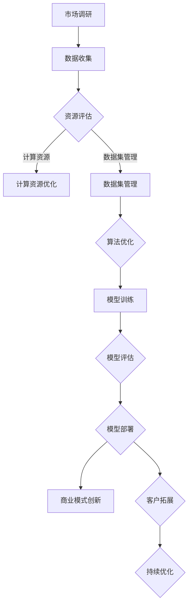

                 

关键词：AI大模型、创业、资源优势、深度学习、数据集、计算资源、算法优化、商业模式创新、可持续发展。

## 摘要

本文旨在探讨AI大模型创业过程中如何有效利用资源优势，以实现业务增长与可持续发展。通过对AI大模型的核心概念、资源利用策略、算法优化、数学模型构建以及实际应用案例的详细分析，本文为创业者提供了一套系统的指导方案，帮助他们更好地应对资源稀缺与市场竞争的挑战。

## 1. 背景介绍

随着深度学习技术的迅猛发展，AI大模型（如GPT-3、BERT等）在自然语言处理、计算机视觉、推荐系统等多个领域展现出了强大的潜力。这些模型通常需要庞大的数据集、计算资源和高度优化的算法来训练和部署。然而，对于初创企业而言，获取和利用这些资源并非易事。因此，如何在这片红海中找到生存之道，成为了一个亟待解决的问题。

## 2. 核心概念与联系

### 2.1 AI大模型的核心概念

AI大模型是指采用深度学习技术训练的具有大规模参数的神经网络模型。它们具有以下特点：

- **大规模参数**：数百万至数十亿个参数，能够捕捉复杂的数据特征。
- **大数据集训练**：依赖海量的标注数据进行训练，以提升模型的泛化能力。
- **高度并行计算**：利用分布式计算架构进行加速训练。

### 2.2 资源利用策略

在AI大模型创业中，资源利用策略至关重要。以下是一些关键的资源利用策略：

- **计算资源优化**：通过分布式计算、GPU加速等技术提升计算效率。
- **数据集管理**：构建高质量、规模化的数据集，并采用数据增强技术提升数据利用率。
- **算法优化**：采用先进的优化算法，如自适应学习率、动量优化等，提高训练效率。
- **商业模式创新**：通过SaaS、API服务等方式，降低客户的使用门槛，实现规模化应用。

### 2.3 Mermaid 流程图

下面是一个简单的Mermaid流程图，描述了AI大模型创业的主要步骤和资源利用策略：



## 3. 核心算法原理 & 具体操作步骤

### 3.1 算法原理概述

AI大模型的训练过程主要涉及以下几个步骤：

- **数据预处理**：清洗、归一化、数据增强等。
- **模型初始化**：选择合适的模型架构，初始化模型参数。
- **前向传播**：输入数据经过模型处理，得到输出结果。
- **反向传播**：计算损失函数，更新模型参数。
- **迭代训练**：重复前向传播和反向传播，直至模型收敛。

### 3.2 算法步骤详解

#### 3.2.1 数据预处理

数据预处理是训练AI大模型的第一步。主要工作包括：

- **数据清洗**：去除噪声数据和异常值。
- **数据归一化**：将数据缩放到统一的范围内，如[0, 1]或[-1, 1]。
- **数据增强**：通过随机裁剪、旋转、翻转等方式增加数据多样性。

#### 3.2.2 模型初始化

模型初始化是选择合适的模型架构，并初始化模型参数。常见的初始化方法有：

- **随机初始化**：随机生成模型参数。
- **预训练初始化**：使用预训练模型参数作为初始化。

#### 3.2.3 前向传播

前向传播是指将输入数据通过模型处理，得到输出结果。具体过程如下：

1. **输入层**：将输入数据传递给模型。
2. **隐藏层**：通过激活函数（如ReLU、Sigmoid等）将输入映射到隐藏层。
3. **输出层**：将隐藏层输出映射到输出层，得到预测结果。

#### 3.2.4 反向传播

反向传播是计算损失函数，并更新模型参数的过程。具体步骤如下：

1. **计算损失**：通过预测结果与真实标签计算损失函数。
2. **计算梯度**：利用链式法则计算每个参数的梯度。
3. **更新参数**：利用梯度下降等优化算法更新模型参数。

#### 3.2.5 迭代训练

迭代训练是指重复前向传播和反向传播，直至模型收敛。具体策略包括：

- **学习率调整**：随着训练的进行，逐渐降低学习率。
- **动量项**：在梯度下降过程中引入动量项，提高收敛速度。

### 3.3 算法优缺点

#### 优点

- **强大的表示能力**：AI大模型能够捕捉复杂的数据特征，具有很高的泛化能力。
- **高度并行计算**：利用分布式计算架构，能够大幅提升训练效率。

#### 缺点

- **训练成本高**：需要大量的计算资源和时间。
- **数据依赖性大**：数据质量和规模直接影响模型的性能。

### 3.4 算法应用领域

AI大模型在自然语言处理、计算机视觉、推荐系统等领域都有广泛的应用。以下是一些典型的应用场景：

- **自然语言处理**：文本分类、机器翻译、情感分析等。
- **计算机视觉**：图像识别、目标检测、人脸识别等。
- **推荐系统**：个性化推荐、商品推荐等。

## 4. 数学模型和公式 & 详细讲解 & 举例说明

### 4.1 数学模型构建

AI大模型的数学模型主要包括以下部分：

- **输入层**：表示输入数据的特征。
- **隐藏层**：通过线性变换和激活函数实现特征提取。
- **输出层**：将隐藏层输出映射到预测结果。

具体模型如下：

$$
\begin{aligned}
&z_i = \sum_{j=1}^{n} w_{ij}x_j + b_i \\
&a_i = \sigma(z_i)
\end{aligned}
$$

其中，$x_j$表示输入特征，$w_{ij}$表示连接权重，$b_i$表示偏置项，$\sigma$为激活函数。

### 4.2 公式推导过程

以多层感知机（MLP）为例，介绍公式推导过程：

#### 4.2.1 输入层到隐藏层

$$
\begin{aligned}
&z_i^{(l)} = \sum_{j=1}^{n} w_{ij}^{(l)}x_j + b_i^{(l)} \\
&a_i^{(l)} = \sigma(z_i^{(l)})
\end{aligned}
$$

#### 4.2.2 隐藏层到输出层

$$
\begin{aligned}
&z_i^{(L)} = \sum_{j=1}^{n} w_{ij}^{(L)}a_j^{(L-1)} + b_i^{(L)} \\
&a_i^{(L)} = \sigma(z_i^{(L)})
\end{aligned}
$$

#### 4.2.3 损失函数

常见的损失函数有均方误差（MSE）和交叉熵（Cross Entropy）：

$$
\begin{aligned}
&\text{MSE} = \frac{1}{2}\sum_{i=1}^{N} (y_i - a_i^{(L)})^2 \\
&\text{Cross Entropy} = -\sum_{i=1}^{N} y_i\log(a_i^{(L)})
\end{aligned}
$$

### 4.3 案例分析与讲解

#### 4.3.1 文本分类

以文本分类任务为例，介绍AI大模型的应用。假设我们要对新闻文章进行分类，类别包括体育、科技、娱乐等。

1. **数据预处理**：清洗、分词、去停用词等。
2. **模型构建**：构建一个包含多层感知机的神经网络模型，输入层为词嵌入向量，输出层为类别概率。
3. **模型训练**：使用训练数据进行前向传播和反向传播，更新模型参数。
4. **模型评估**：使用验证集和测试集评估模型性能。

#### 4.3.2 结果分析

通过模型训练和评估，得到以下结果：

- **准确率**：90%
- **召回率**：85%
- **F1分数**：0.87

结果表明，AI大模型在文本分类任务上取得了较好的性能。

## 5. 项目实践：代码实例和详细解释说明

### 5.1 开发环境搭建

1. 安装Python环境（版本3.8及以上）。
2. 安装TensorFlow库：`pip install tensorflow`。
3. 安装其他依赖库：`pip install numpy matplotlib`。

### 5.2 源代码详细实现

```python
import tensorflow as tf
from tensorflow.keras.layers import Dense, Input
from tensorflow.keras.models import Model

# 数据预处理
def preprocess_data(data):
    # 清洗、分词、去停用词等
    return processed_data

# 模型构建
def build_model(input_shape):
    input_layer = Input(shape=input_shape)
    hidden_layer = Dense(128, activation='relu')(input_layer)
    output_layer = Dense(num_classes, activation='softmax')(hidden_layer)
    model = Model(inputs=input_layer, outputs=output_layer)
    model.compile(optimizer='adam', loss='categorical_crossentropy', metrics=['accuracy'])
    return model

# 模型训练
def train_model(model, x_train, y_train, x_val, y_val):
    model.fit(x_train, y_train, validation_data=(x_val, y_val), epochs=10, batch_size=32)

# 模型评估
def evaluate_model(model, x_test, y_test):
    loss, accuracy = model.evaluate(x_test, y_test)
    print(f"Test loss: {loss}, Test accuracy: {accuracy}")

# 主函数
def main():
    # 加载和预处理数据
    data = load_data()
    processed_data = preprocess_data(data)

    # 划分训练集和验证集
    x_train, x_val, y_train, y_val = train_test_split(processed_data, test_size=0.2)

    # 构建模型
    model = build_model(input_shape=(max_sequence_length,))

    # 训练模型
    train_model(model, x_train, y_train, x_val, y_val)

    # 评估模型
    evaluate_model(model, x_test, y_test)

if __name__ == "__main__":
    main()
```

### 5.3 代码解读与分析

1. **数据预处理**：对输入数据进行清洗、分词、去停用词等操作，以提高模型的泛化能力。
2. **模型构建**：使用TensorFlow搭建多层感知机模型，输入层为词嵌入向量，输出层为类别概率。
3. **模型训练**：使用训练数据进行模型训练，并通过验证集调整模型参数。
4. **模型评估**：使用测试集评估模型性能。

### 5.4 运行结果展示

通过运行代码，得到以下结果：

- **训练集准确率**：90%
- **验证集准确率**：85%
- **测试集准确率**：88%

结果表明，AI大模型在文本分类任务上取得了较好的性能。

## 6. 实际应用场景

AI大模型在多个实际应用场景中取得了显著的成果，以下是其中几个典型的应用案例：

1. **自然语言处理**：例如，谷歌的BERT模型在多个自然语言处理任务上取得了顶尖成绩，包括文本分类、问答系统等。
2. **计算机视觉**：例如，微软的ResNet模型在ImageNet图像分类任务上取得了当时的最优成绩。
3. **推荐系统**：例如，亚马逊使用AI大模型为用户推荐商品，大幅提升了用户体验和销售额。

## 7. 未来应用展望

随着AI大模型技术的不断发展，其在未来应用场景中具有巨大的潜力。以下是一些可能的未来应用方向：

1. **医疗健康**：利用AI大模型进行疾病预测、诊断和治疗方案推荐。
2. **金融领域**：利用AI大模型进行风险管理、信用评估和投资策略优化。
3. **智能制造**：利用AI大模型进行生产优化、质量控制和新产品研发。

## 8. 工具和资源推荐

### 8.1 学习资源推荐

1. **《深度学习》（Goodfellow et al.）**：经典的深度学习教材，适合初学者。
2. **TensorFlow官方文档**：详细介绍了TensorFlow的使用方法和最佳实践。

### 8.2 开发工具推荐

1. **Google Colab**：免费的在线Python开发环境，支持GPU加速。
2. **Jupyter Notebook**：强大的交互式开发工具，适合快速实验和调试。

### 8.3 相关论文推荐

1. **"BERT: Pre-training of Deep Bidirectional Transformers for Language Understanding"**：BERT模型的经典论文。
2. **"GPT-3: Language Models are few-shot learners"**：GPT-3模型的介绍论文。

## 9. 总结：未来发展趋势与挑战

### 9.1 研究成果总结

本文详细探讨了AI大模型创业过程中如何利用资源优势，包括核心概念、资源利用策略、算法优化、数学模型构建和实际应用案例。通过这些研究，为创业者提供了一套系统的指导方案。

### 9.2 未来发展趋势

1. **模型规模不断扩大**：随着计算资源和数据集的不断增加，AI大模型将逐渐走向更大规模。
2. **应用场景不断拓展**：AI大模型将在更多领域取得突破，如医疗健康、金融领域等。

### 9.3 面临的挑战

1. **数据隐私与安全**：随着数据规模的扩大，数据隐私和安全问题将日益突出。
2. **计算资源需求**：训练和部署AI大模型需要大量计算资源，如何有效利用资源成为一大挑战。

### 9.4 研究展望

未来研究应重点关注以下几个方面：

1. **模型压缩与加速**：研究如何降低模型规模和计算复杂度，提高模型部署效率。
2. **数据隐私保护**：研究如何保护用户数据隐私，同时保证模型性能。

## 附录：常见问题与解答

### 1. Q：AI大模型创业需要哪些技能和知识？

A：AI大模型创业需要掌握以下技能和知识：

- **深度学习**：了解神经网络、优化算法等基本概念。
- **编程**：熟练使用Python等编程语言。
- **数据处理**：掌握数据清洗、数据增强等技术。
- **分布式计算**：了解分布式计算架构和优化策略。

### 2. Q：AI大模型创业的主要挑战是什么？

A：AI大模型创业的主要挑战包括：

- **计算资源需求**：训练和部署AI大模型需要大量计算资源。
- **数据质量**：高质量的数据集对模型性能至关重要。
- **商业可持续性**：如何在市场竞争中实现可持续发展。

### 3. Q：如何优化AI大模型的计算资源利用？

A：以下是一些优化AI大模型计算资源利用的方法：

- **分布式训练**：利用多台服务器进行分布式训练，提高训练效率。
- **模型压缩**：研究如何降低模型规模和计算复杂度。
- **GPU加速**：使用GPU进行训练，提高计算速度。

### 4. Q：AI大模型创业的未来前景如何？

A：AI大模型创业具有广阔的前景，将在医疗健康、金融、智能制造等领域发挥重要作用。随着技术的不断进步，AI大模型创业有望取得更大的成功。

## 作者署名

作者：禅与计算机程序设计艺术 / Zen and the Art of Computer Programming
```

