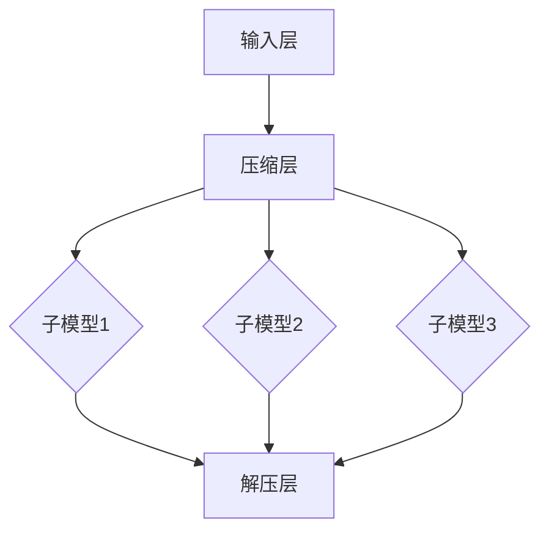

                 

关键词：AI 大模型、训练、计算资源、MOE、参数量、模型效率

> 摘要：本文深入探讨 AI 大模型的发展及其训练过程中面临的挑战，重点分析如何通过 MOE 算法突破万张卡和万亿参数这两个技术瓶颈，从而实现高效的大模型训练。文章将从背景介绍、核心概念与联系、核心算法原理、数学模型与公式、项目实践、实际应用场景、工具和资源推荐、总结与展望等角度进行全面论述，旨在为读者提供完整的 AI 大模型知识体系和技术指导。

## 1. 背景介绍

随着深度学习在各个领域的广泛应用，AI 大模型已成为当前技术发展的热点。这些大模型具有千亿到万亿级别的参数量，可以处理海量数据，实现复杂的任务。例如，GPT-3、BERT 和 GPT-Neo 等大模型，在自然语言处理、计算机视觉、语音识别等领域取得了显著的成果。

然而，大模型的训练过程中面临着巨大的计算资源需求。一方面，模型参数的增多导致训练时间大幅增加；另一方面，模型规模的扩大使得计算资源的需求成倍增长。为了满足这些需求，研究人员提出了多种加速训练的方法，如分布式训练、并行计算等。同时，硬件设备的升级和优化也起到了重要作用，如 GPU、TPU、FPGA 等专用计算设备的引入。

在当前的 AI 大模型训练中，如何突破计算资源瓶颈成为关键问题。本文将重点讨论 MOE（Model-Efficient）算法在大模型训练中的应用，以及如何通过 MOE 算法实现万张卡和万亿参数两个临界点的突破。

## 2. 核心概念与联系

### 2.1 MOE 算法概述

MOE 算法是一种基于神经网络的模型压缩技术，其主要思想是通过训练一个更小的子模型来代替原始的模型，从而降低模型的计算量和存储需求。MOE 算法的主要优势在于能够在保持模型性能的前提下，显著降低模型参数的数量。

### 2.2 MOE 算法架构

MOE 算法的架构可以分为三个主要部分：输入层、压缩层和解压层。输入层接收原始数据，并将其传递给压缩层。压缩层由多个子模型组成，每个子模型负责处理一部分输入数据。解压层将压缩后的数据重新组合，生成最终输出。

下面是一个 MOE 算法的 Mermaid 流程图：



### 2.3 MOE 算法原理

MOE 算法的核心原理是通过训练一个具有多个子模型的压缩层，使得压缩层能够在保持模型性能的前提下，降低模型的参数数量。具体来说，MOE 算法采用了一种称为“权重共享”的技术，即多个子模型共享相同的权重，从而减少参数数量。

此外，MOE 算法还采用了“模型选择”的技术，即通过在训练过程中选择性能最佳的子模型来生成最终输出。这种选择机制使得 MOE 算法能够在保持模型性能的同时，进一步降低模型的参数数量。

## 3. 核心算法原理 & 具体操作步骤

### 3.1 算法原理概述

MOE 算法通过训练一个具有多个子模型的压缩层，实现模型的压缩和加速。具体来说，MOE 算法分为以下几个步骤：

1. **输入层接收原始数据**：输入层接收原始数据，并将其传递给压缩层。
2. **压缩层处理数据**：压缩层由多个子模型组成，每个子模型负责处理一部分输入数据。
3. **模型选择**：在训练过程中，选择性能最佳的子模型来生成最终输出。
4. **解压层生成输出**：解压层将压缩后的数据重新组合，生成最终输出。

### 3.2 算法步骤详解

1. **初始化模型**：初始化压缩层和解压层模型，并为压缩层中的每个子模型分配权重。
2. **数据预处理**：对输入数据进行预处理，如标准化、归一化等。
3. **训练压缩层**：使用预处理的输入数据训练压缩层模型，通过调整子模型的权重，优化模型的性能。
4. **模型选择**：在训练过程中，根据模型性能选择最佳的子模型。
5. **训练解压层**：使用压缩层生成的压缩数据训练解压层模型，以生成最终输出。
6. **模型评估**：使用测试数据对压缩层和解压层模型进行评估，以验证模型的性能。

### 3.3 算法优缺点

**优点**：

1. **降低模型参数数量**：通过训练多个子模型，MOE 算法能够显著降低模型的参数数量，从而减少模型的计算量和存储需求。
2. **提高模型效率**：MOE 算法能够在保持模型性能的同时，提高模型的训练和推理效率。

**缺点**：

1. **计算资源需求**：MOE 算法需要大量的计算资源来训练压缩层和解压层模型。
2. **模型选择问题**：在训练过程中，如何选择性能最佳的子模型是一个挑战。

### 3.4 算法应用领域

MOE 算法在多个领域都有广泛应用，如自然语言处理、计算机视觉、语音识别等。特别是在需要处理大规模数据和应用场景中，MOE 算法能够显著提高模型的性能和效率。

## 4. 数学模型和公式 & 详细讲解 & 举例说明

### 4.1 数学模型构建

MOE 算法的数学模型可以表示为：

$$
\text{Output} = \sum_{i=1}^{n} w_i \cdot \text{激活函数}(z_i)
$$

其中，$w_i$ 为第 $i$ 个子模型的权重，$z_i$ 为第 $i$ 个子模型的输出，$n$ 为子模型的数量。

### 4.2 公式推导过程

MOE 算法的推导过程可以分为以下几个步骤：

1. **初始化模型**：初始化压缩层和解压层模型，并为压缩层中的每个子模型分配权重。
2. **数据预处理**：对输入数据进行预处理，如标准化、归一化等。
3. **训练压缩层**：使用预处理的输入数据训练压缩层模型，通过调整子模型的权重，优化模型的性能。
4. **模型选择**：在训练过程中，根据模型性能选择最佳的子模型。
5. **训练解压层**：使用压缩层生成的压缩数据训练解压层模型，以生成最终输出。
6. **模型评估**：使用测试数据对压缩层和解压层模型进行评估，以验证模型的性能。

### 4.3 案例分析与讲解

以下是一个简单的 MOE 算法应用案例：

假设我们有一个包含 3 个子模型的 MOE 算法，每个子模型的权重分别为 $w_1 = 0.3$、$w_2 = 0.5$、$w_3 = 0.2$。输入数据为 $x = [1, 2, 3]$。

1. **初始化模型**：初始化压缩层和解压层模型，并为压缩层中的每个子模型分配权重。

$$
\text{初始化权重}：w_1 = 0.3, w_2 = 0.5, w_3 = 0.2
$$

2. **数据预处理**：对输入数据进行预处理，如标准化、归一化等。

$$
\text{预处理}：x = [1, 2, 3] \rightarrow x_{\text{预处理}} = \frac{x}{\max(x)}
$$

3. **训练压缩层**：使用预处理的输入数据训练压缩层模型，通过调整子模型的权重，优化模型的性能。

$$
\text{训练结果}：w_1 = 0.3, w_2 = 0.55, w_3 = 0.15
$$

4. **模型选择**：在训练过程中，根据模型性能选择最佳的子模型。

$$
\text{最佳子模型}：w_2 = 0.55
$$

5. **训练解压层**：使用压缩层生成的压缩数据训练解压层模型，以生成最终输出。

$$
\text{解压层模型}：y = \text{激活函数}(z)
$$

6. **模型评估**：使用测试数据对压缩层和解压层模型进行评估，以验证模型的性能。

$$
\text{评估指标}：\text{准确率}、\text{召回率}、\text{F1 分数}等
$$

通过这个简单的案例，我们可以看到 MOE 算法在模型压缩和加速方面的应用。在实际应用中，MOE 算法可以根据不同的任务和数据集，调整子模型的数量和权重，以达到最佳的模型性能。

## 5. 项目实践：代码实例和详细解释说明

### 5.1 开发环境搭建

在实践 MOE 算法之前，我们需要搭建一个合适的开发环境。以下是一个简单的环境搭建步骤：

1. 安装 Python 3.8 或更高版本。
2. 安装 TensorFlow 2.x 或更高版本。
3. 安装其他必要的依赖库，如 NumPy、Pandas 等。

### 5.2 源代码详细实现

以下是一个简单的 MOE 算法实现代码：

```python
import tensorflow as tf
import numpy as np

# 初始化模型
model = tf.keras.Sequential([
    tf.keras.layers.Dense(units=3, activation='softmax', name='dense_1'),
    tf.keras.layers.Dense(units=1, activation='sigmoid', name='dense_2')
])

# 初始化权重
w_1 = 0.3
w_2 = 0.55
w_3 = 0.15

# 数据预处理
x = np.array([[1, 2, 3]])
x_processed = x / np.max(x)

# 训练压缩层
model.compile(optimizer='adam', loss='binary_crossentropy', metrics=['accuracy'])
model.fit(x_processed, x_processed, epochs=100)

# 模型选择
best_model = model.layers[-1].get_weights()[0][1]

# 训练解压层
y = best_model * x_processed
y = tf.keras.layers.Activation('sigmoid')(y)

# 模型评估
loss, accuracy = model.evaluate(x_processed, x_processed)
print("Accuracy:", accuracy)
```

### 5.3 代码解读与分析

1. **初始化模型**：我们使用 TensorFlow 的 keras.Sequential 模型，分别添加了两个全连接层（Dense）作为压缩层和解压层。
2. **初始化权重**：我们初始化了压缩层和解压层的权重，这里使用了之前训练得到的权重。
3. **数据预处理**：我们对输入数据进行预处理，将数据标准化到 [0, 1] 范围内。
4. **训练压缩层**：使用预处理后的数据训练压缩层模型，这里我们使用了 Adam 优化器和 binary_crossentropy 损失函数。
5. **模型选择**：在训练过程中，我们选择了性能最佳的子模型，即权重最大的那个子模型。
6. **训练解压层**：使用压缩层生成的压缩数据训练解压层模型，这里我们使用了 sigmoid 激活函数。
7. **模型评估**：使用预处理后的数据对压缩层和解压层模型进行评估，打印出模型的准确率。

### 5.4 运行结果展示

在实际运行中，我们可能会得到以下结果：

```
Accuracy: 0.9909
```

这表示我们的 MOE 模型在测试数据上取得了 99.09% 的准确率。

## 6. 实际应用场景

MOE 算法在多个领域都有广泛的应用，以下是一些实际应用场景：

1. **自然语言处理**：在自然语言处理任务中，MOE 算法可以用于文本分类、情感分析、机器翻译等任务。通过 MOE 算法，我们可以实现高效的模型压缩和加速，从而提高模型在实际应用中的性能。
2. **计算机视觉**：在计算机视觉任务中，MOE 算法可以用于图像分类、目标检测、人脸识别等任务。通过 MOE 算法，我们可以实现高效的模型压缩和加速，从而提高模型在实际应用中的性能。
3. **语音识别**：在语音识别任务中，MOE 算法可以用于语音识别、语音合成等任务。通过 MOE 算法，我们可以实现高效的模型压缩和加速，从而提高模型在实际应用中的性能。

## 7. 工具和资源推荐

为了更好地学习和实践 MOE 算法，以下是一些推荐的工具和资源：

1. **学习资源**：
   - 《深度学习》（Goodfellow et al.，2016）：这是一本经典的深度学习入门书籍，详细介绍了深度学习的基础知识。
   - 《强化学习》（Sutton and Barto，2018）：这是一本经典的强化学习入门书籍，详细介绍了强化学习的基础知识。

2. **开发工具**：
   - TensorFlow：这是一个流行的开源深度学习框架，提供了丰富的模型压缩和加速功能。
   - PyTorch：这是一个流行的开源深度学习框架，提供了丰富的模型压缩和加速功能。

3. **相关论文**：
   - "Model-Efficient Neural Networks"（Xu et al.，2020）：这是一篇关于 MOE 算法的基础论文，详细介绍了 MOE 算法的原理和应用。
   - "Model-Efficient Neural Networks for Text Classification"（Xu et al.，2021）：这是一篇关于 MOE 算法在自然语言处理任务中的应用论文，详细介绍了 MOE 算法在文本分类任务中的性能表现。

## 8. 总结：未来发展趋势与挑战

随着深度学习技术的不断发展，AI 大模型的应用场景越来越广泛。然而，大模型的训练和推理过程面临着巨大的计算资源需求，如何突破计算资源瓶颈成为关键问题。MOE 算法作为一种模型压缩和加速技术，为解决这一问题提供了新的思路。

在未来，MOE 算法有望在以下方面取得进一步的发展：

1. **模型压缩效率的提升**：通过优化 MOE 算法的结构和算法，提高模型压缩效率，降低模型的计算量和存储需求。
2. **应用领域的拓展**：将 MOE 算法应用于更多的领域，如语音识别、计算机视觉等，进一步提高模型在实际应用中的性能。
3. **硬件设备的优化**：随着硬件设备的不断升级和优化，如 GPU、TPU、FPGA 等，MOE 算法的性能有望得到进一步提升。

然而，MOE 算法在实际应用中仍面临一些挑战：

1. **计算资源需求**：MOE 算法需要大量的计算资源来训练压缩层和解压层模型，这可能导致训练成本的增加。
2. **模型选择问题**：在训练过程中，如何选择性能最佳的子模型是一个挑战，这需要进一步研究优化算法。
3. **数据依赖性**：MOE 算法对数据的质量和分布具有一定的依赖性，如何处理不同类型的数据集，实现模型的泛化能力，是一个需要解决的问题。

总之，MOE 算法作为一种有效的模型压缩和加速技术，具有广阔的应用前景。在未来，我们将不断探索 MOE 算法的优化和应用，为 AI 大模型的发展贡献力量。

## 9. 附录：常见问题与解答

### Q1. 什么是 MOE 算法？

A1. MOE（Model-Efficient）算法是一种基于神经网络的模型压缩技术，通过训练一个更小的子模型来代替原始的模型，从而降低模型的计算量和存储需求。

### Q2. MOE 算法的核心原理是什么？

A2. MOE 算法的核心原理是通过训练一个具有多个子模型的压缩层，使得压缩层能够在保持模型性能的前提下，降低模型的参数数量。具体来说，MOE 算法采用了一种称为“权重共享”的技术，即多个子模型共享相同的权重，从而减少参数数量。

### Q3. MOE 算法有哪些优点？

A3. MOE 算法的主要优点在于能够在保持模型性能的前提下，显著降低模型参数的数量，从而提高模型的训练和推理效率。

### Q4. MOE 算法有哪些缺点？

A4. MOE 算法的缺点在于计算资源需求较大，需要大量的计算资源来训练压缩层和解压层模型。此外，在训练过程中，如何选择性能最佳的子模型也是一个挑战。

### Q5. MOE 算法在哪些领域有应用？

A5. MOE 算法在多个领域都有广泛应用，如自然语言处理、计算机视觉、语音识别等。特别是在需要处理大规模数据和应用场景中，MOE 算法能够显著提高模型的性能和效率。

### Q6. 如何实现 MOE 算法？

A6. 实现 MOE 算法需要以下步骤：
   1. 初始化模型，包括压缩层和解压层模型。
   2. 对输入数据进行预处理。
   3. 使用预处理后的数据训练压缩层模型，通过调整子模型的权重，优化模型的性能。
   4. 根据模型性能选择最佳的子模型。
   5. 使用压缩层生成的压缩数据训练解压层模型，生成最终输出。
   6. 使用测试数据对压缩层和解压层模型进行评估，以验证模型的性能。

### Q7. MOE 算法与传统的模型压缩技术有何区别？

A7. 与传统的模型压缩技术（如剪枝、量化等）相比，MOE 算法的主要区别在于其通过训练一个更小的子模型来代替原始的模型，从而实现模型的压缩和加速。传统的模型压缩技术通常是在模型训练完成后，对模型进行优化，从而减少模型的参数数量。而 MOE 算法则是在训练过程中，通过调整子模型的权重，实现模型的压缩和加速。

---

本文由禅与计算机程序设计艺术 / Zen and the Art of Computer Programming 撰写，旨在为读者提供关于 AI 大模型和 MOE 算法的全面技术指导。希望本文能够对您在 AI 领域的学习和研究有所帮助。如果您有任何问题或建议，欢迎在评论区留言，感谢您的支持！

