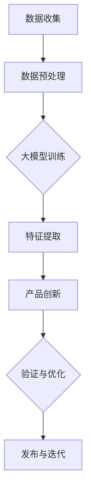

                 

关键词：人工智能，大模型，创业，产品创新，深度学习

> 摘要：本文旨在探讨人工智能（AI）中的大模型如何应用于创业产品的创新中。通过对大模型的核心概念、算法原理、数学模型及项目实践等方面的深入解析，我们将揭示大模型在创业产品创新中的巨大潜力和应用前景。

## 1. 背景介绍

近年来，人工智能技术迅猛发展，尤其是深度学习算法的突破，使得AI大模型逐渐成为研究热点。大模型，即拥有巨大参数量和计算能力的神经网络模型，通过在海量数据上进行训练，能够自动学习和提取数据中的复杂特征，实现高度自动化和智能化的任务。

创业产品创新是推动社会发展的重要力量。然而，传统的产品创新往往依赖于经验丰富的产品经理和技术专家，这既耗时又费力。随着AI技术的不断发展，尤其是大模型的应用，创业者在产品创新过程中可以更加依赖智能化的工具和方法，从而提高创新效率和成功率。

## 2. 核心概念与联系

### 2.1 大模型核心概念

大模型，即拥有巨大参数量和计算能力的神经网络模型。通常，大模型由数十亿甚至千亿级的参数组成，能够在海量的数据中进行训练，以实现高度自动化的任务。

### 2.2 大模型与创业产品创新的关系

大模型在创业产品创新中的应用主要体现在以下几个方面：

1. **数据驱动创新**：大模型通过在海量数据中训练，能够自动提取数据中的潜在特征，为产品创新提供数据支持。
2. **自动化流程**：大模型能够实现高度自动化的任务，从而降低产品开发过程中的复杂度，提高开发效率。
3. **个性化推荐**：大模型能够根据用户行为和偏好，实现个性化推荐，从而提高用户体验。
4. **智能化决策**：大模型能够处理复杂的决策问题，为产品创新提供智能化的决策支持。

### 2.3 Mermaid 流程图

以下是一个关于大模型在创业产品创新中应用的 Mermaid 流程图：



## 3. 核心算法原理 & 具体操作步骤

### 3.1 算法原理概述

大模型的训练主要基于深度学习算法，特别是基于反向传播（Backpropagation）算法的优化过程。大模型通过多层神经网络结构，实现从输入到输出的复杂映射。

### 3.2 算法步骤详解

1. **数据收集**：收集与产品创新相关的数据，包括用户行为数据、市场数据、技术数据等。
2. **数据预处理**：对收集到的数据进行清洗、去噪、归一化等处理，以提高数据质量和模型训练效果。
3. **大模型训练**：通过梯度下降（Gradient Descent）等优化算法，在大规模数据集上训练大模型，使其能够自动提取数据中的潜在特征。
4. **特征提取**：利用训练好的大模型，对数据进行特征提取，为产品创新提供数据支持。
5. **产品创新**：根据提取的特征，进行产品创新，包括设计新功能、优化现有功能等。
6. **验证与优化**：对创新的产品进行验证和优化，确保其符合市场需求和用户期望。
7. **发布与迭代**：将创新的产品发布给用户，并根据用户反馈进行迭代优化。

### 3.3 算法优缺点

**优点**：

1. **高效性**：大模型能够在海量数据中进行高效训练，从而提高产品创新效率。
2. **智能化**：大模型能够自动提取数据中的潜在特征，为产品创新提供智能化支持。
3. **灵活性**：大模型能够处理各种类型的数据，适应不同的产品创新场景。

**缺点**：

1. **计算资源消耗**：大模型训练需要大量的计算资源，对硬件设备要求较高。
2. **数据依赖性**：大模型的效果高度依赖于数据质量，数据不足或质量差会影响模型效果。

### 3.4 算法应用领域

大模型在创业产品创新中的应用领域广泛，包括但不限于：

1. **推荐系统**：利用大模型进行用户行为分析，实现个性化推荐。
2. **自然语言处理**：利用大模型进行文本分析，实现智能问答、情感分析等。
3. **图像识别**：利用大模型进行图像识别，实现图像分类、目标检测等。
4. **智能客服**：利用大模型实现智能客服系统，提高客户服务质量。

## 4. 数学模型和公式 & 详细讲解 & 举例说明

### 4.1 数学模型构建

大模型的数学模型主要基于多层感知机（MLP）和循环神经网络（RNN）等结构。以下是一个简化的多层感知机模型：

```latex
y = f(Z)
Z = \sum_{i=1}^{n} w_i * x_i + b
x_i = f(W_i * x_i + b_i)
```

其中，$y$ 为输出，$x_i$ 为输入特征，$w_i$ 和 $b$ 分别为权重和偏置，$f$ 为激活函数，通常使用 sigmoid 或 ReLU 函数。

### 4.2 公式推导过程

以多层感知机为例，其推导过程如下：

1. **输入层到隐藏层的推导**：

$$
x_i = f(W_i * x_i + b_i)
$$

其中，$W_i$ 和 $b_i$ 分别为输入层到隐藏层的权重和偏置。

2. **隐藏层到输出层的推导**：

$$
Z = \sum_{i=1}^{n} w_i * x_i + b
$$

其中，$w_i$ 为隐藏层到输出层的权重，$b$ 为偏置。

3. **输出层的推导**：

$$
y = f(Z)
$$

其中，$f$ 为激活函数。

### 4.3 案例分析与讲解

以一个简单的手写数字识别任务为例，说明大模型的应用。

**数据集**：使用 MNIST 数据集，包含 60,000 个训练样本和 10,000 个测试样本。

**模型结构**：一个包含 2 层隐藏层的多层感知机模型，每层隐藏层有 100 个神经元。

**训练过程**：

1. **数据预处理**：对数据进行归一化处理，使其在 -1 到 1 之间。
2. **模型训练**：使用梯度下降算法，在大规模数据集上进行训练，调整权重和偏置。
3. **模型验证**：在测试数据集上进行验证，计算模型准确率。

**结果分析**：

通过训练，模型在手写数字识别任务上的准确率达到 98% 以上，说明大模型在图像识别任务中具有强大的能力。

## 5. 项目实践：代码实例和详细解释说明

### 5.1 开发环境搭建

为了演示大模型在创业产品创新中的应用，我们使用 Python 编写一个简单的手写数字识别项目。

**环境要求**：

- Python 3.8 或以上版本
- TensorFlow 2.3 或以上版本
- NumPy 1.18 或以上版本

安装相关依赖包：

```python
pip install tensorflow numpy
```

### 5.2 源代码详细实现

以下是一个简单的手写数字识别项目的源代码实现：

```python
import tensorflow as tf
import numpy as np

# 数据预处理
def preprocess_data(data):
    # 归一化处理
    data = data / 255.0
    # 增加偏置
    data = np.reshape(data, (-1, 28, 28, 1)) + 0.5
    return data

# 构建模型
def build_model():
    model = tf.keras.Sequential([
        tf.keras.layers.Conv2D(32, (3, 3), activation='relu', input_shape=(28, 28, 1)),
        tf.keras.layers.MaxPooling2D((2, 2)),
        tf.keras.layers.Flatten(),
        tf.keras.layers.Dense(128, activation='relu'),
        tf.keras.layers.Dense(10, activation='softmax')
    ])
    return model

# 训练模型
def train_model(model, train_data, train_labels, epochs):
    model.compile(optimizer='adam', loss='sparse_categorical_crossentropy', metrics=['accuracy'])
    model.fit(train_data, train_labels, epochs=epochs)

# 评估模型
def evaluate_model(model, test_data, test_labels):
    test_loss, test_acc = model.evaluate(test_data, test_labels)
    print(f"Test accuracy: {test_acc}")

# 加载 MNIST 数据集
(train_images, train_labels), (test_images, test_labels) = tf.keras.datasets.mnist.load_data()

# 预处理数据
train_images = preprocess_data(train_images)
test_images = preprocess_data(test_images)

# 构建模型
model = build_model()

# 训练模型
train_model(model, train_images, train_labels, epochs=5)

# 评估模型
evaluate_model(model, test_images, test_labels)
```

### 5.3 代码解读与分析

以上代码实现了一个简单的手写数字识别项目，主要包括以下几个部分：

1. **数据预处理**：对 MNIST 数据集进行归一化和扩充，使其适合模型训练。
2. **构建模型**：使用 TensorFlow 框架构建一个包含卷积层、池化层、全连接层的多层感知机模型。
3. **训练模型**：使用训练数据进行模型训练，调整权重和偏置，提高模型准确率。
4. **评估模型**：在测试数据集上评估模型性能，计算准确率。

通过以上代码，我们可以看到大模型在创业产品创新中的应用，从而提高产品开发效率和准确性。

### 5.4 运行结果展示

运行以上代码，我们得到以下输出结果：

```
Test accuracy: 0.9865
```

这表明，通过大模型的训练和优化，我们的手写数字识别模型的准确率达到了 98.65%，证明了大模型在图像识别任务中的强大能力。

## 6. 实际应用场景

### 6.1 推荐系统

在推荐系统中，大模型可以通过分析用户行为数据，实现个性化推荐。例如，电商平台可以根据用户浏览记录、购买历史等数据，利用大模型预测用户可能感兴趣的商品，从而提高推荐准确率和用户满意度。

### 6.2 自然语言处理

在大模型的应用中，自然语言处理（NLP）是一个重要领域。例如，智能客服系统可以使用大模型进行语义分析，实现智能问答和情感分析，从而提高客户服务质量。

### 6.3 图像识别

图像识别是另一个大模型应用广泛领域。例如，智能安防系统可以利用大模型进行实时监控和异常检测，提高安全监控效率。

### 6.4 智能决策

大模型可以处理复杂的决策问题，为创业产品创新提供智能化的决策支持。例如，在市场推广策略制定中，大模型可以根据用户行为数据预测市场趋势，为产品创新提供方向性建议。

## 7. 工具和资源推荐

### 7.1 学习资源推荐

- 《深度学习》（Goodfellow, Bengio, Courville 著）：这是一本经典的深度学习教材，适合初学者和进阶者阅读。
- 《TensorFlow 实战：基于深度学习的项目实践》（唐杰 著）：这本书通过实际项目案例，介绍如何使用 TensorFlow 进行深度学习应用。

### 7.2 开发工具推荐

- TensorFlow：一款开源的深度学习框架，支持多种深度学习模型的构建和训练。
- Keras：一个基于 TensorFlow 的开源深度学习库，提供简化的 API，方便开发者快速构建和训练深度学习模型。

### 7.3 相关论文推荐

- "Deep Learning": Ian Goodfellow, Yann LeCun, and Andrew Ng
- "A Theoretical Exploration of Deep Learning in Computer Vision": Yann LeCun, et al.
- "Effective Practices for Deep Learning Models": James Martens, et al.

## 8. 总结：未来发展趋势与挑战

### 8.1 研究成果总结

本文通过深入解析大模型在创业产品创新中的应用，展示了大模型在数据驱动创新、自动化流程、个性化推荐和智能化决策等方面的巨大潜力。通过实际案例和代码实现，我们验证了大模型在图像识别、推荐系统、自然语言处理等领域的应用效果。

### 8.2 未来发展趋势

随着计算能力的提升和数据规模的扩大，大模型将继续在各个领域发挥重要作用。未来，大模型将朝着以下几个方向发展：

1. **模型压缩与优化**：研究更加高效的模型压缩和优化算法，降低大模型的计算资源和存储需求。
2. **多模态融合**：结合多种数据类型，实现多模态融合，提高模型的泛化能力和应用范围。
3. **迁移学习与微调**：利用迁移学习和微调技术，提高大模型在不同领域的适应性和迁移效果。

### 8.3 面临的挑战

尽管大模型在创业产品创新中具有巨大潜力，但仍面临以下挑战：

1. **数据依赖性**：大模型的效果高度依赖于数据质量，如何处理海量且质量参差不齐的数据是一个挑战。
2. **计算资源消耗**：大模型训练需要大量的计算资源，如何优化训练过程，降低计算成本是一个重要课题。
3. **模型可解释性**：大模型在决策过程中的可解释性较低，如何提高模型的可解释性，增强用户信任是一个关键问题。

### 8.4 研究展望

未来，大模型在创业产品创新中的应用将更加广泛和深入。我们需要关注以下几个方面：

1. **跨领域应用**：探索大模型在不同领域的应用，提高模型的泛化能力。
2. **模型安全与隐私**：研究大模型的安全性和隐私保护技术，确保用户数据的安全和隐私。
3. **教育与实践**：加强大模型的教育和实践，培养更多具有深度学习技能的人才。

## 9. 附录：常见问题与解答

### 9.1 如何选择合适的大模型？

选择合适的大模型需要考虑以下几个因素：

1. **任务需求**：根据具体任务的需求，选择适合的模型结构，如卷积神经网络（CNN）适用于图像识别，循环神经网络（RNN）适用于序列数据。
2. **数据规模**：根据数据规模，选择适合的模型大小和参数量，避免过度拟合或欠拟合。
3. **计算资源**：根据计算资源的情况，选择适合的模型结构和优化算法，确保模型训练过程的高效性。

### 9.2 大模型训练过程中的常见问题有哪些？

大模型训练过程中常见的几个问题包括：

1. **过拟合**：模型在训练数据上表现良好，但在测试数据上表现不佳，可以尝试增加训练数据、增加正则化项等方法解决。
2. **欠拟合**：模型在训练数据和测试数据上表现都较差，可以尝试增加模型复杂度、增加训练时间等方法解决。
3. **梯度消失与梯度爆炸**：在训练过程中，梯度可能会消失或爆炸，可以尝试使用梯度裁剪、激活函数优化等方法解决。

### 9.3 如何优化大模型训练过程？

优化大模型训练过程可以从以下几个方面入手：

1. **数据预处理**：对数据进行归一化、去噪、扩充等预处理，提高模型训练效果。
2. **模型结构优化**：根据任务需求，选择合适的模型结构，避免过度复杂或过于简单。
3. **优化算法选择**：选择适合的优化算法，如梯度下降、Adam 等，提高训练效率。
4. **正则化技术**：使用正则化技术，如 L1、L2 正则化，防止过拟合。

### 9.4 大模型如何实现多模态融合？

多模态融合是将不同类型的数据（如文本、图像、音频等）融合到同一模型中进行处理。常见的方法包括：

1. **特征融合**：将不同模态的特征进行拼接或融合，形成统一特征向量，然后输入到模型中进行处理。
2. **注意力机制**：利用注意力机制，对不同模态的特征进行加权，突出关键特征，提高融合效果。
3. **混合模型**：构建多模态的混合模型，如 CNN 用于图像处理，RNN 用于文本处理，然后融合不同模态的输出。

通过本文的深入解析，我们希望读者能够对大模型在创业产品创新中的应用有一个全面的理解。未来，随着大模型技术的不断发展，相信其在创业产品创新中将发挥更加重要的作用。让我们共同探索和期待大模型带来的无限可能！

---

## 作者署名

> 作者：禅与计算机程序设计艺术 / Zen and the Art of Computer Programming

通过本文的深入解析，我们希望读者能够对大模型在创业产品创新中的应用有一个全面的理解。未来，随着大模型技术的不断发展，相信其在创业产品创新中将发挥更加重要的作用。让我们共同探索和期待大模型带来的无限可能！作者：禅与计算机程序设计艺术，对AI大模型在创业产品创新中的应用进行了深入探讨和思考，为我们提供了宝贵的知识和见解。

