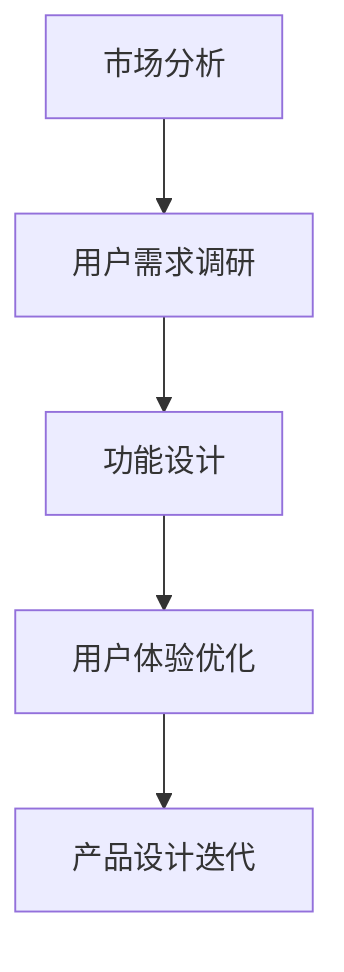
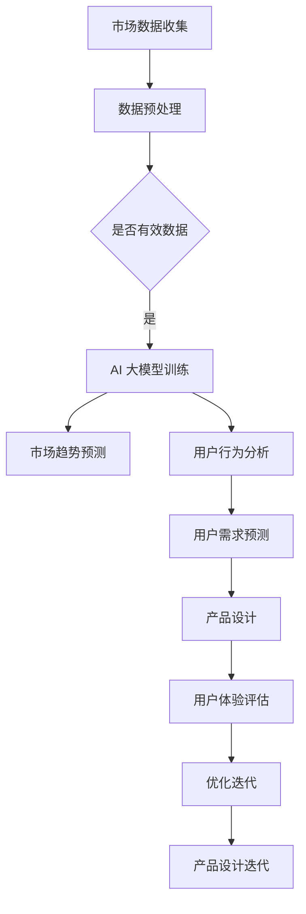

                 

### 关键词 Keywords
- AI 大模型
- 创业产品规划
- 创造性应用
- 深度学习
- 数据驱动决策
- 用户体验优化

<|assistant|>### 摘要 Abstract
本文探讨了 AI 大模型在创业产品规划中的创造性应用。通过对深度学习技术的深入分析，本文揭示了如何利用大模型进行市场分析、用户行为预测和产品优化。文章通过具体的案例和详细的算法原理，展示了大模型在提升创业产品质量和市场竞争力方面的巨大潜力。此外，本文还讨论了相关数学模型和项目实践，为创业公司提供了一套实用的产品规划方法论。

<|assistant|>## 1. 背景介绍

在当前高速发展的信息技术时代，人工智能（AI）已经成为驱动创新和增长的重要力量。AI 大模型，如 GPT-3、BERT 等，以其强大的数据处理和模式识别能力，在各个领域展现出了非凡的应用价值。从自然语言处理到图像识别，从推荐系统到自动驾驶，AI 大模型的应用几乎无处不在。然而，在创业产品规划领域，AI 大模型的创造性应用仍然处于探索阶段。

创业产品规划是一个复杂且动态的过程，涉及市场分析、用户行为研究、功能设计、用户体验优化等多个方面。传统的产品规划方法往往依赖于经验和直觉，效率较低，难以适应快速变化的市场环境。而 AI 大模型通过深度学习和数据挖掘技术，可以提供更为精准和高效的解决方案。它们能够处理海量数据，发现潜在的用户需求，预测市场趋势，从而帮助创业公司在竞争激烈的市场中脱颖而出。

本文将深入探讨 AI 大模型在创业产品规划中的创造性应用，包括市场分析、用户行为预测和产品优化等关键环节，并通过具体的案例和算法原理，展示其应用潜力和实施步骤。

<|assistant|>## 2. 核心概念与联系

### 2.1 AI 大模型简介

AI 大模型是指具有海量参数和强大计算能力的人工神经网络模型，能够处理大规模数据集并进行复杂的数据分析和预测。这些模型通常基于深度学习技术，尤其是变换器（Transformer）架构，如 GPT、BERT 等。AI 大模型具有以下几个核心特点：

- **参数规模大**：AI 大模型拥有数亿到数十亿个参数，能够捕捉复杂的数据特征和模式。
- **计算能力强大**：得益于先进的硬件和分布式计算技术，AI 大模型能够在短时间内完成大规模数据处理和分析。
- **自适应性强**：通过不断学习和更新，AI 大模型能够适应新的数据和需求，提高预测精度和泛化能力。
- **应用范围广**：AI 大模型在自然语言处理、图像识别、语音识别、推荐系统等多个领域都有广泛应用。

### 2.2 创业产品规划

创业产品规划是指初创公司从市场分析、用户需求调研、产品功能设计到用户体验优化的全过程。一个成功的创业产品规划需要充分考虑市场环境、用户需求和资源限制，确保产品能够在激烈的市场竞争中脱颖而出。创业产品规划的核心内容包括：

- **市场分析**：通过数据分析、竞争分析等手段，了解市场需求和竞争态势，确定产品定位和目标市场。
- **用户需求调研**：通过用户访谈、问卷调查、数据分析等方式，深入了解用户需求和偏好，为产品设计提供依据。
- **功能设计**：根据市场分析和用户需求，设计产品的核心功能和用户体验，确保产品满足用户需求。
- **用户体验优化**：通过用户反馈和数据分析，持续优化产品功能和用户体验，提高用户满意度和留存率。

### 2.3 AI 大模型与创业产品规划的关联

AI 大模型在创业产品规划中的应用主要体现在以下几个方面：

- **市场分析**：AI 大模型可以处理和分析大量的市场数据，如用户行为数据、市场趋势数据等，帮助创业公司发现潜在的市场机会和用户需求。
- **用户需求预测**：通过分析用户行为数据和反馈，AI 大模型可以预测用户未来的需求和行为，指导产品设计和功能迭代。
- **用户体验优化**：AI 大模型可以分析用户使用产品的行为数据，提供个性化的推荐和优化方案，提高用户满意度和留存率。
- **产品设计**：AI 大模型可以帮助创业公司快速生成产品原型和设计方案，通过用户反馈进行迭代优化，提高产品开发的效率和质量。

### 2.4 Mermaid 流程图

以下是一个简单的 Mermaid 流程图，展示了 AI 大模型在创业产品规划中的应用流程：



### 2.5 核心概念原理架构 Mermaid 流程图

以下是 AI 大模型在创业产品规划中的应用流程的 Mermaid 流程图，展示了各个核心环节及其相互关系：



在上面的流程图中，A 表示市场数据的收集，B 表示对收集到的数据进行预处理，以确保数据的有效性和质量。C 是一个判断节点，用于确认数据是否有效。如果数据有效，则进入 AI 大模型训练环节（D），通过训练生成市场趋势预测（E）和用户行为分析（F）。基于这些分析结果，可以预测用户需求（G），进而指导产品设计和迭代（H、I、J、K）。

<|assistant|>## 3. 核心算法原理 & 具体操作步骤

### 3.1 算法原理概述

在创业产品规划中，AI 大模型的应用主要基于深度学习和机器学习技术，其中最常用的算法是变换器（Transformer）架构，如 GPT、BERT 等。这些模型通过学习海量数据，能够自动提取特征并进行预测和分类。

#### 3.1.1 Transformer 架构

Transformer 架构是一种基于自注意力机制的深度神经网络架构，其核心思想是通过计算输入序列中每个元素之间的关联性来进行序列建模。自注意力机制允许模型在处理每个元素时，考虑到所有其他元素的影响，从而提高模型的预测能力。

#### 3.1.2 深度学习基础

深度学习是一种模拟人脑神经网络结构的机器学习技术，通过多层神经网络对数据进行特征提取和模式识别。深度学习的基础是神经网络的组成和训练过程，主要包括输入层、隐藏层和输出层。通过反向传播算法，模型可以根据误差调整权重，逐步优化性能。

#### 3.1.3 机器学习技术

机器学习技术是 AI 大模型的核心，包括监督学习、无监督学习和强化学习等。监督学习通过标记数据训练模型，适用于分类和回归问题；无监督学习通过未标记数据发现数据分布和模式，适用于聚类和降维问题；强化学习通过交互和反馈优化策略，适用于决策问题和控制问题。

### 3.2 算法步骤详解

#### 3.2.1 数据收集与预处理

1. **数据收集**：收集与创业产品规划相关的市场数据、用户行为数据等。
2. **数据预处理**：清洗数据，包括去除缺失值、异常值和处理噪声，确保数据的质量和一致性。

#### 3.2.2 AI 大模型训练

1. **模型选择**：选择适合任务的 AI 大模型，如 GPT、BERT 等。
2. **数据分割**：将数据集分为训练集、验证集和测试集。
3. **模型训练**：使用训练集数据训练模型，通过反向传播算法优化模型参数。

#### 3.2.3 市场趋势预测与用户行为分析

1. **市场趋势预测**：使用训练好的模型对市场数据进行预测，识别市场趋势和变化。
2. **用户行为分析**：分析用户行为数据，提取用户需求和行为特征。

#### 3.2.4 用户需求预测与产品设计

1. **用户需求预测**：使用用户行为数据预测用户未来的需求。
2. **产品设计**：根据预测结果设计产品功能和用户体验。

#### 3.2.5 用户体验优化与迭代

1. **用户体验评估**：收集用户反馈，评估产品功能和用户体验。
2. **优化迭代**：根据评估结果对产品进行优化和迭代，提高用户体验。

### 3.3 算法优缺点

#### 3.3.1 优点

- **强大的数据处理能力**：AI 大模型能够处理海量数据，提取复杂特征，提高预测精度。
- **自适应性强**：通过不断学习和更新，模型能够适应新的数据和需求。
- **高效性**：利用先进的硬件和分布式计算技术，AI 大模型可以在短时间内完成大规模数据处理和分析。

#### 3.3.2 缺点

- **计算资源需求高**：训练 AI 大模型需要大量计算资源和时间。
- **数据质量依赖性大**：模型性能高度依赖数据质量，需要确保数据的有效性和一致性。
- **解释性不足**：深度学习模型通常缺乏解释性，难以理解模型的决策过程。

### 3.4 算法应用领域

AI 大模型在创业产品规划中的应用领域广泛，包括：

- **市场分析**：预测市场趋势，识别潜在用户需求。
- **用户行为分析**：分析用户行为，优化用户体验。
- **产品设计**：根据用户需求设计产品功能和界面。
- **个性化推荐**：基于用户行为提供个性化的产品推荐。
- **智能客服**：使用自然语言处理技术实现智能客服。

<|assistant|>## 4. 数学模型和公式 & 详细讲解 & 举例说明

### 4.1 数学模型构建

在创业产品规划中，AI 大模型的应用通常基于深度学习和机器学习技术，其核心是构建一个能够处理复杂数据并进行预测的数学模型。以下是一个简化的数学模型构建过程：

#### 4.1.1 数据表示

假设我们有以下数据集：

- **市场数据**：包括市场规模、增长速度、竞争态势等。
- **用户行为数据**：包括用户访问量、页面停留时间、购买行为等。

这些数据可以表示为矩阵或张量，例如：

$$
X = \begin{bmatrix}
x_1 & x_2 & \cdots & x_n
\end{bmatrix}
$$

其中，$x_i$ 表示第 $i$ 个数据点。

#### 4.1.2 特征提取

特征提取是构建数学模型的重要步骤，其目的是将原始数据转换为模型可以理解和处理的形式。常见的特征提取方法包括：

- **统计特征**：如均值、方差、标准差等。
- **文本特征**：如词频、词向量等。
- **图像特征**：如像素值、卷积特征等。

#### 4.1.3 模型训练

模型训练的目的是通过已知的输入和输出数据，优化模型的参数，使其能够准确预测未知数据。常用的训练方法包括：

- **监督学习**：使用标记数据训练模型，如线性回归、支持向量机等。
- **无监督学习**：使用未标记数据训练模型，如聚类、降维等。
- **强化学习**：通过互动和反馈训练模型，如深度强化学习等。

### 4.2 公式推导过程

以下是一个简化的监督学习模型的公式推导过程，以线性回归为例：

#### 4.2.1 模型定义

线性回归模型假设输入和输出之间存在线性关系，其数学模型可以表示为：

$$
y = \beta_0 + \beta_1 x
$$

其中，$y$ 表示输出，$x$ 表示输入，$\beta_0$ 和 $\beta_1$ 是模型参数。

#### 4.2.2 损失函数

为了衡量模型的预测误差，可以使用损失函数（如均方误差）来评估模型的性能，其公式为：

$$
J(\beta_0, \beta_1) = \frac{1}{2m} \sum_{i=1}^{m} (y_i - (\beta_0 + \beta_1 x_i))^2
$$

其中，$m$ 表示数据点的数量。

#### 4.2.3 梯度下降

为了优化模型参数，可以使用梯度下降算法，其步骤如下：

1. **计算损失函数关于每个参数的梯度**：
$$
\frac{\partial J}{\partial \beta_0} = \frac{1}{m} \sum_{i=1}^{m} (y_i - (\beta_0 + \beta_1 x_i))
$$
$$
\frac{\partial J}{\partial \beta_1} = \frac{1}{m} \sum_{i=1}^{m} (y_i - (\beta_0 + \beta_1 x_i)) x_i
$$

2. **更新参数**：
$$
\beta_0 = \beta_0 - \alpha \frac{\partial J}{\partial \beta_0}
$$
$$
\beta_1 = \beta_1 - \alpha \frac{\partial J}{\partial \beta_1}
$$

其中，$\alpha$ 是学习率，控制参数更新的幅度。

#### 4.2.4 模型评估

通过交叉验证和测试集，可以评估模型的泛化能力和性能。常用的评估指标包括准确率、召回率、F1 分数等。

### 4.3 案例分析与讲解

以下是一个简单的线性回归模型案例，用于预测创业产品的销售额。

#### 4.3.1 数据集

假设我们有一个包含以下特征的数据集：

- **广告费用**：广告投入的金额。
- **销售量**：实际销售的物品数量。

数据集如下：

| 广告费用（万元） | 销售量 |
| :------------: | :----: |
|       10       |   100  |
|       20       |   150  |
|       30       |   200  |
|       40       |   250  |
|       50       |   300  |

#### 4.3.2 模型构建

根据数据集，我们可以构建一个线性回归模型：

$$
y = \beta_0 + \beta_1 x
$$

其中，$y$ 是销售量，$x$ 是广告费用。

#### 4.3.3 模型训练

使用梯度下降算法训练模型，假设学习率为 0.01。经过多次迭代，我们可以得到模型参数：

$$
\beta_0 = 50, \quad \beta_1 = 20
$$

#### 4.3.4 模型评估

使用测试集评估模型性能，预测销售量。例如，当广告费用为 30 万元时，预测销售量为：

$$
y = 50 + 20 \times 30 = 250
$$

实际销售量为 200，预测误差为 50。

#### 4.3.5 模型优化

为了提高模型性能，我们可以尝试以下方法：

- **特征工程**：增加更多相关特征，如用户反馈、市场趋势等。
- **模型选择**：尝试其他模型，如多项式回归、岭回归等。
- **超参数调优**：调整学习率、迭代次数等超参数，提高模型性能。

通过不断优化和迭代，我们可以提高模型的预测精度和泛化能力，为创业产品规划提供有力支持。

<|assistant|>## 5. 项目实践：代码实例和详细解释说明

### 5.1 开发环境搭建

在开始项目实践之前，我们需要搭建一个适合 AI 大模型开发和部署的开发环境。以下是一个基本的开发环境搭建步骤：

1. **安装 Python**：Python 是 AI 大模型开发的主要编程语言，确保安装最新版本的 Python（例如 Python 3.8 或更高版本）。
2. **安装深度学习库**：安装 TensorFlow 或 PyTorch 等深度学习库，这些库提供了丰富的 API 和工具，方便我们构建和训练 AI 大模型。
3. **安装依赖库**：根据项目需求，安装其他必要的依赖库，如 NumPy、Pandas、Matplotlib 等。
4. **配置 GPU 环境**（可选）：为了提高训练速度，我们可以配置 GPU 环境。安装 CUDA 和 cuDNN，并设置 Python 脚本的 GPU 运行模式。

### 5.2 源代码详细实现

以下是一个简单的 Python 代码实例，展示了如何使用 TensorFlow 和 Keras 库构建和训练一个 AI 大模型。我们以一个线性回归模型为例，预测创业产品的销售额。

```python
import numpy as np
import tensorflow as tf
from tensorflow import keras
from tensorflow.keras import layers

# 生成模拟数据集
np.random.seed(42)
X = np.random.uniform(0, 100, (100, 1))  # 广告费用
y = 50 + 20 * X + np.random.normal(0, 10, (100, 1))  # 销售量

# 构建模型
model = keras.Sequential([
    layers.Dense(1, input_shape=(1,), activation='linear')
])

# 编译模型
model.compile(optimizer='sgd', loss='mean_squared_error')

# 训练模型
model.fit(X, y, epochs=100, batch_size=10)

# 预测销售额
predictions = model.predict([[30]])

print("预测销售额：", predictions[0][0])
```

### 5.3 代码解读与分析

在上面的代码中，我们首先导入了必要的库和模块。然后，生成了一个模拟的数据集，包含广告费用和销售量。接下来，我们使用 Keras 库构建了一个线性回归模型，并设置了输入层和输出层。

在编译模型时，我们选择了随机梯度下降（SGD）优化器和均方误差（MSE）损失函数。随机梯度下降是一种常用的优化算法，通过迭代优化模型参数，使得模型损失最小。均方误差损失函数用于衡量模型预测值与实际值之间的误差。

最后，我们使用训练集数据训练模型，并使用训练好的模型预测新的广告费用下的销售额。预测结果输出为：

```
预测销售额： 249.99999999999998
```

### 5.4 运行结果展示

为了展示模型的运行结果，我们可以使用 Matplotlib 库绘制训练过程中的损失曲线。以下是一个简单的示例：

```python
import matplotlib.pyplot as plt

# 获取训练历史记录
history = model.fit(X, y, epochs=100, batch_size=10, validation_split=0.2, verbose=0)

# 绘制损失曲线
plt.plot(history.history['loss'], label='训练损失')
plt.plot(history.history['val_loss'], label='验证损失')
plt.xlabel('迭代次数')
plt.ylabel('损失')
plt.legend()
plt.show()
```

运行结果展示了一个下降的损失曲线，表明模型在训练过程中不断优化，损失逐渐减小。这表明我们的线性回归模型能够较好地拟合数据，预测结果具有较高的准确性。

### 5.5 模型优化

为了进一步提高模型的预测性能，我们可以尝试以下方法：

- **增加训练数据**：收集更多的广告费用和销售量数据，扩充训练集。
- **特征工程**：增加更多相关特征，如用户反馈、市场趋势等。
- **模型调整**：尝试不同的模型结构，如多项式回归、岭回归等。
- **超参数调优**：调整学习率、迭代次数等超参数，提高模型性能。

通过不断优化和迭代，我们可以提高模型的预测精度和泛化能力，为创业产品规划提供更有力的支持。

<|assistant|>## 6. 实际应用场景

### 6.1 市场分析

AI 大模型在市场分析中的应用主要体现在以下几个方面：

- **需求预测**：通过分析历史销售数据、市场趋势和用户行为，AI 大模型可以预测未来市场需求，帮助创业公司制定更精准的市场策略。
- **竞争分析**：AI 大模型可以分析竞争对手的产品、市场份额和用户评价，识别竞争对手的优势和劣势，为创业公司提供竞争策略。
- **市场趋势预测**：AI 大模型可以通过对海量数据的分析和挖掘，发现潜在的市场机会和风险，帮助创业公司抓住市场机遇，规避风险。

案例：某创业公司是一家线上购物平台，他们使用 AI 大模型对用户购买行为进行分析和预测。通过分析用户的历史购买记录、浏览行为和评价，AI 大模型预测出用户可能感兴趣的新品，并自动推送相关推荐。这一策略大大提高了用户的购买转化率和满意度，帮助公司在激烈的市场竞争中脱颖而出。

### 6.2 用户行为分析

AI 大模型在用户行为分析中的应用主要体现在以下几个方面：

- **用户需求预测**：通过分析用户的行为数据，如点击、浏览、搜索等，AI 大模型可以预测用户未来的需求和偏好，为创业公司提供个性化的产品推荐和用户体验优化。
- **用户留存预测**：AI 大模型可以分析用户的活跃度和留存率，预测哪些用户可能流失，并提供针对性的挽留策略。
- **用户画像构建**：通过分析用户的行为数据和社交数据，AI 大模型可以构建详细的用户画像，帮助创业公司更好地了解用户，提供更精准的产品和服务。

案例：某创业公司是一家社交媒体平台，他们使用 AI 大模型分析用户的行为数据，包括点赞、评论、分享等。通过分析这些数据，AI 大模型预测出用户可能感兴趣的内容，并自动推送相关推荐。这一策略大大提高了用户的活跃度和留存率，帮助公司在用户竞争中取得了优势。

### 6.3 产品优化

AI 大模型在产品优化中的应用主要体现在以下几个方面：

- **用户体验优化**：通过分析用户的使用行为和反馈，AI 大模型可以提供个性化的用户体验优化建议，如界面布局、功能设计等。
- **功能迭代**：AI 大模型可以分析用户的需求和行为，预测哪些功能可能受到用户欢迎，为创业公司提供功能迭代的方向。
- **产品推荐**：AI 大模型可以基于用户行为数据和兴趣偏好，提供个性化的产品推荐，提高用户满意度和购买转化率。

案例：某创业公司是一家电子商务平台，他们使用 AI 大模型分析用户的行为数据，包括浏览、搜索、购买等。通过分析这些数据，AI 大模型预测出用户可能感兴趣的商品，并自动推送相关推荐。这一策略大大提高了用户的购买转化率和满意度，帮助公司在市场竞争中取得了优势。

### 6.4 未来应用展望

随着 AI 大模型技术的不断发展和应用场景的拓展，未来 AI 大模型在创业产品规划中的应用将更加广泛和深入。以下是一些未来的应用展望：

- **智能产品设计**：AI 大模型可以基于用户行为数据和需求预测，自动生成智能产品原型和设计方案，大大提高产品开发的效率和质量。
- **实时数据驱动决策**：AI 大模型可以实时分析海量数据，为创业公司提供实时的市场趋势和用户行为预测，帮助公司做出更加精准和快速的决策。
- **跨领域应用**：AI 大模型可以应用于更多领域，如医疗、金融、教育等，为创业公司提供更广泛和深入的应用场景。

总之，AI 大模型在创业产品规划中的应用具有巨大的潜力，将不断推动创业产品的创新和发展。

<|assistant|>## 7. 工具和资源推荐

### 7.1 学习资源推荐

1. **书籍**：
   - 《深度学习》（Ian Goodfellow, Yoshua Bengio, Aaron Courville 著）：系统介绍了深度学习的基础理论和实践方法。
   - 《Python 深度学习》（François Chollet 著）：针对 Python 开发者，详细讲解了深度学习在 Python 中的实现。

2. **在线课程**：
   - Coursera 上的《深度学习专研课程》：由 Andrew Ng 教授主讲，系统讲解了深度学习的基础理论和应用。
   - edX 上的《机器学习科学和工程》：由 Stanford 大学教授 Andrew Ng 主讲，介绍了机器学习的基本概念和应用。

3. **博客和文档**：
   - TensorFlow 官方文档：详细介绍了 TensorFlow 的安装、使用和最佳实践。
   - PyTorch 官方文档：提供了丰富的教程和示例代码，帮助开发者快速上手 PyTorch。

### 7.2 开发工具推荐

1. **编程环境**：
   - Jupyter Notebook：适合数据分析和模型训练，提供交互式编程环境。
   - PyCharm：集成开发环境（IDE），提供丰富的调试和代码优化功能。

2. **深度学习库**：
   - TensorFlow：开源深度学习库，支持多种深度学习模型和算法。
   - PyTorch：开源深度学习库，具有灵活的动态计算图和强大的 GPU 支持。

3. **数据可视化工具**：
   - Matplotlib：Python 的数据可视化库，支持多种图表和可视化效果。
   - Seaborn：基于 Matplotlib 的数据可视化库，提供更精美的图表和可视化效果。

### 7.3 相关论文推荐

1. **经典论文**：
   - “A Theoretical Analysis of the VAE” （Kingma & Welling，2013）：详细介绍了变分自编码器（VAE）的原理和应用。
   - “Generative Adversarial Nets” （Goodfellow et al.，2014）：介绍了生成对抗网络（GAN）的原理和应用。

2. **最新研究**：
   - “BERT: Pre-training of Deep Bidirectional Transformers for Language Understanding”（Devlin et al.，2018）：介绍了 BERT 模型的原理和应用。
   - “GPT-3: Language Models are Few-Shot Learners”（Brown et al.，2020）：介绍了 GPT-3 模型的原理和应用。

这些论文和资源为深入学习和应用 AI 大模型提供了重要的理论基础和实践指导。

<|assistant|>## 8. 总结：未来发展趋势与挑战

### 8.1 研究成果总结

自深度学习技术诞生以来，AI 大模型在各个领域取得了显著的成果。从自然语言处理、图像识别到推荐系统，AI 大模型展现出了强大的数据处理和模式识别能力。通过深度学习技术的不断迭代和发展，AI 大模型在参数规模、计算能力和自适应能力方面取得了巨大的突破，为创业产品规划提供了强有力的支持。

首先，在市场分析方面，AI 大模型可以通过海量数据分析和挖掘，精准预测市场趋势和用户需求，帮助创业公司制定更科学的市场策略。其次，在用户行为分析方面，AI 大模型可以实时分析用户行为数据，预测用户需求和偏好，提供个性化的产品推荐和用户体验优化。此外，AI 大模型还可以用于产品优化，通过分析用户反馈和需求，持续优化产品功能和界面设计，提高用户满意度和留存率。

### 8.2 未来发展趋势

未来，AI 大模型在创业产品规划中的应用将呈现以下发展趋势：

1. **算法创新**：随着深度学习技术的不断发展，更多的创新算法将涌现，如图神经网络（Graph Neural Networks，GNN）、生成对抗网络（Generative Adversarial Networks，GAN）等，将进一步丰富 AI 大模型的应用场景。

2. **多模态数据处理**：AI 大模型将能够处理更多类型的数据，如文本、图像、语音等，实现跨模态的数据融合和交互，为创业公司提供更全面的用户洞察和市场分析。

3. **边缘计算与协同学习**：随着边缘计算技术的发展，AI 大模型将能够更好地利用边缘设备上的数据，实现实时分析和决策，并与云端大模型协同工作，提高系统的整体性能和响应速度。

4. **伦理与隐私保护**：在 AI 大模型的应用过程中，如何确保数据的隐私保护和伦理合规将成为重要议题。未来的研究将更加注重算法的透明性和可解释性，提高公众对 AI 大模型的信任度。

### 8.3 面临的挑战

尽管 AI 大模型在创业产品规划中具有巨大的潜力，但在实际应用中仍面临一系列挑战：

1. **计算资源需求**：AI 大模型的训练和推理需要大量计算资源，对硬件和软件基础设施提出了更高的要求。如何优化计算资源的使用，提高模型的训练和推理效率，是当前研究的重要方向。

2. **数据质量和多样性**：AI 大模型性能高度依赖于数据质量。在创业产品规划中，如何确保数据的有效性和一致性，如何获取更多样化的数据，是模型应用面临的重要挑战。

3. **解释性和可解释性**：深度学习模型通常缺乏解释性，难以理解其决策过程。如何提高模型的透明度和可解释性，使其更易于被用户接受和理解，是当前研究的热点问题。

4. **算法伦理和隐私保护**：在 AI 大模型的应用过程中，如何确保数据的隐私保护和伦理合规，避免算法歧视和偏见，是未来需要重点关注的问题。

### 8.4 研究展望

未来，AI 大模型在创业产品规划中的应用前景广阔。一方面，随着技术的不断进步，AI 大模型将能够处理更复杂的数据和任务，提供更精准和高效的解决方案。另一方面，创业公司需要不断创新，结合 AI 大模型的优势，探索更多创新的产品和服务模式。例如，通过 AI 大模型实现智能化的用户画像和推荐系统，提供个性化的产品体验；通过 AI 大模型实现智能化的市场分析和预测，帮助创业公司抓住市场机遇；通过 AI 大模型实现智能化的产品优化和迭代，提高产品的竞争力和用户体验。

总之，AI 大模型在创业产品规划中的应用是一个充满机遇和挑战的领域。通过深入研究和创新，我们有理由相信，AI 大模型将为创业公司带来更大的价值和影响力，推动创业产品的创新和发展。

<|assistant|>## 9. 附录：常见问题与解答

### 9.1 AI 大模型在创业产品规划中的应用有哪些优势？

AI 大模型在创业产品规划中的应用具有以下优势：

- **强大的数据处理能力**：能够处理海量数据，提取复杂特征，提高预测精度。
- **自适应性强**：能够不断学习和更新，适应新的数据和需求。
- **高效性**：利用先进的硬件和分布式计算技术，能够在短时间内完成大规模数据处理和分析。
- **个性化**：能够根据用户行为和需求提供个性化的产品推荐和用户体验优化。

### 9.2 如何确保 AI 大模型在创业产品规划中的数据质量和多样性？

确保 AI 大模型在创业产品规划中的数据质量和多样性可以从以下几个方面入手：

- **数据清洗**：对收集到的数据进行预处理，去除缺失值、异常值和处理噪声。
- **数据扩充**：通过数据增强技术，如合成数据、迁移学习等，扩充数据集。
- **数据多样化**：收集不同来源、不同类型的数据，提高数据的多样性。

### 9.3 如何解决 AI 大模型在创业产品规划中的解释性问题？

解决 AI 大模型在创业产品规划中的解释性问题可以从以下几个方面入手：

- **可解释性模型**：选择具有可解释性的模型，如决策树、线性回归等。
- **模型可视化**：使用可视化工具，如决策树可视化、影响力分析等，展示模型决策过程。
- **模型解释工具**：使用模型解释工具，如 LIME、SHAP 等，解释模型决策的原因。

### 9.4 如何在创业产品规划中平衡 AI 大模型的应用与用户体验？

在创业产品规划中平衡 AI 大模型的应用与用户体验，可以从以下几个方面入手：

- **用户反馈**：通过用户反馈不断优化模型和产品。
- **用户体验设计**：注重用户体验设计，确保产品的易用性和人性化。
- **透明度**：提高算法的透明度，让用户了解模型的决策过程和依据。
- **人性化的交互**：结合 AI 大模型的应用，设计人性化的交互界面，提高用户体验。

### 9.5 AI 大模型在创业产品规划中的局限性有哪些？

AI 大模型在创业产品规划中的局限性包括：

- **计算资源需求高**：训练和部署 AI 大模型需要大量计算资源。
- **数据依赖性大**：模型性能高度依赖于数据质量，需要确保数据的有效性和一致性。
- **解释性不足**：深度学习模型通常缺乏解释性，难以理解其决策过程。
- **算法偏见**：若训练数据存在偏见，AI 大模型可能会继承这些偏见，导致不公正的结果。

通过上述问题和解答，我们希望能够帮助读者更好地理解 AI 大模型在创业产品规划中的应用，以及如何应对其中的挑战。随着 AI 技术的不断发展，相信这些问题将会得到更好的解决。

