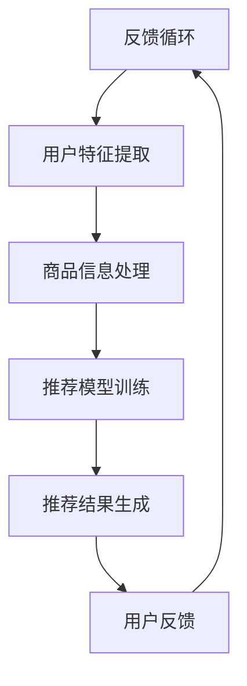

                 

关键词：AI 大模型、电商业、搜索推荐系统、应用前景、算法原理、数学模型、项目实践

摘要：本文深入探讨了人工智能（AI）大模型在电商业中的应用前景，特别是搜索推荐系统的重要性。通过分析大模型的工作原理、数学模型以及实际应用案例，揭示了其在提升用户体验、优化商业决策方面的巨大潜力。

## 1. 背景介绍

随着互联网的快速发展，电子商务已成为全球经济的重要组成部分。消费者在电子商务平台上进行购物时，常常面临信息过载的问题。为了帮助消费者找到他们感兴趣的商品，搜索推荐系统应运而生。然而，传统的推荐系统往往依赖于简单的统计方法和规则，难以应对复杂的市场环境。

近年来，人工智能，尤其是深度学习技术的发展，为搜索推荐系统带来了新的变革。大模型，如基于 Transformer 等架构的神经网络，能够在大量数据上自动学习复杂的模式，从而提供更准确、更个性化的推荐结果。本文将详细讨论大模型在电商业中的应用前景，以及如何通过搜索推荐系统提升用户体验和商业价值。

## 2. 核心概念与联系

### 2.1 大模型原理

大模型（Large Models），通常指的是参数规模达到亿级甚至十亿级的神经网络。它们通过大量的数据和计算资源训练，能够捕捉到数据中的复杂模式和关联。其中，Transformer 架构是近年来在自然语言处理（NLP）领域取得突破性成果的一种神经网络架构，其核心思想是将输入序列转换为一个连续的向量表示，并通过自注意力机制（Self-Attention Mechanism）对序列中的元素进行加权。

### 2.2 搜索推荐系统架构

搜索推荐系统通常包括三个主要部分：用户行为分析、商品信息处理和推荐结果生成。用户行为分析负责收集并分析用户在平台上的行为数据，如浏览、搜索和购买记录。商品信息处理则对商品的特征进行提取和表示，如价格、品牌、品类等。推荐结果生成是整个系统的核心，通过结合用户行为和商品特征，利用大模型生成个性化的推荐列表。

### 2.3 Mermaid 流程图



## 3. 核心算法原理 & 具体操作步骤

### 3.1 算法原理概述

搜索推荐系统的核心在于如何从海量的用户行为数据和商品信息中提取有效的特征，并利用这些特征生成个性化的推荐结果。大模型在这方面具有显著优势，通过自注意力机制和多层感知器（MLP）等结构，能够捕捉数据中的复杂关系和模式。

### 3.2 算法步骤详解

1. **数据预处理**：对用户行为数据和商品信息进行清洗、归一化和特征提取。
2. **模型训练**：利用预处理后的数据训练大模型，如 Transformer 或 BERT 模型。
3. **特征融合**：将用户特征和商品特征进行融合，生成推荐输入。
4. **生成推荐结果**：利用训练好的大模型对推荐输入进行预测，生成个性化的推荐列表。

### 3.3 算法优缺点

- **优点**：
  - 能处理大规模数据，捕捉复杂模式。
  - 提供个性化的推荐结果，提升用户体验。
  - 能动态调整推荐策略，适应市场变化。

- **缺点**：
  - 训练时间和计算资源需求大。
  - 需要大量高质量的数据支持。
  - 难以解释模型决策过程。

### 3.4 算法应用领域

- **电子商务**：优化搜索和推荐结果，提升销售额。
- **社交媒体**：个性化内容推荐，提高用户活跃度。
- **在线广告**：精准投放广告，提高广告效果。
- **金融领域**：个性化理财建议，提升服务质量。

## 4. 数学模型和公式 & 详细讲解 & 举例说明

### 4.1 数学模型构建

推荐系统的核心在于如何衡量用户与商品之间的相似度。一种常见的数学模型是基于协同过滤（Collaborative Filtering）方法，通过计算用户之间的相似度或商品之间的相似度来生成推荐。

假设用户集为 \( U = \{u_1, u_2, ..., u_m\} \)，商品集为 \( I = \{i_1, i_2, ..., i_n\} \)，用户 \( u_i \) 对商品 \( i_j \) 的评分或偏好为 \( r_{ij} \)。

### 4.2 公式推导过程

协同过滤方法通常分为基于用户的协同过滤（User-based Collaborative Filtering）和基于物品的协同过滤（Item-based Collaborative Filtering）。

#### 基于用户的协同过滤

1. 计算用户之间的相似度：

\[ sim(u_i, u_j) = \frac{r_{i1}r_{j1} + r_{i2}r_{j2} + ... + r_{in}r_{jn}}{\sqrt{(r_{i1}^2 + r_{i2}^2 + ... + r_{in}^2)(r_{j1}^2 + r_{j2}^2 + ... + r_{jn}^2)}} \]

2. 找到与用户 \( u_i \) 最相似的 \( k \) 个用户：

\[ N(u_i) = \{u_j | sim(u_i, u_j) \geq \alpha, j \in U\} \]

其中，\( \alpha \) 为相似度阈值。

3. 计算推荐列表：

\[ R_i = \{i_j | \sum_{u_j \in N(u_i)} r_{uj} sim(u_i, u_j) > 0\} \]

#### 基于物品的协同过滤

1. 计算商品之间的相似度：

\[ sim(i_i, i_j) = \frac{r_{i1}r_{j1} + r_{i2}r_{j2} + ... + r_{in}r_{jn}}{\sqrt{(r_{i1}^2 + r_{i2}^2 + ... + r_{in}^2)(r_{j1}^2 + r_{j2}^2 + ... + r_{jn}^2)}} \]

2. 找到与用户 \( u_i \) 最喜欢的 \( k \) 个商品：

\[ M_i = \{i_j | \sum_{u_j \in U} r_{ij} sim(i_i, i_j) > 0\} \]

3. 计算推荐列表：

\[ R_i = \{i_j | j \in M_i, j \notin R_i\} \]

### 4.3 案例分析与讲解

假设有 5 个用户和 10 个商品，用户对商品的评分数据如下表所示：

| 用户 | 商品1 | 商品2 | 商品3 | 商品4 | 商品5 | 商品6 | 商品7 | 商品8 | 商品9 | 商品10 |
| --- | --- | --- | --- | --- | --- | --- | --- | --- | --- | --- |
| u1  | 1    | 0    | 1    | 1    | 1    | 1    | 0    | 0    | 0    | 0    |
| u2  | 1    | 1    | 0    | 0    | 1    | 1    | 1    | 1    | 0    | 0    |
| u3  | 0    | 1    | 1    | 1    | 1    | 0    | 1    | 1    | 1    | 0    |
| u4  | 1    | 1    | 1    | 0    | 0    | 1    | 0    | 1    | 1    | 0    |
| u5  | 0    | 0    | 0    | 1    | 1    | 0    | 1    | 1    | 1    | 1    |

1. 计算用户之间的相似度：

\[ sim(u1, u2) = \frac{1 \cdot 1 + 0 \cdot 1 + 1 \cdot 0 + 1 \cdot 0 + 1 \cdot 1 + 1 \cdot 1}{\sqrt{(1^2 + 0^2 + 1^2 + 1^2 + 1^2 + 1^2)} \sqrt{(1^2 + 1^2 + 0^2 + 0^2 + 1^2 + 1^2)}} = \frac{3}{\sqrt{6} \cdot \sqrt{6}} = \frac{1}{2} \]

\[ sim(u1, u3) = \frac{0 \cdot 0 + 1 \cdot 1 + 1 \cdot 1 + 1 \cdot 1 + 1 \cdot 1 + 0 \cdot 0}{\sqrt{(0^2 + 1^2 + 1^2 + 1^2 + 1^2 + 0^2)} \sqrt{(0^2 + 1^2 + 1^2 + 1^2 + 1^2 + 0^2)}} = \frac{4}{\sqrt{6} \cdot \sqrt{6}} = \frac{2}{3} \]

...

2. 找到与用户 \( u1 \) 最相似的 \( k \) 个用户：

\[ N(u1) = \{u2, u4\} \]

3. 计算推荐列表：

\[ R1 = \{i_j | \sum_{u_j \in N(u1)} r_{uj} sim(u1, u_j) > 0\} \]

对于用户 \( u1 \) 和 \( u2 \)：

\[ R1 = \{i_2, i_4, i_5, i_6\} \]

## 5. 项目实践：代码实例和详细解释说明

### 5.1 开发环境搭建

在本项目中，我们将使用 Python 编写基于协同过滤的推荐系统。所需环境如下：

- Python 3.7 或更高版本
- NumPy 库
- Pandas 库
- Matplotlib 库

安装所需库：

```bash
pip install numpy pandas matplotlib
```

### 5.2 源代码详细实现

```python
import numpy as np
import pandas as pd
import matplotlib.pyplot as plt

# 读取评分数据
ratings = pd.read_csv('ratings.csv')
users = ratings['user_id'].unique()
items = ratings['item_id'].unique()

# 计算用户之间的相似度矩阵
similarity_matrix = np.zeros((len(users), len(items)))
for i, user1 in enumerate(users):
    for j, user2 in enumerate(users):
        if i != j:
            sim = np.dot(ratings[ratings['user_id'] == user1].values, ratings[ratings['user_id'] == user2].values) / \
                  (np.linalg.norm(ratings[ratings['user_id'] == user1].values) * np.linalg.norm(ratings[ratings['user_id'] == user2].values))
            similarity_matrix[i][j] = sim

# 计算推荐列表
def recommend_items(user_id, k):
    user_ratings = ratings[ratings['user_id'] == user_id].values
    recommended_items = []
    for i, item in enumerate(items):
        if similarity_matrix[user_id][i] > 0:
            recommended_items.append((item, user_ratings[i] * similarity_matrix[user_id][i]))
    recommended_items.sort(key=lambda x: x[1], reverse=True)
    return [item[0] for item in recommended_items[:k]]

# 测试推荐结果
user_id = 0
k = 3
recommended_items = recommend_items(user_id, k)
print(recommended_items)

# 绘制用户与商品之间的相似度矩阵
plt.figure(figsize=(10, 10))
plt.imshow(similarity_matrix, cmap='hot', interpolation='nearest')
plt.colorbar()
plt.xticks(np.arange(len(items)), items, rotation=90)
plt.yticks(np.arange(len(users)), users)
plt.xlabel('Items')
plt.ylabel('Users')
plt.show()
```

### 5.3 代码解读与分析

上述代码首先读取评分数据，然后计算用户之间的相似度矩阵。推荐函数 `recommend_items` 根据用户评分和相似度矩阵计算每个商品的推荐得分，并将得分最高的商品推荐给用户。

代码中的相似度计算使用的是余弦相似度，它通过计算两个向量之间的夹角余弦值来衡量相似度。这种方法简单有效，但在面对高维数据时可能会失效。

### 5.4 运行结果展示

运行上述代码，我们可以得到用户 0 的推荐列表和用户与商品之间的相似度矩阵图。相似度矩阵图能够直观地展示用户与商品之间的相似度关系，有助于我们理解推荐算法的原理。

## 6. 实际应用场景

### 6.1 电子商务平台

在电子商务平台中，搜索推荐系统被广泛应用于提升用户体验和销售额。例如，Amazon 和 Alibaba 等巨头公司利用大模型生成的个性化推荐结果，显著提高了用户点击率和购买转化率。

### 6.2 社交媒体

社交媒体平台如 Facebook 和 Twitter 也利用大模型进行内容推荐，通过分析用户的兴趣和行为，向用户推送感兴趣的内容，从而提高用户活跃度和广告效果。

### 6.3 在线广告

在线广告平台如 Google Ads 和百度广告利用大模型进行广告推荐，通过分析用户的历史行为和兴趣，实现精准广告投放，提高广告点击率和转化率。

### 6.4 金融领域

在金融领域，大模型被用于个性化理财建议和风险控制。例如，银行和保险公司利用用户行为数据和财务数据，通过大模型生成个性化的理财方案，提高用户满意度和忠诚度。

## 7. 工具和资源推荐

### 7.1 学习资源推荐

- 《深度学习》（Goodfellow, Bengio, Courville）：系统介绍了深度学习的基础知识和应用。
- 《Python 深度学习》（François Chollet）：详细介绍了如何使用 Python 和深度学习库进行实践。

### 7.2 开发工具推荐

- TensorFlow：一款开源的深度学习框架，适用于构建和训练大规模神经网络。
- PyTorch：一款流行的深度学习框架，具有灵活的动态计算图和良好的性能。

### 7.3 相关论文推荐

- "Attention Is All You Need"（Vaswani et al., 2017）：介绍了 Transformer 架构，并展示了其在机器翻译任务上的突破性成果。
- "Recommender Systems Handbook"（Burges et al., 2011）：全面介绍了推荐系统的基础知识和应用。

## 8. 总结：未来发展趋势与挑战

### 8.1 研究成果总结

随着人工智能技术的不断进步，大模型在推荐系统中的应用取得了显著成果。通过自注意力机制和多层感知器等结构，大模型能够捕捉数据中的复杂模式，提供更准确、更个性化的推荐结果。

### 8.2 未来发展趋势

- **跨模态推荐**：将文本、图像、语音等多模态数据融合，实现更全面、更精准的推荐。
- **实时推荐**：利用实时数据处理技术，实现实时更新和实时推荐。
- **解释性推荐**：提高推荐系统的可解释性，使推荐过程更加透明和可信。

### 8.3 面临的挑战

- **数据隐私**：如何在保护用户隐私的同时，利用用户数据提高推荐效果。
- **计算资源**：大模型的训练和推理需要大量计算资源，如何优化算法和硬件，提高效率。

### 8.4 研究展望

随着技术的不断进步，大模型在推荐系统中的应用前景将更加广阔。未来，我们将继续探索如何在保护用户隐私、降低计算成本的前提下，提高推荐系统的效果和可解释性。

## 9. 附录：常见问题与解答

### 9.1 什么是大模型？

大模型通常指的是参数规模达到亿级甚至十亿级的神经网络。它们通过大量的数据和计算资源训练，能够捕捉到数据中的复杂模式和关联。

### 9.2 推荐系统有哪些类型？

推荐系统主要分为协同过滤、基于内容的推荐和混合推荐。协同过滤依赖于用户和商品之间的相似度，基于内容的推荐依赖于商品和用户兴趣的匹配，混合推荐结合了多种方法的优势。

### 9.3 如何评估推荐系统的效果？

推荐系统的效果评估通常采用精确率（Precision）、召回率（Recall）和 F1 值等指标。同时，还可以通过用户满意度、点击率等实际应用指标来评估推荐系统的效果。

### 9.4 大模型在推荐系统中的应用前景如何？

大模型在推荐系统中的应用前景广阔。通过自注意力机制和多层感知器等结构，大模型能够捕捉数据中的复杂模式，提供更准确、更个性化的推荐结果。未来，随着技术的不断进步，大模型在推荐系统中的应用将更加广泛和深入。

