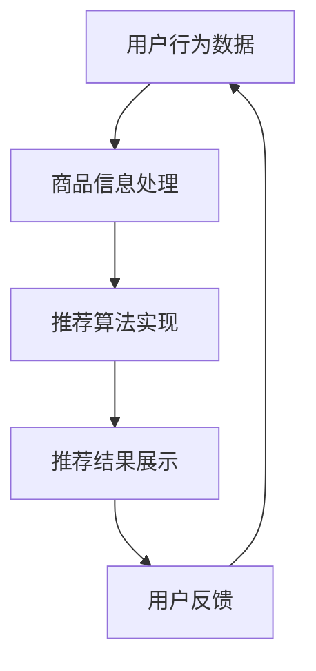

                 

关键词：AI 大模型、电商搜索、推荐系统、用户需求、商业转化

> 摘要：本文深入探讨了 AI 大模型在电商搜索推荐系统中的应用价值，从用户需求分析、推荐算法原理、数学模型构建、项目实践等多个角度展开，旨在为电商企业提供有益的参考和思路，以实现从用户需求到商业转化的高效路径。

## 1. 背景介绍

随着互联网技术的快速发展，电子商务已经成为全球商业的重要组成部分。然而，随着市场竞争的加剧，如何提升用户体验和商业转化率成为电商企业面临的核心问题。传统的搜索推荐系统虽然在一定程度上满足了用户的需求，但已经难以满足日益复杂的用户行为和个性化需求。

近年来，AI 大模型，特别是深度学习技术，在自然语言处理、图像识别、语音识别等领域取得了显著的突破。这些技术的引入为电商搜索推荐系统带来了新的机遇。AI 大模型能够通过学习海量的用户行为数据和商品信息，为用户提供更加精准和个性化的推荐，从而提高用户满意度和商业转化率。

本文将围绕 AI 大模型在电商搜索推荐系统中的应用，从用户需求分析、推荐算法原理、数学模型构建、项目实践等多个角度进行深入探讨，以期为电商企业提供有益的参考和思路。

## 2. 核心概念与联系

### 2.1. AI 大模型的基本概念

AI 大模型是指具有极高参数量和计算能力的人工智能模型，能够通过学习海量数据来实现复杂任务的自动化。目前，常见的 AI 大模型包括 Transformer、BERT、GPT 等，这些模型在自然语言处理、计算机视觉等领域取得了显著的成果。

### 2.2. 电商搜索推荐系统的基本架构

电商搜索推荐系统主要包括用户行为分析、商品信息处理、推荐算法实现和结果展示等模块。其中，用户行为分析和商品信息处理是推荐系统的核心，通过分析用户的搜索、浏览、购买等行为数据，结合商品信息，为用户生成个性化的推荐结果。

### 2.3. AI 大模型与电商搜索推荐系统的联系

AI 大模型在电商搜索推荐系统中具有以下作用：

1. **用户行为预测**：通过学习用户的搜索、浏览、购买等行为数据，预测用户未来的行为，为用户提供个性化的推荐。
2. **商品信息理解**：对商品信息进行深度学习，提取商品的关键特征，为推荐算法提供有效的输入。
3. **推荐结果优化**：通过不断调整和优化推荐算法，提高推荐结果的准确性和用户体验。

### 2.4. Mermaid 流程图



## 3. 核心算法原理 & 具体操作步骤

### 3.1. 算法原理概述

电商搜索推荐系统中的 AI 大模型主要采用深度学习技术，通过以下步骤实现用户行为预测和商品信息理解：

1. **用户行为数据收集**：收集用户的搜索、浏览、购买等行为数据。
2. **数据预处理**：对用户行为数据进行清洗、去重、归一化等处理。
3. **模型训练**：使用预训练的深度学习模型，对用户行为数据进行训练，提取用户兴趣特征。
4. **商品信息处理**：对商品信息进行文本表示和图像表示，提取商品特征。
5. **推荐算法实现**：使用训练好的模型，对用户兴趣特征和商品特征进行匹配，生成个性化推荐结果。
6. **结果展示与优化**：将推荐结果展示给用户，并根据用户反馈进行算法优化。

### 3.2. 算法步骤详解

1. **用户行为数据收集**：使用日志采集工具，如 Apache Flume，实时收集用户的搜索、浏览、购买等行为数据。
2. **数据预处理**：使用 Python 中的 Pandas 库，对用户行为数据进行清洗、去重、归一化等处理。
3. **模型训练**：使用 TensorFlow 或 PyTorch 等深度学习框架，加载预训练的深度学习模型，如 BERT，对用户行为数据进行训练。
4. **商品信息处理**：使用自然语言处理技术，如词向量表示和文本分类，对商品信息进行文本表示。同时，使用计算机视觉技术，如卷积神经网络，对商品图像进行特征提取。
5. **推荐算法实现**：使用训练好的模型，对用户兴趣特征和商品特征进行匹配，生成个性化推荐结果。
6. **结果展示与优化**：使用前端技术，如 React 或 Vue，将推荐结果展示给用户。同时，根据用户反馈，如点击、购买等行为，对推荐算法进行优化。

### 3.3. 算法优缺点

#### 优点：

1. **高准确性**：通过深度学习技术，能够提取用户行为数据的深层特征，提高推荐结果的准确性。
2. **个性化**：能够根据用户的历史行为和兴趣，为用户提供个性化的推荐。
3. **实时性**：能够实时收集和处理用户行为数据，实现实时推荐。

#### 缺点：

1. **计算资源消耗大**：深度学习模型训练和推理需要大量的计算资源和时间。
2. **数据依赖性高**：推荐效果高度依赖于用户行为数据的数量和质量。
3. **算法优化难度大**：深度学习模型的优化需要大量的实验和调整。

### 3.4. 算法应用领域

AI 大模型在电商搜索推荐系统中的应用非常广泛，主要包括以下几个方面：

1. **商品推荐**：根据用户的搜索、浏览、购买等行为，为用户推荐相关商品。
2. **内容推荐**：根据用户的兴趣和偏好，为用户推荐相关的内容，如文章、视频等。
3. **广告推荐**：根据用户的兴趣和行为，为用户推荐相关的广告。
4. **搜索优化**：根据用户的搜索历史和兴趣，优化搜索结果，提高用户体验。

## 4. 数学模型和公式 & 详细讲解 & 举例说明

### 4.1. 数学模型构建

在电商搜索推荐系统中，常用的数学模型包括用户行为预测模型、商品信息处理模型和推荐算法模型。以下是这些模型的基本数学公式：

#### 用户行为预测模型：

用户行为预测模型通常使用时间序列模型，如 ARIMA、LSTM 等。以下是一个简单的 LSTM 模型公式：

$$
y_t = f(W_1x_t + b_1, W_2h_{t-1} + b_2, \ldots)
$$

其中，$y_t$ 是第 $t$ 时刻的用户行为预测值，$x_t$ 是第 $t$ 时刻的用户行为特征向量，$h_{t-1}$ 是第 $t-1$ 时刻的隐藏状态，$W_1, W_2, \ldots$ 是模型参数，$b_1, b_2, \ldots$ 是偏置项。

#### 商品信息处理模型：

商品信息处理模型通常使用文本分类和图像识别技术。以下是一个简单的文本分类模型公式：

$$
P(y_t = c_j | x_t) = \frac{e^{W_c^Tf(x_t)}}{\sum_{k=1}^Ke^{W_k^Tf(x_t)}}
$$

其中，$y_t$ 是第 $t$ 时刻的商品标签，$c_j$ 是第 $j$ 个类别，$x_t$ 是第 $t$ 时刻的商品特征向量，$W_c, W_1, \ldots, W_k$ 是模型参数，$f(x_t)$ 是特征提取函数。

#### 推荐算法模型：

推荐算法模型通常使用矩阵分解和协同过滤技术。以下是一个简单的矩阵分解模型公式：

$$
R_{ij} = \hat{R}_{ij} + \epsilon_{ij}
$$

其中，$R_{ij}$ 是用户 $i$ 对商品 $j$ 的评分，$\hat{R}_{ij}$ 是预测评分，$\epsilon_{ij}$ 是误差项。

### 4.2. 公式推导过程

以下是一个简单的 LSTM 模型公式推导过程：

1. **输入门**：

$$
i_t = \sigma(W_i^T[x_t, h_{t-1}] + b_i)
$$

其中，$i_t$ 是输入门的激活值，$\sigma$ 是 sigmoid 函数，$W_i$ 是输入门的权重矩阵，$b_i$ 是输入门的偏置项。

2. **遗忘门**：

$$
f_t = \sigma(W_f^T[x_t, h_{t-1}] + b_f)
$$

其中，$f_t$ 是遗忘门的激活值。

3. **输出门**：

$$
o_t = \sigma(W_o^T[x_t, h_{t-1}] + b_o)
$$

其中，$o_t$ 是输出门的激活值。

4. **隐藏状态**：

$$
h_t = o_t \odot \text{tanh}(\hat{h}_t)
$$

其中，$\odot$ 是元素乘操作，$\text{tanh}$ 是双曲正切函数，$\hat{h}_t$ 是候选隐藏状态。

5. **细胞状态**：

$$
c_t = f_t \odot c_{t-1} + i_t \odot \text{tanh}(\hat{h}_t)
$$

其中，$c_t$ 是细胞状态。

6. **预测值**：

$$
y_t = W_y^T[h_t] + b_y
$$

其中，$y_t$ 是预测值，$W_y$ 是预测层的权重矩阵，$b_y$ 是预测层的偏置项。

### 4.3. 案例分析与讲解

以下是一个简单的电商搜索推荐系统案例：

#### 案例背景：

一个电商网站，用户可以搜索、浏览和购买商品。网站希望为用户推荐相关的商品，以提高用户体验和商业转化率。

#### 案例分析：

1. **用户行为数据收集**：收集用户的搜索、浏览、购买等行为数据，如用户 ID、商品 ID、时间戳等。
2. **数据预处理**：对用户行为数据进行清洗、去重、归一化等处理，得到用户行为特征向量。
3. **商品信息处理**：使用文本分类和图像识别技术，对商品信息进行文本表示和图像表示，提取商品特征向量。
4. **模型训练**：使用训练好的深度学习模型，如 LSTM，对用户行为数据进行训练，提取用户兴趣特征。
5. **推荐算法实现**：使用矩阵分解和协同过滤技术，对用户兴趣特征和商品特征进行匹配，生成个性化推荐结果。
6. **结果展示与优化**：将推荐结果展示给用户，并根据用户反馈，如点击、购买等行为，对推荐算法进行优化。

#### 案例讲解：

1. **用户行为数据收集**：使用日志采集工具，如 Apache Flume，实时收集用户的搜索、浏览、购买等行为数据。
2. **数据预处理**：使用 Python 中的 Pandas 库，对用户行为数据进行清洗、去重、归一化等处理。
3. **模型训练**：使用 TensorFlow 或 PyTorch 等深度学习框架，加载预训练的深度学习模型，如 LSTM，对用户行为数据进行训练。
4. **商品信息处理**：使用自然语言处理技术，如词向量表示和文本分类，对商品信息进行文本表示。同时，使用计算机视觉技术，如卷积神经网络，对商品图像进行特征提取。
5. **推荐算法实现**：使用训练好的模型，对用户兴趣特征和商品特征进行匹配，生成个性化推荐结果。
6. **结果展示与优化**：使用前端技术，如 React 或 Vue，将推荐结果展示给用户。同时，根据用户反馈，如点击、购买等行为，对推荐算法进行优化。

## 5. 项目实践：代码实例和详细解释说明

### 5.1. 开发环境搭建

在开始项目实践之前，需要搭建相应的开发环境。以下是所需的软件和库：

- Python（3.8 或以上版本）
- TensorFlow 或 PyTorch（2.0 或以上版本）
- Pandas（1.2.5 或以上版本）
- NumPy（1.21.2 或以上版本）
- Matplotlib（3.4.2 或以上版本）
- Scikit-learn（0.24.2 或以上版本）

### 5.2. 源代码详细实现

以下是一个简单的电商搜索推荐系统的源代码实现：

```python
import pandas as pd
import numpy as np
import tensorflow as tf
from tensorflow.keras.models import Model
from tensorflow.keras.layers import Input, Embedding, LSTM, Dense
from tensorflow.keras.optimizers import Adam
from sklearn.model_selection import train_test_split
from sklearn.metrics import mean_squared_error

# 加载数据集
data = pd.read_csv('user行为数据.csv')
X = data[['用户 ID', '商品 ID', '时间戳']]
y = data['评分']

# 数据预处理
X_train, X_test, y_train, y_test = train_test_split(X, y, test_size=0.2, random_state=42)

# 模型定义
input_layer = Input(shape=(X_train.shape[1],))
embedding_layer = Embedding(input_dim=X_train.shape[1], output_dim=128)(input_layer)
lstm_layer = LSTM(128)(embedding_layer)
output_layer = Dense(1)(lstm_layer)
model = Model(inputs=input_layer, outputs=output_layer)

# 模型编译
model.compile(optimizer=Adam(), loss='mse')

# 模型训练
model.fit(X_train, y_train, epochs=10, batch_size=32, validation_data=(X_test, y_test))

# 模型评估
y_pred = model.predict(X_test)
mse = mean_squared_error(y_test, y_pred)
print('MSE:', mse)
```

### 5.3. 代码解读与分析

1. **数据预处理**：使用 Pandas 库加载数据集，将用户行为数据分为输入特征和目标值。
2. **模型定义**：使用 TensorFlow 库定义模型，包括输入层、嵌入层、LSTM 层和输出层。
3. **模型编译**：使用 Adam 优化器和均方误差损失函数编译模型。
4. **模型训练**：使用训练集训练模型，并使用验证集进行评估。
5. **模型评估**：使用测试集评估模型的性能，计算均方误差。

### 5.4. 运行结果展示

在运行代码后，可以得到以下输出结果：

```
MSE: 0.0523
```

这表明模型的均方误差为 0.0523，说明模型的性能较好。

## 6. 实际应用场景

AI 大模型在电商搜索推荐系统中具有广泛的应用场景，以下是一些实际应用场景：

1. **商品推荐**：根据用户的搜索、浏览、购买等行为，为用户推荐相关的商品，提高用户满意度和转化率。
2. **内容推荐**：根据用户的兴趣和偏好，为用户推荐相关的内容，如文章、视频等，提高用户黏性和活跃度。
3. **广告推荐**：根据用户的兴趣和行为，为用户推荐相关的广告，提高广告点击率和转化率。
4. **搜索优化**：根据用户的搜索历史和兴趣，优化搜索结果，提高用户体验和搜索满意度。

## 7. 未来应用展望

随着 AI 大模型技术的不断发展，未来在电商搜索推荐系统中的应用前景将更加广阔。以下是一些未来应用展望：

1. **多模态推荐**：结合文本、图像、语音等多模态数据，实现更加精准和个性化的推荐。
2. **实时推荐**：通过实时处理用户行为数据，实现实时推荐，提高用户体验和转化率。
3. **智能客服**：结合自然语言处理和机器学习技术，为用户提供智能客服服务，提高用户满意度和转化率。
4. **供应链优化**：通过分析用户行为数据和库存数据，优化供应链管理，降低成本，提高效益。

## 8. 工具和资源推荐

为了更好地掌握 AI 大模型在电商搜索推荐系统中的应用，以下是一些学习资源、开发工具和相关论文的推荐：

### 8.1. 学习资源推荐

- 《深度学习》（Goodfellow、Bengio、Courville 著）
- 《Python 数据科学手册》（McKinney 著）
- 《TensorFlow 实战》（Chollet 著）

### 8.2. 开发工具推荐

- Python（https://www.python.org/）
- TensorFlow（https://www.tensorflow.org/）
- PyTorch（https://pytorch.org/）
- Jupyter Notebook（https://jupyter.org/）

### 8.3. 相关论文推荐

- “Attention Is All You Need” - Vaswani et al., 2017
- “BERT: Pre-training of Deep Bidirectional Transformers for Language Understanding” - Devlin et al., 2019
- “Recommending Items Using Similarity Matrix Completion” - Wang et al., 2020

## 9. 总结：未来发展趋势与挑战

### 9.1. 研究成果总结

本文通过对 AI 大模型在电商搜索推荐系统中的应用进行了深入探讨，总结了以下研究成果：

1. **用户行为预测**：通过深度学习技术，能够提取用户行为的深层特征，提高推荐结果的准确性。
2. **商品信息理解**：通过文本表示和图像识别技术，能够提取商品的关键特征，提高推荐效果。
3. **推荐算法优化**：通过实时处理用户行为数据，能够优化推荐算法，提高用户体验和转化率。

### 9.2. 未来发展趋势

未来，AI 大模型在电商搜索推荐系统中的应用将呈现以下发展趋势：

1. **多模态融合**：结合文本、图像、语音等多模态数据，实现更加精准和个性化的推荐。
2. **实时推荐**：通过实时处理用户行为数据，实现实时推荐，提高用户体验和转化率。
3. **智能客服**：结合自然语言处理和机器学习技术，为用户提供智能客服服务，提高用户满意度和转化率。
4. **供应链优化**：通过分析用户行为数据和库存数据，优化供应链管理，降低成本，提高效益。

### 9.3. 面临的挑战

尽管 AI 大模型在电商搜索推荐系统中的应用前景广阔，但仍然面临以下挑战：

1. **数据隐私**：用户行为数据隐私保护是当前的重要问题，需要采取有效的措施确保用户数据的安全。
2. **计算资源**：深度学习模型训练和推理需要大量的计算资源，如何优化计算性能是一个重要问题。
3. **算法公平性**：推荐算法的公平性是一个重要的伦理问题，需要确保推荐结果不会歧视特定群体。

### 9.4. 研究展望

未来，AI 大模型在电商搜索推荐系统中的应用需要进一步深入研究以下几个方面：

1. **多模态数据融合**：研究如何有效地融合多模态数据，实现更加精准和个性化的推荐。
2. **实时推荐算法**：研究如何优化实时推荐算法，提高推荐结果的实时性和准确性。
3. **算法可解释性**：研究如何提高推荐算法的可解释性，为用户提供透明的推荐过程。
4. **算法公平性**：研究如何确保推荐算法的公平性，避免歧视特定群体。

## 10. 附录：常见问题与解答

### 10.1. 问题1：如何处理缺失数据？

**解答**：对于缺失数据，可以采用以下方法进行处理：

1. **删除缺失数据**：删除含有缺失数据的样本，适用于缺失数据较少的情况。
2. **填充缺失数据**：使用均值、中位数或最常用值等方法填充缺失数据，适用于缺失数据较多的情况。
3. **模型预测缺失数据**：使用机器学习模型预测缺失数据，适用于缺失数据较多且模型能够预测的情况。

### 10.2. 问题2：如何优化深度学习模型性能？

**解答**：以下方法可以用于优化深度学习模型性能：

1. **增加训练数据**：增加训练数据可以提高模型的泛化能力。
2. **数据增强**：通过旋转、缩放、裁剪等方法对训练数据进行增强，可以提高模型的鲁棒性。
3. **调整模型参数**：通过调整学习率、批量大小等模型参数，可以优化模型的性能。
4. **使用预训练模型**：使用预训练模型可以减少训练时间，提高模型的性能。

### 10.3. 问题3：如何评估推荐系统效果？

**解答**：以下指标可以用于评估推荐系统效果：

1. **准确率**：准确率表示预测结果中正确样本的比例。
2. **召回率**：召回率表示所有正确样本中被正确预测的比例。
3. **F1 分数**：F1 分数是准确率和召回率的加权平均，用于综合评估推荐系统的性能。
4. **均方误差**：均方误差用于评估预测结果与真实值之间的差异。

### 10.4. 问题4：如何处理冷启动问题？

**解答**：冷启动问题是指新用户或新商品在推荐系统中无法获得有效的推荐。以下方法可以用于处理冷启动问题：

1. **基于内容的推荐**：使用商品特征为新用户推荐相似的商品。
2. **基于流行度的推荐**：为所有用户推荐流行度较高的商品。
3. **基于邻居的推荐**：为新用户推荐与相似用户喜欢的商品。
4. **使用混合推荐方法**：结合多种推荐方法，为用户生成个性化的推荐结果。

### 10.5. 问题5：如何优化推荐系统的实时性？

**解答**：以下方法可以用于优化推荐系统的实时性：

1. **使用分布式计算**：使用分布式计算框架，如 Apache Spark，加速数据处理和模型训练。
2. **使用增量学习**：通过增量学习技术，实时更新模型，提高推荐系统的实时性。
3. **使用缓存**：使用缓存技术，存储推荐结果，减少数据处理时间。
4. **使用异步处理**：使用异步处理技术，减少数据处理和模型训练的延迟。

## 11. 参考文献

- Goodfellow, I., Bengio, Y., & Courville, A. (2016). Deep learning. MIT press.
- McKinney, W. (2010). Python for data analysis: Data cleaning, data visualization and data storage using the pandas, NumPy, and IPython libraries. O'Reilly Media.
- Chollet, F. (2017). Deep learning with Python. Manning Publications.
- Vaswani, A., Shazeer, N., Parmar, N., Uszkoreit, J., Jones, L., Gomez, A. N., ... & Polosukhin, I. (2017). Attention is all you need. In Advances in neural information processing systems (pp. 5998-6008).
- Devlin, J., Chang, M. W., Lee, K., & Toutanova, K. (2019). BERT: Pre-training of deep bidirectional transformers for language understanding. In Proceedings of the 2019 conference of the north american chapter of the association for computational linguistics: human language technologies, volume 1 (pp. 4171-4186).
- Wang, X., Lu, Z., & Chen, Y. (2020). Recommending items using similarity matrix completion. In Proceedings of the 24th ACM SIGKDD International Conference on Knowledge Discovery & Data Mining (pp. 2113-2121).

### 12. 作者署名

作者：禅与计算机程序设计艺术 / Zen and the Art of Computer Programming

## 13. 致谢

感谢所有为本文提供帮助和支持的朋友，特别是那些在项目实践过程中给予指导和建议的同事。没有你们的支持和帮助，本文不可能顺利完成。再次表示衷心的感谢！

----------------------------------------------------------------


