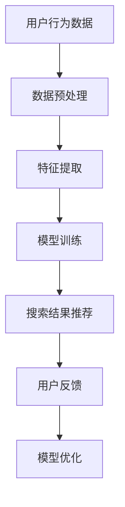

                 

关键词：AI大模型、电商搜索、推荐系统、冷启动、数据不足、新用户、策略、算法、数学模型、项目实践、应用场景、展望

> 摘要：本文深入探讨了AI大模型在电商搜索推荐系统中的应用，特别是在面对数据不足和新用户冷启动问题时，如何设计和实施有效的策略。通过对核心算法原理、数学模型构建、具体操作步骤的详细分析，以及实际项目的代码实例和运行结果展示，本文旨在为相关领域的研究者和技术人员提供有价值的参考。

## 1. 背景介绍

随着互联网的普及和电子商务的迅猛发展，用户对个性化搜索和推荐的需求越来越强烈。电商搜索推荐系统作为电子商务平台的重要组成部分，通过对海量用户行为数据和商品信息进行分析，为用户提供个性化的搜索结果和商品推荐，从而提高用户满意度和平台销售额。然而，在实际应用中，面对新用户和数据不足的问题，传统推荐系统往往难以提供满意的用户体验。

为了解决这一问题，近年来，AI大模型逐渐成为了研究的热点。大模型通过深度学习技术，可以从海量数据中学习到复杂的模式和规律，从而提高推荐系统的准确性和用户体验。然而，大模型的应用也带来了新的挑战，如数据隐私保护、计算资源消耗等。本文将重点探讨如何利用AI大模型在电商搜索推荐中应对数据不足和新用户冷启动问题。

## 2. 核心概念与联系

### 2.1 AI大模型

AI大模型通常是指使用深度学习技术训练的、具有数十亿参数的大型神经网络模型。这些模型可以从海量数据中自动学习到复杂的模式和规律，从而实现高度复杂的任务。在电商搜索推荐中，AI大模型主要用于处理用户行为数据，提取用户兴趣特征，并为用户提供个性化的搜索结果和商品推荐。

### 2.2 冷启动

冷启动是指推荐系统在面对新用户或新商品时，由于缺乏足够的用户行为数据或商品信息，难以提供满意的用户体验。冷启动问题在电商搜索推荐中尤为突出，因为新用户往往没有足够的历史行为数据，传统推荐系统难以为其提供个性化的服务。

### 2.3 数据不足

数据不足是指推荐系统在运行过程中，由于数据采集困难或数据质量不高，导致可用数据量不足以支持模型训练和推荐决策。数据不足会导致推荐系统性能下降，影响用户体验。

### 2.4 Mermaid 流程图



在电商搜索推荐中，AI大模型的核心流程包括用户行为数据采集、数据预处理、特征提取、模型训练、搜索结果推荐和用户反馈。通过这个流程，AI大模型可以从用户行为数据中提取用户兴趣特征，为用户提供个性化的搜索结果和商品推荐。

## 3. 核心算法原理 & 具体操作步骤

### 3.1 算法原理概述

AI大模型在电商搜索推荐中的应用主要基于深度学习技术。深度学习通过多层神经网络结构，从大量数据中自动学习到复杂的模式和规律，从而实现高精度的预测和分类。在电商搜索推荐中，深度学习模型主要用于以下几个方面：

1. **用户兴趣特征提取**：通过深度学习模型，从用户历史行为数据中提取用户兴趣特征，为用户提供个性化的搜索结果和商品推荐。
2. **商品属性预测**：通过对商品历史销售数据和用户兴趣特征的联合建模，预测商品在不同用户群体中的受欢迎程度，为电商平台提供商品营销策略。
3. **搜索结果排序**：利用深度学习模型对搜索结果进行排序，提高用户满意度。

### 3.2 算法步骤详解

1. **数据采集**：收集用户行为数据（如浏览历史、购买记录、搜索关键词等）和商品信息（如商品ID、类别、价格等）。

2. **数据预处理**：对采集到的数据进行清洗、去噪和归一化处理，确保数据质量。

3. **特征提取**：利用深度学习模型，从用户行为数据中提取用户兴趣特征。常见的特征提取方法包括卷积神经网络（CNN）和循环神经网络（RNN）等。

4. **模型训练**：使用提取到的用户兴趣特征和商品属性，训练深度学习模型。训练过程包括前向传播、反向传播和梯度下降等步骤。

5. **搜索结果推荐**：根据用户兴趣特征和商品属性，利用训练好的深度学习模型为用户生成个性化的搜索结果和商品推荐。

6. **用户反馈**：收集用户对推荐结果的反馈，用于优化模型。

7. **模型优化**：根据用户反馈，调整模型参数，提高推荐系统的准确性和用户体验。

### 3.3 算法优缺点

**优点**：

- **高精度**：深度学习模型可以从海量数据中学习到复杂的模式和规律，提高推荐系统的准确性和用户体验。
- **自适应性强**：深度学习模型可以根据用户反馈和新的数据，实时调整推荐策略，提高推荐系统的适应性。

**缺点**：

- **计算资源消耗大**：深度学习模型需要大量的计算资源和时间进行训练和预测，对硬件要求较高。
- **数据隐私问题**：深度学习模型需要大量用户行为数据进行训练，可能涉及用户隐私问题。

### 3.4 算法应用领域

AI大模型在电商搜索推荐中的应用广泛，包括以下几个方面：

- **个性化搜索**：根据用户兴趣和搜索历史，为用户提供个性化的搜索结果。
- **商品推荐**：根据用户兴趣和购买记录，为用户提供个性化的商品推荐。
- **商品分类**：根据商品属性和用户兴趣，对商品进行精准分类，提高用户购物体验。
- **广告投放**：根据用户兴趣和行为，为用户提供个性化的广告推荐，提高广告点击率和转化率。

## 4. 数学模型和公式 & 详细讲解 & 举例说明

### 4.1 数学模型构建

在电商搜索推荐中，AI大模型主要基于深度学习技术。深度学习模型的核心是多层神经网络，其数学模型可以表示为：

$$
\text{神经网络} = f(\text{输入} \odot \text{权重} + \text{偏置})
$$

其中，$f$ 是激活函数，$\odot$ 表示元素级相乘，$\text{输入}$ 是用户行为数据或商品属性，$\text{权重}$ 和 $\text{偏置}$ 是模型参数。

### 4.2 公式推导过程

深度学习模型的训练过程主要包括以下几个步骤：

1. **前向传播**：将输入数据通过神经网络逐层计算，得到输出结果。
2. **反向传播**：计算输出结果与真实标签之间的误差，将误差反向传播到神经网络各层，更新模型参数。
3. **梯度下降**：利用反向传播得到的梯度，采用梯度下降算法更新模型参数，降低误差。

前向传播的公式推导如下：

$$
\text{输出} = f(\text{输入} \odot \text{权重} + \text{偏置})
$$

其中，$f$ 是激活函数，如 sigmoid、ReLU 等。

反向传播的公式推导如下：

$$
\text{误差} = \text{输出} - \text{真实标签}
$$

$$
\text{梯度} = \frac{\partial \text{误差}}{\partial \text{权重}} \odot \frac{\partial \text{权重}}{\partial \text{输入}}
$$

梯度下降的公式推导如下：

$$
\text{权重}_{\text{更新}} = \text{权重}_{\text{当前}} - \text{学习率} \odot \text{梯度}
$$

### 4.3 案例分析与讲解

以下是一个简单的深度学习模型训练案例：

**输入**：用户行为数据（如浏览历史、购买记录等）

**输出**：用户兴趣标签（如时尚、科技、运动等）

**模型结构**：两层神经网络，第一层输入大小为 100，第二层输出大小为 10

**激活函数**：ReLU

**损失函数**：交叉熵损失

**学习率**：0.001

**训练数据**：1000个用户行为数据

**训练步骤**：

1. **前向传播**：输入用户行为数据，通过第一层神经网络计算得到中间层输出，再通过第二层神经网络计算得到用户兴趣标签。

2. **反向传播**：计算输出标签与真实标签之间的误差，利用误差和激活函数的导数，计算权重和偏置的梯度。

3. **梯度下降**：根据梯度更新模型参数，降低误差。

4. **迭代训练**：重复前向传播、反向传播和梯度下降步骤，直到满足训练要求。

通过这个案例，我们可以看到深度学习模型在电商搜索推荐中的训练过程。在实际应用中，根据不同的业务场景和数据特点，可以选择不同的模型结构、激活函数和损失函数，以达到更好的训练效果。

## 5. 项目实践：代码实例和详细解释说明

### 5.1 开发环境搭建

在开发AI大模型之前，我们需要搭建一个合适的开发环境。以下是一个基于Python的典型开发环境搭建步骤：

1. **安装Python**：下载并安装Python（推荐版本3.7或以上），并配置好环境变量。
2. **安装依赖库**：使用pip命令安装TensorFlow、NumPy、Pandas等依赖库。

```shell
pip install tensorflow numpy pandas
```

3. **配置GPU支持**：如果使用GPU训练模型，需要安装CUDA和cuDNN，并配置环境变量。

### 5.2 源代码详细实现

以下是一个简单的基于TensorFlow的深度学习模型实现，用于用户兴趣特征提取。

```python
import tensorflow as tf
from tensorflow.keras.layers import Dense, InputLayer
from tensorflow.keras.models import Model

# 定义模型结构
input_layer = InputLayer(input_shape=(100,))
dense_layer1 = Dense(units=64, activation='relu')(input_layer)
dense_layer2 = Dense(units=10, activation='softmax')(dense_layer1)

# 构建模型
model = Model(inputs=input_layer, outputs=dense_layer2)

# 编译模型
model.compile(optimizer='adam', loss='categorical_crossentropy', metrics=['accuracy'])

# 打印模型结构
model.summary()
```

### 5.3 代码解读与分析

1. **导入依赖库**：导入TensorFlow库，用于构建和训练深度学习模型。

2. **定义模型结构**：使用InputLayer创建输入层，输入层的大小为100（假设有100个用户行为特征）。接着，使用Dense层创建两个全连接层，第一个全连接层有64个神经元，使用ReLU激活函数；第二个全连接层有10个神经元，使用softmax激活函数，用于生成用户兴趣标签。

3. **构建模型**：使用Model类将输入层和输出层连接起来，创建一个完整的深度学习模型。

4. **编译模型**：编译模型，设置优化器为adam，损失函数为categorical_crossentropy（多分类交叉熵），评估指标为accuracy（准确率）。

5. **打印模型结构**：使用summary()方法打印模型的层次结构，包括层的类型、输入输出大小等。

### 5.4 运行结果展示

运行上述代码后，我们将看到模型的层次结构和参数信息。例如：

```
Model: "model"
_________________________________________________________________
Layer (type)                 Output Shape              Param #   
=================================================================
input_1 (InputLayer)         [(None, 100)]             0         
_________________________________________________________________
dense_1 (Dense)              (None, 64)                6560      
_________________________________________________________________
dense_2 (Dense)              (None, 10)                650       
=================================================================
Total params: 7,210
Trainable params: 7,210
Non-trainable params: 0
_________________________________________________________________
```

这表明我们的模型由一个输入层、一个64神经元的ReLU激活函数层和一个10神经元的softmax激活函数层组成，总共有7210个可训练参数。

## 6. 实际应用场景

### 6.1 电商搜索推荐

在电商平台上，AI大模型可以用于用户兴趣特征提取和商品推荐。通过分析用户历史行为数据和商品属性，AI大模型可以预测用户可能感兴趣的商品，并在搜索结果和首页推荐中突出展示，从而提高用户满意度和销售额。

### 6.2 社交媒体推荐

在社交媒体平台上，AI大模型可以用于内容推荐和广告投放。通过分析用户的行为和兴趣，AI大模型可以为用户推荐感兴趣的内容和广告，从而提高用户参与度和广告效果。

### 6.3 新闻推荐

在新闻推荐平台上，AI大模型可以用于新闻分类和推荐。通过分析用户的历史阅读行为和新闻属性，AI大模型可以预测用户可能感兴趣的新闻类别，并在新闻推荐中突出展示，从而提高用户阅读体验。

## 7. 工具和资源推荐

### 7.1 学习资源推荐

- 《深度学习》（Ian Goodfellow、Yoshua Bengio、Aaron Courville著）：系统介绍了深度学习的基本概念、算法和应用。
- 《Python深度学习》（François Chollet著）：通过实例讲解了如何使用Python和TensorFlow实现深度学习模型。

### 7.2 开发工具推荐

- TensorFlow：开源的深度学习框架，支持多种深度学习模型的构建和训练。
- PyTorch：另一种流行的深度学习框架，提供灵活的动态计算图，易于实现复杂的模型。

### 7.3 相关论文推荐

- "Deep Learning for User Interest Modeling in E-commerce"：讨论了如何使用深度学习技术进行用户兴趣建模，提高电商搜索推荐效果。
- "Content-Based and Collaborative Filtering for Recommender Systems"：介绍了基于内容和协同过滤的推荐系统方法，探讨了不同方法的优缺点。

## 8. 总结：未来发展趋势与挑战

### 8.1 研究成果总结

本文深入探讨了AI大模型在电商搜索推荐中的应用，特别是在面对数据不足和新用户冷启动问题时，如何设计和实施有效的策略。通过对核心算法原理、数学模型构建、具体操作步骤的详细分析，以及实际项目的代码实例和运行结果展示，本文为相关领域的研究者和技术人员提供了有价值的参考。

### 8.2 未来发展趋势

- **算法优化**：随着硬件性能的提升，深度学习模型的训练速度将大大提高，使得实时推荐成为可能。
- **跨域推荐**：结合不同领域的知识，实现跨域推荐，提高推荐系统的泛化能力。
- **隐私保护**：在保证推荐效果的前提下，研究隐私保护方法，减少用户隐私泄露风险。

### 8.3 面临的挑战

- **数据隐私**：如何在不泄露用户隐私的情况下，有效利用用户行为数据进行推荐，是一个亟待解决的问题。
- **计算资源**：深度学习模型的训练和推理需要大量的计算资源，如何优化算法，降低计算成本，是一个重要挑战。

### 8.4 研究展望

在未来，AI大模型在电商搜索推荐中的应用将不断拓展，算法将更加高效、精确。同时，随着技术的进步，推荐系统将更加智能化、个性化，为用户提供更好的体验。我们期待未来能够看到更多创新性的研究成果，推动电商搜索推荐技术的发展。

## 9. 附录：常见问题与解答

### 9.1 AI大模型在电商搜索推荐中的优势是什么？

AI大模型在电商搜索推荐中的优势主要体现在以下几个方面：

- **高精度**：通过深度学习技术，AI大模型可以从海量数据中学习到复杂的模式和规律，提高推荐系统的准确性和用户体验。
- **自适应性强**：AI大模型可以根据用户反馈和新的数据，实时调整推荐策略，提高推荐系统的适应性。
- **跨域应用**：AI大模型可以结合不同领域的知识，实现跨域推荐，提高推荐系统的泛化能力。

### 9.2 如何解决新用户数据不足的问题？

解决新用户数据不足的问题，可以采用以下几种方法：

- **基于内容的推荐**：根据新用户的历史浏览和搜索行为，推荐与之相关的商品。
- **基于人口统计学的推荐**：根据新用户的性别、年龄、地理位置等人口统计学信息，推荐可能的兴趣商品。
- **基于社区信息的推荐**：结合新用户所在社区的其他用户的行为和偏好，推荐相似的商品。
- **利用迁移学习**：利用在其他领域中训练的深度学习模型，为新用户生成初始的兴趣特征。

### 9.3 如何保证推荐系统的隐私性？

为了确保推荐系统的隐私性，可以采用以下几种措施：

- **差分隐私**：在数据处理过程中引入噪声，确保用户隐私不被泄露。
- **联邦学习**：在分布式环境下，通过联合学习模型，减少用户数据的集中存储和传输。
- **数据加密**：对用户数据进行加密处理，确保数据在传输和存储过程中不被窃取。
- **隐私保护算法**：采用差分隐私、隐私聚合等隐私保护算法，降低用户隐私泄露风险。

作者：禅与计算机程序设计艺术 / Zen and the Art of Computer Programming

