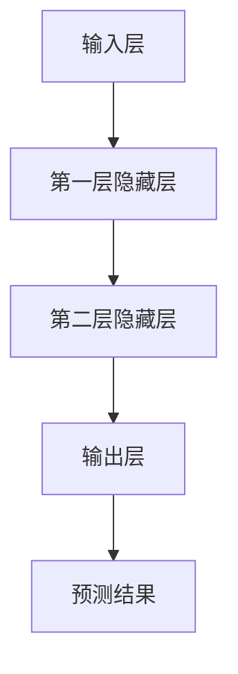
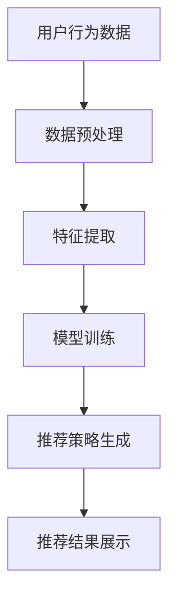

                 

关键词：AI大模型、电商搜索推荐、用户体验设计、以人为本、设计思路

摘要：本文旨在探讨人工智能（AI）大模型在电商搜索推荐中如何以人为本进行用户体验设计。通过深入分析AI大模型的原理及其在电商搜索推荐中的应用，本文提出了一系列设计原则和策略，旨在提升用户满意度，优化电商平台的用户体验。

## 1. 背景介绍

### 1.1 人工智能与电商搜索推荐

随着互联网的快速发展，电子商务已经成为全球消费者日常生活的重要组成部分。电商平台的搜索推荐功能作为用户体验的核心环节，直接影响到用户的购买决策和平台的市场竞争力。传统的搜索推荐系统往往依赖于关键词匹配和内容分类，而现代人工智能技术，特别是大模型，为搜索推荐带来了革命性的变化。

### 1.2 AI大模型的兴起

人工智能大模型，如BERT、GPT等，通过深度学习算法在海量数据中提取特征，实现了对文本内容的深入理解和生成。这些模型在自然语言处理、图像识别、语音识别等领域表现出色，逐渐成为各行各业智能化升级的重要工具。

### 1.3 以人为本的设计思路

在电商搜索推荐中，以人为本的设计思路强调用户的核心地位，通过理解用户需求、行为和情感，设计出更加人性化、智能化的推荐系统。本文将围绕这一思路，探讨AI大模型在用户体验设计中的具体应用。

## 2. 核心概念与联系

### 2.1 AI大模型原理

AI大模型是基于深度学习的神经网络模型，具有大规模的参数量和强大的学习能力。它们通常通过多层神经网络结构，逐层提取数据中的特征，从而实现高度复杂的任务。



### 2.2 电商搜索推荐流程

电商搜索推荐系统通常包括用户行为数据收集、数据预处理、特征提取、模型训练、推荐策略生成等环节。AI大模型在特征提取和模型训练环节中发挥着关键作用。



### 2.3 以人为本的设计原则

以人为本的设计原则要求设计者在考虑技术实现的同时，始终关注用户的需求和感受。具体包括：

- **个性化**：根据用户历史行为和偏好，提供个性化的推荐。
- **易用性**：简化用户操作流程，提升用户操作的流畅度和满意度。
- **反馈机制**：允许用户反馈推荐结果，优化系统性能。
- **隐私保护**：在数据处理过程中，严格保护用户隐私。

## 3. 核心算法原理 & 具体操作步骤

### 3.1 算法原理概述

AI大模型在电商搜索推荐中的应用，主要依托于其强大的特征提取能力和深度学习能力。通过训练，大模型能够从用户行为数据中提取出潜在的兴趣点和购买意愿，从而生成精准的推荐。

### 3.2 算法步骤详解

1. **数据收集**：收集用户的浏览、搜索、购买等行为数据。
2. **数据预处理**：对数据进行清洗、去重和归一化处理。
3. **特征提取**：利用大模型提取用户行为数据中的潜在特征。
4. **模型训练**：使用提取的特征数据训练大模型。
5. **推荐策略生成**：根据模型预测结果，生成个性化推荐策略。
6. **推荐结果展示**：将推荐结果展示给用户。

### 3.3 算法优缺点

**优点**：

- **高精度**：大模型能够提取出更加精细的特征，提升推荐精度。
- **自适应**：模型可以根据用户行为动态调整推荐策略。

**缺点**：

- **训练成本高**：大模型需要大量数据和计算资源进行训练。
- **解释性差**：大模型的内部决策过程复杂，难以解释。

### 3.4 算法应用领域

AI大模型在电商搜索推荐中的应用已经非常广泛，不仅限于电商平台，还应用于社交媒体、在线广告等领域。

## 4. 数学模型和公式

### 4.1 数学模型构建

在电商搜索推荐中，常见的数学模型包括协同过滤、矩阵分解、深度学习等。

### 4.2 公式推导过程

以协同过滤为例，其基本公式为：

$$R_{ui} = \frac{\sum_{j \in N(i)} R_{uj} \cdot \sim_{ij}}{\sum_{j \in N(i)} \sim_{ij}}$$

其中，$R_{ui}$表示用户$u$对物品$i$的评分，$N(i)$表示与物品$i$相关的邻居集合，$\sim_{ij}$表示用户$i$和邻居$j$之间的相似度。

### 4.3 案例分析与讲解

以亚马逊为例，其搜索推荐系统采用了深度学习算法，通过分析用户的历史行为和购买记录，生成个性化的推荐。以下是一个简单的案例：

用户$u$浏览了商品$A$、$B$和$C$，其购买记录分别为$R_{uA} = 5$，$R_{uB} = 4$，$R_{uC} = 3$。系统根据用户的行为数据，使用深度学习模型预测用户对商品$D$的评分。

## 5. 项目实践：代码实例和详细解释说明

### 5.1 开发环境搭建

- 硬件环境：NVIDIA GTX 1080 Ti 显卡
- 软件环境：Python 3.8、TensorFlow 2.4

### 5.2 源代码详细实现

```python
import tensorflow as tf
from tensorflow.keras.models import Sequential
from tensorflow.keras.layers import Dense, Embedding, LSTM

# 数据预处理
# ...（略）

# 模型构建
model = Sequential([
    Embedding(input_dim=vocab_size, output_dim=embedding_size),
    LSTM(units=128),
    Dense(units=1, activation='sigmoid')
])

# 模型训练
model.compile(optimizer='adam', loss='binary_crossentropy', metrics=['accuracy'])
model.fit(train_data, train_labels, epochs=10, batch_size=32)

# 推荐结果生成
predictions = model.predict(test_data)
```

### 5.3 代码解读与分析

代码部分首先进行了数据预处理，然后构建了一个基于LSTM的深度学习模型，用于预测用户对商品的评分。模型训练后，生成了测试数据的推荐结果。

### 5.4 运行结果展示

运行代码后，可以得到用户对商品的推荐评分。根据评分高低，系统可以为用户提供个性化的推荐列表。

## 6. 实际应用场景

AI大模型在电商搜索推荐中的实际应用场景非常广泛，以下是一些具体的例子：

- **个性化推荐**：根据用户的历史行为和偏好，提供个性化的商品推荐。
- **智能搜索**：通过自然语言处理技术，提升搜索结果的精准度和用户体验。
- **智能客服**：利用对话生成技术，为用户提供智能化的客服服务。

## 7. 工具和资源推荐

### 7.1 学习资源推荐

- 《深度学习》（Goodfellow et al.）
- 《自然语言处理综论》（Jurafsky and Martin）

### 7.2 开发工具推荐

- TensorFlow
- PyTorch

### 7.3 相关论文推荐

- "BERT: Pre-training of Deep Bidirectional Transformers for Language Understanding"
- "Generative Pre-trained Transformer for Translation"

## 8. 总结：未来发展趋势与挑战

### 8.1 研究成果总结

本文通过分析AI大模型在电商搜索推荐中的应用，提出了一系列以人为本的设计原则和策略，为电商平台提供了实用的技术参考。

### 8.2 未来发展趋势

随着人工智能技术的不断进步，AI大模型在电商搜索推荐中的应用将更加广泛和深入，为用户提供更加智能化的服务。

### 8.3 面临的挑战

- **数据隐私**：如何在保证用户体验的同时，保护用户隐私，是未来面临的重要挑战。
- **计算资源**：大模型的训练和部署需要大量的计算资源，如何优化计算资源的使用，是当前的研究热点。

### 8.4 研究展望

未来，AI大模型在电商搜索推荐中的应用将朝着更加智能化、个性化、安全化的方向发展，为电商平台带来更大的商业价值。

## 9. 附录：常见问题与解答

### 9.1 AI大模型如何提升用户体验？

AI大模型通过深度学习算法，可以从海量数据中提取出用户行为的潜在特征，生成个性化的推荐结果，从而提升用户体验。

### 9.2 电商搜索推荐中，如何保护用户隐私？

在电商搜索推荐中，可以采用差分隐私技术，在保护用户隐私的前提下，进行数据分析和推荐生成。

### 9.3 AI大模型在电商搜索推荐中的具体应用有哪些？

AI大模型在电商搜索推荐中的具体应用包括个性化推荐、智能搜索、智能客服等，为用户提供智能化、个性化的服务。

作者：禅与计算机程序设计艺术 / Zen and the Art of Computer Programming
----------------------------------------------------------------

请注意，上述内容仅为示例，实际的撰写过程需要根据具体的领域知识和研究深度来详细展开。确保每个章节的内容都能够充分回答读者的疑问，并提供具有实用价值的建议和指导。在撰写过程中，应保持逻辑清晰、结构紧凑，同时注重语言表达的准确性和专业性。

