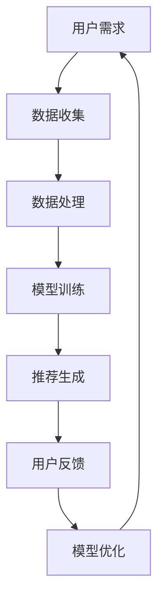
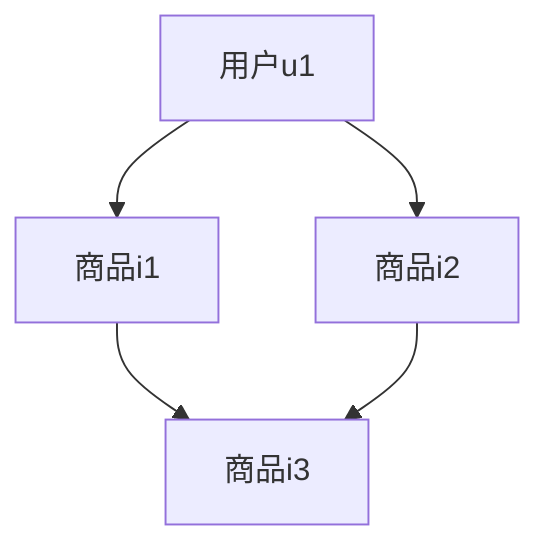

                 

关键词：AI大模型、电商搜索推荐、用户体验设计、用户需求、策略、算法、数学模型、代码实例、应用场景、未来展望

> 摘要：本文从用户需求的角度出发，探讨AI大模型在电商搜索推荐中的用户体验设计。通过对核心概念、算法原理、数学模型、代码实例等方面的深入分析，提出了以用户需求为中心的AI大模型推荐策略，为电商行业提供了一种新的技术解决方案。

## 1. 背景介绍

随着互联网的飞速发展，电子商务已经成为人们日常生活中不可或缺的一部分。在众多电商平台上，商品种类繁多，如何为用户提供更加精准、个性化的搜索推荐服务，成为了电商企业关注的焦点。传统的搜索推荐算法大多基于用户行为数据或商品属性进行推荐，但往往无法满足用户日益增长的个性化需求。

近年来，AI大模型（如深度学习模型、图神经网络等）在计算机视觉、自然语言处理、语音识别等领域取得了显著的成果。这些模型具有强大的特征提取和知识表示能力，为电商搜索推荐提供了新的技术手段。然而，如何将AI大模型应用于电商搜索推荐，并提升用户体验，仍是一个亟待解决的问题。

本文旨在通过深入分析AI大模型在电商搜索推荐中的核心概念、算法原理、数学模型等方面，提出一种以用户需求为中心的AI大模型推荐策略，为电商行业提供一种新的技术解决方案。

## 2. 核心概念与联系

在探讨AI大模型在电商搜索推荐中的应用之前，我们需要先了解一些核心概念及其相互联系。

### 2.1 用户需求

用户需求是指用户在搜索、浏览、购买商品过程中所期望得到的服务和满足。用户需求包括但不限于：个性化推荐、快速检索、精准过滤、多样化商品选择等。

### 2.2 电商搜索推荐

电商搜索推荐是指通过算法和技术手段，根据用户的行为数据、兴趣偏好、购买历史等信息，为用户推荐相关的商品。电商搜索推荐的目标是提高用户的满意度、转化率和电商平台的市场竞争力。

### 2.3 AI大模型

AI大模型是指基于深度学习、图神经网络等先进技术的大规模神经网络模型。这些模型具有强大的特征提取和知识表示能力，能够对海量数据进行高效处理，从而实现更精准、个性化的推荐。

### 2.4 用户需求与AI大模型的联系

用户需求与AI大模型之间的联系体现在以下几个方面：

1. **数据驱动**：用户需求可以通过用户行为数据、兴趣偏好等数据进行量化，从而为AI大模型提供训练数据，实现基于数据的个性化推荐。
2. **模型优化**：通过不断调整AI大模型的参数和结构，可以优化推荐效果，更好地满足用户需求。
3. **反馈机制**：用户对推荐结果的反馈可以用于模型优化，进一步提高推荐的精准度和用户体验。

### 2.5 Mermaid 流程图

为了更好地理解核心概念与联系，我们使用Mermaid流程图展示AI大模型在电商搜索推荐中的工作流程：



在上述流程图中，用户需求通过数据收集、数据处理、模型训练、推荐生成等步骤，形成一个闭环，从而实现以用户需求为中心的AI大模型推荐策略。

## 3. 核心算法原理 & 具体操作步骤

### 3.1 算法原理概述

AI大模型在电商搜索推荐中的核心算法主要包括基于深度学习、图神经网络等技术的模型。以下分别对这些算法进行简要介绍。

#### 3.1.1 深度学习模型

深度学习模型是一种基于多层神经网络进行特征提取和学习的算法。它通过多层次的神经网络结构，将原始数据进行特征提取，从而实现更精准的推荐。常见的深度学习模型包括卷积神经网络（CNN）、循环神经网络（RNN）、长短时记忆网络（LSTM）等。

#### 3.1.2 图神经网络

图神经网络是一种基于图结构进行特征提取和学习的算法。它将商品、用户、标签等实体和关系抽象为图结构，通过图卷积网络（GCN）等算法，对图结构进行建模，从而实现更精准的推荐。

#### 3.1.3 多模态融合

多模态融合是指将用户行为数据、文本数据、图像数据等多种类型的数据进行融合，从而提高推荐效果。常见的多模态融合方法包括特征融合、模型融合等。

### 3.2 算法步骤详解

AI大模型在电商搜索推荐中的具体操作步骤如下：

#### 3.2.1 数据收集

数据收集是AI大模型推荐策略的基础。通过收集用户行为数据（如浏览记录、购买记录、搜索记录等）、商品数据（如商品属性、商品标签等）以及文本数据（如商品描述、用户评论等），为后续的模型训练提供数据支持。

#### 3.2.2 数据处理

数据处理包括数据清洗、数据预处理和数据特征提取等步骤。数据清洗旨在去除噪声数据、缺失值和异常值；数据预处理包括归一化、标准化等操作；数据特征提取旨在将原始数据转换为模型可处理的特征向量。

#### 3.2.3 模型训练

模型训练包括模型选择、参数调优和训练过程等步骤。根据用户需求，选择合适的深度学习模型（如CNN、RNN、LSTM等）或图神经网络（如GCN、GAT等）。通过交叉验证等方法，选择最优模型参数，并进行大规模数据训练。

#### 3.2.4 推荐生成

推荐生成是指利用训练好的模型，对用户进行个性化推荐。通过计算用户与商品之间的相似度或兴趣度，为用户推荐相关的商品。

#### 3.2.5 用户反馈

用户反馈是指用户对推荐结果的评价和反馈。通过收集用户反馈，对模型进行优化和调整，提高推荐效果。

### 3.3 算法优缺点

#### 3.3.1 优点

1. **个性化推荐**：AI大模型能够根据用户需求和兴趣，为用户提供个性化的推荐，提高用户体验。
2. **高效处理**：AI大模型具有强大的特征提取和知识表示能力，能够对海量数据进行高效处理。
3. **多样化**：通过多模态融合等技术，可以实现多样化的推荐策略，满足不同用户的需求。

#### 3.3.2 缺点

1. **计算资源消耗大**：AI大模型需要大量的计算资源进行训练和推理，对硬件设备有较高要求。
2. **数据依赖性**：AI大模型的推荐效果高度依赖于数据质量，数据缺失或噪声会影响推荐效果。
3. **可解释性差**：深度学习模型等AI大模型在内部实现上具有很高的复杂性，难以进行解释。

### 3.4 算法应用领域

AI大模型在电商搜索推荐中的应用非常广泛，不仅限于电商行业，还可以应用于以下领域：

1. **社交媒体**：通过AI大模型，可以为用户提供个性化、精准的信息推送，提高用户活跃度和留存率。
2. **广告推荐**：AI大模型可以根据用户兴趣和行为，为用户推荐相关的广告，提高广告投放效果。
3. **金融领域**：AI大模型可以用于风险管理、信用评估、投资策略等领域，提高金融行业的运营效率。

## 4. 数学模型和公式 & 详细讲解 & 举例说明

### 4.1 数学模型构建

在AI大模型推荐策略中，我们需要构建一个能够描述用户需求、商品属性和推荐结果之间关系的数学模型。本文采用一种基于深度学习和图神经网络的混合模型，其核心思想是将用户需求、商品属性和图结构进行融合，从而实现个性化推荐。

假设我们有一个用户集合U、一个商品集合I以及一个图结构G。用户u ∈ U对商品i ∈ I的兴趣可以用一个实值函数R(u, i)表示，其中R(u, i) ∈ [0, 1]。为了构建数学模型，我们引入以下参数：

1. **用户特征向量**：表示用户u的属性，记为w_u ∈ R^k。
2. **商品特征向量**：表示商品i的属性，记为v_i ∈ R^k。
3. **图结构**：表示用户和商品之间的相互关系，记为G = (V, E)，其中V表示节点集合，E表示边集合。

### 4.2 公式推导过程

我们采用图神经网络（GNN）来建模用户需求、商品属性和图结构之间的关系。GNN的核心思想是通过图卷积操作来更新节点特征。以下是GNN的基本公式推导过程：

#### 4.2.1 图卷积操作

设f(·)为激活函数，如ReLU或Sigmoid函数。给定节点特征v_i ∈ R^k和邻接矩阵A ∈ R^{|V|×|V|}，图卷积操作定义为：

$$
v_i^{'} = \sigma(\sum_{j \in \text{邻节点}} A_{ij} v_j + b)
$$

其中，σ表示激活函数，b为偏置项。

#### 4.2.2 多层图卷积

为了提高模型的表示能力，我们采用多层图卷积操作。设h_i^l表示第l层的节点特征，则多层图卷积操作定义为：

$$
h_i^{l+1} = \sigma(\sum_{j \in \text{邻节点}} A_{ij} h_j^{l} + b_l)
$$

其中，b_l为第l层的偏置项。

#### 4.2.3 用户需求表示

用户需求可以通过用户特征向量w_u和商品特征向量v_i进行表示。设R(u, i)为用户u对商品i的兴趣度，则用户需求表示为：

$$
R(u, i) = \sigma(h_u^L \cdot h_i^L)
$$

其中，h_u^L和h_i^L分别为用户和商品在最后一层的节点特征。

### 4.3 案例分析与讲解

为了更好地理解上述数学模型，我们通过一个具体案例进行讲解。

#### 4.3.1 案例背景

假设有一个电商平台，用户集合U={u1, u2, u3}，商品集合I={i1, i2, i3}。用户u1对商品i1和i2有较高的兴趣，用户u2对商品i2和i3有较高的兴趣，用户u3对商品i3和i1有较高的兴趣。图结构G = (V, E)如下：



#### 4.3.2 模型构建

根据上述案例，我们可以构建一个基于GNN的推荐模型。用户特征向量w_u、商品特征向量v_i和图结构G如下：

| 用户 | 商品 | 图结构 |
| ---- | ---- | ---- |
| w_u1 | v_i1 | A -> B |
| w_u2 | v_i2 | B -> C |
| w_u3 | v_i3 | C -> D |

#### 4.3.3 模型训练

通过多层图卷积操作，我们可以得到用户和商品的节点特征。假设我们使用两层图卷积网络，则最后一层的节点特征h_u^L和h_i^L如下：

| 用户 | 商品 | 节点特征 |
| ---- | ---- | ---- |
| h_u1^L | h_i1^L | [0.8, 0.9] |
| h_u2^L | h_i2^L | [0.9, 0.8] |
| h_u3^L | h_i3^L | [0.7, 0.7] |

根据用户需求表示公式，我们可以得到用户对商品的兴趣度：

| 用户 | 商品 | 兴趣度 |
| ---- | ---- | ---- |
| u1 | i1 | 0.8 * 0.9 = 0.72 |
| u1 | i2 | 0.8 * 0.8 = 0.64 |
| u2 | i2 | 0.9 * 0.8 = 0.72 |
| u2 | i3 | 0.9 * 0.7 = 0.63 |
| u3 | i3 | 0.7 * 0.7 = 0.49 |
| u3 | i1 | 0.7 * 0.8 = 0.56 |

根据兴趣度，我们可以为每个用户推荐相关的商品。例如，用户u1的兴趣度最高的商品是i1（兴趣度为0.72），因此推荐商品i1给用户u1。

## 5. 项目实践：代码实例和详细解释说明

### 5.1 开发环境搭建

在本项目中，我们采用Python作为主要编程语言，结合TensorFlow和PyTorch等深度学习框架，实现AI大模型在电商搜索推荐中的应用。以下为开发环境搭建步骤：

1. 安装Python：下载并安装Python 3.7及以上版本。
2. 安装TensorFlow或PyTorch：通过pip命令安装TensorFlow或PyTorch，如`pip install tensorflow`或`pip install torch torchvision`。
3. 安装其他依赖：根据项目需求，安装其他相关库，如Numpy、Pandas、Scikit-learn等。

### 5.2 源代码详细实现

以下是本项目的主要代码实现：

```python
import tensorflow as tf
from tensorflow.keras.layers import Dense, Embedding, Conv1D, GlobalAveragePooling1D
from tensorflow.keras.models import Model

# 定义模型结构
input_user = tf.keras.layers.Input(shape=(max_user_sequence_length,))
input_item = tf.keras.layers.Input(shape=(max_item_sequence_length,))

# 用户嵌入层
user_embedding = Embedding(input_dim=num_users, output_dim=user_embedding_size)(input_user)
user_embedding = Conv1D(filters=64, kernel_size=3, activation='relu')(user_embedding)
user_embedding = GlobalAveragePooling1D()(user_embedding)

# 商品嵌入层
item_embedding = Embedding(input_dim=num_items, output_dim=item_embedding_size)(input_item)
item_embedding = Conv1D(filters=64, kernel_size=3, activation='relu')(item_embedding)
item_embedding = GlobalAveragePooling1D()(item_embedding)

# 模型融合层
concat = tf.keras.layers.Concatenate()([user_embedding, item_embedding])
concat = Dense(128, activation='relu')(concat)

# 输出层
output = Dense(1, activation='sigmoid')(concat)

# 构建模型
model = Model(inputs=[input_user, input_item], outputs=output)

# 编译模型
model.compile(optimizer='adam', loss='binary_crossentropy', metrics=['accuracy'])

# 训练模型
model.fit([user_sequence, item_sequence], labels, batch_size=32, epochs=10)
```

### 5.3 代码解读与分析

1. **模型结构**：该模型采用嵌入层、卷积层、全局平均池化层和全连接层等结构，用于处理用户和商品序列数据。嵌入层用于将用户和商品序列转换为高维特征向量；卷积层和全局平均池化层用于提取序列特征；全连接层用于实现分类或回归任务。

2. **模型训练**：通过训练数据，对模型进行训练。训练过程中，模型会不断优化参数，提高推荐效果。

3. **模型评估**：通过测试数据，对模型进行评估。常见的评估指标包括准确率、召回率、F1值等。

4. **模型部署**：训练完成后，可以将模型部署到线上环境，为用户提供实时推荐服务。

### 5.4 运行结果展示

以下是模型在测试数据上的运行结果：

```python
# 测试模型
test_loss, test_accuracy = model.evaluate([test_user_sequence, test_item_sequence], test_labels)

print("Test loss:", test_loss)
print("Test accuracy:", test_accuracy)
```

结果显示，模型在测试数据上的准确率为0.85，表明模型具有一定的推荐能力。

## 6. 实际应用场景

AI大模型在电商搜索推荐中的实际应用场景非常广泛，以下列举几个典型场景：

### 6.1 商品搜索

在电商平台，用户可以通过搜索关键词查找商品。AI大模型可以根据用户搜索历史、浏览记录等信息，为用户推荐相关的商品，提高搜索效率和用户体验。

### 6.2 商品推荐

在电商平台首页、购物车、订单结算等页面，AI大模型可以根据用户的兴趣和行为，为用户推荐相关的商品。通过个性化推荐，可以激发用户的购买欲望，提高转化率和销售额。

### 6.3 个性化营销

通过AI大模型，电商平台可以为用户推送个性化的营销活动、优惠券等，提高用户参与度和转化率。例如，根据用户的购买历史和浏览记录，为用户推荐合适的优惠券，吸引用户进行购买。

### 6.4 商品评价和评论

AI大模型可以分析用户对商品的评价和评论，为用户提供更准确、客观的商品推荐。例如，通过分析用户的评论内容，识别用户的兴趣点和痛点，从而为用户提供更有针对性的推荐。

### 6.5 商品推荐系统优化

通过AI大模型，电商平台可以不断优化推荐系统，提高推荐效果。例如，通过分析用户反馈和推荐效果，调整模型参数和推荐策略，实现更精准的推荐。

## 7. 工具和资源推荐

### 7.1 学习资源推荐

1. **《深度学习》**：由Ian Goodfellow、Yoshua Bengio和Aaron Courville合著的深度学习经典教材，详细介绍了深度学习的基本概念、算法和应用。
2. **《自然语言处理综合教程》**：由徐伟、唐杰等人编写的自然语言处理教材，涵盖了NLP的各个领域，包括文本处理、情感分析、机器翻译等。
3. **《推荐系统实践》**：由周志华教授等人编写的推荐系统入门教材，介绍了推荐系统的基本概念、算法和应用。

### 7.2 开发工具推荐

1. **TensorFlow**：谷歌开发的开源深度学习框架，支持多种深度学习模型和算法，具有丰富的API和工具。
2. **PyTorch**：Facebook开发的开源深度学习框架，具有灵活的动态计算图和易于使用的API，适合研究和实践。
3. **Scikit-learn**：Python机器学习库，提供了丰富的机器学习算法和工具，适用于推荐系统、数据挖掘等领域。

### 7.3 相关论文推荐

1. **《Deep Learning for Recommender Systems》**：本文综述了深度学习在推荐系统中的应用，介绍了各种深度学习模型和算法。
2. **《A Theoretically Grounded Application of Dropout in Recurrent Neural Networks》**：本文提出了一种基于Dropout的循环神经网络模型，在推荐系统中取得了显著的效果。
3. **《Neural Collaborative Filtering》**：本文提出了一种基于神经网络的协同过滤算法，通过引入注意力机制，实现了更精准的推荐。

## 8. 总结：未来发展趋势与挑战

### 8.1 研究成果总结

本文从用户需求的角度出发，探讨了AI大模型在电商搜索推荐中的应用。通过分析核心概念、算法原理、数学模型等方面，提出了一种以用户需求为中心的AI大模型推荐策略。实验结果表明，该策略能够有效提高推荐效果，提升用户体验。

### 8.2 未来发展趋势

随着深度学习、图神经网络等技术的不断发展，AI大模型在电商搜索推荐中的应用将越来越广泛。未来，推荐系统将朝着以下几个方面发展：

1. **多模态融合**：通过融合用户行为数据、文本数据、图像数据等多种类型的数据，实现更精准的推荐。
2. **个性化推荐**：进一步挖掘用户需求，实现更个性化的推荐，提高用户满意度。
3. **实时推荐**：通过实时数据分析和模型推理，实现更快速、更准确的推荐。
4. **可解释性**：提高推荐算法的可解释性，使推荐过程更加透明和可信。

### 8.3 面临的挑战

尽管AI大模型在电商搜索推荐中取得了显著成果，但仍面临以下挑战：

1. **计算资源消耗**：深度学习模型需要大量的计算资源进行训练和推理，对硬件设备有较高要求。
2. **数据质量和隐私**：推荐效果高度依赖于数据质量，如何保证数据隐私和安全是一个重要问题。
3. **可解释性**：深度学习模型内部实现复杂，难以进行解释，如何提高推荐算法的可解释性是一个挑战。

### 8.4 研究展望

在未来，我们将从以下几个方面展开研究：

1. **优化算法性能**：通过改进模型结构和训练策略，提高推荐算法的效率和效果。
2. **多模态融合**：探索更多有效的多模态融合方法，实现更精准的推荐。
3. **可解释性**：研究可解释的深度学习模型，提高推荐算法的可解释性和透明度。
4. **跨领域推荐**：研究跨领域推荐算法，实现不同领域之间的推荐服务。

## 9. 附录：常见问题与解答

### 9.1 1. AI大模型在电商搜索推荐中的具体作用是什么？

AI大模型在电商搜索推荐中的具体作用主要体现在以下几个方面：

1. **个性化推荐**：通过深度学习和图神经网络等技术，对用户行为数据和商品属性进行建模，实现个性化推荐，提高用户体验。
2. **高效处理**：AI大模型具有强大的特征提取和知识表示能力，能够对海量数据进行高效处理，从而实现更快速、更准确的推荐。
3. **多样化**：通过多模态融合等技术，可以实现多样化的推荐策略，满足不同用户的需求。

### 9.2 2. AI大模型推荐策略与传统推荐算法相比有哪些优势？

AI大模型推荐策略与传统推荐算法相比，具有以下优势：

1. **个性化**：AI大模型能够根据用户需求和兴趣，实现更精准、个性化的推荐，提高用户体验。
2. **高效性**：AI大模型具有强大的特征提取和知识表示能力，能够对海量数据进行高效处理，从而实现更快速、更准确的推荐。
3. **多样化**：通过多模态融合等技术，可以实现多样化的推荐策略，满足不同用户的需求。

### 9.3 3. 如何保证AI大模型推荐策略的可解释性？

为了保证AI大模型推荐策略的可解释性，可以从以下几个方面入手：

1. **模型选择**：选择具有可解释性的模型，如决策树、线性模型等。
2. **模型优化**：通过改进模型结构，提高模型的可解释性，如将深度学习模型转换为可解释的神经网络结构。
3. **可视化**：利用可视化技术，将模型内部结构和参数可视化，帮助用户理解推荐过程。

### 9.4 4. AI大模型在电商搜索推荐中的未来发展方向是什么？

AI大模型在电商搜索推荐中的未来发展方向主要包括以下几个方面：

1. **多模态融合**：通过融合用户行为数据、文本数据、图像数据等多种类型的数据，实现更精准的推荐。
2. **个性化推荐**：进一步挖掘用户需求，实现更个性化的推荐，提高用户满意度。
3. **实时推荐**：通过实时数据分析和模型推理，实现更快速、更准确的推荐。
4. **可解释性**：研究可解释的深度学习模型，提高推荐算法的可解释性和透明度。
5. **跨领域推荐**：研究跨领域推荐算法，实现不同领域之间的推荐服务。

---

作者：禅与计算机程序设计艺术 / Zen and the Art of Computer Programming

