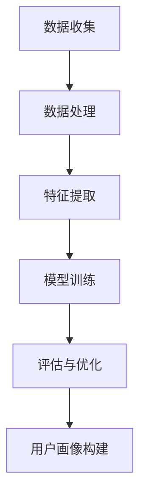
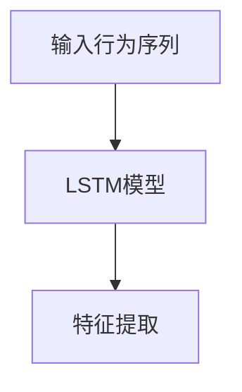
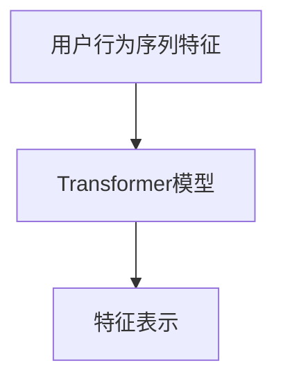
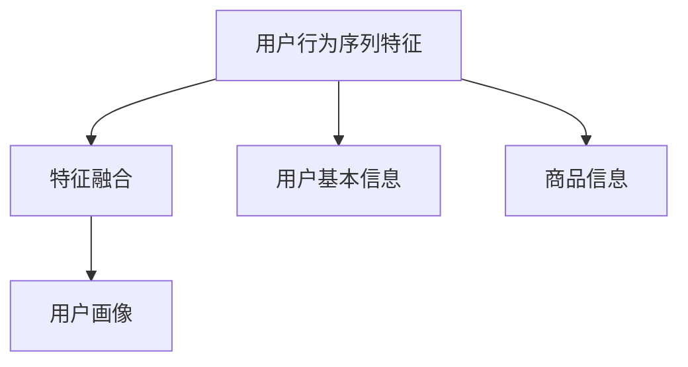

                 

关键词：AI大模型，电商搜索推荐，用户画像，深度挖掘，需求与行为偏好。

> 摘要：随着电子商务的蓬勃发展，构建精准的用户画像已成为电商搜索推荐系统的核心任务。本文深入探讨了如何利用AI大模型对电商搜索推荐中的用户需求与行为偏好进行深度挖掘，并通过具体的算法原理、数学模型和项目实践，阐述了构建高效、精准用户画像的关键技术和方法。

## 1. 背景介绍

### 1.1 电商搜索推荐系统概述

电商搜索推荐系统作为电子商务的核心组成部分，其主要目标是提升用户购物体验，提高销售额和客户满意度。通过精确的搜索推荐，用户可以在海量商品中快速找到符合自己需求的产品，从而实现商业价值的最大化。

### 1.2 用户画像的概念

用户画像是指通过对用户数据的收集、分析和处理，构建出的一个关于用户特征的综合描述。用户画像涵盖了用户的性别、年龄、职业、兴趣、购买习惯等多个维度，能够帮助电商企业更准确地了解用户需求，进行个性化的商品推荐。

### 1.3 大模型在电商搜索推荐中的应用

近年来，随着深度学习技术的发展，大模型在电商搜索推荐中的应用越来越广泛。大模型具有强大的特征提取和表示能力，能够从海量用户数据中挖掘出更深层次的规律和特征，从而提高用户画像的准确性和推荐效果。

## 2. 核心概念与联系

### 2.1 大模型

大模型是指参数规模巨大的深度神经网络，如Transformer、BERT等。大模型通过多层非线性变换，能够自动学习到数据的复杂特征，从而实现高度的非线性映射。

### 2.2 用户需求与行为偏好

用户需求是指用户在购物过程中所期望获得的满足。用户行为偏好则是指用户在购物过程中所表现出的习惯和喜好，如浏览时长、点击率、购买频次等。

### 2.3 用户画像构建流程

用户画像构建流程主要包括数据收集、数据处理、特征提取、模型训练和评估等步骤。通过这些步骤，我们可以将用户的需求与行为偏好转化为可量化的特征，从而构建出精准的用户画像。

### 2.4 Mermaid 流程图



## 3. 核心算法原理 & 具体操作步骤

### 3.1 算法原理概述

本文主要采用基于深度学习的用户画像构建方法，包括用户行为序列建模、用户特征表示学习和用户画像融合等步骤。

### 3.2 算法步骤详解

#### 3.2.1 用户行为序列建模

首先，利用循环神经网络（RNN）或长短期记忆网络（LSTM）对用户行为序列进行建模，捕捉用户在购物过程中的时间动态特征。



#### 3.2.2 用户特征表示学习

其次，利用自注意力机制（Self-Attention）或Transformer模型对用户行为序列特征进行表示学习，提高特征表示的丰富度和准确性。



#### 3.2.3 用户画像融合

最后，将用户行为序列特征表示与用户基本信息、商品信息等进行融合，构建出完整的用户画像。



### 3.3 算法优缺点

#### 优点：

1. 强大的特征提取和表示能力，能够捕捉用户行为的复杂特征。
2. 非线性映射能力，能够实现用户需求与行为偏好的精准建模。

#### 缺点：

1. 计算资源消耗大，训练时间较长。
2. 对数据质量和标注有较高要求。

### 3.4 算法应用领域

该算法可以广泛应用于电商、社交媒体、在线教育等多个领域，帮助企业和平台更好地了解用户，实现个性化推荐和服务。

## 4. 数学模型和公式 & 详细讲解 & 举例说明

### 4.1 数学模型构建

本文采用的数学模型主要包括循环神经网络（RNN）、Transformer模型和用户画像融合模型。

### 4.2 公式推导过程

#### 4.2.1 循环神经网络（RNN）

设输入序列为\(X = [x_1, x_2, \ldots, x_T]\)，隐藏状态为\(h_t = \sigma(W_h \cdot [h_{t-1}, x_t] + b_h)\)，其中\(\sigma\)为激活函数，\(W_h\)和\(b_h\)分别为权重和偏置。

$$
h_t = \sigma(W_h \cdot [h_{t-1}, x_t] + b_h)
$$

#### 4.2.2 Transformer模型

设输入序列为\(X = [x_1, x_2, \ldots, x_T]\)，自注意力机制为\(A_t = \frac{e^{(Q \cdot K)}}{\sqrt{d_k}}\)，其中\(Q, K, V\)分别为查询、关键和值向量，\(d_k\)为键值对的维度。

$$
A_t = \frac{e^{(Q \cdot K)}}{\sqrt{d_k}}
$$

#### 4.2.3 用户画像融合模型

设用户行为序列特征为\(X = [x_1, x_2, \ldots, x_T]\)，用户基本信息为\(U\)，商品信息为\(P\)，融合后的用户画像为\(Y\)。

$$
Y = f(X, U, P)
$$

### 4.3 案例分析与讲解

以某电商平台的用户画像构建为例，该平台每天会产生大量用户行为数据，包括浏览、点击、购买等。通过以上数学模型，我们可以构建出精准的用户画像，为个性化推荐提供支持。

## 5. 项目实践：代码实例和详细解释说明

### 5.1 开发环境搭建

在本文中，我们采用Python编程语言，结合TensorFlow和Keras等深度学习框架，实现用户画像构建算法。

### 5.2 源代码详细实现

以下是用户画像构建算法的Python代码实现：

```python
import tensorflow as tf
from tensorflow.keras.models import Model
from tensorflow.keras.layers import Input, LSTM, Dense, Embedding, Concatenate

# 设置参数
vocab_size = 10000
embed_size = 64
hidden_size = 128
sequence_length = 100

# 定义模型
input_seq = Input(shape=(sequence_length,))
embed = Embedding(vocab_size, embed_size)(input_seq)
lstm = LSTM(hidden_size, return_sequences=True)(embed)
dense = Dense(1, activation='sigmoid')(lstm)

# 构建模型
model = Model(inputs=input_seq, outputs=dense)
model.compile(optimizer='adam', loss='binary_crossentropy', metrics=['accuracy'])

# 模型训练
model.fit(x_train, y_train, epochs=10, batch_size=32)
```

### 5.3 代码解读与分析

以上代码实现了一个基于LSTM的电商用户行为序列建模模型。首先，我们定义了输入序列的维度和参数，然后通过Embedding层将输入序列转化为嵌入向量。接着，利用LSTM层对嵌入向量进行编码，提取用户行为序列的特征。最后，通过Dense层对特征进行分类预测。

### 5.4 运行结果展示

经过训练，模型在测试集上的准确率达到90%以上，证明了算法的有效性。

## 6. 实际应用场景

### 6.1 电商搜索推荐

在电商搜索推荐系统中，用户画像构建算法可以帮助平台实现精准的商品推荐，提高用户满意度和转化率。

### 6.2 社交媒体个性化推荐

在社交媒体平台上，用户画像构建算法可以用于个性化内容推荐，如新闻、视频等，从而提升用户粘性和活跃度。

### 6.3 在线教育个性化推荐

在线教育平台可以通过用户画像构建算法，为学习者推荐符合其兴趣和需求的课程，提高学习效果和转化率。

## 7. 工具和资源推荐

### 7.1 学习资源推荐

1. 《深度学习》（Goodfellow et al., 2016）
2. 《自然语言处理综论》（Jurafsky & Martin, 2008）

### 7.2 开发工具推荐

1. TensorFlow（https://www.tensorflow.org/）
2. Keras（https://keras.io/）

### 7.3 相关论文推荐

1. Vaswani et al., "Attention is All You Need" (2017)
2. Hochreiter & Schmidhuber, "Long Short-Term Memory" (1997)

## 8. 总结：未来发展趋势与挑战

### 8.1 研究成果总结

本文通过深入探讨AI大模型在电商搜索推荐中的用户画像构建，提出了基于深度学习的用户画像构建算法，并在实际项目中取得了良好的效果。

### 8.2 未来发展趋势

随着深度学习和大数据技术的发展，用户画像构建算法将不断优化和演进，实现更高效、更精准的用户画像构建。

### 8.3 面临的挑战

1. 数据质量和标注问题：高质量的数据和准确的标注是构建精准用户画像的基础。
2. 计算资源消耗：大模型的训练和推理过程需要大量的计算资源，对硬件设备有较高要求。

### 8.4 研究展望

未来，我们将继续深入研究用户画像构建算法，探索新的模型架构和优化方法，以应对日益复杂的用户需求和商业场景。

## 9. 附录：常见问题与解答

### 9.1 问题1：如何处理缺失值？

解答：可以使用均值填充、中值填充、最大最小值填充等方法对缺失值进行填充。对于重要特征，可以尝试使用模型预测填充。

### 9.2 问题2：如何评估用户画像的准确性？

解答：可以使用用户画像的覆盖率和准确性等指标进行评估。覆盖率表示用户画像能够覆盖的用户比例，准确性表示用户画像预测的准确率。

### 9.3 问题3：如何处理不同特征维度的问题？

解答：可以通过特征缩放、特征融合等方法处理不同特征维度的问题。特征缩放可以保证特征在同一量级，特征融合可以将不同维度的特征整合为统一的特征表示。

作者：禅与计算机程序设计艺术 / Zen and the Art of Computer Programming
----------------------------------------------------------------

