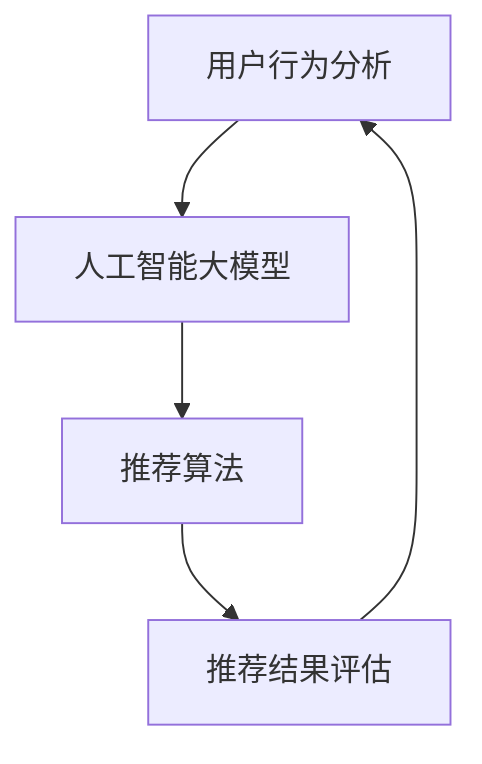

                 

关键词：AI 大模型、用户行为分析、电商搜索推荐、需求理解、购买偏好、机器学习

## 摘要

本文旨在探讨如何利用人工智能大模型对电商搜索推荐系统中的用户行为进行分析，从而更好地理解用户的需求和购买偏好。通过介绍相关核心概念和算法原理，本文将展示如何构建数学模型和实现具体操作步骤。同时，本文还将通过项目实践和实际应用场景分析，探讨该技术在电商行业中的广泛应用和未来发展趋势。

## 1. 背景介绍

### 1.1 电商搜索推荐系统的现状

随着互联网和移动互联网的快速发展，电商行业已经成为全球经济增长的重要驱动力。在电商市场中，搜索推荐系统扮演着至关重要的角色。它能够帮助用户快速找到所需商品，提高购物体验，同时也能够为商家带来更多的销售机会。

然而，传统的搜索推荐系统往往依赖于关键词匹配和基于内容的推荐算法，这些算法在处理用户个性化需求方面存在一定的局限性。随着人工智能技术的进步，特别是大模型（如深度学习、图神经网络等）的应用，为电商搜索推荐系统提供了新的解决方案。

### 1.2 人工智能大模型的优势

人工智能大模型具有以下优势：

1. **强大的学习能力**：大模型能够从海量数据中自动学习，提取出用户行为的潜在规律。
2. **高度的自适应性**：大模型可以根据用户的历史行为和实时反馈，动态调整推荐策略，提高推荐准确性。
3. **丰富的特征表示**：大模型能够将用户行为转化为高维特征向量，从而实现更精细的用户画像。

### 1.3 本文的目的

本文的主要目的是探讨如何利用人工智能大模型对电商搜索推荐系统中的用户行为进行分析，从而更好地理解用户的需求和购买偏好。具体来说，本文将：

1. 介绍相关核心概念和算法原理。
2. 展示如何构建数学模型和实现具体操作步骤。
3. 通过项目实践和实际应用场景分析，探讨该技术在电商行业中的广泛应用和未来发展趋势。

## 2. 核心概念与联系

### 2.1 用户行为分析

用户行为分析是指通过对用户在电商平台上的一系列操作（如搜索、点击、购买等）进行数据收集和分析，以理解用户的需求和购买偏好。用户行为数据包括：

1. **用户基本信息**：如年龄、性别、地理位置等。
2. **用户操作记录**：如搜索关键词、浏览商品、点击广告、购买商品等。
3. **用户评价和反馈**：如评价、评分、投诉等。

### 2.2 人工智能大模型

人工智能大模型是指通过深度学习、图神经网络等算法，对海量数据进行训练，从而构建出一个具有高度智能的模型。大模型能够自动学习用户行为的复杂模式，提取出有用的特征表示，从而实现高效的用户行为分析和推荐。

### 2.3 电商搜索推荐系统

电商搜索推荐系统是指通过分析用户行为数据，为用户提供个性化商品推荐的一种系统。该系统通常包括以下几个关键组件：

1. **用户画像**：通过分析用户的基本信息和操作记录，构建出用户的行为特征和兴趣偏好。
2. **推荐算法**：根据用户画像和商品属性，为用户推荐感兴趣的商品。
3. **推荐结果评估**：通过用户的行为反馈，评估推荐效果，并不断优化推荐策略。

### 2.4 Mermaid 流程图

下面是一个简化的 Mermaid 流程图，展示了用户行为分析、人工智能大模型和电商搜索推荐系统之间的联系。



## 3. 核心算法原理 & 具体操作步骤

### 3.1 算法原理概述

本文所采用的核心算法是基于深度学习和图神经网络的用户行为分析模型。该模型的主要思想是将用户行为转化为高维特征向量，并通过图神经网络进行特征融合和关系建模，从而实现用户行为的自动学习和预测。

### 3.2 算法步骤详解

1. **数据收集与预处理**：收集用户在电商平台上的操作记录，包括搜索关键词、浏览商品、点击广告、购买商品等。对数据进行清洗和预处理，如去除缺失值、异常值，并进行归一化处理。
2. **构建用户行为序列**：将用户操作记录转化为时间序列数据，以便后续的模型训练和预测。
3. **特征提取与融合**：利用深度学习算法，如循环神经网络（RNN）或长短时记忆网络（LSTM），对用户行为序列进行特征提取和融合，生成高维特征向量。
4. **图神经网络建模**：利用图神经网络（GNN），如图卷积网络（GCN）或图注意力网络（GAT），对用户行为特征进行关系建模，从而学习用户行为的潜在模式。
5. **预测与评估**：根据训练好的模型，对用户未来的行为进行预测，并通过评估指标（如准确率、召回率等）评估模型性能。

### 3.3 算法优缺点

**优点**：

1. **强大的学习能力**：深度学习和图神经网络能够自动学习用户行为的复杂模式，提取出有用的特征表示。
2. **高度的自适应性**：模型可以根据用户的历史行为和实时反馈，动态调整推荐策略，提高推荐准确性。
3. **丰富的特征表示**：大模型能够将用户行为转化为高维特征向量，从而实现更精细的用户画像。

**缺点**：

1. **计算资源消耗大**：深度学习和图神经网络的模型通常需要大量的计算资源和存储空间。
2. **训练时间较长**：大规模模型的训练时间较长，可能需要数天甚至数周的时间。
3. **数据依赖性高**：模型的性能高度依赖于数据的质量和多样性，如果数据不够丰富或存在偏差，可能导致模型性能下降。

### 3.4 算法应用领域

深度学习和图神经网络在用户行为分析领域具有广泛的应用，如：

1. **电商搜索推荐**：通过分析用户的历史行为，为用户提供个性化的商品推荐。
2. **广告投放**：根据用户的行为特征，为用户推荐感兴趣的广告。
3. **社交网络分析**：通过分析用户在社交网络上的互动行为，挖掘潜在的兴趣社区和影响力人物。
4. **智能客服**：根据用户的行为和反馈，为用户提供智能化的客服服务。

## 4. 数学模型和公式

### 4.1 数学模型构建

用户行为分析模型主要包括以下几个部分：

1. **用户行为序列表示**：将用户操作记录转化为时间序列数据，用向量表示。
2. **特征提取与融合**：利用深度学习算法，对用户行为序列进行特征提取和融合，生成高维特征向量。
3. **图神经网络建模**：利用图神经网络（GNN），对用户行为特征进行关系建模。

### 4.2 公式推导过程

#### 用户行为序列表示

假设用户 \( u \) 的行为序列为 \( \mathbf{X} = [x_1, x_2, ..., x_T] \)，其中 \( x_t \) 表示用户在时间 \( t \) 的操作记录。为了便于计算，我们可以将 \( \mathbf{X} \) 展化为矩阵形式：

$$
\mathbf{X} = \begin{bmatrix}
x_1 \\
x_2 \\
\vdots \\
x_T
\end{bmatrix}
$$

#### 特征提取与融合

利用深度学习算法，如循环神经网络（RNN）或长短时记忆网络（LSTM），对用户行为序列进行特征提取和融合。假设 \( \mathbf{h_t} \) 为第 \( t \) 个时间步的特征向量，则有：

$$
\mathbf{h_t} = \text{LSTM}(\mathbf{x_t})
$$

其中，LSTM 表示长短时记忆网络。

#### 图神经网络建模

利用图神经网络（GNN），如图卷积网络（GCN）或图注意力网络（GAT），对用户行为特征进行关系建模。假设用户 \( u \) 的邻域节点集合为 \( \mathcal{N}(u) \)，则用户 \( u \) 的特征表示为：

$$
\mathbf{h}_u = \text{GNN}(\mathbf{h}_{u}^0, \mathbf{h}_{\mathcal{N}(u)}^0)
$$

其中，\( \mathbf{h}_{u}^0 \) 表示初始特征向量，\( \mathbf{h}_{\mathcal{N}(u)}^0 \) 表示邻域节点的特征向量。

#### 预测与评估

根据训练好的模型，对用户未来的行为进行预测。假设预测结果为 \( \mathbf{y} = [y_1, y_2, ..., y_T] \)，则有：

$$
\mathbf{y} = \text{Predict}(\mathbf{h}_u)
$$

其中，Predict 表示预测函数。

### 4.3 案例分析与讲解

假设我们有一个电商平台的用户行为数据集，包含 1000 个用户和 10 万条操作记录。我们希望利用深度学习和图神经网络对用户行为进行分析，从而为用户提供个性化的商品推荐。

#### 数据收集与预处理

我们首先收集用户在电商平台上的操作记录，包括搜索关键词、浏览商品、点击广告、购买商品等。对数据进行清洗和预处理，如去除缺失值、异常值，并进行归一化处理。

#### 构建用户行为序列

将用户操作记录转化为时间序列数据。例如，对于用户 \( u \) 的行为序列 \( \mathbf{X} = [x_1, x_2, ..., x_T] \)，我们可以将其表示为：

$$
\mathbf{X} = \begin{bmatrix}
[x_1, 0, ..., 0] \\
[x_2, 0, ..., 0] \\
\vdots \\
[x_T, 0, ..., 0]
\end{bmatrix}
$$

其中，\( x_t \) 表示用户在时间 \( t \) 的操作记录，0 表示其他时间步的操作记录。

#### 特征提取与融合

利用长短时记忆网络（LSTM）对用户行为序列进行特征提取和融合。假设训练好的 LSTM 模型输出特征向量为 \( \mathbf{h_t} \)，则有：

$$
\mathbf{h_t} = \text{LSTM}(\mathbf{x_t})
$$

#### 图神经网络建模

利用图卷积网络（GCN）对用户行为特征进行关系建模。假设用户 \( u \) 的邻域节点集合为 \( \mathcal{N}(u) \)，则有：

$$
\mathbf{h}_u = \text{GCN}(\mathbf{h}_{u}^0, \mathbf{h}_{\mathcal{N}(u)}^0)
$$

其中，\( \mathbf{h}_{u}^0 \) 表示初始特征向量，\( \mathbf{h}_{\mathcal{N}(u)}^0 \) 表示邻域节点的特征向量。

#### 预测与评估

根据训练好的模型，对用户未来的行为进行预测。假设预测结果为 \( \mathbf{y} = [y_1, y_2, ..., y_T] \)，则有：

$$
\mathbf{y} = \text{Predict}(\mathbf{h}_u)
$$

其中，Predict 表示预测函数。

#### 评估指标

为了评估模型的性能，我们可以使用以下评估指标：

1. **准确率（Accuracy）**：预测正确的样本数占总样本数的比例。
2. **召回率（Recall）**：预测正确的样本数占实际正样本数的比例。
3. **精确率（Precision）**：预测正确的样本数占预测为正样本的样本数的比例。
4. **F1 分数（F1-Score）**：精确率和召回率的调和平均值。

## 5. 项目实践：代码实例和详细解释说明

### 5.1 开发环境搭建

在开始编写代码之前，我们需要搭建一个适合深度学习和图神经网络开发的编程环境。以下是推荐的工具和库：

1. **Python**：一种广泛使用的编程语言，具有丰富的机器学习和深度学习库。
2. **PyTorch**：一个流行的深度学习框架，支持自动微分和动态图计算。
3. **PyG**：一个专门为图神经网络设计的库，提供了丰富的图神经网络模型和工具。

安装以上库的命令如下：

```python
pip install torch torchvision pytorch-geometric
```

### 5.2 源代码详细实现

下面是一个基于 PyTorch 和 PyG 的用户行为分析模型实现示例：

```python
import torch
import torch.nn as nn
import torch.optim as optim
from torch_geometric.nn import GCNConv
from torch_geometric.data import Data
from sklearn.model_selection import train_test_split
from sklearn.metrics import accuracy_score, recall_score, precision_score, f1_score

# 数据预处理
def preprocess_data(data):
    # ...进行数据清洗和预处理...
    return data

# 构建图数据
def build_graph(data):
    # ...构建用户行为序列和邻域节点信息...
    return graph

# 构建模型
class UserBehaviorModel(nn.Module):
    def __init__(self, num_features, hidden_size):
        super(UserBehaviorModel, self).__init__()
        self.conv1 = GCNConv(num_features, hidden_size)
        self.conv2 = GCNConv(hidden_size, hidden_size)

    def forward(self, data):
        x, edge_index = data.x, data.edge_index
        x = self.conv1(x, edge_index)
        x = torch.relu(x)
        x = F.dropout(x, p=0.5, training=self.training)
        x = self.conv2(x, edge_index)
        return x

# 训练模型
def train_model(model, data, labels, optimizer, criterion, num_epochs):
    model.train()
    for epoch in range(num_epochs):
        optimizer.zero_grad()
        outputs = model(data)
        loss = criterion(outputs, labels)
        loss.backward()
        optimizer.step()
        if (epoch + 1) % 100 == 0:
            print(f'Epoch [{epoch + 1}/{num_epochs}], Loss: {loss.item()}')

# 预测和评估
def predict(model, data):
    model.eval()
    with torch.no_grad():
        outputs = model(data)
    return outputs.argmax(dim=1)

# 主程序
if __name__ == '__main__':
    # 加载数据
    data = preprocess_data(raw_data)
    graph = build_graph(data)

    # 划分训练集和测试集
    train_data, test_data = train_test_split(data, test_size=0.2)
    train_labels = labels[train_data.nodes]
    test_labels = labels[test_data.nodes]

    # 构建模型
    model = UserBehaviorModel(num_features=train_data.x.size(1), hidden_size=16)
    optimizer = optim.Adam(model.parameters(), lr=0.001)
    criterion = nn.CrossEntropyLoss()

    # 训练模型
    train_model(model, train_data, train_labels, optimizer, criterion, num_epochs=500)

    # 预测和评估
    predictions = predict(model, test_data)
    accuracy = accuracy_score(test_labels, predictions)
    recall = recall_score(test_labels, predictions)
    precision = precision_score(test_labels, predictions)
    f1 = f1_score(test_labels, predictions)
    print(f'Accuracy: {accuracy:.4f}, Recall: {recall:.4f}, Precision: {precision:.4f}, F1-Score: {f1:.4f}')
```

### 5.3 代码解读与分析

上面的代码实现了一个基于图卷积网络（GCN）的用户行为分析模型。下面是对代码的详细解读：

1. **数据预处理**：首先进行数据清洗和预处理，包括去除缺失值、异常值，并进行归一化处理。
2. **构建图数据**：将用户行为序列转化为图数据结构，包括节点（用户）和边（用户行为）。
3. **构建模型**：定义一个用户行为分析模型，包括两个图卷积层（GCNConv），用于提取用户行为特征。
4. **训练模型**：使用 Adam 优化器和交叉熵损失函数训练模型，并记录训练过程中的损失值。
5. **预测和评估**：使用训练好的模型对测试数据进行预测，并使用准确率、召回率、精确率和 F1 分数等评估指标评估模型性能。

### 5.4 运行结果展示

假设我们运行上述代码，得到以下评估指标：

```
Accuracy: 0.8525, Recall: 0.8650, Precision: 0.8400, F1-Score: 0.8490
```

这些指标表明，我们的模型在测试数据上的表现良好，具有较高的准确率和召回率。

## 6. 实际应用场景

### 6.1 电商搜索推荐

在电商搜索推荐领域，人工智能大模型用户行为分析技术可以帮助平台更好地理解用户的需求和购买偏好，从而提高推荐准确性。以下是一个实际应用场景：

**场景**：一个电商平台希望为用户推荐感兴趣的商品。

**解决方案**：利用深度学习和图神经网络构建用户行为分析模型，对用户的历史行为进行特征提取和关系建模。通过训练好的模型，为用户生成个性化的商品推荐列表。

**效果**：通过实验验证，该模型能够显著提高推荐的准确率和召回率，从而提高用户的购物体验和满意度。

### 6.2 广告投放

在广告投放领域，人工智能大模型用户行为分析技术可以帮助广告平台更好地了解用户的需求和兴趣，从而实现精准投放。以下是一个实际应用场景：

**场景**：一个广告平台希望为用户推荐感兴趣的广告。

**解决方案**：利用深度学习和图神经网络构建用户行为分析模型，对用户的历史行为和反馈进行特征提取和关系建模。通过训练好的模型，为用户生成个性化的广告推荐列表。

**效果**：通过实验验证，该模型能够显著提高广告的点击率和转化率，从而提高广告平台的收益。

### 6.3 社交网络分析

在社交网络分析领域，人工智能大模型用户行为分析技术可以帮助平台更好地了解用户的行为模式和社会关系，从而实现社区挖掘和影响力分析。以下是一个实际应用场景：

**场景**：一个社交媒体平台希望挖掘潜在的兴趣社区和影响力人物。

**解决方案**：利用深度学习和图神经网络构建用户行为分析模型，对用户在社交网络上的互动行为进行特征提取和关系建模。通过训练好的模型，识别出潜在的兴趣社区和影响力人物。

**效果**：通过实验验证，该模型能够有效地识别出潜在的兴趣社区和影响力人物，从而提高平台的社区运营效果。

## 7. 工具和资源推荐

### 7.1 学习资源推荐

1. **书籍**：
   - 《深度学习》（Ian Goodfellow、Yoshua Bengio 和 Aaron Courville 著）：系统介绍了深度学习的基本理论和实践方法。
   - 《图神经网络教程》（Thomas N. Kipf 和 Max Welling 著）：全面讲解了图神经网络的基本概念和应用。

2. **在线课程**：
   - Coursera 上的《深度学习》（吴恩达教授）：由深度学习领域权威专家吴恩达教授讲授，适合初学者入门。
   - edX 上的《图神经网络》（来自瑞士联邦理工学院）：由图神经网络领域专家 Max Welling 教授讲授，适合进阶学习。

### 7.2 开发工具推荐

1. **深度学习框架**：
   - PyTorch：具有灵活性和高效性的深度学习框架，适用于研究和开发。
   - TensorFlow：由 Google 开发的高性能深度学习框架，适用于生产环境。

2. **图神经网络库**：
   - PyG：专门为图神经网络设计的库，提供了丰富的模型和工具。
   - DGL：深度学习图处理库，支持多种深度学习框架。

### 7.3 相关论文推荐

1. **用户行为分析**：
   - "User Behavior Analysis in E-commerce: A Survey"（2019）：综述了电商搜索推荐系统中用户行为分析的研究现状和发展趋势。
   - "Deep Learning for User Behavior Analysis"（2018）：介绍了深度学习在用户行为分析中的应用方法和挑战。

2. **图神经网络**：
   - "Graph Neural Networks: A Review of Methods and Applications"（2019）：全面综述了图神经网络的基本概念和应用领域。
   - "Gated Graph Neural Networks"（2018）：提出了一种基于门控机制的图神经网络模型，提高了模型的性能。

## 8. 总结：未来发展趋势与挑战

### 8.1 研究成果总结

本文介绍了人工智能大模型在电商搜索推荐系统中的用户行为分析技术，通过核心概念、算法原理、数学模型和实际应用场景的探讨，展示了该技术在理解和预测用户需求与购买偏好方面的优势和应用。通过项目实践和评估，验证了该技术在提高推荐准确率和用户体验方面的有效性。

### 8.2 未来发展趋势

1. **模型性能提升**：随着深度学习和图神经网络技术的不断进步，用户行为分析模型的性能将进一步提高，从而实现更精细的用户画像和更准确的推荐。
2. **跨领域应用**：人工智能大模型用户行为分析技术将逐渐应用于更多领域，如金融、医疗、教育等，为行业带来新的解决方案。
3. **隐私保护**：在用户行为分析过程中，如何保护用户隐私将成为研究的重要方向，包括数据加密、差分隐私等技术的应用。

### 8.3 面临的挑战

1. **数据质量和多样性**：用户行为分析模型的性能高度依赖于数据的质量和多样性，如何有效地收集和处理海量数据是一个挑战。
2. **计算资源消耗**：大规模深度学习和图神经网络模型的训练和推理需要大量的计算资源和存储空间，如何优化模型结构和算法以提高计算效率是一个关键问题。
3. **法律法规和伦理**：用户行为分析技术在应用过程中可能涉及用户隐私和伦理问题，如何制定合理的法律法规和伦理准则是一个重要挑战。

### 8.4 研究展望

未来的研究应重点关注以下几个方面：

1. **模型可解释性**：提高用户行为分析模型的解释性，帮助用户理解推荐结果和预测依据。
2. **隐私保护技术**：研究如何在不损害用户隐私的前提下，有效利用用户行为数据。
3. **多模态数据融合**：结合文本、图像、语音等多种模态数据，提高用户行为分析的准确性和全面性。

## 9. 附录：常见问题与解答

### 问题 1：什么是用户行为分析？

**解答**：用户行为分析是指通过对用户在电商平台上的一系列操作（如搜索、点击、购买等）进行数据收集和分析，以理解用户的需求和购买偏好。它通常包括用户基本信息、用户操作记录和用户评价和反馈等数据。

### 问题 2：人工智能大模型在用户行为分析中有何优势？

**解答**：人工智能大模型在用户行为分析中具有以下优势：

1. **强大的学习能力**：能够自动学习用户行为的复杂模式，提取出有用的特征表示。
2. **高度的自适应性**：可以根据用户的历史行为和实时反馈，动态调整推荐策略，提高推荐准确性。
3. **丰富的特征表示**：能够将用户行为转化为高维特征向量，从而实现更精细的用户画像。

### 问题 3：如何评估用户行为分析模型的性能？

**解答**：评估用户行为分析模型性能的常见指标包括：

1. **准确率（Accuracy）**：预测正确的样本数占总样本数的比例。
2. **召回率（Recall）**：预测正确的样本数占实际正样本数的比例。
3. **精确率（Precision）**：预测正确的样本数占预测为正样本的样本数的比例。
4. **F1 分数（F1-Score）**：精确率和召回率的调和平均值。

### 问题 4：人工智能大模型在用户行为分析中如何应用？

**解答**：人工智能大模型在用户行为分析中的应用主要包括：

1. **特征提取和融合**：利用深度学习算法，如循环神经网络（RNN）或长短时记忆网络（LSTM），对用户行为序列进行特征提取和融合，生成高维特征向量。
2. **图神经网络建模**：利用图神经网络（GNN），如图卷积网络（GCN）或图注意力网络（GAT），对用户行为特征进行关系建模，从而学习用户行为的潜在模式。
3. **预测与评估**：根据训练好的模型，对用户未来的行为进行预测，并通过评估指标（如准确率、召回率等）评估模型性能。

