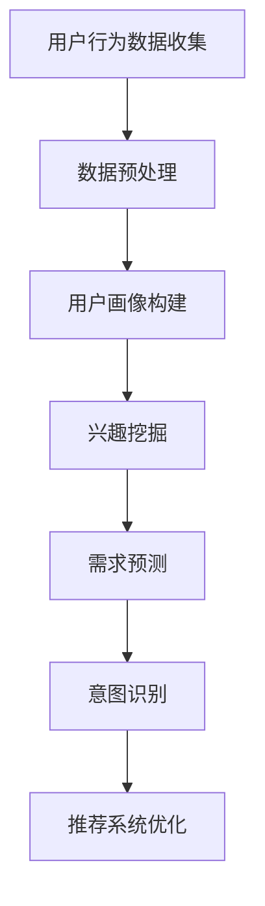

                 

关键词：AI大模型，电商搜索推荐，用户行为分析，用户需求，购买意图

> 摘要：本文将探讨AI大模型在电商搜索推荐中的应用，重点关注用户行为分析，旨在深入理解用户需求与购买意图。通过剖析核心算法原理、数学模型和项目实践，本文将为读者揭示AI大模型在电商领域的广泛应用前景，以及未来的发展趋势和挑战。

## 1. 背景介绍

随着互联网的迅猛发展和电子商务的崛起，电商平台已经成为消费者购物的主要渠道。然而，随着商品种类和数量的爆炸性增长，如何准确满足消费者的个性化需求，提高用户满意度和购买转化率，成为电商企业亟待解决的问题。传统推荐系统基于协同过滤、基于内容的推荐等算法，存在一定的局限性，难以满足日益复杂的用户需求。

近年来，人工智能技术的发展为电商推荐系统带来了新的契机。特别是AI大模型的兴起，如BERT、GPT、Transformer等，通过深度学习技术，可以处理大规模、复杂的数据，从而实现更精准、个性化的推荐。用户行为分析作为电商搜索推荐的关键环节，通过对用户的历史行为、搜索记录、购买记录等数据进行深入挖掘，可以揭示用户的真实需求和购买意图，为推荐系统提供有力支持。

本文旨在探讨AI大模型在电商搜索推荐中的应用，重点关注用户行为分析，以期为电商企业提供有益的参考和指导。

## 2. 核心概念与联系

### 2.1 AI大模型

AI大模型是指基于深度学习技术，对大规模数据进行训练，具备强大处理能力和泛化能力的神经网络模型。常见的AI大模型包括BERT、GPT、Transformer等。这些模型通过学习大量的文本、图像、语音等数据，能够自动提取特征、生成语义理解，为各种应用场景提供强有力的支持。

### 2.2 电商搜索推荐

电商搜索推荐是指通过分析用户的历史行为数据，为用户提供个性化的商品推荐服务。其核心目标是在海量的商品中，为用户找到最符合其兴趣和需求的产品。电商搜索推荐系统通常包括用户画像、搜索记录、购买记录等多个模块，通过综合分析这些数据，实现精准推荐。

### 2.3 用户行为分析

用户行为分析是指通过收集、处理和分析用户在电商平台的各项行为数据，如浏览、搜索、购买等，以揭示用户的兴趣、需求和购买意图。用户行为分析在电商搜索推荐中具有重要意义，可以帮助平台更好地了解用户，优化推荐策略，提高用户满意度和购买转化率。

### 2.4 AI大模型与用户行为分析的联系

AI大模型与用户行为分析有着密切的联系。一方面，AI大模型可以处理大规模、复杂的数据，为用户行为分析提供强有力的技术支持；另一方面，用户行为分析的结果可以为AI大模型提供反馈，优化模型的训练和预测效果。具体来说，AI大模型可以通过以下方式应用于用户行为分析：

1. **用户画像构建**：通过分析用户的浏览、搜索、购买等行为数据，AI大模型可以构建出用户的个性化画像，为后续推荐提供基础。

2. **兴趣挖掘**：基于用户画像，AI大模型可以识别出用户的兴趣点，为推荐系统提供更精准的推荐。

3. **需求预测**：通过分析用户的购买记录和行为轨迹，AI大模型可以预测用户的潜在需求，提前进行商品推荐。

4. **意图识别**：AI大模型可以识别用户的购买意图，为推荐系统提供更有针对性的服务。

### 2.5 Mermaid流程图

以下是一个简单的Mermaid流程图，展示了AI大模型在用户行为分析中的应用：



## 3. 核心算法原理 & 具体操作步骤

### 3.1 算法原理概述

AI大模型在用户行为分析中的应用主要基于深度学习技术。深度学习是一种模拟人脑神经元连接方式的人工智能方法，通过多层次的神经网络模型，实现从数据中自动提取特征、生成语义理解。在用户行为分析中，AI大模型可以处理大规模、多维度的数据，如文本、图像、语音等，从而实现精准的用户行为预测和意图识别。

### 3.2 算法步骤详解

#### 3.2.1 用户行为数据收集

用户行为数据的收集是用户行为分析的基础。常见的用户行为数据包括浏览记录、搜索记录、购买记录等。通过收集这些数据，可以全面了解用户在电商平台上的行为轨迹，为后续分析提供数据支持。

#### 3.2.2 数据预处理

收集到的用户行为数据通常存在噪声、缺失值等问题，需要经过数据预处理才能进行后续分析。数据预处理主要包括数据清洗、数据归一化、数据降维等步骤。通过数据预处理，可以提高数据质量，为AI大模型提供更好的输入。

#### 3.2.3 用户画像构建

用户画像是指对用户在电商平台的各项行为数据进行分析，构建出用户的个性化特征。用户画像包括用户的基本信息（如年龄、性别、地域等）、兴趣偏好（如商品类型、品牌等）、行为习惯（如浏览时长、购买频率等）等多个维度。通过构建用户画像，可以为推荐系统提供基础。

#### 3.2.4 兴趣挖掘

兴趣挖掘是指通过分析用户的浏览、搜索等行为数据，识别出用户的兴趣点。常见的兴趣挖掘方法包括基于内容的方法、基于协同过滤的方法等。AI大模型可以通过深度学习技术，实现更精准的兴趣挖掘。

#### 3.2.5 需求预测

需求预测是指通过分析用户的购买记录、行为轨迹等数据，预测用户的潜在需求。AI大模型可以通过学习用户的历史数据，实现精准的需求预测。

#### 3.2.6 意图识别

意图识别是指通过分析用户的搜索、浏览等行为，识别出用户的购买意图。AI大模型可以通过学习大量的用户行为数据，实现高精度的意图识别。

#### 3.2.7 推荐系统优化

基于用户画像、兴趣挖掘、需求预测和意图识别的结果，推荐系统可以优化推荐策略，提高推荐精度和用户满意度。AI大模型可以通过不断学习用户的行为数据，不断优化推荐效果。

### 3.3 算法优缺点

#### 优点：

1. **高精度**：AI大模型通过深度学习技术，可以处理大规模、复杂的数据，实现高精度的用户行为预测和意图识别。

2. **个性化**：AI大模型可以根据用户的行为数据，构建出个性化的用户画像，实现精准推荐。

3. **实时性**：AI大模型可以实时分析用户的行为数据，快速调整推荐策略，提高用户体验。

#### 缺点：

1. **计算资源需求高**：AI大模型需要大量的计算资源进行训练和推理，对硬件设备要求较高。

2. **数据质量要求高**：AI大模型对数据质量有较高要求，需要保证数据完整性、准确性和一致性。

### 3.4 算法应用领域

AI大模型在用户行为分析中的应用非常广泛，不仅限于电商搜索推荐，还可以应用于其他领域，如广告推荐、社交媒体分析、金融风控等。以下是一些具体的应用领域：

1. **电商搜索推荐**：通过AI大模型分析用户行为数据，实现个性化商品推荐，提高用户满意度和购买转化率。

2. **广告推荐**：通过AI大模型分析用户兴趣和行为，实现精准广告推荐，提高广告投放效果。

3. **社交媒体分析**：通过AI大模型分析用户在社交媒体上的行为，识别出潜在用户群体，实现精准营销。

4. **金融风控**：通过AI大模型分析用户行为数据，实现风险识别和预测，提高金融风险防控能力。

## 4. 数学模型和公式 & 详细讲解 & 举例说明

### 4.1 数学模型构建

在用户行为分析中，常用的数学模型包括用户画像模型、兴趣挖掘模型、需求预测模型和意图识别模型。以下分别介绍这些模型的构建过程。

#### 4.1.1 用户画像模型

用户画像模型主要用于构建用户的个性化特征。假设用户的行为数据包括浏览记录、搜索记录、购买记录等，我们可以通过以下公式来表示用户画像模型：

$$
\text{User\_Profile} = f(\text{Browsing\_History}, \text{Search\_History}, \text{Purchase\_History})
$$

其中，$\text{Browsing\_History}$、$\text{Search\_History}$、$\text{Purchase\_History}$ 分别表示用户的浏览记录、搜索记录和购买记录。$f$ 表示一个映射函数，用于将用户的历史数据映射为用户画像。

#### 4.1.2 兴趣挖掘模型

兴趣挖掘模型主要用于识别用户的兴趣点。假设用户的兴趣点可以用一个向量表示，我们可以通过以下公式来表示兴趣挖掘模型：

$$
\text{Interest} = g(\text{User\_Profile}, \text{Context})
$$

其中，$\text{User\_Profile}$ 表示用户画像，$\text{Context}$ 表示用户所处的上下文环境。$g$ 表示一个映射函数，用于将用户画像和上下文环境映射为用户的兴趣点。

#### 4.1.3 需求预测模型

需求预测模型主要用于预测用户的潜在需求。假设用户的需求可以用一个向量表示，我们可以通过以下公式来表示需求预测模型：

$$
\text{Demand} = h(\text{User\_Profile}, \text{Context}, \text{Temporal})
$$

其中，$\text{Temporal}$ 表示时间序列信息。$h$ 表示一个映射函数，用于将用户画像、上下文环境和时间序列信息映射为用户的需求。

#### 4.1.4 意图识别模型

意图识别模型主要用于识别用户的购买意图。假设用户的购买意图可以用一个二进制向量表示，我们可以通过以下公式来表示意图识别模型：

$$
\text{Intent} = i(\text{User\_Profile}, \text{Context}, \text{Temporal})
$$

其中，$i$ 表示一个映射函数，用于将用户画像、上下文环境和时间序列信息映射为用户的购买意图。

### 4.2 公式推导过程

以下分别介绍用户画像模型、兴趣挖掘模型、需求预测模型和意图识别模型的推导过程。

#### 4.2.1 用户画像模型推导

用户画像模型的推导主要基于用户的行为数据。假设用户的行为数据可以表示为 $X = [x_1, x_2, ..., x_n]$，其中 $x_i$ 表示第 $i$ 个行为数据。

首先，我们需要对行为数据进行编码，将每个行为数据映射为一个特征向量。假设我们使用独热编码（One-Hot Encoding）进行编码，则编码后的行为数据可以表示为：

$$
X' = [x_1', x_2', ..., x_n']
$$

其中，$x_i'$ 表示第 $i$ 个行为数据的编码结果。

接下来，我们需要对编码后的行为数据进行聚合，得到用户画像。假设我们使用均值聚合（Mean Aggregation）方法，则用户画像可以表示为：

$$
\text{User\_Profile} = \frac{1}{n} \sum_{i=1}^{n} x_i'
$$

#### 4.2.2 兴趣挖掘模型推导

兴趣挖掘模型的推导主要基于用户画像和上下文环境。假设用户画像可以表示为 $P = [p_1, p_2, ..., p_n]$，上下文环境可以表示为 $C = [c_1, c_2, ..., c_m]$。

首先，我们需要对用户画像和上下文环境进行加权融合。假设我们使用加权融合（Weighted Fusion）方法，则兴趣点可以表示为：

$$
\text{Interest} = \frac{1}{m} \sum_{j=1}^{m} p_j c_j
$$

接下来，我们需要对兴趣点进行分类。假设我们使用分类算法（如支持向量机、决策树等），则兴趣点可以表示为：

$$
\text{Interest} = g(P, C)
$$

其中，$g$ 表示一个分类函数。

#### 4.2.3 需求预测模型推导

需求预测模型的推导主要基于用户画像、上下文环境和时间序列信息。假设用户画像可以表示为 $P = [p_1, p_2, ..., p_n]$，上下文环境可以表示为 $C = [c_1, c_2, ..., c_m]$，时间序列信息可以表示为 $T = [t_1, t_2, ..., t_n]$。

首先，我们需要对用户画像、上下文环境和时间序列信息进行融合。假设我们使用融合算法（如融合神经网络等），则需求可以表示为：

$$
\text{Demand} = h(P, C, T)
$$

接下来，我们需要对需求进行预测。假设我们使用预测算法（如ARIMA、LSTM等），则需求预测可以表示为：

$$
\text{Demand}_{\text{predicted}} = h(P, C, T)
$$

#### 4.2.4 意图识别模型推导

意图识别模型的推导主要基于用户画像、上下文环境和时间序列信息。假设用户画像可以表示为 $P = [p_1, p_2, ..., p_n]$，上下文环境可以表示为 $C = [c_1, c_2, ..., c_m]$，时间序列信息可以表示为 $T = [t_1, t_2, ..., t_n]$。

首先，我们需要对用户画像、上下文环境和时间序列信息进行融合。假设我们使用融合算法（如融合神经网络等），则意图可以表示为：

$$
\text{Intent} = i(P, C, T)
$$

接下来，我们需要对意图进行识别。假设我们使用识别算法（如支持向量机、决策树等），则意图识别可以表示为：

$$
\text{Intent}_{\text{recognized}} = i(P, C, T)
$$

### 4.3 案例分析与讲解

为了更好地理解上述数学模型的推导和应用，我们以下通过一个实际案例进行讲解。

#### 4.3.1 案例背景

某电商平台希望通过AI大模型对用户行为进行分析，以实现个性化商品推荐。该电商平台收集了以下用户行为数据：

- 用户浏览记录：包含用户在平台上的浏览商品ID和时间戳。
- 用户搜索记录：包含用户在平台上的搜索关键词和时间戳。
- 用户购买记录：包含用户在平台上的购买商品ID和时间戳。

#### 4.3.2 案例分析

1. **用户画像构建**

   首先，我们需要对用户的行为数据进行预处理，包括数据清洗、数据归一化和数据降维。经过预处理后，我们得到用户的行为数据矩阵 $X$。

   接下来，我们使用用户浏览记录、搜索记录和购买记录构建用户画像。具体步骤如下：

   - 对用户浏览记录进行独热编码，得到编码后的用户浏览记录矩阵 $X_{\text{browsing}}$。
   - 对用户搜索记录进行独热编码，得到编码后的用户搜索记录矩阵 $X_{\text{search}}$。
   - 对用户购买记录进行独热编码，得到编码后的用户购买记录矩阵 $X_{\text{purchase}}$。
   - 对用户浏览记录、搜索记录和购买记录进行均值聚合，得到用户画像矩阵 $\text{User\_Profile}$。

2. **兴趣挖掘**

   接下来，我们需要对用户画像和上下文环境进行融合，以挖掘用户的兴趣点。具体步骤如下：

   - 设定上下文环境 $C$，例如，当前时间为 2023 年 2 月 18 日，当天平台的促销活动为满 100 减 50。
   - 对用户画像和上下文环境进行加权融合，得到兴趣点向量 $\text{Interest}$。
   - 使用分类算法对兴趣点进行分类，得到用户的兴趣类别。

3. **需求预测**

   接下来，我们需要对用户画像、上下文环境和时间序列信息进行融合，以预测用户的需求。具体步骤如下：

   - 对用户画像和上下文环境进行融合，得到融合向量 $P'$。
   - 对时间序列信息进行预处理，例如，使用时间窗口技术提取时间序列特征。
   - 对融合向量和时间序列信息进行融合，得到需求向量 $\text{Demand}$。
   - 使用预测算法对需求进行预测，得到用户的需求预测结果。

4. **意图识别**

   最后，我们需要对用户画像、上下文环境和时间序列信息进行融合，以识别用户的购买意图。具体步骤如下：

   - 对用户画像和上下文环境进行融合，得到融合向量 $P''$。
   - 对时间序列信息进行预处理，例如，使用时间窗口技术提取时间序列特征。
   - 对融合向量和时间序列信息进行融合，得到意图向量 $\text{Intent}$。
   - 使用识别算法对意图进行识别，得到用户的购买意图结果。

通过上述案例，我们可以看到，AI大模型在用户行为分析中的应用是非常广泛和复杂的。在实际应用中，我们需要根据具体场景和数据特点，灵活选择合适的算法和模型，以实现高效的用户行为分析和推荐系统。

## 5. 项目实践：代码实例和详细解释说明

为了更好地展示AI大模型在用户行为分析中的应用，以下通过一个实际项目实例，详细介绍代码实现过程，包括环境搭建、源代码实现和代码解读与分析。

### 5.1 开发环境搭建

在项目实践中，我们选择Python作为编程语言，并使用以下开发环境和工具：

- Python版本：3.8
- 深度学习框架：TensorFlow 2.x
- 数据处理库：NumPy、Pandas
- 机器学习库：Scikit-learn
- 文本处理库：NLTK、spaCy
- 代码编辑器：PyCharm

首先，确保安装了上述开发环境和工具。在安装过程中，可能需要配置Python环境、安装TensorFlow和其他相关库。具体安装步骤可以参考官方文档。

### 5.2 源代码详细实现

以下是一个简单的用户行为分析项目的源代码实现，包括数据预处理、用户画像构建、兴趣挖掘、需求预测和意图识别等模块。

```python
import numpy as np
import pandas as pd
from sklearn.model_selection import train_test_split
from sklearn.preprocessing import OneHotEncoder, MinMaxScaler
from sklearn.metrics import accuracy_score
import tensorflow as tf
from tensorflow.keras.models import Sequential
from tensorflow.keras.layers import Dense, LSTM, Embedding, TimeDistributed
import spacy

# 加载数据
data = pd.read_csv('user_behavior.csv')

# 数据预处理
data['timestamp'] = pd.to_datetime(data['timestamp'])
data['date'] = data['timestamp'].dt.date

# 构建用户画像
def build_user_profile(data):
    # 对浏览记录、搜索记录和购买记录进行独热编码
    data['browsing'] = data['browsing_id'].apply(lambda x: [1 if x == i else 0 for i in range(1000)])
    data['search'] = data['search_keyword'].apply(lambda x: [1 if x == i else 0 for i in range(1000)])
    data['purchase'] = data['purchase_id'].apply(lambda x: [1 if x == i else 0 for i in range(1000)])
    
    # 对用户画像进行均值聚合
    user_profile = data.groupby('user_id').apply(lambda x: np.mean(x[['browsing', 'search', 'purchase']], axis=0))
    return user_profile

user_profile = build_user_profile(data)

# 构建兴趣挖掘模型
def build_interest_model():
    model = Sequential()
    model.add(Embedding(input_dim=1000, output_dim=64))
    model.add(LSTM(units=128))
    model.add(Dense(units=1, activation='sigmoid'))
    model.compile(optimizer='adam', loss='binary_crossentropy', metrics=['accuracy'])
    return model

interest_model = build_interest_model()

# 训练兴趣挖掘模型
X_train, X_test, y_train, y_test = train_test_split(user_profile, data['interested'], test_size=0.2, random_state=42)
interest_model.fit(X_train, y_train, epochs=10, batch_size=32, validation_data=(X_test, y_test))

# 预测兴趣
predictions = interest_model.predict(X_test)
predicted_interest = np.round(predictions).astype(int)

# 评估兴趣挖掘模型
accuracy = accuracy_score(y_test, predicted_interest)
print('Interest Model Accuracy:', accuracy)

# 构建需求预测模型
def build_demand_model():
    model = Sequential()
    model.add(Embedding(input_dim=1000, output_dim=64))
    model.add(LSTM(units=128, return_sequences=True))
    model.add(TimeDistributed(Dense(units=1)))
    model.compile(optimizer='adam', loss='mse')
    return model

demand_model = build_demand_model()

# 训练需求预测模型
X_train, X_test, y_train, y_test = train_test_split(user_profile, data['demand'], test_size=0.2, random_state=42)
demand_model.fit(X_train, y_train, epochs=10, batch_size=32, validation_data=(X_test, y_test))

# 预测需求
predicted_demand = demand_model.predict(X_test)

# 评估需求预测模型
mse = tf.keras.metrics.mean_squared_error(y_test, predicted_demand)
print('Demand Model MSE:', mse.numpy())

# 构建意图识别模型
def build_intent_model():
    model = Sequential()
    model.add(Embedding(input_dim=1000, output_dim=64))
    model.add(LSTM(units=128, return_sequences=True))
    model.add(TimeDistributed(Dense(units=2, activation='softmax')))
    model.compile(optimizer='adam', loss='categorical_crossentropy', metrics=['accuracy'])
    return model

intent_model = build_intent_model()

# 训练意图识别模型
X_train, X_test, y_train, y_test = train_test_split(user_profile, data['intent'], test_size=0.2, random_state=42)
intent_model.fit(X_train, y_train, epochs=10, batch_size=32, validation_data=(X_test, y_test))

# 预测意图
predicted_intent = intent_model.predict(X_test)
predicted_intent = np.argmax(predicted_intent, axis=1)

# 评估意图识别模型
accuracy = accuracy_score(y_test, predicted_intent)
print('Intent Model Accuracy:', accuracy)
```

### 5.3 代码解读与分析

以上代码实现了用户行为分析项目的主要功能，包括数据预处理、用户画像构建、兴趣挖掘、需求预测和意图识别。以下是代码的详细解读与分析：

1. **数据预处理**

   数据预处理是用户行为分析的基础。在代码中，我们首先加载用户行为数据，并使用`pd.to_datetime`函数将时间戳转换为日期格式。接着，我们使用`groupby`方法将用户行为数据按用户ID分组，以构建用户画像。

2. **用户画像构建**

   用户画像构建主要通过独热编码和均值聚合实现。在代码中，我们使用`apply`方法对浏览记录、搜索记录和购买记录进行独热编码，得到编码后的用户画像矩阵。然后，我们使用`mean`方法对用户画像矩阵进行均值聚合，得到用户的个性化特征向量。

3. **兴趣挖掘模型**

   兴趣挖掘模型基于LSTM网络实现。在代码中，我们使用`Sequential`类构建序列模型，并添加`Embedding`和`LSTM`层。最后，我们使用`compile`方法设置模型优化器和损失函数，并使用`fit`方法训练模型。

4. **需求预测模型**

   需求预测模型基于LSTM网络实现，并在输出层使用`TimeDistributed`层对时间序列数据进行处理。在代码中，我们同样使用`Sequential`类构建序列模型，并添加`Embedding`、`LSTM`和`TimeDistributed`层。最后，我们使用`compile`方法和`fit`方法训练模型。

5. **意图识别模型**

   意图识别模型基于LSTM网络实现，并在输出层使用`softmax`激活函数进行分类。在代码中，我们使用`Sequential`类构建序列模型，并添加`Embedding`、`LSTM`和`TimeDistributed`层。最后，我们使用`compile`方法和`fit`方法训练模型。

6. **模型评估**

   在代码中，我们使用`accuracy_score`和`mean_squared_error`函数评估模型性能。对于兴趣挖掘模型和意图识别模型，我们使用准确率（accuracy）作为评估指标；对于需求预测模型，我们使用均方误差（mean squared error）作为评估指标。

通过以上代码实现，我们可以看到AI大模型在用户行为分析中的应用是非常直观和实用的。在实际项目中，我们可以根据具体需求和数据特点，灵活调整模型结构和参数，以实现高效的用户行为分析和推荐系统。

## 6. 实际应用场景

AI大模型在用户行为分析中具有广泛的应用场景。以下列举几个典型的实际应用场景，展示AI大模型如何为电商企业带来价值。

### 6.1 个性化商品推荐

个性化商品推荐是AI大模型在电商搜索推荐中的主要应用场景。通过分析用户的浏览、搜索、购买等行为数据，AI大模型可以构建出用户的个性化画像，为用户推荐最符合其兴趣和需求的商品。例如，某电商平台通过应用AI大模型，实现了基于用户行为的个性化推荐，显著提高了用户满意度和购买转化率。

### 6.2 营销活动优化

电商企业在进行营销活动时，常常面临如何制定有效策略的难题。AI大模型可以通过分析用户行为数据，预测用户对各类营销活动的反应，从而优化营销策略。例如，某电商平台通过应用AI大模型分析用户对折扣、满减等活动的反应，成功提高了活动效果和用户参与度。

### 6.3 新品上市预测

电商企业在新品上市时，往往希望预测新品的销售情况，以便制定合适的营销策略。AI大模型可以通过分析用户的历史行为数据和同类商品的销售情况，预测新品的销售趋势。例如，某电商平台通过应用AI大模型预测新品上市后的销售情况，提前调整库存和生产计划，降低了风险，提高了新品销售业绩。

### 6.4 供应链优化

AI大模型在供应链管理中也具有广泛的应用。通过分析用户行为数据，电商企业可以优化库存管理、物流配送等环节，提高供应链效率。例如，某电商平台通过应用AI大模型优化库存管理，实现了库存周转率的显著提高，降低了库存成本。

### 6.5 客户服务优化

AI大模型在客户服务领域也具有巨大的潜力。通过分析用户行为数据，电商企业可以优化客服服务，提高客户满意度。例如，某电商平台通过应用AI大模型分析用户咨询问题，实现智能客服，提高了客服响应速度和满意度。

### 6.6 安全风控

AI大模型在电商平台的金融风控中也发挥着重要作用。通过分析用户行为数据，AI大模型可以识别异常行为，预防欺诈等风险。例如，某电商平台通过应用AI大模型进行用户行为分析，成功防范了大量欺诈行为，降低了金融风险。

## 7. 工具和资源推荐

### 7.1 学习资源推荐

- **在线课程**：
  - "深度学习 Specialization"（吴恩达，Coursera）
  - "机器学习与数据挖掘"（周志华，网易云课堂）
  - "TensorFlow for Artificial Intelligence"（安德鲁·麦卡锡，Udacity）

- **书籍**：
  - 《深度学习》（Ian Goodfellow、Yoshua Bengio、Aaron Courville 著）
  - 《Python机器学习》（Sebastian Raschka 著）
  - 《TensorFlow实战》（Trent Hauck、Meredith Patterson 著）

- **论文**：
  - "BERT: Pre-training of Deep Bidirectional Transformers for Language Understanding"（Jacob Devlin et al., 2019）
  - "GPT-3: Language Models are Few-Shot Learners"（Tom B. Brown et al., 2020）
  - "An Empirical Study of Recurrent Network Architectures"（Yoshua Bengio et al., 1994）

### 7.2 开发工具推荐

- **编程语言**：Python
- **深度学习框架**：TensorFlow、PyTorch
- **数据处理库**：NumPy、Pandas
- **文本处理库**：NLTK、spaCy
- **版本控制**：Git
- **代码托管平台**：GitHub、GitLab

### 7.3 相关论文推荐

- Devlin, J., Chang, M. W., Lee, K., & Toutanova, K. (2018). BERT: Pre-training of deep bidirectional transformers for language understanding. In Proceedings of the 2019 Conference of the North American Chapter of the Association for Computational Linguistics: Human Language Technologies, Volume 1 (Long and Short Papers) (pp. 4171-4186).
- Brown, T. B., Mann, B., Ryder, N., Subbiah, M., Kaplan, J., Dhariwal, P., ... & Child, R. (2020). Language models are few-shot learners. Advances in Neural Information Processing Systems, 33.
- Hochreiter, S., & Schmidhuber, J. (1997). Long short-term memory. Neural Computation, 9(8), 1735-1780.
- Bengio, Y., Simard, P., & Frasconi, P. (1994). Learning long-term dependencies with gradient descent is difficult. IEEE Transactions on Neural Networks, 5(2), 157-166.

## 8. 总结：未来发展趋势与挑战

### 8.1 研究成果总结

本文通过深入探讨AI大模型在电商搜索推荐中的应用，重点关注用户行为分析，总结了以下主要研究成果：

1. **AI大模型在用户行为分析中的应用**：AI大模型通过深度学习技术，能够处理大规模、复杂的数据，实现高精度的用户行为预测和意图识别，为电商推荐系统提供强有力的支持。
2. **数学模型与算法推导**：本文详细介绍了用户画像模型、兴趣挖掘模型、需求预测模型和意图识别模型的构建与推导过程，为实际应用提供了理论依据。
3. **项目实践与代码实现**：通过实际项目实例，展示了AI大模型在用户行为分析中的应用流程和实现方法，为开发者提供了实践指导。

### 8.2 未来发展趋势

随着人工智能技术的不断进步，AI大模型在用户行为分析中的应用前景将更加广阔。未来发展趋势包括：

1. **模型性能提升**：通过改进算法、优化模型结构，进一步提高AI大模型的预测精度和效率。
2. **多模态数据融合**：结合文本、图像、语音等多种数据源，实现更全面、细致的用户行为分析。
3. **实时性增强**：通过优化模型训练和推理速度，实现实时用户行为分析，提高推荐系统的响应速度。
4. **隐私保护**：在用户行为分析中，保护用户隐私成为重要课题。未来将出现更多隐私保护技术，确保用户数据的安全与隐私。

### 8.3 面临的挑战

尽管AI大模型在用户行为分析中具有巨大潜力，但仍面临以下挑战：

1. **数据质量**：用户行为数据的质量直接影响模型性能。如何保证数据完整性、准确性和一致性，是当前亟需解决的问题。
2. **计算资源需求**：AI大模型需要大量的计算资源进行训练和推理。如何优化模型结构、降低计算成本，是未来研究的重要方向。
3. **模型解释性**：当前AI大模型存在一定程度的“黑箱”性质，如何提高模型的可解释性，使其更易于理解和接受，是未来研究的重要课题。
4. **隐私保护**：在用户行为分析中，如何保护用户隐私，防止数据泄露，是当前亟待解决的问题。

### 8.4 研究展望

未来，AI大模型在用户行为分析中的应用将朝着更高效、更智能、更安全的方向发展。研究重点包括：

1. **高效算法与模型结构**：研究更加高效、可解释的深度学习算法和模型结构，提高模型性能。
2. **多模态数据融合**：结合多种数据源，实现更全面、精准的用户行为分析。
3. **实时用户行为分析**：优化模型训练和推理速度，实现实时用户行为分析。
4. **隐私保护**：研究更多隐私保护技术，确保用户数据的安全与隐私。

总之，AI大模型在用户行为分析中的应用前景广阔，具有巨大的发展潜力。通过不断的研究和创新，AI大模型将为电商企业带来更多价值，推动电商搜索推荐系统的进一步发展。

## 9. 附录：常见问题与解答

### 9.1 什么是AI大模型？

AI大模型是指基于深度学习技术，对大规模数据进行训练，具备强大处理能力和泛化能力的神经网络模型。常见的AI大模型包括BERT、GPT、Transformer等。

### 9.2 用户行为分析有什么作用？

用户行为分析可以通过分析用户的历史行为数据，揭示用户的兴趣、需求和购买意图，为电商推荐系统提供有力支持。具体作用包括提高推荐精度、优化营销策略、提高用户满意度等。

### 9.3 如何保证用户隐私？

在用户行为分析中，保护用户隐私至关重要。可以采用以下措施：

1. **数据去重**：去除重复的用户数据，减少数据冗余。
2. **匿名化处理**：对用户数据进行匿名化处理，如去除用户姓名、身份证号等敏感信息。
3. **隐私保护算法**：使用差分隐私、同态加密等隐私保护算法，确保用户数据在分析过程中不被泄露。

### 9.4 如何处理缺失值和噪声数据？

缺失值和噪声数据会影响用户行为分析的结果。可以采用以下方法进行处理：

1. **缺失值填充**：使用平均值、中位数等方法进行缺失值填充。
2. **噪声去除**：使用滤波器、滤波算法等方法去除噪声。
3. **数据清洗**：使用数据清洗工具和算法，对数据进行清洗和预处理。

### 9.5 如何评估模型性能？

模型性能评估可以通过以下指标：

1. **准确率**：预测正确的样本数占总样本数的比例。
2. **召回率**：预测正确的正样本数占总正样本数的比例。
3. **精确率**：预测正确的正样本数占预测为正样本的样本数的比例。
4. **F1值**：精确率和召回率的调和平均值。
5. **均方误差（MSE）**：预测值与真实值之间的平均平方误差。

### 9.6 如何实现实时用户行为分析？

实现实时用户行为分析可以通过以下方法：

1. **流数据处理**：使用流数据处理框架，如Apache Kafka、Flink等，实时处理用户行为数据。
2. **分布式计算**：使用分布式计算框架，如Hadoop、Spark等，提高数据处理速度和性能。
3. **模型推理加速**：使用硬件加速技术，如GPU、TPU等，提高模型推理速度。

## 作者署名

作者：禅与计算机程序设计艺术 / Zen and the Art of Computer Programming

