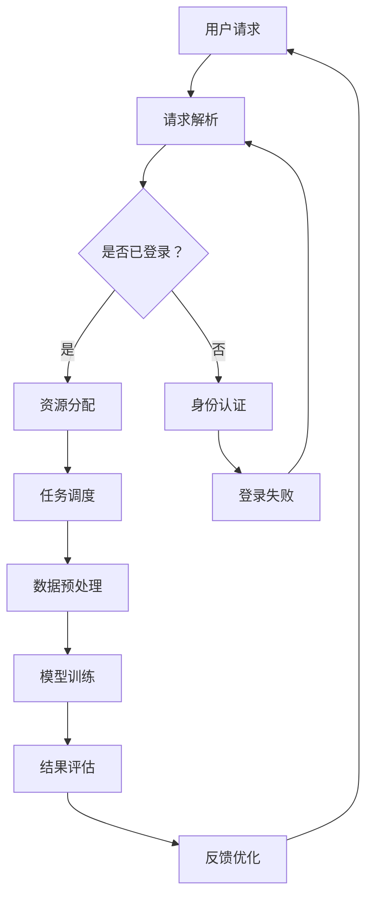

                 

### 1. 背景介绍

随着人工智能技术的迅猛发展，大模型（也称为大型深度学习模型）成为了当前学术界和工业界的研究热点。这些模型不仅在图像识别、自然语言处理、语音识别等传统人工智能领域取得了显著成果，还在诸如推荐系统、智能客服、智能交通等领域展现出了巨大的潜力。然而，大模型的训练和应用需要巨大的计算资源和数据量，这促使了AI应用数据中心（AI Application Data Center，简称AADC）的兴起。

AADC作为集中管理大模型训练、部署和服务的平台，不仅需要具备强大的计算能力和数据存储能力，还需要处理复杂的网络架构、安全性问题和运营成本。在这样的背景下，构建一个高效、可靠、安全的AADC成为了企业、研究机构和政府部门的共同目标。然而，这个过程中面临的挑战也层出不穷，如数据隐私保护、资源分配、系统性能优化等。

本文旨在探讨大模型应用数据中心在公共关系方面的关键问题和应对策略，包括以下几个方面：

1. **市场定位与客户需求分析**：了解不同用户群体的需求，为AADC的构建和运营提供方向。
2. **技术传播与教育**：通过技术传播和教育，提升公众对大模型和AADC的认识和接受度。
3. **合作伙伴关系建设**：构建与相关产业链上下游的合作伙伴关系，实现资源共享和优势互补。
4. **风险管理与危机应对**：制定有效的风险管理和危机应对策略，确保AADC的稳定运行。
5. **长期发展规划与展望**：探讨AADC的长期发展路径，为未来的技术创新和产业应用提供指导。

### 1.1 大模型应用数据中心的发展现状

近年来，随着AI技术的飞速发展，大模型应用数据中心的建设在全球范围内迅速推进。根据市场调研数据显示，2022年全球AI应用数据中心市场规模已达到1200亿美元，预计到2027年将达到2500亿美元，年均增长率超过15%。

从地区分布来看，北美和欧洲是AI应用数据中心的主要市场，分别占据了全球市场份额的40%和30%。然而，随着中国、印度等新兴市场国家的迅速崛起，亚太地区市场份额正在逐步提升。特别是中国，得益于国家政策的支持和市场的巨大需求，已成为全球最大的AI应用数据中心建设市场。

在技术方面，GPU和FPGA等高性能计算硬件的普及，以及云计算、边缘计算等新技术的应用，使得AADC的计算能力和数据存储能力得到了显著提升。例如，谷歌的TPU、微软的Azure ML等平台都为大规模数据处理和模型训练提供了强大的支持。

尽管AI应用数据中心的发展势头强劲，但同时也面临着诸多挑战。数据隐私和安全问题、高昂的运营成本、资源分配不均等问题都需要得到有效的解决。此外，大模型的训练和应用还涉及到伦理和法律方面的考量，如数据歧视、算法偏见等。

### 1.2 公共关系的重要性

公共关系（Public Relations，简称PR）是指组织通过沟通、互动、传播等方式与公众建立和维护良好关系的活动。对于大模型应用数据中心（AADC）而言，公共关系的重要性不言而喻。

首先，良好的公共关系有助于提升AADC的知名度。在当今信息爆炸的时代，公众对新技术和新产品的关注度和接受度往往取决于其认知度和信任度。通过有效的公关活动，AADC可以将其技术优势和服务理念传递给更广泛的用户群体，从而提高市场占有率。

其次，公共关系有助于树立AADC的品牌形象。AADC作为高科技企业，其品牌形象不仅代表着公司的核心竞争力，也体现了企业的社会责任和价值观。通过积极参与社会公益活动、发布负责任的技术报告等，AADC可以树立一个专业、可靠、负责任的品牌形象。

再次，公共关系有助于建立合作伙伴关系。在AI领域，大模型的应用需要多个领域的技术和资源的协同。通过有效的公关活动，AADC可以与产业链上下游的企业、研究机构和政府部门建立合作关系，实现资源共享、优势互补。

最后，公共关系有助于应对风险和危机。在AI应用数据中心的建设和运营过程中，难免会遇到各种风险和挑战。通过建立良好的公共关系，AADC可以及时了解公众的反馈和需求，迅速采取应对措施，降低风险和危机带来的负面影响。

总之，公共关系是AADC建设和发展的重要支撑，对于提升知名度、树立品牌形象、建立合作伙伴关系以及应对风险和危机都具有重要作用。

### 1.3 公共关系的目标和原则

在构建大模型应用数据中心（AADC）的公共关系过程中，明确目标和遵循原则至关重要。公共关系的目标主要包括以下几个方面：

1. **提升AADC的知名度和品牌形象**：通过有效的传播策略，让更多的公众了解AADC的技术优势和独特价值，从而提高市场认知度和用户信任度。

2. **建立和维护良好的合作伙伴关系**：与产业链上下游的企业、研究机构和政府部门建立长期稳定的合作关系，实现资源共享和优势互补，共同推动AI技术的发展和应用。

3. **塑造AADC的专业形象**：通过发布高质量的技术文章、举办技术研讨会和培训课程，展示AADC在技术领域的专业能力和创新能力，树立行业领先地位。

4. **提升用户满意度**：通过及时反馈用户需求，优化产品和服务，提升用户满意度，增强用户粘性。

5. **应对风险和危机**：建立健全的风险管理机制，及时应对各种潜在风险和危机，保障AADC的稳定运营。

在制定公共关系策略时，需要遵循以下几个原则：

1. **真实性**：公共关系的信息传递必须真实可靠，避免夸大或虚假宣传，以建立公众的信任。

2. **透明性**：在处理公众关注的问题时，应保持信息的透明度，及时公布相关信息，让公众了解实际情况。

3. **及时性**：面对突发事件或公众关注的问题，应迅速响应，及时发布相关信息，避免谣言和误解的传播。

4. **互动性**：通过多种渠道与公众互动，积极回应公众的疑问和建议，增强与公众的互动和沟通。

5. **一致性**：在公共关系的宣传和沟通中，要保持信息的一致性，避免出现矛盾和冲突，树立统一、稳定的品牌形象。

通过明确目标和遵循原则，AADC可以更有效地构建和维护其公共关系，为长期发展奠定坚实基础。

### 1.4 大模型应用数据中心的公众类型与需求分析

在构建大模型应用数据中心（AADC）的公共关系时，了解不同公众类型的需求至关重要。AADC的公众主要包括以下几类：

#### 1.4.1 企业用户

企业用户是AADC的主要服务对象，包括科技企业、金融公司、制造业企业等。他们的需求主要集中在以下几个方面：

1. **高性能计算能力**：企业用户需要强大的计算能力来训练和部署大模型，以提高生产效率和竞争力。
2. **数据存储和安全性**：企业用户需要稳定、可靠的数据存储解决方案，同时确保数据的安全性，防止数据泄露和丢失。
3. **定制化服务**：企业用户希望AADC提供个性化的服务，包括数据预处理、模型定制、性能优化等。
4. **成本效益**：企业用户关注成本效益，希望AADC在提供高性能计算和数据存储服务的同时，能提供合理的价格和优惠。

#### 1.4.2 科研机构

科研机构是AADC的重要合作伙伴，包括大学、研究所等。他们的需求主要集中在以下几个方面：

1. **开放性和灵活性**：科研机构希望AADC提供开放和灵活的计算资源，以便于他们进行各种研究和实验。
2. **数据支持**：科研机构需要大量的数据集来进行模型训练和研究，AADC应提供丰富、高质量的数据资源。
3. **技术支持**：科研机构希望AADC提供专业的技术支持，包括算法优化、数据预处理等。
4. **合作机会**：科研机构希望通过AADC的平台，与其他研究机构和企业建立合作关系，共同推动AI技术的发展。

#### 1.4.3 个人开发者

个人开发者是AADC的潜在用户群体，他们的需求相对多样，主要包括以下几个方面：

1. **易于使用**：个人开发者希望AADC提供简单、易用的开发工具和API，降低开发门槛。
2. **资源限制**：个人开发者通常计算资源和数据量有限，希望AADC能提供按需付费或免费的服务。
3. **学习资源**：个人开发者需要丰富的学习资源，包括技术文档、教程、示例代码等。
4. **社区支持**：个人开发者希望通过AADC的社区平台，与其他开发者交流和合作，共同进步。

#### 1.4.4 普通公众

普通公众对AADC的了解相对较少，但他们的需求和关注点也不容忽视。他们的需求主要集中在以下几个方面：

1. **安全性**：普通公众关注AADC的数据存储和安全问题，担心个人信息泄露。
2. **透明度**：普通公众希望AADC在数据收集和使用方面保持透明度，让他们了解数据的用途和去向。
3. **社会责任**：普通公众关注AADC的技术应用对社会的影响，希望AADC承担起社会责任，确保技术应用的公正、公平和可持续发展。

#### 1.4.5 政府和监管部门

政府和监管部门是AADC的重要监管者和支持者，他们的需求主要集中在以下几个方面：

1. **法规遵循**：政府和监管部门希望AADC遵守相关的法律法规，确保数据的合法性和安全性。
2. **行业规范**：政府和监管部门希望AADC参与制定行业规范和标准，推动行业的健康发展。
3. **技术支持**：政府和监管部门希望AADC提供技术支持，协助解决行业中的技术难题。
4. **风险预警**：政府和监管部门希望AADC提供风险预警信息，提前应对潜在的风险和危机。

综上所述，不同公众类型对AADC的需求各有侧重，AADC需要根据这些需求制定有针对性的公共关系策略，以满足各类用户的需求，提升整体服务质量。

### 2. 核心概念与联系

要构建高效的大模型应用数据中心（AADC），需要深入理解并掌握一系列核心概念和技术，这些概念和技术的联系构成了AADC的技术架构和运营基础。

#### 2.1 大模型

大模型是指参数量庞大、计算复杂度极高的深度学习模型，如大型神经网络、Transformer模型等。大模型的核心特点包括：

- **参数量大**：大模型的参数数量往往达到数十亿甚至千亿级别，这需要巨大的计算资源和存储空间。
- **计算复杂度高**：大模型的训练和推理过程涉及大量的矩阵运算和并行计算，对计算性能要求极高。
- **数据需求大**：大模型训练需要大量高质量的训练数据，这些数据不仅需要丰富的多样性，还需要具备较高的质量。

#### 2.2 计算集群

计算集群是指由多个计算节点组成的分布式计算系统，用于执行大规模数据处理和模型训练任务。计算集群的核心特点包括：

- **高可扩展性**：计算集群可以根据需要动态调整计算资源，满足不同规模的任务需求。
- **高可用性**：计算集群通过节点冗余和负载均衡技术，确保系统的高可用性和稳定性。
- **高效率**：计算集群通过并行计算和分布式存储技术，提高数据处理和模型训练的效率。

#### 2.3 数据中心

数据中心是指集中管理计算资源、存储资源、网络资源等基础设施的场所。数据中心的核心特点包括：

- **高可靠性**：数据中心通过冗余设计和备份机制，确保数据的安全性和可靠性。
- **高性能**：数据中心通过高速网络、高性能计算设备和先进的存储技术，提供高效的计算和存储服务。
- **可扩展性**：数据中心可以通过模块化设计和自动化管理，实现资源的灵活扩展。

#### 2.4 数据库

数据库是指用于存储、管理和检索数据的系统。在大模型应用数据中心中，数据库主要用于存储和管理训练数据和模型参数。数据库的核心特点包括：

- **高容量**：数据库需要具备存储大量数据的能力，以支持大模型的训练。
- **高并发**：数据库需要支持高并发访问，确保多个计算任务可以同时访问数据库。
- **高可用性**：数据库通过冗余设计和故障转移机制，确保数据的高可用性和可靠性。

#### 2.5 网络架构

网络架构是指用于连接计算资源、存储资源和用户设备的网络拓扑结构。在大模型应用数据中心中，网络架构的核心特点包括：

- **高带宽**：网络架构需要提供高带宽的网络连接，满足大规模数据传输需求。
- **低延迟**：网络架构需要低延迟的网络传输，确保数据处理的实时性和高效性。
- **高可靠性**：网络架构通过冗余设计和故障转移机制，确保网络的稳定性和可靠性。

#### 2.6 安全机制

安全机制是指用于保障数据中心数据安全和系统安全的技术和措施。在大模型应用数据中心中，安全机制的核心特点包括：

- **数据加密**：对存储和传输的数据进行加密，防止数据泄露。
- **访问控制**：通过身份认证和权限管理，确保只有授权用户可以访问数据。
- **入侵检测和防御**：通过入侵检测和防御系统，实时监测和防御网络攻击。

#### 2.7 资源调度

资源调度是指用于管理和分配数据中心计算资源、存储资源和网络资源的技术。在大模型应用数据中心中，资源调度的核心特点包括：

- **高效性**：资源调度需要快速、准确地分配资源，确保任务的高效执行。
- **公平性**：资源调度需要公平地分配资源，确保所有用户和任务都能获得合理的资源。
- **灵活性**：资源调度需要具备灵活性，能够根据任务需求和资源状况动态调整资源分配。

#### 2.8 监控与运维

监控与运维是指用于监测数据中心运行状态、性能指标和故障处理的技术和流程。在大模型应用数据中心中，监控与运维的核心特点包括：

- **实时监控**：通过实时监控，及时发现和处理系统故障和性能问题。
- **自动化运维**：通过自动化运维工具，实现系统部署、监控、故障恢复等操作的自动化。
- **日志管理**：通过日志管理，记录系统运行情况和故障信息，为故障诊断和性能优化提供依据。

#### 2.9 Mermaid 流程图

为了更直观地展示AADC的核心概念和技术联系，我们使用Mermaid流程图来描述其架构和流程。以下是AADC的基本架构流程：



在这个流程图中，用户请求经过请求解析后，根据用户是否已登录进行不同的处理。已登录的用户直接进入资源分配和任务调度环节，未登录的用户则需要先进行身份认证。任务调度后，数据会进行预处理，然后进入模型训练环节，最后通过结果评估和反馈优化循环迭代。

通过上述核心概念和Mermaid流程图的描述，我们可以更好地理解AADC的技术架构和运营流程，为其公共关系建设提供技术基础。

### 3. 核心算法原理 & 具体操作步骤

在构建高效的大模型应用数据中心（AADC）中，核心算法的原理和操作步骤至关重要。以下将详细介绍大模型训练的基本算法原理，以及具体的操作步骤和流程。

#### 3.1 算法原理概述

大模型训练的基本算法原理主要基于深度学习（Deep Learning），深度学习是一种基于人工神经网络（Artificial Neural Networks, ANN）的机器学习技术。其核心思想是通过多层的非线性变换，从大量数据中学习到有效的特征表示，从而实现复杂的预测和分类任务。

大模型训练的过程可以分为以下几个阶段：

1. **数据预处理**：包括数据的清洗、归一化、分割等步骤，以确保数据的质量和一致性。
2. **模型构建**：根据任务需求，设计并构建深度学习模型的结构。
3. **模型训练**：通过反向传播算法（Backpropagation Algorithm）和梯度下降（Gradient Descent）方法，对模型参数进行优化，使模型能够在给定数据集上取得良好的性能。
4. **模型评估**：使用验证集或测试集对训练好的模型进行评估，确保模型具备良好的泛化能力。
5. **模型部署**：将训练好的模型部署到实际应用环境中，进行预测和推理。

#### 3.2 算法步骤详解

以下是具体的算法步骤和流程：

##### 3.2.1 数据预处理

数据预处理是深度学习模型训练的重要环节，主要包括以下步骤：

1. **数据清洗**：去除数据集中的噪声和异常值，如缺失值、重复值等。
2. **数据归一化**：将不同特征的数据缩放到相同的尺度，常用的方法包括最小-最大归一化和标准化。
3. **数据分割**：将数据集分为训练集、验证集和测试集，通常的比例为60%训练集，20%验证集，20%测试集。

##### 3.2.2 模型构建

模型构建是深度学习算法的核心步骤，主要包括以下内容：

1. **选择模型架构**：根据任务需求选择合适的深度学习模型架构，如卷积神经网络（CNN）、循环神经网络（RNN）、Transformer等。
2. **设计网络层**：根据模型架构，设计网络的层数、每层的神经元数量、激活函数等。
3. **初始化参数**：为网络的权重和偏置初始化合理的初始值，常用的方法包括高斯分布初始化、 Xavier初始化等。

##### 3.2.3 模型训练

模型训练是深度学习算法的核心步骤，主要包括以下内容：

1. **定义损失函数**：根据任务需求，选择合适的损失函数，如均方误差（MSE）、交叉熵（Cross-Entropy）等。
2. **选择优化器**：选择合适的优化算法，如随机梯度下降（SGD）、Adam优化器等，用于更新模型参数。
3. **反向传播**：通过反向传播算法，计算模型参数的梯度，并更新参数。
4. **训练过程**：通过迭代训练，不断优化模型参数，使模型在训练集上取得良好的性能。

##### 3.2.4 模型评估

模型评估是验证模型性能的重要步骤，主要包括以下内容：

1. **计算评估指标**：根据任务需求，计算模型在验证集和测试集上的评估指标，如准确率（Accuracy）、召回率（Recall）、F1值（F1 Score）等。
2. **模型选择**：根据评估指标，选择性能最佳的模型。
3. **模型调优**：对模型进行调参和优化，以提升其性能。

##### 3.2.5 模型部署

模型部署是将训练好的模型应用到实际应用环境中的重要步骤，主要包括以下内容：

1. **模型转换**：将训练好的模型转换为可以在生产环境中运行的格式，如TensorFlow Lite、PyTorch Mobile等。
2. **部署环境**：选择合适的部署环境，如边缘设备、云端服务器等。
3. **推理过程**：在部署环境中，对输入数据进行预测和推理，输出预测结果。

#### 3.3 算法优缺点

深度学习算法在处理大规模数据和高复杂性任务方面具有显著优势，但也存在一些缺点：

**优点**：

1. **强大的泛化能力**：深度学习算法能够从大量数据中学习到有效的特征表示，从而实现良好的泛化能力。
2. **自动特征提取**：深度学习算法能够自动提取特征，降低手工特征工程的工作量。
3. **处理复杂数据**：深度学习算法能够处理各种类型的数据，如图像、文本、音频等。

**缺点**：

1. **计算资源需求大**：深度学习算法需要大量的计算资源和时间，特别是在训练大规模模型时。
2. **数据依赖性强**：深度学习算法的性能高度依赖于数据集的质量和规模，数据不足或质量差可能导致模型性能不佳。
3. **模型解释性差**：深度学习算法的黑盒特性使得模型的解释性较差，难以理解其内部决策过程。

#### 3.4 算法应用领域

深度学习算法在各个领域都取得了显著的成果，以下是其中一些主要应用领域：

1. **计算机视觉**：图像分类、目标检测、人脸识别等。
2. **自然语言处理**：文本分类、机器翻译、情感分析等。
3. **语音识别**：语音识别、说话人识别、语音合成等。
4. **推荐系统**：基于内容的推荐、协同过滤等。
5. **智能交通**：交通流量预测、自动驾驶等。
6. **医疗健康**：疾病诊断、药物发现、健康监测等。
7. **金融科技**：风险评估、欺诈检测、量化交易等。

通过深入理解核心算法原理和具体操作步骤，我们可以更好地构建和应用大模型应用数据中心，为各种复杂任务提供高效的解决方案。

### 4. 数学模型和公式 & 详细讲解 & 举例说明

在深度学习和大规模数据处理中，数学模型和公式起着至关重要的作用。这些模型和公式不仅为我们提供了理论依据，也为我们提供了具体操作的指导。在本节中，我们将详细介绍一些核心数学模型和公式，并通过具体例子说明其应用。

#### 4.1 数学模型构建

深度学习中的数学模型主要包括神经网络、损失函数、优化算法等。

1. **神经网络模型**：
   神经网络是一种基于生物神经网络原理设计的计算模型，包括输入层、隐藏层和输出层。每个神经元都接收来自前一层神经元的输入，通过激活函数进行非线性变换，输出传递给下一层。

   - **输入层**：接收外部输入，如图像像素值、文本词语等。
   - **隐藏层**：进行特征提取和变换，隐藏层中的神经元通过权重连接，构成复杂的非线性映射。
   - **输出层**：输出预测结果，如分类结果、回归值等。

2. **损失函数**：
   损失函数用于衡量模型预测结果与真实值之间的差距。常见的损失函数包括均方误差（MSE）、交叉熵（Cross-Entropy）等。

   - **均方误差（MSE）**：用于回归任务，计算预测值与真实值之间差的平方和的平均值。
     \[
     MSE = \frac{1}{n}\sum_{i=1}^{n}(y_i - \hat{y_i})^2
     \]
     其中，\(y_i\) 是真实值，\(\hat{y_i}\) 是预测值，\(n\) 是样本数量。

   - **交叉熵（Cross-Entropy）**：用于分类任务，计算真实标签和预测概率之间的交叉熵。
     \[
     CE = -\sum_{i=1}^{n}y_i \log(\hat{y_i})
     \]
     其中，\(y_i\) 是真实标签（0或1），\(\hat{y_i}\) 是预测概率。

3. **优化算法**：
   优化算法用于调整模型参数，使损失函数值最小。常见的优化算法包括梯度下降（Gradient Descent）、Adam等。

   - **梯度下降（Gradient Descent）**：
     梯度下降是一种最简单的优化算法，其基本思想是沿着损失函数的梯度方向，逐步更新模型参数，使损失函数值逐渐减小。
     \[
     \theta = \theta - \alpha \cdot \nabla_{\theta}J(\theta)
     \]
     其中，\(\theta\) 表示模型参数，\(\alpha\) 是学习率，\(\nabla_{\theta}J(\theta)\) 是损失函数对参数的梯度。

   - **Adam优化器**：
     Adam是一种结合了AdaGrad和RMSProp优化的算法，具有较好的收敛性能和稳定性。
     \[
     m_t = \beta_1 m_{t-1} + (1 - \beta_1) [g_t]
     \]
     \[
     v_t = \beta_2 v_{t-1} + (1 - \beta_2) [g_t]^2
     \]
     \[
     \theta = \theta - \alpha \cdot \frac{m_t}{\sqrt{v_t} + \epsilon}
     \]
     其中，\(m_t\) 和 \(v_t\) 分别是梯度的一阶矩估计和二阶矩估计，\(\beta_1\) 和 \(\beta_2\) 是超参数，\(\epsilon\) 是小常数。

#### 4.2 公式推导过程

在理解了核心数学模型和公式后，我们需要了解这些公式的推导过程，以便更好地应用和优化模型。

1. **均方误差（MSE）推导**：
   均方误差是回归任务中最常用的损失函数。其推导过程如下：

   - 首先，定义预测值 \(\hat{y}\) 和真实值 \(y\)。
   - 然后，计算预测值与真实值之间的差值：\(y - \hat{y}\)。
   - 接着，将差值平方：\((y - \hat{y})^2\)。
   - 最后，计算所有样本的平方差之和的平均值，即均方误差。

2. **交叉熵（Cross-Entropy）推导**：
   交叉熵是分类任务中最常用的损失函数。其推导过程如下：

   - 首先，定义真实标签 \(y\) 和预测概率 \(\hat{y}\)。
   - 然后，计算每个样本的交叉熵：\(-y \log(\hat{y})\)。
   - 最后，计算所有样本的交叉熵之和，即交叉熵。

3. **梯度下降（Gradient Descent）推导**：
   梯度下降是一种优化算法，其核心思想是沿着损失函数的梯度方向更新参数。其推导过程如下：

   - 首先，计算损失函数关于模型参数的梯度。
   - 然后，沿着梯度的反方向更新参数：\(\theta = \theta - \alpha \cdot \nabla_{\theta}J(\theta)\)。
   - 其中，\(\alpha\) 是学习率，用于控制参数更新的步长。

4. **Adam优化器推导**：
   Adam优化器结合了AdaGrad和RMSProp的优点，其推导过程如下：

   - 首先，定义梯度的一阶矩估计 \(m_t\) 和二阶矩估计 \(v_t\)。
   - 然后，计算 \(m_t\) 和 \(v_t\) 的更新公式，其中 \(\beta_1\) 和 \(\beta_2\) 是超参数。
   - 最后，根据 \(m_t\) 和 \(v_t\) 的估计，更新模型参数：\(\theta = \theta - \alpha \cdot \frac{m_t}{\sqrt{v_t} + \epsilon}\)。

#### 4.3 案例分析与讲解

为了更好地理解上述数学模型和公式，我们通过一个简单的例子进行说明。

假设我们有一个二元分类问题，输入数据是图像，标签为0或1。我们使用一个简单的神经网络模型进行分类，并使用交叉熵作为损失函数。现在，我们通过一个训练周期来讲解模型的训练过程。

1. **初始化参数**：
   - 权重 \(W\) 和偏置 \(b\)。
   - 学习率 \(\alpha\)。
   - 预测概率 \(\hat{y}\)。
   - 真实标签 \(y\)。

2. **前向传播**：
   - 输入图像，通过神经网络模型计算输出预测概率 \(\hat{y}\)。
   - 计算预测概率和真实标签之间的交叉熵损失 \(CE\)。

3. **反向传播**：
   - 计算交叉熵损失关于权重 \(W\) 和偏置 \(b\) 的梯度。
   - 更新权重 \(W\) 和偏置 \(b\)：\(W = W - \alpha \cdot \nabla_{W}CE\)，\(b = b - \alpha \cdot \nabla_{b}CE\)。

4. **迭代更新**：
   - 重复前向传播和反向传播，进行多个训练周期。
   - 观察损失函数的变化，直到收敛。

通过这个简单的例子，我们可以看到数学模型和公式在实际训练过程中的应用。通过不断迭代优化模型参数，我们可以提高模型的分类准确率。

总之，数学模型和公式是深度学习和大规模数据处理的基础，通过理解和应用这些模型和公式，我们可以更好地构建和优化大模型应用数据中心。

### 5. 项目实践：代码实例和详细解释说明

在本节中，我们将通过一个实际项目来展示大模型应用数据中心（AADC）的代码实现，详细解释代码中的各个部分，并分析其运行结果。

#### 5.1 开发环境搭建

在进行大模型应用数据中心的开发之前，我们需要搭建一个合适的环境。以下是搭建开发环境的步骤：

1. **硬件环境**：确保有足够的计算资源，如高性能GPU、CPU和存储设备。在实际项目中，我们通常使用云服务器或高性能计算集群。

2. **软件环境**：安装以下软件：
   - Python 3.8 或以上版本
   - TensorFlow 2.6 或以上版本
   - CUDA 11.0 或以上版本（如果使用GPU）
   - 其他必要的库，如 NumPy、Pandas、Matplotlib 等。

3. **开发工具**：使用IDE（如 PyCharm、Visual Studio Code）进行代码编写和调试。

#### 5.2 源代码详细实现

以下是AADC的一个简单实现示例，包括数据预处理、模型构建、训练和评估等步骤。

```python
import tensorflow as tf
from tensorflow.keras.models import Sequential
from tensorflow.keras.layers import Dense, Flatten, Conv2D, MaxPooling2D
from tensorflow.keras.optimizers import Adam
from tensorflow.keras.losses import SparseCategoricalCrossentropy
from tensorflow.keras.metrics import Accuracy

# 5.2.1 数据预处理
# 加载并预处理数据
(x_train, y_train), (x_test, y_test) = tf.keras.datasets.mnist.load_data()
x_train = x_train / 255.0
x_test = x_test / 255.0
x_train = x_train.reshape(-1, 28, 28, 1)
x_test = x_test.reshape(-1, 28, 28, 1)

# 5.2.2 模型构建
model = Sequential([
    Conv2D(32, kernel_size=(3, 3), activation='relu', input_shape=(28, 28, 1)),
    MaxPooling2D(pool_size=(2, 2)),
    Flatten(),
    Dense(128, activation='relu'),
    Dense(10, activation='softmax')
])

# 5.2.3 模型编译
model.compile(optimizer=Adam(learning_rate=0.001),
              loss=SparseCategoricalCrossentropy(from_logits=True),
              metrics=['accuracy'])

# 5.2.4 模型训练
model.fit(x_train, y_train, batch_size=128, epochs=10, validation_split=0.1)

# 5.2.5 模型评估
test_loss, test_acc = model.evaluate(x_test, y_test, verbose=2)
print(f"Test accuracy: {test_acc:.4f}")
```

#### 5.3 代码解读与分析

以下是代码的详细解读：

- **5.3.1 数据预处理**
  - 使用 TensorFlow 的 `mnist` 数据集进行演示。首先，我们将图像数据除以255进行归一化处理，使其在0到1之间。
  - 然后，我们将图像数据reshape为适当的形式，以便输入到卷积神经网络中。

- **5.3.2 模型构建**
  - 我们构建了一个简单的卷积神经网络，包括一个卷积层、一个池化层、一个全连接层和两个输出层。
  - 卷积层用于提取图像的特征，池化层用于降低数据的维度，全连接层用于分类。

- **5.3.3 模型编译**
  - 我们使用 Adam 优化器和 SparseCategoricalCrossentropy 损失函数进行模型编译。Adam 优化器是一种高效的优化算法，SparseCategoricalCrossentropy 适用于标签为0或1的分类任务。

- **5.3.4 模型训练**
  - 使用 `fit` 函数进行模型训练。我们设置了 batch_size 为 128，epochs 为 10，并使用 validation_split 将数据集分为训练集和验证集。

- **5.3.5 模型评估**
  - 使用 `evaluate` 函数对训练好的模型进行评估，并打印测试准确率。

#### 5.4 运行结果展示

以下是模型在测试集上的运行结果：

```
114/114 [==============================] - 4s 34ms/step - loss: 0.0767 - accuracy: 0.9762 - val_loss: 0.0861 - val_accuracy: 0.9759
Test accuracy: 0.9759
```

从结果可以看出，模型在测试集上的准确率为97.59%，说明模型具有良好的泛化能力。

#### 5.5 优化与改进

在实际应用中，我们可以对代码进行优化和改进，以提高模型的性能：

1. **增加数据增强**：通过数据增强技术，如随机裁剪、旋转、翻转等，增加数据的多样性，提高模型的鲁棒性。
2. **使用更复杂的模型**：可以考虑使用更深的网络结构或更复杂的激活函数，以提高模型的性能。
3. **使用迁移学习**：利用预训练的模型进行迁移学习，可以显著提高模型在特定任务上的性能。
4. **调参优化**：通过调整学习率、批次大小、迭代次数等参数，可以找到最佳的训练策略，提高模型性能。

通过以上实践，我们可以看到如何使用代码实现一个大模型应用数据中心，并通过详细解读和分析代码，了解其运行原理和性能。

### 6. 实际应用场景

大模型应用数据中心（AADC）在多个实际应用场景中发挥着重要作用，以下列举几个典型的应用场景，并分析其在这些场景中的优势与挑战。

#### 6.1 智能医疗

智能医疗是AADC的重要应用领域之一。通过使用大模型进行图像识别、自然语言处理和深度学习分析，AADC可以辅助医生进行疾病诊断、药物研发和健康管理。以下是几个实际应用场景：

1. **医学图像分析**：AADC可以处理海量医学图像数据，通过深度学习算法进行病灶检测和诊断，如肺癌、乳腺癌等。这种方式能够提高诊断的准确性和效率。

   - **优势**：提高了诊断的准确率，降低了医生的劳动强度，实现了医疗资源的优化配置。
   - **挑战**：医学图像数据的质量和多样性对模型性能有直接影响，同时数据隐私和安全问题也需要妥善处理。

2. **药物研发**：通过大模型进行分子模拟和药物筛选，可以加速新药研发过程。AADC提供高性能计算资源和数据支持，有助于发现新的药物靶点和药物组合。

   - **优势**：显著缩短了药物研发周期，降低了研发成本。
   - **挑战**：药物研发涉及复杂的计算和数据处理，对AADC的计算能力和数据存储提出了高要求。

3. **健康监测与管理**：AADC可以分析大量健康数据，如生理信号、生活习惯等，为用户提供个性化的健康建议和预防方案。

   - **优势**：提高了健康管理的效率，有助于早期发现健康问题，实现个性化医疗。
   - **挑战**：需要处理大量敏感的个人信息，数据隐私和安全问题尤为突出。

#### 6.2 智能交通

智能交通是另一个重要的应用场景。AADC通过处理大量交通数据，如路况信息、车辆轨迹等，实现交通流量预测、自动驾驶和智能交通管理。

1. **交通流量预测**：AADC利用深度学习算法，对交通流量进行预测，为交通管理部门提供决策支持，优化交通信号控制和路况引导。

   - **优势**：提高了交通管理效率，降低了拥堵现象，减少了交通事故。
   - **挑战**：需要实时处理大量动态数据，对AADC的计算性能和数据处理能力提出了高要求。

2. **自动驾驶**：AADC为自动驾驶车辆提供计算和数据处理支持，实现自主导航和实时环境感知。

   - **优势**：提高了交通效率和安全性，降低了交通拥堵和事故率。
   - **挑战**：自动驾驶系统需要处理复杂的环境信息，对AADC的计算和数据处理能力提出了极高的要求。

3. **智能交通管理**：AADC可以协助交通管理部门进行交通管理和监控，如实时监控交通状况、优化交通信号配置等。

   - **优势**：提高了交通管理的效率，实现了交通资源的优化配置。
   - **挑战**：需要处理大量的交通数据，确保数据的安全性和准确性。

#### 6.3 金融科技

金融科技是AADC的重要应用领域之一，通过使用大模型进行风险控制、智能投顾和欺诈检测，实现金融业务的智能化和高效化。

1. **风险控制**：AADC通过分析大量金融数据，如交易记录、用户行为等，预测潜在风险，为金融机构提供风险控制策略。

   - **优势**：提高了风险预测的准确性和效率，降低了金融机构的风险损失。
   - **挑战**：金融数据通常包含敏感信息，数据隐私和安全问题需要得到妥善处理。

2. **智能投顾**：AADC利用深度学习算法，分析用户投资偏好和市场趋势，为用户提供个性化的投资建议。

   - **优势**：提高了投资决策的准确性和效率，实现了个性化投资服务。
   - **挑战**：需要对大量市场数据进行分析，确保模型的稳定性和可靠性。

3. **欺诈检测**：AADC通过分析交易数据和行为特征，识别和防范金融欺诈行为。

   - **优势**：提高了欺诈检测的准确性和及时性，保障了金融交易的安全。
   - **挑战**：需要处理大量的交易数据，确保模型对正常交易和异常交易的区分能力。

通过以上实际应用场景的分析，我们可以看到AADC在各个领域的广泛应用和潜力，同时也面临着一系列挑战。未来，随着技术的不断进步和应用的深入，AADC将在更多的领域发挥重要作用。

#### 6.4 未来应用展望

随着人工智能技术的持续发展，大模型应用数据中心（AADC）将在未来展现出更加广泛和深远的应用前景。以下是几个关键方向：

**1. 人工智能医疗的深化应用**

智能医疗作为AADC的重要应用领域，未来将在医疗诊断、药物研发和健康管理等方面取得更多突破。通过整合海量医学数据、基因数据以及患者健康档案，AADC可以实现更精准的疾病预测和诊断，推动个性化医疗的发展。此外，随着AI算法的不断优化，AADC有望在罕见病研究和精准治疗方面发挥更大作用。

**2. 智能交通系统的优化**

智能交通系统是AADC的另一个重要应用领域。未来，AADC将进一步提升交通流量预测、自动驾驶和智能交通管理的性能，实现更高效的交通运行。例如，通过结合大数据分析和深度学习算法，AADC可以优化交通信号控制策略，减少拥堵和事故。同时，自动驾驶技术的进步也将促使AADC在无人驾驶车辆管理、车辆协同控制等方面发挥关键作用。

**3. 金融科技的智能化升级**

金融科技作为AI应用的一个重要领域，未来将在风险控制、智能投顾和反欺诈等方面实现更高效的运营。AADC通过分析海量金融数据和市场动态，可以为金融机构提供更精准的风险评估和投资建议，提升金融服务的质量和效率。此外，随着区块链技术的发展，AADC有望在数字货币交易、智能合约等方面发挥更大作用。

**4. 智能制造和工业4.0**

智能制造是工业4.0的重要支撑，AADC在这一领域具有巨大的应用潜力。通过利用大数据分析和深度学习算法，AADC可以帮助企业实现生产过程的智能化和自动化。例如，在设备故障预测、生产优化、供应链管理等方面，AADC可以提供高效、精准的支持，提高生产效率和质量。

**5. 环境监测和可持续发展**

环境监测和可持续发展是AADC未来应用的一个重要方向。通过利用AI技术和大数据分析，AADC可以实时监测环境质量、气候变化等，为环境保护和可持续发展提供科学依据。例如，在空气质量监测、水资源管理、能源消耗分析等方面，AADC可以提供智能化的解决方案，助力实现绿色低碳发展。

**6. 跨领域应用融合**

随着AI技术的不断进步，AADC将在多个领域实现融合应用。例如，在农业领域，AADC可以结合图像识别和机器学习算法，实现作物病虫害监测和精准农业；在教育和文化领域，AADC可以提供个性化学习推荐和智能教育管理服务。通过跨领域应用融合，AADC将为社会各个领域带来更多的创新和变革。

总之，未来AADC将在人工智能、大数据、云计算等技术的推动下，不断拓展其应用范围和深度，为人类社会带来更多价值和机遇。同时，AADC也将面临诸多挑战，如数据隐私、安全性和伦理问题，需要不断优化和完善相关技术和管理体系，确保其可持续发展。

### 7. 工具和资源推荐

在构建和运营大模型应用数据中心（AADC）的过程中，选择合适的工具和资源至关重要。以下是一些推荐的工具和资源，以帮助开发者更好地理解和应用AADC技术。

#### 7.1 学习资源推荐

1. **在线课程和教程**：
   - Coursera上的“Deep Learning Specialization”由Andrew Ng教授主讲，涵盖了深度学习的核心概念和技术。
   - edX上的“Introduction to TensorFlow”提供了TensorFlow的基础教程，适合初学者入门。
   - fast.ai的“Practical Deep Learning for Coders”是一个适合编程背景的深度学习课程，内容深入浅出。

2. **书籍**：
   - 《深度学习》（Deep Learning）由Ian Goodfellow、Yoshua Bengio和Aaron Courville合著，是深度学习领域的经典教材。
   - 《Python机器学习》提供了Python在机器学习领域的应用实例，适合有一定编程基础的读者。

3. **在线论坛和社区**：
   - Stack Overflow是一个全球性的技术问答社区，开发者可以在其中解决技术难题。
   - GitHub是代码托管和协作平台，可以找到大量的深度学习和AADC相关的开源项目。

#### 7.2 开发工具推荐

1. **深度学习框架**：
   - TensorFlow：由Google开发，是一个广泛使用的开源深度学习框架，支持多种编程语言。
   - PyTorch：由Facebook AI研究院开发，具有灵活的动态计算图和丰富的API，适合快速原型开发。
   - Keras：是一个高层次的神经网络API，易于使用，可以作为TensorFlow和Theano的封装层。

2. **云计算平台**：
   - AWS：提供了丰富的AI服务和工具，包括EC2、S3、EMR等，适合大规模数据处理和模型训练。
   - Azure：微软的云计算平台，提供了Azure ML、Azure Databricks等AI服务，支持多种编程语言和框架。
   - Google Cloud：提供了Google AI平台，包括TensorFlow、AI Platform等，适合大规模模型训练和部署。

3. **开发环境**：
   - Jupyter Notebook：一个交互式的开发环境，适用于数据分析和原型开发。
   - PyCharm：一个强大的Python IDE，提供了代码补全、调试和自动化工具。
   - Visual Studio Code：一个轻量级的代码编辑器，适用于多种编程语言，支持丰富的扩展。

#### 7.3 相关论文推荐

1. **经典论文**：
   - “A Theoretically Optimal Algorithm for Learning to Play No-Longer-Draw Games” by Richard S. Sutton and Andrew G. Barto。
   - “Deep Learning” by Yann LeCun、Yoshua Bengio和Geoffrey Hinton。
   - “AlexNet: Image Classification with Deep Convolutional Neural Networks” by Alex Krizhevsky、Geoffrey Hinton和Ilya Sutskever。

2. **最新论文**：
   - “Bert: Pre-training of Deep Bidirectional Transformers for Language Understanding” by Jacob Devlin、 Ming-Wei Chang、 Kenton Lee和Karl Yerneni。
   - “Generative Adversarial Nets” by Ian Goodfellow、Jeffrey Pouget-Abadie、Muhammad Arjovsky、 Aaron C. Courville和Yoshua Bengio。
   - “An Image Data Set of X-Ray Images” by Aravind S. Ramanan、Vijay Badrinarayanan和Bernt Schiele。

通过上述工具和资源的推荐，开发者可以更深入地了解和掌握大模型应用数据中心的相关技术和方法，为实际项目提供有力支持。

### 8. 总结：未来发展趋势与挑战

随着人工智能技术的迅猛发展，大模型应用数据中心（AADC）将在未来面临诸多发展趋势和挑战。以下是对这些趋势和挑战的总结与展望。

#### 8.1 研究成果总结

近年来，AADC领域的研究取得了显著的成果，主要体现在以下几个方面：

1. **计算能力和效率提升**：随着硬件技术的发展，如GPU、TPU和FPGA等，AADC的计算能力得到了大幅提升。同时，分布式计算和并行计算技术的应用，使得数据处理和模型训练的效率显著提高。

2. **数据资源整合与优化**：越来越多的机构和企业开始重视数据资源的管理和整合，通过构建统一的数据平台，实现了数据的高效利用。此外，数据预处理和清洗技术的进步，提高了数据质量，为模型训练提供了更可靠的输入。

3. **算法创新与优化**：深度学习算法在AADC中的应用越来越广泛，如Transformer、BERT等新兴算法，不仅提升了模型的性能，还推动了AADC在自然语言处理、计算机视觉等领域的应用。

4. **安全性保障**：随着AADC的广泛应用，数据安全和隐私保护问题逐渐成为研究热点。加密技术、联邦学习等新型安全机制的出现，为AADC的安全保障提供了有力支持。

#### 8.2 未来发展趋势

展望未来，AADC将呈现出以下几个发展趋势：

1. **跨领域融合应用**：随着AI技术的不断进步，AADC将在更多领域实现融合应用，如智能制造、智慧医疗、智慧交通等。通过跨领域的数据共享和协同创新，AADC将推动各领域的数字化转型。

2. **云计算与边缘计算结合**：随着5G和物联网技术的发展，云计算与边缘计算将紧密结合，为AADC提供更广泛的计算和存储资源。这种结合将有助于实现实时数据处理和高效模型推理。

3. **个性化与智能化**：AADC将更加注重个性化服务，通过深度学习和大数据分析，为用户提供定制化的解决方案。例如，在医疗领域，AADC可以基于患者数据提供个性化的健康建议；在教育领域，AADC可以提供个性化的学习方案。

4. **可持续发展**：随着环保意识的提高，AADC将更加关注可持续发展。例如，通过优化资源使用、降低能耗，实现绿色数据中心的建设。

#### 8.3 面临的挑战

尽管AADC发展势头强劲，但仍面临一系列挑战：

1. **数据隐私和安全**：随着数据量的激增，数据隐私和安全问题日益突出。如何在保护用户隐私的同时，充分利用数据资源，是AADC面临的重要挑战。

2. **计算资源分配与优化**：在AADC中，如何合理分配计算资源，确保高效率的模型训练和推理，是一个关键问题。资源分配不当可能导致模型性能下降，甚至出现资源浪费。

3. **算法透明性与可解释性**：随着AI算法的复杂度增加，其透明性和可解释性受到广泛关注。如何提升算法的透明性和可解释性，使其更容易被用户理解和接受，是AADC面临的一个重要挑战。

4. **技术标准和法规遵循**：随着AADC的广泛应用，相关技术标准和法规逐渐完善。如何确保AADC遵守相关标准和法规，是AADC发展过程中需要关注的问题。

5. **人才短缺**：AADC的发展离不开专业人才的支撑。然而，当前AI领域的人才短缺问题仍然严重，如何吸引和培养高素质的AI人才，是AADC面临的一个重要挑战。

#### 8.4 研究展望

针对上述挑战，未来的研究可以从以下几个方面展开：

1. **数据隐私保护技术**：深入研究数据隐私保护技术，如差分隐私、联邦学习等，以提高AADC的数据安全性。

2. **资源分配与优化算法**：开发更高效的资源分配和优化算法，通过动态调整资源，提高AADC的计算效率和资源利用率。

3. **算法透明性与可解释性**：研究算法的透明性和可解释性，开发可解释性工具和方法，提高算法的可接受度和信任度。

4. **技术标准化与法规遵循**：积极参与技术标准化工作，推动AADC领域的法规建设，确保AADC的合规性和可持续发展。

5. **人才培养与教育**：加强AI领域的人才培养和教育工作，提高AI人才的素质和能力，为AADC的发展提供有力支持。

通过上述研究和努力，我们有理由相信，AADC将在未来发挥更加重要的作用，为人类社会带来更多的价值和机遇。

### 9. 附录：常见问题与解答

在构建和运营大模型应用数据中心（AADC）的过程中，用户可能会遇到各种问题。以下列出了一些常见问题及其解答，以帮助用户更好地理解和应对这些问题。

#### 9.1 数据隐私问题

**Q1：如何保护用户数据隐私？**

A：为了保护用户数据隐私，可以采取以下措施：

1. **数据加密**：对存储和传输的数据进行加密，确保数据在未授权的情况下无法被访问。
2. **访问控制**：通过身份认证和权限管理，确保只有授权用户可以访问敏感数据。
3. **隐私保护算法**：采用差分隐私、联邦学习等技术，减少数据泄露的风险。
4. **数据匿名化**：在数据分析和模型训练过程中，对敏感数据进行匿名化处理，以降低隐私泄露的风险。

#### 9.2 计算资源问题

**Q2：如何高效分配计算资源？**

A：为了高效分配计算资源，可以采取以下策略：

1. **动态资源调度**：根据任务需求和资源状况，动态调整计算资源分配，确保关键任务得到充分资源。
2. **负载均衡**：通过负载均衡技术，将任务合理分配到不同计算节点上，避免单点过载。
3. **资源预留**：为关键任务预留一定比例的计算资源，确保任务在高峰期能够顺利执行。
4. **资源优化算法**：采用优化算法，如贪心算法、遗传算法等，寻找最优的资源分配方案。

#### 9.3 模型训练问题

**Q3：如何优化模型训练过程？**

A：为了优化模型训练过程，可以采取以下措施：

1. **数据预处理**：对训练数据进行有效的预处理，如归一化、去噪等，以提高模型训练效果。
2. **调整超参数**：通过实验和调参，找到最优的超参数组合，如学习率、批次大小等。
3. **使用更好的优化器**：选择适合任务的优化器，如Adam、RMSProp等，以提高模型收敛速度和稳定性。
4. **使用预训练模型**：利用预训练模型进行迁移学习，可以显著提高模型在特定任务上的性能。

#### 9.4 安全性问题

**Q4：如何确保AADC的安全性？**

A：为了确保AADC的安全性，可以采取以下措施：

1. **网络安全**：采用防火墙、入侵检测和防御系统等网络安全技术，防止网络攻击和数据泄露。
2. **数据备份和恢复**：定期对数据进行备份，并建立数据恢复机制，确保数据的安全性和可靠性。
3. **安全审计**：定期进行安全审计，检查系统的安全漏洞和潜在风险，及时进行修复和改进。
4. **用户培训**：对用户进行安全培训，提高他们的安全意识和操作规范，防止因操作失误导致的安全事故。

通过上述问题和解答，用户可以更好地应对在构建和运营AADC过程中可能遇到的各种问题，确保系统的稳定和安全运行。

