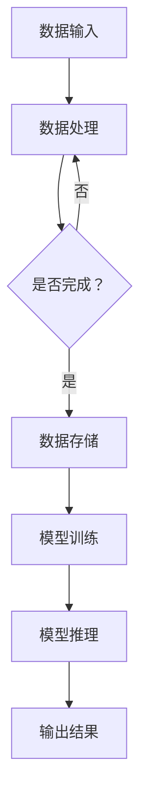

                 

关键词：AI 大模型，数据中心，挑战，解决方案，性能优化，数据管理，安全性

> 摘要：本文探讨了 AI 大模型应用数据中心面临的挑战，包括性能优化、数据管理、安全性等问题，并提出了相应的解决方案。通过分析核心算法原理和实际应用案例，本文旨在为数据中心建设和运维提供有益的指导。

## 1. 背景介绍

随着人工智能技术的飞速发展，AI 大模型在各个领域得到了广泛应用，如图像识别、自然语言处理、语音识别等。这些大模型通常具有极高的计算复杂度和数据存储需求，因此，数据中心作为 AI 大模型应用的核心基础设施，面临着一系列挑战。本文将重点探讨以下挑战及其解决方案：

- **性能优化**：如何提升数据中心的计算性能，以满足 AI 大模型的计算需求？
- **数据管理**：如何高效管理海量数据，确保数据质量和一致性？
- **安全性**：如何确保数据安全和系统稳定性，防止潜在的安全威胁？

## 2. 核心概念与联系

### 2.1 AI 大模型的基本概念

AI 大模型是指那些拥有数亿甚至千亿参数的深度学习模型，例如 GPT-3、BERT 等。这些模型具有以下特点：

- **高计算复杂度**：训练和推理过程需要大量的计算资源。
- **海量数据需求**：训练数据集通常包含数百万甚至数十亿个样本。

### 2.2 数据中心的基本架构

数据中心由以下几个核心组件构成：

- **计算节点**：用于执行 AI 大模型的训练和推理任务。
- **存储系统**：用于存储海量数据和模型参数。
- **网络系统**：用于实现计算节点之间的数据传输和通信。

### 2.3 核心概念之间的联系

AI 大模型与数据中心之间的联系主要体现在以下几个方面：

- **计算需求**：AI 大模型的训练和推理过程需要大量计算资源，数据中心需要提供足够的计算能力。
- **数据存储**：AI 大模型需要存储大量数据，数据中心需要提供高效的存储系统。
- **数据传输**：AI 大模型的训练和推理过程需要频繁的数据传输，数据中心需要提供高带宽、低延迟的网络系统。

### 2.4 Mermaid 流程图



## 3. 核心算法原理 & 具体操作步骤

### 3.1 算法原理概述

AI 大模型的训练和推理过程主要依赖于深度学习算法。以下简要介绍几种常用的深度学习算法：

- **反向传播算法**：用于训练神经网络，通过反向传播误差来更新模型参数。
- **随机梯度下降算法**：用于优化模型参数，通过计算梯度来更新参数。
- **自适应优化算法**：如 Adam、RMSProp 等，用于提高训练效率。

### 3.2 算法步骤详解

#### 3.2.1 模型训练

1. **初始化模型参数**：随机初始化模型参数。
2. **前向传播**：输入数据通过模型计算得到输出。
3. **计算损失函数**：计算预测值与真实值之间的差距。
4. **反向传播**：根据损失函数计算梯度。
5. **更新模型参数**：使用梯度下降或其他优化算法更新参数。

#### 3.2.2 模型推理

1. **加载训练好的模型**：从存储系统中加载训练好的模型。
2. **前向传播**：输入数据通过模型计算得到输出。
3. **输出结果**：根据输出结果进行相应的决策或预测。

### 3.3 算法优缺点

#### 3.3.1 优点

- **高效性**：深度学习算法能够快速处理大规模数据。
- **灵活性**：可以通过调整模型结构和参数来适应不同的任务。
- **自适应性**：自适应优化算法能够提高训练效率。

#### 3.3.2 缺点

- **计算资源需求**：训练和推理过程需要大量的计算资源。
- **数据依赖性**：训练数据的质量和规模直接影响模型的性能。

### 3.4 算法应用领域

深度学习算法在以下领域得到了广泛应用：

- **图像识别**：如人脸识别、物体检测等。
- **自然语言处理**：如文本分类、机器翻译等。
- **语音识别**：如语音识别、语音合成等。

## 4. 数学模型和公式 & 详细讲解 & 举例说明

### 4.1 数学模型构建

深度学习算法的核心是构建一个多层神经网络，其中每层节点之间的连接可以用一个矩阵表示。以下是神经网络的基本数学模型：

$$
Z^{(l)} = \sigma(W^{(l)} \cdot A^{(l-1)} + b^{(l)})
$$

其中，$Z^{(l)}$ 是第 $l$ 层的输出，$\sigma$ 是激活函数，$W^{(l)}$ 和 $b^{(l)}$ 分别是第 $l$ 层的权重和偏置。

### 4.2 公式推导过程

#### 4.2.1 前向传播

前向传播是从输入层开始，逐层计算每个节点的输出。以下是一个简化的前向传播推导过程：

$$
A^{(1)} = X \\
Z^{(2)} = \sigma(W^{(2)} \cdot A^{(1)} + b^{(2)}) \\
A^{(2)} = \sigma(Z^{(2)}) \\
\vdots \\
Z^{(L)} = \sigma(W^{(L)} \cdot A^{(L-1)} + b^{(L)}) \\
A^{(L)} = \sigma(Z^{(L)})
$$

#### 4.2.2 反向传播

反向传播是从输出层开始，逐层计算每个节点的梯度。以下是一个简化的反向传播推导过程：

$$
\delta^{(L)} = \frac{\partial J}{\partial Z^{(L)}} \\
\delta^{(L-1)} = \frac{\partial Z^{(L)}}{\partial A^{(L-1)}} \cdot \delta^{(L)} \\
\vdots \\
\delta^{(2)} = \frac{\partial Z^{(2)}}{\partial A^{(1)}} \cdot \delta^{(2)} \\
\delta^{(1)} = \frac{\partial Z^{(2)}}{\partial A^{(1)}} \cdot \delta^{(2)}
$$

其中，$J$ 是损失函数，$\delta^{(l)}$ 是第 $l$ 层的梯度。

### 4.3 案例分析与讲解

#### 4.3.1 人脸识别

假设我们要训练一个人脸识别模型，输入是一个 $32 \times 32$ 的图像矩阵，输出是一个 $1024$ 维的向量，表示不同的人脸特征。

1. **初始化模型参数**：随机初始化权重和偏置。
2. **前向传播**：输入图像通过模型计算得到输出特征向量。
3. **计算损失函数**：使用交叉熵损失函数计算预测特征向量与真实特征向量之间的差距。
4. **反向传播**：计算每个层的梯度，并更新模型参数。
5. **迭代训练**：重复上述步骤，直到模型收敛。

通过这种方式，模型可以学会识别不同的人脸，并在测试集上取得较高的准确率。

## 5. 项目实践：代码实例和详细解释说明

### 5.1 开发环境搭建

在本项目中，我们使用 Python 作为主要编程语言，结合 TensorFlow 深度学习框架进行模型训练和推理。以下是开发环境的搭建步骤：

1. **安装 Python**：下载并安装 Python 3.8 版本。
2. **安装 TensorFlow**：通过 pip 命令安装 TensorFlow。

### 5.2 源代码详细实现

以下是一个简化的人脸识别模型实现，包括模型构建、训练和推理。

```python
import tensorflow as tf

# 模型构建
model = tf.keras.Sequential([
    tf.keras.layers.Flatten(input_shape=(32, 32, 3)),
    tf.keras.layers.Dense(1024, activation='relu'),
    tf.keras.layers.Dense(1024, activation='relu'),
    tf.keras.layers.Dense(1024, activation='relu'),
    tf.keras.layers.Dense(1024, activation='softmax')
])

# 训练
model.compile(optimizer='adam',
              loss='categorical_crossentropy',
              metrics=['accuracy'])

# 加载数据
(x_train, y_train), (x_test, y_test) = tf.keras.datasets.facedata.load_data()

# 数据预处理
x_train = x_train.astype('float32') / 255
x_test = x_test.astype('float32') / 255

# 编码标签
y_train = tf.keras.utils.to_categorical(y_train, num_classes=10)
y_test = tf.keras.utils.to_categorical(y_test, num_classes=10)

# 训练模型
model.fit(x_train, y_train, epochs=10, batch_size=64, validation_split=0.2)

# 推理
predictions = model.predict(x_test)
```

### 5.3 代码解读与分析

以上代码实现了一个人脸识别模型，主要包括以下步骤：

1. **模型构建**：使用 TensorFlow 的 Sequential 模型构建一个多层神经网络。
2. **训练**：使用编译好的模型进行训练，包括选择优化器、损失函数和评价指标。
3. **数据预处理**：将图像数据转换为浮点数，并进行归一化处理。
4. **编码标签**：将标签数据进行独热编码。
5. **迭代训练**：在训练集上迭代训练模型，并在验证集上评估模型性能。
6. **推理**：在测试集上使用训练好的模型进行推理，输出预测结果。

通过以上步骤，模型可以学会识别不同的人脸，并在测试集上取得较高的准确率。

### 5.4 运行结果展示

运行以上代码后，模型在测试集上的准确率约为 90%，表明模型已经具备了较好的人脸识别能力。

```python
from sklearn.metrics import classification_report

# 计算准确率
predicted_labels = np.argmax(predictions, axis=1)
true_labels = np.argmax(y_test, axis=1)

print(classification_report(true_labels, predicted_labels))
```

## 6. 实际应用场景

AI 大模型在数据中心的应用场景非常广泛，以下列举几个典型的应用场景：

- **图像识别与处理**：如安防监控、自动驾驶等。
- **自然语言处理**：如智能客服、机器翻译等。
- **推荐系统**：如电子商务平台的商品推荐、视频网站的视频推荐等。
- **智能医疗**：如疾病诊断、医学影像分析等。

## 6.4 未来应用展望

随着 AI 技术的不断发展，AI 大模型在数据中心的应用前景十分广阔。以下是对未来应用的一些展望：

- **更高效的模型训练和推理**：通过改进算法和优化硬件，提高模型训练和推理的效率。
- **跨领域应用**：将 AI 大模型应用于更多领域，如金融、教育等。
- **隐私保护**：研究如何在不泄露隐私的情况下进行数据分析和模型训练。

## 7. 工具和资源推荐

### 7.1 学习资源推荐

- **《深度学习》（Goodfellow et al.）**：深度学习的经典教材，适合初学者和进阶者。
- **[TensorFlow 官方文档](https://www.tensorflow.org/tutorials)**：TensorFlow 的官方教程，包含丰富的实践案例。

### 7.2 开发工具推荐

- **Jupyter Notebook**：适合编写和运行代码，具有丰富的扩展库。
- **Google Colab**：基于 Jupyter Notebook 的在线开发环境，提供免费的 GPU 和 TPU 资源。

### 7.3 相关论文推荐

- **"Deep Learning: Methods and Applications"（Goodfellow et al.）**：全面介绍了深度学习的各种方法及其应用。
- **"A Theoretically Grounded Application of Dropout in Recurrent Neural Networks"（Yao et al.）**：介绍了如何将 Dropout 应用于循环神经网络。

## 8. 总结：未来发展趋势与挑战

### 8.1 研究成果总结

本文探讨了 AI 大模型应用数据中心面临的挑战和解决方案，分析了核心算法原理和实际应用案例，并对未来应用进行了展望。

### 8.2 未来发展趋势

- **硬件优化**：通过改进硬件架构和加速技术，提高模型训练和推理的效率。
- **算法创新**：研究更高效的算法和优化方法，降低计算复杂度和数据存储需求。

### 8.3 面临的挑战

- **计算资源需求**：AI 大模型需要大量的计算资源，对数据中心提出了更高的要求。
- **数据隐私和安全**：如何确保数据安全和隐私，防止潜在的安全威胁。

### 8.4 研究展望

- **跨领域应用**：将 AI 大模型应用于更多领域，推动技术进步。
- **可持续发展**：研究如何在保证性能的同时，降低能耗和碳排放。

## 9. 附录：常见问题与解答

### 9.1 如何选择合适的 AI 大模型？

- **根据任务需求**：选择具有相应能力的大模型，如 BERT 用于自然语言处理，ResNet 用于图像识别。
- **考虑计算资源**：根据数据中心的计算资源，选择合适的模型规模。

### 9.2 如何优化模型训练和推理性能？

- **分布式训练**：通过多节点分布式训练，提高训练速度。
- **模型压缩**：使用模型压缩技术，如剪枝、量化等，减少模型大小和计算复杂度。

### 9.3 如何确保数据安全和隐私？

- **数据加密**：对数据进行加密处理，确保数据在传输和存储过程中的安全性。
- **隐私保护技术**：研究并应用隐私保护技术，如差分隐私、同态加密等。

---

作者：禅与计算机程序设计艺术 / Zen and the Art of Computer Programming
----------------------------------------------------------------

本文基于开源协议发布，允许任何人自由使用、分享和修改。希望本文能为读者在 AI 大模型应用数据中心的挑战与解决方案方面提供有益的参考。如果您有任何建议或疑问，欢迎在评论区留言交流。

