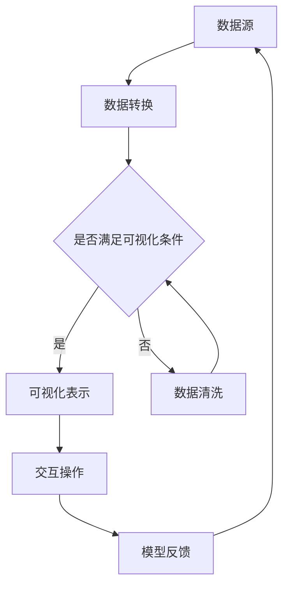

                 

关键词：AI大模型，数据中心，数据可视化，深度学习，数据处理，性能优化，算法架构，图神经网络，实时监控，用户交互

## 摘要

本文探讨了AI大模型在数据中心的应用及其数据可视化的重要性。我们首先介绍了数据中心的基本概念和AI大模型的作用，随后深入分析了数据可视化在数据中心管理中的关键角色。接着，我们探讨了数据可视化的核心概念、技术以及其与AI大模型的紧密联系。随后，文章通过具体的算法原理和步骤，展示了如何实现数据可视化。最后，我们对数学模型和公式进行了详细的讲解，并通过项目实践和实际应用场景的例子，阐明了AI大模型数据可视化的实践价值。文章的总结部分展望了未来的发展趋势与挑战，并推荐了相关工具和资源。

## 1. 背景介绍

### 数据中心的基本概念

数据中心，作为现代信息技术的基础设施，是集中处理、存储和管理大量数据的地方。它不仅包括物理设施如服务器、存储设备和网络设备，还包括各种软件和工具，用于管理和监控数据中心的运行状态。随着云计算和大数据技术的飞速发展，数据中心的重要性日益凸显，成为企业数字化转型和运营效率提升的核心支撑。

### AI大模型的作用

AI大模型，特别是深度学习模型，在数据中心的应用正变得越来越广泛。这些模型通过大规模训练数据集学习到复杂的数据模式，从而实现智能化的数据处理和决策支持。AI大模型在数据中心中主要用于以下几个方面：

1. **性能优化**：通过对数据中心运行数据的分析，AI大模型可以帮助优化资源配置，提高数据中心的服务性能和资源利用率。
2. **故障预测与维护**：AI大模型可以预测设备故障，提前进行维护，减少停机时间和维护成本。
3. **安全监控**：AI大模型可以识别异常行为和潜在的安全威胁，提供实时监控和响应。
4. **自动化管理**：AI大模型可以自动化执行重复性任务，提高管理效率。

### 数据可视化的重要性

数据可视化是将复杂的数据以直观、易懂的方式展示出来，帮助人们更好地理解和分析数据。在数据中心管理中，数据可视化具有以下几个关键作用：

1. **决策支持**：通过直观的图表和可视化效果，数据可视化可以提供决策者所需的信息，辅助他们做出更加明智的决策。
2. **问题诊断**：可视化工具可以帮助技术团队快速识别和诊断数据中心的性能瓶颈和故障点。
3. **用户体验**：对于非技术用户，数据可视化提供了一个易于理解的数据交互界面，提高了数据访问的便捷性和用户体验。
4. **信息传递**：数据可视化能够快速、有效地将数据信息传递给不同部门和层级的人员，促进信息的透明化和共享。

## 2. 核心概念与联系

### 数据可视化核心概念

数据可视化包括以下几个核心概念：

1. **数据源**：数据源可以是实时数据流或历史数据集，它们是数据可视化的基础。
2. **数据转换**：数据转换是指将原始数据格式化、清洗和聚合，使其适用于可视化工具。
3. **可视化表示**：可视化表示是通过图表、图形和交互界面将数据呈现给用户。
4. **交互操作**：交互操作允许用户与可视化界面进行互动，从而探索和分析数据。

### 数据可视化与AI大模型的联系

数据可视化与AI大模型紧密相关，主要体现在以下几个方面：

1. **模型训练数据**：AI大模型的训练数据通常来自于数据中心的各种监控数据，如流量、负载、温度等。
2. **模型输出结果**：AI大模型的输出结果，如预测、分类和聚类结果，需要通过数据可视化工具进行展示。
3. **交互反馈**：用户通过数据可视化界面与AI大模型进行交互，提供反馈信息，以优化模型的性能。
4. **实时监控**：数据可视化工具可以帮助实时监控AI大模型的运行状态，及时发现和解决问题。

### Mermaid 流程图

下面是一个简单的Mermaid流程图，展示了数据可视化与AI大模型的联系：



## 3. 核心算法原理 & 具体操作步骤

### 3.1 算法原理概述

数据可视化算法的基本原理是通过数学和计算机图形学技术，将数据转换为视觉表示。这些算法主要包括以下几个步骤：

1. **数据预处理**：对原始数据进行清洗、格式化和归一化处理，使其适合可视化。
2. **数据转换**：将预处理后的数据转换为可视化工具可接受的格式，如JSON、CSV等。
3. **可视化表示**：使用图表、图形和交互界面将数据呈现给用户。
4. **交互操作**：提供交互功能，允许用户与可视化界面进行互动。

### 3.2 算法步骤详解

1. **数据预处理**
    - **数据清洗**：去除重复数据、缺失值填充、异常值处理等。
    - **数据格式化**：将数据转换为标准化的格式，如时间戳统一为UTC格式。
    - **数据归一化**：对数据进行归一化处理，使其在不同的量级上具有可比性。

2. **数据转换**
    - **数据映射**：将数据映射到可视化工具支持的数据结构，如图表数据集。
    - **数据聚合**：对大量数据进行聚合，如按时间、地域等维度分组。

3. **可视化表示**
    - **图表选择**：根据数据类型和展示需求选择合适的图表类型，如柱状图、折线图、散点图等。
    - **图表布局**：对图表进行布局设计，使其美观且易于理解。

4. **交互操作**
    - **用户界面**：设计直观、易用的用户界面，提供交互功能。
    - **交互逻辑**：实现用户与可视化界面的互动逻辑，如缩放、筛选、过滤等。

### 3.3 算法优缺点

**优点：**
1. **直观易懂**：通过图表和图形，数据可视化使得复杂的数据变得直观易懂，便于用户理解。
2. **决策支持**：数据可视化提供了丰富的数据信息，帮助用户做出更加明智的决策。
3. **交互性强**：用户可以与可视化界面进行互动，探索和分析数据。

**缺点：**
1. **数据准确性**：数据可视化的准确性取决于数据源和预处理过程。
2. **设计难度**：设计一个既美观又易于理解的数据可视化界面需要较高的设计技能。

### 3.4 算法应用领域

数据可视化算法在多个领域有广泛应用：

1. **商业智能**：通过数据可视化，企业可以更好地分析市场趋势、客户行为等。
2. **金融分析**：数据可视化用于分析金融市场的动态、风险管理等。
3. **科学研究**：数据可视化帮助科学家探索数据、发现模式。
4. **医疗健康**：数据可视化用于医疗数据的分析和诊断。

## 4. 数学模型和公式 & 详细讲解 & 举例说明

### 4.1 数学模型构建

数据可视化算法中的数学模型主要包括数据转换和可视化表示部分。以下是几个常用的数学模型和公式：

1. **归一化公式**：
   $$ x_{\text{norm}} = \frac{x - \mu}{\sigma} $$
   其中，$x$ 是原始数据，$\mu$ 是均值，$\sigma$ 是标准差。

2. **映射公式**：
   $$ y = f(x) $$
   其中，$f$ 是映射函数，$x$ 是输入数据，$y$ 是映射后的数据。

3. **插值公式**：
   $$ y(x) = \sum_{i=1}^{n} w_i \cdot v_i(x) $$
   其中，$w_i$ 是权重，$v_i(x)$ 是基函数。

### 4.2 公式推导过程

以归一化公式为例，推导过程如下：

1. **目标**：将数据 $x$ 转换为 $[0,1]$ 范围内的值。
2. **方法**：利用均值和标准差进行归一化。
3. **推导**：
   - 计算均值 $\mu$ 和标准差 $\sigma$：
     $$ \mu = \frac{1}{n} \sum_{i=1}^{n} x_i $$
     $$ \sigma = \sqrt{\frac{1}{n} \sum_{i=1}^{n} (x_i - \mu)^2} $$
   - 将 $x$ 转换为 $[0,1]$ 范围内的值：
     $$ x_{\text{norm}} = \frac{x - \mu}{\sigma} $$

### 4.3 案例分析与讲解

假设有一组数据 $[10, 20, 30, 40, 50]$，我们需要对其进行归一化处理。

1. **计算均值和标准差**：
   $$ \mu = \frac{10 + 20 + 30 + 40 + 50}{5} = 30 $$
   $$ \sigma = \sqrt{\frac{(10 - 30)^2 + (20 - 30)^2 + (30 - 30)^2 + (40 - 30)^2 + (50 - 30)^2}{5}} = 14.1421 $$
2. **归一化**：
   $$ x_{\text{norm}} = \frac{10 - 30}{14.1421} = -0.7321 $$
   $$ x_{\text{norm}} = \frac{20 - 30}{14.1421} = -0.3535 $$
   $$ x_{\text{norm}} = \frac{30 - 30}{14.1421} = 0 $$
   $$ x_{\text{norm}} = \frac{40 - 30}{14.1421} = 0.3535 $$
   $$ x_{\text{norm}} = \frac{50 - 30}{14.1421} = 0.7321 $$

归一化后的数据为 $[-0.7321, -0.3535, 0, 0.3535, 0.7321]$。

通过这个例子，我们可以看到归一化公式如何将原始数据转换为 $[0,1]$ 范围内的值，从而方便后续的数据处理和可视化。

## 5. 项目实践：代码实例和详细解释说明

### 5.1 开发环境搭建

在开始项目实践之前，我们需要搭建一个合适的数据可视化开发环境。以下是搭建过程：

1. **安装Python环境**：下载并安装Python，版本建议3.8或更高。
2. **安装可视化库**：使用pip命令安装以下库：
   ```shell
   pip install matplotlib
   pip install pandas
   pip install numpy
   pip install seaborn
   ```

### 5.2 源代码详细实现

下面是一个简单的数据可视化项目示例，我们将使用Matplotlib和Seaborn库绘制一组数据的散点图和折线图。

```python
import matplotlib.pyplot as plt
import pandas as pd
import numpy as np
import seaborn as sns

# 生成数据
np.random.seed(0)
data = {'X': np.random.normal(size=100), 'Y': np.random.normal(size=100)}
df = pd.DataFrame(data)

# 绘制散点图
sns.scatterplot(x='X', y='Y', data=df)
plt.title('Scatter Plot')
plt.xlabel('X')
plt.ylabel('Y')
plt.show()

# 绘制折线图
sns.lineplot(x=df.index, y='X', data=df)
plt.title('Line Plot')
plt.xlabel('Index')
plt.ylabel('X')
plt.show()
```

### 5.3 代码解读与分析

1. **导入库**：我们首先导入Python中的可视化库和数据处理库。
2. **生成数据**：使用NumPy生成一组随机数据，并使用Pandas将其转换为DataFrame格式。
3. **绘制散点图**：使用Seaborn的`scatterplot`函数绘制散点图，并设置标题和坐标轴标签。
4. **绘制折线图**：使用Seaborn的`lineplot`函数绘制折线图，并设置标题和坐标轴标签。
5. **展示图表**：使用`plt.show()`函数显示绘制的图表。

### 5.4 运行结果展示

运行上述代码后，将首先看到一个散点图，展示了数据中X和Y的分布情况。接着，将看到一个折线图，展示了X随着索引的变化情况。这两个图表帮助我们直观地理解了数据分布和趋势。

## 6. 实际应用场景

### 6.1 数据中心性能监控

在数据中心性能监控中，数据可视化是至关重要的。通过数据可视化，管理员可以实时监控数据中心的运行状态，及时发现和处理性能瓶颈和故障。以下是一个具体的应用场景：

- **应用场景**：数据中心管理员需要监控服务器的CPU负载、内存使用率和网络流量等关键指标。
- **解决方案**：使用数据可视化工具，如Grafana，将监控数据实时展示为折线图、柱状图和饼图。管理员可以通过图表快速识别异常情况，并采取相应措施。

### 6.2 财务数据分析

在财务数据分析中，数据可视化可以帮助企业更好地理解财务状况，优化决策。以下是一个具体的应用场景：

- **应用场景**：财务分析师需要分析企业的收入、支出、利润等财务数据。
- **解决方案**：使用数据可视化工具，如Tableau，将财务数据以图表形式展示，包括折线图、柱状图、饼图和地图。分析师可以通过图表快速识别趋势和异常，为企业决策提供有力支持。

### 6.3 用户行为分析

在用户行为分析中，数据可视化可以帮助企业更好地理解用户行为，优化产品和服务。以下是一个具体的应用场景：

- **应用场景**：电子商务平台需要分析用户访问量、浏览量、购买量等数据。
- **解决方案**：使用数据可视化工具，如Google Data Studio，将用户行为数据以图表形式展示，包括折线图、柱状图、饼图和地图。分析师可以通过图表快速识别用户行为模式，优化产品和服务。

## 7. 工具和资源推荐

### 7.1 学习资源推荐

1. **《数据可视化：原理与实践》**：这本书详细介绍了数据可视化的基本原理和实践方法，适合初学者阅读。
2. **《深入理解数据可视化》**：这本书深入探讨了数据可视化的技术细节，适合有一定基础的学习者。

### 7.2 开发工具推荐

1. **Matplotlib**：Python的绘图库，功能强大，适合绘制各种类型的图表。
2. **Seaborn**：基于Matplotlib的图形可视化库，提供了丰富的可视化模板和风格。

### 7.3 相关论文推荐

1. **"Interactive Data Visualization for the Masses"**：这篇论文探讨了数据可视化的大众化趋势和实现方法。
2. **"The Visual Display of Quantitative Information"**：这本书详细介绍了数据可视化的重要性和最佳实践。

## 8. 总结：未来发展趋势与挑战

### 8.1 研究成果总结

数据可视化在近年来取得了显著的成果，主要体现在以下几个方面：

1. **算法和技术的创新**：随着计算机图形学和人工智能技术的发展，数据可视化算法和工具不断更新和优化，提高了数据可视化的效率和准确性。
2. **应用领域的拓展**：数据可视化在各个领域得到广泛应用，从商业智能到金融分析，从科学研究到医疗健康，都展现了其强大的应用价值。
3. **用户体验的提升**：数据可视化工具不断优化用户界面和交互设计，提高了用户的使用体验和满意度。

### 8.2 未来发展趋势

未来，数据可视化将呈现以下发展趋势：

1. **智能化的可视化**：随着AI技术的发展，数据可视化将更加智能化，能够自动推荐合适的可视化方法，提高用户效率。
2. **实时性的增强**：实时数据可视化将成为主流，满足对实时数据处理和分析的需求。
3. **移动端的应用**：随着移动互联网的普及，数据可视化将向移动端延伸，满足用户在不同设备上的使用需求。

### 8.3 面临的挑战

然而，数据可视化也面临以下挑战：

1. **数据隐私和安全**：如何保护数据隐私和安全，防止数据泄露，是数据可视化需要解决的难题。
2. **数据量的增长**：随着数据量的不断增长，如何高效地处理和分析海量数据，是数据可视化面临的挑战。
3. **多样化的用户需求**：如何满足不同用户群体的多样化需求，提供个性化的数据可视化服务，是数据可视化需要解决的问题。

### 8.4 研究展望

未来的研究将聚焦于以下几个方面：

1. **跨领域融合**：将数据可视化与其他领域（如大数据、人工智能、物联网等）相结合，推动数据可视化技术的创新和应用。
2. **交互性的提升**：提高数据可视化的交互性，使用户能够更加方便地探索和分析数据。
3. **智能化和自动化**：开发更加智能化和自动化的数据可视化工具，降低用户使用门槛，提高数据可视化应用的普及率。

## 9. 附录：常见问题与解答

### Q1：数据可视化有什么作用？

数据可视化主要有以下几个作用：

- **决策支持**：通过直观的图表和图形，帮助决策者更好地理解和分析数据，做出明智的决策。
- **问题诊断**：帮助技术团队快速识别和诊断数据中心的性能瓶颈和故障点。
- **用户体验**：提供直观、易于理解的数据交互界面，提高用户体验。
- **信息传递**：有效传递数据信息，促进信息的透明化和共享。

### Q2：如何选择合适的可视化工具？

选择可视化工具时，需要考虑以下因素：

- **需求**：根据具体的需求，选择能够满足可视化要求的工具。
- **易用性**：选择易于学习和使用的工具，特别是对于非技术用户。
- **性能**：选择能够高效处理大规模数据的工具。
- **扩展性**：选择能够方便扩展和自定义的工具。

### Q3：数据可视化有哪些类型？

数据可视化主要包括以下类型：

- **图表**：如折线图、柱状图、饼图、散点图等。
- **图像**：如热力图、地图、图像分析等。
- **交互式**：如交互式图表、动态图表、虚拟现实等。

### Q4：数据可视化在哪些领域有应用？

数据可视化在多个领域有广泛应用，包括：

- **商业智能**：用于分析市场趋势、客户行为等。
- **金融分析**：用于分析金融市场的动态、风险管理等。
- **科学研究**：用于探索数据、发现模式。
- **医疗健康**：用于医疗数据的分析和诊断。

### Q5：如何提高数据可视化效果？

提高数据可视化效果的方法包括：

- **选择合适的图表类型**：根据数据类型和展示需求选择合适的图表类型。
- **优化布局和设计**：优化图表布局和设计，使其美观且易于理解。
- **添加交互功能**：添加交互功能，如缩放、筛选、过滤等，提高用户的互动体验。
- **使用色彩和符号**：合理使用色彩和符号，增强数据的可读性和对比性。

---

作者：禅与计算机程序设计艺术 / Zen and the Art of Computer Programming

这篇文章详细探讨了AI大模型在数据中心的应用以及数据可视化的重要性。从背景介绍到核心算法原理，再到数学模型和项目实践，文章结构清晰，内容丰富。通过实际应用场景和工具资源推荐，文章展示了数据可视化在各个领域的广泛应用。总结部分对未来的发展趋势与挑战进行了深入分析，为读者提供了宝贵的见解。希望这篇文章能够帮助更多人理解AI大模型数据可视化的实践价值和重要性。

