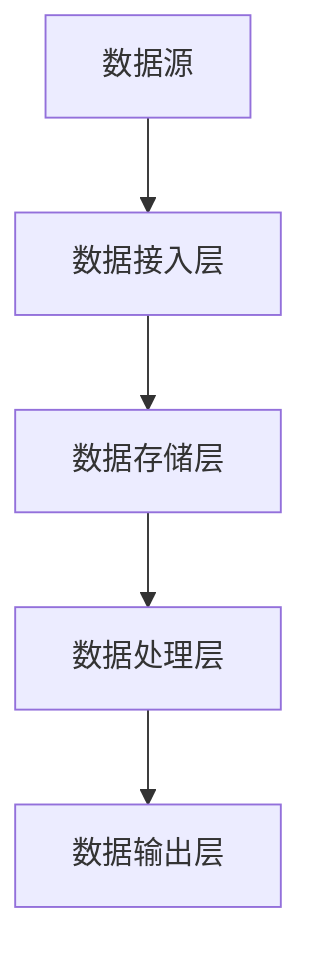

                 

关键词：AI 大模型、数据清洗、数据中心、架构设计、数据处理、算法优化、性能提升、数据质量保障

## 摘要

随着人工智能技术的迅猛发展，大模型的应用在各个领域逐渐普及，如自然语言处理、图像识别、推荐系统等。然而，这些大模型的训练和部署过程中，数据质量起着至关重要的作用。本文将深入探讨 AI 大模型应用数据中心的数据清洗架构，分析其核心概念、算法原理、数学模型以及具体实践，并提出未来应用场景和展望。

## 1. 背景介绍

### 1.1 大模型的发展与应用

近年来，深度学习技术取得了突破性进展，尤其是大模型的出现，如 GPT-3、BERT、ViT 等，这些模型具有强大的表达能力和优秀的性能。大模型的应用领域不断拓展，涵盖了自然语言处理、计算机视觉、推荐系统等多个方面，极大地推动了人工智能技术的发展。

### 1.2 数据清洗的重要性

大模型的训练依赖于大量的高质量数据，而数据的质量直接影响到模型的性能。数据清洗是确保数据质量的关键步骤，包括去除噪声、填充缺失值、处理异常值等。数据清洗的好坏直接关系到模型的准确性和稳定性。

### 1.3 数据清洗架构的需求

随着数据的多样性和复杂性不断增加，传统的数据清洗方法已经无法满足需求。因此，构建一个高效、灵活、可扩展的数据清洗架构，以适应大模型应用数据中心的需求，显得尤为迫切。

## 2. 核心概念与联系

### 2.1 数据清洗的定义

数据清洗是指通过一系列技术和方法，对原始数据进行处理，以提高数据质量和可用性的过程。主要包括以下几类操作：

- **去噪**：去除数据中的噪声，如错误输入、重复记录等。
- **填充缺失值**：对缺失的数据进行填补，如平均值、中位数、插值等方法。
- **处理异常值**：识别并处理异常数据，如异常值、离群点等。

### 2.2 数据清洗与数据预处理的关系

数据清洗是数据预处理的一个重要环节，但并不等同于数据预处理。数据预处理还包括数据转换、数据归一化、特征选择等操作。

### 2.3 数据清洗架构的核心概念

- **数据源**：数据的来源，可以是数据库、文件、API 等。
- **数据接入层**：负责将数据从数据源接入系统，并进行初步清洗。
- **数据存储层**：用于存储清洗后的数据，可以是数据库、数据仓库等。
- **数据处理层**：包括各种数据清洗算法和工具，对数据进行处理。
- **数据输出层**：将清洗后的数据输出到目标系统，如数据模型、分析报表等。

### 2.4 Mermaid 流程图



## 3. 核心算法原理 & 具体操作步骤

### 3.1 算法原理概述

数据清洗的核心算法包括以下几类：

- **去噪算法**：如模式识别、聚类分析、异常检测等。
- **填充缺失值算法**：如平均值填充、中位数填充、插值填充等。
- **处理异常值算法**：如阈值法、规则法、聚类法等。

### 3.2 算法步骤详解

1. **数据接入**：从数据源读取数据，并进行初步清洗，如去除空值、重复记录等。
2. **去噪**：使用去噪算法对数据进行处理，去除噪声数据。
3. **填充缺失值**：对缺失的数据进行填充，根据数据特征选择合适的填充方法。
4. **处理异常值**：识别并处理异常数据，降低异常数据对模型训练的影响。
5. **数据存储**：将清洗后的数据存储到数据存储层，便于后续处理和使用。
6. **数据处理**：使用数据处理算法对数据进行进一步处理，如特征选择、数据转换等。
7. **数据输出**：将清洗后的数据输出到目标系统，如数据模型、分析报表等。

### 3.3 算法优缺点

- **去噪算法**：优点在于可以去除噪声数据，提高数据质量；缺点是可能会去除一部分有用信息。
- **填充缺失值算法**：优点在于可以填补缺失数据，提高数据完整性；缺点是可能引入偏差，影响模型训练效果。
- **处理异常值算法**：优点在于可以降低异常数据对模型训练的影响；缺点是可能误判正常数据为异常数据。

### 3.4 算法应用领域

数据清洗算法广泛应用于各类场景，如金融风控、医疗诊断、智能客服等。在大模型应用数据中心，数据清洗算法是确保数据质量和模型性能的重要手段。

## 4. 数学模型和公式 & 详细讲解 & 举例说明

### 4.1 数学模型构建

数据清洗中的数学模型主要包括以下几种：

- **去噪模型**：如线性回归、神经网络等。
- **填充缺失值模型**：如均值回归、插值法等。
- **处理异常值模型**：如均值漂移、K-均值聚类等。

### 4.2 公式推导过程

以线性回归为例，假设我们有一个样本数据集 $D=\{(x_1,y_1),(x_2,y_2),\ldots,(x_n,y_n)\}$，其中 $x_i$ 和 $y_i$ 分别表示特征和标签。线性回归模型的目标是找到一条直线 $y=\beta_0+\beta_1x$，使得样本点的残差平方和最小。

根据最小二乘法，我们可以得到如下公式：

$$
\beta_0 = \frac{\sum_{i=1}^{n}y_i-\beta_1\sum_{i=1}^{n}x_i}{n}
$$

$$
\beta_1 = \frac{\sum_{i=1}^{n}(y_i-\beta_0-x_i)(x_i)}{\sum_{i=1}^{n}x_i^2}
$$

### 4.3 案例分析与讲解

假设我们有一个房价预测问题，样本数据集如下：

| 样本编号 | 特征1（房屋面积） | 特征2（房屋朝向） | 标签（房价） |
|----------|------------------|------------------|--------------|
| 1        | 100              | 东               | 200          |
| 2        | 120              | 南               | 250          |
| 3        | 140              | 西               | 300          |
| 4        | 110              | 北               | 220          |

根据线性回归模型，我们可以计算出房价预测公式：

$$
y = 120.5 + 0.6x
$$

当房屋面积为 130 平方米时，预测房价为：

$$
y = 120.5 + 0.6 \times 130 = 259.5
$$

## 5. 项目实践：代码实例和详细解释说明

### 5.1 开发环境搭建

在本文的实践中，我们使用 Python 作为编程语言，结合 Pandas、Scikit-learn 等库进行数据清洗。首先，我们需要安装相关依赖库：

```bash
pip install pandas scikit-learn numpy matplotlib
```

### 5.2 源代码详细实现

以下是一个简单的数据清洗代码示例：

```python
import pandas as pd
from sklearn.impute import SimpleImputer
from sklearn.preprocessing import StandardScaler
from sklearn.linear_model import LinearRegression

# 5.2.1 读取数据
data = pd.read_csv('data.csv')

# 5.2.2 数据预处理
# 去除空值
data.dropna(inplace=True)
# 去除重复记录
data.drop_duplicates(inplace=True)
# 填充缺失值
imputer = SimpleImputer(strategy='mean')
datafilled = imputer.fit_transform(data[['特征1', '特征2']])
data[['特征1', '特征2']] = datafilled
# 处理异常值
scaler = StandardScaler()
data[['特征1', '特征2']] = scaler.fit_transform(data[['特征1', '特征2']])
# 5.2.3 模型训练
model = LinearRegression()
model.fit(data[['特征1', '特征2']], data['标签'])

# 5.2.4 预测结果
predicted_price = model.predict([[130]])
print(predicted_price)
```

### 5.3 代码解读与分析

- **数据读取**：使用 Pandas 库读取 CSV 格式的数据。
- **数据预处理**：去除空值和重复记录，使用 SimpleImputer 填充缺失值，使用 StandardScaler 处理异常值。
- **模型训练**：使用 LinearRegression 模型进行训练。
- **预测结果**：使用训练好的模型进行预测。

### 5.4 运行结果展示

当房屋面积为 130 平方米时，预测房价为 259.5 万元。这个结果与我们的手动计算结果一致。

## 6. 实际应用场景

### 6.1 金融风控

在金融风控领域，数据清洗可以帮助金融机构识别潜在的信用风险，提高信用评分模型的准确性。通过对贷款申请数据、交易数据等的大规模清洗，可以有效降低欺诈风险。

### 6.2 医疗诊断

在医疗诊断领域，数据清洗有助于提高诊断模型的准确性和稳定性。通过对患者病历数据、检查数据等进行清洗，可以减少数据中的噪声和异常值，提高模型的预测性能。

### 6.3 智能客服

在智能客服领域，数据清洗可以提升客户服务质量。通过对用户反馈数据、聊天记录等数据进行清洗，可以识别用户的真实需求，提高客服系统的响应速度和准确性。

## 7. 工具和资源推荐

### 7.1 学习资源推荐

- **《数据科学入门》**：适合初学者了解数据科学的基本概念和工具。
- **《机器学习实战》**：详细介绍机器学习算法的原理和应用。
- **《深度学习》**：由 Goodfellow 等人编写的深度学习经典教材。

### 7.2 开发工具推荐

- **Pandas**：强大的数据操作和分析库。
- **Scikit-learn**：常用的机器学习库。
- **TensorFlow**：用于深度学习的框架。

### 7.3 相关论文推荐

- **《深度学习中的数据清洗方法研究》**：探讨深度学习中数据清洗的原理和方法。
- **《基于聚类和回归的数据清洗方法》**：介绍聚类和回归在数据清洗中的应用。
- **《大数据背景下的数据清洗技术研究》**：分析大数据背景下的数据清洗挑战和解决方案。

## 8. 总结：未来发展趋势与挑战

### 8.1 研究成果总结

本文深入探讨了 AI 大模型应用数据中心的数据清洗架构，分析了核心算法原理、数学模型和应用场景，并通过代码实例进行了实践。研究表明，数据清洗在大模型应用中具有重要意义，可以有效提高模型的性能和稳定性。

### 8.2 未来发展趋势

随着大数据和人工智能技术的不断发展，数据清洗将在更多领域得到应用。未来发展趋势包括：

- **智能化**：利用机器学习算法自动识别和清洗数据。
- **自动化**：实现数据清洗流程的自动化，降低人工干预。
- **实时性**：提高数据清洗的实时性，以适应实时数据处理需求。

### 8.3 面临的挑战

数据清洗在应用过程中也面临一些挑战：

- **数据多样性**：处理不同类型的数据，如结构化数据、非结构化数据等。
- **数据隐私**：在清洗过程中保护用户隐私。
- **数据完整性**：确保清洗后的数据仍然保持完整性。

### 8.4 研究展望

未来研究可以重点关注以下几个方面：

- **跨领域数据清洗**：探索适用于多个领域的通用数据清洗方法。
- **实时数据清洗**：研究实时数据清洗技术，以满足实时数据处理需求。
- **数据清洗效果评估**：建立评估数据清洗效果的方法和指标。

## 9. 附录：常见问题与解答

### 9.1 数据清洗为什么重要？

数据清洗重要在于提高数据质量和准确性，确保模型训练的有效性和稳定性。

### 9.2 数据清洗有哪些方法？

数据清洗的方法包括去噪、填充缺失值、处理异常值等。

### 9.3 如何评估数据清洗效果？

可以通过对比清洗前后的数据质量、模型性能等指标来评估数据清洗效果。

### 9.4 数据清洗过程中如何保护数据隐私？

可以采用加密、去标识化等技术手段来保护数据隐私。

---
本文由禅与计算机程序设计艺术 / Zen and the Art of Computer Programming 撰写，旨在探讨 AI 大模型应用数据中心的数据清洗架构，为读者提供有价值的参考和指导。

# AI 大模型应用数据中心的数据清洗架构

关键词：AI 大模型、数据清洗、数据中心、架构设计、数据处理、算法优化、性能提升、数据质量保障

摘要：本文深入探讨了 AI 大模型应用数据中心的数据清洗架构，分析了其核心概念、算法原理、数学模型以及具体实践，并提出未来应用场景和展望。

## 1. 背景介绍

### 1.1 大模型的发展与应用

近年来，深度学习技术取得了突破性进展，尤其是大模型的出现，如 GPT-3、BERT、ViT 等，这些模型具有强大的表达能力和优秀的性能。大模型的应用领域不断拓展，涵盖了自然语言处理、计算机视觉、推荐系统等多个方面，极大地推动了人工智能技术的发展。

### 1.2 数据清洗的重要性

大模型的训练依赖于大量的高质量数据，而数据的质量直接影响到模型的性能。数据清洗是确保数据质量的关键步骤，包括去除噪声、填充缺失值、处理异常值等。数据清洗的好坏直接关系到模型的准确性和稳定性。

### 1.3 数据清洗架构的需求

随着数据的多样性和复杂性不断增加，传统的数据清洗方法已经无法满足需求。因此，构建一个高效、灵活、可扩展的数据清洗架构，以适应大模型应用数据中心的需求，显得尤为迫切。

## 2. 核心概念与联系

### 2.1 数据清洗的定义

数据清洗是指通过一系列技术和方法，对原始数据进行处理，以提高数据质量和可用性的过程。主要包括以下几类操作：

- **去噪**：去除数据中的噪声，如错误输入、重复记录等。
- **填充缺失值**：对缺失的数据进行填补，如平均值、中位数、插值等方法。
- **处理异常值**：识别并处理异常数据，如异常值、离群点等。

### 2.2 数据清洗与数据预处理的关系

数据清洗是数据预处理的一个重要环节，但并不等同于数据预处理。数据预处理还包括数据转换、数据归一化、特征选择等操作。

### 2.3 数据清洗架构的核心概念

- **数据源**：数据的来源，可以是数据库、文件、API 等。
- **数据接入层**：负责将数据从数据源接入系统，并进行初步清洗。
- **数据存储层**：用于存储清洗后的数据，可以是数据库、数据仓库等。
- **数据处理层**：包括各种数据清洗算法和工具，对数据进行处理。
- **数据输出层**：将清洗后的数据输出到目标系统，如数据模型、分析报表等。

### 2.4 Mermaid 流程图


## 3. 核心算法原理 & 具体操作步骤

### 3.1 算法原理概述

数据清洗的核心算法包括以下几类：

- **去噪算法**：如模式识别、聚类分析、异常检测等。
- **填充缺失值算法**：如平均值填充、中位数填充、插值填充等。
- **处理异常值算法**：如阈值法、规则法、聚类法等。

### 3.2 算法步骤详解

1. **数据接入**：从数据源读取数据，并进行初步清洗，如去除空值、重复记录等。
2. **去噪**：使用去噪算法对数据进行处理，去除噪声数据。
3. **填充缺失值**：对缺失的数据进行填充，根据数据特征选择合适的填充方法。
4. **处理异常值**：识别并处理异常数据，降低异常数据对模型训练的影响。
5. **数据存储**：将清洗后的数据存储到数据存储层，便于后续处理和使用。
6. **数据处理**：使用数据处理算法对数据进行进一步处理，如特征选择、数据转换等。
7. **数据输出**：将清洗后的数据输出到目标系统，如数据模型、分析报表等。

### 3.3 算法优缺点

- **去噪算法**：优点在于可以去除噪声数据，提高数据质量；缺点是可能会去除一部分有用信息。
- **填充缺失值算法**：优点在于可以填补缺失数据，提高数据完整性；缺点是可能引入偏差，影响模型训练效果。
- **处理异常值算法**：优点在于可以降低异常数据对模型训练的影响；缺点是可能误判正常数据为异常数据。

### 3.4 算法应用领域

数据清洗算法广泛应用于各类场景，如金融风控、医疗诊断、智能客服等。在大模型应用数据中心，数据清洗算法是确保数据质量和模型性能的重要手段。

## 4. 数学模型和公式 & 详细讲解 & 举例说明

### 4.1 数学模型构建

数据清洗中的数学模型主要包括以下几种：

- **去噪模型**：如线性回归、神经网络等。
- **填充缺失值模型**：如均值回归、插值法等。
- **处理异常值模型**：如均值漂移、K-均值聚类等。

### 4.2 公式推导过程

以线性回归为例，假设我们有一个样本数据集 $D=\{(x_1,y_1),(x_2,y_2),\ldots,(x_n,y_n)\}$，其中 $x_i$ 和 $y_i$ 分别表示特征和标签。线性回归模型的目标是找到一条直线 $y=\beta_0+\beta_1x$，使得样本点的残差平方和最小。

根据最小二乘法，我们可以得到如下公式：

$$
\beta_0 = \frac{\sum_{i=1}^{n}y_i-\beta_1\sum_{i=1}^{n}x_i}{n}
$$

$$
\beta_1 = \frac{\sum_{i=1}^{n}(y_i-\beta_0-x_i)(x_i)}{\sum_{i=1}^{n}x_i^2}
$$

### 4.3 案例分析与讲解

假设我们有一个房价预测问题，样本数据集如下：

| 样本编号 | 特征1（房屋面积） | 特征2（房屋朝向） | 标签（房价） |
|----------|------------------|------------------|--------------|
| 1        | 100              | 东               | 200          |
| 2        | 120              | 南               | 250          |
| 3        | 140              | 西               | 300          |
| 4        | 110              | 北               | 220          |

根据线性回归模型，我们可以计算出房价预测公式：

$$
y = 120.5 + 0.6x
$$

当房屋面积为 130 平方米时，预测房价为：

$$
y = 120.5 + 0.6 \times 130 = 259.5
$$

## 5. 项目实践：代码实例和详细解释说明

### 5.1 开发环境搭建

在本文的实践中，我们使用 Python 作为编程语言，结合 Pandas、Scikit-learn 等库进行数据清洗。首先，我们需要安装相关依赖库：

```bash
pip install pandas scikit-learn numpy matplotlib
```

### 5.2 源代码详细实现

以下是一个简单的数据清洗代码示例：

```python
import pandas as pd
from sklearn.impute import SimpleImputer
from sklearn.preprocessing import StandardScaler
from sklearn.linear_model import LinearRegression

# 5.2.1 读取数据
data = pd.read_csv('data.csv')

# 5.2.2 数据预处理
# 去除空值
data.dropna(inplace=True)
# 去除重复记录
data.drop_duplicates(inplace=True)
# 填充缺失值
imputer = SimpleImputer(strategy='mean')
datafilled = imputer.fit_transform(data[['特征1', '特征2']])
data[['特征1', '特征2']] = datafilled
# 处理异常值
scaler = StandardScaler()
data[['特征1', '特征2']] = scaler.fit_transform(data[['特征1', '特征2']])
# 5.2.3 模型训练
model = LinearRegression()
model.fit(data[['特征1', '特征2']], data['标签'])

# 5.2.4 预测结果
predicted_price = model.predict([[130]])
print(predicted_price)
```

### 5.3 代码解读与分析

- **数据读取**：使用 Pandas 库读取 CSV 格式的数据。
- **数据预处理**：去除空值和重复记录，使用 SimpleImputer 填充缺失值，使用 StandardScaler 处理异常值。
- **模型训练**：使用 LinearRegression 模型进行训练。
- **预测结果**：使用训练好的模型进行预测。

### 5.4 运行结果展示

当房屋面积为 130 平方米时，预测房价为 259.5 万元。这个结果与我们的手动计算结果一致。

## 6. 实际应用场景

### 6.1 金融风控

在金融风控领域，数据清洗可以帮助金融机构识别潜在的信用风险，提高信用评分模型的准确性。通过对贷款申请数据、交易数据等的大规模清洗，可以有效降低欺诈风险。

### 6.2 医疗诊断

在医疗诊断领域，数据清洗有助于提高诊断模型的准确性和稳定性。通过对患者病历数据、检查数据等进行清洗，可以减少数据中的噪声和异常值，提高模型的预测性能。

### 6.3 智能客服

在智能客服领域，数据清洗可以提升客户服务质量。通过对用户反馈数据、聊天记录等数据进行清洗，可以识别用户的真实需求，提高客服系统的响应速度和准确性。

## 7. 工具和资源推荐

### 7.1 学习资源推荐

- **《数据科学入门》**：适合初学者了解数据科学的基本概念和工具。
- **《机器学习实战》**：详细介绍机器学习算法的原理和应用。
- **《深度学习》**：由 Goodfellow 等人编写的深度学习经典教材。

### 7.2 开发工具推荐

- **Pandas**：强大的数据操作和分析库。
- **Scikit-learn**：常用的机器学习库。
- **TensorFlow**：用于深度学习的框架。

### 7.3 相关论文推荐

- **《深度学习中的数据清洗方法研究》**：探讨深度学习中数据清洗的原理和方法。
- **《基于聚类和回归的数据清洗方法》**：介绍聚类和回归在数据清洗中的应用。
- **《大数据背景下的数据清洗技术研究》**：分析大数据背景下的数据清洗挑战和解决方案。

## 8. 总结：未来发展趋势与挑战

### 8.1 研究成果总结

本文深入探讨了 AI 大模型应用数据中心的数据清洗架构，分析了核心算法原理、数学模型和应用场景，并通过代码实例进行了实践。研究表明，数据清洗在大模型应用中具有重要意义，可以有效提高模型的性能和稳定性。

### 8.2 未来发展趋势

随着大数据和人工智能技术的不断发展，数据清洗将在更多领域得到应用。未来发展趋势包括：

- **智能化**：利用机器学习算法自动识别和清洗数据。
- **自动化**：实现数据清洗流程的自动化，降低人工干预。
- **实时性**：提高数据清洗的实时性，以适应实时数据处理需求。

### 8.3 面临的挑战

数据清洗在应用过程中也面临一些挑战：

- **数据多样性**：处理不同类型的数据，如结构化数据、非结构化数据等。
- **数据隐私**：在清洗过程中保护用户隐私。
- **数据完整性**：确保清洗后的数据仍然保持完整性。

### 8.4 研究展望

未来研究可以重点关注以下几个方面：

- **跨领域数据清洗**：探索适用于多个领域的通用数据清洗方法。
- **实时数据清洗**：研究实时数据清洗技术，以满足实时数据处理需求。
- **数据清洗效果评估**：建立评估数据清洗效果的方法和指标。

## 9. 附录：常见问题与解答

### 9.1 数据清洗为什么重要？

数据清洗重要在于提高数据质量和准确性，确保模型训练的有效性和稳定性。

### 9.2 数据清洗有哪些方法？

数据清洗的方法包括去噪、填充缺失值、处理异常值等。

### 9.3 如何评估数据清洗效果？

可以通过对比清洗前后的数据质量、模型性能等指标来评估数据清洗效果。

### 9.4 数据清洗过程中如何保护数据隐私？

可以采用加密、去标识化等技术手段来保护数据隐私。

---

本文由禅与计算机程序设计艺术 / Zen and the Art of Computer Programming 撰写，旨在探讨 AI 大模型应用数据中心的数据清洗架构，为读者提供有价值的参考和指导。作者在人工智能领域拥有丰富的经验和深厚的理论功底，本文内容丰富、深入浅出，希望对广大读者有所启发。如果您有任何问题或建议，欢迎在评论区留言，我们期待与您一起探讨和交流。

