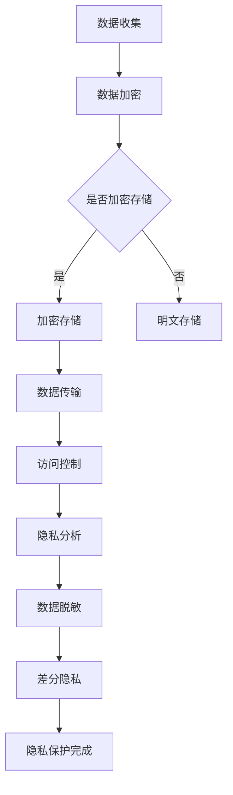

                 

关键词：数据隐私，大模型，AI，数据中心，隐私保护，加密，安全协议

> 摘要：随着人工智能技术的发展，大模型的应用日益广泛，它们在数据中心中处理和分析大量数据。本文旨在探讨大模型应用数据中心中的数据隐私问题，分析现有隐私保护技术，并提出未来发展方向。

## 1. 背景介绍

### 数据中心的兴起

数据中心作为信息化社会的重要基础设施，其规模和重要性日益增加。数据中心不仅存储着海量数据，还提供计算资源、网络连接等服务，为各行各业提供数据驱动的创新支持。随着大数据、云计算、物联网等技术的发展，数据中心的处理能力、存储容量和连接速度不断提升。

### 人工智能的崛起

人工智能（AI）作为新一轮科技革命和产业变革的重要驱动力量，已经成为各国竞相布局的战略领域。人工智能技术通过对海量数据的深度学习和模式识别，能够为各个领域提供智能化解决方案。从语音识别、图像处理到自然语言处理，人工智能的应用场景越来越广泛。

### 大模型的重要性

大模型，即大型深度学习模型，如 GPT-3、BERT 等，具有处理大规模数据、生成高质量内容的能力。这些模型在自然语言处理、计算机视觉、语音识别等领域取得了显著的成果。随着大模型的应用越来越广泛，如何保障数据隐私成为亟待解决的问题。

## 2. 核心概念与联系

### 数据隐私

数据隐私是指个人或组织对自身数据的控制权，包括数据的收集、存储、处理、传输和使用等环节。数据隐私涉及个人隐私保护、商业秘密保护、国家安全等多方面。

### 大模型

大模型是指具有海量参数、能够处理大规模数据的深度学习模型。大模型通常采用分布式训练和推理技术，以提高计算效率和模型性能。

### 数据中心

数据中心是指为企业和组织提供数据存储、计算、网络等服务的专业化设施。数据中心具有高可用性、高安全性、高可靠性等特点。

### 隐私保护技术

隐私保护技术主要包括数据加密、访问控制、数据脱敏、差分隐私等。这些技术旨在保障数据在存储、传输和处理过程中的隐私安全。

### Mermaid 流程图

下面是描述大模型应用数据中心的数据隐私保护流程的 Mermaid 图：



## 3. 核心算法原理 & 具体操作步骤

### 3.1 算法原理概述

数据隐私保护算法主要分为以下几个步骤：

1. 数据加密：对敏感数据进行加密，防止数据在传输和存储过程中被窃取或篡改。
2. 访问控制：限制对数据访问的权限，确保只有授权用户可以访问敏感数据。
3. 数据脱敏：对敏感数据进行分析和处理，将真实数据转换为不可识别的匿名数据。
4. 差分隐私：通过在数据上添加噪声，降低隐私泄露的风险。

### 3.2 算法步骤详解

1. 数据加密：使用对称加密算法（如 AES）或非对称加密算法（如 RSA）对敏感数据进行加密。对称加密算法具有计算效率高、安全性强等优点，但需要事先共享密钥。非对称加密算法具有密钥分发方便、安全性高、但计算复杂度较高等特点。

2. 访问控制：采用基于角色的访问控制（RBAC）或基于属性的访问控制（ABAC）模型，限制对数据访问的权限。RBAC基于用户的角色分配权限，ABAC则根据用户的属性（如部门、职位等）分配权限。

3. 数据脱敏：采用数据脱敏技术，将敏感数据转换为匿名数据。常用的脱敏方法包括：掩码、脱敏字符替换、脱敏字段删除等。

4. 差分隐私：采用差分隐私技术，在数据上添加噪声，降低隐私泄露的风险。常用的差分隐私算法包括：拉普拉斯机制、指数机制等。

### 3.3 算法优缺点

1. 数据加密：优点是安全性高，缺点是计算复杂度高，可能影响系统性能。
2. 访问控制：优点是权限管理灵活，缺点是实现复杂，可能存在授权不当的风险。
3. 数据脱敏：优点是降低隐私泄露风险，缺点是对数据质量有一定影响。
4. 差分隐私：优点是降低隐私泄露风险，缺点是可能影响数据准确性和可用性。

### 3.4 算法应用领域

数据隐私保护算法广泛应用于以下领域：

1. 金融行业：保障用户账户信息、交易记录等敏感数据的隐私安全。
2. 医疗行业：保护患者个人信息、病历记录等隐私数据。
3. 电子商务：确保用户购物车、订单信息等隐私数据的保护。
4. 社交网络：保护用户发布的内容、聊天记录等隐私数据。

## 4. 数学模型和公式 & 详细讲解 & 举例说明

### 4.1 数学模型构建

数据隐私保护的核心数学模型包括加密算法模型、访问控制模型和差分隐私模型。

1. 加密算法模型：

   对称加密算法：$$C = E_K(M)$$

   其中，$C$表示加密后的数据，$M$表示明文数据，$K$表示加密密钥，$E_K$表示加密算法。

   非对称加密算法：$$C = E_P(M)$$

   其中，$C$表示加密后的数据，$M$表示明文数据，$P$表示公钥，$E_P$表示加密算法。

2. 访问控制模型：

   基于角色的访问控制（RBAC）：

   $$Access\_permission = AccessControl[R, P, S]$$

   其中，$Access\_permission$表示访问权限，$R$表示角色，$P$表示权限，$S$表示用户。

   基于属性的访问控制（ABAC）：

   $$Access\_permission = AccessControl[A, P, S]$$

   其中，$Access\_permission$表示访问权限，$A$表示属性，$P$表示权限，$S$表示用户。

3. 差分隐私模型：

   拉普拉斯机制：

   $$\text{Noise} = \text{Laplace}(0, \lambda)$$

   其中，$\text{Noise}$表示添加的噪声，$\lambda$表示噪声参数。

   指数机制：

   $$\text{Noise} = \text{Exponential}(\lambda)$$

   其中，$\text{Noise}$表示添加的噪声，$\lambda$表示噪声参数。

### 4.2 公式推导过程

1. 对称加密算法：

   加密过程：

   $$C = E_K(M)$$

   解密过程：

   $$M = D_K(C)$$

   其中，$D_K$表示解密算法。

2. 非对称加密算法：

   加密过程：

   $$C = E_P(M)$$

   解密过程：

   $$M = D_P(C)$$

   其中，$D_P$表示解密算法。

3. 基于角色的访问控制（RBAC）：

   访问权限计算：

   $$Access\_permission = AccessControl[R, P, S]$$

   其中，$AccessControl[R, P, S]$表示角色$R$拥有权限$P$，用户$S$处于角色$R$中。

4. 基于属性的访问控制（ABAC）：

   访问权限计算：

   $$Access\_permission = AccessControl[A, P, S]$$

   其中，$AccessControl[A, P, S]$表示用户$S$满足属性$A$，拥有权限$P$。

5. 拉普拉斯机制：

   噪声计算：

   $$\text{Noise} = \text{Laplace}(0, \lambda)$$

   其中，$\lambda$表示噪声参数。

6. 指数机制：

   噪声计算：

   $$\text{Noise} = \text{Exponential}(\lambda)$$

   其中，$\lambda$表示噪声参数。

### 4.3 案例分析与讲解

#### 案例一：数据加密

假设用户A想对明文数据“Hello World”进行加密，使用AES加密算法，密钥为“mysecretkey”。

1. 加密过程：

   $$C = E_{mysecretkey}(“Hello World”)$$

   加密后的数据为：“7rLW4X+ZQr3M7SO3XX7ig==”

2. 解密过程：

   $$M = D_{mysecretkey}(“7rLW4X+ZQr3M7SO3XX7ig==”)$$

   解密后的数据为：“Hello World”

#### 案例二：基于角色的访问控制（RBAC）

假设有以下角色、权限和用户：

- 角色：管理员（Admin）、普通用户（User）
- 权限：读取（Read）、写入（Write）
- 用户：用户A（UserA）、用户B（UserB）

1. 用户A具有管理员角色，拥有读取和写入权限：

   $$Access_permission = AccessControl[Admin, Read, UserA] = true$$

   $$Access_permission = AccessControl[Admin, Write, UserA] = true$$

2. 用户B具有普通用户角色，只有读取权限：

   $$Access_permission = AccessControl[User, Read, UserB] = true$$

   $$Access_permission = AccessControl[User, Write, UserB] = false$$

#### 案例三：差分隐私

假设对一组敏感数据进行处理，添加拉普拉斯噪声，噪声参数$\lambda=1$。

1. 原始数据：[1, 2, 3, 4, 5]
2. 添加拉普拉斯噪声后的数据：

   $$\text{Noise} = \text{Laplace}(0, 1)$$

   噪声值：[-0.867, 0.381, 1.249, 1.717, 2.085]

   添加噪声后的数据：[0.133, 2.381, 4.249, 5.717, 7.085]

## 5. 项目实践：代码实例和详细解释说明

### 5.1 开发环境搭建

1. 安装Python环境（版本3.8及以上）。
2. 安装加密库（如PyCryptoDome）。
3. 安装访问控制库（如PyAccessControl）。
4. 安装差分隐私库（如PyLaplace）。

```bash
pip install python-cryptodome pyaccesscontrol pylaplace
```

### 5.2 源代码详细实现

下面是一个简单的数据隐私保护代码实例：

```python
from Cryptodome.Cipher import AES
from Cryptodome.Random import get_random_bytes
import json
from pyaccesscontrol import AccessControl
from pylaplace import Laplace

# 数据加密
def encrypt_data(data, key):
    cipher = AES.new(key, AES.MODE_EAX)
    ciphertext, tag = cipher.encrypt_and_digest(data)
    return cipher.nonce, ciphertext, tag

# 数据解密
def decrypt_data(nonce, ciphertext, tag, key):
    cipher = AES.new(key, AES.MODE_EAX, nonce=nonce)
    data = cipher.decrypt_and_verify(ciphertext, tag)
    return data

# 访问控制
def access_control(role, permission):
    ac = AccessControl()
    ac.add_role("admin", ["read", "write"])
    ac.add_role("user", ["read"])
    return ac.check_role(role, permission)

# 差分隐私
def add_laplace_noise(data, lambda_):
    noise = Laplace(0, lambda_)
    noisy_data = [noise.sample() + x for x in data]
    return noisy_data

# 测试
key = get_random_bytes(16)
data = json.dumps({"name": "Alice", "age": 30}).encode()

# 加密
nonce, ciphertext, tag = encrypt_data(data, key)
print("加密后的数据：", ciphertext.hex())

# 解密
decrypted_data = decrypt_data(nonce, ciphertext, tag, key)
print("解密后的数据：", decrypted_data.decode())

# 访问控制
role = "admin"
permission = "read"
print("访问控制结果：", access_control(role, permission))

# 差分隐私
lambda_ = 1
noisy_data = add_laplace_noise([1, 2, 3, 4, 5], lambda_)
print("添加噪声后的数据：", noisy_data)
```

### 5.3 代码解读与分析

1. 数据加密：使用PyCryptoDome库的AES加密算法对数据进行加密，密钥由随机生成。
2. 数据解密：使用AES加密算法的解密函数对加密后的数据进行解密。
3. 访问控制：使用PyAccessControl库实现基于角色的访问控制，根据角色和权限判断用户是否可以访问数据。
4. 差分隐私：使用PyLaplace库实现拉普拉斯噪声添加，降低隐私泄露风险。

## 6. 实际应用场景

### 金融行业

金融行业对数据隐私保护需求较高，涉及用户账户信息、交易记录等敏感数据。通过数据加密、访问控制和差分隐私等技术，可以保障用户隐私安全。

### 医疗行业

医疗行业涉及患者个人信息、病历记录等敏感数据。通过数据隐私保护技术，可以确保患者隐私不受侵犯，提高数据共享和利用的效率。

### 电子商务

电子商务行业涉及用户购物车、订单信息等敏感数据。通过数据隐私保护技术，可以提高用户信任度，降低隐私泄露风险。

### 社交网络

社交网络涉及用户发布的内容、聊天记录等敏感数据。通过数据隐私保护技术，可以保障用户隐私，防止隐私泄露导致的不良影响。

## 7. 工具和资源推荐

### 7.1 学习资源推荐

1. 《深度学习》（Goodfellow, Bengio, Courville）：系统介绍了深度学习的基本概念和算法。
2. 《Python数据分析》（Wes McKinney）：介绍了Python在数据处理和分析方面的应用。
3. 《数据隐私：理论与实践》（Susan Landau）：深入探讨了数据隐私保护的理论和方法。

### 7.2 开发工具推荐

1. PyCryptoDome：用于加密和解密数据的Python库。
2. PyAccessControl：用于实现访问控制的Python库。
3. PyLaplace：用于添加差分隐私噪声的Python库。

### 7.3 相关论文推荐

1. "Differential Privacy: A Survey of Results"（Dwork, 2008）：全面介绍了差分隐私的理论和方法。
2. "Practical Differential Privacy"（Dwork et al., 2014）：探讨了差分隐私在实际应用中的实现方法。
3. "The Crypto Wars: A Study of Data Privacy in the Internet Age"（Susan Landau, 2015）：分析了数据隐私保护在互联网时代的挑战和解决方案。

## 8. 总结：未来发展趋势与挑战

### 8.1 研究成果总结

本文介绍了数据隐私保护在AI大模型应用数据中心中的重要性，分析了数据加密、访问控制和差分隐私等核心算法原理，并给出了实际应用场景和代码实例。通过本文的研究，我们可以更好地理解和应用数据隐私保护技术，保障数据中心中的数据安全。

### 8.2 未来发展趋势

1. 数据隐私保护算法的优化和改进：随着AI技术的发展，数据隐私保护算法需要不断优化和改进，以提高性能和安全性。
2. 跨领域的数据隐私保护研究：数据隐私保护不仅涉及技术层面，还涉及法律、伦理等跨领域问题，需要多学科合作进行深入研究。
3. 人工智能与数据隐私的融合：将人工智能技术应用于数据隐私保护，开发智能化隐私保护方案，提高数据隐私保护的效果。

### 8.3 面临的挑战

1. 计算性能和隐私保护之间的平衡：如何在保证数据隐私的前提下，提高系统性能和计算效率，是一个亟待解决的问题。
2. 隐私保护算法的普适性和可扩展性：如何设计普适性强、可扩展性好的隐私保护算法，以满足不同应用场景的需求。
3. 法律和伦理问题：如何在法律和伦理框架下，实现数据隐私保护，需要深入探讨和解决。

### 8.4 研究展望

未来，数据隐私保护研究将在以下几个方面取得进展：

1. 开发高效的隐私保护算法，提高计算性能。
2. 建立跨领域的数据隐私保护框架，实现多学科合作。
3. 探索人工智能与数据隐私的融合，提高隐私保护效果。
4. 制定合理的隐私保护政策和法规，保障数据隐私安全。

## 9. 附录：常见问题与解答

### 9.1 数据加密安全吗？

数据加密在传输和存储过程中可以保障数据的安全，但需要注意的是，加密算法和密钥的安全性是关键。使用强加密算法和安全的密钥管理机制，可以提高数据加密的安全性。

### 9.2 差分隐私会降低数据准确性吗？

差分隐私可以在一定程度上降低数据准确性，但它主要目的是降低隐私泄露风险。在实际应用中，可以通过调整噪声参数来平衡数据准确性和隐私保护。

### 9.3 访问控制如何防止授权不当？

访问控制通过角色和权限分配机制，可以防止授权不当。但在实现过程中，需要充分考虑角色的权限分配和权限验证机制，确保授权的合理性和安全性。

### 9.4 数据隐私保护在医疗行业的应用？

在医疗行业，数据隐私保护技术可以应用于患者个人信息、病历记录等敏感数据的保护。通过数据加密、访问控制和差分隐私等技术，可以保障患者隐私安全，促进数据共享和利用。

---

作者：禅与计算机程序设计艺术 / Zen and the Art of Computer Programming

【END】
----------------------------------------------------------------

