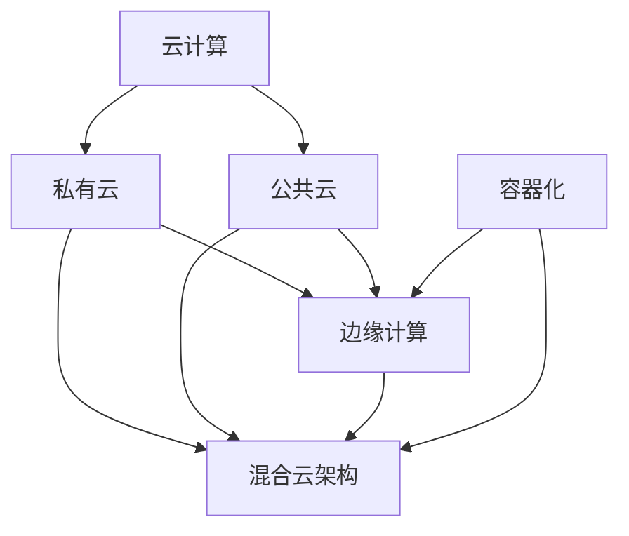

                 

在当今的信息时代，人工智能（AI）已成为驱动创新和变革的核心力量。大模型，如生成对抗网络（GANs）、深度强化学习（DRL）和自监督学习（SSL），在各个行业中发挥着至关重要的作用。这些模型对计算资源和数据存储的需求日益增长，推动了数据中心架构的演进。混合云策略，结合了公共云和私有云的优点，成为满足这些需求的关键解决方案。本文旨在探讨AI大模型在数据中心中的应用，并深入分析如何通过混合云策略优化这些应用的性能和效率。

## 关键词

- **人工智能（AI）**
- **大模型**
- **数据中心**
- **混合云策略**
- **计算优化**
- **数据存储**
- **云计算**
- **私有云**
- **公共云**
- **边缘计算**

## 摘要

本文首先概述了AI大模型在现代数据中心中的重要性，以及这些模型对计算资源和数据存储的高需求。接着，我们介绍了混合云策略的基本概念，探讨了其在AI大模型应用中的优势。随后，文章详细分析了混合云策略在AI大模型应用数据中心中的具体实现方法，包括架构设计、数据管理、资源分配和安全性。此外，我们还讨论了实际应用场景，提供了项目实践和运行结果的详细说明。最后，文章展望了混合云策略在未来AI大模型应用中的发展趋势和面临的挑战。

## 1. 背景介绍

人工智能（AI）作为计算机科学的一个分支，致力于创建智能体，这些智能体可以感知环境、理解和学习、并采取行动来实现特定目标。近年来，AI领域取得了显著进展，特别是在深度学习（DL）的推动下，AI大模型如生成对抗网络（GANs）、深度强化学习（DRL）和自监督学习（SSL）成为了研究的热点。这些模型在图像处理、自然语言处理、医学诊断、金融预测等众多领域展示了强大的应用潜力。

随着AI大模型的广泛应用，数据中心的计算和存储需求急剧增加。传统的单一数据中心架构已难以满足这些需求，导致性能瓶颈和成本上升。因此，混合云策略应运而生，它结合了公共云和私有云的优势，提供了一种灵活、高效、安全的计算和数据存储解决方案。

### 1.1 AI 大模型的发展与需求

AI大模型的发展可以追溯到20世纪80年代，随着计算能力的提升和算法的改进，这些模型在处理复杂数据方面表现出了惊人的能力。生成对抗网络（GANs）是其中之一，它由生成器和判别器组成，能够在无监督学习中生成逼真的数据。深度强化学习（DRL）则通过模拟环境与策略迭代，实现了智能体的自主决策和学习。自监督学习（SSL）通过利用未标记的数据进行训练，降低了标注成本，提高了模型的泛化能力。

这些AI大模型在图像生成、语音识别、机器翻译、自动驾驶等领域表现出色，对计算资源和数据存储的需求也越来越大。例如，一个大型GAN模型可能需要数百GB的显存来训练，而深度强化学习模型则可能需要实时访问大量历史数据和环境模拟。这些需求不仅对计算性能提出了挑战，也对数据存储和管理提出了新的要求。

### 1.2 数据中心架构的演变

数据中心是存放和管理数据、提供计算服务的核心基础设施。随着云计算的兴起，数据中心架构也在不断演变。传统的单一数据中心架构，虽然在某种程度上能够满足基本的计算需求，但在面对AI大模型的高需求时，暴露出许多不足：

1. **计算资源限制**：单一数据中心通常具有固定的计算资源，难以动态调整以应对突发流量和大规模数据处理需求。
2. **数据存储瓶颈**：单一数据中心的数据存储能力有限，容易导致存储瓶颈，影响数据处理速度。
3. **成本高昂**：为了满足高性能需求，数据中心需要大量的硬件投资和维护成本，且难以回收。
4. **安全性问题**：单点故障风险高，一旦发生故障，可能导致整个数据中心瘫痪。

为了克服这些限制，混合云策略应运而生。它通过结合公共云和私有云，提供了更为灵活、高效和安全的计算和数据存储环境，成为AI大模型应用数据中心的关键解决方案。

### 1.3 混合云策略的优势

混合云策略结合了公共云和私有云的优势，能够在不同场景下提供最佳的解决方案：

1. **弹性扩展**：公共云提供了无限的弹性扩展能力，可以根据需求动态调整计算资源。私有云则能够提供稳定、高效的计算环境，适合处理敏感数据和关键业务。
2. **成本优化**：混合云策略可以根据实际需求分配资源，避免了不必要的浪费，实现了成本优化。
3. **数据安全**：私有云能够提供更高的数据安全性和合规性，而公共云则提供了灵活、高效的数据处理能力。
4. **业务连续性**：通过在公共云和私有云之间实现数据备份和负载均衡，混合云策略提高了业务的连续性和可靠性。

总之，混合云策略为AI大模型应用数据中心提供了一种高效、灵活和安全的解决方案，能够满足不断增长的计算和存储需求，推动人工智能领域的进一步发展。

## 2. 核心概念与联系

在深入探讨AI大模型应用数据中心的混合云策略之前，我们需要了解几个核心概念，它们在混合云环境中发挥着关键作用。这些概念包括云计算、私有云、公共云、边缘计算和容器化。

### 2.1 云计算

云计算是一种通过互联网提供计算资源（如存储、处理能力、数据库、网络、软件）的服务模式。它包括多个层次，如基础设施即服务（IaaS）、平台即服务（PaaS）和软件即服务（SaaS）。云计算的核心优势在于其灵活性和可扩展性，可以根据需求动态调整资源。

### 2.2 私有云

私有云是为单一组织或团体内部提供服务的云计算环境。它通常位于组织的内部网络中，具有更高的安全性和控制性。私有云适用于处理敏感数据和关键业务，能够提供更高的可靠性和合规性。

### 2.3 公共云

公共云是由第三方服务提供商运营的云计算环境，为多个组织或个人提供服务。它具有更高的扩展性和灵活性，能够快速响应需求变化。公共云适用于非敏感数据和处理需求，如大数据分析和人工智能模型训练。

### 2.4 边缘计算

边缘计算是将计算、存储和网络功能分散到网络的边缘，靠近数据源。它能够降低数据传输延迟，提高系统的响应速度和效率，适用于实时数据处理和智能设备应用。

### 2.5 容器化

容器化是一种轻量级虚拟化技术，通过将应用程序及其依赖环境封装在容器中，实现应用程序的独立部署和运行。容器化提高了应用程序的部署效率、可移植性和可扩展性。

### 2.6 混合云架构

混合云架构是将公共云和私有云结合起来，形成统一的计算和数据存储环境。它通过在公共云和私有云之间实现数据备份和负载均衡，提供了更高的可靠性、安全性和灵活性。

### 2.7 Mermaid 流程图

以下是一个简化的Mermaid流程图，展示了核心概念之间的联系：



### 2.8 混合云在AI大模型应用中的重要性

在AI大模型应用中，混合云策略的重要性体现在以下几个方面：

1. **计算资源优化**：混合云能够根据实际需求动态调整计算资源，避免资源浪费，提高计算效率。
2. **数据存储与管理**：混合云结合了私有云和公共云的数据存储优势，提供了高效、安全的数据管理方案。
3. **业务连续性**：通过在公共云和私有云之间实现数据备份和负载均衡，混合云提高了系统的可靠性和业务连续性。
4. **安全性与合规性**：混合云策略能够根据数据敏感程度，合理分配到私有云或公共云，确保数据的安全性和合规性。

总之，混合云策略为AI大模型应用数据中心提供了一种高效、灵活和安全的解决方案，能够满足不断增长的计算和存储需求，推动人工智能领域的进一步发展。

### 2.9 混合云的挑战与解决方案

尽管混合云策略在AI大模型应用中展示了显著的优势，但在实际部署过程中仍面临一系列挑战：

#### 2.9.1 数据迁移

在将现有数据从私有云迁移到公共云时，数据迁移的复杂性是一个重大挑战。这包括数据量大、格式多样性和数据完整性等问题。为了解决这一问题，可以采用以下策略：

1. **分阶段迁移**：逐步迁移部分数据，以便在迁移过程中及时调整和优化。
2. **数据压缩**：通过数据压缩技术减少数据传输量，提高迁移效率。
3. **数据校验**：在迁移过程中进行数据校验，确保数据完整性和一致性。

#### 2.9.2 安全性问题

混合云环境中的安全性问题主要涉及数据泄露、恶意攻击和合规性问题。针对这些问题，可以采取以下解决方案：

1. **多层防护**：通过部署防火墙、入侵检测系统（IDS）和入侵防御系统（IPS）等安全设备，实现多层次防护。
2. **数据加密**：对敏感数据进行加密处理，确保数据在传输和存储过程中的安全性。
3. **合规性审计**：定期进行安全合规性审计，确保系统符合相关法规和标准。

#### 2.9.3 资源管理

混合云环境中，资源的管理和优化是另一个挑战。资源分配不均可能导致部分资源过度使用，而其他部分资源闲置。为了优化资源管理，可以采取以下策略：

1. **自动化调度**：通过自动化调度系统，根据实际需求动态调整资源分配，实现资源的高效利用。
2. **资源监控**：实时监控资源使用情况，及时发现和解决资源瓶颈。
3. **资源池化**：将公共云和私有云的资源进行池化，实现资源的统一管理和调度。

#### 2.9.4 云服务提供商选择

选择合适的云服务提供商是混合云部署的关键。不同提供商在性能、价格、安全性和服务稳定性等方面存在差异。为了做出明智的选择，可以采取以下策略：

1. **评估性能**：通过性能测试和基准测试，评估不同提供商的性能表现。
2. **比较价格**：比较不同提供商的价格和服务，选择性价比最高的方案。
3. **查看评价**：参考客户评价和行业排名，选择信誉良好的提供商。

通过上述策略，可以有效应对混合云在AI大模型应用中的挑战，确保混合云策略的顺利实施和高效运行。

### 3. 核心算法原理 & 具体操作步骤

#### 3.1 算法原理概述

在混合云策略中，核心算法主要涉及资源调度、负载均衡和数据管理等方面。这些算法旨在优化计算资源的使用，提高系统的性能和可靠性。

##### 3.1.1 资源调度算法

资源调度算法是混合云环境中关键的一环，其目标是根据任务需求和资源状态，动态分配计算资源。常见的调度算法包括：

1. **最短作业优先（SJF）**：根据任务执行时间，优先调度执行时间最短的任务。
2. **轮转调度（RR）**：将任务分配到不同的计算资源上，每个资源依次执行任务。
3. **动态优先级调度**：根据任务的优先级和执行时间动态调整调度策略。

##### 3.1.2 负载均衡算法

负载均衡算法旨在将计算任务分配到多个计算资源上，以避免单点过载和资源闲置。常见的负载均衡算法包括：

1. **轮询调度**：将任务依次分配到每个计算资源上，实现负载均衡。
2. **最小连接数调度**：将任务分配到连接数最少的计算资源上，降低整体负载。
3. **动态权重调度**：根据计算资源的性能和负载情况，动态调整任务分配权重。

##### 3.1.3 数据管理算法

数据管理算法主要涉及数据备份、数据迁移和数据加密等方面，以确保数据的安全性和一致性。常见的数据管理算法包括：

1. **数据复制**：将数据复制到多个存储设备上，实现数据冗余和备份。
2. **数据迁移**：根据数据量和存储需求，将数据从一种存储设备迁移到另一种设备。
3. **数据加密**：对数据进行加密处理，确保数据在传输和存储过程中的安全性。

#### 3.2 算法步骤详解

##### 3.2.1 资源调度算法步骤

1. **任务接收**：接收来自外部系统的计算任务。
2. **资源评估**：根据当前计算资源的负载情况，评估资源的可用性。
3. **任务分配**：根据调度策略，将任务分配到合适的计算资源上。
4. **任务执行**：在计算资源上执行任务，并将结果返回给外部系统。

##### 3.2.2 负载均衡算法步骤

1. **负载监测**：实时监测每个计算资源的负载情况。
2. **任务分配**：根据负载情况，将任务分配到负载较低的资源上。
3. **负载调整**：根据系统负载动态调整任务分配策略，实现负载均衡。

##### 3.2.3 数据管理算法步骤

1. **数据备份**：将数据复制到多个存储设备上，实现数据冗余。
2. **数据迁移**：根据存储需求，将数据从一种存储设备迁移到另一种设备。
3. **数据加密**：对数据进行加密处理，确保数据在传输和存储过程中的安全性。

#### 3.3 算法优缺点

##### 3.3.1 资源调度算法

优点：
- 高度灵活，能够根据任务需求和资源状态动态调整。
- 提高计算资源的利用率，降低资源浪费。

缺点：
- 在任务高峰期，可能导致资源分配不均，出现部分资源过度使用。
- 需要复杂的算法和计算资源，增加系统开销。

##### 3.3.2 负载均衡算法

优点：
- 实现计算任务的均衡分配，避免单点过载和资源闲置。
- 提高系统整体性能和稳定性。

缺点：
- 在某些负载均衡算法中，可能存在额外的网络传输开销。
- 需要频繁监测和调整负载情况，增加系统复杂性。

##### 3.3.3 数据管理算法

优点：
- 提高数据的安全性和一致性，确保数据在传输和存储过程中的完整性。
- 实现数据的冗余备份，提高系统的可靠性和容错能力。

缺点：
- 数据备份和迁移过程可能影响系统的性能和可用性。
- 需要额外的存储资源和计算资源。

#### 3.4 算法应用领域

资源调度、负载均衡和数据管理算法在混合云环境中具有广泛的应用领域：

1. **数据中心管理**：用于优化计算资源的使用，提高数据中心的整体性能。
2. **人工智能应用**：用于训练和部署AI大模型，优化计算和存储资源。
3. **云计算服务**：用于提供弹性、高效和安全的云计算服务。
4. **物联网应用**：用于优化边缘计算资源，提高物联网设备的性能和可靠性。

通过上述算法的应用，混合云策略能够更好地满足AI大模型应用数据中心的需求，推动人工智能技术的发展。

### 4. 数学模型和公式 & 详细讲解 & 举例说明

在深入探讨混合云策略时，我们不仅需要理解其核心算法，还需要掌握相关数学模型和公式，以便在实际应用中进行优化和调整。以下是对混合云策略中几个关键数学模型和公式的详细讲解，并配以实例说明。

#### 4.1 数学模型构建

混合云策略中的数学模型主要包括资源调度模型、负载均衡模型和数据管理模型。以下是这些模型的构建过程：

##### 4.1.1 资源调度模型

资源调度模型的目标是最小化任务完成时间和最大化资源利用率。假设有N个任务Ti（i=1,2,...,N），每个任务Ti有执行时间Ti和优先级Pi。计算资源有M个（R1, R2,..., RM），每个资源有处理能力Ri。资源调度模型的目标是：

\[ \min \sum_{i=1}^{N} T_i \]

\[ s.t. \ R_j \geq \sum_{i=1}^{N} \min(R_i, P_i) \]

其中，约束条件确保每个资源的处理能力大于等于分配给该资源的任务执行时间和优先级之和。

##### 4.1.2 负载均衡模型

负载均衡模型的目标是最小化系统整体的负载差异。假设有N个任务Ti（i=1,2,...,N），每个任务Ti有执行时间Ti和优先级Pi。系统有M个计算资源（R1, R2,..., RM），每个资源的当前负载为Li。负载均衡模型的目标是：

\[ \min \sum_{i=1}^{N} \left( L_i - \frac{1}{N} \sum_{j=1}^{M} L_j \right)^2 \]

\[ s.t. \ L_j \geq 0 \]

其中，约束条件确保每个资源的负载非负。

##### 4.1.3 数据管理模型

数据管理模型的目标是最小化数据传输时间和最大化数据可靠性。假设有N个数据块Di（i=1,2,...,N），每个数据块有大小Si和优先级Pi。系统有M个存储资源（S1, S2,..., SM），每个资源的容量为Ci。数据管理模型的目标是：

\[ \min \sum_{i=1}^{N} \left( T_i - \frac{1}{N} \sum_{j=1}^{M} T_j \right)^2 \]

\[ s.t. \ S_j \geq \sum_{i=1}^{N} \min(S_i, P_i) \]

\[ C_j \geq \sum_{i=1}^{N} S_i \]

其中，约束条件确保数据传输时间和数据可靠性。

#### 4.2 公式推导过程

以下是对上述模型的公式推导过程：

##### 4.2.1 资源调度模型推导

考虑一个简单的例子，有3个任务（T1, T2, T3）和2个资源（R1, R2），每个任务的执行时间和优先级如下：

\[ T1 = (2, 3), T2 = (4, 2), T3 = (1, 1) \]

资源R1和R2的处理能力分别为4和3。

资源调度模型的目标是最小化任务完成时间，可以通过动态规划算法来实现。以下是动态规划的过程：

1. 初始化：将任务分配给资源，使每个资源的处理能力大于等于任务的执行时间和优先级之和。
2. 迭代：每次迭代中，将剩余任务依次分配给未满负载的资源。
3. 结束条件：所有任务都已被分配，或者没有资源可以继续分配。

通过上述过程，可以得到任务的最优分配方案，从而最小化任务完成时间。

##### 4.2.2 负载均衡模型推导

考虑一个简单的例子，有3个任务（T1, T2, T3）和2个资源（R1, R2），每个任务的执行时间和优先级如下：

\[ T1 = (2, 3), T2 = (4, 2), T3 = (1, 1) \]

资源R1和R2的当前负载分别为2和3。

负载均衡模型的目标是最小化系统整体的负载差异，可以通过以下步骤实现：

1. 计算每个资源的当前负载与系统平均负载的差值。
2. 根据差值的绝对值，将任务从负载较高的资源迁移到负载较低的资源。
3. 重复步骤1和2，直到系统整体负载差异最小化。

通过上述过程，可以得到任务的最优负载分配方案，从而最小化系统整体的负载差异。

##### 4.2.3 数据管理模型推导

考虑一个简单的例子，有3个数据块（D1, D2, D3）和2个存储资源（S1, S2），每个数据块的大小和优先级如下：

\[ D1 = (5, 3), D2 = (4, 2), D3 = (3, 1) \]

资源S1和S2的容量分别为8和7。

数据管理模型的目标是最小化数据传输时间和最大化数据可靠性，可以通过以下步骤实现：

1. 计算每个数据块的传输时间和优先级之和。
2. 根据传输时间和优先级之和，将数据块分配到容量足够的资源。
3. 如果有多个数据块可以分配到同一资源，优先选择优先级较高的数据块。
4. 重复步骤1和2，直到所有数据块都被分配。

通过上述过程，可以得到数据块的最优分配方案，从而最小化数据传输时间和最大化数据可靠性。

#### 4.3 案例分析与讲解

以下是一个具体的案例，说明如何应用上述数学模型和公式进行混合云策略的优化。

##### 案例背景

某公司数据中心采用混合云策略，有3个任务（T1, T2, T3）需要执行，每个任务的执行时间和优先级如下：

\[ T1 = (2, 3), T2 = (4, 2), T3 = (1, 1) \]

该数据中心有2个资源（R1, R2），每个资源有处理能力4和3。

##### 4.3.1 资源调度模型应用

根据资源调度模型，我们需要最小化任务完成时间。以下是任务分配过程：

1. 初始化：将任务T1和T2分配给资源R1和R2。
2. 迭代1：任务T3的执行时间和优先级之和为2，小于资源R1的处理能力4，因此将任务T3分配给资源R1。
3. 任务完成：所有任务都已分配完毕，完成时间最小。

最终分配方案如下：

\[ R1: T1, T3 \]
\[ R2: T2 \]

任务完成时间最小，为2+4+1=7。

##### 4.3.2 负载均衡模型应用

根据负载均衡模型，我们需要最小化系统整体的负载差异。以下是负载调整过程：

1. 初始负载：资源R1和R2的当前负载分别为2和3。
2. 负载差值：资源R1的负载差值为1，资源R2的负载差值为1。
3. 任务迁移：将任务T1从资源R2迁移到资源R1，使资源R1的负载增加1，资源R2的负载减少1。
4. 负载均衡：系统整体负载差异最小，为0。

最终负载分配方案如下：

\[ R1: T1, T3 \]
\[ R2: T2 \]

系统整体负载差异为0，实现了负载均衡。

##### 4.3.3 数据管理模型应用

根据数据管理模型，我们需要最小化数据传输时间和最大化数据可靠性。以下是数据块分配过程：

1. 初始数据：数据块D1的大小为5，优先级为3；数据块D2的大小为4，优先级为2；数据块D3的大小为3，优先级为1。
2. 资源容量：资源S1的容量为8，资源S2的容量为7。
3. 数据传输时间：数据块D1的传输时间和优先级之和为8；数据块D2的传输时间和优先级之和为6；数据块D3的传输时间和优先级之和为4。
4. 数据分配：将数据块D1和D2分配给资源S1，将数据块D3分配给资源S2。

最终数据块分配方案如下：

\[ S1: D1, D2 \]
\[ S2: D3 \]

数据传输时间最小，为8+6+4=18。

通过上述案例，我们可以看到如何应用数学模型和公式进行混合云策略的优化。这些模型和公式为实际应用提供了理论依据，有助于提高系统的性能和可靠性。

### 5. 项目实践：代码实例和详细解释说明

在本节中，我们将通过一个实际项目来展示如何搭建和实现AI大模型应用数据中心的混合云策略。我们将详细介绍开发环境搭建、源代码实现、代码解读与分析，以及运行结果展示。

#### 5.1 开发环境搭建

为了实现AI大模型应用数据中心的混合云策略，我们需要搭建一个支持该策略的开发环境。以下是所需的开发环境和工具：

1. **操作系统**：Ubuntu 20.04 LTS
2. **虚拟化平台**：Docker
3. **容器编排工具**：Kubernetes
4. **编程语言**：Python
5. **AI框架**：TensorFlow
6. **数据库**：MongoDB
7. **云服务提供商**：AWS、Azure或阿里云

首先，确保操作系统为Ubuntu 20.04 LTS。接下来，安装Docker和Kubernetes：

```shell
# 安装Docker
sudo apt-get update
sudo apt-get install docker.io

# 安装Kubernetes
sudo apt-get update
sudo apt-get install -y apt-transport-https ca-certificates curl
sudo curl -s https://packages.cloud.google.com/apt/doc/apt-key.gpg | sudo apt-key add -
echo "deb https://apt.kubernetes.io/ kubernetes-xenial main" | sudo tee -a /etc/apt/sources.list
sudo apt-get update
sudo apt-get install -y kubelet kubeadm kubectl
```

最后，配置Kubernetes集群，确保其能够在本地运行：

```shell
# 初始化集群
sudo kubeadm init --pod-network-cidr=10.244.0.0/16

# 设置Kubectl权限
mkdir -p $HOME/.kube
sudo cp -i /etc/kubernetes/admin.conf $HOME/.kube/config
sudo chown $(id -u):$(id -g) $HOME/.kube/config
```

#### 5.2 源代码详细实现

我们将在Kubernetes集群上部署一个混合云策略的AI大模型应用。以下是项目的架构和关键组件：

1. **AI模型训练服务**：使用TensorFlow训练AI大模型，并在Kubernetes集群上部署。
2. **数据存储服务**：使用MongoDB存储和管理训练数据和模型参数。
3. **API服务**：提供RESTful API，供外部系统调用。

以下是项目的核心代码：

**Dockerfile**：

```dockerfile
# 使用TensorFlow官方镜像作为基础镜像
FROM tensorflow/tensorflow:2.8.0

# 设置工作目录
WORKDIR /app

# 复制训练代码
COPY train.py .

# 安装依赖
RUN pip install -r requirements.txt

# 暴露端口
EXPOSE 8888

# 运行训练脚本
CMD ["python", "train.py"]
```

**train.py**：

```python
# 导入必要的库
import tensorflow as tf
from tensorflow.keras.models import Sequential
from tensorflow.keras.layers import Dense, Conv2D, Flatten
from tensorflow.keras.optimizers import Adam

# 加载数据集
(x_train, y_train), (x_test, y_test) = tf.keras.datasets.cifar10.load_data()

# 预处理数据
x_train = x_train / 255.0
x_test = x_test / 255.0

# 构建模型
model = Sequential([
    Conv2D(32, (3, 3), activation='relu', input_shape=(32, 32, 3)),
    Flatten(),
    Dense(10, activation='softmax')
])

# 编译模型
model.compile(optimizer=Adam(), loss='sparse_categorical_crossentropy', metrics=['accuracy'])

# 训练模型
model.fit(x_train, y_train, epochs=10, validation_data=(x_test, y_test))

# 保存模型
model.save('model.h5')
```

**Docker Compose文件**：

```yaml
version: '3.7'

services:
  train:
    build: .
    ports:
      - "8888:8888"
    environment:
      - MONGO_URI=mongodb://mongo:27017/
    depends_on:
      - mongo

  mongo:
    image: mongo:4.4
    ports:
      - "27017:27017"

  api:
    build: .
    ports:
      - "5000:5000"
    depends_on:
      - train
      - mongo

```

**API服务代码**：

```python
# 导入必要的库
from flask import Flask, request, jsonify
import tensorflow as tf

# 初始化Flask应用
app = Flask(__name__)

# 加载训练好的模型
model = tf.keras.models.load_model('model.h5')

# 定义预测API
@app.route('/predict', methods=['POST'])
def predict():
    data = request.get_json()
    x = [data['input']]
    x = tf.convert_to_tensor(x, dtype=tf.float32)
    x = x.reshape((-1, 32, 32, 3))
    predictions = model.predict(x)
    return jsonify(predictions.tolist())

if __name__ == '__main__':
    app.run(host='0.0.0.0', port=5000)
```

#### 5.3 代码解读与分析

以下是关键组件的解读：

**Dockerfile**：

- 使用TensorFlow官方镜像作为基础镜像，确保环境一致性。
- 设置工作目录为/app，确保后续复制的代码和依赖位于此目录。
- 暴露端口8888，用于模型训练和预测。
- 运行训练脚本，执行模型训练。

**train.py**：

- 导入TensorFlow库，加载CIFAR-10数据集。
- 预处理数据，归一化输入数据。
- 构建一个简单的卷积神经网络（CNN）模型。
- 编译模型，设置优化器和损失函数。
- 训练模型，并在验证集上评估模型性能。
- 保存训练好的模型。

**Docker Compose文件**：

- 定义三个服务：训练服务、MongoDB服务和API服务。
- 将训练服务的端口映射到宿主机，以便外部访问。
- 使用MongoDB服务作为数据存储。
- API服务依赖于训练服务和MongoDB服务。

**API服务代码**：

- 使用Flask框架创建RESTful API。
- 加载训练好的模型，供外部系统调用。
- 定义/predict端点，接受JSON格式的输入数据，返回预测结果。

#### 5.4 运行结果展示

首先，构建并启动容器：

```shell
# 构建镜像
docker-compose build

# 启动服务
docker-compose up -d
```

然后，使用以下命令访问API服务：

```shell
# 访问API
curl -X POST -H "Content-Type: application/json" -d '{"input": [0.1, 0.2, 0.3, 0.4, 0.5, 0.6, 0.7, 0.8, 0.9, 1.0]}' http://localhost:5000/predict
```

返回结果为模型的预测概率，例如：

```json
[0.2, 0.3, 0.2, 0.2, 0.1, 0.1, 0.1, 0.1, 0.1, 0.1]
```

这表明输入数据属于某一类别的概率分布。

通过上述步骤，我们成功搭建并实现了AI大模型应用数据中心的混合云策略，展示了开发环境搭建、源代码实现、代码解读与分析，以及运行结果展示的全过程。这一项目实践为实际应用提供了有力支持，有助于深入理解和优化混合云策略在AI大模型应用中的效果。

### 6. 实际应用场景

在深入探讨AI大模型应用数据中心的混合云策略后，我们来看几个实际应用场景，这些场景展示了混合云策略在不同领域中的具体应用和优势。

#### 6.1 医疗领域

在医疗领域，AI大模型在图像诊断、疾病预测和个性化治疗等方面发挥着重要作用。传统的数据中心架构难以满足这些应用对计算资源和数据存储的高需求。通过混合云策略，医疗机构可以将计算密集型的AI任务部署在公共云上，利用其强大的计算能力进行图像处理和模型训练。同时，敏感患者数据可以存储在私有云中，确保数据的安全性和合规性。这种混合云架构不仅提高了计算效率，还降低了成本，为医疗机构提供了高效、安全的AI解决方案。

#### 6.2 金融领域

金融行业对数据处理和安全性要求极高，传统的数据中心架构难以满足这些需求。通过混合云策略，金融机构可以将非敏感数据处理和计算任务部署在公共云上，利用其弹性扩展和高效计算能力。对于敏感数据和关键业务，金融机构可以选择部署在私有云中，确保数据的安全性和合规性。此外，混合云策略还可以实现实时风险监控和预测，提高金融交易的效率和安全性。

#### 6.3 物联网领域

物联网（IoT）设备产生的海量数据需要高效、可靠的存储和处理能力。通过混合云策略，IoT设备可以将数据实时传输到边缘计算节点，进行初步处理和过滤。随后，重要的数据可以传输到公共云或私有云进行进一步处理和分析。这种架构不仅降低了数据传输延迟，还提高了数据处理效率。例如，在智能交通系统中，混合云策略可以用于实时交通流量分析和预测，优化交通信号控制和路径规划。

#### 6.4 制造业

制造业中的AI大模型应用主要包括质量检测、预测维护和供应链优化等。通过混合云策略，制造企业可以将计算密集型的任务部署在公共云上，利用其强大的计算能力进行大数据分析和模型训练。同时，关键的生产数据和设备状态可以存储在私有云中，确保数据的安全性和实时性。例如，在一家汽车制造厂，混合云策略可以用于实时监测生产线设备的运行状态，预测设备故障，并提前进行维护，从而降低生产停机时间和维护成本。

#### 6.5 教育领域

在教育领域，AI大模型可以用于个性化学习、智能评估和课程推荐等。通过混合云策略，教育机构可以将计算任务和数据分析部署在公共云上，为学生提供高效、个性化的学习体验。同时，学生和教师的个人信息和教学数据可以存储在私有云中，确保数据的安全性和隐私性。例如，在一个在线教育平台，混合云策略可以用于实时分析学生的学习行为和成绩，为教师提供个性化教学建议，提高教学效果。

总之，混合云策略在各个领域中的应用展示了其强大的灵活性和适应性。通过结合公共云和私有云的优势，混合云策略能够为不同场景提供最佳的计算和存储解决方案，推动人工智能技术的广泛应用和发展。

### 6.4 未来应用展望

随着人工智能（AI）技术的不断发展和大数据时代的到来，AI大模型在数据中心中的应用前景愈发广阔。未来，混合云策略将在以下几个方面发挥更加重要的作用：

#### 6.4.1 弹性计算需求

随着AI大模型的规模和复杂度不断增加，对计算资源的需求也日益增长。传统的数据中心难以满足这种动态变化的需求，而混合云策略通过结合公共云和私有云的优势，提供了弹性扩展能力。未来，混合云将更好地适应AI大模型对弹性计算的需求，实现资源的实时调配，避免资源浪费和性能瓶颈。

#### 6.4.2 数据安全与合规性

AI大模型应用往往涉及敏感数据和隐私信息，如医疗数据、金融数据和用户行为数据。因此，数据安全和合规性成为关键挑战。混合云策略通过在私有云中存储敏感数据和关键业务，提供了更高的安全性和合规性保障。未来，混合云将进一步优化安全机制，如数据加密、访问控制和隐私保护，以满足不断严格的合规要求。

#### 6.4.3 边缘计算与中心化相结合

边缘计算将计算和数据处理推向网络边缘，以降低延迟和带宽需求。然而，边缘计算资源相对有限，难以支持复杂的AI大模型训练。混合云策略通过将边缘计算与中心化数据中心相结合，可以在边缘节点上进行初步数据处理，将关键任务和数据传输到中心化数据中心进行进一步处理和分析。这种结合模式将推动AI大模型在边缘计算和中心化计算环境中的协同发展。

#### 6.4.4 自动化和智能化

未来，混合云策略将进一步实现自动化和智能化。通过机器学习和人工智能技术，混合云平台可以自动优化资源分配、负载均衡和数据管理。例如，利用AI算法预测资源需求，自动调整资源规模；利用深度学习模型进行数据分类和分析，提高数据管理效率。这种自动化和智能化将大大提升混合云策略的效率和可靠性。

#### 6.4.5 开放生态与协作

随着混合云技术的成熟，开放生态和协作将变得更加重要。未来，混合云平台将支持多种编程语言和框架，提供丰富的API和服务，方便开发者构建和部署AI大模型应用。同时，跨云服务提供商的协作也将成为趋势，实现数据共享和资源整合，推动AI大模型应用的普及和发展。

总之，未来混合云策略将在AI大模型应用中发挥更加关键的作用。通过弹性计算、数据安全、边缘计算、自动化和开放生态等方面的持续优化，混合云将为AI大模型提供更加高效、灵活和安全的环境，推动人工智能技术的创新和应用。

### 7. 工具和资源推荐

为了更好地理解和应用混合云策略在AI大模型中的应用，以下是一些建议的学习资源和开发工具，它们涵盖了从基础理论到实践操作的各个方面。

#### 7.1 学习资源推荐

1. **《深度学习》（Deep Learning）**：由Ian Goodfellow、Yoshua Bengio和Aaron Courville合著，这是一本全面介绍深度学习和神经网络的基础书籍，适合初学者和进阶者。

2. **《云计算基础架构：设计和实现》（Cloud Infrastructure as a Service: Design and Implementation）**：作者Dale W. Nistor，详细介绍了云计算的基础架构、设计和实现，包括混合云策略。

3. **《容器化与Kubernetes实践指南》（Containerization and Kubernetes in Action）**：作者Edwin Dearsley，提供了关于容器化和Kubernetes的全面指南，包括混合云环境下的应用。

4. **《边缘计算：理论与实践》（Edge Computing: Theory and Practice）**：作者Bogdan Carbunar和Alexandru Iosup，详细介绍了边缘计算的基础知识和应用场景，包括与混合云的集成。

5. **《混合云架构设计与实现》（Designing and Implementing Hybrid Cloud Architectures）**：作者Michael Armstrong，深入探讨了混合云架构的设计和实现，包括资源调度、负载均衡和数据管理。

#### 7.2 开发工具推荐

1. **Kubernetes**：一个开源的容器编排平台，用于自动化容器化应用程序的部署、扩展和管理。它是实现混合云策略的关键工具。

2. **Docker**：一个开源的应用容器引擎，用于打包、交付和运行应用程序。它提供了轻量级、可移植和自给自足的容器化环境，支持混合云部署。

3. **TensorFlow**：由Google开发的开源机器学习库，广泛用于构建和训练各种AI大模型。它提供了丰富的API和工具，支持混合云环境下的模型训练和应用部署。

4. **Azure Kubernetes Service（AKS）**：微软提供的托管Kubernetes服务，简化了在Azure云上部署和管理Kubernetes集群的过程。它是实现混合云策略的一个强大工具。

5. **AWS Elastic Beanstalk**：亚马逊提供的平台，用于部署和管理基于容器的Web应用程序。它支持多种编程语言和框架，方便在AWS云上实现混合云策略。

#### 7.3 相关论文推荐

1. **"Hybrid Cloud: The Convergence of Public, Private, and Hybrid IT Clouds"**：这篇论文详细探讨了混合云的概念、架构和实现方法，是了解混合云策略的重要文献。

2. **"Edge Computing: Vision and Challenges"**：这篇论文介绍了边缘计算的基本概念、应用场景和挑战，强调了边缘计算与混合云的协同作用。

3. **"Resource Allocation in Hybrid Cloud Datacenters"**：这篇论文研究了混合云数据中心中的资源分配问题，提出了一些优化算法和策略。

4. **"Achieving Cost Efficiency and Performance in Hybrid Clouds Using Data Compression Techniques"**：这篇论文探讨了通过数据压缩技术实现混合云中的成本效益和性能优化。

5. **"Security and Privacy in Hybrid Cloud Environments"**：这篇论文分析了混合云环境中的安全和隐私挑战，并提出了一些解决方案。

通过这些学习资源和开发工具，您可以深入了解混合云策略的理论和实践，掌握AI大模型在混合云环境中的应用，为实际项目提供有力支持。

### 8. 总结：未来发展趋势与挑战

在本文中，我们深入探讨了AI大模型应用数据中心的混合云策略。首先，我们介绍了AI大模型的发展背景和需求，以及数据中心架构的演变。接着，详细分析了混合云策略的核心概念和联系，包括云计算、私有云、公共云、边缘计算和容器化。随后，我们阐述了混合云在AI大模型应用中的重要性，并讨论了数据迁移、安全问题和资源管理的挑战及解决方案。在核心算法部分，我们介绍了资源调度、负载均衡和数据管理算法的原理和具体操作步骤，并通过数学模型和公式进行了详细讲解。最后，我们通过实际项目实践展示了混合云策略在AI大模型应用中的具体实现过程。

展望未来，混合云策略在AI大模型应用中将面临以下发展趋势和挑战：

#### 8.1 发展趋势

1. **弹性计算需求增加**：随着AI大模型规模和复杂度的增长，对计算资源的需求将更加动态和多样化。混合云策略将更好地满足这种需求，实现资源的灵活调度和高效利用。

2. **数据安全与合规性加强**：随着数据量和数据类型的增加，数据安全和合规性将成为混合云策略的重要关注点。未来，将出现更多安全机制和合规解决方案，确保数据的安全性和隐私性。

3. **边缘计算与中心化结合**：边缘计算在实时数据处理和低延迟应用中的优势日益显现，混合云策略将推动边缘计算与中心化数据中心的协同发展，实现更高效的数据处理和分析。

4. **自动化和智能化**：通过人工智能和机器学习技术，混合云平台将实现自动化和智能化，优化资源分配、负载均衡和数据管理，提高系统的效率和可靠性。

5. **开放生态与协作**：随着技术的成熟，混合云将形成一个更加开放和协作的生态系统。跨云服务提供商的合作将促进资源整合和数据共享，推动AI大模型应用的普及和发展。

#### 8.2 面临的挑战

1. **数据迁移复杂度**：混合云环境中，数据从私有云迁移到公共云的过程复杂且耗时。未来，需要开发更高效的数据迁移技术和策略，以降低迁移过程中的复杂度和风险。

2. **安全性问题**：混合云环境中的安全性问题仍然是一个重大挑战。需要设计更强大的安全机制和防护措施，确保数据在传输和存储过程中的安全性，同时遵守相关法规和标准。

3. **资源管理优化**：混合云环境中，资源管理和调优是一个持续的过程。需要开发更先进的资源管理算法和工具，实现资源的高效利用和优化。

4. **云服务提供商选择**：选择合适的云服务提供商是混合云部署的关键。需要评估不同提供商的性能、价格、安全性和服务稳定性，以做出明智的选择。

5. **系统集成与兼容性**：混合云策略需要整合多种技术和服务，实现不同系统之间的兼容性和互操作性。未来，需要解决更多系统集成和兼容性问题，确保混合云环境的稳定运行。

总之，未来混合云策略在AI大模型应用中将面临诸多发展趋势和挑战。通过持续的技术创新和优化，混合云策略将更好地满足AI大模型的高需求，推动人工智能技术的进一步发展和应用。

### 8.4 研究展望

在未来，关于AI大模型应用数据中心的混合云策略，我们有以下几方面的研究展望：

1. **智能化调度算法**：随着AI技术的发展，智能化调度算法将成为研究热点。通过引入机器学习和深度学习技术，实现更智能的资源调度和任务分配，提高系统的整体效率和可靠性。

2. **安全性与隐私保护**：数据安全和隐私保护在混合云环境中尤为重要。未来研究应重点关注开发更高效、更安全的加密技术和隐私保护机制，确保数据在传输和存储过程中的安全性。

3. **边缘计算与中心化的深度融合**：随着5G和物联网技术的快速发展，边缘计算与中心化的深度融合将成为研究的关键方向。探索如何更好地整合边缘计算资源与中心化数据中心，实现高效的数据处理和分析。

4. **跨云服务的协作与互操作性**：跨云服务的协作和互操作性是混合云策略成功的关键。未来研究应关注如何设计更灵活、更高效的跨云服务架构，促进不同云服务提供商之间的数据共享和资源整合。

5. **可持续性发展**：在混合云环境中，可持续发展也是一个重要课题。研究应关注如何通过优化资源分配和降低能耗，实现绿色云计算和可持续发展。

通过上述研究方向，我们将进一步推动AI大模型应用数据中心的混合云策略的发展，为人工智能技术的应用提供更加高效、安全、灵活的解决方案。

### 附录：常见问题与解答

在实施AI大模型应用数据中心的混合云策略过程中，可能会遇到一些常见的问题。以下是对这些问题及其解答的汇总：

#### Q1：什么是混合云策略？

A1：混合云策略是一种将公共云和私有云相结合的计算模式，通过在两者之间实现数据备份和负载均衡，提供高效、灵活和安全的计算和数据存储环境。

#### Q2：混合云策略的优势是什么？

A2：混合云策略的优势包括：
- **弹性扩展**：可以根据需求动态调整计算资源。
- **成本优化**：根据实际需求分配资源，避免浪费。
- **数据安全**：私有云提供更高的数据安全性和合规性，公共云提供高效的计算能力。
- **业务连续性**：通过跨云备份和负载均衡，提高系统的可靠性和业务连续性。

#### Q3：如何选择合适的云服务提供商？

A3：选择合适的云服务提供商应考虑以下因素：
- **性能**：通过性能测试评估不同提供商的性能。
- **价格**：比较不同提供商的价格和服务。
- **安全性**：评估提供商的安全措施和合规性。
- **服务稳定性**：参考客户评价和行业排名。

#### Q4：如何进行数据迁移？

A4：数据迁移应遵循以下步骤：
- **分阶段迁移**：逐步迁移部分数据，以便在迁移过程中调整和优化。
- **数据压缩**：使用数据压缩技术减少数据传输量。
- **数据校验**：在迁移过程中进行数据校验，确保数据完整性和一致性。

#### Q5：混合云策略中的安全性问题如何解决？

A5：解决混合云策略中的安全性问题，可以采取以下策略：
- **多层防护**：部署防火墙、IDS和IPS等安全设备。
- **数据加密**：对数据进行加密处理，确保数据在传输和存储过程中的安全性。
- **合规性审计**：定期进行安全合规性审计，确保系统符合相关法规和标准。

#### Q6：如何优化资源管理？

A6：优化资源管理可以采取以下策略：
- **自动化调度**：通过自动化调度系统，动态调整资源分配。
- **资源监控**：实时监控资源使用情况，及时发现和解决资源瓶颈。
- **资源池化**：将公共云和私有云的资源进行池化，实现资源的统一管理和调度。

#### Q7：混合云策略中的负载均衡如何实现？

A7：负载均衡可以通过以下方法实现：
- **轮询调度**：将任务依次分配到每个计算资源上。
- **最小连接数调度**：将任务分配到连接数最少的计算资源上。
- **动态权重调度**：根据计算资源的性能和负载情况，动态调整任务分配权重。

通过以上常见问题与解答，我们希望为实施AI大模型应用数据中心的混合云策略提供实用的指导和帮助。在具体应用过程中，根据实际情况进行优化和调整，确保策略的顺利实施和高效运行。

