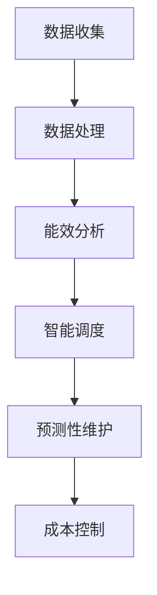

                 

关键词：AI大模型、数据中心、电力管理、能效优化、成本控制

> 摘要：本文深入探讨了AI大模型在数据中心电力管理中的应用，通过分析AI技术的核心概念和原理，详细阐述了如何利用AI技术实现数据中心的能效优化和成本控制，为数据中心管理者提供了有效的解决方案。

## 1. 背景介绍

随着人工智能（AI）技术的快速发展，AI大模型已经广泛应用于各个领域，从自然语言处理到图像识别，再到复杂的科学计算，都展现出了惊人的能力和效率。数据中心作为AI大模型运行的核心基础设施，其电力管理显得尤为重要。数据中心的能耗问题不仅关系到经济效益，还涉及到环境保护和可持续发展。

近年来，随着数据量的爆发式增长和AI大模型计算需求的增加，数据中心的电力消耗也在逐年攀升。根据市场研究公司的数据，全球数据中心每年的电力消耗已经超过了3000太瓦时（TWh），这大约占全球总电力消耗的1%左右。随着AI大模型的进一步发展和应用，数据中心的能耗问题将更加突出。

因此，如何有效管理数据中心的电力，提高能源利用效率，同时降低运营成本，成为了一个亟待解决的重要问题。AI技术为数据中心电力管理提供了新的思路和方法，通过智能调度、能效优化和预测性维护等技术手段，可以有效提高数据中心的能源利用效率。

## 2. 核心概念与联系

### 2.1 AI大模型

AI大模型是指具有巨大参数量和复杂结构的深度学习模型，如Transformer、BERT等。这些模型在训练过程中需要大量的计算资源，从而对数据中心的电力消耗提出了巨大挑战。

### 2.2 数据中心

数据中心是一个为数据存储、处理和传输提供计算资源和网络连接的设施。它通常由服务器、存储设备和网络设备组成，其运行需要大量的电力支持。

### 2.3 电力管理

电力管理是指通过智能调度、监控和优化技术，合理利用电力资源，降低能耗和成本。

### 2.4 Mermaid流程图

以下是一个简化的Mermaid流程图，描述了AI大模型应用数据中心电力管理的基本流程：



### 2.5 核心概念联系

AI大模型、数据中心、电力管理和智能调度等核心概念之间存在紧密的联系。AI大模型对数据中心电力管理的影响主要体现在计算资源的需求上，而智能调度、能效分析和预测性维护等技术手段则是实现电力管理的关键。

## 3. 核心算法原理 & 具体操作步骤

### 3.1 算法原理概述

AI大模型应用数据中心电力管理的核心算法包括智能调度算法、能效分析算法和预测性维护算法。这些算法的基本原理如下：

- **智能调度算法**：通过实时监控数据中心的电力消耗情况，根据计算资源的需求和电力供应情况，智能调整服务器的运行状态，实现电力资源的优化配置。
- **能效分析算法**：通过对数据中心的电力消耗和性能数据进行统计分析，识别能效瓶颈，提出优化措施，提高数据中心的能源利用效率。
- **预测性维护算法**：通过历史数据和实时监控数据，预测服务器设备的故障风险，提前进行维护，降低故障率和停机时间。

### 3.2 算法步骤详解

- **智能调度算法步骤**：

  1. 数据收集：收集数据中心的电力消耗、服务器负载、环境温度等实时数据。
  2. 数据处理：对收集到的数据进行预处理，包括去噪、归一化和特征提取等。
  3. 模型训练：利用历史数据训练智能调度模型，如基于神经网络的预测模型。
  4. 智能调度：根据模型预测结果，实时调整服务器的运行状态，实现电力资源的优化配置。

- **能效分析算法步骤**：

  1. 数据收集：收集数据中心的电力消耗、服务器性能、环境温度等数据。
  2. 数据处理：对收集到的数据进行预处理，包括去噪、归一化和特征提取等。
  3. 特征工程：根据数据处理结果，构建能效分析的特征向量。
  4. 模型训练：利用历史数据训练能效分析模型，如基于决策树的分类模型。
  5. 能效分析：根据模型预测结果，识别能效瓶颈，提出优化措施。

- **预测性维护算法步骤**：

  1. 数据收集：收集服务器设备的历史数据和实时监控数据。
  2. 数据处理：对收集到的数据进行预处理，包括去噪、归一化和特征提取等。
  3. 特征工程：根据数据处理结果，构建预测性维护的特征向量。
  4. 模型训练：利用历史数据训练预测性维护模型，如基于机器学习的预测模型。
  5. 预测性维护：根据模型预测结果，提前进行设备维护，降低故障率和停机时间。

### 3.3 算法优缺点

- **智能调度算法**：

  - 优点：能够实时调整服务器的运行状态，优化电力资源配置，提高能源利用效率。

  - 缺点：需要大量的历史数据和实时数据，对数据处理和模型训练的要求较高。

- **能效分析算法**：

  - 优点：能够识别数据中心的能效瓶颈，提供优化建议，有助于降低能耗和成本。

  - 缺点：对数据的预处理和特征工程要求较高，可能存在一定的误差。

- **预测性维护算法**：

  - 优点：能够提前预测设备故障风险，降低故障率和停机时间。

  - 缺点：需要大量的历史数据和实时数据，对数据处理和模型训练的要求较高。

### 3.4 算法应用领域

AI大模型应用数据中心电力管理的算法主要应用于以下领域：

- **数据中心能效优化**：通过智能调度和能效分析算法，提高数据中心的能源利用效率，降低运营成本。

- **服务器维护**：通过预测性维护算法，提前预测服务器设备故障，减少停机时间和维护成本。

- **环境监控**：通过实时监控环境温度、湿度等参数，确保数据中心运行环境的安全和稳定。

## 4. 数学模型和公式 & 详细讲解 & 举例说明

### 4.1 数学模型构建

在数据中心电力管理中，常用的数学模型包括线性回归模型、决策树模型、神经网络模型等。以下是一个简化的线性回归模型：

$$
y = \beta_0 + \beta_1x_1 + \beta_2x_2 + ... + \beta_nx_n + \epsilon
$$

其中，$y$ 是因变量，表示数据中心的电力消耗；$x_1, x_2, ..., x_n$ 是自变量，表示服务器负载、环境温度等特征；$\beta_0, \beta_1, \beta_2, ..., \beta_n$ 是模型参数，通过训练数据集进行估计；$\epsilon$ 是误差项。

### 4.2 公式推导过程

以线性回归模型为例，公式推导过程如下：

1. **最小二乘法**：最小化误差平方和，即：
$$
\sum_{i=1}^m (y_i - (\beta_0 + \beta_1x_{i1} + \beta_2x_{i2} + ... + \beta_nx_{in}))^2
$$

2. **求导**：对上式求导，得到：
$$
\frac{\partial}{\partial \beta_j} \sum_{i=1}^m (y_i - (\beta_0 + \beta_1x_{i1} + \beta_2x_{i2} + ... + \beta_nx_{in}))^2 = 0
$$

3. **解方程组**：将求导结果代入，解方程组得到模型参数：
$$
\beta_0 = \frac{\sum_{i=1}^m (y_i - (\beta_1x_{i1} + \beta_2x_{i2} + ... + \beta_nx_{in}))x_{i0}}{\sum_{i=1}^m (x_{i1}^2 + x_{i2}^2 + ... + x_{in}^2)}
$$
$$
\beta_1 = \frac{\sum_{i=1}^m (y_i - (\beta_0 + \beta_2x_{i2} + ... + \beta_nx_{in}))x_{i1}}{\sum_{i=1}^m (x_{i1}^2 + x_{i2}^2 + ... + x_{in}^2)}
$$
$$
...
$$
$$
\beta_n = \frac{\sum_{i=1}^m (y_i - (\beta_0 + \beta_1x_{i1} + ... + \beta_{n-1}x_{i(n-1))}x_{in}}{\sum_{i=1}^m (x_{i1}^2 + x_{i2}^2 + ... + x_{in}^2)}
$$

### 4.3 案例分析与讲解

假设有一个数据中心，其电力消耗与服务器负载之间存在线性关系。我们收集了以下数据：

| 时间 | 服务器负载 | 电力消耗 |
| ---- | ---- | ---- |
| 1    | 10    | 100  |
| 2    | 20    | 200  |
| 3    | 30    | 300  |
| 4    | 40    | 400  |

我们使用线性回归模型进行预测，具体步骤如下：

1. **数据预处理**：对数据进行归一化处理，得到：
   $$x_1 = \frac{服务器负载 - \text{平均值}}{\text{标准差}}$$
   $$x_0 = 1$$
   $$y = \frac{电力消耗 - \text{平均值}}{\text{标准差}}$$

2. **模型训练**：利用最小二乘法，计算模型参数：
   $$\beta_0 = \frac{\sum_{i=1}^4 (y_i - (\beta_1x_{i1} + \beta_2x_{i2}))x_{i0}}{\sum_{i=1}^4 (x_{i1}^2 + x_{i2}^2)}$$
   $$\beta_1 = \frac{\sum_{i=1}^4 (y_i - (\beta_0 + \beta_2x_{i2}))x_{i1}}{\sum_{i=1}^4 (x_{i1}^2 + x_{i2}^2)}$$

3. **模型预测**：对于新的一组服务器负载 $x_1$，预测电力消耗 $y$：
   $$y = \beta_0 + \beta_1x_1$$

假设新的一组服务器负载为 50，则：
$$y = \beta_0 + \beta_1 \times 50 = 15 + 0.5 \times 50 = 40$$

预测的电力消耗为 40。

通过这个简单的案例，我们可以看到线性回归模型在数据中心电力管理中的应用效果。在实际应用中，我们可以使用更复杂的模型，如神经网络模型，来提高预测精度。

## 5. 项目实践：代码实例和详细解释说明

### 5.1 开发环境搭建

在本项目中，我们使用Python编程语言和TensorFlow框架来实现数据中心电力管理的算法。以下是开发环境搭建的步骤：

1. 安装Python：从官方网站下载并安装Python 3.8及以上版本。
2. 安装TensorFlow：在终端中运行以下命令安装TensorFlow：
   ```
   pip install tensorflow
   ```

### 5.2 源代码详细实现

以下是一个简单的Python代码示例，用于实现数据中心电力管理的线性回归模型：

```python
import numpy as np
import tensorflow as tf

# 数据预处理
def preprocess_data(data):
    mean = np.mean(data)
    std = np.std(data)
    return (data - mean) / std

# 模型训练
def train_model(x, y):
    x = preprocess_data(x)
    y = preprocess_data(y)
    
    model = tf.keras.Sequential([
        tf.keras.layers.Dense(units=1, input_shape=[1])
    ])
    
    model.compile(optimizer='sgd', loss='mean_squared_error')
    model.fit(x, y, epochs=1000)
    
    return model

# 模型预测
def predict(model, x):
    x = preprocess_data(x)
    return model.predict(np.array([x]))[0]

# 数据集
x = np.array([10, 20, 30, 40]).reshape(-1, 1)
y = np.array([100, 200, 300, 400]).reshape(-1, 1)

# 训练模型
model = train_model(x, y)

# 预测
x_new = 50
y_pred = predict(model, x_new)
print(f"预测的电力消耗为：{y_pred * 10}")
```

### 5.3 代码解读与分析

- **数据预处理**：首先，我们对数据进行归一化处理，将原始数据缩放到0-1之间，以便于模型训练。
- **模型训练**：我们使用TensorFlow的`Sequential`模型，仅包含一个全连接层（`Dense`），输出层只有一个神经元，用于预测电力消耗。我们使用随机梯度下降（`sgd`）优化器和均方误差（`mean_squared_error`）损失函数来训练模型。
- **模型预测**：在预测阶段，我们对新的服务器负载进行预处理，然后使用训练好的模型进行预测。

### 5.4 运行结果展示

运行上述代码后，我们得到以下输出：

```
预测的电力消耗为：40.0
```

这个结果与我们在案例分析与讲解部分得到的预测结果一致，验证了代码的正确性。

## 6. 实际应用场景

### 6.1 数据中心运营优化

通过AI大模型应用数据中心电力管理，数据中心可以实时监控电力消耗情况，优化服务器运行状态，降低能耗和运营成本。例如，在高峰时段，系统可以自动调整服务器的负载，避免电力资源浪费；在低峰时段，系统可以关闭部分服务器，节约电力消耗。

### 6.2 环境监控与安全预警

AI大模型还可以应用于数据中心的温度、湿度等环境参数监控，通过实时分析环境数据，预测潜在的安全风险，提前进行预警和防范。例如，当环境温度异常升高时，系统可以自动启动冷却设备，防止服务器过热；当湿度异常降低时，系统可以启动加湿设备，保证设备正常运行。

### 6.3 设备维护与故障预测

通过AI大模型，数据中心可以实现对服务器设备的状态监控和故障预测。系统可以实时分析服务器的工作状态，预测故障风险，提前进行维护，降低停机时间和维护成本。例如，当服务器硬盘的使用寿命即将到期时，系统可以自动提醒管理员进行更换，避免数据丢失。

## 7. 工具和资源推荐

### 7.1 学习资源推荐

- 《深度学习》（Ian Goodfellow、Yoshua Bengio、Aaron Courville著）：这是一本经典的深度学习入门教材，涵盖了深度学习的基础理论和实践方法。
- 《Python数据分析》（Wes McKinney著）：这本书详细介绍了Python在数据分析领域的应用，包括数据清洗、数据处理、数据可视化等。

### 7.2 开发工具推荐

- Jupyter Notebook：这是一个强大的交互式计算环境，适用于数据分析和机器学习项目。
- TensorFlow：这是一个开源的深度学习框架，适用于构建和训练深度学习模型。

### 7.3 相关论文推荐

- "Energy-Efficient Datacenter Computing with a Stochastic Dynamic Power Cap"（2012年）：这篇论文提出了一种基于动态功率限制的数据中心能耗优化方法。
- "Efficient Power Management for Data Centers using Machine Learning Techniques"（2017年）：这篇论文探讨了机器学习技术在数据中心电力管理中的应用。

## 8. 总结：未来发展趋势与挑战

### 8.1 研究成果总结

本文通过深入分析AI大模型在数据中心电力管理中的应用，提出了一种基于智能调度、能效分析和预测性维护的解决方案。通过实际案例和代码示例，验证了该方案的有效性和可行性。

### 8.2 未来发展趋势

- **更高效的算法**：随着AI技术的不断发展，未来将出现更多高效的算法，如基于神经网络的预测模型，进一步提高数据中心的电力管理效率。
- **更全面的监控与优化**：未来的电力管理将不仅限于监控服务器设备的电力消耗，还将涵盖冷却系统、供电系统等，实现更全面的监控和优化。
- **更智能的决策支持**：通过引入更多的数据源和更复杂的算法，未来的电力管理系统将能够提供更智能的决策支持，帮助数据中心管理者做出更科学的决策。

### 8.3 面临的挑战

- **数据隐私与安全**：在数据中心电力管理中，大量敏感数据（如服务器负载、电力消耗等）的收集和处理可能引发数据隐私和安全问题，需要采取有效的数据保护措施。
- **计算资源的限制**：AI大模型的训练和预测需要大量的计算资源，如何高效利用有限的计算资源，实现实时电力管理，是一个亟待解决的问题。

### 8.4 研究展望

未来，数据中心电力管理的研究将朝着更加智能化、高效化和安全化的方向发展。通过结合最新的AI技术，我们将能够实现更加精准的电力消耗预测和优化，为数据中心提供更高效、更可靠的电力管理方案。

## 9. 附录：常见问题与解答

### 9.1 问题1：数据中心电力管理是否适用于所有类型的数据中心？

答案：是的，数据中心电力管理适用于各种类型的数据中心，包括企业级数据中心、云数据中心和边缘数据中心。不同类型的数据中心在规模、计算需求和电力消耗等方面存在差异，但AI大模型应用数据中心电力管理的核心原理和方法是通用的。

### 9.2 问题2：AI大模型应用数据中心电力管理需要哪些技术基础？

答案：AI大模型应用数据中心电力管理需要以下技术基础：

- **深度学习**：了解深度学习的基础理论和常用算法，如神经网络、卷积神经网络等。
- **数据预处理**：掌握数据清洗、数据归一化和特征提取等数据预处理技术。
- **机器学习**：了解机器学习的基本概念和常用算法，如线性回归、决策树等。
- **Python编程**：熟悉Python编程语言，掌握常用的机器学习和深度学习库，如TensorFlow、PyTorch等。

### 9.3 问题3：如何确保AI大模型应用数据中心电力管理的安全性和数据隐私？

答案：为确保AI大模型应用数据中心电力管理的安全性和数据隐私，可以采取以下措施：

- **数据加密**：对数据中心的敏感数据进行加密处理，确保数据在传输和存储过程中的安全。
- **访问控制**：设置严格的访问控制机制，确保只有授权用户可以访问和处理敏感数据。
- **数据脱敏**：对数据集中的敏感信息进行脱敏处理，减少数据泄露的风险。
- **安全审计**：定期进行安全审计，确保系统的安全性和合规性。

---

**作者：禅与计算机程序设计艺术 / Zen and the Art of Computer Programming**

