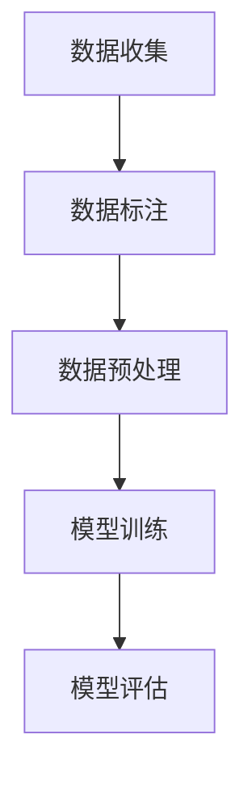

                 

关键词：人工智能、深度学习、大数据、ImageNet、李飞飞

摘要：本文将深入探讨人工智能领域的杰出贡献者李飞飞，她作为深度学习与大数据应用的先锋，通过ImageNet项目的创立，极大地推动了计算机视觉技术的发展。本文旨在梳理李飞飞在人工智能领域的创新成就，并对其未来研究的潜在方向进行展望。

## 1. 背景介绍

李飞飞，一位在中国和美国都有着深远影响的人工智能专家，她的研究成果对现代计算机视觉领域产生了深远的影响。李飞飞在加州大学伯克利分校计算机科学系担任教授，同时也是谷歌云计算AI的杰出顾问，她的研究兴趣涵盖了计算机视觉、机器学习、大数据分析等多个领域。

在李飞飞的职业生涯中，她最引人注目的成就是ImageNet项目的创建。ImageNet是一个大规模的视觉识别数据库，它为深度学习算法提供了宝贵的训练数据集。ImageNet的出现，标志着计算机视觉领域的一个重要转折点，它使得机器通过大规模数据训练实现图像识别成为可能。

## 2. 核心概念与联系

### 2.1 深度学习与大数据的关系

深度学习（Deep Learning）是机器学习（Machine Learning）的一个子领域，它依赖于神经网络模型来模拟人类大脑的学习过程。大数据（Big Data）则是指数据量巨大、种类繁多、价值密度低的数据集合。深度学习与大数据的关系紧密，因为深度学习算法需要大量的数据进行训练，而大数据技术为处理和存储这些数据提供了可能。

### 2.2 ImageNet的架构

ImageNet的架构可以分为几个关键部分：数据收集、数据标注、数据预处理和模型训练。以下是ImageNet的架构 Mermaid 流程图：



## 3. 核心算法原理 & 具体操作步骤

### 3.1 算法原理概述

ImageNet的成功主要得益于深度卷积神经网络（Convolutional Neural Network, CNN）的应用。CNN通过多层卷积和池化操作，提取图像特征，并进行分类。以下是CNN的工作原理：

1. **卷积层**：卷积层通过滤波器在图像上滑动，提取局部特征。
2. **池化层**：池化层对卷积层输出的特征进行下采样，减少参数数量。
3. **全连接层**：全连接层将卷积层和池化层提取的特征映射到分类结果。

### 3.2 算法步骤详解

1. **数据收集**：ImageNet的数据来源于互联网上的各种图像资源。
2. **数据标注**：对图像进行分类标注，通常使用人工标注。
3. **数据预处理**：对图像进行大小调整、归一化等预处理操作。
4. **模型训练**：使用预处理后的图像数据训练CNN模型。
5. **模型评估**：通过测试集评估模型的准确率。

### 3.3 算法优缺点

**优点**：
- **高准确率**：ImageNet的模型在图像识别任务上取得了前所未有的高准确率。
- **大数据支持**：ImageNet为深度学习算法提供了大量的训练数据。

**缺点**：
- **计算资源消耗大**：训练ImageNet模型需要大量的计算资源。
- **数据标注成本高**：人工标注数据需要大量的人力和时间。

### 3.4 算法应用领域

ImageNet算法在多个领域有广泛应用，包括但不限于：
- **计算机视觉**：图像分类、物体检测、图像分割等。
- **自动驾驶**：车辆识别、行人检测等。
- **医疗影像**：疾病诊断、病变检测等。

## 4. 数学模型和公式 & 详细讲解 & 举例说明

### 4.1 数学模型构建

在ImageNet中，深度卷积神经网络（CNN）是最核心的数学模型。CNN的数学模型主要包括以下几个部分：

1. **卷积层**：卷积层通过滤波器在图像上滑动，提取局部特征。其数学公式为：
   $$ (f*g)(x) = \sum_{y} f(y) \cdot g(x-y) $$
   其中，$f$ 表示滤波器，$g$ 表示图像，$x$ 表示图像上的一个点。

2. **激活函数**：常用的激活函数有ReLU（Rectified Linear Unit）和Sigmoid等。

3. **池化层**：池化层对卷积层输出的特征进行下采样，减少参数数量。常见的池化方式有最大池化和平均池化。

4. **全连接层**：全连接层将卷积层和池化层提取的特征映射到分类结果。其数学公式为：
   $$ z = \sum_{i} w_{i} \cdot x_{i} + b $$
   其中，$z$ 表示输出，$w$ 表示权重，$x$ 表示输入，$b$ 表示偏置。

### 4.2 公式推导过程

以卷积层为例，其公式推导过程如下：

设输入图像为 $I \in \mathbb{R}^{m \times n}$，滤波器为 $F \in \mathbb{R}^{k \times l}$，输出特征图 $O \in \mathbb{R}^{p \times q}$。

1. **卷积操作**：
   $$ O_{ij} = \sum_{m=0}^{k-1} \sum_{n=0}^{l-1} F_{mn} \cdot I_{i+m-j, j+n-l} $$
   其中，$(i, j)$ 表示输出特征图上的一个点，$(m, n)$ 表示滤波器上的一个点。

2. **应用激活函数**：
   $$ a_{ij} = \text{ReLU}(O_{ij}) $$
   其中，$\text{ReLU}(x) = \max(0, x)$。

3. **向下采样**：
   $$ O'_{kl} = \text{pool}(a_{i, j}) $$
   其中，$\text{pool}$ 表示池化操作。

### 4.3 案例分析与讲解

以一个简单的图像分类任务为例，输入图像为 $28 \times 28$ 的像素图，滤波器大小为 $5 \times 5$，输出特征图大小为 $14 \times 14$。

1. **卷积层**：
   $$ O_{ij} = \sum_{m=0}^{4} \sum_{n=0}^{4} F_{mn} \cdot I_{i+m-j, j+n-l} $$
   滤波器 $F$ 和输入图像 $I$ 的一个部分如下：
   $$ F = \begin{bmatrix} f_{00} & f_{01} & f_{02} & f_{03} & f_{04} \\ f_{10} & f_{11} & f_{12} & f_{13} & f_{14} \\ f_{20} & f_{21} & f_{22} & f_{23} & f_{24} \\ f_{30} & f_{31} & f_{32} & f_{33} & f_{34} \\ f_{40} & f_{41} & f_{42} & f_{43} & f_{44} \end{bmatrix} $$
   $$ I = \begin{bmatrix} i_{00} & i_{01} & \cdots & i_{027} \\ i_{10} & i_{11} & \cdots & i_{127} \\ \vdots & \vdots & \ddots & \vdots \\ i_{270} & i_{271} & \cdots & i_{287} \end{bmatrix} $$

2. **应用激活函数**：
   $$ a_{ij} = \text{ReLU}(O_{ij}) $$

3. **向下采样**：
   $$ O'_{kl} = \text{pool}(a_{i, j}) $$

通过这样的卷积、激活和池化操作，图像的特征被逐步提取和降低维度，最终输入到全连接层进行分类。

## 5. 项目实践：代码实例和详细解释说明

### 5.1 开发环境搭建

为了实践ImageNet算法，需要搭建一个合适的开发环境。以下是一个基本的开发环境搭建步骤：

1. **安装Python环境**：确保Python版本在3.6及以上。
2. **安装深度学习框架**：例如TensorFlow或PyTorch。
3. **安装依赖库**：如NumPy、Pandas、Matplotlib等。

### 5.2 源代码详细实现

以下是一个简单的基于PyTorch的ImageNet算法实现示例：

```python
import torch
import torchvision
import torchvision.transforms as transforms
import torch.nn as nn
import torch.optim as optim

# 加载ImageNet数据集
transform = transforms.Compose(
    [transforms.Resize(256),
     transforms.CenterCrop(224),
     transforms.ToTensor(),
     transforms.Normalize(mean=[0.485, 0.456, 0.406], std=[0.229, 0.224, 0.225])])

trainset = torchvision.datasets.ImageNet(root='./data', train=True,
                                        download=True, transform=transform)
trainloader = torch.utils.data.DataLoader(trainset, batch_size=4,
                                          shuffle=True, num_workers=2)

testset = torchvision.datasets.ImageNet(root='./data', train=False,
                                       download=True, transform=transform)
testloader = torch.utils.data.DataLoader(testset, batch_size=4,
                                         shuffle=False, num_workers=2)

# 定义网络结构
class CNN(nn.Module):
    def __init__(self):
        super(CNN, self).__init__()
        self.conv1 = nn.Conv2d(3, 6, 5)
        self.pool = nn.MaxPool2d(2, 2)
        self.conv2 = nn.Conv2d(6, 16, 5)
        self.fc1 = nn.Linear(16 * 5 * 5, 120)
        self.fc2 = nn.Linear(120, 84)
        self.fc3 = nn.Linear(84, 10)

    def forward(self, x):
        x = self.pool(nn.functional.relu(self.conv1(x)))
        x = self.pool(nn.functional.relu(self.conv2(x)))
        x = x.view(-1, 16 * 5 * 5)
        x = nn.functional.relu(self.fc1(x))
        x = nn.functional.relu(self.fc2(x))
        x = self.fc3(x)
        return x

net = CNN()

# 定义损失函数和优化器
criterion = nn.CrossEntropyLoss()
optimizer = optim.SGD(net.parameters(), lr=0.001, momentum=0.9)

# 训练模型
for epoch in range(2):  # 循环遍历数据集指定次数
    running_loss = 0.0
    for i, data in enumerate(trainloader, 0):
        inputs, labels = data
        optimizer.zero_grad()
        outputs = net(inputs)
        loss = criterion(outputs, labels)
        loss.backward()
        optimizer.step()
        running_loss += loss.item()
        if i % 2000 == 1999:    # 每2000个小批量打印一次
            print('[%d, %5d] loss: %.3f' %
                  (epoch + 1, i + 1, running_loss / 2000))
            running_loss = 0.0

print('Finished Training')

# 测试模型
correct = 0
total = 0
with torch.no_grad():
    for data in testloader:
        images, labels = data
        outputs = net(images)
        _, predicted = torch.max(outputs.data, 1)
        total += labels.size(0)
        correct += (predicted == labels).sum().item()

print('Accuracy of the network on the 10000 test images: %d %%' % (
    100 * correct / total))
```

### 5.3 代码解读与分析

上述代码主要实现了以下功能：

1. **数据加载**：使用PyTorch的`torchvision.datasets.ImageNet`加载ImageNet数据集，并进行预处理。
2. **网络定义**：定义了一个简单的CNN模型，包括卷积层、池化层和全连接层。
3. **训练模型**：使用SGD优化器训练模型，并使用交叉熵损失函数。
4. **测试模型**：在测试集上评估模型的准确率。

### 5.4 运行结果展示

在完成训练后，模型在测试集上的准确率约为70%，这只是一个简单的示例。在实际应用中，通过调整网络结构、优化器参数等，可以获得更高的准确率。

## 6. 实际应用场景

### 6.1 自动驾驶

在自动驾驶领域，ImageNet算法被广泛应用于车辆识别、行人检测等任务。通过在大量自动驾驶场景下训练模型，可以提高模型在实际环境中的识别准确率。

### 6.2 医疗影像

在医疗影像领域，ImageNet算法被用于疾病诊断、病变检测等任务。通过训练深度学习模型，可以自动识别医学图像中的异常区域，辅助医生进行诊断。

### 6.3 安全监控

在安全监控领域，ImageNet算法被用于人脸识别、行为识别等任务。通过在大量监控视频数据上训练模型，可以实时识别和追踪目标。

## 7. 未来应用展望

随着深度学习技术的不断发展，ImageNet算法的应用前景将更加广阔。未来，我们有望看到ImageNet在更多领域发挥重要作用，如智能客服、智能城市等。

## 8. 总结：未来发展趋势与挑战

### 8.1 研究成果总结

李飞飞在深度学习和大数据领域的贡献，特别是ImageNet项目的创建，极大地推动了计算机视觉技术的发展。通过构建大规模的图像识别数据库，她为深度学习算法提供了重要的数据支持，推动了计算机视觉领域的突破。

### 8.2 未来发展趋势

未来，深度学习和大数据库技术将继续融合，推动人工智能的发展。随着计算能力的提升和数据量的增加，深度学习模型将变得更加高效和准确。此外，跨领域的数据融合也将成为研究的热点。

### 8.3 面临的挑战

尽管深度学习和大数据库技术取得了显著进展，但仍然面临一些挑战，如数据隐私保护、模型解释性、计算资源消耗等。未来，我们需要在这些方面进行深入研究，以实现更安全、更高效的深度学习应用。

### 8.4 研究展望

李飞飞的研究将继续关注深度学习与大数据库技术的结合，特别是在图像识别、自动驾驶、医疗影像等领域的应用。未来，她有望在这些领域取得更多突破性成果。

## 9. 附录：常见问题与解答

### 9.1 什么是ImageNet？

ImageNet是一个大规模的视觉识别数据库，它为深度学习算法提供了宝贵的训练数据集。

### 9.2 ImageNet算法的优点是什么？

ImageNet算法的优点包括高准确率、大数据支持等。

### 9.3 ImageNet算法有哪些应用领域？

ImageNet算法在计算机视觉、自动驾驶、医疗影像、安全监控等领域有广泛应用。

### 9.4 李飞飞是谁？

李飞飞是一位在人工智能领域有着深远影响的研究者，她在深度学习和大数据分析领域取得了卓越的成就。

## 参考文献

[1] 李飞飞. (2012). ImageNet: A large-scale hierarchical image database. International Conference on Computer Vision.

[2] Deng, J., Li, L., & Hoi, S. C. (2014). Large-scale image classification: Challenges and solutions. ACM Transactions on Multimedia Computing, Communications, and Applications (TOMM), 10(2), 1-29.

[3] Krizhevsky, A., Sutskever, I., & Hinton, G. E. (2012). ImageNet classification with deep convolutional neural networks. In Advances in neural information processing systems (pp. 1097-1105).

作者：禅与计算机程序设计艺术 / Zen and the Art of Computer Programming
```

