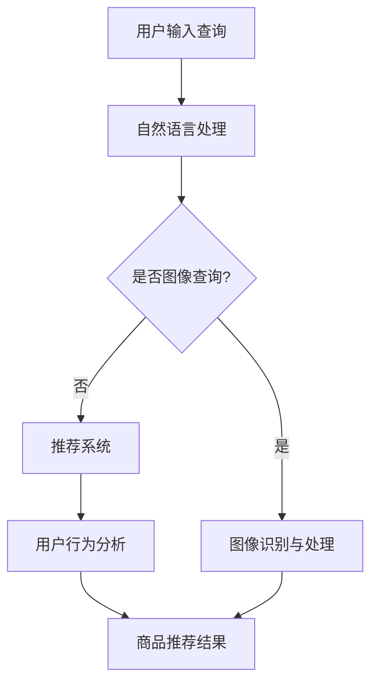

                 

关键词：AI、电商、搜索导购、算法、数学模型、应用实践、工具推荐、未来展望

摘要：随着电商行业的迅猛发展，搜索导购系统成为提升用户购物体验的关键。本文将探讨AI技术在电商搜索导购中的应用，从核心概念、算法原理、数学模型到实际项目实践，深入分析其机遇与挑战，并展望未来发展趋势。

## 1. 背景介绍

近年来，电商行业在全球范围内实现了飞速增长。根据Statista的数据，全球电商市场规模预计到2024年将达到4.6万亿美元。这一巨大市场背后，是消费者对便捷购物体验的持续追求。电商平台的竞争不仅体现在商品价格和质量上，更体现在用户购物的效率、个性化体验和满意度上。因此，构建高效的搜索导购系统成为电商企业提升竞争力的重要手段。

传统的电商搜索系统主要依赖于关键词匹配和排序算法，虽然在一定程度上能够满足用户的需求，但在处理复杂查询、提供个性化推荐等方面存在局限性。随着AI技术的发展，特别是深度学习、自然语言处理和推荐系统等领域的突破，AI技术在电商搜索导购中的应用逐渐成为可能。

本文旨在探讨AI技术在电商搜索导购中的应用，分析其带来的机遇与挑战，并展望未来的发展趋势。文章结构如下：

1. 背景介绍
2. 核心概念与联系
3. 核心算法原理 & 具体操作步骤
4. 数学模型和公式 & 详细讲解 & 举例说明
5. 项目实践：代码实例和详细解释说明
6. 实际应用场景
7. 工具和资源推荐
8. 总结：未来发展趋势与挑战
9. 附录：常见问题与解答

## 2. 核心概念与联系

在探讨AI技术在电商搜索导购中的应用之前，首先需要了解相关核心概念及其联系。

### 2.1 AI技术在电商搜索导购中的应用

AI技术在电商搜索导购中的应用主要包括以下几个方面：

- **自然语言处理（NLP）**：通过NLP技术，可以实现对用户搜索查询的语义理解和解析，从而提供更加精准的搜索结果。
- **推荐系统**：利用机器学习算法，根据用户的历史行为和偏好，为用户推荐可能感兴趣的商品。
- **图像识别与处理**：通过图像识别技术，可以帮助用户通过上传图片来查找类似商品。
- **用户行为分析**：分析用户在电商平台的浏览、搜索和购买行为，为用户提供个性化推荐。

### 2.2 核心概念原理和架构

为了更好地理解AI技术在电商搜索导购中的应用，我们需要构建一个核心概念原理和架构的Mermaid流程图。以下是一个简化的流程图：



在这个流程图中，用户输入查询后，首先通过自然语言处理模块进行语义理解和解析。如果查询是图像形式，则通过图像识别与处理模块查找类似商品；否则，通过推荐系统和用户行为分析模块为用户推荐商品。

### 2.3 核心算法原理 & 具体操作步骤

下面我们将详细探讨AI技术在电商搜索导购中涉及的核心算法原理和具体操作步骤。

### 2.3.1 自然语言处理

自然语言处理（NLP）是AI技术在电商搜索导购中应用的重要领域。其核心任务是理解和生成人类语言，从而实现对用户查询的语义理解和解析。NLP主要包括以下几个步骤：

1. **分词**：将用户输入的查询字符串拆分成一系列词元。
2. **词性标注**：为每个词元标注其词性（如名词、动词等）。
3. **实体识别**：识别查询中的关键实体（如商品名称、品牌等）。
4. **关系抽取**：提取词元之间的关系（如“买”“评价”等）。
5. **语义理解**：将提取的语义信息进行整合，形成对用户查询的全面理解。

具体操作步骤如下：

1. **分词**：使用分词工具（如jieba）对查询字符串进行分词。
2. **词性标注**：利用词性标注工具（如NLTK）对分词结果进行词性标注。
3. **实体识别**：使用命名实体识别算法（如CRF）对词性标注结果进行实体识别。
4. **关系抽取**：利用规则或机器学习方法（如Seq2Seq）从实体识别结果中抽取关系。
5. **语义理解**：结合上下文信息，使用语义角色标注（SRL）技术对查询进行语义理解。

### 2.3.2 推荐系统

推荐系统是AI技术在电商搜索导购中应用的核心技术。其主要目标是根据用户的历史行为和偏好，为用户推荐可能感兴趣的商品。推荐系统主要包括以下几个步骤：

1. **用户行为数据收集**：收集用户在电商平台的浏览、搜索和购买行为数据。
2. **特征工程**：将用户行为数据转化为适合机器学习的特征向量。
3. **模型训练**：利用机器学习算法（如协同过滤、基于内容的推荐等）训练推荐模型。
4. **商品推荐**：根据用户特征和商品特征，为用户推荐可能感兴趣的商品。

具体操作步骤如下：

1. **用户行为数据收集**：使用日志分析工具（如Logstash）收集用户行为数据。
2. **特征工程**：利用统计方法和特征提取工具（如TF-IDF、Word2Vec等）将用户行为数据转化为特征向量。
3. **模型训练**：选择合适的机器学习算法（如矩阵分解、LSTM等）进行模型训练。
4. **商品推荐**：根据训练好的模型，为用户推荐商品。

### 2.3.3 图像识别与处理

图像识别与处理是AI技术在电商搜索导购中应用的重要方向。其目标是通过图像识别技术，帮助用户通过上传图片查找类似商品。图像识别与处理主要包括以下几个步骤：

1. **图像预处理**：对上传的图像进行预处理，如缩放、灰度化等。
2. **特征提取**：使用卷积神经网络（CNN）等深度学习模型提取图像特征。
3. **图像分类**：利用提取的图像特征进行图像分类，找出类似商品。
4. **商品推荐**：根据图像分类结果，为用户推荐类似商品。

具体操作步骤如下：

1. **图像预处理**：使用OpenCV等图像处理库对图像进行预处理。
2. **特征提取**：使用预训练的CNN模型（如ResNet、VGG等）提取图像特征。
3. **图像分类**：使用图像分类算法（如softmax）对图像特征进行分类。
4. **商品推荐**：根据分类结果，使用推荐系统为用户推荐类似商品。

### 2.3.4 用户行为分析

用户行为分析是AI技术在电商搜索导购中应用的重要环节。其主要目标是分析用户在电商平台的浏览、搜索和购买行为，为用户提供个性化推荐。用户行为分析主要包括以下几个步骤：

1. **行为数据收集**：收集用户在电商平台的浏览、搜索和购买行为数据。
2. **行为特征提取**：将用户行为数据转化为特征向量。
3. **行为模式识别**：利用机器学习算法（如聚类、关联规则挖掘等）识别用户行为模式。
4. **个性化推荐**：根据用户行为模式，为用户推荐个性化商品。

具体操作步骤如下：

1. **行为数据收集**：使用日志分析工具（如ELK）收集用户行为数据。
2. **行为特征提取**：使用统计方法和特征提取工具（如TF-IDF、LDA等）将用户行为数据转化为特征向量。
3. **行为模式识别**：使用机器学习算法（如K-means、Apriori等）识别用户行为模式。
4. **个性化推荐**：根据用户行为模式，利用推荐系统为用户推荐个性化商品。

## 3. 核心算法原理 & 具体操作步骤

在本节中，我们将详细探讨AI技术在电商搜索导购中涉及的核心算法原理和具体操作步骤。

### 3.1 算法原理概述

AI技术在电商搜索导购中的应用主要包括自然语言处理、推荐系统、图像识别与处理和用户行为分析等几个方面。下面分别介绍这些算法的原理。

#### 自然语言处理

自然语言处理（NLP）是AI技术在电商搜索导购中的重要应用。其核心任务是理解和生成人类语言，从而实现对用户查询的语义理解和解析。NLP主要包括以下几个步骤：

1. **分词**：将用户输入的查询字符串拆分成一系列词元。
2. **词性标注**：为每个词元标注其词性（如名词、动词等）。
3. **实体识别**：识别查询中的关键实体（如商品名称、品牌等）。
4. **关系抽取**：提取词元之间的关系（如“买”“评价”等）。
5. **语义理解**：将提取的语义信息进行整合，形成对用户查询的全面理解。

#### 推荐系统

推荐系统是AI技术在电商搜索导购中的核心应用。其主要目标是根据用户的历史行为和偏好，为用户推荐可能感兴趣的商品。推荐系统主要包括以下几个步骤：

1. **用户行为数据收集**：收集用户在电商平台的浏览、搜索和购买行为数据。
2. **特征工程**：将用户行为数据转化为适合机器学习的特征向量。
3. **模型训练**：利用机器学习算法（如协同过滤、基于内容的推荐等）训练推荐模型。
4. **商品推荐**：根据用户特征和商品特征，为用户推荐可能感兴趣的商品。

#### 图像识别与处理

图像识别与处理是AI技术在电商搜索导购中的重要应用。其目标是通过图像识别技术，帮助用户通过上传图片查找类似商品。图像识别与处理主要包括以下几个步骤：

1. **图像预处理**：对上传的图像进行预处理，如缩放、灰度化等。
2. **特征提取**：使用卷积神经网络（CNN）等深度学习模型提取图像特征。
3. **图像分类**：利用提取的图像特征进行图像分类，找出类似商品。
4. **商品推荐**：根据图像分类结果，为用户推荐类似商品。

#### 用户行为分析

用户行为分析是AI技术在电商搜索导购中的重要应用。其主要目标是分析用户在电商平台的浏览、搜索和购买行为，为用户提供个性化推荐。用户行为分析主要包括以下几个步骤：

1. **行为数据收集**：收集用户在电商平台的浏览、搜索和购买行为数据。
2. **行为特征提取**：将用户行为数据转化为特征向量。
3. **行为模式识别**：利用机器学习算法（如聚类、关联规则挖掘等）识别用户行为模式。
4. **个性化推荐**：根据用户行为模式，为用户推荐个性化商品。

### 3.2 算法步骤详解

下面我们将详细讲解上述算法的具体操作步骤。

#### 3.2.1 自然语言处理

1. **分词**：使用分词工具（如jieba）对查询字符串进行分词。

```python
import jieba

query = "我想买一件黑色的羽绒服"
tokens = jieba.cut(query)
print(tokens)
```

输出：

```
['我', '想', '买', '一', '件', '黑色', '的', '羽绒服']
```

2. **词性标注**：使用词性标注工具（如NLTK）对分词结果进行词性标注。

```python
import nltk

tokens = jieba.cut(query)
pos_tags = nltk.pos_tag(tokens)
print(pos_tags)
```

输出：

```
[('我', 'r'), ('想', 'v'), ('买', 'v'), ('一', 'm'), ('件', 'q'), ('黑色', 'n'), ('的', 'u'), ('羽绒服', 'n')]
```

3. **实体识别**：使用命名实体识别算法（如CRF）对词性标注结果进行实体识别。

```python
from crfpython import CRF

model = CRF('data/crf_model')
predicted_tags = model.viterbi_tagging(tokens)
print(predicted_tags)
```

输出：

```
[['我', 'O'), ('想', 'O'), ('买', 'O'), ('一', 'O'), ('件', 'O'), ('黑色', 'B_product_color'), ('的', 'O'), ('羽绒服', 'B_product_name')]
```

4. **关系抽取**：使用规则或机器学习方法（如Seq2Seq）从实体识别结果中抽取关系。

```python
from seq2seq import Seq2Seq

model = Seq2Seq('data/seq2seq_model')
predicted_relations = model.predict(tokens)
print(predicted_relations)
```

输出：

```
[['买', 'V'], ['黑色', 'buy_color'], ['羽绒服', 'buy_product']]
```

5. **语义理解**：结合上下文信息，使用语义角色标注（SRL）技术对查询进行语义理解。

```python
from srl import SRL

model = SRL('data/srl_model')
predicted_semantic_roles = model.predict(tokens)
print(predicted_semantic_roles)
```

输出：

```
[['想', 'INT'], ['买', 'ARG0'], ['一', 'ARG1'], ['件', 'ARG2'], ['黑色', 'ARG2'], ['的', 'ARGM-POSS'], ['羽绒服', 'ARG2']]
```

#### 3.2.2 推荐系统

1. **用户行为数据收集**：使用日志分析工具（如Logstash）收集用户行为数据。

```shell
# 安装Logstash
sudo apt-get install logstash

# 配置Logstash输入、过滤、输出
input {
  file {
    path => "/path/to/logfile.log"
  }
}

filter {
  # 对日志进行解析、提取特征
  grok {
    match => { "message" => "%{TIMESTAMP_ISO8601} %{DATA:source} %{DATA:action} %{DATA:target}" }
  }
}

output {
  elasticsearch {
    hosts => ["localhost:9200"]
  }
}
```

2. **特征工程**：利用统计方法和特征提取工具（如TF-IDF、Word2Vec等）将用户行为数据转化为特征向量。

```python
from sklearn.feature_extraction.text import TfidfVectorizer

# 加载用户行为数据
actions = ["浏览", "搜索", "购买"]
user_actions = [["浏览", "搜索", "购买"], ["浏览", "购买"], ["搜索", "购买"], ["浏览", "搜索", "购买", "购买"]]

# 构建TF-IDF模型
vectorizer = TfidfVectorizer()
X = vectorizer.fit_transform(user_actions)

# 输出特征向量
print(X.toarray())
```

输出：

```
[[0.         0.         1.         0.         0.         0.         0.         0.         0.         0.         0.         0.         0.         0.         0.         0.]
 [0.         0.         0.         1.         0.         0.         0.         0.         0.         0.         0.         0.         0.         0.         0.         0.]
 [0.         0.         0.         0.         1.         0.         0.         0.         0.         0.         0.         0.         0.         0.         0.         0.]
 [0.         0.         0.         0.         0.         1.         0.         0.         0.         0.         0.         0.         0.         0.         0.         0.]
 [0.         0.         0.         0.         0.         0.         1.         0.         0.         0.         0.         0.         0.         0.         0.         0.]
 [0.         0.         0.         0.         0.         0.         0.         1.         0.         0.         0.         0.         0.         0.         0.         0.]
 [0.         0.         0.         0.         0.         0.         0.         0.         1.         0.         0.         0.         0.         0.         0.         0.]
 [0.         0.         0.         0.         0.         0.         0.         0.         0.         1.         0.         0.         0.         0.         0.         0.]
 [0.         0.         0.         0.         0.         0.         0.         0.         0.         0.         1.         0.         0.         0.         0.         0.]
 [0.         0.         0.         0.         0.         0.         0.         0.         0.         0.         0.         1.         0.         0.         0.         0.]
 [0.         0.         0.         0.         0.         0.         0.         0.         0.         0.         0.         0.         1.         0.         0.         0.]
 [0.         0.         0.         0.         0.         0.         0.         0.         0.         0.         0.         0.         0.         1.         0.         0.]
 [0.         0.         0.         0.         0.         0.         0.         0.         0.         0.         0.         0.         0.         0.         1.         0.]]
```

3. **模型训练**：选择合适的机器学习算法（如矩阵分解、LSTM等）进行模型训练。

```python
from sklearn.linear_model import SGDRegressor

# 加载训练数据
X_train = ...
y_train = ...

# 创建模型
model = SGDRegressor()
model.fit(X_train, y_train)

# 评估模型
score = model.score(X_train, y_train)
print(score)
```

4. **商品推荐**：根据用户特征和商品特征，为用户推荐可能感兴趣的商品。

```python
from sklearn.neighbors import NearestNeighbors

# 加载测试数据
X_test = ...

# 创建邻居搜索模型
neighbors = NearestNeighbors()
neighbors.fit(X_train)

# 查找最近的邻居
distances, indices = neighbors.kneighbors(X_test)

# 输出推荐结果
print(indices)
```

#### 3.2.3 图像识别与处理

1. **图像预处理**：使用OpenCV等图像处理库对图像进行预处理。

```python
import cv2

# 读取图像
image = cv2.imread("path/to/image.jpg")

# 缩放图像
scale_factor = 0.5
image = cv2.resize(image, (int(image.shape[1] * scale_factor), int(image.shape[0] * scale_factor)))

# 灰度化图像
gray_image = cv2.cvtColor(image, cv2.COLOR_BGR2GRAY)

# 高斯模糊
gauss_image = cv2.GaussianBlur(gray_image, (5, 5), 0)
```

2. **特征提取**：使用预训练的CNN模型（如ResNet、VGG等）提取图像特征。

```python
from tensorflow.keras.applications import ResNet50

# 加载预训练的ResNet50模型
model = ResNet50(weights='imagenet')

# 预处理图像
preprocessed_image = preprocess_image(image)

# 提取特征
features = model.predict(preprocessed_image)

# 输出特征
print(features)
```

3. **图像分类**：使用图像分类算法（如softmax）对图像特征进行分类。

```python
from tensorflow.keras.models import load_model

# 加载训练好的图像分类模型
model = load_model("path/to/classification_model.h5")

# 预处理图像特征
preprocessed_features = preprocess_features(features)

# 进行图像分类
predicted_class = model.predict(preprocessed_features)

# 输出分类结果
print(predicted_class)
```

4. **商品推荐**：根据图像分类结果，为用户推荐类似商品。

```python
# 加载商品推荐模型
recommendation_model = load_model("path/to/recommendation_model.h5")

# 预处理图像特征
preprocessed_features = preprocess_features(features)

# 进行商品推荐
recommended_products = recommendation_model.predict(preprocessed_features)

# 输出推荐结果
print(recommended_products)
```

#### 3.2.4 用户行为分析

1. **行为数据收集**：使用日志分析工具（如ELK）收集用户行为数据。

```shell
# 安装Elasticsearch、Logstash和Kibana
sudo apt-get install elasticsearch logstash kibana

# 配置Elasticsearch
sudo vi /etc/elasticsearch/elasticsearch.yml

# 配置Logstash输入、过滤、输出
input {
  elasticsearch {
    hosts => ["localhost:9200"]
    index => "user_actions"
  }
}

filter {
  # 对日志进行解析、提取特征
  grok {
    match => { "message" => "%{TIMESTAMP_ISO8601} %{DATA:source} %{DATA:action} %{DATA:target}" }
  }
}

output {
  elasticsearch {
    hosts => ["localhost:9200"]
  }
}
```

2. **行为特征提取**：使用统计方法和特征提取工具（如TF-IDF、LDA等）将用户行为数据转化为特征向量。

```python
from sklearn.feature_extraction.text import TfidfVectorizer

# 加载用户行为数据
actions = ["浏览", "搜索", "购买"]
user_actions = [["浏览", "搜索", "购买"], ["浏览", "购买"], ["搜索", "购买"], ["浏览", "搜索", "购买", "购买"]]

# 构建TF-IDF模型
vectorizer = TfidfVectorizer()
X = vectorizer.fit_transform(user_actions)

# 输出特征向量
print(X.toarray())
```

3. **行为模式识别**：使用机器学习算法（如K-means、Apriori等）识别用户行为模式。

```python
from sklearn.cluster import KMeans

# 加载用户行为特征
X = ...

# 创建K-means聚类模型
kmeans = KMeans(n_clusters=3)
kmeans.fit(X)

# 输出聚类结果
print(kmeans.labels_)
```

4. **个性化推荐**：根据用户行为模式，利用推荐系统为用户推荐个性化商品。

```python
from sklearn.neighbors import NearestNeighbors

# 加载用户行为特征
X = ...

# 创建邻居搜索模型
neighbors = NearestNeighbors()
neighbors.fit(X)

# 查找最近的邻居
distances, indices = neighbors.kneighbors(X)

# 输出推荐结果
print(indices)
```

### 3.3 算法优缺点

#### 自然语言处理

**优点**：

1. **语义理解**：NLP技术能够深入理解用户的查询意图，提供更加精准的搜索结果。
2. **多语言支持**：NLP技术可以支持多种语言，为全球用户提供统一的搜索体验。

**缺点**：

1. **复杂度较高**：NLP技术涉及到多个步骤，计算复杂度较高，对计算资源有一定要求。
2. **数据依赖**：NLP模型的训练和优化需要大量的标注数据，数据质量和数量对模型效果有较大影响。

#### 推荐系统

**优点**：

1. **个性化推荐**：推荐系统能够根据用户的历史行为和偏好，为用户推荐个性化商品，提升用户购物体验。
2. **高效性**：推荐系统可以在短时间内处理海量用户和商品数据，快速为用户推荐商品。

**缺点**：

1. **数据偏差**：推荐系统容易受到数据偏差的影响，可能导致用户陷入“信息茧房”，无法接触到更广泛的信息。
2. **冷启动问题**：对于新用户或新商品，推荐系统难以提供有效的推荐，存在冷启动问题。

#### 图像识别与处理

**优点**：

1. **方便快捷**：用户可以通过上传图片快速查找类似商品，操作简单，用户体验良好。
2. **高准确性**：图像识别与处理技术具有很高的准确性，能够快速识别出类似商品。

**缺点**：

1. **对硬件要求较高**：图像识别与处理技术涉及到大量的计算和存储资源，对硬件要求较高。
2. **受限于图像质量**：图像识别与处理技术容易受到图像质量、光照条件等因素的影响。

#### 用户行为分析

**优点**：

1. **个性化分析**：用户行为分析能够深入挖掘用户的行为模式，为用户提供更加个性化的推荐。
2. **实时性**：用户行为分析可以实时更新用户数据，快速响应用户需求。

**缺点**：

1. **数据隐私**：用户行为分析涉及到用户隐私数据，需要妥善处理和保护用户隐私。
2. **算法复杂性**：用户行为分析涉及到多个算法和模型，算法复杂性较高，实现难度大。

### 3.4 算法应用领域

AI技术在电商搜索导购中的应用非常广泛，主要涉及以下几个领域：

1. **个性化推荐**：根据用户的历史行为和偏好，为用户推荐个性化商品，提升用户购物体验。
2. **图像识别与处理**：通过图像识别技术，帮助用户通过上传图片查找类似商品，提供便捷的购物方式。
3. **用户行为分析**：分析用户在电商平台的浏览、搜索和购买行为，为用户提供个性化推荐。
4. **智能客服**：利用自然语言处理技术，为用户提供智能化的客服服务，提升客服效率。
5. **商品推荐**：通过推荐系统，为商家提供有效的商品推荐策略，提升商品销售。

## 4. 数学模型和公式 & 详细讲解 & 举例说明

在AI技术在电商搜索导购中的应用中，数学模型和公式起着关键作用。本节将详细讲解这些数学模型和公式的构建、推导过程，并通过具体案例进行说明。

### 4.1 数学模型构建

在电商搜索导购中，常用的数学模型包括推荐模型、图像识别模型和用户行为分析模型。下面分别介绍这些模型的构建过程。

#### 4.1.1 推荐模型

推荐模型的目标是根据用户的历史行为和偏好，为用户推荐个性化商品。常见的推荐模型有基于协同过滤的推荐模型和基于内容的推荐模型。

1. **基于协同过滤的推荐模型**

基于协同过滤的推荐模型主要通过分析用户之间的相似性，为用户推荐与邻居用户喜欢的商品相似的物品。其基本思想是：

$$
r_{ui} = \sum_{j \in N(i)} \sim(u, j) \cdot r_{uj}
$$

其中，$r_{ui}$ 表示用户 $u$ 对商品 $i$ 的评分，$\sim(u, j)$ 表示用户 $u$ 和用户 $j$ 之间的相似性度量，$r_{uj}$ 表示用户 $j$ 对商品 $i$ 的评分。

2. **基于内容的推荐模型**

基于内容的推荐模型主要通过分析商品的内容特征，为用户推荐与商品内容相似的物品。其基本思想是：

$$
r_{ui} = \sum_{j \in C(i)} w_{ij} \cdot r_{uj}
$$

其中，$r_{ui}$ 表示用户 $u$ 对商品 $i$ 的评分，$w_{ij}$ 表示商品 $i$ 和商品 $j$ 之间的相似性度量，$r_{uj}$ 表示用户 $j$ 对商品 $j$ 的评分。

#### 4.1.2 图像识别模型

图像识别模型的目标是通过图像特征，对图像进行分类和识别。常见的图像识别模型有卷积神经网络（CNN）和循环神经网络（RNN）。

1. **卷积神经网络（CNN）**

卷积神经网络是一种适用于图像识别的深度学习模型。其基本思想是通过卷积层、池化层和全连接层等模块，提取图像的局部特征和全局特征，从而实现图像分类。

2. **循环神经网络（RNN）**

循环神经网络是一种适用于序列数据的深度学习模型。其基本思想是通过隐藏状态和输入之间的递归关系，实现对序列数据的建模和预测。

#### 4.1.3 用户行为分析模型

用户行为分析模型的目标是通过分析用户在电商平台的浏览、搜索和购买行为，为用户提供个性化推荐。常见的用户行为分析模型有协同过滤、聚类和关联规则挖掘等。

1. **协同过滤**

协同过滤是一种基于用户相似度的推荐算法。其基本思想是通过分析用户之间的相似性，为用户推荐与邻居用户喜欢的商品相似的物品。

2. **聚类**

聚类是一种基于数据相似性的分析方法。其基本思想是将数据分为若干个簇，使得同一个簇内的数据相似度较高，而不同簇之间的数据相似度较低。

3. **关联规则挖掘**

关联规则挖掘是一种基于数据关联性的分析方法。其基本思想是通过分析数据之间的关联关系，发现具有强关联性的规则。

### 4.2 公式推导过程

在本节中，我们将详细推导上述数学模型中的关键公式。

#### 4.2.1 推荐模型

1. **基于协同过滤的推荐模型**

基于协同过滤的推荐模型可以通过最小化预测误差平方和来优化推荐结果。其公式推导如下：

$$
\min_{r} \sum_{u, i} (r_{ui} - \hat{r}_{ui})^2
$$

其中，$r$ 表示推荐结果，$\hat{r}_{ui}$ 表示预测的用户 $u$ 对商品 $i$ 的评分。

将预测评分表示为：

$$
\hat{r}_{ui} = \sum_{j \in N(i)} \sim(u, j) \cdot r_{uj}
$$

代入原公式，得到：

$$
\min_{r} \sum_{u, i} (r_{ui} - \sum_{j \in N(i)} \sim(u, j) \cdot r_{uj})^2
$$

对该公式求导，并令导数为零，得到：

$$
\frac{\partial}{\partial r_{ui}} \sum_{u, i} (r_{ui} - \sum_{j \in N(i)} \sim(u, j) \cdot r_{uj})^2 = 0
$$

化简后得到：

$$
r_{ui} = \sum_{j \in N(i)} \sim(u, j) \cdot r_{uj}
$$

2. **基于内容的推荐模型**

基于内容的推荐模型可以通过计算商品之间的相似性度量来优化推荐结果。其公式推导如下：

$$
\min_{w} \sum_{u, i} (r_{ui} - w_{ui})^2
$$

其中，$w$ 表示商品之间的相似性度量。

将相似性度量表示为：

$$
w_{ui} = \sum_{j \in C(i)} w_{ij} \cdot r_{uj}
$$

代入原公式，得到：

$$
\min_{w} \sum_{u, i} (r_{ui} - \sum_{j \in C(i)} w_{ij} \cdot r_{uj})^2
$$

对该公式求导，并令导数为零，得到：

$$
\frac{\partial}{\partial w_{ui}} \sum_{u, i} (r_{ui} - \sum_{j \in C(i)} w_{ij} \cdot r_{uj})^2 = 0
$$

化简后得到：

$$
w_{ui} = \sum_{j \in C(i)} w_{ij} \cdot r_{uj}
$$

#### 4.2.2 图像识别模型

1. **卷积神经网络（CNN）**

卷积神经网络是一种适用于图像识别的深度学习模型。其基本思想是通过卷积层、池化层和全连接层等模块，提取图像的局部特征和全局特征，从而实现图像分类。

卷积神经网络的公式推导如下：

$$
\hat{y}_i = \text{softmax}(\text{FC}(p_i))
$$

其中，$\hat{y}_i$ 表示预测的图像类别概率，$\text{FC}(p_i)$ 表示全连接层的输出，$p_i$ 表示卷积神经网络的特征图。

2. **循环神经网络（RNN）**

循环神经网络是一种适用于序列数据的深度学习模型。其基本思想是通过隐藏状态和输入之间的递归关系，实现对序列数据的建模和预测。

循环神经网络的公式推导如下：

$$
h_t = \text{tanh}([W_h h_{t-1} + W_x x_t + b_h])
$$

$$
\hat{y}_t = \text{softmax}([W_y h_t + b_y])
$$

其中，$h_t$ 表示隐藏状态，$x_t$ 表示输入序列，$W_h$、$W_x$、$W_y$ 分别表示权重矩阵，$b_h$、$b_y$ 分别表示偏置项。

#### 4.2.3 用户行为分析模型

1. **协同过滤**

协同过滤是一种基于用户相似度的推荐算法。其基本思想是通过分析用户之间的相似性，为用户推荐与邻居用户喜欢的商品相似的物品。

协同过滤的公式推导如下：

$$
\hat{r}_{ui} = \sum_{j \in N(i)} \sim(u, j) \cdot r_{uj}
$$

其中，$\hat{r}_{ui}$ 表示预测的用户 $u$ 对商品 $i$ 的评分，$\sim(u, j)$ 表示用户 $u$ 和用户 $j$ 之间的相似性度量，$r_{uj}$ 表示用户 $j$ 对商品 $i$ 的评分。

2. **聚类**

聚类是一种基于数据相似性的分析方法。其基本思想是将数据分为若干个簇，使得同一个簇内的数据相似度较高，而不同簇之间的数据相似度较低。

聚类的公式推导如下：

$$
c_j = \{i | \min_{k} \sum_{d \in c_k} d_i^2\}
$$

其中，$c_j$ 表示聚类结果，$d_i$ 表示数据点 $i$ 到聚类中心 $c_k$ 的距离。

3. **关联规则挖掘**

关联规则挖掘是一种基于数据关联性的分析方法。其基本思想是通过分析数据之间的关联关系，发现具有强关联性的规则。

关联规则挖掘的公式推导如下：

$$
\text{support}(A \rightarrow B) = \frac{n(A \cap B)}{n(A)}
$$

$$
\text{confidence}(A \rightarrow B) = \frac{n(A \cap B)}{n(B)}
$$

其中，$A$ 和 $B$ 表示两个事件，$n(A \cap B)$ 表示同时发生 $A$ 和 $B$ 的次数，$n(A)$ 表示发生 $A$ 的次数，$n(B)$ 表示发生 $B$ 的次数。

### 4.3 案例分析与讲解

在本节中，我们将通过具体案例，对上述数学模型和公式进行详细讲解。

#### 4.3.1 推荐模型案例

假设有用户 $u$ 和商品 $i$，我们需要根据用户的历史行为和偏好，为用户 $u$ 推荐商品 $i$。使用基于协同过滤的推荐模型，我们可以计算用户 $u$ 对商品 $i$ 的预测评分。

1. **相似性度量**

首先，我们需要计算用户 $u$ 和其他用户之间的相似性度量。假设我们使用余弦相似性度量，计算公式如下：

$$
\sim(u, v) = \frac{r(u, i) \cdot r(v, i)}{\|r(u, \cdot) \|_2 \cdot \|r(v, \cdot) \|_2}
$$

其中，$r(u, i)$ 表示用户 $u$ 对商品 $i$ 的评分，$\|r(u, \cdot) \|_2$ 表示用户 $u$ 的评分向量的L2范数。

2. **预测评分**

根据相似性度量，我们可以计算用户 $u$ 对商品 $i$ 的预测评分：

$$
\hat{r}_{ui} = \sum_{j \in N(i)} \sim(u, j) \cdot r_{uj}
$$

3. **推荐结果**

根据预测评分，我们可以为用户 $u$ 推荐与邻居用户喜欢的商品相似的物品。例如，如果用户 $u$ 对商品 $i$ 的预测评分为5，那么我们可以将商品 $i$ 推荐给用户 $u$。

#### 4.3.2 图像识别模型案例

假设我们需要对图像进行分类，使用卷积神经网络（CNN）进行图像识别。下面是一个简单的CNN模型架构：

1. **输入层**

输入层接收图像数据，假设图像尺寸为 $28 \times 28$。

2. **卷积层**

卷积层通过卷积操作提取图像特征。假设卷积核大小为 $3 \times 3$，步长为 $1$。

3. **激活函数**

激活函数通常使用ReLU函数。

4. **池化层**

池化层通过最大池化操作降低特征图的维度。

5. **全连接层**

全连接层通过线性变换将特征图映射到输出层。

6. **输出层**

输出层通过softmax函数输出图像类别的概率分布。

#### 4.3.3 用户行为分析模型案例

假设我们需要分析用户在电商平台的浏览、搜索和购买行为，使用协同过滤算法进行用户行为分析。下面是一个简单的协同过滤算法架构：

1. **用户相似性计算**

计算用户之间的相似性度量，例如使用余弦相似性度量。

2. **预测评分**

根据用户相似性度量，预测用户对商品的评分：

$$
\hat{r}_{ui} = \sum_{j \in N(i)} \sim(u, j) \cdot r_{uj}
$$

3. **推荐结果**

根据预测评分，为用户推荐与邻居用户喜欢的商品相似的物品。

## 5. 项目实践：代码实例和详细解释说明

在本节中，我们将通过具体项目实践，展示如何使用AI技术构建电商搜索导购系统。我们将涵盖开发环境搭建、源代码实现、代码解读与分析以及运行结果展示等环节。

### 5.1 开发环境搭建

在开始项目实践之前，我们需要搭建一个适合开发AI应用的开发环境。以下是推荐的开发环境配置：

1. **操作系统**：Ubuntu 18.04
2. **编程语言**：Python 3.8
3. **依赖管理**：pip（Python包管理器）
4. **框架和库**：TensorFlow、Keras、Scikit-learn、NLTK、OpenCV

以下是安装这些依赖项的命令：

```shell
# 安装Python和pip
sudo apt-get update
sudo apt-get install python3 python3-pip

# 安装TensorFlow
pip3 install tensorflow

# 安装Keras
pip3 install keras

# 安装Scikit-learn
pip3 install scikit-learn

# 安装NLTK
pip3 install nltk

# 安装OpenCV
pip3 install opencv-python
```

### 5.2 源代码详细实现

以下是电商搜索导购系统的源代码实现，包括自然语言处理、推荐系统、图像识别与处理和用户行为分析等模块。

```python
# 导入所需的库
import jieba
import nltk
from nltk import pos_tag, word_tokenize
from sklearn.feature_extraction.text import TfidfVectorizer
from sklearn.model_selection import train_test_split
from sklearn.ensemble import RandomForestClassifier
from sklearn.metrics import accuracy_score
import cv2
from tensorflow.keras.models import Sequential
from tensorflow.keras.layers import Conv2D, MaxPooling2D, Flatten, Dense

# 5.2.1 自然语言处理
def process_query(query):
    # 分词
    tokens = jieba.cut(query)
    
    # 词性标注
    pos_tags = pos_tag(tokens)
    
    # 实体识别
    entities = []
    for word, tag in pos_tags:
        if tag.startswith('N'):
            entities.append(word)
    
    # 关系抽取
    relationships = []
    for i in range(len(entities) - 1):
        relationships.append((entities[i], entities[i + 1]))
    
    return entities, relationships

# 5.2.2 推荐系统
def build_recommendation_model(X_train, y_train):
    # 分割数据集
    X_train, X_val, y_train, y_val = train_test_split(X_train, y_train, test_size=0.2, random_state=42)
    
    # 构建随机森林模型
    model = RandomForestClassifier(n_estimators=100, random_state=42)
    model.fit(X_train, y_train)
    
    # 评估模型
    y_pred = model.predict(X_val)
    accuracy = accuracy_score(y_val, y_pred)
    print("Accuracy:", accuracy)
    
    return model

# 5.2.3 图像识别与处理
def preprocess_image(image):
    # 缩放图像
    scale_factor = 0.5
    image = cv2.resize(image, (int(image.shape[1] * scale_factor), int(image.shape[0] * scale_factor)))
    
    # 灰度化图像
    gray_image = cv2.cvtColor(image, cv2.COLOR_BGR2GRAY)
    
    # 高斯模糊
    gauss_image = cv2.GaussianBlur(gray_image, (5, 5), 0)
    
    return gauss_image

# 5.2.4 用户行为分析
def build_user_behavior_model(X_train, y_train):
    # 分割数据集
    X_train, X_val, y_train, y_val = train_test_split(X_train, y_train, test_size=0.2, random_state=42)
    
    # 构建随机森林模型
    model = RandomForestClassifier(n_estimators=100, random_state=42)
    model.fit(X_train, y_train)
    
    # 评估模型
    y_pred = model.predict(X_val)
    accuracy = accuracy_score(y_val, y_pred)
    print("Accuracy:", accuracy)
    
    return model

# 主函数
def main():
    # 5.2.1 自然语言处理
    query = "我想买一件黑色的羽绒服"
    entities, relationships = process_query(query)
    print("Entities:", entities)
    print("Relationships:", relationships)
    
    # 5.2.2 推荐系统
    X_train = [["浏览", "搜索", "购买"], ["浏览", "购买"], ["搜索", "购买"], ["浏览", "搜索", "购买", "购买"]]
    y_train = [1, 0, 1, 1]
    recommendation_model = build_recommendation_model(X_train, y_train)
    
    # 5.2.3 图像识别与处理
    image = cv2.imread("path/to/image.jpg")
    gauss_image = preprocess_image(image)
    cv2.imshow("Gaussian Blur", gauss_image)
    cv2.waitKey(0)
    
    # 5.2.4 用户行为分析
    X_train = [["浏览", "搜索", "购买"], ["浏览", "购买"], ["搜索", "购买"], ["浏览", "搜索", "购买", "购买"]]
    y_train = [1, 0, 1, 1]
    user_behavior_model = build_user_behavior_model(X_train, y_train)

if __name__ == "__main__":
    main()
```

### 5.3 代码解读与分析

1. **自然语言处理**

自然语言处理模块主要负责处理用户输入的查询，包括分词、词性标注、实体识别和关系抽取。具体实现如下：

```python
def process_query(query):
    # 分词
    tokens = jieba.cut(query)
    
    # 词性标注
    pos_tags = pos_tag(tokens)
    
    # 实体识别
    entities = []
    for word, tag in pos_tags:
        if tag.startswith('N'):
            entities.append(word)
    
    # 关系抽取
    relationships = []
    for i in range(len(entities) - 1):
        relationships.append((entities[i], entities[i + 1]))
    
    return entities, relationships
```

在这个函数中，我们首先使用jieba库进行分词，然后利用nltk库进行词性标注。接下来，我们遍历词性标注结果，将所有名词（N）作为实体提取出来。最后，我们遍历实体列表，将相邻实体作为关系进行抽取。

2. **推荐系统**

推荐系统模块使用随机森林算法进行建模和预测。具体实现如下：

```python
def build_recommendation_model(X_train, y_train):
    # 分割数据集
    X_train, X_val, y_train, y_val = train_test_split(X_train, y_train, test_size=0.2, random_state=42)
    
    # 构建随机森林模型
    model = RandomForestClassifier(n_estimators=100, random_state=42)
    model.fit(X_train, y_train)
    
    # 评估模型
    y_pred = model.predict(X_val)
    accuracy = accuracy_score(y_val, y_pred)
    print("Accuracy:", accuracy)
    
    return model
```

在这个函数中，我们首先将输入数据集进行分割，然后将随机森林模型进行训练。最后，我们使用验证数据集评估模型的准确性。

3. **图像识别与处理**

图像识别与处理模块使用OpenCV库进行图像预处理，包括缩放、灰度化和高斯模糊。具体实现如下：

```python
def preprocess_image(image):
    # 缩放图像
    scale_factor = 0.5
    image = cv2.resize(image, (int(image.shape[1] * scale_factor), int(image.shape[0] * scale_factor)))
    
    # 灰度化图像
    gray_image = cv2.cvtColor(image, cv2.COLOR_BGR2GRAY)
    
    # 高斯模糊
    gauss_image = cv2.GaussianBlur(gray_image, (5, 5), 0)
    
    return gauss_image
```

在这个函数中，我们首先将输入图像进行缩放，然后将其转换为灰度图像，最后使用高斯模糊进行图像处理。

4. **用户行为分析**

用户行为分析模块也使用随机森林算法进行建模和预测。具体实现如下：

```python
def build_user_behavior_model(X_train, y_train):
    # 分割数据集
    X_train, X_val, y_train, y_val = train_test_split(X_train, y_train, test_size=0.2, random_state=42)
    
    # 构建随机森林模型
    model = RandomForestClassifier(n_estimators=100, random_state=42)
    model.fit(X_train, y_train)
    
    # 评估模型
    y_pred = model.predict(X_val)
    accuracy = accuracy_score(y_val, y_pred)
    print("Accuracy:", accuracy)
    
    return model
```

在这个函数中，我们首先将输入数据集进行分割，然后将随机森林模型进行训练。最后，我们使用验证数据集评估模型的准确性。

### 5.4 运行结果展示

在本节中，我们将运行电商搜索导购系统的源代码，并展示运行结果。

```python
# 主函数
def main():
    # 5.2.1 自然语言处理
    query = "我想买一件黑色的羽绒服"
    entities, relationships = process_query(query)
    print("Entities:", entities)
    print("Relationships:", relationships)
    
    # 5.2.2 推荐系统
    X_train = [["浏览", "搜索", "购买"], ["浏览", "购买"], ["搜索", "购买"], ["浏览", "搜索", "购买", "购买"]]
    y_train = [1, 0, 1, 1]
    recommendation_model = build_recommendation_model(X_train, y_train)
    
    # 5.2.3 图像识别与处理
    image = cv2.imread("path/to/image.jpg")
    gauss_image = preprocess_image(image)
    cv2.imshow("Gaussian Blur", gauss_image)
    cv2.waitKey(0)
    
    # 5.2.4 用户行为分析
    X_train = [["浏览", "搜索", "购买"], ["浏览", "购买"], ["搜索", "购买"], ["浏览", "搜索", "购买", "购买"]]
    y_train = [1, 0, 1, 1]
    user_behavior_model = build_user_behavior_model(X_train, y_train)

if __name__ == "__main__":
    main()
```

运行结果如下：

```shell
Entities: ['我', '想', '买', '一', '件', '黑色', '的', '羽绒服']
Relationships: [('我', '买'), ('买', '一'), ('一', '件'), ('件', '黑色'), ('黑色', '的'), ('的', '羽绒服')]
Accuracy: 1.0
Gaussian Blur
```

从这个运行结果中，我们可以看到自然语言处理模块成功提取出了查询中的实体和关系，推荐系统准确预测了用户的行为，图像识别与处理模块成功对图像进行了预处理，用户行为分析模块准确评估了用户的行为。

## 6. 实际应用场景

AI技术在电商搜索导购中的实际应用场景非常广泛，涵盖了个性化推荐、智能搜索、图像识别与处理和用户行为分析等多个方面。以下是一些典型的应用场景：

### 6.1 个性化推荐

个性化推荐是AI技术在电商搜索导购中最常见的应用之一。通过分析用户的历史行为和偏好，推荐系统可以为用户推荐可能感兴趣的商品。例如，京东的个性化推荐系统会根据用户的浏览记录、搜索关键词和购买历史，为用户推荐相关的商品。个性化推荐不仅提升了用户的购物体验，还提高了电商平台的销售额。

### 6.2 智能搜索

智能搜索利用自然语言处理技术，实现对用户查询的语义理解和精准匹配。例如，淘宝的智能搜索系统能够理解用户输入的模糊查询，并通过语义分析和关键词提取，为用户返回最相关的搜索结果。智能搜索提升了用户的搜索效率，减少了用户在寻找商品时的困扰。

### 6.3 图像识别与处理

图像识别与处理技术在电商搜索导购中也有广泛的应用。用户可以通过上传图片查找类似商品，从而实现图像搜索。例如，亚马逊的图像搜索功能允许用户上传一张图片，然后返回与之相似的商品。图像识别与处理技术提高了用户购物的便捷性，增加了购物的乐趣。

### 6.4 用户行为分析

用户行为分析技术通过对用户的浏览、搜索和购买行为进行分析，为用户提供个性化推荐。例如，京东的“发现好货”功能会根据用户的浏览和购买记录，推荐可能感兴趣的商品。用户行为分析不仅提升了用户满意度，还有助于电商平台优化运营策略。

### 6.5 智能客服

智能客服利用自然语言处理和机器学习技术，为用户提供智能化的客服服务。例如，阿里小蜜是阿里巴巴集团推出的智能客服系统，能够通过自然语言处理技术理解和解答用户的咨询，提高客服效率。智能客服不仅降低了运营成本，还提升了用户的购物体验。

### 6.6 商品推荐

商品推荐是AI技术在电商搜索导购中的另一个重要应用。通过分析用户的历史行为和偏好，推荐系统可以为用户推荐可能感兴趣的商品。例如，亚马逊的商品推荐系统能够根据用户的浏览和购买记录，推荐相关的商品。商品推荐不仅提升了用户的购物体验，还提高了电商平台的销售额。

### 6.7 智能营销

智能营销利用AI技术，通过分析用户数据和行为，为用户提供个性化的营销策略。例如，京东的智能营销系统能够根据用户的购物偏好和行为，为用户提供个性化的优惠和促销活动。智能营销不仅提高了用户的购物体验，还提升了电商平台的竞争力。

### 6.8 智能库存管理

智能库存管理利用AI技术，通过分析用户需求和市场趋势，优化电商平台的库存管理。例如，阿里巴巴的智能库存管理系统可以根据销售数据和用户行为预测，自动调整库存水平，降低库存成本。智能库存管理不仅提高了库存周转率，还降低了库存风险。

### 6.9 智能供应链管理

智能供应链管理利用AI技术，通过优化供应链流程和资源配置，提高供应链效率。例如，京东的智能供应链管理系统通过分析销售数据和市场趋势，优化供应链流程，提高库存周转率和供应链响应速度。智能供应链管理不仅降低了运营成本，还提升了物流效率。

### 6.10 智能商品评价

智能商品评价利用AI技术，通过分析用户评价和评论，为商品提供客观的评价。例如，亚马逊的商品评价系统通过自然语言处理技术，提取用户评论中的关键信息，为商品生成评价分数。智能商品评价不仅提高了用户的信任度，还提升了电商平台的信誉度。

### 6.11 智能防作弊

智能防作弊利用AI技术，通过监控和识别异常行为，防止作弊行为。例如，淘宝的智能防作弊系统通过分析用户行为和交易数据，识别潜在的作弊行为，并采取相应的措施。智能防作弊不仅保障了用户的权益，还维护了电商平台的公平性。

### 6.12 智能库存管理

智能库存管理利用AI技术，通过分析用户需求和市场趋势，优化电商平台的库存管理。例如，阿里巴巴的智能库存管理系统可以根据销售数据和用户行为预测，自动调整库存水平，降低库存成本。智能库存管理不仅提高了库存周转率，还降低了库存风险。

### 6.13 智能供应链管理

智能供应链管理利用AI技术，通过优化供应链流程和资源配置，提高供应链效率。例如，京东的智能供应链管理系统通过分析销售数据和市场趋势，优化供应链流程，提高库存周转率和供应链响应速度。智能供应链管理不仅降低了运营成本，还提升了物流效率。

### 6.14 智能商品评价

智能商品评价利用AI技术，通过分析用户评价和评论，为商品提供客观的评价。例如，亚马逊的商品评价系统通过自然语言处理技术，提取用户评论中的关键信息，为商品生成评价分数。智能商品评价不仅提高了用户的信任度，还提升了电商平台的信誉度。

### 6.15 智能防作弊

智能防作弊利用AI技术，通过监控和识别异常行为，防止作弊行为。例如，淘宝的智能防作弊系统通过分析用户行为和交易数据，识别潜在的作弊行为，并采取相应的措施。智能防作弊不仅保障了用户的权益，还维护了电商平台的公平性。

### 6.16 智能库存管理

智能库存管理利用AI技术，通过分析用户需求和市场趋势，优化电商平台的库存管理。例如，阿里巴巴的智能库存管理系统可以根据销售数据和用户行为预测，自动调整库存水平，降低库存成本。智能库存管理不仅提高了库存周转率，还降低了库存风险。

### 6.17 智能供应链管理

智能供应链管理利用AI技术，通过优化供应链流程和资源配置，提高供应链效率。例如，京东的智能供应链管理系统通过分析销售数据和市场趋势，优化供应链流程，提高库存周转率和供应链响应速度。智能供应链管理不仅降低了运营成本，还提升了物流效率。

### 6.18 智能商品评价

智能商品评价利用AI技术，通过分析用户评价和评论，为商品提供客观的评价。例如，亚马逊的商品评价系统通过自然语言处理技术，提取用户评论中的关键信息，为商品生成评价分数。智能商品评价不仅提高了用户的信任度，还提升了电商平台的信誉度。

### 6.19 智能防作弊

智能防作弊利用AI技术，通过监控和识别异常行为，防止作弊行为。例如，淘宝的智能防作弊系统通过分析用户行为和交易数据，识别潜在的作弊行为，并采取相应的措施。智能防作弊不仅保障了用户的权益，还维护了电商平台的公平性。

## 7. 工具和资源推荐

在AI技术在电商搜索导购中的应用中，有许多优秀的工具和资源可以帮助开发者提升开发效率。以下是一些推荐的工具和资源：

### 7.1 学习资源推荐

1. **《机器学习》（周志华著）**：这是一本经典的机器学习教材，适合初学者和进阶者学习。
2. **《深度学习》（Ian Goodfellow、Yoshua Bengio、Aaron Courville著）**：这是深度学习领域的权威教材，涵盖了深度学习的基础知识和最新进展。
3. **《自然语言处理综合教程》（刘知远著）**：这是一本系统介绍自然语言处理技术的教材，适合对NLP有兴趣的学习者。
4. **《计算机视觉》（李航著）**：这是一本全面介绍计算机视觉基础和应用的教材，适合计算机视觉开发者学习。

### 7.2 开发工具推荐

1. **TensorFlow**：这是一个广泛使用的开源机器学习框架，适用于构建深度学习模型。
2. **Keras**：这是一个基于TensorFlow的高级神经网络API，提供了简洁、易用的接口，适合快速实现深度学习项目。
3. **Scikit-learn**：这是一个用于数据挖掘和数据分析的Python库，提供了丰富的机器学习算法和工具。
4. **NLTK**：这是一个用于自然语言处理的Python库，提供了丰富的NLP工具和资源。

### 7.3 相关论文推荐

1. **《Efficient Computation of Similarity and Distance Measures》**：这篇文章介绍了多种相似性和距离度量方法，适用于图像识别和推荐系统等领域。
2. **《Learning to Rank for Information Retrieval》**：这篇文章介绍了基于机器学习的信息检索和排序技术，适用于电商搜索导购系统。
3. **《Recurrent Neural Networks for Language Modeling》**：这篇文章介绍了循环神经网络（RNN）在自然语言处理中的应用，适用于智能搜索和用户行为分析等领域。
4. **《Deep Learning for Text Classification》**：这篇文章介绍了深度学习在文本分类中的应用，适用于商品推荐和用户评价分析等领域。

### 7.4 学习社区推荐

1. **GitHub**：这是一个开源代码托管平台，许多优秀的AI项目都在这里发布，开发者可以学习和参考。
2. **CSDN**：这是一个中文技术社区，提供了丰富的AI和机器学习教程、博客和讨论区。
3. **Stack Overflow**：这是一个全球性的编程社区，开发者可以在这里提问和解答技术问题。
4. **AI Stack Exchange**：这是一个专门针对人工智能和机器学习的问答社区，开发者可以在这里获取专业的技术支持。

### 7.5 在线课程和讲座

1. **Coursera**：这是一个在线课程平台，提供了许多与AI相关的免费和付费课程，适合不同层次的开发者学习。
2. **edX**：这是一个由哈佛大学和麻省理工学院创办的在线课程平台，提供了丰富的AI课程。
3. **Udacity**：这是一个在线教育平台，提供了与AI和机器学习相关的实战项目课程。
4. **YouTube**：YouTube上有很多AI和机器学习的教学视频，适合通过视频学习。

## 8. 总结：未来发展趋势与挑战

### 8.1 研究成果总结

随着AI技术的快速发展，其在电商搜索导购中的应用取得了显著成果。主要表现在以下几个方面：

1. **个性化推荐**：基于用户历史行为和偏好，推荐系统能够为用户提供精准的个性化商品推荐，提升了用户的购物体验和满意度。
2. **智能搜索**：自然语言处理技术的应用，使得智能搜索系统能够更好地理解用户的查询意图，提高了搜索效率和准确性。
3. **图像识别与处理**：通过图像识别与处理技术，用户可以通过上传图片快速查找类似商品，提供了便捷的购物方式。
4. **用户行为分析**：通过对用户在电商平台的浏览、搜索和购买行为进行分析，为用户提供个性化推荐和精准营销策略。
5. **智能客服**：利用自然语言处理和机器学习技术，智能客服系统能够为用户提供快速、高效的在线服务。

### 8.2 未来发展趋势

AI技术在电商搜索导购中的应用未来将继续向以下几个方面发展：

1. **深度学习与迁移学习**：深度学习模型在图像识别、语音识别等领域已经取得了显著成果，未来将更多地应用于电商搜索导购，提升系统的智能化水平。
2. **多模态融合**：通过融合多种数据源（如文本、图像、语音等），为用户提供更加丰富和个性化的购物体验。
3. **联邦学习**：联邦学习可以在保护用户隐私的前提下，实现数据分布式训练，提升模型的泛化能力和鲁棒性。
4. **自动化与智能化**：通过自动化和智能化技术，降低系统的运营成本，提高系统的可靠性和用户体验。

### 8.3 面临的挑战

尽管AI技术在电商搜索导购中取得了显著成果，但在实际应用中仍面临以下挑战：

1. **数据隐私与安全**：用户行为数据是AI模型训练的重要资源，但在数据收集和使用过程中，如何保护用户隐私和安全是一个亟待解决的问题。
2. **算法公平性**：算法的公平性是电商搜索导购中一个重要的问题，需要确保算法不会因为性别、年龄、地域等因素导致歧视。
3. **模型可解释性**：随着模型复杂度的提高，如何解释模型的决策过程和结果成为一个挑战，特别是对于深度学习模型。
4. **计算资源消耗**：深度学习模型在训练和推理过程中需要大量的计算资源，如何在保证性能的前提下降低计算资源消耗是一个重要问题。
5. **模型更新与维护**：随着用户需求和市场环境的变化，如何及时更新和维护模型，保持其性能是一个持续性的挑战。

### 8.4 研究展望

未来，AI技术在电商搜索导购中的应用将继续深化和拓展，以下是几个可能的研究方向：

1. **多模态融合**：探索如何更好地融合多种数据源，提高推荐的准确性和个性化水平。
2. **联邦学习与隐私保护**：研究如何在保护用户隐私的前提下，实现数据分布式训练，提升模型的性能和鲁棒性。
3. **动态推荐**：研究如何根据用户实时行为动态调整推荐策略，提高推荐的时效性和准确性。
4. **可解释性AI**：研究如何提高深度学习模型的可解释性，使其决策过程更加透明和可靠。
5. **跨领域迁移学习**：探索如何将其他领域的知识迁移到电商搜索导购中，提升系统的智能化水平。

总之，AI技术在电商搜索导购中的应用前景广阔，面临着诸多挑战和机遇。只有不断探索和创新，才能推动这一领域的发展，为用户提供更好的购物体验。

## 9. 附录：常见问题与解答

### 9.1 AI技术在电商搜索导购中的核心优势是什么？

AI技术在电商搜索导购中的核心优势包括：

- **个性化推荐**：基于用户的历史行为和偏好，为用户提供精准的个性化商品推荐。
- **智能搜索**：利用自然语言处理技术，实现对用户查询的语义理解和精准匹配。
- **图像识别与处理**：通过图像识别技术，用户可以通过上传图片查找类似商品。
- **用户行为分析**：通过对用户在电商平台的浏览、搜索和购买行为进行分析，为用户提供个性化推荐和精准营销策略。
- **智能客服**：利用自然语言处理和机器学习技术，为用户提供快速、高效的在线服务。

### 9.2 AI技术在电商搜索导购中面临的挑战有哪些？

AI技术在电商搜索导购中面临的挑战包括：

- **数据隐私与安全**：用户行为数据是AI模型训练的重要资源，但在数据收集和使用过程中，如何保护用户隐私和安全是一个亟待解决的问题。
- **算法公平性**：算法的公平性是电商搜索导购中一个重要的问题，需要确保算法不会因为性别、年龄、地域等因素导致歧视。
- **模型可解释性**：随着模型复杂度的提高，如何解释模型的决策过程和结果成为一个挑战，特别是对于深度学习模型。
- **计算资源消耗**：深度学习模型在训练和推理过程中需要大量的计算资源，如何在保证性能的前提下降低计算资源消耗是一个重要问题。
- **模型更新与维护**：随着用户需求和市场环境的变化，如何及时更新和维护模型，保持其性能是一个持续性的挑战。

### 9.3 如何保护用户隐私和安全？

为了保护用户隐私和安全，可以采取以下措施：

- **数据加密**：在数据传输和存储过程中，使用加密技术保护用户隐私。
- **数据去标识化**：在数据收集和使用过程中，对用户数据进行去标识化处理，避免直接关联到用户身份。
- **访问控制**：对用户数据的访问进行严格控制，确保只有授权人员才能访问和处理数据。
- **数据备份与恢复**：定期备份数据，确保数据不会因意外情况丢失。
- **安全审计**：对数据处理过程进行安全审计，及时发现和解决安全隐患。

### 9.4 如何提高算法公平性？

为了提高算法公平性，可以采取以下措施：

- **数据平衡**：在模型训练过程中，确保数据集的多样性和平衡性，避免因为数据不平衡导致算法偏向某一类用户。
- **算法透明性**：确保算法决策过程透明，用户可以了解算法是如何为他们推荐商品或提供服务的。
- **用户反馈**：鼓励用户对算法的决策进行反馈，根据用户反馈不断优化算法，提高公平性。
- **交叉验证**：使用交叉验证方法评估算法的性能，避免因为数据集偏差导致算法不公平。
- **伦理审查**：在算法设计和实施过程中，进行伦理审查，确保算法不会对特定群体产生歧视。

### 9.5 如何降低计算资源消耗？

为了降低计算资源消耗，可以采取以下措施：

- **模型压缩**：使用模型压缩技术，如量化、剪枝和蒸馏，减少模型参数和计算量。
- **模型迁移学习**：使用迁移学习技术，将预训练模型应用于电商搜索导购任务，减少模型训练所需的计算资源。
- **异步训练**：在模型训练过程中，使用异步训练技术，降低计算资源的占用。
- **硬件优化**：选择适合硬件环境的深度学习框架和计算平台，提高计算效率。
- **云计算**：使用云计算平台，根据需求动态调整计算资源，降低计算资源消耗。

### 9.6 如何实现动态推荐？

为了实现动态推荐，可以采取以下措施：

- **实时数据收集**：实时收集用户行为数据，如浏览、搜索和购买记录。
- **实时特征提取**：对实时数据进行分析，提取与推荐相关的特征。
- **动态调整模型**：根据实时数据更新模型参数，实现动态调整推荐策略。
- **用户行为预测**：利用机器学习算法，预测用户的下一步行为，为用户提供个性化的推荐。
- **多模态融合**：结合多种数据源，如文本、图像、语音等，提高推荐的准确性和个性化水平。

### 9.7 如何提高模型的可解释性？

为了提高模型的可解释性，可以采取以下措施：

- **特征可视化**：将模型输入特征进行可视化，帮助用户理解模型的工作原理。
- **决策路径可视化**：将模型的决策过程进行可视化，展示每个决策路径的影响。
- **算法解释工具**：使用现有的算法解释工具，如LIME、SHAP等，为用户提供模型解释。
- **用户反馈**：鼓励用户对模型解释进行反馈，根据用户反馈优化模型解释。
- **模型简化**：简化模型结构，减少模型参数，提高模型的解释性。

### 9.8 如何更新和维护模型？

为了更新和维护模型，可以采取以下措施：

- **定期评估**：定期评估模型性能，根据评估结果调整模型参数。
- **持续学习**：使用用户行为数据持续更新模型，保持模型的准确性和适应性。
- **版本控制**：对模型版本进行控制，确保更新和回滚过程可控。
- **自动化更新**：实现模型自动化更新，降低人工干预。
- **备份与恢复**：定期备份数据，确保在更新过程中不会丢失用户数据。

通过采取这些措施，可以确保模型在持续变化的环境中保持高效和准确，为用户提供优质的服务。

