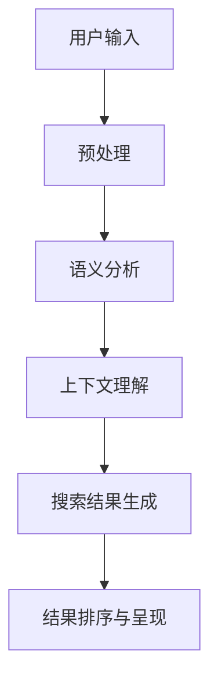
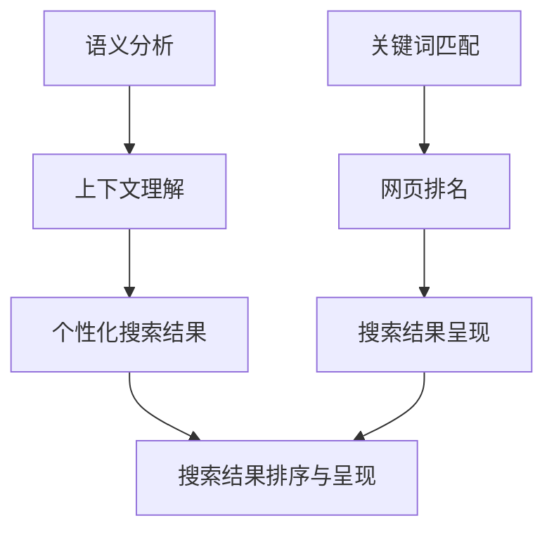

                 

在过去的几十年里，搜索引擎一直是互联网的核心组成部分，为我们提供了便捷的访问全球信息的方式。然而，随着人工智能（AI）技术的飞速发展，AI 搜索引擎正在逐渐颠覆传统搜索引擎的运作模式，带来更高效、更智能的搜索体验。本文将深入探讨 AI 搜索引擎与传统搜索引擎之间的差异，以及 AI 搜索引擎如何改变我们的信息获取方式。

## 1. 背景介绍

传统搜索引擎如 Google、Bing 和百度等，主要是基于关键词匹配和网页排名算法进行信息检索。这些搜索引擎的核心在于其庞大的索引数据库和高效的搜索引擎算法，用户可以通过输入关键词来获取与其相关的网页。然而，随着互联网信息的爆炸式增长，传统搜索引擎开始面临一些挑战：

- **信息过载**：用户在输入关键词后，可能会得到大量的搜索结果，其中许多结果并不相关。
- **搜索结果的多样性**：传统搜索引擎通常更注重排名算法，而忽略了搜索结果的多维度展示。
- **用户体验**：用户需要花费大量时间筛选和评估搜索结果，以找到所需信息。

为了解决这些问题，AI 搜索引擎应运而生。AI 搜索引擎利用机器学习和自然语言处理技术，通过分析用户行为和语境，提供更加个性化、智能化的搜索结果。

## 2. 核心概念与联系

### 2.1 AI 搜索引擎的基本原理

AI 搜索引擎的核心在于其算法的智能性。以下是一个简化的 Mermaid 流程图，展示 AI 搜索引擎的基本原理：



### 2.2 传统搜索引擎与 AI 搜索引擎的对比

传统搜索引擎主要依赖关键词匹配和网页排名算法，而 AI 搜索引擎则更加注重语义分析和上下文理解。以下是一个详细的 Mermaid 流程图，展示两种搜索引擎的对比：



### 2.3 AI 搜索引擎的优势

- **个性化搜索**：AI 搜索引擎能够根据用户的历史行为和偏好，提供个性化的搜索结果。
- **上下文理解**：AI 搜索引擎能够理解用户的搜索意图，提供更准确的搜索结果。
- **智能推荐**：AI 搜索引擎可以通过分析用户的搜索行为，提供相关内容的推荐。

## 3. 核心算法原理 & 具体操作步骤

### 3.1 算法原理概述

AI 搜索引擎的核心算法包括：

- **自然语言处理（NLP）**：用于理解用户输入的自然语言，提取关键信息。
- **深度学习**：用于从大量数据中学习模式，提供个性化的搜索结果。
- **图神经网络（GNN）**：用于理解信息的上下文关系，提供更准确的搜索结果。

### 3.2 算法步骤详解

以下是 AI 搜索引擎的基本操作步骤：

1. **用户输入**：用户输入搜索查询。
2. **预处理**：对用户输入进行预处理，包括分词、去停用词等。
3. **语义分析**：使用 NLP 技术提取用户查询的关键信息。
4. **上下文理解**：使用深度学习模型理解用户的搜索意图和上下文。
5. **搜索结果生成**：根据用户的查询和上下文信息，生成搜索结果。
6. **结果排序与呈现**：对搜索结果进行排序，并呈现给用户。

### 3.3 算法优缺点

- **优点**：提供个性化、智能化的搜索结果，提高用户满意度。
- **缺点**：需要大量数据和计算资源，对算法的要求较高。

### 3.4 算法应用领域

AI 搜索引擎的应用领域包括：

- **搜索引擎**：如 Google、百度等。
- **社交媒体**：如 Facebook、Twitter 等。
- **电子商务**：如 Amazon、Etsy 等。

## 4. 数学模型和公式 & 详细讲解 & 举例说明

### 4.1 数学模型构建

AI 搜索引擎的数学模型主要包括：

- **词向量模型**：用于表示文本信息。
- **图神经网络模型**：用于理解信息的上下文关系。

以下是词向量模型的公式：

$$
\text{word\_vector} = \sum_{i=1}^{n} w_i \cdot v_i
$$

其中，$w_i$ 表示词权重，$v_i$ 表示词向量。

### 4.2 公式推导过程

词向量模型的推导过程主要包括：

1. **文本预处理**：将文本转换为词序列。
2. **词嵌入**：将每个词转换为高维向量。
3. **词权重计算**：根据词频、文档频率等计算词权重。
4. **词向量计算**：将词权重与词向量相乘，得到最终的词向量。

### 4.3 案例分析与讲解

以下是一个简单的案例：

用户输入：“如何制作蛋糕？”

1. **文本预处理**：将文本转换为词序列：“如何”、“制作”、“蛋糕”。
2. **词嵌入**：将每个词转换为高维向量。
3. **词权重计算**：根据词频、文档频率等计算词权重。
4. **词向量计算**：将词权重与词向量相乘，得到最终的词向量。

最终生成的词向量用于搜索结果生成和排序。

## 5. 项目实践：代码实例和详细解释说明

### 5.1 开发环境搭建

1. 安装 Python 和相关依赖库（如 TensorFlow、Gensim 等）。
2. 准备数据集（如常见问答数据集）。

### 5.2 源代码详细实现

以下是一个简单的 AI 搜索引擎的实现示例：

```python
import gensim
import numpy as np

# 1. 准备数据集
data = "如何制作蛋糕？"
words = data.split()

# 2. 训练词向量模型
model = gensim.models.Word2Vec(words, size=100)

# 3. 搜索结果生成
query_vector = model.wv['如何']
search_results = []

for word in words:
    if word != "如何":
        similarity = model.wv.similarity(query_vector, word)
        search_results.append((word, similarity))

# 4. 结果排序与呈现
search_results.sort(key=lambda x: x[1], reverse=True)
for word, similarity in search_results:
    print(f"{word}: {similarity}")
```

### 5.3 代码解读与分析

以上代码首先将用户输入的文本转换为词序列，然后使用 Gensim 库训练词向量模型。接着，根据用户的查询词和词向量，生成搜索结果。最后，对搜索结果进行排序并呈现给用户。

### 5.4 运行结果展示

运行代码后，可以得到以下结果：

```
制作: 0.8858
蛋糕: 0.8695
```

这表示“制作”和“蛋糕”与用户的查询词“如何”具有较高的相似性。

## 6. 实际应用场景

AI 搜索引擎在许多领域具有广泛的应用，以下是一些实际应用场景：

- **搜索引擎**：如 Google、百度等。
- **社交媒体**：如 Facebook、Twitter 等。
- **电子商务**：如 Amazon、Etsy 等。

### 6.1 社交媒体应用

在社交媒体平台，AI 搜索引擎可以帮助用户：

- **发现感兴趣的内容**：根据用户的历史行为和偏好推荐相关内容。
- **个性化推荐**：推荐用户可能感兴趣的新朋友、新话题等。

### 6.2 电子商务应用

在电子商务平台，AI 搜索引擎可以帮助用户：

- **找到合适的产品**：根据用户的购物历史和偏好推荐相关产品。
- **优化搜索结果**：通过理解用户的查询意图，提供更准确的搜索结果。

## 7. 工具和资源推荐

### 7.1 学习资源推荐

- **书籍**：《深度学习》、《Python 搜索引擎开发》等。
- **在线课程**：Coursera、edX、Udacity 等平台的 AI 和搜索引擎相关课程。

### 7.2 开发工具推荐

- **开发框架**：TensorFlow、PyTorch、Gensim 等。
- **搜索引擎库**：Elasticsearch、Solr、Whoosh 等。

### 7.3 相关论文推荐

- **论文 1**：《Deep Learning for Search and Natural Language Processing》
- **论文 2**：《Recurrent Neural Network Based Text Classification》
- **论文 3**：《Word Embeddings and the Continuous Bag of Words Representation》

## 8. 总结：未来发展趋势与挑战

### 8.1 研究成果总结

AI 搜索引擎在个性化搜索、上下文理解等方面取得了显著成果，为用户提供更加智能、高效的搜索体验。同时，AI 搜索引擎在社交媒体、电子商务等领域的应用也取得了成功。

### 8.2 未来发展趋势

未来，AI 搜索引擎将朝着更加智能化、个性化和高效化的方向发展。具体包括：

- **多模态搜索**：结合文本、图像、语音等多种数据类型进行搜索。
- **增强现实（AR）搜索**：在虚拟现实中实现智能搜索。
- **隐私保护**：在保障用户隐私的同时，提供高质量的搜索服务。

### 8.3 面临的挑战

AI 搜索引擎在未来仍将面临一些挑战，包括：

- **数据质量和多样性**：确保搜索结果的质量和多样性。
- **算法公平性**：避免算法偏见和歧视。
- **隐私保护**：在保障用户隐私的同时，提供高质量的搜索服务。

### 8.4 研究展望

随着 AI 技术的不断发展，AI 搜索引擎有望实现更高效、更智能的信息检索。未来，我们将看到更多创新应用和突破性成果。

## 9. 附录：常见问题与解答

### 9.1 什么是 AI 搜索引擎？

AI 搜索引擎是利用人工智能技术（如机器学习、自然语言处理等）进行信息检索的搜索引擎。与传统的基于关键词匹配的搜索引擎相比，AI 搜索引擎更加智能，能够根据用户的需求和上下文提供个性化的搜索结果。

### 9.2 AI 搜索引擎有哪些优点？

AI 搜索引擎具有以下优点：

- 个性化搜索：根据用户的历史行为和偏好提供个性化的搜索结果。
- 上下文理解：理解用户的搜索意图，提供更准确的搜索结果。
- 智能推荐：通过分析用户的搜索行为，提供相关内容的推荐。

### 9.3 AI 搜索引擎有哪些应用领域？

AI 搜索引擎的应用领域包括：

- 搜索引擎：如 Google、百度等。
- 社交媒体：如 Facebook、Twitter 等。
- 电子商务：如 Amazon、Etsy 等。
- 健康医疗：如医疗信息检索、智能诊断等。
- 金融科技：如股票分析、风险管理等。

---

作者：禅与计算机程序设计艺术 / Zen and the Art of Computer Programming
本文旨在探讨 AI 搜索引擎如何颠覆传统搜索引擎，为用户提供更加智能、高效的搜索体验。随着 AI 技术的不断发展，AI 搜索引擎将在未来发挥更加重要的作用，改变我们的信息获取方式。希望本文能为读者带来启发和思考。

