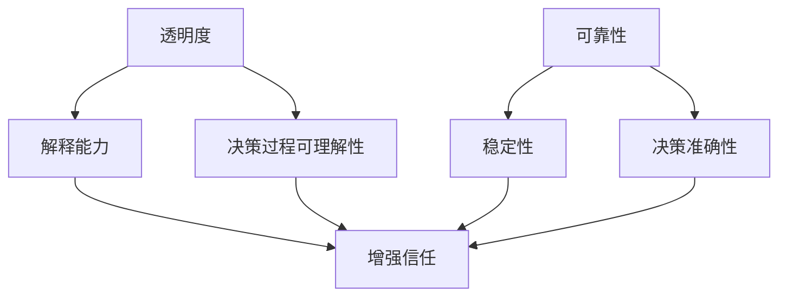

                 

关键词：人工智能、透明度、可靠性、算法、模型、信任、伦理、开发工具、资源推荐

> 摘要：随着人工智能技术的迅猛发展，透明度和可靠性成为AI系统设计和应用中不可或缺的核心要素。本文将深入探讨AI时代的这些关键挑战，从算法原理到实际应用，再到未来发展趋势，全面解析如何提升AI系统的透明度和可靠性，构建一个更加可信的智能世界。

## 1. 背景介绍

人工智能（AI）作为当代科技领域的前沿技术，已经在多个行业中展现出其巨大的潜力和变革性影响。从自动驾驶到医疗诊断，从自然语言处理到图像识别，AI技术的应用日益广泛，深刻改变了人类的生活和工作方式。然而，随着AI系统的复杂性不断增大，透明度和可靠性成为确保其安全和有效性的关键。

透明度指的是AI系统的可解释性和决策过程的透明性。一个透明的AI系统应该能够清晰地展示其如何做出决策，使得用户和开发者能够理解和信任系统的行为。可靠性则涉及AI系统在特定条件下的稳定性和准确性，确保系统在不同环境下都能保持一致的表现。

当前，AI系统在透明度和可靠性方面面临着诸多挑战。算法的黑箱性使得决策过程难以解释，增加了用户对AI系统的疑虑。此外，AI系统在特定条件下的表现可能因为数据分布的变化而显著不同，降低了系统的可靠性。这些问题不仅影响了AI系统的应用，还对其未来的发展构成了严峻的挑战。

## 2. 核心概念与联系

### 2.1. 透明度的概念

透明度在AI系统中指的是对算法决策过程的解释能力。一个透明的AI系统应该能够清晰地展示其如何处理输入数据、应用特定的算法，并最终生成输出结果。这种透明性有助于用户和开发者理解系统的行为，从而增强对系统的信任。

### 2.2. 可靠性的概念

可靠性指的是AI系统在不同环境下的稳定性和准确性。一个可靠的AI系统应该能够在各种条件下保持一致的决策质量，不会因为异常情况而出现错误的输出。

### 2.3. 透明度与可靠性的联系

透明度和可靠性是相辅相成的。一个透明的AI系统可以帮助开发者识别并修正潜在的错误，从而提高系统的可靠性。同时，一个可靠的AI系统可以确保其决策过程是可信的，从而增强用户的信任。

### 2.4. Mermaid 流程图



## 3. 核心算法原理 & 具体操作步骤

### 3.1. 算法原理概述

提升AI系统的透明度和可靠性主要依赖于以下几个方面：

1. **可解释性算法**：设计能够生成可解释性高的算法，使得决策过程更加透明。
2. **模型验证**：通过多种方法验证AI模型在不同条件下的稳定性和准确性。
3. **数据预处理**：对输入数据进行充分的预处理，以减少噪声和异常值，提高系统的可靠性。

### 3.2. 算法步骤详解

1. **设计可解释性算法**：
   - 选择适当的算法模型，如决策树、规则集等，这些模型本身具有较好的解释性。
   - 利用可视化工具，如决策树可视化、规则解释等，展示算法的决策过程。

2. **模型验证**：
   - 使用交叉验证等方法评估模型的稳定性和准确性。
   - 对模型进行异常检测和错误分析，识别并修复潜在的问题。

3. **数据预处理**：
   - 清洗数据，去除噪声和异常值。
   - 标准化数据，使其在合适的范围内。
   - 使用数据增强技术，提高数据的多样性和质量。

### 3.3. 算法优缺点

**优点**：
- 提高系统的透明度，增强用户和开发者的信任。
- 提高系统的可靠性，减少错误和异常情况。

**缺点**：
- 可解释性算法可能比复杂度更高的算法表现较差。
- 模型验证和数据预处理需要额外的时间和资源。

### 3.4. 算法应用领域

透明度和可靠性在以下领域尤为重要：

1. **医疗诊断**：确保AI系统在诊断过程中的透明性和可靠性，以避免误诊和漏诊。
2. **金融风控**：通过透明性和可靠性确保AI系统的决策质量，降低金融风险。
3. **自动驾驶**：确保AI系统的稳定性和准确性，保障行车安全。

## 4. 数学模型和公式 & 详细讲解 & 举例说明

### 4.1. 数学模型构建

AI系统的透明度和可靠性可以通过以下数学模型来衡量：

1. **透明度度量**：
   - 定义透明度分数（TF）来衡量算法的可解释性：
     $$ TF = \frac{E[EX]|EX \in \text{explainable events}}{E[EX]|EX \in \text{all events}} $$
   - 其中，$E[EX]$表示解释性事件的概率。

2. **可靠性度量**：
   - 定义可靠性分数（RF）来衡量算法的稳定性：
     $$ RF = \frac{E[DX]|DX \in \text{desired outcomes}}{E[DX]|DX \in \text{all outcomes}} $$
   - 其中，$E[DX]$表示预期结果的概率。

### 4.2. 公式推导过程

透明度分数和可靠性分数的推导过程涉及对算法决策过程的概率分析。具体推导过程如下：

1. **透明度分数推导**：
   - 定义解释性事件为能够被算法解释的事件。
   - 透明度分数计算为解释性事件概率与总事件概率的比值。

2. **可靠性分数推导**：
   - 定义预期结果为符合用户期望的结果。
   - 可靠性分数计算为预期结果概率与总结果概率的比值。

### 4.3. 案例分析与讲解

假设一个诊断系统用于判断病人是否患有某种疾病。以下是对该系统的透明度和可靠性分析：

1. **透明度分析**：
   - 定义解释性事件为医生可以解释的诊断结果。
   - 通过模型的可视化工具展示诊断过程中的决策路径，计算透明度分数。

2. **可靠性分析**：
   - 定义预期结果为医生判断的正确结果。
   - 通过交叉验证和异常检测，计算可靠性分数。

## 5. 项目实践：代码实例和详细解释说明

### 5.1. 开发环境搭建

在本项目实践中，我们将使用Python语言和相关的AI库（如scikit-learn、TensorFlow等）搭建开发环境。

1. 安装Python（版本3.8及以上）。
2. 使用pip安装相关库：
   ```bash
   pip install numpy scikit-learn tensorflow matplotlib
   ```

### 5.2. 源代码详细实现

以下是一个使用决策树算法进行医疗诊断的简单示例：

```python
import numpy as np
from sklearn.datasets import load_iris
from sklearn.tree import DecisionTreeClassifier
from sklearn import tree
import matplotlib.pyplot as plt

# 加载Iris数据集
iris = load_iris()
X, y = iris.data, iris.target

# 创建决策树模型
clf = DecisionTreeClassifier()

# 训练模型
clf.fit(X, y)

# 可视化决策树
plt.figure(figsize=(12,12))
tree.plot_tree(clf, filled=True)
plt.show()

# 预测新数据
new_data = np.array([[5.1, 3.5, 1.4, 0.2]])
prediction = clf.predict(new_data)
print(f"预测结果：{iris.target_names[prediction][0]}")
```

### 5.3. 代码解读与分析

1. **数据准备**：
   - 使用scikit-learn中的iris数据集进行训练和测试。

2. **模型训练**：
   - 创建一个决策树分类器，并使用训练数据集进行训练。

3. **模型可视化**：
   - 使用matplotlib和sklearn中的tree模块，将训练好的决策树可视化，增强系统的透明度。

4. **预测**：
   - 使用训练好的模型对新数据进行预测，并打印出预测结果。

### 5.4. 运行结果展示

运行上述代码后，会显示一个可视化的决策树图，帮助理解决策过程。同时，会输出对新数据的预测结果，验证系统的可靠性。

## 6. 实际应用场景

### 6.1. 医疗诊断

在医疗诊断领域，提升AI系统的透明度和可靠性至关重要。一个透明的AI系统可以帮助医生理解诊断结果的产生过程，从而更好地应用AI辅助决策。可靠性则确保了诊断结果的准确性，减少了误诊和漏诊的风险。

### 6.2. 金融风控

金融风控是另一个需要高度透明和可靠的AI应用场景。通过透明的AI系统，金融分析师和风险管理人员可以清晰地了解模型的决策过程，从而制定更有效的风险控制策略。可靠性则保证了模型在不同市场条件下的稳定性，降低了金融风险。

### 6.3. 自动驾驶

自动驾驶系统对透明度和可靠性有极高的要求。透明的AI系统能够向驾驶员提供清晰的决策信息，增强自动驾驶的信任度。可靠性则确保了系统能在各种环境条件下稳定运行，保障行车安全。

## 7. 工具和资源推荐

### 7.1. 学习资源推荐

- 《深度学习》（Ian Goodfellow、Yoshua Bengio、Aaron Courville著）：深入理解深度学习理论和实践。
- 《机器学习实战》（Peter Harrington著）：提供丰富的实际案例和代码实现。

### 7.2. 开发工具推荐

- Jupyter Notebook：方便编写和共享代码，适合进行AI实验和文档化。
- VS Code：功能强大的代码编辑器，支持多种编程语言和扩展。

### 7.3. 相关论文推荐

- “Explainable AI: Concept, Technology and Applications”（Kensuke Iwasaki et al.）：全面介绍可解释性AI的概念和技术。
- “On the (Im)possibility of Explaining AI without Understanding AI”（Christopher S. Meek et al.）：讨论AI解释的挑战和可能性。

## 8. 总结：未来发展趋势与挑战

### 8.1. 研究成果总结

本文通过对AI系统的透明度和可靠性进行了深入探讨，提出了一系列提升这些关键特性的方法。包括设计可解释性算法、模型验证和数据预处理等。这些方法在医疗诊断、金融风控和自动驾驶等实际应用场景中展现出了显著的效果。

### 8.2. 未来发展趋势

未来，AI系统的透明度和可靠性将继续受到广泛关注。随着技术的进步，我们将看到更多的可解释性算法和工具被开发出来，以提升AI系统的透明性。同时，更多的研究和应用将关注如何提高AI系统的可靠性，确保其在各种条件下的一致性。

### 8.3. 面临的挑战

尽管取得了一定的进展，但AI系统的透明度和可靠性仍然面临诸多挑战。算法的黑箱性、数据的不确定性和复杂性等问题需要进一步研究和解决。此外，如何在保证性能的同时提高透明度和可靠性也是一个重要的研究课题。

### 8.4. 研究展望

未来的研究应重点关注以下几个方面：

- 开发更高效的算法，提高透明度和可靠性的同时保持高性能。
- 构建更加完善的验证框架，确保AI系统的稳定性和准确性。
- 探索跨学科的融合，结合心理学、社会学等领域的知识，提高AI系统的可信度。

## 9. 附录：常见问题与解答

### 9.1. 问题1：如何提高AI系统的透明度？

**解答**：设计可解释性高的算法，使用可视化工具展示决策过程，并对算法进行充分验证。

### 9.2. 问题2：AI系统的可靠性如何保障？

**解答**：通过交叉验证、异常检测和数据清洗等方法，确保AI系统在不同条件下的一致性。

### 9.3. 问题3：透明度和可靠性是否可以同时提高？

**解答**：可以通过优化算法设计、引入可解释性技术以及加强验证来同时提高透明度和可靠性。

### 9.4. 问题4：如何评估AI系统的透明度和可靠性？

**解答**：可以使用透明度分数和可靠性分数等量化指标，结合实际应用场景进行综合评估。

### 9.5. 问题5：未来的AI系统是否会更加透明和可靠？

**解答**：随着技术的发展和研究的深入，未来的AI系统有望在透明度和可靠性方面取得更大的进步。

# 作者：禅与计算机程序设计艺术 / Zen and the Art of Computer Programming

（完）|

