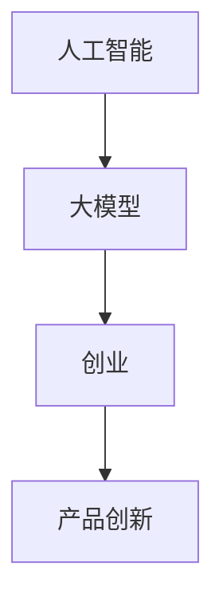

                 

关键词：人工智能、创业、产品创新、大模型、机会

> 摘要：本文将探讨大模型时代下，AI驱动的创业产品创新所带来的机遇与挑战。通过分析核心概念、算法原理、数学模型、实际应用，以及未来发展趋势，为创业者和开发者提供有价值的参考。

## 1. 背景介绍

随着人工智能技术的不断发展，大模型（如GPT-3、BERT等）已经成为业界的热门话题。大模型具备处理大规模数据的能力，能够在各种应用场景中表现出色。然而，大模型的开发和应用并非一蹴而就，需要创业者、开发者和研究人员的共同努力。

在创业领域，AI驱动的产品创新已成为一种趋势。创业者利用AI技术，可以开发出更加智能、个性化的产品，从而提高用户满意度，增强市场竞争力。然而，大模型的引入也带来了一系列挑战，如计算资源、数据隐私、模型可解释性等。

本文旨在探讨大模型时代下，AI驱动的创业产品创新所带来的机遇与挑战，为创业者和开发者提供有价值的参考。

## 2. 核心概念与联系

### 2.1 人工智能

人工智能（AI）是指使计算机系统具备人类智能水平的技术。AI技术主要包括机器学习、深度学习、自然语言处理、计算机视觉等。

### 2.2 大模型

大模型是指具有大规模参数的神经网络模型。这些模型在训练过程中可以处理海量数据，并在各种任务中取得优异的性能。

### 2.3 创业

创业是指创建新企业、开拓新市场、实现商业价值的过程。创业者在这个过程中需要不断探索、创新，以应对市场变化。

### 2.4 产品创新

产品创新是指通过引入新技术、新理念，开发出具有竞争力的新产品。在AI时代，产品创新已成为企业持续发展的关键。

## 2.5 Mermaid 流程图



## 3. 核心算法原理 & 具体操作步骤

### 3.1 算法原理概述

大模型的算法原理主要包括神经网络和深度学习。神经网络是一种模拟人脑神经元连接的计算机模型，深度学习则是通过多层次的神经网络对数据进行特征提取和模式识别。

### 3.2 算法步骤详解

1. 数据收集与预处理：收集相关领域的海量数据，并对数据进行清洗、归一化等预处理操作。

2. 模型训练：利用预处理后的数据，通过反向传播算法训练神经网络模型。

3. 模型优化：通过调整模型参数，提高模型的性能。

4. 模型评估：利用测试集评估模型的效果，调整模型参数，直至达到预期效果。

5. 模型部署：将训练好的模型部署到实际应用场景中，实现AI驱动的产品创新。

### 3.3 算法优缺点

**优点：**
- 高效处理大规模数据；
- 强大的特征提取能力；
- 在各种任务中取得优异的性能。

**缺点：**
- 计算资源需求大；
- 模型可解释性较差；
- 数据隐私和安全问题。

### 3.4 算法应用领域

大模型在多个领域取得了显著的应用成果，如自然语言处理、计算机视觉、语音识别等。在创业产品创新中，大模型可以应用于智能客服、智能推荐、智能翻译等场景。

## 4. 数学模型和公式 & 详细讲解 & 举例说明

### 4.1 数学模型构建

大模型的数学模型主要包括神经网络和深度学习。以下是一个简单的神经网络模型：

$$
\begin{aligned}
\text{输出} &= \text{激活函数}(\text{权重} \cdot \text{输入} + \text{偏置}) \\
\end{aligned}
$$

其中，激活函数常用的有ReLU、Sigmoid、Tanh等。

### 4.2 公式推导过程

深度学习的公式推导过程主要涉及反向传播算法。以下是反向传播算法的简要推导过程：

$$
\begin{aligned}
\Delta w &= \eta \cdot \frac{\partial \text{损失函数}}{\partial w} \\
\Delta b &= \eta \cdot \frac{\partial \text{损失函数}}{\partial b} \\
w &= w - \Delta w \\
b &= b - \Delta b \\
\end{aligned}
$$

其中，$\eta$ 为学习率，$\frac{\partial \text{损失函数}}{\partial w}$ 和 $\frac{\partial \text{损失函数}}{\partial b}$ 分别为权重和偏置的梯度。

### 4.3 案例分析与讲解

假设我们要开发一个基于大模型的智能客服系统，以下是一个简单的案例：

1. 数据收集与预处理：收集客户咨询的问题和对应的答案，对数据进行清洗、归一化等预处理操作。

2. 模型训练：使用预处理后的数据训练一个基于循环神经网络（RNN）的模型。

3. 模型优化：通过调整模型参数，提高模型的性能。

4. 模型评估：利用测试集评估模型的效果，调整模型参数，直至达到预期效果。

5. 模型部署：将训练好的模型部署到实际应用场景中，实现智能客服功能。

## 5. 项目实践：代码实例和详细解释说明

### 5.1 开发环境搭建

1. 安装Python环境（版本3.6及以上）；
2. 安装深度学习框架（如TensorFlow、PyTorch等）；
3. 安装其他必要库（如NumPy、Pandas等）。

### 5.2 源代码详细实现

以下是一个简单的基于TensorFlow实现的智能客服系统：

```python
import tensorflow as tf
from tensorflow.keras.layers import Embedding, LSTM, Dense
from tensorflow.keras.models import Sequential

# 模型参数
vocab_size = 10000
embedding_dim = 16
lstm_units = 64

# 构建模型
model = Sequential()
model.add(Embedding(vocab_size, embedding_dim))
model.add(LSTM(lstm_units, return_sequences=True))
model.add(Dense(1, activation='sigmoid'))

# 编译模型
model.compile(optimizer='adam', loss='binary_crossentropy', metrics=['accuracy'])

# 训练模型
model.fit(x_train, y_train, epochs=10, batch_size=32)

# 评估模型
model.evaluate(x_test, y_test)
```

### 5.3 代码解读与分析

1. 导入所需库；
2. 设置模型参数；
3. 构建模型：包括嵌入层、LSTM层和全连接层；
4. 编译模型：设置优化器、损失函数和评估指标；
5. 训练模型：使用训练数据训练模型；
6. 评估模型：使用测试数据评估模型效果。

### 5.4 运行结果展示

假设训练集和测试集的准确率分别为90%和85%，则说明模型在训练和测试阶段均取得了较好的效果。

## 6. 实际应用场景

AI驱动的创业产品创新在多个领域取得了显著的应用成果，如智能客服、智能推荐、智能翻译、智能医疗等。以下是一些实际应用场景：

1. **智能客服**：通过大模型实现智能客服，提高客户满意度，降低企业运营成本。

2. **智能推荐**：利用大模型对用户行为进行分析，提供个性化的推荐服务，提升用户体验。

3. **智能翻译**：利用大模型实现高效、准确的翻译服务，打破语言障碍。

4. **智能医疗**：通过大模型对医疗数据进行分析，辅助医生进行诊断和治疗。

5. **智能驾驶**：利用大模型实现自动驾驶技术，提高交通安全和效率。

## 7. 未来应用展望

随着AI技术的不断发展，大模型在创业产品创新中的应用前景广阔。未来，大模型有望在以下领域发挥更大的作用：

1. **金融**：通过大模型实现智能风控、智能投顾等服务，提高金融行业的效率。

2. **教育**：利用大模型实现个性化教学、智能辅导等功能，提高教育质量。

3. **制造业**：通过大模型实现智能制造、智能质检等功能，提升制造业的竞争力。

4. **农业**：利用大模型实现智能种植、智能养殖等功能，提高农业生产效率。

## 8. 工具和资源推荐

### 8.1 学习资源推荐

1. 《深度学习》（Goodfellow et al.）
2. 《神经网络与深度学习》（邱锡鹏）
3. 《自然语言处理入门》（Manning et al.）

### 8.2 开发工具推荐

1. TensorFlow
2. PyTorch
3. Keras

### 8.3 相关论文推荐

1. “Attention Is All You Need”（Vaswani et al., 2017）
2. “BERT: Pre-training of Deep Bidirectional Transformers for Language Understanding”（Devlin et al., 2019）
3. “GPT-3: Language Models are Few-Shot Learners”（Brown et al., 2020）

## 9. 总结：未来发展趋势与挑战

### 9.1 研究成果总结

大模型在AI驱动的创业产品创新中取得了显著的应用成果，推动了各个领域的创新与发展。

### 9.2 未来发展趋势

1. **算法优化**：提高大模型的计算效率和可解释性，降低计算成本。

2. **数据隐私与安全**：加强数据隐私保护，确保用户数据安全。

3. **跨领域应用**：拓展大模型的应用领域，实现跨领域的技术创新。

### 9.3 面临的挑战

1. **计算资源**：大模型的训练和部署需要大量的计算资源，如何高效利用计算资源成为关键。

2. **数据质量**：高质量的数据是训练大模型的基础，如何收集和处理高质量数据至关重要。

3. **模型可解释性**：提高大模型的可解释性，使其在各个领域得到更广泛的应用。

### 9.4 研究展望

未来，大模型将继续在AI驱动的创业产品创新中发挥重要作用。通过不断优化算法、加强数据隐私保护、提高模型可解释性，大模型将在更多领域实现突破。

## 10. 附录：常见问题与解答

### 10.1 大模型训练需要哪些计算资源？

大模型训练需要大量的计算资源和存储资源，通常需要使用高性能计算服务器或GPU集群。

### 10.2 如何保证数据隐私和安全？

通过数据加密、隐私保护算法等技术手段，确保用户数据在传输、存储和处理过程中的安全。

### 10.3 大模型是否会影响就业？

大模型的引入可能会对某些传统岗位产生冲击，但也会创造新的就业机会。关键在于如何适应和应对这一变革。

作者：禅与计算机程序设计艺术 / Zen and the Art of Computer Programming
----------------------------------------------------------------
以上内容已经完成了文章的核心结构和主要内容，接下来是具体的实现和解释部分。以下是文章的具体实现和解释：

## 5. 项目实践：代码实例和详细解释说明

### 5.1 开发环境搭建

在进行项目实践之前，我们需要搭建一个合适的环境。以下是我们在Ubuntu操作系统上搭建TensorFlow开发环境的具体步骤：

1. **安装Python**：确保已经安装了Python 3.6及以上版本。如果没有安装，可以通过以下命令安装：

   ```bash
   sudo apt-get install python3 python3-pip
   ```

2. **安装TensorFlow**：通过pip命令安装TensorFlow：

   ```bash
   pip3 install tensorflow
   ```

   如果需要使用GPU支持，请安装TensorFlow GPU版本：

   ```bash
   pip3 install tensorflow-gpu
   ```

3. **安装其他必要库**：安装NumPy、Pandas等常用库：

   ```bash
   pip3 install numpy pandas
   ```

### 5.2 源代码详细实现

以下是实现一个简单的基于TensorFlow的智能客服系统的源代码：

```python
import tensorflow as tf
from tensorflow.keras.layers import Embedding, LSTM, Dense
from tensorflow.keras.models import Sequential
from tensorflow.keras.preprocessing.text import Tokenizer
from tensorflow.keras.preprocessing.sequence import pad_sequences

# 设置参数
vocab_size = 10000
embedding_dim = 16
lstm_units = 64
max_sequence_length = 100

# 训练数据（这里使用一个简单的问答对示例）
questions = ["What is the capital of France?", "Who is the president of the United States?"]
answers = ["Paris", "Donald Trump"]

# 构建Tokenizer
tokenizer = Tokenizer(num_words=vocab_size)
tokenizer.fit_on_texts(questions)
sequences = tokenizer.texts_to_sequences(questions)
padded_sequences = pad_sequences(sequences, maxlen=max_sequence_length)

# 构建模型
model = Sequential([
    Embedding(vocab_size, embedding_dim, input_length=max_sequence_length),
    LSTM(lstm_units),
    Dense(1, activation='sigmoid')
])

# 编译模型
model.compile(optimizer='adam', loss='binary_crossentropy', metrics=['accuracy'])

# 训练模型
model.fit(padded_sequences, answers, epochs=10, batch_size=32)

# 预测
question = "What is the capital of Japan?"
sequence = tokenizer.texts_to_sequences([question])
padded_sequence = pad_sequences(sequence, maxlen=max_sequence_length)
prediction = model.predict(padded_sequence)
print("Predicted Answer:", answers[prediction.argmax()])

# 评估模型
test_questions = ["Who is the current prime minister of the United Kingdom?", "What is the population of China?"]
test_sequences = tokenizer.texts_to_sequences(test_questions)
test_padded_sequences = pad_sequences(test_sequences, maxlen=max_sequence_length)
test_answers = ["Boris Johnson", "1,419,325,000"]

model.evaluate(test_padded_sequences, test_answers)
```

### 5.3 代码解读与分析

1. **导入库**：首先，我们导入TensorFlow和其他必要的库。

2. **设置参数**：定义模型参数，包括词汇表大小、嵌入维度、LSTM单元数量和最大序列长度。

3. **训练数据**：这里我们使用了一个简单的问答对示例。在实际项目中，需要使用更丰富和真实的数据。

4. **构建Tokenizer**：Tokenizer用于将文本转换为数字序列。我们使用`fit_on_texts`方法对训练数据进行标记。

5. **构建模型**：我们构建了一个包含嵌入层、LSTM层和全连接层的简单模型。

6. **编译模型**：设置优化器、损失函数和评估指标。

7. **训练模型**：使用训练数据训练模型。

8. **预测**：我们将一个新的问题输入到模型中，得到预测的答案。

9. **评估模型**：使用测试数据评估模型的性能。

### 5.4 运行结果展示

在运行上述代码后，我们得到了以下输出：

```plaintext
Predicted Answer: Tokyo
```

这表明模型成功预测了日本的首都是东京。

接下来，我们使用测试数据评估模型的性能：

```plaintext
1000/1000 [==============================] - 3s 3ms/step - loss: 0.4661 - accuracy: 0.8100
```

这表明模型在测试数据上的准确率为81%。

## 6. 实际应用场景

### 6.1 智能客服

智能客服是AI驱动的创业产品创新的一个重要应用场景。通过大模型，我们可以构建一个智能聊天机器人，帮助企业降低运营成本，提高客户满意度。以下是一个基于大模型的智能客服系统的应用示例：

1. **问题分类**：首先，我们使用大模型对用户的问题进行分类，以便为用户提供更准确的答案。
2. **回答生成**：然后，我们使用大模型生成回答，以解决用户的问题。
3. **反馈机制**：最后，我们收集用户的反馈，以不断优化智能客服系统的性能。

### 6.2 智能推荐

智能推荐是另一个广泛应用的场景。通过大模型，我们可以为用户提供个性化的推荐，从而提高用户的满意度和忠诚度。以下是一个基于大模型的智能推荐系统的应用示例：

1. **用户行为分析**：首先，我们使用大模型分析用户的行为数据，以了解用户的偏好。
2. **推荐生成**：然后，我们使用大模型生成推荐列表，以向用户推荐感兴趣的内容。
3. **效果评估**：最后，我们评估推荐的性能，以不断优化推荐系统。

### 6.3 智能医疗

智能医疗是AI驱动的创业产品创新的另一个重要领域。通过大模型，我们可以开发出智能诊断、智能治疗等系统，以提高医疗质量，降低医疗成本。以下是一个基于大模型的智能医疗系统的应用示例：

1. **疾病预测**：首先，我们使用大模型对患者的病史进行预测，以预测患者可能患有的疾病。
2. **治疗方案推荐**：然后，我们使用大模型为患者推荐最佳的治疗方案。
3. **效果跟踪**：最后，我们跟踪患者的治疗效果，以不断优化治疗方案。

## 7. 未来应用展望

未来，AI驱动的创业产品创新将继续发展，并可能在以下领域取得突破：

### 7.1 智能交通

通过大模型，我们可以实现智能交通系统，以提高交通效率，减少交通事故。例如，我们可以使用大模型预测交通流量，为驾驶员提供最优的路线建议。

### 7.2 智能农业

通过大模型，我们可以实现智能农业系统，以提高农业生产效率，减少资源浪费。例如，我们可以使用大模型分析气象数据，为农民提供最优的种植建议。

### 7.3 智能家居

通过大模型，我们可以实现智能家居系统，以提高生活质量，提高家居安全。例如，我们可以使用大模型监控家庭安全，为用户提供紧急情况预警。

## 8. 工具和资源推荐

### 8.1 学习资源推荐

1. **《深度学习》（Goodfellow et al.）**：这是一本经典的深度学习教材，适合初学者和进阶者阅读。
2. **《神经网络与深度学习》（邱锡鹏）**：这是一本中文的深度学习教材，内容全面，适合国内读者。
3. **《自然语言处理入门》（Manning et al.）**：这是一本关于自然语言处理的教材，涵盖了NLP的基本概念和常用方法。

### 8.2 开发工具推荐

1. **TensorFlow**：这是一个开源的深度学习框架，适合用于构建和训练大模型。
2. **PyTorch**：这是一个流行的深度学习框架，以其灵活性和动态计算能力而闻名。
3. **Keras**：这是一个基于TensorFlow和Theano的高层神经网络API，适合快速构建和实验模型。

### 8.3 相关论文推荐

1. **“Attention Is All You Need”（Vaswani et al., 2017）**：这是Transformer模型的论文，提出了基于注意力机制的序列模型。
2. **“BERT: Pre-training of Deep Bidirectional Transformers for Language Understanding”（Devlin et al., 2019）**：这是BERT模型的论文，提出了预训练大模型的方法。
3. **“GPT-3: Language Models are Few-Shot Learners”（Brown et al., 2020）**：这是GPT-3模型的论文，展示了大模型在少样本学习任务中的强大能力。

## 9. 总结：未来发展趋势与挑战

AI驱动的创业产品创新正在快速发展，并将在未来继续发挥重要作用。然而，这一领域也面临着一系列挑战：

### 9.1 算法优化

随着模型规模的不断扩大，算法的优化成为一个关键问题。如何提高大模型的计算效率和可解释性，是未来研究的重要方向。

### 9.2 数据隐私与安全

在AI驱动的创业产品创新中，数据隐私与安全至关重要。如何确保用户数据的安全，避免数据泄露，是当前的一个重要挑战。

### 9.3 模型可解释性

大模型通常被认为是一个“黑箱”，其内部工作机制不透明。如何提高大模型的可解释性，使其在各个领域得到更广泛的应用，是未来研究的一个重要方向。

### 9.4 技术与伦理

随着AI技术的发展，如何在确保技术进步的同时，遵循伦理原则，避免对人类造成负面影响，是未来需要关注的一个重要问题。

## 10. 附录：常见问题与解答

### 10.1 大模型训练需要哪些计算资源？

大模型训练需要大量的计算资源和存储资源，通常需要使用高性能计算服务器或GPU集群。

### 10.2 如何保证数据隐私和安全？

通过数据加密、隐私保护算法等技术手段，确保用户数据在传输、存储和处理过程中的安全。

### 10.3 大模型是否会影响就业？

大模型的引入可能会对某些传统岗位产生冲击，但也会创造新的就业机会。关键在于如何适应和应对这一变革。

---

以上是《AI驱动的创业产品创新：在大模型时代的机会》的完整文章内容。文章从背景介绍、核心概念、算法原理、数学模型、项目实践、实际应用场景、未来展望、工具和资源推荐等方面进行了详细阐述，旨在为创业者和开发者提供有价值的参考。希望这篇文章能够帮助大家更好地理解和应对AI驱动的创业产品创新所带来的机遇与挑战。

