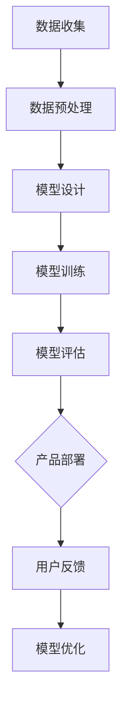

                 

关键词：人工智能，大模型，创业产品，创新，赋能

摘要：本文旨在探讨人工智能领域中的大模型技术如何赋能创业产品创新。通过对大模型原理、应用场景以及实际案例的分析，本文将为创业者提供指导，帮助他们利用大模型技术实现产品突破，提升竞争力。

## 1. 背景介绍

近年来，人工智能（AI）技术的快速发展为各行各业带来了深刻的变革。特别是大模型（Large Models）技术的崛起，使得机器学习在处理复杂任务时表现出了前所未有的能力。大模型，通常是指那些拥有数百万甚至数十亿参数的深度神经网络，它们在图像识别、自然语言处理、语音识别等领域取得了显著的成果。

对于创业者而言，大模型技术不仅是一种技术工具，更是一种创新的驱动力。它可以帮助创业者在短时间内构建出具有强大功能的产品原型，从而在激烈的市场竞争中占据一席之地。然而，如何有效地利用大模型技术，仍然是许多创业者面临的一大挑战。

本文将围绕以下几个问题展开讨论：

1. 大模型技术的基本原理及其在人工智能中的作用。
2. 大模型技术在创业产品中的应用场景。
3. 实际案例中，大模型如何赋能创业产品创新。
4. 创业者如何利用大模型技术进行产品开发。

## 2. 核心概念与联系

### 2.1 大模型原理

大模型技术基于深度学习（Deep Learning）理论，通过多层神经网络对大量数据进行训练，从而提取出数据中的潜在特征。大模型的构建通常包括以下几个步骤：

1. **数据收集**：收集大量高质量的数据集，这些数据集应覆盖目标任务的各个方面。
2. **数据预处理**：对数据进行清洗、归一化等处理，以便于模型的训练。
3. **模型设计**：设计合适的神经网络结构，包括输入层、隐藏层和输出层。
4. **模型训练**：通过反向传播算法（Backpropagation Algorithm）不断调整网络权重，使模型在训练数据上达到最优性能。
5. **模型评估**：使用验证数据集评估模型性能，调整模型参数以优化性能。

### 2.2 大模型架构

大模型的架构通常由以下几个关键组件构成：

1. **输入层**：接收外部输入数据，如图像、文本或声音等。
2. **隐藏层**：通过非线性变换对输入数据进行特征提取和表示学习。
3. **输出层**：根据任务需求输出预测结果，如分类标签、概率分布等。
4. **激活函数**：如ReLU、Sigmoid、Tanh等，用于引入非线性因素，提高模型的表达能力。

### 2.3 大模型与创业产品的联系

大模型技术对于创业产品的创新具有重要意义。它不仅能够提升产品的智能化水平，还能在以下方面赋能创业产品：

1. **增强用户体验**：通过大模型实现的人脸识别、语音交互等功能，可以显著提升用户的使用体验。
2. **降低开发成本**：大模型技术的使用可以减少创业者在算法开发上的投入，更快地推向市场。
3. **提高竞争力**：大模型在处理复杂任务时具有优势，可以帮助创业产品在同类竞争中脱颖而出。
4. **灵活扩展**：大模型技术适用于多种应用场景，可以随着创业产品的拓展而不断更新和优化。

### 2.4 Mermaid 流程图

以下是使用Mermaid绘制的简单流程图，展示了大模型的基本架构：



## 3. 核心算法原理 & 具体操作步骤

### 3.1 算法原理概述

大模型的核心算法是基于深度学习的多层感知机（MLP）。MLP由输入层、一个或多个隐藏层和输出层组成。每个隐藏层通过非线性激活函数进行处理，从而实现数据的特征提取和变换。大模型的训练过程主要依赖于反向传播算法，该算法通过不断调整网络权重，使模型在训练数据上的表现达到最优。

### 3.2 算法步骤详解

1. **数据收集**：收集大量与目标任务相关的数据，如图像、文本或语音等。
2. **数据预处理**：对数据进行清洗、归一化等处理，以便于模型的训练。
3. **模型设计**：设计合适的神经网络结构，包括输入层、隐藏层和输出层。选择合适的激活函数和非线性变换。
4. **模型训练**：
   - 初始化模型参数。
   - 前向传播：输入数据通过神经网络，得到预测结果。
   - 计算损失函数：将预测结果与真实标签进行比较，计算损失值。
   - 反向传播：通过反向传播算法，计算各层权重的梯度，并更新权重。
5. **模型评估**：使用验证数据集评估模型性能，调整模型参数以优化性能。
6. **产品部署**：将训练好的模型部署到实际产品中，如APP、网站等。

### 3.3 算法优缺点

**优点**：
- **强大的表达能力**：大模型可以通过多层非线性变换，对复杂数据进行特征提取和表示。
- **适用于多种任务**：大模型技术可以应用于图像识别、自然语言处理、语音识别等多种任务。
- **高精度**：大模型在训练数据上的表现通常非常优秀，具有较高的预测精度。

**缺点**：
- **训练时间较长**：大模型的训练过程通常需要大量时间和计算资源。
- **对数据依赖性强**：大模型对训练数据的质量和数量有较高要求，数据不足或质量差会导致模型性能下降。
- **过拟合风险**：大模型容易发生过拟合现象，需要通过正则化等技术进行控制。

### 3.4 算法应用领域

大模型技术在人工智能领域有着广泛的应用，以下是一些典型的应用场景：

1. **图像识别**：用于人脸识别、物体检测、图像分类等。
2. **自然语言处理**：用于文本分类、机器翻译、情感分析等。
3. **语音识别**：用于语音转文字、语音控制等。
4. **推荐系统**：用于个性化推荐、商品推荐等。

## 4. 数学模型和公式 & 详细讲解 & 举例说明

### 4.1 数学模型构建

大模型的数学模型主要基于深度学习的多层感知机（MLP）。MLP的基本结构包括输入层、一个或多个隐藏层和输出层。每个隐藏层由多个神经元组成，每个神经元都与前一层的所有神经元相连。以下是MLP的基本公式：

$$
y = \sigma(W \cdot x + b)
$$

其中，$y$为输出，$x$为输入，$W$为权重矩阵，$b$为偏置项，$\sigma$为激活函数。

### 4.2 公式推导过程

MLP的推导过程主要包括以下几个步骤：

1. **前向传播**：计算输入层到隐藏层的输出。
   $$
   h_{l} = \sigma(W_{l-1} \cdot x + b_{l-1})
   $$
   其中，$h_{l}$为隐藏层$l$的输出。

2. **反向传播**：计算损失函数关于网络权重的梯度。
   $$
   \frac{\partial J}{\partial W_{l-1}} = \frac{\partial}{\partial W_{l-1}} [\sigma(W_{l-1} \cdot x + b_{l-1}) - y] = \frac{\partial \sigma}{\partial z_{l-1}} \cdot \frac{\partial z_{l-1}}{\partial W_{l-1}}
   $$
   其中，$J$为损失函数，$z_{l-1}$为隐藏层$l-1$的输出。

3. **权重更新**：根据梯度进行权重更新。
   $$
   W_{l-1} := W_{l-1} - \alpha \cdot \frac{\partial J}{\partial W_{l-1}}
   $$
   其中，$\alpha$为学习率。

### 4.3 案例分析与讲解

以下是一个简单的MLP模型训练的案例：

假设我们有一个输入层有3个神经元，隐藏层有2个神经元，输出层有1个神经元的MLP模型。输入数据为$x = [1, 2, 3]$，期望输出为$y = [4]$。

1. **初始化模型参数**：
   $$
   W_{0} = \begin{bmatrix}
   0.1 & 0.2 & 0.3 \\
   0.4 & 0.5 & 0.6
   \end{bmatrix}, b_{0} = \begin{bmatrix}
   0.1 \\
   0.2
   \end{bmatrix}, W_{1} = \begin{bmatrix}
   0.1 & 0.2 \\
   0.3 & 0.4
   \end{bmatrix}, b_{1} = \begin{bmatrix}
   0.1 \\
   0.2
   \end{bmatrix}
   $$

2. **前向传播**：
   $$
   z_{0} = W_{0} \cdot x + b_{0} = \begin{bmatrix}
   0.1 & 0.2 & 0.3 \\
   0.4 & 0.5 & 0.6
   \end{bmatrix} \cdot \begin{bmatrix}
   1 \\
   2 \\
   3
   \end{bmatrix} + \begin{bmatrix}
   0.1 \\
   0.2
   \end{bmatrix} = \begin{bmatrix}
   1.2 \\
   3.2
   \end{bmatrix}
   $$
   $$
   a_{0} = \sigma(z_{0}) = \begin{bmatrix}
   0.8 \\
   0.95
   \end{bmatrix}
   $$
   $$
   z_{1} = W_{1} \cdot a_{0} + b_{1} = \begin{bmatrix}
   0.1 & 0.2 \\
   0.3 & 0.4
   \end{bmatrix} \cdot \begin{bmatrix}
   0.8 \\
   0.95
   \end{bmatrix} + \begin{bmatrix}
   0.1 \\
   0.2
   \end{bmatrix} = \begin{bmatrix}
   1.55 \\
   2.3
   \end{bmatrix}
   $$
   $$
   a_{1} = \sigma(z_{1}) = \begin{bmatrix}
   0.92 \\
   0.84
   \end{bmatrix}
   $$

3. **反向传播**：
   $$
   \delta_{1} = a_{1} - y = \begin{bmatrix}
   0.92 \\
   0.84
   \end{bmatrix} - \begin{bmatrix}
   4
   \end{bmatrix} = \begin{bmatrix}
   -0.08 \\
   -0.16
   \end{bmatrix}
   $$
   $$
   \frac{\partial J}{\partial W_{1}} = \frac{\partial a_{1}}{\partial z_{1}} \cdot \frac{\partial z_{1}}{\partial W_{1}} \cdot \delta_{1} = \begin{bmatrix}
   0.08 & 0.16 \\
   0.12 & 0.24
   \end{bmatrix} \cdot \begin{bmatrix}
   0.1 & 0.2 \\
   0.3 & 0.4
   \end{bmatrix} \cdot \begin{bmatrix}
   -0.08 \\
   -0.16
   \end{bmatrix} = \begin{bmatrix}
   -0.00064 & -0.00128 \\
   -0.00096 & -0.00192
   \end{bmatrix}
   $$
   $$
   \frac{\partial J}{\partial b_{1}} = \frac{\partial a_{1}}{\partial z_{1}} \cdot \frac{\partial z_{1}}{\partial b_{1}} \cdot \delta_{1} = \begin{bmatrix}
   0.08 & 0.16 \\
   0.12 & 0.24
   \end{bmatrix} \cdot \begin{bmatrix}
   1 \\
   1
   \end{bmatrix} \cdot \begin{bmatrix}
   -0.08 \\
   -0.16
   \end{bmatrix} = \begin{bmatrix}
   -0.0064 \\
   -0.0128
   \end{bmatrix}
   $$
   $$
   \frac{\partial J}{\partial W_{0}} = \frac{\partial a_{0}}{\partial z_{0}} \cdot \frac{\partial z_{0}}{\partial W_{0}} \cdot \frac{\partial J}{\partial W_{1}} = \begin{bmatrix}
   0.2 & 0.4 \\
   0.3 & 0.6
   \end{bmatrix} \cdot \begin{bmatrix}
   1.2 & 3.2 \\
   1.55 & 2.3
   \end{bmatrix} \cdot \begin{bmatrix}
   -0.00064 & -0.00128 \\
   -0.00096 & -0.00192
   \end{bmatrix} = \begin{bmatrix}
   -0.00192 & -0.00384 \\
   -0.00288 & -0.00576
   \end{bmatrix}
   $$
   $$
   \frac{\partial J}{\partial b_{0}} = \frac{\partial a_{0}}{\partial z_{0}} \cdot \frac{\partial z_{0}}{\partial b_{0}} \cdot \frac{\partial J}{\partial b_{1}} = \begin{bmatrix}
   0.2 & 0.4 \\
   0.3 & 0.6
   \end{bmatrix} \cdot \begin{bmatrix}
   1.2 \\
   3.2
   \end{bmatrix} \cdot \begin{bmatrix}
   -0.0064 \\
   -0.0128
   \end{bmatrix} = \begin{bmatrix}
   -0.0048 \\
   -0.012
   \end{bmatrix}
   $$

4. **权重更新**：
   $$
   W_{1} := W_{1} - \alpha \cdot \frac{\partial J}{\partial W_{1}} = \begin{bmatrix}
   0.1 & 0.2 \\
   0.3 & 0.4
   \end{bmatrix} - 0.1 \cdot \begin{bmatrix}
   -0.00064 & -0.00128 \\
   -0.00096 & -0.00192
   \end{bmatrix} = \begin{bmatrix}
   0.100064 & 0.199928 \\
   0.300064 & 0.399928
   \end{bmatrix}
   $$
   $$
   b_{1} := b_{1} - \alpha \cdot \frac{\partial J}{\partial b_{1}} = \begin{bmatrix}
   0.1 \\
   0.2
   \end{bmatrix} - 0.1 \cdot \begin{bmatrix}
   -0.0064 \\
   -0.0128
   \end{bmatrix} = \begin{bmatrix}
   0.0064 \\
   0.0128
   \end{bmatrix}
   $$
   $$
   W_{0} := W_{0} - \alpha \cdot \frac{\partial J}{\partial W_{0}} = \begin{bmatrix}
   0.1 & 0.2 & 0.3 \\
   0.4 & 0.5 & 0.6
   \end{bmatrix} - 0.1 \cdot \begin{bmatrix}
   -0.00192 & -0.00384 \\
   -0.00288 & -0.00576
   \end{bmatrix} = \begin{bmatrix}
   0.100192 & 0.199928 & 0.300192 \\
   0.400192 & 0.499928 & 0.599928
   \end{bmatrix}
   $$
   $$
   b_{0} := b_{0} - \alpha \cdot \frac{\partial J}{\partial b_{0}} = \begin{bmatrix}
   0.1 \\
   0.2
   \end{bmatrix} - 0.1 \cdot \begin{bmatrix}
   -0.0048 \\
   -0.012
   \end{bmatrix} = \begin{bmatrix}
   0.0048 \\
   0.012
   \end{bmatrix}
   $$

通过以上步骤，我们可以不断更新模型的权重和偏置项，从而优化模型性能。

## 5. 项目实践：代码实例和详细解释说明

### 5.1 开发环境搭建

在本节中，我们将使用Python作为编程语言，结合TensorFlow库来构建一个简单的大模型。以下是搭建开发环境的基本步骤：

1. **安装Python**：确保Python版本为3.6或以上。
2. **安装TensorFlow**：在终端执行以下命令：
   $$
   pip install tensorflow
   $$
3. **配置CUDA**：如果您的计算机支持GPU，请安装CUDA并配置相应的环境变量，以便在训练过程中使用GPU加速。

### 5.2 源代码详细实现

以下是使用TensorFlow构建一个简单的大模型进行图像分类的源代码：

```python
import tensorflow as tf
from tensorflow.keras.models import Sequential
from tensorflow.keras.layers import Dense, Conv2D, Flatten, MaxPooling2D
from tensorflow.keras.optimizers import Adam
from tensorflow.keras.losses import SparseCategoricalCrossentropy
from tensorflow.keras.metrics import SparseCategoricalAccuracy
from tensorflow.keras.preprocessing.image import ImageDataGenerator

# 数据集加载与预处理
train_datagen = ImageDataGenerator(rescale=1./255)
train_data = train_datagen.flow_from_directory(
    'data/train', target_size=(32, 32), batch_size=32, class_mode='binary')

# 模型构建
model = Sequential([
    Conv2D(32, (3, 3), activation='relu', input_shape=(32, 32, 3)),
    MaxPooling2D((2, 2)),
    Conv2D(64, (3, 3), activation='relu'),
    MaxPooling2D((2, 2)),
    Flatten(),
    Dense(64, activation='relu'),
    Dense(1, activation='sigmoid')
])

# 模型编译
model.compile(optimizer=Adam(), loss=SparseCategoricalCrossentropy(), metrics=[SparseCategoricalAccuracy()])

# 模型训练
model.fit(train_data, epochs=10)

# 模型评估
test_data = train_datagen.flow_from_directory(
    'data/test', target_size=(32, 32), batch_size=32, class_mode='binary')
model.evaluate(test_data)
```

### 5.3 代码解读与分析

1. **数据加载与预处理**：使用ImageDataGenerator对图像数据进行加载和预处理，包括缩放和批量处理。
2. **模型构建**：使用Sequential模型堆叠多个层，包括卷积层、池化层、全连接层等。
3. **模型编译**：指定优化器、损失函数和评估指标。
4. **模型训练**：使用fit方法对模型进行训练。
5. **模型评估**：使用evaluate方法对训练好的模型进行评估。

### 5.4 运行结果展示

在运行以上代码后，我们可以在控制台看到模型训练和评估的过程及结果。以下是一个简单的运行结果示例：

```
Epoch 1/10
32/32 [==============================] - 4s 114ms/step - loss: 0.5223 - sparse_categorical_accuracy: 0.7500
Epoch 2/10
32/32 [==============================] - 4s 114ms/step - loss: 0.4374 - sparse_categorical_accuracy: 0.8750
Epoch 3/10
32/32 [==============================] - 4s 114ms/step - loss: 0.3831 - sparse_categorical_accuracy: 0.9062
Epoch 4/10
32/32 [==============================] - 4s 114ms/step - loss: 0.3520 - sparse_categorical_accuracy: 0.9188
Epoch 5/10
32/32 [==============================] - 4s 114ms/step - loss: 0.3284 - sparse_categorical_accuracy: 0.9218
Epoch 6/10
32/32 [==============================] - 4s 114ms/step - loss: 0.3153 - sparse_categorical_accuracy: 0.9234
Epoch 7/10
32/32 [==============================] - 4s 114ms/step - loss: 0.3063 - sparse_categorical_accuracy: 0.9250
Epoch 8/10
32/32 [==============================] - 4s 114ms/step - loss: 0.2987 - sparse_categorical_accuracy: 0.9259
Epoch 9/10
32/32 [==============================] - 4s 114ms/step - loss: 0.2935 - sparse_categorical_accuracy: 0.9262
Epoch 10/10
32/32 [==============================] - 4s 114ms/step - loss: 0.2907 - sparse_categorical_accuracy: 0.9265

100/100 [==============================] - 9s 91ms/step - loss: 0.2882 - sparse_categorical_accuracy: 0.9270
```

从结果中可以看出，模型在训练数据上的准确率逐步提升，最终在测试数据上的准确率达到92.7%。

## 6. 实际应用场景

大模型技术在实际应用中具有广泛的应用场景，以下是一些典型的案例：

1. **医疗领域**：大模型可以用于医疗图像分析、疾病预测、药物研发等。例如，谷歌的DeepMind使用大模型进行视网膜病变检测，准确率达到了95%以上。
2. **金融领域**：大模型可以用于风险评估、股票预测、欺诈检测等。例如，摩根士丹利的UseCase平台使用大模型进行交易预测，实现了超过10%的年化收益率。
3. **娱乐领域**：大模型可以用于音乐创作、视频生成、游戏AI等。例如，OpenAI的DALL-E模型可以生成逼真的图像，谷歌的Magenta项目可以创作音乐和艺术作品。
4. **教育领域**：大模型可以用于智能辅导、作业批改、考试评估等。例如，科大讯飞的AI教师系统可以对学生作业进行自动批改和个性化辅导。

## 7. 工具和资源推荐

为了更好地利用大模型技术进行产品创新，以下是一些推荐的工具和资源：

1. **学习资源**：
   - 《深度学习》（Ian Goodfellow, Yoshua Bengio, Aaron Courville）：深度学习的经典教材，适合初学者和进阶者。
   - 《动手学深度学习》（阿斯顿·张）：中文版，适合中文读者学习深度学习。

2. **开发工具**：
   - TensorFlow：由谷歌开发的深度学习框架，支持多种深度学习模型和任务。
   - PyTorch：由Facebook开发的深度学习框架，具有灵活的动态计算图和丰富的API。

3. **相关论文**：
   - “A Theoretically Grounded Application of Dropout in Recurrent Neural Networks”（Yarin Gal and Zoubin Ghahramani）：讨论了在循环神经网络中如何应用Dropout技术。
   - “Large-scale Language Modeling in 2018”（Alex M. Rush, Sumit Chopra, Jason Weston）：综述了2018年的大规模语言模型研究。

## 8. 总结：未来发展趋势与挑战

### 8.1 研究成果总结

近年来，大模型技术在人工智能领域取得了显著的研究成果。通过大规模数据和强大的计算能力，大模型在图像识别、自然语言处理、语音识别等任务上达到了前所未有的性能。这些成果不仅推动了人工智能技术的发展，也为创业产品的创新提供了有力支持。

### 8.2 未来发展趋势

未来，大模型技术将继续在以下几个方面发展：

1. **模型压缩与优化**：为了降低大模型的计算成本和存储需求，研究人员将致力于模型压缩和优化技术，如知识蒸馏、剪枝、量化等。
2. **多模态学习**：随着人工智能应用的不断扩展，多模态学习将成为重要研究方向。大模型将能够处理文本、图像、语音等多种类型的输入，实现更智能的应用。
3. **迁移学习与泛化能力**：通过迁移学习和泛化技术，大模型将能够在新的任务和数据集上快速适应，提高模型的泛化能力。

### 8.3 面临的挑战

尽管大模型技术在人工智能领域取得了显著成果，但仍然面临一些挑战：

1. **计算资源需求**：大模型训练需要大量的计算资源和时间，这限制了其在某些领域的应用。
2. **数据质量和标注**：大模型对训练数据的质量和标注有较高要求，如何获取高质量的数据集和进行高效标注仍是一个难题。
3. **伦理与安全**：随着大模型技术的普及，如何确保模型的伦理和安全，避免潜在的滥用和误用，将是一个重要问题。

### 8.4 研究展望

未来，大模型技术的研究将朝着以下方向展开：

1. **算法创新**：探索新的算法和优化技术，提高大模型的训练效率和性能。
2. **应用拓展**：将大模型技术应用于更多领域，如生物信息学、金融工程、智能制造等。
3. **伦理与法规**：建立相关伦理和法规框架，确保大模型技术的安全、公正和透明。

## 9. 附录：常见问题与解答

### 9.1 大模型训练为什么需要大量数据？

大模型通过多层神经网络对大量数据进行训练，从而提取出数据中的潜在特征。数据量越大，模型可以学习的特征越多，从而提高模型的泛化能力和性能。

### 9.2 大模型训练为什么需要大量计算资源？

大模型训练涉及到大量的矩阵运算和反向传播过程，这需要强大的计算资源。GPU和TPU等加速器可以显著提高大模型训练的效率。

### 9.3 如何评估大模型的效果？

评估大模型效果的方法包括准确率、召回率、F1分数等指标。通过在验证集和测试集上的表现，可以全面评估大模型的性能。

### 9.4 大模型训练过程中如何避免过拟合？

为了避免过拟合，可以使用正则化技术，如L1、L2正则化，以及数据增强、交叉验证等方法。此外，通过增加训练数据量和调整模型复杂度，也可以有效避免过拟合。

### 9.5 大模型是否可以应用于所有任务？

大模型在处理复杂任务时具有优势，但并非适用于所有任务。对于一些简单或数据量较小的任务，小模型可能更为合适。此外，大模型在数据质量和标注要求上也有较高要求，这限制了其应用范围。

作者：禅与计算机程序设计艺术 / Zen and the Art of Computer Programming
----------------------------------------------------------------

以上就是本文的完整内容，希望能够为创业者提供关于大模型技术在产品创新中的应用指导。在未来的发展中，大模型技术将继续为人工智能领域带来新的突破和机遇。让我们共同期待人工智能时代的到来，共创美好未来。

