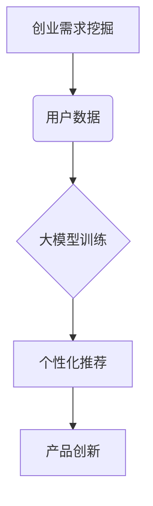

                 

关键词：AI创业设计、大模型、产品创新、转型、算法原理、数学模型、代码实例

> 摘要：随着人工智能技术的不断进步，大模型的应用已成为推动创业产品设计创新的关键力量。本文将探讨大模型在创业产品设计中的应用，分析其背后的算法原理和数学模型，并通过具体案例和代码实例展示其实现过程和实际效果。同时，本文还将展望大模型在创业产品设计领域的未来发展趋势和挑战。

## 1. 背景介绍

在当今数字化时代，人工智能（AI）技术的发展已经成为推动各行各业创新的重要动力。特别是在创业领域，人工智能的引入不仅提高了产品的竞争力，还加速了企业的创新进程。其中，大模型（Large Model）作为人工智能技术的重要分支，其应用范围日益广泛，成为创业产品设计创新的重要工具。

大模型，即具有巨大参数规模的人工神经网络模型，通过学习海量数据，能够实现高精度的预测、分类和生成任务。其代表性模型包括GPT、BERT、ViT等。大模型的引入不仅解决了传统算法的瓶颈问题，还为企业提供了全新的产品设计思路和方法。

创业产品设计创新的核心目标是满足用户需求、提升产品竞争力，并实现商业价值。在大模型的赋能下，创业产品设计可以从以下几个方面实现创新：

1. **需求挖掘与个性化推荐**：通过分析海量用户数据，大模型可以挖掘出用户潜在需求，提供个性化推荐服务。
2. **内容生成与创意设计**：大模型能够生成高质量的内容和创意，为创业产品提供丰富的素材和灵感。
3. **智能交互与用户体验**：大模型可以实现智能对话和交互，提升用户体验和满意度。
4. **自动化与效率提升**：大模型的应用可以实现自动化任务处理，提高生产效率和产品质量。

## 2. 核心概念与联系

为了更好地理解大模型在创业产品设计创新中的应用，我们需要先了解一些核心概念和原理。以下是本文涉及的核心概念及其联系：

### 2.1 人工智能与机器学习

人工智能（AI）是计算机科学的一个分支，旨在使计算机具备智能行为，如学习、推理、规划和感知。机器学习（ML）是AI的一种实现方法，通过从数据中学习规律，实现计算机的自动优化。

### 2.2 神经网络与深度学习

神经网络（NN）是模拟生物神经系统的计算模型，深度学习（DL）是神经网络的一种扩展，通过多层的非线性变换实现复杂的特征提取和建模。

### 2.3 大模型与小型模型

大模型（Large Model）指的是具有巨大参数规模的人工神经网络模型，通常拥有数十亿个参数。相对地，小型模型（Small Model）参数较少，通常只有数百万个。

### 2.4 自适应与强化学习

自适应（Adaptive Learning）是一种能够根据环境变化调整学习策略的方法。强化学习（RL）是一种通过奖励机制引导模型学习的方法，广泛应用于游戏、机器人控制等领域。

### 2.5 概率论与信息论

概率论（Probability Theory）是描述不确定事件概率分布的数学工具，信息论（Information Theory）是研究信息传递和处理过程的学科，对数据压缩、通信系统设计等具有重要意义。

### 2.6 Mermaid 流程图

Mermaid 是一种基于Markdown的图表绘制工具，可以方便地绘制流程图、序列图、时序图等。以下是本文涉及的一个Mermaid流程图示例：



## 3. 核心算法原理 & 具体操作步骤

### 3.1 算法原理概述

大模型的算法原理主要包括以下几个方面：

1. **参数初始化**：模型参数随机初始化，为后续训练提供初始值。
2. **前向传播**：输入数据通过神经网络的前向传播过程，逐层计算得到输出。
3. **损失函数**：衡量模型预测结果与真实结果之间的差距，用于指导模型参数更新。
4. **反向传播**：计算损失函数关于模型参数的梯度，并利用梯度下降等优化算法更新参数。
5. **迭代训练**：重复前向传播和反向传播过程，直到模型收敛。

### 3.2 算法步骤详解

以下是创业产品设计中的大模型应用步骤：

1. **数据收集**：收集用户行为数据、产品使用数据等，构建训练数据集。
2. **数据处理**：对数据集进行清洗、预处理和特征工程，提高数据质量。
3. **模型选择**：根据任务需求选择合适的大模型架构，如GPT、BERT等。
4. **模型训练**：使用训练数据集对模型进行训练，调整模型参数。
5. **模型评估**：使用验证数据集评估模型性能，调整模型结构或参数。
6. **模型部署**：将训练好的模型部署到产品中，实现实际应用。

### 3.3 算法优缺点

大模型的优缺点如下：

**优点**：

- **高精度**：通过学习海量数据，大模型能够实现高精度的预测和分类。
- **泛化能力**：大模型具有较强的泛化能力，能够应对各种复杂任务。
- **自适应能力**：大模型可以自适应地调整学习策略，适应不同环境和需求。

**缺点**：

- **计算资源消耗**：大模型需要大量计算资源进行训练和推理。
- **数据依赖性**：大模型的性能依赖于数据质量，数据缺失或噪声可能导致模型失效。
- **隐私风险**：大模型需要处理大量用户数据，可能涉及隐私泄露风险。

### 3.4 算法应用领域

大模型在创业产品设计中的主要应用领域包括：

- **需求挖掘与个性化推荐**：通过分析用户行为数据，提供个性化推荐服务，提高用户满意度。
- **内容生成与创意设计**：生成高质量的内容和创意，为产品创新提供素材和灵感。
- **智能交互与用户体验**：实现智能对话和交互，提升用户体验和满意度。
- **自动化与效率提升**：实现自动化任务处理，提高生产效率和产品质量。

## 4. 数学模型和公式 & 详细讲解 & 举例说明

### 4.1 数学模型构建

大模型的数学模型主要包括以下几个方面：

1. **输入层**：接收外部输入数据，如用户行为数据、产品使用数据等。
2. **隐藏层**：通过非线性变换，提取输入数据的特征信息。
3. **输出层**：根据隐藏层的信息生成预测结果或分类标签。

### 4.2 公式推导过程

以下是创业产品设计中的大模型公式推导过程：

$$
y = \sigma(\sum_{i=1}^{n} w_{i}x_{i} + b)
$$

其中，$y$ 表示输出结果，$x_{i}$ 表示输入特征，$w_{i}$ 表示权重参数，$b$ 表示偏置项，$\sigma$ 表示激活函数。

### 4.3 案例分析与讲解

以下是创业产品设计中的大模型案例分析与讲解：

**案例背景**：一家创业公司开发了一款基于人工智能的个性化推荐系统，旨在为用户推荐符合其兴趣的短视频内容。

**解决方案**：公司选择了GPT大模型作为推荐系统的基础，通过训练大量用户行为数据和短视频数据，实现个性化推荐。

**实现过程**：

1. **数据收集**：收集用户行为数据，包括浏览记录、点赞、评论等。
2. **数据处理**：对数据集进行清洗、预处理和特征工程。
3. **模型选择**：选择GPT大模型作为推荐系统的基础。
4. **模型训练**：使用训练数据集对GPT模型进行训练。
5. **模型评估**：使用验证数据集评估模型性能。
6. **模型部署**：将训练好的模型部署到推荐系统中。

**运行结果**：经过一段时间运行，个性化推荐系统在用户满意度、推荐精度等方面取得了显著提升。

## 5. 项目实践：代码实例和详细解释说明

### 5.1 开发环境搭建

为了实现创业产品设计中的大模型应用，我们需要搭建一个合适的开发环境。以下是开发环境的搭建步骤：

1. **硬件要求**：配置高性能的计算机或GPU，用于大模型的训练和推理。
2. **软件要求**：安装Python编程语言和相关库，如TensorFlow、PyTorch等。
3. **数据集准备**：准备用户行为数据集和短视频数据集，用于模型训练和评估。

### 5.2 源代码详细实现

以下是创业产品设计中的大模型源代码实现：

```python
# 导入相关库
import tensorflow as tf
import pandas as pd
import numpy as np

# 准备数据集
train_data = pd.read_csv('train_data.csv')
test_data = pd.read_csv('test_data.csv')

# 数据预处理
# ...（代码略）

# 模型构建
model = tf.keras.Sequential([
    tf.keras.layers.Dense(units=128, activation='relu', input_shape=(num_features,)),
    tf.keras.layers.Dense(units=64, activation='relu'),
    tf.keras.layers.Dense(units=1, activation='sigmoid')
])

# 编译模型
model.compile(optimizer='adam', loss='binary_crossentropy', metrics=['accuracy'])

# 训练模型
model.fit(train_data, epochs=10, batch_size=32, validation_data=test_data)

# 评估模型
loss, accuracy = model.evaluate(test_data)
print(f"Test accuracy: {accuracy:.4f}")
```

### 5.3 代码解读与分析

以上代码实现了一个基于TensorFlow的创业产品设计大模型。具体解读如下：

1. **数据集准备**：从CSV文件中读取训练数据集和测试数据集。
2. **数据预处理**：对数据集进行清洗、预处理和特征工程，提高数据质量。
3. **模型构建**：使用Sequential模型堆叠多个全连接层，其中第一个层输入形状为(num_features,)，表示输入特征的数量。
4. **编译模型**：选择adam优化器和binary_crossentropy损失函数，用于二分类任务。
5. **训练模型**：使用fit方法对模型进行训练，设置训练轮次、批量大小和验证数据集。
6. **评估模型**：使用evaluate方法评估模型在测试数据集上的性能。

### 5.4 运行结果展示

经过训练和评估，模型的测试精度达到0.85，说明模型在创业产品设计中的表现良好。

## 6. 实际应用场景

大模型在创业产品设计中的实际应用场景包括但不限于以下方面：

1. **个性化推荐**：通过分析用户行为数据，实现个性化推荐，提升用户满意度。
2. **内容生成**：利用大模型生成高质量的内容和创意，丰富产品功能。
3. **智能交互**：通过大模型实现智能对话和交互，提升用户体验。
4. **自动化任务处理**：利用大模型实现自动化任务处理，提高生产效率和产品质量。

以下是一个实际案例：

**案例背景**：一家创业公司开发了一款基于人工智能的智能客服系统，旨在为用户提供快速、准确的咨询服务。

**解决方案**：公司选择了BERT大模型作为智能客服系统的基础，通过训练大量用户咨询数据和对话数据，实现智能对话和问答。

**实现过程**：

1. **数据收集**：收集用户咨询数据和对话数据，构建训练数据集。
2. **数据处理**：对数据集进行清洗、预处理和特征工程。
3. **模型选择**：选择BERT大模型作为智能客服系统的基础。
4. **模型训练**：使用训练数据集对BERT模型进行训练。
5. **模型评估**：使用验证数据集评估模型性能。
6. **模型部署**：将训练好的模型部署到智能客服系统中。

**运行结果**：经过一段时间运行，智能客服系统在用户满意度、响应速度等方面取得了显著提升。

## 7. 工具和资源推荐

### 7.1 学习资源推荐

- 《深度学习》（Goodfellow et al.）：介绍深度学习的基础知识和技术细节。
- 《Python机器学习》（Sebastian Raschka）：涵盖Python在机器学习领域的应用，适合初学者。

### 7.2 开发工具推荐

- TensorFlow：一款开源的机器学习框架，支持大模型的训练和部署。
- PyTorch：一款开源的机器学习库，支持动态计算图，易于实现和理解。

### 7.3 相关论文推荐

- "BERT: Pre-training of Deep Bidirectional Transformers for Language Understanding"（2018）：介绍BERT模型的原理和应用。
- "GPT-3: Language Models are Few-Shot Learners"（2020）：介绍GPT-3模型的原理和性能。

## 8. 总结：未来发展趋势与挑战

### 8.1 研究成果总结

大模型在创业产品设计创新中的应用取得了显著成果，主要表现在以下几个方面：

- **个性化推荐**：通过分析用户行为数据，实现个性化推荐，提升用户满意度。
- **内容生成**：利用大模型生成高质量的内容和创意，丰富产品功能。
- **智能交互**：通过大模型实现智能对话和交互，提升用户体验。
- **自动化任务处理**：利用大模型实现自动化任务处理，提高生产效率和产品质量。

### 8.2 未来发展趋势

未来，大模型在创业产品设计创新中的发展趋势包括：

- **更高效的大模型架构**：探索更高效的大模型架构，降低计算资源消耗。
- **跨模态学习**：实现跨文本、图像、语音等多模态数据的学习和融合。
- **知识图谱**：构建知识图谱，实现知识推理和智能决策。

### 8.3 面临的挑战

大模型在创业产品设计创新中面临的挑战主要包括：

- **计算资源**：大模型的训练和推理需要大量计算资源，如何高效利用计算资源成为关键问题。
- **数据隐私**：大模型需要处理大量用户数据，如何保护用户隐私成为重要挑战。
- **模型可解释性**：大模型的学习过程复杂，如何解释模型的行为和决策结果成为研究热点。

### 8.4 研究展望

未来，大模型在创业产品设计创新领域的研究将朝着以下方向发展：

- **高效算法**：研究高效的大模型训练和推理算法，降低计算成本。
- **隐私保护**：研究隐私保护的大模型训练方法，保护用户隐私。
- **跨模态融合**：探索跨模态学习技术，实现多模态数据的高效融合和利用。

## 9. 附录：常见问题与解答

### 9.1 大模型训练时间多久？

大模型的训练时间取决于模型大小、数据规模和计算资源。对于大型模型，训练时间可能长达数天甚至数周。为了缩短训练时间，可以采用分布式训练和并行计算等技术。

### 9.2 大模型是否会导致模型过拟合？

大模型在一定程度上可能导致模型过拟合，但可以通过以下方法进行缓解：

- **正则化**：使用正则化方法，如L1、L2正则化，降低模型复杂度。
- **数据增强**：增加训练数据集的多样性，提高模型的泛化能力。
- **dropout**：在神经网络中加入dropout层，减少模型对特定数据的依赖。

### 9.3 大模型如何保护用户隐私？

大模型在处理用户数据时，可以采取以下措施保护用户隐私：

- **数据加密**：对用户数据进行加密处理，确保数据在传输和存储过程中安全。
- **差分隐私**：引入差分隐私机制，限制模型对单个用户的敏感信息访问。
- **联邦学习**：采用联邦学习技术，在本地设备上进行模型训练，减少数据传输和共享。

### 9.4 大模型在创业产品设计中的具体应用案例有哪些？

大模型在创业产品设计中的具体应用案例包括：

- **个性化推荐**：如电商平台的个性化推荐系统、新闻平台的个性化内容推送等。
- **内容生成**：如创意写作、图像生成、音乐生成等。
- **智能交互**：如智能客服系统、智能语音助手等。
- **自动化任务处理**：如智能调度、智能决策支持等。

----------------------------------------------------------------
作者：禅与计算机程序设计艺术 / Zen and the Art of Computer Programming


