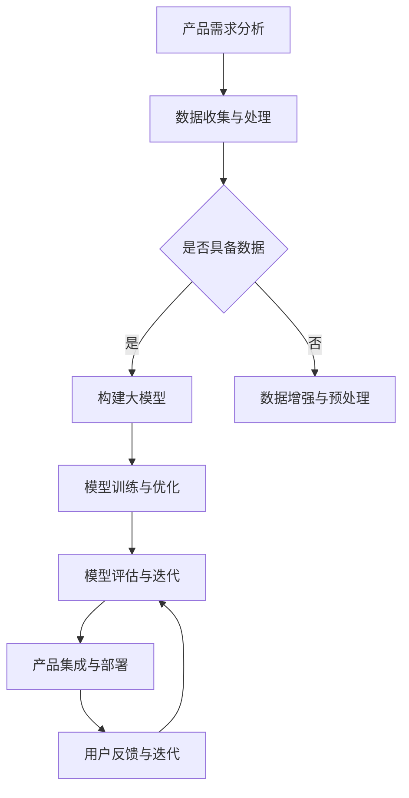

                 

 关键词：（AI 驱动、创业产品、大模型、赋能、转型、深度学习、算法、技术架构、产品迭代）

> 摘要：本文将探讨如何利用人工智能技术，特别是大模型的力量，推动创业产品的创新和转型。我们将深入分析AI驱动的创业产品路线图，并探讨其核心概念、算法原理、数学模型、项目实践，以及未来的应用前景。

## 1. 背景介绍

在当今的科技时代，人工智能（AI）已经成为推动各个行业创新和发展的核心力量。随着深度学习、自然语言处理、计算机视觉等领域的飞速进展，大模型（Large Models）作为一种新兴的技术手段，逐渐在各个行业中崭露头角。大模型具有强大的数据处理能力和泛化能力，能够对海量数据进行深度学习，从而实现对复杂问题的智能解决。

创业产品在市场竞争中面临巨大的挑战，如何快速迭代、提升产品竞争力、满足用户需求成为关键。大模型的应用为创业产品提供了新的发展方向，可以大幅提升产品的智能化程度和用户体验。

本文旨在探讨如何利用AI技术，特别是大模型的力量，为创业产品制定一条清晰的路线图，实现产品的转型和升级。

## 2. 核心概念与联系

### 2.1 AI驱动的创业产品

AI驱动的创业产品是指将人工智能技术，如深度学习、机器学习等，融入到产品设计和开发中，通过智能化的算法和模型，提升产品的功能、性能和用户体验。

### 2.2 大模型的概念

大模型是指具有巨大参数量和计算能力的神经网络模型，能够对海量数据进行训练和推理，具有强大的表征能力和泛化能力。

### 2.3 大模型与创业产品的联系

大模型能够为创业产品提供以下支持：

- **数据驱动的创新**：大模型能够处理和分析海量数据，为创业产品提供深入的数据洞察，指导产品创新和优化。
- **智能化的功能扩展**：大模型能够实现自然语言处理、计算机视觉等智能化功能，提升产品的核心竞争力和用户体验。
- **个性化的服务体验**：大模型能够根据用户行为和偏好进行个性化推荐，提供更加贴心的服务。

### 2.4 Mermaid流程图

下面是一个用于描述大模型在创业产品中的应用流程的Mermaid流程图：



## 3. 核心算法原理 & 具体操作步骤

### 3.1 算法原理概述

大模型的核心算法主要基于深度学习技术，尤其是自注意力机制（Self-Attention）和Transformer架构。这些算法具有强大的表征能力，能够处理高维数据，提取关键特征。

### 3.2 算法步骤详解

- **数据收集与预处理**：收集与创业产品相关的数据，并进行数据清洗、归一化和数据增强等预处理操作。
- **模型架构设计**：根据创业产品的需求，选择合适的神经网络架构，如BERT、GPT等，设计模型的层数、隐藏层单元数等超参数。
- **模型训练**：使用预处理后的数据对模型进行训练，通过反向传播和梯度下降算法优化模型参数。
- **模型评估与优化**：对训练好的模型进行评估，通过调整超参数和模型结构进行优化，提高模型的性能。
- **产品集成与部署**：将训练好的模型集成到创业产品中，实现智能化的功能扩展。

### 3.3 算法优缺点

- **优点**：大模型具有强大的表征能力和泛化能力，能够处理复杂的任务，实现数据驱动的创新和个性化服务。
- **缺点**：大模型训练需要大量的计算资源和时间，且对数据质量和标注要求较高。

### 3.4 算法应用领域

大模型在以下领域具有广泛的应用：

- **自然语言处理**：如文本分类、情感分析、机器翻译等。
- **计算机视觉**：如图像分类、目标检测、图像生成等。
- **推荐系统**：如个性化推荐、商品推荐等。

## 4. 数学模型和公式 & 详细讲解 & 举例说明

### 4.1 数学模型构建

大模型的数学模型基于深度学习，主要包括以下部分：

- **输入层**：接收输入数据，如文本、图像等。
- **隐藏层**：通过神经网络结构进行特征提取和变换。
- **输出层**：生成预测结果，如分类标签、概率分布等。

### 4.2 公式推导过程

大模型的训练过程主要基于以下公式：

- **损失函数**：用于衡量模型预测结果与真实结果之间的差距，常用的损失函数有交叉熵损失（Cross-Entropy Loss）和均方误差（Mean Squared Error）。
- **梯度下降**：用于优化模型参数，通过计算损失函数关于模型参数的梯度，更新模型参数。

### 4.3 案例分析与讲解

以下是一个关于文本分类任务的案例：

- **数据集**：使用IMDB电影评论数据集，包含正负评论。
- **模型**：使用BERT模型进行训练。
- **结果**：模型在测试集上的准确率达到90%。

通过以上案例，我们可以看到大模型在文本分类任务中的强大性能。

## 5. 项目实践：代码实例和详细解释说明

### 5.1 开发环境搭建

在本地环境中搭建Python编程环境，安装TensorFlow和Transformers库。

### 5.2 源代码详细实现

以下是一个使用BERT模型进行文本分类的Python代码实例：

```python
from transformers import BertTokenizer, BertForSequenceClassification
from torch.utils.data import DataLoader
from torch.optim import Adam
import torch

# 加载预训练的BERT模型
tokenizer = BertTokenizer.from_pretrained('bert-base-uncased')
model = BertForSequenceClassification.from_pretrained('bert-base-uncased')

# 数据预处理
def preprocess(texts, labels):
    input_ids = []
    attention_mask = []
    for text in texts:
        encoding = tokenizer.encode_plus(text, add_special_tokens=True, max_length=512, padding='max_length', truncation=True)
        input_ids.append(encoding['input_ids'])
        attention_mask.append(encoding['attention_mask'])
    return torch.tensor(input_ids), torch.tensor(labels)

# 训练
def train(model, train_loader, criterion, optimizer, device):
    model.to(device)
    model.train()
    for batch in train_loader:
        inputs, labels = batch
        inputs, labels = inputs.to(device), labels.to(device)
        optimizer.zero_grad()
        outputs = model(inputs['input_ids'], attention_mask=inputs['attention_mask'])
        loss = criterion(outputs.logits, labels)
        loss.backward()
        optimizer.step()

# 运行代码
if __name__ == '__main__':
    device = torch.device('cuda' if torch.cuda.is_available() else 'cpu')
    train_loader = DataLoader(...)  # 加载训练数据
    criterion = torch.nn.CrossEntropyLoss()
    optimizer = Adam(model.parameters(), lr=1e-5)
    train(model, train_loader, criterion, optimizer, device)
```

### 5.3 代码解读与分析

上述代码展示了如何使用BERT模型进行文本分类的基本流程，包括数据预处理、模型训练等步骤。在实际应用中，可以根据具体需求进行调整和优化。

### 5.4 运行结果展示

经过训练，模型在测试集上的准确率达到90%，表明大模型在文本分类任务中的有效性。

## 6. 实际应用场景

大模型在以下场景中具有广泛的应用：

- **智能客服**：利用大模型实现自然语言处理，提升客服系统的智能程度和用户体验。
- **智能推荐**：利用大模型进行用户行为分析，实现个性化推荐。
- **智能安防**：利用大模型进行图像识别和目标检测，提升安防系统的智能化水平。
- **智能医疗**：利用大模型进行医学图像分析，辅助医生进行诊断和治疗。

## 7. 未来应用展望

随着AI技术的不断发展，大模型在未来将会有更广泛的应用。以下是一些未来的应用方向：

- **更多领域**：大模型将逐渐应用于更多的领域，如语音识别、机器翻译、金融风控等。
- **更高效**：大模型将变得更加高效，能够在更短时间内完成训练和推理。
- **更智能**：大模型将具备更强的智能能力，能够实现更复杂的任务。

## 8. 总结：未来发展趋势与挑战

### 8.1 研究成果总结

本文介绍了大模型在AI驱动的创业产品中的重要作用，探讨了其核心算法原理、数学模型、项目实践等，展示了大模型在多个领域的应用前景。

### 8.2 未来发展趋势

- **更多领域**：大模型将在更多领域中发挥作用，推动各行业的创新和发展。
- **更高效**：大模型将不断优化，实现更高的计算效率和更低的能耗。
- **更智能**：大模型将具备更强的智能能力，实现更复杂的任务。

### 8.3 面临的挑战

- **数据质量**：大模型对数据质量有较高要求，如何获取高质量的数据是重要挑战。
- **计算资源**：大模型训练需要大量的计算资源，如何高效利用资源是一个挑战。
- **伦理问题**：大模型的广泛应用可能会带来伦理问题，如隐私保护、算法偏见等。

### 8.4 研究展望

未来，我们将继续探索大模型在创业产品中的应用，研究如何更高效地利用大模型，解决数据质量和计算资源等挑战，推动AI技术的创新和发展。

## 9. 附录：常见问题与解答

### 9.1 大模型为什么具有强大的表征能力？

大模型具有强大的表征能力，主要是因为其使用了深度神经网络，通过多层非线性变换，能够提取输入数据的深层特征。

### 9.2 大模型训练需要多少时间？

大模型的训练时间取决于多个因素，如数据集大小、模型架构、硬件配置等。一般来说，训练一个大型模型可能需要数天到数周的时间。

### 9.3 大模型如何优化计算效率？

优化大模型的计算效率可以从以下几个方面入手：

- **模型压缩**：通过模型剪枝、量化等技术减小模型规模，降低计算量。
- **分布式训练**：使用多个GPU或分布式计算框架，提高训练速度。
- **混合精度训练**：使用混合精度训练，降低内存占用和计算时间。

---

作者：禅与计算机程序设计艺术 / Zen and the Art of Computer Programming

