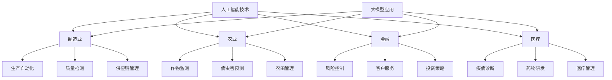

                 

关键词：人工智能，传统行业，大模型，商业新生态，技术融合

> 摘要：本文探讨了人工智能与各传统行业的深度融合，通过大规模模型的应用，重塑了商业运营模式，带来了新的发展机遇和挑战。文章首先介绍了人工智能与各传统行业的背景，然后重点分析了大模型在商业领域的应用，最后对未来发展趋势与挑战进行了展望。

## 1. 背景介绍

随着互联网和数字技术的飞速发展，人工智能（AI）已经成为推动社会进步的重要力量。人工智能作为一门多学科交叉的领域，涵盖了计算机科学、数学、统计学、神经科学等多个学科，其核心目标是使计算机具有人类的智能水平，能够处理复杂的任务和决策。

传统行业，如制造业、农业、金融、医疗等，长期以来依赖于传统的商业模式和运营方式。然而，随着市场竞争的加剧和消费者需求的不断变化，传统行业面临着巨大的挑战和变革压力。人工智能的兴起，为传统行业带来了新的机遇，通过将人工智能技术与传统行业深度融合，可以实现商业模式的创新和运营效率的提升。

## 2. 核心概念与联系

### 2.1 人工智能与各传统行业

人工智能与传统行业的融合，主要体现在以下方面：

- **制造业**：人工智能可以用于生产线的自动化控制、产品质量检测、供应链管理等，提高生产效率和产品质量。
- **农业**：人工智能可以用于作物生长监测、病虫害预测、农田管理，提高农业生产效率和农产品的质量。
- **金融**：人工智能可以用于风险控制、客户服务、投资策略等，提高金融服务的效率和准确性。
- **医疗**：人工智能可以用于疾病诊断、药物研发、医疗管理等，提高医疗服务的质量和效率。

### 2.2 大模型在商业领域的应用

大模型是指具有海量数据和强大计算能力的人工智能模型，如深度学习模型、自然语言处理模型、计算机视觉模型等。大模型在商业领域的应用，主要体现在以下几个方面：

- **数据分析和决策**：大模型可以处理海量数据，提取有价值的信息，为商业决策提供支持。
- **客户服务和体验**：大模型可以用于客户服务机器人、个性化推荐系统等，提高客户体验和服务质量。
- **业务流程优化**：大模型可以用于业务流程的自动化和优化，提高运营效率和降低成本。
- **商业模式创新**：大模型可以用于新的业务模式的设计和实现，创造新的商业价值。

### 2.3 Mermaid 流程图

以下是人工智能与传统行业融合及大模型应用流程的Mermaid流程图：



## 3. 核心算法原理 & 具体操作步骤

### 3.1 算法原理概述

人工智能的核心算法包括深度学习、自然语言处理和计算机视觉等。这些算法通过模拟人脑的神经元结构和信息处理过程，实现对数据的自动学习和理解。

大模型的应用，主要依赖于深度学习算法。深度学习算法通过多层神经网络对数据进行训练，能够提取数据的特征和规律，实现对数据的自动学习和分类。

### 3.2 算法步骤详解

1. **数据收集和预处理**：收集大量的行业数据，如制造业的生产数据、金融市场的交易数据、医疗行业的病例数据等。对数据进行清洗、去噪、归一化等预处理，确保数据的质量和一致性。
2. **构建深度学习模型**：根据行业特点和应用需求，选择合适的深度学习模型，如卷积神经网络（CNN）、循环神经网络（RNN）、生成对抗网络（GAN）等。
3. **模型训练**：将预处理后的数据输入到深度学习模型中，通过反向传播算法和梯度下降算法对模型进行训练，优化模型的参数。
4. **模型评估和调整**：通过交叉验证和测试集对模型的性能进行评估，根据评估结果对模型进行调整和优化。
5. **模型应用**：将训练好的模型应用于实际业务场景，如制造业的生产自动化、金融市场的风险控制、医疗行业的疾病诊断等。

### 3.3 算法优缺点

**优点**：

- **高效性**：深度学习模型能够处理海量数据，提取数据的特征和规律，具有高效性。
- **泛化能力**：深度学习模型具有较强的泛化能力，可以适应不同的行业和应用场景。
- **自适应能力**：深度学习模型可以通过不断学习和调整，适应不断变化的数据和环境。

**缺点**：

- **计算资源需求大**：深度学习模型训练需要大量的计算资源和时间。
- **数据质量要求高**：深度学习模型的性能依赖于数据的质量和数量，对数据的要求较高。
- **模型解释性较差**：深度学习模型的学习过程较为复杂，难以对模型的决策过程进行解释。

### 3.4 算法应用领域

深度学习算法在商业领域的应用非常广泛，如：

- **金融**：用于风险控制、投资策略、客户服务等。
- **医疗**：用于疾病诊断、药物研发、医疗管理等。
- **制造**：用于生产自动化、质量检测、供应链管理等。
- **农业**：用于作物监测、病虫害预测、农田管理等。

## 4. 数学模型和公式 & 详细讲解 & 举例说明

### 4.1 数学模型构建

深度学习模型的核心是多层神经网络，其数学模型可以表示为：

$$
\begin{align*}
z_{l} &= W_{l} \cdot a_{l-1} + b_{l} \\
a_{l} &= \sigma(z_{l})
\end{align*}
$$

其中，$z_{l}$表示第$l$层的输出，$W_{l}$和$b_{l}$分别表示第$l$层的权重和偏置，$\sigma$表示激活函数，$a_{l}$表示第$l$层的激活值。

### 4.2 公式推导过程

深度学习模型的训练过程，可以看作是一个优化问题。我们定义损失函数为：

$$
L = \frac{1}{2} \sum_{i=1}^{n} (y_{i} - a_{n})^2
$$

其中，$y_{i}$表示第$i$个样本的真实标签，$a_{n}$表示第$n$层的输出。

为了最小化损失函数，我们使用梯度下降算法来更新权重和偏置。首先计算损失函数关于权重和偏置的梯度：

$$
\begin{align*}
\frac{\partial L}{\partial W_{l}} &= (a_{n} - y_{i}) \cdot a_{l-1} \\
\frac{\partial L}{\partial b_{l}} &= (a_{n} - y_{i}) \cdot 1
\end{align*}
$$

然后，使用以下公式更新权重和偏置：

$$
\begin{align*}
W_{l} &= W_{l} - \alpha \cdot \frac{\partial L}{\partial W_{l}} \\
b_{l} &= b_{l} - \alpha \cdot \frac{\partial L}{\partial b_{l}}
\end{align*}
$$

其中，$\alpha$表示学习率。

### 4.3 案例分析与讲解

以制造业的质量检测为例，我们使用卷积神经网络（CNN）对生产过程中产生的数据进行分析，判断产品是否合格。

1. **数据收集和预处理**：收集生产过程中产生的传感器数据，如温度、压力、振动等。对数据进行归一化处理，将数据范围缩放到[0, 1]之间。
2. **构建CNN模型**：使用TensorFlow框架构建CNN模型，包括卷积层、池化层和全连接层。
3. **模型训练**：将预处理后的数据输入到CNN模型中，通过反向传播算法和梯度下降算法对模型进行训练。
4. **模型评估**：使用测试集对模型的性能进行评估，调整模型参数以优化性能。
5. **模型应用**：将训练好的模型应用于生产过程中的数据，判断产品是否合格。

通过上述步骤，我们可以实现生产过程中的质量检测，提高生产效率和产品质量。

## 5. 项目实践：代码实例和详细解释说明

### 5.1 开发环境搭建

1. 安装Python环境，版本要求3.8及以上。
2. 安装TensorFlow框架，可以使用pip安装：
   ```bash
   pip install tensorflow
   ```
3. 准备数据集，包括训练集和测试集。

### 5.2 源代码详细实现

以下是一个简单的CNN模型实现，用于对生产过程中产生的数据进行分析。

```python
import tensorflow as tf
from tensorflow.keras.models import Sequential
from tensorflow.keras.layers import Dense, Conv2D, Flatten, MaxPooling2D

# 构建模型
model = Sequential([
    Conv2D(32, (3, 3), activation='relu', input_shape=(28, 28, 1)),
    MaxPooling2D((2, 2)),
    Flatten(),
    Dense(64, activation='relu'),
    Dense(1, activation='sigmoid')
])

# 编译模型
model.compile(optimizer='adam', loss='binary_crossentropy', metrics=['accuracy'])

# 加载数据集
(x_train, y_train), (x_test, y_test) = tf.keras.datasets.mnist.load_data()
x_train = x_train.reshape(-1, 28, 28, 1).astype('float32') / 255
x_test = x_test.reshape(-1, 28, 28, 1).astype('float32') / 255

# 训练模型
model.fit(x_train, y_train, epochs=10, batch_size=32, validation_split=0.2)

# 评估模型
loss, accuracy = model.evaluate(x_test, y_test)
print(f"Test accuracy: {accuracy:.2f}")

# 预测
predictions = model.predict(x_test)
```

### 5.3 代码解读与分析

1. **模型构建**：使用Sequential模型构建，包括卷积层、池化层、全连接层和输出层。
2. **模型编译**：指定优化器、损失函数和评估指标。
3. **数据加载**：使用TensorFlow内置的MNIST数据集，对数据进行归一化处理。
4. **模型训练**：使用训练集对模型进行训练，设置训练轮次、批量大小和验证比例。
5. **模型评估**：使用测试集对模型进行评估，输出准确率。
6. **模型预测**：使用训练好的模型对测试集进行预测。

## 6. 实际应用场景

### 6.1 制造业

在制造业中，人工智能和大规模模型的应用，可以实现生产过程的自动化和优化。例如，通过卷积神经网络对生产过程中产生的传感器数据进行实时分析，可以实现对产品质量的实时监控和预测。同时，通过自然语言处理技术，可以对生产过程中的问题进行自动诊断和故障预测。

### 6.2 农业

在农业中，人工智能和大规模模型的应用，可以实现作物生长的智能监测和病虫害的预测。通过计算机视觉技术，可以对农田进行实时监控，识别作物的生长状态和病虫害情况。同时，通过深度学习模型，可以预测作物的产量和收获时间，为农业生产提供科学依据。

### 6.3 金融

在金融领域，人工智能和大规模模型的应用，可以用于风险控制、投资策略和客户服务。例如，通过深度学习模型对金融市场的数据进行实时分析，可以预测市场的走势和风险。通过自然语言处理技术，可以实现对客户咨询的自动回复和智能客服。

### 6.4 医疗

在医疗领域，人工智能和大规模模型的应用，可以用于疾病诊断、药物研发和医疗管理。例如，通过计算机视觉技术，可以对医学影像进行自动诊断，提高诊断的准确率和速度。通过深度学习模型，可以预测患者的病情发展和治疗方案，为医生提供决策支持。

## 7. 未来应用展望

### 7.1 人工智能与区块链的融合

人工智能与区块链的融合，可以实现数据的安全存储和智能合约的自动化执行。在商业领域，这将为供应链管理、智能合约、身份验证等提供新的解决方案。例如，通过区块链技术，可以实现对生产过程的全程监控和溯源，提高生产过程的透明度和可信度。

### 7.2 人工智能与物联网的融合

人工智能与物联网的融合，可以实现智能家居、智能交通、智能城市等应用场景。通过物联网设备收集到的数据，可以用于训练大规模模型，实现对场景的智能分析和决策。例如，通过智能交通系统，可以实时监控交通状况，优化交通信号灯控制，提高交通效率。

### 7.3 人工智能与生物技术的融合

人工智能与生物技术的融合，可以推动生物医学研究的发展。例如，通过深度学习模型对基因数据进行分析，可以预测疾病的发病风险，为疾病预防提供科学依据。通过人工智能算法，可以加速药物研发过程，提高新药的发现效率。

## 8. 工具和资源推荐

### 8.1 学习资源推荐

- 《深度学习》（Goodfellow, Bengio, Courville著）：系统介绍了深度学习的理论和方法。
- 《Python深度学习》（François Chollet著）：深入介绍了使用Python实现深度学习的实践方法。
- 《自然语言处理与深度学习》（Zongheng Li著）：介绍了自然语言处理和深度学习的相关技术。

### 8.2 开发工具推荐

- TensorFlow：开源的深度学习框架，适用于各种深度学习任务。
- PyTorch：开源的深度学习框架，具有良好的灵活性和易用性。
- Keras：基于TensorFlow和Theano的开源深度学习库，易于使用和扩展。

### 8.3 相关论文推荐

- "Deep Learning for Text Classification"（2017）：介绍了深度学习在文本分类中的应用。
- "Generative Adversarial Networks"（2014）：提出了生成对抗网络（GAN）的理论和方法。
- "ResNet: Training Deep Neural Networks for Image Recognition"（2016）：提出了残差网络（ResNet），用于图像识别任务。

## 9. 总结：未来发展趋势与挑战

### 9.1 研究成果总结

近年来，人工智能在商业领域的应用取得了显著的成果。通过大规模模型的应用，实现了数据分析和决策、客户服务和体验、业务流程优化和商业模式创新等多个方面的突破。

### 9.2 未来发展趋势

- **跨界融合**：人工智能与其他领域的深度融合，将为商业领域带来新的发展机遇。
- **智能化**：人工智能将进一步提升商业运营的智能化水平，提高效率和降低成本。
- **个性化**：人工智能将推动商业模式的个性化，满足消费者多样化的需求。

### 9.3 面临的挑战

- **数据安全与隐私**：大规模数据的收集和使用，可能引发数据安全和隐私问题。
- **技术瓶颈**：人工智能在计算资源、数据质量和算法优化等方面仍面临一定的技术瓶颈。
- **人才短缺**：人工智能领域的人才需求巨大，但人才供给不足，将制约人工智能的发展。

### 9.4 研究展望

未来，人工智能在商业领域的应用将更加广泛和深入。通过技术创新和跨界融合，人工智能将为商业领域带来更多的发展机遇和挑战。

## 附录：常见问题与解答

### 问题1：如何选择合适的深度学习模型？

**解答**：选择合适的深度学习模型，需要考虑以下几个因素：

- **数据量**：数据量较大的场景，可以选择复杂的模型，如卷积神经网络（CNN）或循环神经网络（RNN）。
- **任务类型**：针对分类任务，可以选择CNN或RNN；针对回归任务，可以选择线性回归或支持向量机（SVM）。
- **计算资源**：计算资源有限的情况下，可以选择轻量级的模型，如MobileNet或ResNet。

### 问题2：如何处理数据？

**解答**：处理数据，主要包括以下几个步骤：

- **数据清洗**：去除数据中的噪声和异常值。
- **数据归一化**：将数据范围缩放到[0, 1]之间，提高模型的训练效果。
- **数据增强**：通过旋转、缩放、裁剪等方式，增加数据样本的多样性。
- **数据划分**：将数据集划分为训练集、验证集和测试集，用于模型的训练、评估和测试。

### 问题3：如何优化深度学习模型？

**解答**：优化深度学习模型，可以采用以下几种方法：

- **调整超参数**：调整学习率、批量大小、迭代次数等超参数，以优化模型的性能。
- **正则化**：使用正则化方法，如L1正则化、L2正则化，防止过拟合。
- **dropout**：在神经网络中引入dropout，减少模型的过拟合。
- **迁移学习**：使用预训练模型，迁移到新任务上，提高模型的性能。

通过上述方法和策略，可以有效优化深度学习模型的性能。----------------------------------------------------------------

### 10. 结语

本文从背景介绍、核心概念与联系、算法原理与实现、数学模型与公式、项目实践、实际应用场景、未来展望、工具和资源推荐等方面，详细探讨了人工智能与传统行业融合，以及大模型在商业新生态中的重塑作用。随着人工智能技术的不断发展和应用的深入，未来商业领域将迎来更多创新和变革。作者：禅与计算机程序设计艺术 / Zen and the Art of Computer Programming。在后续的研究中，我们将继续关注人工智能与传统行业的深度融合，探索更多可能的应用场景和技术突破。希望本文能为读者在人工智能与商业领域的探索提供一些启示和帮助。

