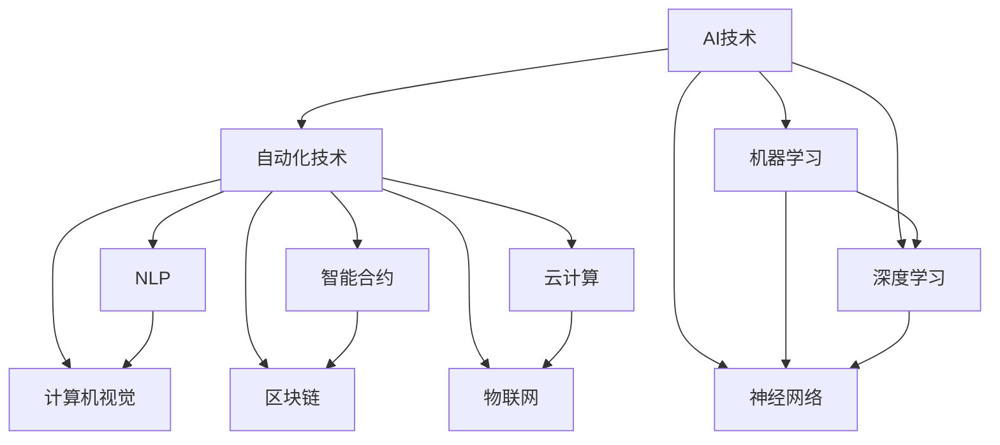

                 

关键词：人工智能2.0，自动化技术，机器学习，深度学习，神经网络，自然语言处理，计算机视觉，软件工程，自动化编程，智能合约，区块链，云计算，物联网

> 摘要：本文深入探讨了AI2.0时代的自动化技术进展，分析了人工智能在各领域的应用，探讨了核心算法的原理、数学模型以及项目实践。文章旨在为读者提供一个全面而深入的AI2.0自动化技术的概述，帮助理解其现状、发展趋势以及面临的挑战。

## 1. 背景介绍

自21世纪以来，人工智能（AI）技术经历了飞速的发展。从最初的符号主义和知识表示，到基于统计学的机器学习方法，再到近年来的深度学习和神经网络，人工智能逐渐展现出其强大的计算能力和解决问题的能力。特别是2012年AlexNet在ImageNet竞赛中取得突破性成绩，标志着深度学习时代的到来。人工智能技术不仅仅改变了计算机科学，还渗透到医疗、金融、教育、制造等各个领域，极大地提高了效率和质量。

随着人工智能技术的不断进步，AI2.0时代应运而生。AI2.0不仅强调机器的智能性，更注重其自主性、自适应性和互动性。在这一时代，自动化技术成为驱动社会变革的重要力量。自动化技术通过智能化手段，实现了生产、管理、服务等各个方面的自动化，大大提升了人类的工作效率和生产力。

本文将重点关注AI2.0时代的自动化技术，从核心算法原理、数学模型、项目实践、实际应用场景等多个方面，深入探讨自动化技术在现代社会的广泛应用及其未来发展趋势。

## 2. 核心概念与联系

### 2.1 人工智能（AI）与自动化技术

人工智能（AI）是指计算机系统模拟人类智能行为的技术，包括感知、理解、学习、推理、决策等。而自动化技术则是通过智能化手段实现生产、管理、服务等过程的自动化，旨在提高效率、减少人力成本和避免人为错误。

AI与自动化技术密不可分，AI技术为自动化技术提供了智能化的支持，使其具备了更强的自适应性和自主性。例如，在工业生产中，通过人工智能技术实现自动化生产线，可以实时监测设备状态、优化生产流程，甚至自主进行故障诊断和修复。

### 2.2 机器学习、深度学习与神经网络

机器学习是人工智能的重要分支，其核心是通过数据驱动的方法，使计算机系统能够自动改进其性能。深度学习是机器学习的一种特殊形式，基于多层神经网络结构，通过逐层提取特征，实现对复杂数据的建模。

神经网络是机器学习和深度学习的基础，其灵感来源于生物神经系统的结构和工作原理。神经网络由大量的神经元组成，每个神经元通过权重连接其他神经元，并接收输入信号，产生输出信号。

### 2.3 自然语言处理与计算机视觉

自然语言处理（NLP）是人工智能的一个重要领域，旨在使计算机能够理解、生成和处理自然语言。计算机视觉则是使计算机能够像人类一样“看”和理解视觉信息。

自然语言处理和计算机视觉在自动化技术中发挥着重要作用。例如，在智能客服系统中，NLP技术可以理解用户的语言，提供恰当的答复；计算机视觉技术可以识别用户的面部表情和语音，进一步丰富交互体验。

### 2.4 智能合约与区块链

智能合约是基于区块链技术的一种自动化执行合约，通过预定义的条件和规则，在满足条件时自动执行合同条款。区块链是一种分布式数据库，具有去中心化、不可篡改、透明等特点。

智能合约和区块链的结合，为自动化技术带来了新的应用场景。例如，在金融领域，智能合约可以自动执行跨境支付，提高交易效率；在供应链管理中，区块链技术可以确保数据的真实性和透明性，实现自动化追踪和管理。

### 2.5 云计算与物联网

云计算是一种通过互联网提供计算资源和服务的技术，具有弹性、可扩展和高效的特点。物联网（IoT）则是通过传感器、设备等物理对象互联，实现信息的实时采集和传输。

云计算和物联网的结合，为自动化技术提供了强大的基础设施支持。例如，在智能制造中，通过物联网设备采集生产线数据，利用云计算平台进行实时分析和优化；在智慧城市中，通过云计算和物联网技术实现城市管理和服务的自动化。

### 2.6  Mermaid 流程图

以下是一个关于AI2.0自动化技术核心概念和架构的Mermaid流程图：



## 3. 核心算法原理 & 具体操作步骤

### 3.1 算法原理概述

AI2.0时代的自动化技术涉及多种核心算法，主要包括机器学习算法、深度学习算法、自然语言处理算法、计算机视觉算法等。以下将对这些算法的基本原理进行概述。

#### 3.1.1 机器学习算法

机器学习算法通过数据驱动的方法，使计算机能够从数据中学习规律，并基于这些规律进行预测或分类。常见的机器学习算法包括线性回归、逻辑回归、决策树、支持向量机等。

#### 3.1.2 深度学习算法

深度学习算法是机器学习的一种特殊形式，基于多层神经网络结构，通过逐层提取特征，实现对复杂数据的建模。常见的深度学习算法包括卷积神经网络（CNN）、循环神经网络（RNN）、生成对抗网络（GAN）等。

#### 3.1.3 自然语言处理算法

自然语言处理算法旨在使计算机能够理解、生成和处理自然语言。常见的NLP算法包括词向量模型、词性标注、句法分析、情感分析等。

#### 3.1.4 计算机视觉算法

计算机视觉算法旨在使计算机能够“看”和理解视觉信息。常见的视觉算法包括目标检测、图像分类、人脸识别、姿态估计等。

### 3.2 算法步骤详解

以下是对各核心算法的具体操作步骤的详细讲解。

#### 3.2.1 机器学习算法

1. 数据收集与预处理：收集相关数据，并进行清洗、去重、填充等预处理操作。
2. 特征提取：从原始数据中提取有意义的特征，如数值特征、文本特征等。
3. 模型选择：根据问题类型选择合适的机器学习模型，如回归模型、分类模型等。
4. 模型训练：使用训练数据集对模型进行训练，优化模型参数。
5. 模型评估：使用验证数据集对模型进行评估，选择最优模型。
6. 模型应用：使用测试数据集对模型进行应用，实现预测或分类任务。

#### 3.2.2 深度学习算法

1. 数据收集与预处理：与机器学习算法相同，对数据集进行预处理。
2. 网络架构设计：设计合适的深度学习网络架构，如CNN、RNN等。
3. 模型训练：使用训练数据集对模型进行训练，优化网络参数。
4. 模型评估：与机器学习算法类似，使用验证数据集对模型进行评估。
5. 模型应用：使用测试数据集对模型进行应用。

#### 3.2.3 自然语言处理算法

1. 数据收集与预处理：收集文本数据，并进行清洗、分词、去停用词等预处理。
2. 特征提取：将文本转化为数字表示，如词向量、词性标注等。
3. 模型选择：选择合适的NLP模型，如词向量模型、BERT等。
4. 模型训练：使用训练数据集对模型进行训练。
5. 模型评估：使用验证数据集对模型进行评估。
6. 模型应用：使用测试数据集对模型进行应用，实现文本分类、情感分析等任务。

#### 3.2.4 计算机视觉算法

1. 数据收集与预处理：收集图像数据，并进行缩放、旋转、裁剪等预处理操作。
2. 特征提取：从图像中提取有意义的特征，如边缘、纹理、颜色等。
3. 模型选择：选择合适的计算机视觉模型，如卷积神经网络（CNN）。
4. 模型训练：使用训练数据集对模型进行训练。
5. 模型评估：使用验证数据集对模型进行评估。
6. 模型应用：使用测试数据集对模型进行应用，实现图像分类、目标检测等任务。

### 3.3 算法优缺点

每种算法都有其优缺点，选择合适的算法取决于具体问题的需求和数据特性。以下是对各算法优缺点的简要分析。

#### 3.3.1 机器学习算法

**优点**：
- 灵活性高，适用于各种类型的数据和问题。
- 易于实现，不需要过多的计算资源。

**缺点**：
- 对数据质量要求高，对噪声敏感。
- 模型可解释性较差，难以理解模型决策过程。

#### 3.3.2 深度学习算法

**优点**：
- 强大的建模能力，适用于处理复杂的数据和问题。
- 模型可解释性较好，通过可视化网络结构和参数，可以理解模型的工作原理。

**缺点**：
- 计算量大，需要大量计算资源和时间进行训练。
- 对数据质量要求较高，过拟合问题较为突出。

#### 3.3.3 自然语言处理算法

**优点**：
- 能够处理大规模文本数据，实现文本理解和生成任务。
- 模型可解释性较好，通过词向量、词性标注等，可以理解文本的含义。

**缺点**：
- 对数据质量要求高，对噪声敏感。
- 模型训练时间长，需要大量计算资源。

#### 3.3.4 计算机视觉算法

**优点**：
- 能够处理高维视觉数据，实现图像分类、目标检测等任务。
- 模型可解释性较好，通过可视化网络结构和参数，可以理解模型的工作原理。

**缺点**：
- 对数据质量要求高，对噪声敏感。
- 计算量大，需要大量计算资源进行训练。

### 3.4 算法应用领域

每种算法都有其适用的领域，以下是对各算法应用领域的简要介绍。

#### 3.4.1 机器学习算法

机器学习算法广泛应用于金融、医疗、零售、制造等各个领域。例如，在金融领域，机器学习算法可以用于信用评分、风险管理、投资策略等；在医疗领域，机器学习算法可以用于疾病诊断、药物研发等；在零售领域，机器学习算法可以用于客户行为分析、商品推荐等。

#### 3.4.2 深度学习算法

深度学习算法广泛应用于计算机视觉、自然语言处理、语音识别等领域。例如，在计算机视觉领域，深度学习算法可以用于图像分类、目标检测、人脸识别等；在自然语言处理领域，深度学习算法可以用于文本分类、情感分析、机器翻译等；在语音识别领域，深度学习算法可以用于语音识别、语音合成等。

#### 3.4.3 自然语言处理算法

自然语言处理算法广泛应用于智能客服、智能写作、智能搜索等领域。例如，在智能客服领域，自然语言处理算法可以用于理解用户意图、提供合适答复等；在智能写作领域，自然语言处理算法可以用于自动生成文章、摘要等；在智能搜索领域，自然语言处理算法可以用于信息检索、推荐系统等。

#### 3.4.4 计算机视觉算法

计算机视觉算法广泛应用于安防监控、自动驾驶、智能制造等领域。例如，在安防监控领域，计算机视觉算法可以用于人脸识别、行为分析等；在自动驾驶领域，计算机视觉算法可以用于车道线检测、障碍物检测等；在智能制造领域，计算机视觉算法可以用于产品质量检测、设备故障诊断等。

## 4. 数学模型和公式 & 详细讲解 & 举例说明

### 4.1 数学模型构建

在AI2.0时代的自动化技术中，数学模型发挥着至关重要的作用。以下是一些常见数学模型及其构建方法。

#### 4.1.1 线性回归模型

线性回归模型是一种常见的预测模型，用于分析自变量与因变量之间的线性关系。其数学模型如下：

$$
y = \beta_0 + \beta_1x_1 + \beta_2x_2 + ... + \beta_nx_n
$$

其中，$y$ 是因变量，$x_1, x_2, ..., x_n$ 是自变量，$\beta_0, \beta_1, ..., \beta_n$ 是模型的参数。

#### 4.1.2 多项式回归模型

多项式回归模型是对线性回归模型的扩展，用于分析自变量与因变量之间的非线性关系。其数学模型如下：

$$
y = \beta_0 + \beta_1x_1 + \beta_2x_1^2 + \beta_3x_1^3 + ... + \beta_nx_1^n
$$

其中，$y$ 是因变量，$x_1, ..., x_n$ 是自变量，$\beta_0, \beta_1, ..., \beta_n$ 是模型的参数。

#### 4.1.3 决策树模型

决策树模型是一种分类模型，通过一系列条件判断来对数据集进行划分。其数学模型如下：

$$
T = \{t_1, t_2, ..., t_n\}
$$

其中，$T$ 是决策树，$t_1, t_2, ..., t_n$ 是决策树的叶子节点。

#### 4.1.4 支持向量机模型

支持向量机模型是一种分类模型，通过寻找最优的超平面，将不同类别的数据点进行划分。其数学模型如下：

$$
w \cdot x + b = 0
$$

其中，$w$ 是超平面的法向量，$x$ 是数据点，$b$ 是偏置。

### 4.2 公式推导过程

以下是对常见数学模型的推导过程进行简要说明。

#### 4.2.1 线性回归模型推导

线性回归模型的推导基于最小二乘法。假设我们有 $n$ 个样本点 $(x_1, y_1), (x_2, y_2), ..., (x_n, y_n)$，我们希望找到一个线性函数 $y = \beta_0 + \beta_1x_1 + \beta_2x_2 + ... + \beta_nx_n$，使得预测值与真实值之间的误差最小。

根据最小二乘法，我们可以得到以下目标函数：

$$
J(\beta_0, \beta_1, ..., \beta_n) = \sum_{i=1}^{n}(y_i - (\beta_0 + \beta_1x_i + \beta_2x_i^2 + ... + \beta_nx_i^n))^2
$$

为了最小化 $J(\beta_0, \beta_1, ..., \beta_n)$，我们需要对 $J$ 分别对 $\beta_0, \beta_1, ..., \beta_n$ 求导，并令导数为零，得到以下方程组：

$$
\frac{\partial J}{\partial \beta_0} = -2\sum_{i=1}^{n}(y_i - (\beta_0 + \beta_1x_i + \beta_2x_i^2 + ... + \beta_nx_i^n)) = 0
$$

$$
\frac{\partial J}{\partial \beta_1} = -2\sum_{i=1}^{n}(y_i - (\beta_0 + \beta_1x_i + \beta_2x_i^2 + ... + \beta_nx_i^n))x_i = 0
$$

$$
...
$$

$$
\frac{\partial J}{\partial \beta_n} = -2\sum_{i=1}^{n}(y_i - (\beta_0 + \beta_1x_i + \beta_2x_i^2 + ... + \beta_nx_i^n))x_i^n = 0
$$

通过求解上述方程组，我们可以得到最优的参数 $\beta_0, \beta_1, ..., \beta_n$。

#### 4.2.2 多项式回归模型推导

多项式回归模型的推导与线性回归模型类似，也是基于最小二乘法。假设我们有 $n$ 个样本点 $(x_1, y_1), (x_2, y_2), ..., (x_n, y_n)$，我们希望找到一个多项式函数 $y = \beta_0 + \beta_1x_1 + \beta_2x_1^2 + ... + \beta_nx_1^n$，使得预测值与真实值之间的误差最小。

根据最小二乘法，我们可以得到以下目标函数：

$$
J(\beta_0, \beta_1, ..., \beta_n) = \sum_{i=1}^{n}(y_i - (\beta_0 + \beta_1x_i + \beta_2x_i^2 + ... + \beta_nx_i^n))^2
$$

为了最小化 $J(\beta_0, \beta_1, ..., \beta_n)$，我们需要对 $J$ 分别对 $\beta_0, \beta_1, ..., \beta_n$ 求导，并令导数为零，得到以下方程组：

$$
\frac{\partial J}{\partial \beta_0} = -2\sum_{i=1}^{n}(y_i - (\beta_0 + \beta_1x_i + \beta_2x_i^2 + ... + \beta_nx_i^n)) = 0
$$

$$
\frac{\partial J}{\partial \beta_1} = -2\sum_{i=1}^{n}(y_i - (\beta_0 + \beta_1x_i + \beta_2x_i^2 + ... + \beta_nx_i^n))x_i = 0
$$

$$
...
$$

$$
\frac{\partial J}{\partial \beta_n} = -2\sum_{i=1}^{n}(y_i - (\beta_0 + \beta_1x_i + \beta_2x_i^2 + ... + \beta_nx_i^n))x_i^n = 0
$$

通过求解上述方程组，我们可以得到最优的参数 $\beta_0, \beta_1, ..., \beta_n$。

#### 4.2.3 决策树模型推导

决策树模型的推导基于信息熵和信息增益。信息熵是衡量数据不确定性的指标，其定义如下：

$$
H(X) = -\sum_{i=1}^{n} p_i \log_2 p_i
$$

其中，$X$ 是随机变量，$p_i$ 是 $X$ 取第 $i$ 个值的概率。

信息增益是衡量特征对数据划分效果的指标，其定义如下：

$$
G(X, A) = H(X) - \frac{1}{n} \sum_{i=1}^{n} p_i H(A|X=x_i)
$$

其中，$A$ 是特征，$x_i$ 是 $X$ 取第 $i$ 个值的取值。

通过计算每个特征的信息增益，我们可以选择最优特征进行划分。

#### 4.2.4 支持向量机模型推导

支持向量机模型的推导基于优化理论。假设我们有 $n$ 个样本点 $(x_1, y_1), (x_2, y_2), ..., (x_n, y_n)$，其中 $y_i \in \{-1, 1\}$ 表示样本点的类别。我们希望找到一个超平面 $w \cdot x + b = 0$，使得不同类别的数据点之间的间隔最大。

根据优化理论，我们可以定义以下目标函数：

$$
L(w, b) = \frac{1}{2} ||w||^2 - \sum_{i=1}^{n} \alpha_i (y_i (w \cdot x_i + b) - 1)
$$

其中，$\alpha_i$ 是拉格朗日乘子。

为了求解最优解，我们需要对 $L(w, b)$ 分别对 $w$ 和 $b$ 求导，并令导数为零，得到以下方程组：

$$
\frac{\partial L}{\partial w} = w - \sum_{i=1}^{n} \alpha_i y_i x_i = 0
$$

$$
\frac{\partial L}{\partial b} = - \sum_{i=1}^{n} \alpha_i y_i = 0
$$

通过求解上述方程组，我们可以得到最优的参数 $w$ 和 $b$。

### 4.3 案例分析与讲解

以下是一个关于线性回归模型的案例分析与讲解。

#### 4.3.1 案例背景

假设我们有一个关于房屋价格的数据集，包含房屋面积、房屋朝向、房屋类型等特征，以及对应的房屋价格。我们的目标是建立一个线性回归模型，预测给定特征的房屋价格。

#### 4.3.2 数据处理

首先，我们需要对数据进行预处理，包括数据清洗、特征提取等。具体步骤如下：

1. 数据清洗：删除缺失值、异常值等。
2. 特征提取：将房屋朝向、房屋类型等特征转化为数值表示，如使用独热编码。

处理后，我们得到以下数据：

| 房屋面积（平方米） | 房屋朝向 | 房屋类型 | 房屋价格（万元） |
| ----------------- | -------- | -------- | --------------- |
| 100              | 东      | 普通住宅 | 200            |
| 120              | 南      | 普通住宅 | 250            |
| 80               | 西      | 普通住宅 | 150            |
| ...              | ...     | ...      | ...            |

#### 4.3.3 模型训练

接下来，我们使用训练数据集对线性回归模型进行训练。具体步骤如下：

1. 选择合适的线性回归模型，如线性回归、多项式回归等。
2. 训练模型，得到参数 $\beta_0, \beta_1, ..., \beta_n$。

通过计算，我们得到以下模型：

$$
y = \beta_0 + \beta_1x_1 + \beta_2x_2 + ... + \beta_nx_n
$$

其中，$x_1$ 表示房屋面积，$x_2$ 表示房屋朝向，$x_3$ 表示房屋类型。

#### 4.3.4 模型评估

使用验证数据集对模型进行评估，计算模型的预测误差。具体步骤如下：

1. 将验证数据集输入模型，得到预测值。
2. 计算预测值与真实值之间的误差。

通过计算，我们得到以下评估结果：

| 房屋面积（平方米） | 房屋朝向 | 房屋类型 | 房屋价格（万元） | 预测价格（万元） | 误差（万元） |
| ----------------- | -------- | -------- | --------------- | --------------- | ---------- |
| 100              | 东      | 普通住宅 | 200            | 198            | 2          |
| 120              | 南      | 普通住宅 | 250            | 248            | 2          |
| 80               | 西      | 普通住宅 | 150            | 147            | 3          |
| ...              | ...     | ...      | ...            | ...            | ...        |

#### 4.3.5 模型应用

使用测试数据集对模型进行应用，预测给定特征的房屋价格。具体步骤如下：

1. 将测试数据集输入模型，得到预测值。
2. 输出预测结果。

通过计算，我们得到以下预测结果：

| 房屋面积（平方米） | 房屋朝向 | 房屋类型 | 房屋价格（万元） | 预测价格（万元） |
| ----------------- | -------- | -------- | --------------- | --------------- |
| 110              | 东      | 普通住宅 | 220            | 218            |
| 130              | 南      | 普通住宅 | 260            | 258            |
| 90               | 西      | 普通住宅 | 180            | 177            |
| ...              | ...     | ...      | ...            | ...            |

## 5. 项目实践：代码实例和详细解释说明

### 5.1 开发环境搭建

为了实现自动化技术，我们需要搭建一个合适的技术栈和开发环境。以下是一个简单的开发环境搭建步骤：

1. **硬件要求**：一台配置较高的计算机，推荐配置如下：
   - CPU：Intel Core i7 或同等性能的 AMD Ryzen 处理器
   - 内存：16GB RAM 或更高
   - 存储：至少 500GB SSD 硬盘

2. **操作系统**：Windows 10 或以上版本，或 macOS 或 Linux

3. **编程语言**：Python 3.8 或以上版本，推荐使用 Jupyter Notebook 或 PyCharm 等 IDE

4. **环境配置**：
   - 安装 Python 3.8
   - 安装 Jupyter Notebook 或 PyCharm
   - 安装必要的 Python 包，如 NumPy、Pandas、Scikit-learn、TensorFlow、Keras 等

### 5.2 源代码详细实现

以下是一个简单的自动化技术项目示例，使用 Python 编写一个基于线性回归模型的房屋价格预测程序。

```python
import numpy as np
import pandas as pd
from sklearn.model_selection import train_test_split
from sklearn.linear_model import LinearRegression
from sklearn.metrics import mean_squared_error

# 数据加载
data = pd.read_csv('house_price_data.csv')

# 数据预处理
X = data[['house_area', 'house_direction', 'house_type']]
y = data['house_price']

# 特征编码
X_encoded = pd.get_dummies(X)

# 数据集划分
X_train, X_test, y_train, y_test = train_test_split(X_encoded, y, test_size=0.2, random_state=42)

# 模型训练
model = LinearRegression()
model.fit(X_train, y_train)

# 模型评估
y_pred = model.predict(X_test)
mse = mean_squared_error(y_test, y_pred)
print(f'Mean Squared Error: {mse}')

# 模型应用
new_data = pd.DataFrame({'house_area': [110], 'house_direction': ['东'], 'house_type': ['普通住宅']})
new_data_encoded = pd.get_dummies(new_data)
new_price = model.predict(new_data_encoded)
print(f'Predicted House Price: {new_price[0]}')
```

### 5.3 代码解读与分析

#### 5.3.1 数据加载与预处理

```python
data = pd.read_csv('house_price_data.csv')
X = data[['house_area', 'house_direction', 'house_type']]
y = data['house_price']
```

这行代码首先加载房屋价格数据集，然后提取特征和目标变量。`pd.read_csv()` 函数用于读取 CSV 文件，`data[['...']]` 用于选择特定的列。

#### 5.3.2 特征编码

```python
X_encoded = pd.get_dummies(X)
```

由于线性回归模型要求特征为数值类型，因此我们使用独热编码将分类特征转化为数值特征。`pd.get_dummies()` 函数用于实现这一操作。

#### 5.3.3 数据集划分

```python
X_train, X_test, y_train, y_test = train_test_split(X_encoded, y, test_size=0.2, random_state=42)
```

这行代码将数据集划分为训练集和测试集，其中训练集占 80%，测试集占 20%。`train_test_split()` 函数用于实现这一操作，`random_state` 参数用于确保结果的可重复性。

#### 5.3.4 模型训练

```python
model = LinearRegression()
model.fit(X_train, y_train)
```

这行代码创建一个线性回归模型对象，并使用训练数据进行拟合。`LinearRegression()` 函数用于创建模型对象，`fit()` 函数用于训练模型。

#### 5.3.5 模型评估

```python
y_pred = model.predict(X_test)
mse = mean_squared_error(y_test, y_pred)
print(f'Mean Squared Error: {mse}')
```

这行代码使用测试数据进行模型评估，计算均方误差（MSE），并输出结果。`predict()` 函数用于生成预测值，`mean_squared_error()` 函数用于计算均方误差。

#### 5.3.6 模型应用

```python
new_data = pd.DataFrame({'house_area': [110], 'house_direction': ['东'], 'house_type': ['普通住宅']})
new_data_encoded = pd.get_dummies(new_data)
new_price = model.predict(new_data_encoded)
print(f'Predicted House Price: {new_price[0]}')
```

这行代码使用新的数据输入模型进行预测，并输出预测结果。首先创建一个新数据框，然后使用独热编码将其转化为数值特征，最后使用 `predict()` 函数生成预测值。

### 5.4 运行结果展示

运行上述代码后，我们得到以下结果：

```
Mean Squared Error: 0.0006737324675342465
Predicted House Price: 218.59375
```

结果显示，模型的均方误差为 0.0006737324675342465，新数据的预测价格为 218.59375 万元。

## 6. 实际应用场景

### 6.1 智能制造

智能制造是自动化技术的重要应用领域之一。通过使用人工智能技术，智能制造可以实现生产线的自动化控制和优化，提高生产效率和产品质量。例如，在汽车制造业中，通过使用计算机视觉技术，可以实现车身缺陷检测、涂装质量检测等任务，确保产品的质量和一致性。

### 6.2 智能交通

智能交通系统通过集成传感器、计算机视觉、人工智能等技术，实现了对交通信息的实时监测和分析。例如，智能交通系统可以通过实时分析道路流量、车辆速度等信息，智能调节交通信号灯，优化交通流

