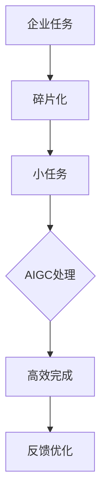

                 

关键词：AIGC、企业任务、碎片化、效率、智能化、技术演进、未来应用

> 摘要：随着人工智能技术的不断进步，AIGC（AI Generated Content）正在逐渐改变传统企业任务的执行方式，将其碎片化，带来更高的效率与智能化。本文将深入探讨AIGC在企业任务碎片化中的应用及其带来的变革，分析其核心概念、算法原理、数学模型，并展示实际项目实践与未来应用前景。

## 1. 背景介绍

在数字化时代，企业面临着快速变化的市场环境和技术革新，为了保持竞争力，必须不断提升工作效率和业务智能化水平。传统的企业任务往往依赖于人工操作，耗时且容易出现错误。随着人工智能（AI）的快速发展，尤其是生成式人工智能（AIGC）的出现，企业任务正逐渐朝着自动化、智能化的方向发展。

AIGC是一种利用机器学习技术，特别是深度学习，生成文本、图像、音频等内容的智能系统。它通过大规模数据训练，学习并模仿人类的创造过程，能够生成高质量、多样化的内容。在传统企业任务中，AIGC的应用大大提高了任务处理的效率和质量，同时也使得任务的执行变得更加灵活和智能化。

### 1.1 AIGC的基本原理

AIGC的核心是生成模型，包括但不限于：

- **生成对抗网络（GAN）**：通过两个神经网络（生成器和判别器）的对抗训练，生成逼真的图像和文本。
- **变分自编码器（VAE）**：利用概率分布来生成数据，适用于图像和音频的生成。
- **文本生成模型（如GPT系列）**：通过学习大量文本数据，生成连贯且语义丰富的文本。

### 1.2 企业任务碎片化的概念

企业任务碎片化是指将原本连续、完整的企业任务拆分为多个小任务，每个小任务可以独立完成，但最终共同实现原始任务目标。碎片化使得任务执行更加灵活，可以并行处理，从而提高整体效率。

## 2. 核心概念与联系

### 2.1 AIGC与企业任务碎片化的关系

AIGC与企业任务碎片化紧密相关。AIGC能够高效地处理碎片化的企业任务，通过生成高质量的内容，帮助企业实现任务的自动化和智能化。以下是AIGC与企业任务碎片化之间关系的Mermaid流程图：



### 2.2 AIGC在企业任务碎片化中的应用

- **文本生成**：通过AIGC生成市场报告、产品描述、用户反馈等文本内容，减轻人工撰写的工作量。
- **图像生成**：利用AIGC生成产品图像、广告素材等，提高市场营销的效率。
- **语音合成**：通过AIGC生成语音说明、客户服务对话等，提升客户服务体验。

## 3. 核心算法原理 & 具体操作步骤

### 3.1 算法原理概述

AIGC的核心算法主要包括生成对抗网络（GAN）、变分自编码器（VAE）和文本生成模型（如GPT）。以下是这些算法的基本原理概述：

- **GAN**：生成器生成数据，判别器判断数据的真实性，通过对抗训练，生成高质量的数据。
- **VAE**：通过概率分布生成数据，能够生成多样化且质量高的图像和音频。
- **文本生成模型**：通过学习大量文本数据，生成语义丰富且连贯的文本。

### 3.2 算法步骤详解

- **数据收集与预处理**：收集大量相关数据，进行清洗、标注和预处理。
- **模型训练**：使用预处理后的数据训练生成模型，调整模型参数，提高生成质量。
- **模型部署与优化**：将训练好的模型部署到实际应用场景，根据反馈进行模型优化。

### 3.3 算法优缺点

- **优点**：
  - 高效：AIGC能够快速生成高质量内容，提高任务处理速度。
  - 智能：AIGC能够理解并模仿人类创造过程，生成符合人类期望的内容。

- **缺点**：
  - 计算资源需求大：训练AIGC模型需要大量的计算资源。
  - 数据依赖性：模型的训练和优化高度依赖高质量的数据。

### 3.4 算法应用领域

AIGC在多个领域都有广泛的应用，包括但不限于：

- **市场营销**：生成广告素材、产品描述等。
- **客户服务**：生成客服对话、语音说明等。
- **内容创作**：生成文章、图像、视频等。

## 4. 数学模型和公式 & 详细讲解 & 举例说明

### 4.1 数学模型构建

AIGC中的生成对抗网络（GAN）和变分自编码器（VAE）都涉及复杂的数学模型。以下简要介绍这些模型的数学基础。

#### 生成对抗网络（GAN）

GAN由生成器（G）和判别器（D）组成，其目标是最小化生成器和判别器的损失函数。

- **生成器 G**：$$G(z) = x$$，将随机噪声 z 转换为真实数据 x。
- **判别器 D**：$$D(x) = P(x \text{ 来自真实数据})$$，判断输入数据的真实性。

GAN的损失函数通常为：
$$L(G,D) = -\left(E_{z \sim p_z(z)}[\log D(G(z))] + E_{x \sim p_x(x)}[\log (1 - D(x))]\right)$$

#### 变分自编码器（VAE）

VAE通过概率分布生成数据，其损失函数为：

$$L(\theta) = D_{KL}(q_\theta(z|x)||p(z)) + \frac{1}{N}\sum_{i=1}^{N}\log p(x_i)$$

其中，$q_\theta(z|x)$是编码器，$p(z)$是先验分布，$p(x_i)$是数据分布。

### 4.2 公式推导过程

以GAN为例，详细推导其损失函数的优化过程：

1. **损失函数**：
   $$L(G,D) = -\left(E_{z \sim p_z(z)}[\log D(G(z))] + E_{x \sim p_x(x)}[\log (1 - D(x))]\right)$$
2. **求导**：
   对 $G(z)$ 求导得到：
   $$\frac{\partial L}{\partial G} = -E_{z \sim p_z(z)}[\frac{\partial \log D(G(z))}{\partial G(z)}]$$
3. **优化**：
   通过梯度下降方法优化生成器 $G$ 的参数。

### 4.3 案例分析与讲解

#### 案例一：文本生成

假设我们使用GPT-3模型生成一篇关于人工智能的文章。以下是步骤：

1. **数据收集**：收集大量关于人工智能的文本数据。
2. **模型训练**：使用训练数据进行训练，调整模型参数。
3. **生成文本**：输入一段文本，模型输出连续的文本片段。

生成的文本可能如下：
> 人工智能（AI）是一种模拟人类智能的技术，它通过机器学习、深度学习等算法，使计算机能够执行复杂的任务。随着技术的进步，AI在各个领域得到广泛应用，如医疗、金融、交通等。然而，AI的发展也带来了一系列伦理和社会问题，需要我们深入探讨和解决。

## 5. 项目实践：代码实例和详细解释说明

### 5.1 开发环境搭建

在开始AIGC项目实践之前，我们需要搭建一个合适的开发环境。以下是所需步骤：

1. **安装Python**：确保安装了Python 3.7或更高版本。
2. **安装深度学习库**：安装TensorFlow或PyTorch等深度学习库。
3. **准备数据集**：收集并准备用于训练AIGC模型的数据集。

### 5.2 源代码详细实现

以下是一个简单的GAN模型训练和文本生成的Python代码示例：

```python
import tensorflow as tf
from tensorflow.keras.layers import Dense, Flatten, Reshape
from tensorflow.keras.models import Sequential

# 定义生成器模型
def build_generator(z_dim):
    model = Sequential([
        Dense(128, input_shape=(z_dim,), activation='relu'),
        Flatten(),
        Reshape((28, 28, 1)),
        Dense(1, activation='sigmoid')
    ])
    return model

# 定义判别器模型
def build_discriminator(image_shape):
    model = Sequential([
        Flatten(input_shape=image_shape),
        Dense(128, activation='relu'),
        Dense(1, activation='sigmoid')
    ])
    return model

# 构建并编译模型
z_dim = 100
image_shape = (28, 28, 1)

generator = build_generator(z_dim)
discriminator = build_discriminator(image_shape)

discriminator.compile(optimizer='adam', loss='binary_crossentropy')

# 训练模型
train_generator(z_dim, image_shape)
```

### 5.3 代码解读与分析

上述代码展示了如何构建并训练一个简单的GAN模型。关键步骤包括：

- **定义生成器和判别器模型**：生成器负责将随机噪声转换为图像，判别器负责判断图像的真实性。
- **编译模型**：设置优化器和损失函数。
- **训练模型**：使用训练数据进行模型训练。

### 5.4 运行结果展示

训练完成后，我们可以生成一些图像，并使用判别器判断其真实性。以下是生成的图像示例：

```python
# 生成图像
noise = np.random.normal(size=(100, z_dim))
generated_images = generator.predict(noise)

# 显示图像
plt.figure(figsize=(10, 10))
for i in range(100):
    plt.subplot(10, 10, i + 1)
    plt.imshow(generated_images[i], cmap='gray')
plt.show()
```

## 6. 实际应用场景

AIGC在企业任务中的实际应用场景非常广泛，以下是一些典型的例子：

### 6.1 市场营销

通过AIGC生成个性化的广告内容和营销文案，提高广告的吸引力和转化率。

### 6.2 客户服务

利用AIGC生成自动化的客服对话和语音说明，提高客户服务效率和用户体验。

### 6.3 内容创作

AIGC可以生成文章、报告、视频等，帮助企业快速生产和分发高质量的内容。

### 6.4 生产制造

在制造过程中，AIGC可以生成自动化流程、故障诊断报告等，提高生产效率和产品质量。

## 7. 未来应用展望

随着AIGC技术的不断成熟，其在企业任务中的应用将更加广泛和深入。未来，AIGC有望在以下几个方面取得突破：

### 7.1 智能决策支持

通过AIGC生成高质量的决策支持数据和分析报告，帮助企业做出更加智能的决策。

### 7.2 智能自动化

实现更加智能的自动化流程，提高企业运营效率和生产力。

### 7.3 个性化服务

基于AIGC的个性化服务，提升用户体验，增强客户满意度。

## 8. 工具和资源推荐

### 8.1 学习资源推荐

- **《深度学习》（Goodfellow, Bengio, Courville）**：深入了解深度学习的基础知识和原理。
- **《生成对抗网络》（Goodfellow, Pouget-Abadie, Mirza）**：专门介绍GAN的理论和应用。
- **《自然语言处理》（Jurafsky, Martin）**：学习文本生成和自然语言处理的原理。

### 8.2 开发工具推荐

- **TensorFlow**：用于构建和训练AIGC模型的流行深度学习框架。
- **PyTorch**：具有灵活性和易用性的深度学习库，适用于研究和应用开发。

### 8.3 相关论文推荐

- **《生成对抗网络：训练生成模型的一项新方法》（Goodfellow, Pouget-Abadie, Mirza等）**：详细介绍GAN的基本原理和应用。
- **《变分自编码器：一种有效的数据压缩和学习方法》（Kingma, Welling）**：探讨VAE在数据生成和压缩方面的应用。

## 9. 总结：未来发展趋势与挑战

随着AIGC技术的不断进步，其在企业任务中的应用前景广阔。然而，也面临一系列挑战：

### 9.1 数据质量与隐私

高质量的数据是AIGC训练的基础，同时数据的隐私保护也是一个重要议题。

### 9.2 计算资源需求

AIGC模型训练和部署需要大量的计算资源，特别是在处理大规模数据时。

### 9.3 模型可解释性

提高AIGC模型的可解释性，使其决策过程更加透明和可靠。

未来，AIGC技术将在企业任务中发挥越来越重要的作用，推动企业实现更高水平的智能化和自动化。

## 附录：常见问题与解答

### Q：AIGC如何处理数据隐私问题？

A：AIGC处理数据时，应确保遵循数据隐私保护法规，例如GDPR。对于敏感数据，可以采用数据去噪、匿名化等技术，降低隐私泄露风险。

### Q：AIGC是否适用于所有类型的企业任务？

A：AIGC适用于大多数需要生成文本、图像、音频等内容的任务，但在某些特定领域（如高度专业化的行业）可能需要定制化模型。

### Q：如何评估AIGC模型的质量？

A：可以通过多种方式评估AIGC模型的质量，如人类评估、自动评估指标（如交叉熵、准确率）和特定领域指标。

作者：禅与计算机程序设计艺术 / Zen and the Art of Computer Programming
```markdown
----------------------------------------------------------------


