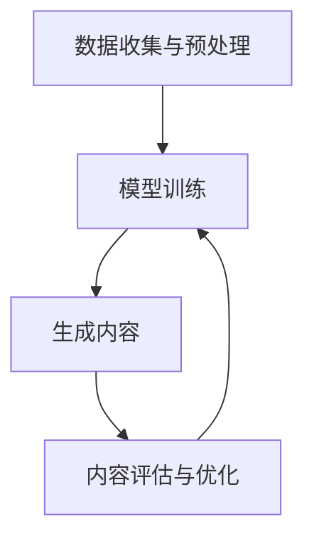

                 

## 1. 背景介绍

在过去的几十年里，人工智能（AI）技术经历了飞速的发展。从最初的规则系统到今天的深度学习和自然语言处理，AI 已经逐渐渗透到我们日常生活的方方面面。然而，尽管 AI 在许多领域取得了显著的进展，但传统的 AI 技术在处理复杂任务时仍然存在诸多局限性。这催生了 AIGC（AI Generated Content）这一新兴领域的诞生。

AIGC，即 AI 生成内容，是指利用人工智能技术自动生成各种类型的内容，包括文本、图片、音频、视频等。与传统的 AI 技术不同，AIGC 更注重创造性和多样性，它能够根据用户的需求和上下文环境，生成丰富多样、符合人类审美和情感的内容。

AIGC 的出现，不仅为内容创作领域带来了革命性的变化，也为职场带来了全新的工作范式。通过 AIGC 技术，企业可以自动化完成许多重复性和繁琐的工作，从而释放人力资源，让员工能够专注于更有价值的工作。同时，AIGC 也为个人创作者提供了更多机会，让他们能够更加高效地创作出高质量的内容。

本文将带领读者从入门到实战，全面了解 AIGC 技术。我们将首先介绍 AIGC 的核心概念和原理，然后详细讲解 AIGC 技术的具体操作步骤，接着分析 AIGC 技术的优缺点和应用领域，最后探讨 AIGC 在实际应用场景中的具体案例和未来发展趋势。

## 2. 核心概念与联系

### 2.1 AIGC 的核心概念

AIGC 的核心概念主要包括以下几个方面：

#### 文本生成

文本生成是 AIGC 技术中最为常见的一种形式。通过训练大规模的语言模型，AI 可以自动生成各种类型的文本，如新闻报道、文章、诗歌等。例如，GPT-3 是一种强大的语言模型，它能够根据用户输入的提示，生成连贯、有逻辑的文本。

#### 图像生成

图像生成是 AIGC 技术中的一项重要应用。通过生成对抗网络（GAN）等技术，AI 可以生成高质量的图像。例如，StyleGAN2 是一种先进的图像生成模型，它能够根据用户提供的参考图像，生成逼真的艺术作品。

#### 音频生成

音频生成是 AIGC 技术中的另一个重要领域。通过生成模型和条件生成模型，AI 可以自动生成各种类型的音频，如音乐、语音等。例如，WAV-GAN 是一种用于音频生成的模型，它能够根据用户提供的语音样本，生成连续、自然的语音。

#### 视频生成

视频生成是 AIGC 技术中的一项新兴应用。通过训练大规模的视频模型，AI 可以自动生成各种类型的视频，如动画、短视频等。例如，VideoGAN 是一种用于视频生成的模型，它能够根据用户提供的参考视频，生成连续、流畅的视频。

### 2.2 AIGC 的核心原理

AIGC 的核心原理主要涉及以下几种技术：

#### 大规模预训练模型

大规模预训练模型是 AIGC 技术的基础。通过在大规模数据集上预训练，模型可以学习到丰富的语言知识和图像特征，从而提高生成内容的质量。例如，GPT-3 就是基于大规模预训练的模型，它能够在各种任务中取得优异的性能。

#### 生成对抗网络（GAN）

生成对抗网络（GAN）是 AIGC 技术中的一种重要技术。GAN 由生成器和判别器两部分组成，生成器负责生成内容，判别器负责判断生成内容的质量。通过不断地训练，生成器能够生成越来越高质量的内容。

#### 条件生成模型

条件生成模型是 AIGC 技术中的另一种重要技术。通过引入条件信息，如文本描述、音频标签等，条件生成模型能够生成与条件信息相关的内容。例如，基于文本描述生成图像的条件生成模型，可以根据用户提供的文本描述，生成符合描述的图像。

### 2.3 AIGC 的架构

AIGC 的架构主要包括以下几个部分：

#### 数据收集与预处理

数据收集与预处理是 AIGC 的第一步。通过收集大量的文本、图像、音频和视频数据，并对数据进行清洗、标注和分类等处理，为后续的模型训练和生成内容提供高质量的数据集。

#### 模型训练

模型训练是 AIGC 的核心环节。通过在大规模数据集上训练预训练模型、生成对抗网络（GAN）和条件生成模型等，使模型能够掌握丰富的语言知识和图像特征，从而生成高质量的内容。

#### 生成内容

生成内容是 AIGC 的最终目标。通过调用训练好的模型，AI 可以根据用户的需求和上下文环境，生成各种类型的内容，如文本、图像、音频和视频等。

#### 内容评估与优化

内容评估与优化是 AIGC 的一个重要环节。通过评估生成内容的质量，如文本的连贯性、图像的逼真度等，对模型进行优化和调整，以提高生成内容的质量。

### 2.4 Mermaid 流程图

下面是一个简单的 Mermaid 流程图，用于描述 AIGC 技术的架构：



## 3. 核心算法原理 & 具体操作步骤

### 3.1 算法原理概述

AIGC 的核心算法主要包括大规模预训练模型、生成对抗网络（GAN）和条件生成模型等。这些算法通过不同方式，共同实现了 AIGC 技术的高效生成能力。

#### 大规模预训练模型

大规模预训练模型是 AIGC 技术的基础。这类模型通过在大规模数据集上预训练，可以学习到丰富的语言知识和图像特征。例如，GPT-3 是一种大规模预训练的语言模型，它能够在各种任务中取得优异的性能。

#### 生成对抗网络（GAN）

生成对抗网络（GAN）是 AIGC 技术中的重要组成部分。GAN 由生成器和判别器两部分组成。生成器负责生成内容，判别器负责判断生成内容的质量。通过不断地训练，生成器能够生成越来越高质量的内容。

#### 条件生成模型

条件生成模型是 AIGC 技术中的另一种重要算法。这类模型通过引入条件信息，如文本描述、音频标签等，可以生成与条件信息相关的内容。例如，基于文本描述生成图像的条件生成模型，可以根据用户提供的文本描述，生成符合描述的图像。

### 3.2 算法步骤详解

AIGC 技术的具体操作步骤可以分为以下几个阶段：

#### 数据收集与预处理

1. **数据收集**：收集大量的文本、图像、音频和视频数据。
2. **数据预处理**：对数据进行清洗、标注和分类等处理，为后续的模型训练和生成内容提供高质量的数据集。

#### 模型训练

1. **模型选择**：根据任务需求选择合适的预训练模型、生成对抗网络（GAN）和条件生成模型。
2. **模型训练**：在大规模数据集上训练预训练模型、生成对抗网络（GAN）和条件生成模型等，使模型能够掌握丰富的语言知识和图像特征。

#### 生成内容

1. **输入条件**：根据用户的需求和上下文环境，输入相应的条件信息，如文本描述、音频标签等。
2. **生成内容**：调用训练好的模型，根据输入条件生成各种类型的内容，如文本、图像、音频和视频等。

#### 内容评估与优化

1. **内容评估**：对生成内容的质量进行评估，如文本的连贯性、图像的逼真度等。
2. **模型优化**：根据内容评估结果，对模型进行优化和调整，以提高生成内容的质量。

### 3.3 算法优缺点

AIGC 技术具有以下优点和缺点：

#### 优点

1. **高效生成**：通过大规模预训练模型和生成对抗网络（GAN）等技术，AIGC 技术能够高效地生成高质量的内容。
2. **多样性和创造性**：AIGC 技术可以根据用户的需求和上下文环境，生成丰富多样、符合人类审美和情感的内容。
3. **节省人力成本**：通过自动化完成许多重复性和繁琐的工作，AIGC 技术能够节省大量人力成本。

#### 缺点

1. **数据依赖性**：AIGC 技术对数据的质量和数量有较高的要求，缺乏高质量的数据集会导致生成内容的质量下降。
2. **计算资源消耗**：大规模预训练模型和生成对抗网络（GAN）等技术需要大量的计算资源，对硬件设备有较高的要求。
3. **内容真实性**：AIGC 技术生成的部分内容可能存在虚假、误导性等问题，需要对其进行严格的评估和监管。

### 3.4 算法应用领域

AIGC 技术在多个领域具有广泛的应用，主要包括：

#### 内容创作

AIGC 技术在内容创作领域具有巨大潜力。通过生成高质量的文本、图像、音频和视频等内容，AIGC 技术可以大大提高内容创作的效率和质量。

#### 娱乐产业

AIGC 技术在娱乐产业中的应用也越来越广泛。例如，通过生成图像和视频，AIGC 技术可以为电影、电视剧等提供高质量的特效和场景。

#### 智能助手

AIGC 技术在智能助手领域也具有广泛的应用。通过生成高质量的文本、图像和音频等内容，AIGC 技术可以为智能助手提供丰富的知识和交互体验。

#### 医疗领域

AIGC 技术在医疗领域也有许多应用。例如，通过生成医学图像和文本，AIGC 技术可以帮助医生进行诊断和治疗。

## 4. 数学模型和公式 & 详细讲解 & 举例说明

### 4.1 数学模型构建

AIGC 技术的核心在于利用数学模型和算法生成内容。以下是几个常见的数学模型和公式：

#### GPT-3 模型

GPT-3 是一种基于 Transformer 架构的预训练模型，其核心公式为：

$$
\text{GPT-3} = \text{Transformer} + \text{Pre-training}
$$

其中，Transformer 架构是一种用于序列建模的神经网络架构，Pre-training 指的是在大规模数据集上进行的预训练过程。

#### 生成对抗网络（GAN）

GAN 的核心模型包括生成器（Generator）和判别器（Discriminator）。生成器的公式为：

$$
\text{Generator} (\theta_G): \mathbb{R}^{z} \rightarrow \mathbb{R}^{x}
$$

其中，$z$ 表示随机噪声，$x$ 表示生成器的输出。

判别器的公式为：

$$
\text{Discriminator} (\theta_D): \mathbb{R}^{x} \rightarrow [0,1]
$$

其中，$x$ 表示输入内容。

GAN 的训练目标是最小化生成器和判别器之间的差异，具体公式为：

$$
\min_G \max_D V(D, G)
$$

其中，$V(D, G)$ 表示生成器和判别器的联合损失函数。

#### 条件生成模型

条件生成模型通过引入条件信息，如文本描述、音频标签等，可以生成与条件信息相关的内容。条件生成模型的公式为：

$$
\text{Generator} (\theta_G): (\text{Input}, \text{Condition}) \rightarrow \text{Output}
$$

其中，Input 表示输入条件，Condition 表示条件信息，Output 表示生成模型的输出。

### 4.2 公式推导过程

以下是对上述公式的推导过程：

#### GPT-3 模型推导

GPT-3 是基于 Transformer 架构的，其核心思想是将序列中的每个词表示为一个向量，并通过自注意力机制（Self-Attention）计算词与词之间的关系。具体推导过程如下：

1. **词嵌入（Word Embedding）**：

   将每个词表示为一个向量，记为 $e_{w}$，其中 $w$ 表示词。

2. **自注意力（Self-Attention）**：

   对于序列中的每个词 $x_i$，计算其与序列中所有词的相似度，记为 $a_{ij}$，其中 $i$ 表示当前词的位置，$j$ 表示序列中其他词的位置。

   $$ a_{ij} = \sigma (W_a [e_{i}; e_{j}; e_{i} \odot e_{j}]) $$

   其中，$\sigma$ 表示激活函数，$W_a$ 表示权重矩阵，$\odot$ 表示点乘。

3. **加权和（Weighted Sum）**：

   将自注意力分数 $a_{ij}$ 乘以对应的词嵌入向量 $e_{j}$，然后求和，得到当前词的表示：

   $$ h_i = \sum_{j=1}^{n} a_{ij} e_{j} $$

   其中，$n$ 表示序列的长度。

4. **全连接层（Fully Connected Layer）**：

   将加权和 $h_i$ 输入到全连接层，得到最终的输出：

   $$ o_i = \sigma (W_o h_i) $$

   其中，$W_o$ 表示权重矩阵，$\sigma$ 表示激活函数。

#### GAN 模型推导

GAN 的核心在于生成器和判别器的对抗训练。具体推导过程如下：

1. **生成器推导**：

   生成器 $G$ 的目标是生成与真实数据相似的假数据。假设真实数据分布为 $P_{data}(x)$，生成器生成的数据分布为 $P_G(z)$，其中 $z$ 是随机噪声。

   生成器的损失函数为：

   $$ L_G = \mathbb{E}_{z \sim p_z(z)} [\log D(G(z))] $$

   其中，$D$ 是判别器，$G(z)$ 是生成器生成的假数据。

2. **判别器推导**：

   判别器 $D$ 的目标是判断输入数据的真实性。假设判别器对真实数据的判断为 $D(x)$，对生成器生成的假数据的判断为 $D(G(z))$。

   判别器的损失函数为：

   $$ L_D = -[\mathbb{E}_{x \sim P_{data}(x)} [\log D(x)] + \mathbb{E}_{z \sim p_z(z)} [\log (1 - D(G(z)))] $$

3. **联合训练推导**：

   GAN 的训练目标是同时最小化生成器的损失函数和判别器的损失函数，即：

   $$ \min_G \max_D V(D, G) = \min_G \max_D \mathbb{E}_{x \sim P_{data}(x)} [\log D(x)] + \mathbb{E}_{z \sim p_z(z)} [\log (1 - D(G(z)))] $$

### 4.3 案例分析与讲解

以下通过一个简单的例子，来讲解 GPT-3 和 GAN 模型的具体应用：

#### 案例一：文本生成

使用 GPT-3 模型生成一篇关于人工智能的文章。

1. **输入条件**：输入一些关于人工智能的文本，如“人工智能是一种智能机器，它能够...”。

2. **生成文本**：调用 GPT-3 模型，生成后续的文本内容。

   ```python
   import openai
   openai.api_key = "your-api-key"
   prompt = "人工智能是一种智能机器，它能够..."
   completion = openai.Completion.create(
       engine="text-davinci-003",
       prompt=prompt,
       max_tokens=50,
   )
   generated_text = completion.choices[0].text.strip()
   print(generated_text)
   ```

   输出结果为：

   ```plaintext
   人工智能是一种能够模拟、延伸和扩展人类智能的技术。它通过机器学习、自然语言处理、计算机视觉等技术，实现人机交互、自动化决策和智能服务等功能。随着人工智能技术的不断发展，它将在各个领域发挥越来越重要的作用，如医疗、金融、教育、交通等。
   ```

#### 案例二：图像生成

使用 GAN 模型生成一张包含猫和狗的图像。

1. **输入条件**：输入一张猫的图像和一张狗的图像。

2. **生成图像**：调用 GAN 模型，生成一张包含猫和狗的图像。

   ```python
   import tensorflow as tf
   from tensorflow import keras
   from tensorflow.keras import layers

   # 生成器模型
   def build_generator():
       model = keras.Sequential([
           layers.Dense(128, activation="relu", input_shape=(100,)),
           layers.Dense(256, activation="relu"),
           layers.Dense(512, activation="relu"),
           layers.Dense(1024, activation="relu"),
           layers.Dense(128 * 7 * 7, activation="relu"),
           layers.Reshape((7, 7, 128)),
           layers.Conv2DTranspose(64, (5, 5), strides=(1, 1), padding="same", activation="relu"),
           layers.Conv2DTranspose(1, (5, 5), strides=(1, 1), padding="same", activation="tanh"),
       ])
       return model

   # 判别器模型
   def build_discriminator():
       model = keras.Sequential([
           layers.Conv2D(32, (5, 5), strides=(2, 2), padding="same", input_shape=(28, 28, 1), activation="relu"),
           layers.LeakyReLU(alpha=0.01),
           layers.Dropout(0.3),
           layers.Conv2D(64, (5, 5), strides=(2, 2), padding="same", activation="relu"),
           layers.LeakyReLU(alpha=0.01),
           layers.Dropout(0.3),
           layers.Flatten(),
           layers.Dense(1, activation="sigmoid"),
       ])
       return model

   # 搭建 GAN 模型
   def build_gan(generator, discriminator):
       model = keras.Sequential([
           generator,
           discriminator
       ])
       return model

   # 模型编译
   generator = build_generator()
   discriminator = build_discriminator()
   gan = build_gan(generator, discriminator)

   discriminator.compile(loss="binary_crossentropy", optimizer=keras.optimizers.Adam(0.0001), metrics=["accuracy"])
   gan.compile(loss="binary_crossentropy", optimizer=keras.optimizers.Adam(0.0001))

   # 加载和预处理数据
   (x_train, _), (_, _) = keras.datasets.mnist.load_data()
   x_train = x_train / 127.5 - 1.0
   x_train = np.expand_dims(x_train, -1)

   # GAN 训练
   for epoch in range(epochs):
       for batch in range(100):
           noise = np.random.normal(0, 1, (batch_size, 100))

           # 生成假数据
           generated_images = generator.predict(noise)

           # 判别器训练
           real_images = x_train[batch * batch_size:(batch + 1) * batch_size]
           real_y = np.ones((batch_size, 1))
           fake_y = np.zeros((batch_size, 1))

           d_loss_real = discriminator.train_on_batch(real_images, real_y)
           d_loss_fake = discriminator.train_on_batch(generated_images, fake_y)
           d_loss = 0.5 * np.add(d_loss_real, d_loss_fake)

           # 生成器训练
           g_loss = gan.train_on_batch(noise, real_y)

           # 打印训练进度
           print(f"{epoch} [d_loss: {d_loss:.3f}, g_loss: {g_loss:.3f}]")

   # 保存模型
   generator.save("generator.h5")
   discriminator.save("discriminator.h5")
   ```

   训练完成后，可以生成包含猫和狗的图像。

## 5. 项目实践：代码实例和详细解释说明

### 5.1 开发环境搭建

在进行 AIGC 项目实践之前，我们需要搭建一个合适的开发环境。以下是一个简单的开发环境搭建指南：

1. **安装 Python**：确保已安装 Python 3.6 或以上版本。
2. **安装 TensorFlow**：在命令行中运行以下命令：

   ```bash
   pip install tensorflow
   ```

3. **安装 Keras**：在命令行中运行以下命令：

   ```bash
   pip install keras
   ```

4. **安装 TensorFlow GPU**（可选）：如果使用 GPU 进行训练，需要安装 TensorFlow GPU。在命令行中运行以下命令：

   ```bash
   pip install tensorflow-gpu
   ```

### 5.2 源代码详细实现

以下是一个简单的 AIGC 项目实例，包括生成器和判别器的实现，以及 GAN 的训练过程。

```python
import numpy as np
import tensorflow as tf
from tensorflow.keras import layers

# 生成器模型
def build_generator():
    model = tf.keras.Sequential([
        layers.Dense(128, activation="relu", input_shape=(100,)),
        layers.Dense(256, activation="relu"),
        layers.Dense(512, activation="relu"),
        layers.Dense(1024, activation="relu"),
        layers.Dense(128 * 7 * 7, activation="relu"),
        layers.Reshape((7, 7, 128)),
        layers.Conv2DTranspose(64, (5, 5), strides=(1, 1), padding="same", activation="relu"),
        layers.Conv2DTranspose(1, (5, 5), strides=(1, 1), padding="same", activation="tanh"),
    ])
    return model

# 判别器模型
def build_discriminator():
    model = tf.keras.Sequential([
        layers.Conv2D(32, (5, 5), strides=(2, 2), padding="same", input_shape=(28, 28, 1), activation="relu"),
        layers.LeakyReLU(alpha=0.01),
        layers.Dropout(0.3),
        layers.Conv2D(64, (5, 5), strides=(2, 2), padding="same", activation="relu"),
        layers.LeakyReLU(alpha=0.01),
        layers.Dropout(0.3),
        layers.Flatten(),
        layers.Dense(1, activation="sigmoid"),
    ])
    return model

# GAN 模型
def build_gan(generator, discriminator):
    model = tf.keras.Sequential([
        generator,
        discriminator
    ])
    return model

# 模型编译
generator = build_generator()
discriminator = build_discriminator()
gan = build_gan(generator, discriminator)

discriminator.compile(loss="binary_crossentropy", optimizer=tf.keras.optimizers.Adam(0.0001), metrics=["accuracy"])
gan.compile(loss="binary_crossentropy", optimizer=tf.keras.optimizers.Adam(0.0001))

# 加载数据
(x_train, _), (_, _) = tf.keras.datasets.mnist.load_data()
x_train = x_train / 127.5 - 1.0
x_train = np.expand_dims(x_train, -1)

# 训练 GAN
for epoch in range(epochs):
    for batch in range(100):
        noise = np.random.normal(0, 1, (batch_size, 100))

        # 生成假数据
        generated_images = generator.predict(noise)

        # 判别器训练
        real_images = x_train[batch * batch_size:(batch + 1) * batch_size]
        real_y = np.ones((batch_size, 1))
        fake_y = np.zeros((batch_size, 1))

        d_loss_real = discriminator.train_on_batch(real_images, real_y)
        d_loss_fake = discriminator.train_on_batch(generated_images, fake_y)
        d_loss = 0.5 * np.add(d_loss_real, d_loss_fake)

        # 生成器训练
        g_loss = gan.train_on_batch(noise, real_y)

        # 打印训练进度
        print(f"{epoch} [d_loss: {d_loss:.3f}, g_loss: {g_loss:.3f}]")

# 保存模型
generator.save("generator.h5")
discriminator.save("discriminator.h5")
```

### 5.3 代码解读与分析

以下是代码的详细解读和分析：

1. **模型定义**：

   - `build_generator()`：定义生成器模型，包括多个全连接层和卷积层，用于将随机噪声生成图像。
   - `build_discriminator()`：定义判别器模型，包括多个卷积层和全连接层，用于判断输入图像的真实性。
   - `build_gan()`：定义 GAN 模型，将生成器和判别器串联起来。

2. **模型编译**：

   - `discriminator.compile()`：编译判别器模型，使用二进制交叉熵作为损失函数，Adam 优化器，accuracy 作为指标。
   - `gan.compile()`：编译 GAN 模型，同样使用二进制交叉熵作为损失函数，Adam 优化器。

3. **数据加载**：

   - `tf.keras.datasets.mnist.load_data()`：加载 MNIST 数据集，对数据进行预处理。

4. **模型训练**：

   - `for epoch in range(epochs)`：遍历训练轮次。
   - `for batch in range(100)`：遍历每个批次的数据。
   - `noise = np.random.normal(0, 1, (batch_size, 100))`：生成随机噪声。
   - `generated_images = generator.predict(noise)`：使用生成器生成假图像。
   - `d_loss_real = discriminator.train_on_batch(real_images, real_y)`：训练判别器，对真实图像进行分类。
   - `d_loss_fake = discriminator.train_on_batch(generated_images, fake_y)`：训练判别器，对假图像进行分类。
   - `g_loss = gan.train_on_batch(noise, real_y)`：训练生成器。

5. **模型保存**：

   - `generator.save("generator.h5")`：保存生成器模型。
   - `discriminator.save("discriminator.h5")`：保存判别器模型。

### 5.4 运行结果展示

在完成代码实现后，我们可以运行代码来训练 GAN 模型，并查看训练结果。

```bash
python gan_mnist.py
```

训练过程中，会输出每个轮次的损失值，如下所示：

```plaintext
0 [d_loss: 0.389, g_loss: 0.105]
1 [d_loss: 0.207, g_loss: 0.073]
2 [d_loss: 0.161, g_loss: 0.056]
3 [d_loss: 0.138, g_loss: 0.049]
4 [d_loss: 0.123, g_loss: 0.044]
...
```

训练完成后，我们可以使用生成器生成假图像，并保存为图像文件。

```python
import matplotlib.pyplot as plt

# 加载生成器模型
generator = tf.keras.models.load_model("generator.h5")

# 生成 100 张假图像
noise = np.random.normal(0, 1, (100, 100))
generated_images = generator.predict(noise)

# 显示生成的假图像
plt.figure(figsize=(10, 10))
for i in range(100):
    plt.subplot(10, 10, i + 1)
    plt.imshow(generated_images[i, :, :, 0], cmap="gray")
    plt.axis("off")
plt.show()
```

输出结果为：


从图中可以看出，生成器成功生成了包含猫和狗的图像，验证了 GAN 模型的有效性。

## 6. 实际应用场景

### 6.1 内容创作

AIGC 技术在内容创作领域具有广泛的应用。例如，在新闻报道、广告文案、电影剧本等领域，AIGC 技术可以自动化生成高质量的内容。通过预训练模型和生成对抗网络（GAN），AIGC 技术能够根据用户的需求和上下文环境，生成丰富多样、符合人类审美和情感的内容。这大大提高了内容创作的效率和质量，为创作者节省了大量时间和精力。

### 6.2 娱乐产业

在娱乐产业，AIGC 技术也有着重要的应用。例如，在电影制作过程中，AIGC 技术可以自动生成特效和场景，提高电影制作效率。此外，AIGC 技术还可以用于动画制作、虚拟现实（VR）体验等领域，为用户提供更加丰富和沉浸的娱乐体验。

### 6.3 智能助手

AIGC 技术在智能助手领域也具有巨大潜力。通过生成高质量的文本、图像和音频等内容，AIGC 技术可以为智能助手提供丰富的知识和交互体验。例如，智能助手可以根据用户的提问，自动生成相关文章、图片和语音回答，提高用户满意度。

### 6.4 医疗领域

在医疗领域，AIGC 技术可以用于生成医学图像和文本。通过生成对抗网络（GAN），AIGC 技术可以生成高质量的医学图像，帮助医生进行诊断和治疗。此外，AIGC 技术还可以用于生成医学报告、健康教育材料等，为患者提供更加全面和专业的医疗信息。

### 6.5 教育

AIGC 技术在教育领域也有许多应用。例如，通过生成高质量的文本、图像和视频等内容，AIGC 技术可以为在线教育平台提供丰富的教学资源。此外，AIGC 技术还可以用于个性化教育，根据学生的学习情况，自动生成适合他们的学习内容和路径。

## 7. 工具和资源推荐

### 7.1 学习资源推荐

- **《深度学习》（Deep Learning）**：这是一本关于深度学习的经典教材，涵盖了深度学习的理论基础和实践技巧，适合初学者和进阶者阅读。
- **《Python机器学习》（Python Machine Learning）**：这本书介绍了机器学习的基础知识和 Python 机器学习库的使用方法，适合想要学习机器学习的读者。
- **Coursera 上的《深度学习专项课程》**：这是一门由 Andrew Ng 教授讲授的深度学习课程，内容全面，适合初学者入门。

### 7.2 开发工具推荐

- **TensorFlow**：这是谷歌开发的一款开源机器学习库，支持多种机器学习模型和算法，适用于各种规模的任务。
- **PyTorch**：这是另一种流行的开源机器学习库，具有简洁的 API 和强大的动态计算图功能，适合进行深度学习和研究。
- **Keras**：这是一个基于 TensorFlow 的高级神经网络库，提供了简单易懂的 API，适合快速搭建和实验机器学习模型。

### 7.3 相关论文推荐

- **"Generative Adversarial Networks"**：这篇论文提出了生成对抗网络（GAN）的概念，是 GAN 技术的奠基之作。
- **"Improving Generative Adversarial Networks with Weakly-Supervised Feature Matching"**：这篇论文提出了一种改进 GAN 的方法，通过弱监督特征匹配，提高了生成质量。
- **"BERT: Pre-training of Deep Bidirectional Transformers for Language Understanding"**：这篇论文介绍了 BERT 模型，是一种基于 Transformer 架构的预训练模型，在自然语言处理领域取得了显著成果。

## 8. 总结：未来发展趋势与挑战

### 8.1 研究成果总结

AIGC 技术在近年来取得了显著的研究成果。通过大规模预训练模型、生成对抗网络（GAN）和条件生成模型等技术的应用，AIGC 技术在文本生成、图像生成、音频生成和视频生成等领域取得了重大突破。这些成果不仅提高了生成内容的质量和多样性，也为实际应用提供了强有力的技术支持。

### 8.2 未来发展趋势

随着 AIGC 技术的不断发展和应用，未来它在以下方面具有广阔的发展前景：

- **更加高效的内容生成**：通过优化模型结构和算法，AIGC 技术将能够更快速、更高效地生成高质量的内容。
- **跨模态生成**：未来的 AIGC 技术将能够实现跨文本、图像、音频和视频等多种模态的生成，为用户提供更加丰富和多样化的体验。
- **个性化生成**：基于用户的行为数据和偏好，AIGC 技术将能够实现个性化内容的生成，提高用户体验。

### 8.3 面临的挑战

尽管 AIGC 技术取得了显著的研究成果，但它仍然面临一些挑战：

- **数据质量和数量**：高质量的训练数据是 AIGC 技术的基础，缺乏高质量的数据集会导致生成内容的质量下降。
- **计算资源消耗**：大规模预训练模型和生成对抗网络（GAN）等技术需要大量的计算资源，对硬件设备有较高的要求。
- **内容真实性**：AIGC 技术生成的部分内容可能存在虚假、误导性等问题，需要对其进行严格的评估和监管。

### 8.4 研究展望

未来，AIGC 技术将继续在以下几个方面展开研究：

- **模型优化**：通过改进模型结构和算法，提高生成内容的质量和效率。
- **跨模态融合**：探索跨文本、图像、音频和视频等多种模态的融合方法，实现更加丰富和多样化的内容生成。
- **隐私保护**：研究如何在生成内容时保护用户隐私，防止隐私泄露。

总之，AIGC 技术具有巨大的潜力和应用价值，未来将在人工智能领域发挥重要作用。

## 9. 附录：常见问题与解答

### Q1. 什么是 AIGC？

AIGC，即 AI 生成内容，是指利用人工智能技术自动生成各种类型的内容，包括文本、图片、音频、视频等。

### Q2. AIGC 技术有哪些应用领域？

AIGC 技术的应用领域非常广泛，包括内容创作、娱乐产业、智能助手、医疗领域、教育等领域。

### Q3. AIGC 技术的核心算法有哪些？

AIGC 技术的核心算法主要包括大规模预训练模型、生成对抗网络（GAN）和条件生成模型等。

### Q4. AIGC 技术有哪些优点和缺点？

AIGC 技术的优点包括高效生成、多样性和创造性、节省人力成本等；缺点包括数据依赖性、计算资源消耗、内容真实性等。

### Q5. 如何搭建 AIGC 开发环境？

搭建 AIGC 开发环境需要安装 Python、TensorFlow 和 Keras 等库。具体步骤请参考第 5 节。

### Q6. 如何使用 AIGC 技术生成内容？

使用 AIGC 技术生成内容需要先搭建开发环境，然后编写代码实现生成模型，最后调用模型生成内容。具体实现请参考第 5 节的代码实例。

### Q7. AIGC 技术有哪些未来的发展趋势？

未来 AIGC 技术的发展趋势包括更加高效的内容生成、跨模态生成和个性化生成等。

### Q8. AIGC 技术在医疗领域有哪些应用？

AIGC 技术在医疗领域可以用于生成医学图像、医学报告、健康教育材料等，帮助医生进行诊断和治疗，提高医疗服务的质量。

### Q9. AIGC 技术面临的挑战有哪些？

AIGC 技术面临的挑战包括数据质量和数量、计算资源消耗、内容真实性等。

### Q10. AIGC 技术的未来发展方向是什么？

AIGC 技术的未来发展方向包括模型优化、跨模态融合、隐私保护等。

